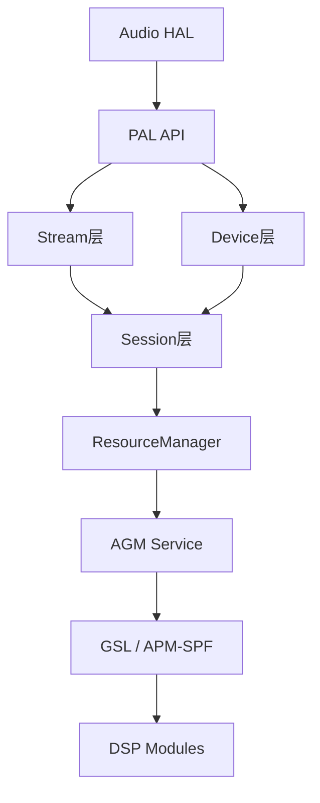
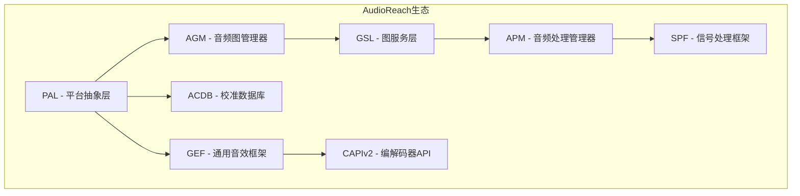
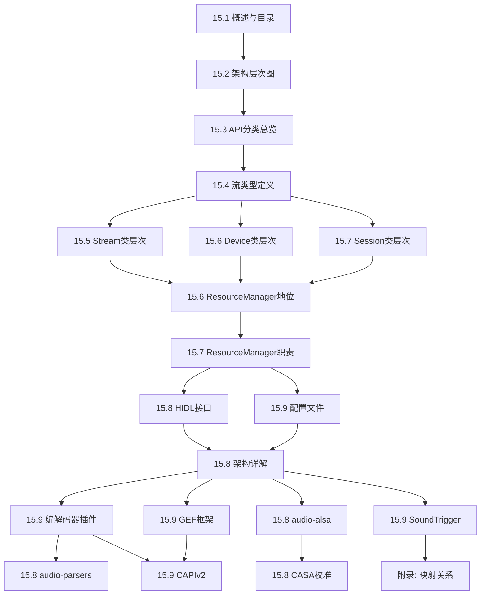

## 15.1 PAL 概述与目录

> [← 上一个](../14_Bluetooth_Audio/README.md) | [← 返回15章](README.md) | [返回导航](../README.md) | [下一个 →](15_15.2_架构层次图.md)

---

## 15.1.1 PAL 的定义与定位

PAL (Porting Audio Layer / Platform Abstraction Layer) 是高通 Qualcomm AudioReach 架构的核心平台抽象层，位于 Android Audio HAL 与底层 AGM (Audio Graph Manager) / GSL (Graph Service Layer) 之间。PAL 封装了音频流管理、设备路由、会话控制、音量调节、校准数据加载等核心功能，为上层 HAL 提供统一的 C API 接口，同时向下通过 AGM Service 与 DSP Graph Service Layer(GSL) 和 APM(SPF) 交互。

PAL 的核心抽象模型基于三层分离架构：

- **Stream 层**：代表一条音频数据流，对应上层的一个 use case（如媒体播放、语音通话、语音唤醒等），`pal_stream_type_t` 定义了 30+ 流类型
- **Session 层**：代表一个音频会话，是 Stream 与底层 DSP Graph 之间的桥梁，负责编解码、路由和数据处理链路
- **Device 层**：代表一个音频端点设备（扬声器、耳机、蓝牙等），`pal_device_id_t` 定义了 50+ 设备类型

三者通过 `ResourceManager` 统一协调：Stream 绑定 Session，Session 连接 Device，形成完整的音频数据通路。



## 15.1.2 历史演进：从 Legacy ADM 到 AudioReach

高通音频架构经历了多代演进，PAL 是这一演进过程中的关键产物：

| 阶段 | 架构名称 | 核心组件 | 时代 |
|------|---------|---------|------|
| 第一代 | Legacy ADM | ADM(Audio Device Manager) → ASM(Audio Stream Manager) → COPP | MSM8996/8998 |
| 第二代 | GSL + ACDB | GSL(Graph Service Layer) → ADM → COPP + ACDB校准 | SDM845/SM8150 |
| 第三代 | AudioReach | PAL → AGM → GSL → APM(SPF) → SPF Modules | SM8350+ |
| 第四代 | AudioReach+VM | PAL → AGM → gsl_fe → MM-HAB → gsl_vm_be → GSL → APM | SA8295/SA8650 |

**关键演进点**：

1. **Legacy ADM 时代**：ADM 直接管理 Audio Stream 和 Device，COPP(Compressed Offload Processing Path) 负责离线处理。此时期没有 PAL，Audio HAL 直接调用 ADM 接口
2. **GSL 引入**：Graph Service Layer 将音频处理抽象为 Graph（有向无环图），节点代表处理模块，边代表数据流。ACDB(Audio Calibration Database) 提供校准参数
3. **PAL + AudioReach**：PAL 作为标准化的平台抽象层出现，AGM(Audio Graph Manager) 封装 GSL 操作，APM(Audio Processing Manager) 作为 SPF(Signal Processing Framework) 的入口统一管理 DSP 模块
4. **虚拟化扩展**：SA8295 等车载平台引入 Hypervisor，GSL 运行在 QNX 域(PVM)，Android 域(GVM) 通过 MM-HAB 跨 VM 通信


## 15.1.3 SA8295 虚拟化架构下的 PAL

在 SA8295 车载平台中，Hypervisor 将系统划分为多个虚拟机域：

- **GVM (Guest VM)**：运行 Android 系统，包含 Audio HAL、PAL、AGM Service
- **PVM (Primary VM)**：运行 QNX 系统，包含 GSL、ACDB Service、SPF
- **ADSP**：独立运行 DSP 固件，QNX 通过 APR(QDSP6 Processor Router) 与 ADSP 通信

**跨 VM 音频数据路径**：

```
Android GVM:
  AudioFlinger → Audio HAL → PAL → AGM Service → libar-gsl_fe.so
                                                       ↓
                                                   MM-HAB
                                                       ↓
QNX PVM:
                                            gsl_vm_be → GSL → APM(SPF) → ADSP
```

**关键跨 VM 组件**：

| 组件 | 域 | 职责 |
|------|---|------|
| `libar-gsl_fe.so` | GVM(Android) | GSL Front-End，AGM Service 调用 GSL API 的代理层 |
| MM-HAB | Hypervisor | 高通虚拟化消息传递机制，基于共享内存 |
| `gsl_vm_be` | PVM(QNX) | GSL Back-End，接收 GVM 请求并调用本地 GSL 实现 |
| GSL | PVM(QNX) | Graph Service Layer，管理 DSP 音频图 |
| ACDB Service | PVM(QNX) | 校准数据库服务，提供音频参数校准数据 |

> **核心认知**：QNX 是 ADSP 的唯一控制方(PVM)，Android(GVM) 的所有 DSP 操作必须通过 MM-HAB 跨 VM 通道转发给 QNX 域执行。这意味着 PAL 层面的操作最终会引发跨 VM 调用链。

## 15.1.4 PAL 与 AudioReach 生态的关系

PAL 是 AudioReach 生态系统的一个组成部分，理解 PAL 需要了解整个生态：



**各组件职责详解**：

- **AGM (Audio Graph Manager)**：PAL 的直接下层，封装 GSL API，提供 Graph 的创建/连接/控制接口。PAL 通过 AGM Service（基于 HwBinder 的服务端）访问 AGM 功能
- **GSL (Graph Service Layer)**：管理 DSP 上的音频处理图（Audio Graph），包括模块加载、端口连接、数据流控制。在 SA8295 上运行于 QNX 域
- **APM (Audio Processing Manager)**：SPF 的入口管理器，负责模块实例化和参数配置。APM 通过 GPR(Generic Packet Router) 与 ADSP 上的模块通信
- **SPF (Signal Processing Framework)**：DSP 端的信号处理框架，定义了模块接口标准（IApocalypseCommand、IApocalypseCallback 等）
- **ACDB (Audio Calibration Database)**：存储音频校准参数的数据库，按设备/流类型/采样率等维度索引。PAL 通过 ACDB Client API 加载校准数据
- **GEF (Generic Effect Framework)**：通用音效框架，支持动态加载音效插件，基于 CAPIv2 接口标准
- **CAPIv2 (Codec API v2)**：编解码器统一接口标准，定义了 `capi_v2_t` 结构体和标准化的初始化/处理/销毁流程

## 15.1.5 设计目标

PAL 的设计遵循以下核心原则：

1. **硬件抽象**：屏蔽底层 DSP/ADSP 的差异，提供统一的音频操作接口。上层 HAL 无需关心底层是 ADSP 还是 SLPI，是直接 GSL 调用还是跨 VM 通信
2. **流-设备-会话解耦**：Stream、Device、Session 三层分离，支持灵活组合。一个 Stream 可以连接多个 Device（多播），一个 Session 可以服务多个 Stream（共享）
3. **资源集中管理**：通过 ResourceManager 统一管理并发流、设备路由、前端 ID（FE ID）分配、优先级仲裁
4. **可配置化**：通过 XML 配置文件（`resource_manager.xml`、`mixer_paths.xml` 等）适配不同平台（kona/lahaina/taro/monaco 等），无需修改代码
5. **IPC 隔离**：通过 HwBinder 支持 HAL 与 PAL 进程隔离部署，满足 Treble 架构要求
6. **插件化扩展**：通过 Plugins 机制支持自定义编解码器、音效处理模块，无需修改 PAL 核心

## 15.1.6 源码路径总览

PAL 及其关联模块的源码路径如下：

| 模块 | 相对路径 | 说明 |
|------|---------|------|
| PAL 核心 | `vendor/qcom/opensource/pal/` | PAL 主代码，包含 Stream/Device/Session/ResourceManager |
| HAL-PAL 适配层 | `vendor/qcom/opensource/audio-hal-ar/primary-hal/hal-pal/` | Audio HAL 7.x 到 PAL 的适配实现 |
| Stream 实现 | `vendor/qcom/opensource/pal/stream/` | StreamPCM/StreamCompress/StreamSoundTrigger 等 |
| Device 实现 | `vendor/qcom/opensource/pal/device/` | Speaker/Headphone/Bluetooth/USB 等 Device 类 |
| Session 实现 | `vendor/qcom/opensource/pal/session/` | SessionAlsaPcm/SessionAlsaCompress 等 Session 类 |
| ResourceManager | `vendor/qcom/opensource/pal/resource_manager/` | 资源管理器，核心调度中心 |
| PayloadBuilder | `vendor/qcom/opensource/pal/PayloadBuilder/` | GSL/APM 载荷构建器 |
| IPC | `vendor/qcom/opensource/pal/ipc/HwBinders/` | HwBinder IPC 实现 |
| 配置文件 | `vendor/qcom/opensource/pal/configs/` | 各平台 XML 配置 |
| Plugins | `vendor/qcom/opensource/pal/plugins/` | 编解码器插件 |
| Utils | `vendor/qcom/opensource/pal/utils/` | 工具集 |
| AGM | `vendor/qcom/opensource/agm/` | Audio Graph Manager |
| GEF | `vendor/qcom/opensource/gef/` | Generic Effect Framework |
| CAPIv2 | `vendor/qcom/opensource/capiv2/` | Codec API v2 |
| audio-parsers | `vendor/qcom/opensource/audio-parsers/` | 音频帧格式解析器 |
| audio-alsa | `vendor/qcom/opensource/audio-alsa/` | ALSA 用户空间封装 |
| CASA/ACDB | `vendor/qcom/opensource/casa/` | 校准配置与数据管理 |
| Sound Trigger HAL | `vendor/qcom/opensource/audio-hal/ar/enhanced-v2/` | 语音触发 HAL 实现 |

## 15.1.7 PAL 核心源码目录树

```
vendor/qcom/opensource/pal/
├── Android.bp / Android.mk          # 编译脚本
├── PalApi.cpp                       # PAL API 入口实现
├── Pal.cpp                          # PAL 核心逻辑
├── pal_api.h                        # PAL 公共 API 头文件
├── PalCommon.h                      # 公共定义与工具宏
├── stream/                          # Stream 层实现
│   ├── Stream.h                     # Stream 基类
│   ├── StreamPCM.cpp/h              # PCM 流（低延迟/深缓冲）
│   ├── StreamCompress.cpp/h         # Compress Offload 流
│   ├── StreamSoundTrigger.cpp/h     # 语音唤醒流
│   ├── StreamACDB.cpp/h             # ACDB 校准流
│   ├── StreamInCall.cpp/h           # 通话上行流
│   ├── StreamNonTTY.cpp/h           # 非 TTY 流
│   └── StreamCommon.h               # Stream 公共工具
├── device/                          # Device 层实现
│   ├── Device.h                     # Device 基类
│   ├── Speaker.cpp/h                # 扬声器设备
│   ├── Headphone.cpp/h              # 有线耳机
│   ├── Bluetooth.cpp/h              # 蓝牙设备（A2DP/HFP/LEA）
│   ├── USB.cpp/h                    # USB 音频设备
│   ├── SpeakerMic.cpp/h             # 麦克风
│   ├── DisplayPort.cpp/h            # DisplayPort 音频
│   ├── DeviceAlsa.cpp/h             # ALSA 设备基类
│   └── DeviceGsl.cpp/h              # GSL 设备基类
├── session/                         # Session 层实现
│   ├── Session.h                    # Session 基类
│   ├── SessionAlsaPcm.cpp/h         # ALSA PCM 会话
│   ├── SessionAlsaCompress.cpp/h    # ALSA Compress 会话
│   ├── SessionAlsaUtils.cpp/h       # ALSA 会话工具
│   ├── SessionAlsaVoice.cpp/h        # ALSA Voice 会话
│   ├── SessionAgm.cpp/h              # AGM 会话（NON_TUNNEL）
│   ├── PayloadBuilder.cpp/h          # 载荷构建器（KV/payload 构建）
│   └── SessionGsl.h                  # GSL 会话（遗留头文件，.cpp 已移除，不参与运行）
├── resource_manager/                # ResourceManager
│   ├── ResourceManager.cpp/h        # 资源管理器主体
│   └── RxPcmProfile.h               # RX PCM Profile 定义
├── PayloadBuilder/                  # 载荷构建器
│   ├── PayloadBuilder.cpp/h         # 主构建器
│   └── PayloadMetadata.h            # 元数据定义
├── ipc/                             # IPC 机制
│   └── HwBinders/                   # HwBinder 实现
│       ├── pal_server_xml/          # 服务端 XML 定义
│       └── client_wrapper/          # 客户端封装
├── configs/                         # 平台配置
│   ├── kona/                        # SM8250 平台
│   ├── lahaina/                     # SM8350 平台
│   ├── taro/                        # SM8450 平台
│   ├── monaco/                      # SA8295 平台
│   └── resource_manager.xml         # 资源管理配置
├── plugins/                         # 插件体系
│   └── codecs/                      # 编解码器插件
│       ├── AAC/                     # AAC 编解码
│       ├── MP3/                     # MP3 解码
│       ├── FLAC/                    # FLAC 编解码
│       └── ...                      # 其他编解码器
├── utils/                           # 工具集
│   ├── SortedOperation.cpp/h        # 排序操作队列
│   └── PalRingBuffer.cpp/h          # 环形缓冲区
├── ContextManager.cpp/h             # 上下文管理器
└── SndCardMonitor.cpp/h             # 声卡状态监控
```

## 15.1.8 关键类概览

PAL 的核心类继承体系如下（详细分析见后续章节）：

| 类名 | 层级 | 核心职责 | 章节链接 |
|------|------|---------|---------|
| `Stream` | Stream 基类 | 音频流抽象，定义 open/start/stop/close 生命周期 | [15.5](15_15.5_核心类层次图-Stream-Device-Session.md) |
| `StreamPCM` | Stream 子类 | PCM 数据流，支持低延迟和深缓冲两种模式 | [15.5](15_15.5_核心类层次图-Stream-Device-Session.md) |
| `StreamCompress` | Stream 子类 | Compress Offload 流，编码数据直接传 DSP | [15.5](15_15.5_核心类层次图-Stream-Device-Session.md) |
| `StreamSoundTrigger` | Stream 子类 | 语音唤醒流，与 Sound Trigger HAL 交互 | [15.5](15_15.5_核心类层次图-Stream-Device-Session.md) |
| `Device` | Device 基类 | 音频端点设备抽象 | [15.6](15_15.5_核心类层次图-Stream-Device-Session.md) |
| `Speaker` | Device 子类 | 扬声器设备，包含保护算法 | [15.6](15_15.5_核心类层次图-Stream-Device-Session.md) |
| `Bluetooth` | Device 子类 | 蓝牙设备，支持 A2DP/HFP/LE Audio | [15.6](15_15.5_核心类层次图-Stream-Device-Session.md) |
| `Session` | Session 基类 | 音频会话抽象，连接 Stream 和 Device | [15.7](15_15.5_核心类层次图-Stream-Device-Session.md) |
| `SessionAlsaPcm` | Session 子类 | ALSA PCM 会话实现 | [15.7](15_15.5_核心类层次图-Stream-Device-Session.md) |
| `SessionAlsaCompress` | Session 子类 | ALSA Compress 会话实现 | [15.7](15_15.5_核心类层次图-Stream-Device-Session.md) |
| `ResourceManager` | 管理器 | 全局资源调度、并发控制、路由决策 | [15.6](15_15.6_ResourceManager-PAL核心管理模块.md) |
| `PayloadBuilder` | 构建器 | 构建 GSL/APM 命令载荷 | [15.7](15_15.7_PayloadBuilder-载荷构建器.md) |

## 15.1.9 编译构建概述

PAL 的编译构建基于 Android Soong 构建系统（`Android.bp`）和传统 Make 系统（`Android.mk`）：

**核心编译产物**：

| 产物名 | 类型 | 说明 |
|--------|------|------|
| `libpal.so` | 共享库 | PAL 核心库，包含 Stream/Device/Session/ResourceManager |
| `libpal_client.so` | 共享库 | PAL 客户端库，IPC 封装 |
| `pal_xml_api.xml` | XML | HwBinder 接口定义 |
| `android.hardware.audio-service.qti` | HAL 服务 | Audio HAL 7.x 服务端，内含 PAL 适配 |
| `libagm.so` | 共享库 | AGM 核心库 |
| `libagmproxy.so` | 共享库 | AGM 代理库（跨进程） |

**编译控制宏**：

| 宏定义 | 说明 |
|--------|------|
| `CONFIG_GSL` | 启用 GSL 后端（默认开启） |
| `CONFIG_IPC` | 启用 HwBinder IPC（进程隔离模式） |
| `CONFIG_ACDB` | 启用 ACDB 校准加载 |
| `CONFIG_GEF` | 启用 GEF 音效框架 |
| `PAL_DISABLE_LPM` | 禁用低功耗模式 |

**平台适配编译**：每个平台（kona/lahaina/taro/monaco）有独立的配置目录，编译时通过 `PAL_PLATFORM` 宏选择对应配置。

---

## 15.1.10 第十五章完整章节目录

本篇共 19 个主节 + 1 个附录，按照架构理解的学习路径组织：

| 节号 | 标题 | 文件 | 核心内容 |
|------|------|------|---------|
| 15.1 | 概述与目录 | [15_1](15_15.1_概述与目录.md) | PAL 定义、历史演进、SA8295 虚拟化、源码结构、章节导航 |
| 15.2 | 架构层次图 | [15_2](15_15.2_架构层次图.md) | PAL 在整体音频架构中的位置，分层架构图解 |
| 15.3 | API 分类总览 | [15_3](15_15.3_API_分类总览.md) | pal_api.h 公共 API 分类，Stream/Device/Session API 详解 |
| 15.4 | 流类型 pal_stream_type_t | [15_4](15_15.4_流类型_pal_stream_type_t.md) | 30+ 流类型枚举详解，各流类型的用途和参数特征 |
| 15.5-15.7 | 核心类层次图 | [15_5](15_15.5_核心类层次图-Stream-Device-Session.md) | Stream/Device/Session 三层类层次、状态机、工厂方法 |
| 15.6 | ResourceManager 架构地位 | [15_6](15_15.6_ResourceManager-PAL核心管理模块.md) | ResourceManager 在 PAL 中的核心调度地位和全局职责 |
| 15.7 | ResourceManager 核心职责 | [15_7](15_15.7_PayloadBuilder-载荷构建器.md) | ResourceManager 详细职责：并发控制、路由决策、FE ID 分配 |
| 15.8 | HIDL 接口定义 | [15_8](15_15.8_HIDL_接口定义.md) | HwBinder IPC 接口定义，pal_xml_api.xml 协议详解 |
| 15.9 | 配置文件列表 | [15_9](15_15.9_配置文件列表.md) | resource_manager.xml / mixer_paths.xml / audio_policy_configuration.xml 等 |
| 15.10 | HAL-PAL适配层架构 | [15_10](15_15.10_HAL-PAL适配层架构.md) | PAL 内部架构细节，模块间交互流程 |
| 15.11 | 编解码器插件 | [15_11](15_15.11_编解码器插件_pluginscodecs.md) | plugins/codecs/ 下的 AAC/MP3/FLAC 等编解码器插件实现 |
| 15.12 | QC audio-alsa | [15_12](15_15.12_QC_audio-alsa_ALSA层实现.md) | ALSA 用户空间封装层，mixer 控制与 PCM 操作封装 |
| 15.13 | QC GEF | [15_13](15_15.13_QC_GEF_通用音效框架.md) | Generic Effect Framework，动态音效加载与 CAPIv2 集成 |
| 15.14 | QC audio-parsers | [15_14](15_15.14_QC_audio-parsers_音频解析器.md) | 音频帧格式解析器，支持 MPEG/AAC/FLAC 等格式帧头解析 |
| 15.15 | QC CAPIv2 | [15_15](15_15.15_QC_CAPIv2_编解码接口.md) | Codec API v2 标准，capi_v2_t 结构体与生命周期管理 |
| 15.16 | QC CASA | [15_16](15_15.16_QC_CASA_校准配置工具.md) | 校准配置与数据管理，ACDB 数据库操作接口 |
| 15.17 | QC Sound Trigger HAL | [15_17](15_15.17_QC_Sound_Trigger_HAL.md) | 语音触发 HAL 实现，SVA/Smart Detect 与 PAL SoundTrigger 集成 |
| 附录 | Stream-Session-Device 映射 | [15_99](15_15.99_附录_Stream-Session-Device映射关系.md) | 各流类型与 Session/Device 的完整映射关系表 |

## 15.1.11 学习路线图

本篇内容按照从宏观到微观、从核心到辅助的路径组织，建议学习路线如下：



**阶段划分**：

| 阶段 | 章节 | 目标 |
|------|------|------|
| 第一阶段：全局理解 | 15.1 - 15.4 | 建立 PAL 整体认知，理解架构定位、API 体系和流类型分类 |
| 第二阶段：核心类深挖 | 15.5 - 15.7 | 掌握 Stream/Device/Session 三层类体系，理解继承关系和核心方法 |
| 第三阶段：调度中心 | 15.6 - 15.7 | 深入 ResourceManager，理解资源仲裁、路由决策和并发控制机制 |
| 第四阶段：基础设施 | 15.8 - 15.8 | 理解 IPC 机制、XML 配置体系和内部架构细节 |
| 第五阶段：辅助模块 | 15.9 - 15.9 | 逐个击破编解码器、ALSA 封装、GEF、CAPIv2、CASA、SoundTrigger |
| 验证阶段 | 附录 | 通过映射关系表验证对 Stream-Session-Device 三层关联的理解 |

## 15.1.12 PAL 核心数据流概览

一个典型的音频播放数据流在 PAL 层面的完整路径：

```
1. HAL 调用 pal_stream_open()
   → ResourceManager 创建 StreamPCM 对象
   → 根据 XML 配置选择 Session 类型
   → 创建 Device 对象（如 Speaker）

2. HAL 调用 pal_stream_start()
   → StreamPCM::start()
   → SessionAlsaPcm::open() → AGM session_open()
   → Device::open() → AGM device_open()
   → PayloadBuilder 构建 GSL 载荷
   → SessionAlsaPcm::connect() → AGM session_connect()
   → AGM → GSL → APM → DSP 模块加载与连接

3. HAL 调用 pal_stream_write()
   → StreamPCM::write()
   → SessionAlsaPcm::write() → AGM session_write()
   → 数据写入共享内存 → ADSP 读取处理

4. HAL 调用 pal_stream_stop()
   → StreamPCM::stop()
   → SessionAlsaPcm::disconnect()
   → AGM session_disconnect()

5. HAL 调用 pal_stream_close()
   → ResourceManager 释放资源
   → 销毁 Stream/Session/Device 对象
```

> **跨 VM 场景**：在 SA8295 上，步骤 2 中的 AGM 调用会通过 `libar-gsl_fe.so` → MM-HAB → `gsl_vm_be` 跨 VM 传递到 QNX 域执行，增加了约 1-2ms 的跨 VM 延迟。

---

[← 上一个](../14_Bluetooth_Audio/README.md) | [← 返回15章](README.md) | [返回导航](../README.md) | [下一个 →](15_15.2_架构层次图.md)