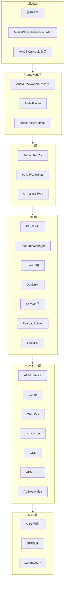
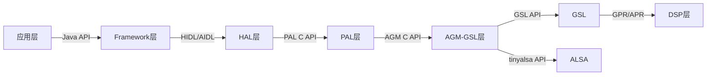
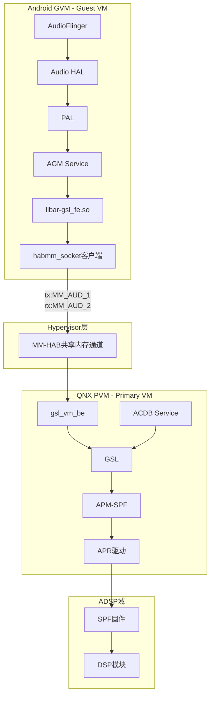
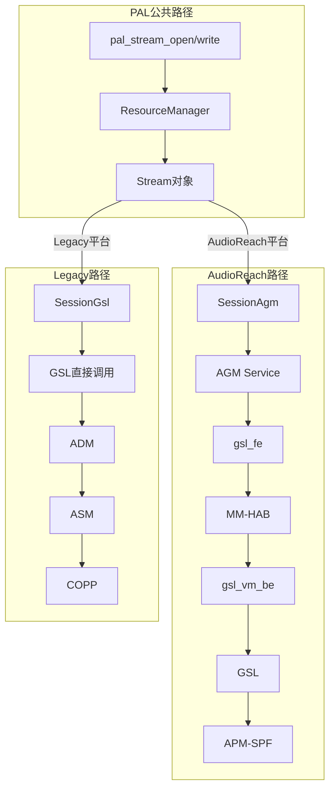
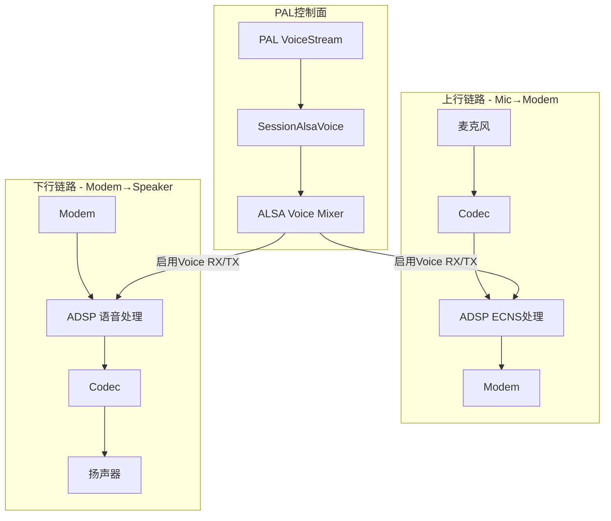
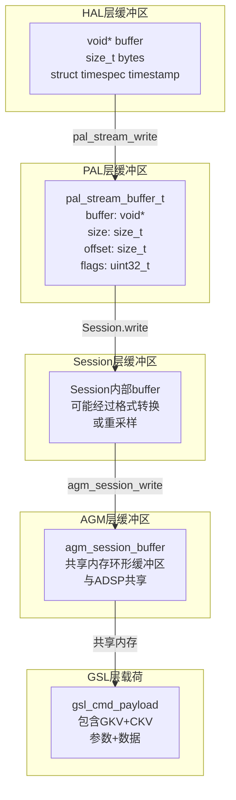
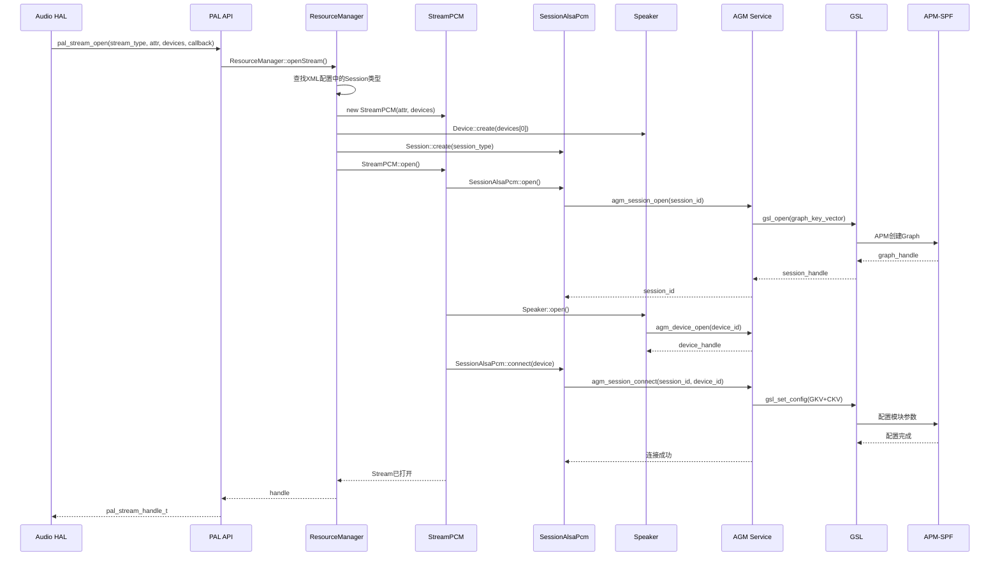

## 15.2 架构层次图

> [← 上一个](15_15.1_概述与目录.md) | [← 返回15章](README.md) | [返回导航](../README.md) | [下一个 →](15_15.3_API_分类总览.md)]

---

PAL 架构的核心价值在于分层抽象——将 Android 音频框架与底层 DSP 硬件解耦。本章从六层架构模型出发，逐层解析每层的职责边界、层间接口协议，以及在 SA8295 虚拟化场景下的跨 VM 数据通路。

## 15.2.1 六层架构分层详解

PAL 所在的音频系统可划分为六层，每层有清晰的职责边界和接口协议：



### 各层职责详述

| 层次 | 名称 | 核心职责 | 关键组件 | 源码位置 |
|------|------|---------|---------|---------|
| L1 | 应用层 | 发起音频请求，管理播放/录音生命周期 | MediaPlayer、AudioTrack、CarAudio | `frameworks/base/media/` |
| L2 | Framework层 | 混音、路由策略、焦点管理 | AudioFlinger、AudioPolicyService | `frameworks/av/services/audioflinger/` |
| L3 | HAL层 | Treble接口适配，将Android音频操作翻译为PAL调用 | Audio HAL 7.x + HAL-PAL适配层 | `vendor/qcom/opensource/audio-hal-ar/` |
| L4 | PAL层 | Stream/Device/Session三层抽象，资源调度，载荷构建 | ResourceManager、StreamPCM、SessionAlsaPcm | `vendor/qcom/opensource/pal/` |
| L5 | AGM-GSL层 | Graph管理，跨VM通信，ALSA控制 | AGM Service、gsl_fe、MM-HAB、GSL、APM | `vendor/qcom/opensource/agm/` |
| L6 | DSP层 | 信号处理、编解码、硬件输出 | ADSP固件、SPF模块、Codec驱动 | 固件级，不可见 |

**层间核心原则**：

- **单向依赖**：上层仅依赖下层接口，不反向调用。PAL 层不感知 AudioFlinger 的存在
- **接口稳定**：层间通过稳定的接口协议通信（HIDL/AIDL/C API/AGM API），内部实现可独立演进
- **进程隔离**：HAL 与 PAL 可部署在不同进程（通过 HwBinder IPC），AGM Service 也是独立进程

## 15.2.2 各层间接口协议

层间通信协议是架构稳定性的基石，每一对相邻层之间都有明确的接口协议：



### 接口协议详解

| 接口边界 | 协议类型 | 接口名称 | 传输方式 | 典型调用 |
|---------|---------|---------|---------|---------|
| Framework → HAL | HIDL/AIDL | `IDevice`、`IStream`、`IStreamOut` | HwBinder | `openOutputStream()`、`setVolume()` |
| HAL → PAL | C API | `pal_stream_open()`等 | 直接调用或HwBinder IPC | `pal_stream_open()`、`pal_stream_write()` |
| PAL → AGM | C API | `agm_session_open()`等 | 直接调用或HwBinder | `agm_session_write()`、`agm_device_open()` |
| AGM → GSL(AudioReach) | C API | `gsl_open()`、`gsl_write()` | 本地调用或MM-HAB | `gsl_set_config()`、`gsl_read()` |
| AGM → GSL(Legacy) | C API | `acdb_loader`、`adm` | 直接调用 | `adm_open()`、`acdb_get_calibration()` |
| AGM → ALSA | tinyalsa API | `mixer_open()`、`pcm_open()` | ioctl系统调用 | `pcm_write()`、`mixer_ctl_set()` |
| GSL → APM | GPR | GPR packet | 内核驱动 | 模块加载、参数配置 |
| APM → DSP模块 | APR | APR packet | 内核驱动 | 命令下发、数据传输 |

**PAL C API 接口特征**：

PAL 对外暴露的接口定义在 `PalApi.h` 中，是一组纯 C 函数，关键特征：

- **无对象暴露**：上层通过 `pal_stream_handle_t`（opaque handle）操作流，不直接接触 PAL 内部类
- **同步语义**：所有 API 调用同步返回，异步事件通过回调通知
- **错误码体系**：使用 `int32_t` 返回值，0 表示成功，负值表示错误

**AGM C API 接口特征**：

AGM 是 PAL 的直接下层，接口定义在 `agm/api/agm.h` 中：

- **Session-Device 分离**：`agm_session_*` 和 `agm_device_*` 两组 API 独立操作
- **Graph 语义**：通过 `agm_session_set_config()` 配置音频处理图
- **共享内存传输**：`agm_session_write()` 将数据写入与 ADSP 共享的内存区域

## 15.2.3 SA8295 跨 VM 架构

SA8295 车载平台引入 Hypervisor 虚拟化，音频架构跨越三个域：



### 三域职责

| 域 | 操作系统 | 音频职责 | DSP控制权 |
|---|---------|---------|----------|
| GVM | Android | Audio HAL、PAL、AGM Service（前端代理） | 无，必须跨VM请求PVM |
| PVM | QNX | GSL后端、ACDB Service、APM控制 | 唯一控制方，通过APR直通ADSP |
| ADSP | RTOS(QURT) | SPF信号处理框架、音频模块执行 | 自主运行，接受APM调度 |

### MM-HAB 通道详解

MM-HAB 是高通 Hypervisor 提供的跨 VM 消息传递机制，基于共享内存：

- **通道标识**：音频使用 `MM_AUD_1`（TX方向，GVM→PVM）和 `MM_AUD_2`（RX方向，PVM→GVM）
- **会话容量**：`GSL_BE_MAX_SESSIONS=8`，最多支持 8 个并发的 GVM 音频会话
- **序列化协议**：gsl_fe 将 GSL API 调用序列化为 VM Opcode，gsl_vm_be 反序列化后调用本地 GSL API
- **延迟特征**：单次跨 VM 往返约 1-2ms，高负载时可能增加

**gsl_fe 操作流程**（GVM 侧）：

```
1. AGM Service 调用 gsl_open()
   → libar-gsl_fe.so 拦截调用
   → 序列化为 GSL_VM_OPCODE_OPEN
   → habmm_socket_send(MM_AUD_1, payload, size)

2. 等待响应
   → habmm_socket_recv(MM_AUD_2, &resp, &resp_size)
   → 反序列化响应，返回给 AGM Service
```

**gsl_vm_be 处理流程**（PVM 侧）：

```
1. habmm_socket_recv 接收来自 GVM 的请求
   → 解析 Opcode（GSL_VM_OPCODE_OPEN/WRITE/READ等）
   → 调用 QNX 本地 GSL API（如 gsl_open/gsl_write）
   → 将结果序列化
   → habmm_socket_send 返回给 GVM
```

> **安全音频**：QNX 域的安全音频（如 ECall/提示音）不经过 MM-HAB 通道，而是由 QNX 独立通过 APR 直通 ADSP 执行，保证低延迟和高可靠性。

## 15.2.4 AudioReach vs Legacy 路径对比

PAL 支持两种底层路径：AudioReach（新一代）和 Legacy（传统）。两者在 PAL 层之上的调用路径相同，但 Session 类型选择和底层交互完全不同：



### 路径对比表

| 对比维度 | AudioReach 路径 | Legacy 路径 |
|---------|----------------|------------|
| Session 类型 | SessionAgm / SessionAlsaPcm(AudioReach模式) | SessionGsl / SessionAlsaPcm(Legacy模式) |
| Graph 管理 | AGM Service（用户空间服务） | ADM（内核驱动） |
| DSP 交互 | GSL → APM → SPF 模块 | ADM → ASM → COPP |
| 校准数据 | ACDB 通过 AGM 加载 | ACDB 通过 acdb_loader 直接加载 |
| 虚拟化支持 | 原生支持（gsl_fe + MM-HAB） | 不支持 |
| Graph 连接 | `agm_session_connect()` | `adm_routing_stream_conn()` |
| 数据写入 | `agm_session_write()` | `gsl_write()` 或 ALSA pcm_write |
| 适用平台 | SM8350+、SA8295/SA8650 | SM8150 及更早 |

**Session 类型选择逻辑**：

ResourceManager 根据编译宏和平台配置选择 Session 类型：

| Session 类 | 何时选用 | 底层交互 |
|-----------|---------|---------|
| `SessionAlsaPcm` | PCM 流 + AudioReach 平台 | 通过 AGM 操作 ALSA PCM 节点 |
| `SessionAlsaCompress` | Compress Offload 流 + AudioReach | 通过 AGM 操作 ALSA Compress 节点 |
| `SessionAlsaVoice` | 语音通话流 | 直接操作 ALSA Voice 混合器控件 |
| `SessionGsl` | （历史遗留，不参与实际运行） | 曾用于直接调用 GSL API |
| `SessionAgm` | AudioReach 平台非PCM流（NON_TUNNEL） | 通过 AGM Service 操作 |

> **SA8295 路径说明**：SA8295 属于 AudioReach 平台，实际运行走上表 **AudioReach 路径**（`SessionAlsaPcm`/`SessionAgm`/`SessionAlsaCompress`/`SessionAlsaVoice`）。`SessionGsl` 及 Legacy(ADM/ASM/COPP) 路径仅作历史对比，`SessionGsl.cpp` 已从代码库移除、`Session::makeSession()` 也无对应分支，不参与 SA8295 运行。

## 15.2.5 数据流向详解

### 15.2.5.1 播放数据流

媒体播放是最常见的音频数据流，完整路径如下：


**播放路径的详细数据封装过程**：

1. **AudioTrack.write()**：应用将 PCM 数据写入 AudioTrack 的共享内存（通过 ashmem）
2. **AudioFlinger 混音**：MixerThread 将多个 Track 混音后写入 HAL 输出流
3. **HAL → PAL**：`pal_stream_write(handle, buf, size, &attr)` 将混音后的 PCM 数据传入 PAL
4. **PAL → Session**：StreamPCM 将数据转发给 SessionAlsaPcm，Session 内部调用 `agm_session_write()`
5. **AGM → GSL**：AGM Service 将 PCM 数据写入共享内存环缓冲区，通知 ADSP 读取
6. **GSL → APM → DSP**：APM 调度 SPF 模块链处理数据（重采样→音量→均衡器→输出）
7. **DSP → Codec**：处理后的数据通过 I2S/TDM 接口发送给 Codec，经功放驱动扬声器

### 15.2.5.2 录音数据流

录音是播放的逆过程，数据从麦克风流向应用：

```mermaid
graph LR
    MIC[麦克风] -->|模拟信号| CODEC_R[Codec]
    CODEC_R -->|I2S/TDM| DSP_R[ADSP]
    DSP_R -->|GPR| APM_R[APM-SPF]
    APM_R -->|GPR| GSL_R[GSL]
    GSL_R -->|gsl_read| AGM_R[AGM Service]
    AGM_R -->|agm_session_read| Sess_R[SessionAlsaPcm]
    Sess_R -->|Session.read| PAL_R[PAL]
    PAL_R -->|pal_stream_read| HAL_R[Audio HAL]
    HAL_R -->|HAL read| AF_R[AudioFlinger]
    AF_R -->|AudioRecord.read| App_R[应用]
```



**录音路径的关键差异**：

- **数据拉取模型**：录音是 Pull 模型，应用主动调用 `AudioRecord.read()` 拉取数据
- **ADC 方向**：Codec 将模拟信号转换为数字信号，通过 I2S/TDM 传给 ADSP
- **缓冲区管理**：PAL 内部使用 RingBuffer 缓存录音数据，`SessionAlsaPcm::read()` 从共享内存读取

### 15.2.5.3 语音通话数据流

语音通话是最复杂的数据流，涉及双向音频和 DSP 端到端处理：



**语音通话的特征**：

- **DSP 端到端**：语音通话的音频数据不经过 PAL 传输，PAL 仅负责控制面（启用/禁用语音路径、设置音量）
- **ECNS 处理**：ADSP 内部执行回声消除和噪声抑制，处理链完全在 DSP 内闭环
- **双 FE ID**：语音通话需要一对 FE ID（RX + TX），由 ResourceManager 分配
- **ALSA 控制**：SessionAlsaVoice 通过 tinyalsa mixer 控件启用/禁用语音路径，而非通过 AGM 数据通道

## 15.2.6 层间数据封装与转换

音频数据在各层间传递时，封装格式逐层变化：



### 各层缓冲区结构

**HAL 层**：Audio HAL 通过 `write(void *buffer, size_t bytes)` 传递原始 PCM 字节流，不包含元数据

**PAL 层**：`pal_stream_write()` 接收 `pal_stream_buffer_t` 结构：

```c
// PAL层数据封装
struct pal_stream_buffer {
    void *buffer;       // PCM数据指针
    size_t size;        // 数据字节数
    size_t offset;      // 偏移量（用于部分写入）
    uint32_t flags;     // 标志位（如PAL_STREAM_BUFFER_FLAG_EOS）
};
```

**Session 层**：Session 内部可能进行格式转换或重采样，然后封装为 AGM 调用参数

**AGM 层**：AGM 使用共享内存环缓冲区与 ADSP 通信，`agm_session_write()` 将数据写入共享内存：

```c
// AGM层共享内存写入
int agm_session_write(uint32_t session_id, void *buffer, size_t bytes,
                      uint64_t *timestamp);
// 数据被写入与ADSP共享的ring buffer
// ADSP通过硬件中断感知新数据到达
```

**GSL 层**：GSL 命令载荷由 PayloadBuilder 构建，包含 Graph Key Value（GKV）和 Calibration Key Value（CKV）：

```c
// GSL层载荷结构
struct gsl_cmd_payload {
    uint32_t graph_handle;     // Graph句柄
    uint32_t module_id;        // 目标模块ID
    uint32_t param_id;         // 参数ID
    uint32_t payload_size;     // 参数数据大小
    uint8_t  payload[];        // 参数数据
};
```

### 数据封装链总结

| 层次 | 数据格式 | 大小对齐 | 元数据 |
|------|---------|---------|--------|
| HAL | 原始PCM字节流 | 按帧对齐（frame_size × frame_count） | timestamp |
| PAL | pal_stream_buffer_t | 按PAL内部buffer_size对齐 | flags（EOS/DROP等） |
| Session | Session内部buffer | 可能重采样后对齐 | 无额外元数据 |
| AGM | 共享内存ring buffer | 按 ADSP period_size 对齐 | session_id、timestamp |
| GSL | gsl_cmd_payload + 参数数据 | 按 4 字节对齐 | module_id、param_id、GKV/CKV |

## 15.2.7 关键组件交互时序

以 `pal_stream_open()` 为例，展示从 HAL 到 DSP 的完整层间调用时序：



### 时序中的关键步骤解析

**步骤 1 - ResourceManager 路由决策**：

`ResourceManager::openStream()` 是整个流程的调度中心，负责：

- 根据 `pal_stream_type_t` 查找 XML 配置中对应的 Session 类型
- 分配 FE ID（Front-End ID），用于标识 ALSA PCM 节点
- 创建 Stream、Device、Session 三层对象
- 检查资源冲突（如并发流数量限制）

**步骤 2 - Session::open() → AGM → GSL → APM**：

这是最关键的层间调用链：

- `SessionAlsaPcm::open()` 调用 `agm_session_open()`，AGM 创建 Session 对象
- AGM 通过 `gsl_open()` 创建 DSP Graph，GKV（Graph Key Vector）标识 Graph 拓扑
- GSL 向 APM 发送 Graph 创建请求，APM 在 ADSP 上实例化模块链
- 返回 graph_handle，AGM 将其关联到 session_id

**步骤 3 - Device::open() → AGM → ALSA**：

Device 层打开物理设备：

- `Speaker::open()` 调用 `agm_device_open()`，打开对应的 BE（Back-End）设备
- AGM 通过 tinyalsa 打开 ALSA PCM 设备节点（如 `/dev/snd/pcmC0D0p`）
- 配置 BE 端的采样率、位深、通道数

**步骤 4 - Session::connect() → AGM → GSL**：

Graph 连接是 AudioReach 架构的核心操作：

- `agm_session_connect()` 将 FE（Session）与 BE（Device）关联
- AGM 通过 `gsl_set_config()` 配置 GKV 和 CKV
- APM 根据配置连接 DSP 模块，形成完整的数据处理链

### SA8295 跨 VM 场景下的时序差异

在 SA8295 平台上，步骤 2-4 中的 GSL 调用会经过跨 VM 通道：

```
AGM → libar-gsl_fe.so → habmm_socket_send(MM_AUD_1)
  → [Hypervisor MM-HAB共享内存]
  → gsl_vm_be → habmm_socket_recv → 调用QNX本地GSL API
  → 结果通过 habmm_socket_send(MM_AUD_2) 返回
```

这使得 `pal_stream_open()` 的执行时间从非虚拟化场景的约 50-80ms 增加到 80-150ms，主要延迟来自多次跨 VM 往返（gsl_open、gsl_set_config 各需一次往返）。

---

## 15.2.8 六层架构对照速查表

| 层次 | 入口函数 | 出口函数 | 缓冲区类型 | 延迟量级 |
|------|---------|---------|-----------|---------|
| L1 应用层 | AudioTrack.write() | - | Java ByteBuffer | 20-50ms |
| L2 Framework层 | AudioFlinger::write() | HAL openOutput/write | FIFO + MixerBuffer | 5-20ms |
| L3 HAL层 | openOutputStream() | pal_stream_open/write | void* buffer | 1-5ms |
| L4 PAL层 | pal_stream_open() | agm_session_open/write | pal_stream_buffer_t | 2-10ms |
| L5 AGM-GSL层 | agm_session_write() | gsl_write / pcm_write | 共享内存ring buffer | 1-5ms |
| L6 DSP层 | GPR/APR命令 | 硬件输出 | ADSP内部buffer | <1ms |

> **注意**：延迟量级为粗略估计，实际值受采样率、缓冲区大小、平台配置等因素影响。SA8295 跨 VM 场景下 L5 层延迟会额外增加 1-2ms。

---

[← 上一个](15_15.1_概述与目录.md) | [← 返回15章](README.md) | [返回导航](../README.md) | [下一个 →](15_15.3_API_分类总览.md)