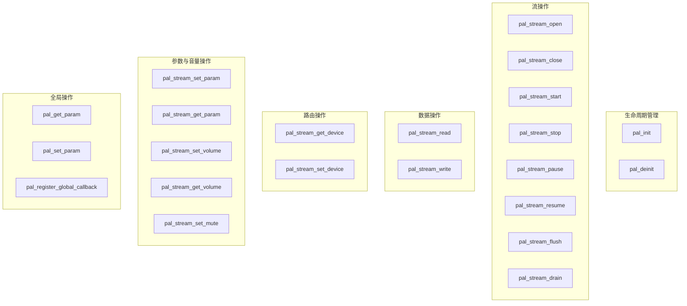
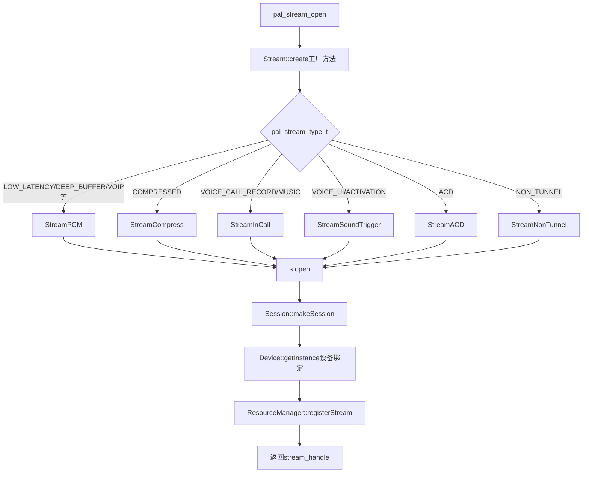
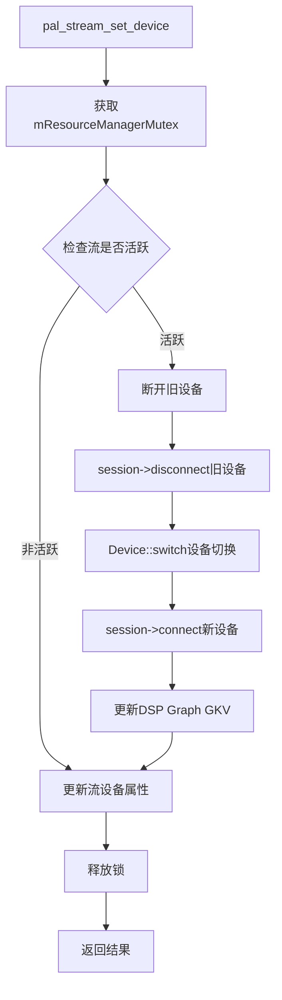
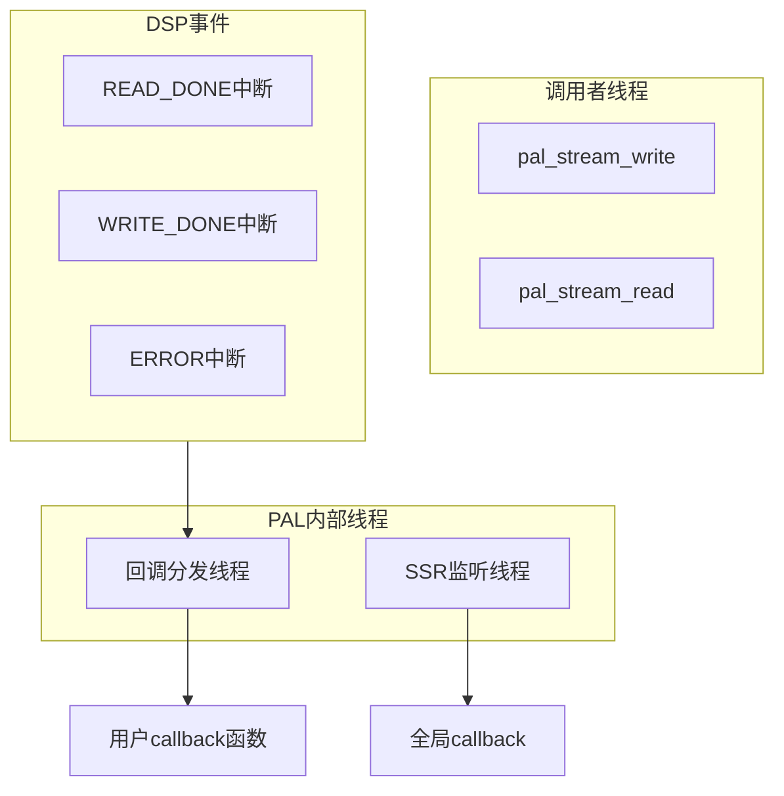

## 15.3 API 分类总览

> [← 上一个](15_15.2_架构层次图.md) | [← 返回15章](README.md) | [返回导航](../README.md) | [下一个 →](15_15.4_流类型_pal_stream_type_t.md)

---

## 15.3.1 API 分类总览

PAL API 定义在 `PalApi.h`，实现在 `Pal.cpp`，所有公开函数均以 `pal_` 前缀开头。按照功能职责可分为六大类：



### API 统计总览

| 分类 | API数量 | 核心入口 | 源码文件 |
|------|---------|----------|----------|
| 生命周期管理 | 2 | `pal_init()` | PalApi.h / Pal.cpp |
| 流操作 | 8 | `pal_stream_open()` | PalApi.h / Pal.cpp |
| 数据操作 | 2 | `pal_stream_write()` | PalApi.h / Pal.cpp |
| 路由操作 | 2 | `pal_stream_set_device()` | PalApi.h / Pal.cpp |
| 参数与音量 | 5 | `pal_stream_set_volume()` | PalApi.h / Pal.cpp |
| 全局操作 | 3 | `pal_set_param()` | PalApi.h / Pal.cpp |

---

## 15.3.2 生命周期管理 API

### pal_init()

```c
int32_t pal_init();
```

| 项目 | 说明 |
|------|------|
| 功能 | 初始化PAL子系统，加载配置并创建ResourceManager单例 |
| 返回值 | 0 成功，负值表示错误码 |
| 线程安全 | 通过 `pthread_once` 保证仅初始化一次 |
| 前置条件 | 无（首次调用触发初始化） |

**内部执行流程：**

1. 调用 `ResourceManager::getInstance()` 获取单例
2. 首次调用时执行 `ResourceManager::init()`，按序完成：
   - 解析 `resourcemanager_XXX.xml` 配置文件
   - 初始化设备列表，创建所有Device对象
   - 构建前端/后端ID池（PCM/Compress FE ID、BE ID）
   - 打开ALSA mixer控制，获取 `audio_route` 和 `audio_hw_mixer` 句柄
   - 加载GSL库（SA8295上PAL依赖libar-gsl提供GSL公共头文件，实际GSL调用由AGM通过gsl_fe代理跨VM执行）
   - 启动SSR监听线程 `ssrHandlingLoop`
   - 加载并发流配置

### pal_deinit()

```c
int32_t pal_deinit();
```

| 项目 | 说明 |
|------|------|
| 功能 | 反初始化PAL，释放ResourceManager所有资源 |
| 返回值 | 0 成功，负值表示错误码 |
| 前置条件 | 所有流必须已关闭 |

**内部执行流程：**

1. 检查是否仍有活跃流，若有则返回错误
2. 调用 `ResourceManager::deinit()` 释放资源
3. 关闭ALSA mixer句柄
4. 卸载GSL共享库
5. 停止SSR监听线程
6. 销毁ResourceManager单例实例

---

## 15.3.3 流生命周期 API

### pal_stream_open() — 核心入口

```c
int32_t pal_stream_open(
    struct pal_stream_attributes *attributes,   // 流属性：类型/方向/采样率等
    uint32_t no_of_devices,                     // 关联设备数量
    struct pal_device *devices,                 // 关联设备数组
    uint32_t no_of_modifiers,                   // 修饰符数量
    struct modifier_kv *modifiers,              // 修饰符键值对数组
    pal_stream_callback callback,               // 事件回调函数指针
    uint64_t cookie,                            // 传递给回调的用户cookie
    pal_stream_handle_t **stream_handle         // 输出：流句柄
);
```

**参数详解：**

| 参数 | 类型 | 说明 |
|------|------|------|
| `attributes` | `pal_stream_attributes*` | 核心属性结构体，包含流类型、方向、采样率、位深、通道等 |
| `no_of_devices` | `uint32_t` | 关联设备数量，通常为1（单设备）或2（双向流如VoIP） |
| `devices` | `pal_device*` | 设备配置数组，每个元素含设备ID和配置参数 |
| `no_of_modifiers` | `uint32_t` | 修饰符数量，通常为0 |
| `modifiers` | `modifier_kv*` | 键值对修饰符，用于扩展属性 |
| `callback` | `pal_stream_callback` | 异步事件回调，可为NULL |
| `cookie` | `uint64_t` | 回调上下文，原样传递给callback |
| `stream_handle` | `pal_stream_handle_t**` | 输出参数，成功时返回流句柄 |

**返回值：** 0 成功，负值错误码（常见：`-EINVAL` 参数无效，`-ENOMEM` 内存不足，`-ENODEV` 设备不可用）

**pal_stream_attributes 结构体关键字段：**

```c
struct pal_stream_attributes {
    pal_stream_type_t type;           // 流类型，决定Stream子类和Session子类
    pal_stream_flags_t flags;         // 流标志
    pal_stream_direction_t direction; // 方向：PAL_AUDIO_INPUT/OUTPUT/BIDIR
    uint32_t in_media_config;         // 输入媒体配置
    uint32_t out_media_config;        // 输出媒体配置
};
```

### pal_stream_open() 内部流程详解



**详细步骤：**

1. **参数校验** — 检查 `attributes` 非空、`stream_handle` 非空、`type` 在合法范围
2. **Stream::create()** — 工厂方法，根据 `pal_stream_type_t` 创建具体Stream子类：
   - `StreamPCM` — LOW_LATENCY / DEEP_BUFFER / ULTRA_LOW_LATENCY / VOIP / HAPTICS / PLAYBACK_BUS 等
   - `StreamCompress` — COMPRESSED (Offload播放)
   - `StreamInCall` — VOICE_CALL_RECORD / VOICE_CALL_MUSIC
   - `StreamSoundTrigger` — VOICE_UI / VOICE_ACTIVATION
   - `StreamACD` — ACD
   - `StreamNonTunnel` — NON_TUNNEL
3. **s->open()** — 调用具体Stream子类的open方法：
   - 调用 `Session::makeSession()` 创建Session子类
   - 调用 `Device::getInstance()` 绑定设备
   - PayloadBuilder构建GKV/CKV，Session打开DSP Graph
4. **ResourceManager::registerStream()** — 注册流到活跃列表
5. **返回stream_handle** — 将Stream指针封装为句柄返回

### pal_stream_close()

```c
int32_t pal_stream_close(pal_stream_handle_t stream_handle);
```

| 项目 | 说明 |
|------|------|
| 功能 | 关闭流，释放所有关联资源 |
| 返回值 | 0 成功 |
| 前置条件 | 流必须已stop（若曾start） |

**内部流程：** `deregisterStream()` → `session->close()` → 释放Stream对象

### pal_stream_start() / pal_stream_stop()

```c
int32_t pal_stream_start(pal_stream_handle_t stream_handle);
int32_t pal_stream_stop(pal_stream_handle_t stream_handle);
```

| 项目 | 说明 |
|------|------|
| `start` 功能 | 启动流，开始数据传输。对录音流开始采集，对播放流开始输出 |
| `stop` 功能 | 停止流，暂停数据传输但保持流打开状态 |
| 前置条件 | 流必须已open |

**start内部流程：** `session->start()` → DSP Graph开始运行 → 设备启用

### pal_stream_pause() / pal_stream_resume()

```c
int32_t pal_stream_pause(pal_stream_handle_t stream_handle);
int32_t pal_stream_resume(pal_stream_handle_t stream_handle);
```

| 项目 | 说明 |
|------|------|
| `pause` 功能 | 暂停流，保持Stream和Session状态但停止数据流动 |
| `resume` 功能 | 恢复暂停的流 |
| 适用场景 | Compress流的暂停/恢复（保持解码器状态） |

### pal_stream_flush() / pal_stream_drain()

```c
int32_t pal_stream_flush(pal_stream_handle_t stream_handle);
int32_t pal_stream_drain(pal_stream_handle_t stream_handle, pal_drain_type_t type);
```

| API | 说明 |
|-----|------|
| `flush` | 丢弃缓冲区中未处理的数据 |
| `drain` | 等待缓冲区数据全部处理完毕。`type` 取值：`PAL_DRAIN`（正常排空）或 `PAL_DRAIN_PARTIAL`（部分排空） |

---

## 15.3.4 数据读写 API

### pal_stream_write() / pal_stream_read()

```c
int32_t pal_stream_write(pal_stream_handle_t stream_handle, struct pal_buffer *buffer);
int32_t pal_stream_read(pal_stream_handle_t stream_handle, struct pal_buffer *buffer);
```

| 参数 | 类型 | 说明 |
|------|------|------|
| `stream_handle` | `pal_stream_handle_t` | 流句柄 |
| `buffer` | `pal_buffer*` | 数据缓冲区结构体 |

**pal_buffer 结构体关键字段：**

```c
struct pal_buffer {
    void *buffer;              // 数据指针
    size_t size;               // 数据大小（字节）
    size_t offset;             // 偏移量
    struct pal_time_stamp ts;  // 时间戳
};
```

| 项目 | 说明 |
|------|------|
| `write` 返回值 | 成功写入的字节数，负值表示错误 |
| `read` 返回值 | 成功读取的字节数，负值表示错误 |
| 阻塞行为 | 默认阻塞模式；若流配置了callback，可采用非阻塞模式 |
| 线程安全 | 同一流上多线程并发读写不安全，需调用者同步 |

**内部调用链：** `write()` → `StreamPCM::write()` / `StreamCompress::write()` → `Session::write()` → `agm_write()` / ALSA write

---

## 15.3.5 设备路由 API

### pal_stream_get_device() / pal_stream_set_device()

```c
int32_t pal_stream_get_device(pal_stream_handle_t stream_handle,
                               uint32_t *no_of_devices,
                               struct pal_device **devices);

int32_t pal_stream_set_device(pal_stream_handle_t stream_handle,
                               uint32_t no_of_devices,
                               struct pal_device *devices);
```

| API | 参数说明 |
|-----|----------|
| `get_device` | `no_of_devices` 输出设备数量，`devices` 输出设备数组（需调用者释放） |
| `set_device` | `no_of_devices` 输入设备数量，`devices` 输入目标设备配置 |

### pal_stream_set_device() 路由切换流程详解



**路由切换关键步骤：**

1. **互斥锁保护** — 获取 `mResourceManagerMutex`，防止并发路由冲突
2. **活跃流判断** — 若流正在运行，需要动态切换设备
3. **断开旧设备** — `session->disconnect()` 断开当前设备连接
4. **设备切换** — `Device::switchDevice()` 处理ALSA路由更新
5. **连接新设备** — `session->connect()` 建立新设备连接
6. **更新DSP Graph** — PayloadBuilder重新构建GKV，Session打开新的DSP Graph
7. **更新属性** — 更新Stream内部的设备列表

---

## 15.3.6 音量与静音 API

### pal_stream_set_volume() / pal_stream_get_volume()

```c
int32_t pal_stream_set_volume(pal_stream_handle_t stream_handle,
                               struct pal_volume_data *volume);
int32_t pal_stream_get_volume(pal_stream_handle_t stream_handle,
                               struct pal_volume_data **volume);
```

**pal_volume_data 结构体：**

```c
struct pal_volume_data {
    uint32_t no_of_volpairs;              // 音量对数量
    struct pal_channel_vol_kv vol_pair[];  // 通道-音量键值对数组
};

struct pal_channel_vol_kv {
    uint32_t channel_mask;  // 通道掩码
    float volume;           // 音量值 0.0~1.0
};
```

| 项目 | 说明 |
|------|------|
| 音量范围 | 0.0（静音）到 1.0（最大） |
| 多通道 | 支持每个通道独立设置音量 |
| 内部实现 | PayloadBuilder构建Volume TKV → Session下发到DSP Volume模块 |

### pal_stream_set_mute()

```c
int32_t pal_stream_set_mute(pal_stream_handle_t stream_handle, bool state);
```

| 参数 | 说明 |
|------|------|
| `state` | `true` 静音，`false` 取消静音 |
| 内部实现 | PayloadBuilder构建Mute TKV → Session下发到DSP Mute模块 |
| 与set_volume区别 | Mute不改变音量值，只是将输出静音；恢复时音量值不变 |

---

## 15.3.7 流参数 API

### pal_stream_set_param() / pal_stream_get_param()

```c
int32_t pal_stream_set_param(pal_stream_handle_t stream_handle,
                              uint32_t param_id,
                              void *param_payload,
                              size_t payload_size);
int32_t pal_stream_get_param(pal_stream_handle_t stream_handle,
                              uint32_t param_id,
                              void **param_payload,
                              size_t *payload_size);
```

| 参数 | 说明 |
|------|------|
| `param_id` | 参数ID，标识请求的参数类型 |
| `param_payload` | 参数载荷，具体结构取决于param_id |
| `payload_size` | 载荷大小（字节） |

**常用 param_id 举例：**

| param_id | 用途 | 场景 |
|----------|------|------|
| `PAL_PARAM_ID_UIEFFECT` | 音效参数设置 | GEQ/Bass/虚拟环绕等 |
| `PAL_PARAM_ID_SESSION_ALSA_MMAP` | MMAP buffer地址 | AAudio MMAP模式 |
| `PAL_PARAM_ID_LATENCY_MODE` | 延迟模式切换 | 低延迟/常规模式 |

---

## 15.3.8 全局参数 API

### pal_set_param() / pal_get_param()

```c
int32_t pal_set_param(uint32_t param_id, void *param_payload, size_t payload_size);
int32_t pal_get_param(uint32_t param_id, void **param_payload,
                       size_t *payload_size, struct pal_param_payload *query);
int32_t pal_register_global_callback(pal_global_callback cb, uint64_t cookie);
```

**全局参数不关联特定流，作用于整个PAL子系统。**

**常用全局 param_id：**

| param_id | 用途 | 调用场景 |
|----------|------|----------|
| `PAL_PARAM_ID_CHARGING_STATE` | 充电状态变化 | USB充电插入/拔出影响音频路由 |
| `PAL_PARAM_ID_SCREEN_STATE` | 屏幕状态 | 亮屏/灭屏影响低功耗模式 |
| `PAL_PARAM_ID_DEVICE_ROTATION` | 设备旋转 | 旋转导致麦克风阵列方向变化 |
| `PAL_PARAM_ID_BT_SCO` | BT SCO状态 | SCO连接/断开影响通话路由 |
| `PAL_PARAM_ID_SSR` | 子系统重启通知 | ADSP/CDSP掉线恢复 |
| `PAL_PARAM_ID_DEVICE_CAPABILITY` | 设备能力查询 | 查询支持的季节点/编码格式 |

### pal_register_global_callback()

```c
int32_t pal_register_global_callback(pal_global_callback cb, uint64_t cookie);
```

| 参数 | 说明 |
|------|------|
| `cb` | 全局回调函数指针 |
| `cookie` | 用户上下文，原样传递给回调 |

**全局回调事件类型：**

| 事件 | 说明 |
|------|------|
| `PAL_CALLBACK_SSR` | 子系统重启事件（ADSP/CDSP掉线或恢复） |
| `PAL_CALLBACK_BT_SCO` | BT SCO状态变化 |
| `PAL_CALLBACK_CHARGING_STATE` | 充电状态变化 |

---

## 15.3.9 回调机制详解

### pal_stream_callback 类型定义

```c
typedef int32_t (*pal_stream_callback)(
    uint32_t event_id,           // 事件ID
    void *event_data,            // 事件数据
    uint32_t event_data_size,    // 事件数据大小
    uint64_t cookie              // 用户cookie
);
```

### 流回调事件类型

| 事件ID | 说明 | 触发场景 |
|--------|------|----------|
| `PAL_STREAM_CBK_EVENT_READ_DONE` | 异步读取完成 | 非阻塞read完成时 |
| `PAL_STREAM_CBK_EVENT_WRITE_DONE` | 异步写入完成 | 非阻塞write完成时 |
| `PAL_STREAM_CBK_EVENT_DRAIN_READY` | Drain完成 | pal_stream_drain()数据排空 |
| `PAL_STREAM_CBK_EVENT_ERROR` | 流错误 | DSP错误、SSR等 |
| `PAL_STREAM_CBK_EVENT_ST_READY` | SoundTrigger就绪 | 语音唤醒检测到关键词 |
| `PAL_STREAM_CBK_EVENT_ST_CH Recognition` | ST通道识别 | 识别通道信息回调 |
| `PAL_STREAM_CBK_EVENT_ACD_DETECTED` | ACD检测到事件 | 声学上下文检测触发 |

### 回调与线程模型



**线程模型要点：**

1. **回调执行线程** — 流回调在PAL内部线程中执行，非调用者线程
2. **回调中禁止阻塞** — 回调函数中不应执行耗时操作或调用PAL API（避免死锁）
3. **SSR监听线程** — `ssrHandlingLoop` 线程持续监听ADSP/CDSP子系统状态变化
4. **数据传输线程** — `pal_stream_write/read` 由调用者线程直接执行，非PAL内部线程
5. **互斥锁保护** — `mResourceManagerMutex` 保护所有共享数据，回调中自动加锁

---

## 15.3.10 API 调用约束与错误码

### 调用时序约束

| 约束 | 说明 |
|------|------|
| `pal_init()` 必须最先调用 | 其他所有API依赖ResourceManager单例 |
| `pal_stream_open()` 必须在start之前 | 流必须先打开再启动 |
| `write/read` 必须在start之后 | 数据操作仅在流运行时有效 |
| `close` 前必须stop | 活跃流不能直接关闭 |
| `set_device` 可在open后任意时刻调用 | 支持运行时动态路由切换 |
| 同一流不可并发write | 多线程写同一流需调用者同步 |

### 标准错误码

| 错误码 | 值 | 说明 | 常见场景 |
|--------|-----|------|----------|
| `0` | 0 | 成功 | — |
| `-EINVAL` | -22 | 参数无效 | attributes为空、type越界 |
| `-ENOMEM` | -12 | 内存不足 | Stream/Session创建失败 |
| `-ENODEV` | -19 | 设备不可用 | 设备被占用或不存在 |
| `-EIO` | -5 | I/O错误 | DSP通信失败、ALSA操作错误 |
| `-EEXIST` | -17 | 资源已存在 | 重复open同类型流 |
| `-ENOSYS` | -38 | 功能未实现 | 不支持的流类型或操作 |
| `-EPERM` | -1 | 操作不允许 | 流状态不满足前置条件 |

### 典型API调用生命周期


---

[← 上一个](15_15.2_架构层次图.md) | [← 返回15章](README.md) | [返回导航](../README.md) | [下一个 →](15_15.4_流类型_pal_stream_type_t.md)