## 15.5 Stream 类层次与流生命周期管理

> [← 上一个](15_15.4_流类型_pal_stream_type_t.md) | [← 返回15章](README.md) | [返回导航](../README.md) | [下一个 →](15_15.6_ResourceManager-PAL核心管理模块.md)]

---

Stream 是 PAL 三层抽象（Stream → Session → Device）的最上层，代表一个完整的音频流实例。Stream 封装了流的生命周期管理、数据读写、设备路由、音量控制和状态机驱动，是 Audio HAL 调用 PAL API 的直接入口。不同音频场景通过 Stream 子类差异化实现，而公共逻辑由 Stream 基类统一提供。

## 15.5.1 Stream 类层次图

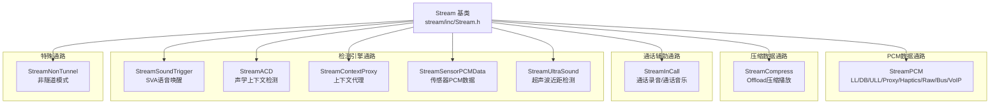

**类层次设计要点**：

- Stream 基类定义纯虚接口 + 公共状态机，子类仅差异化实现 `open()/close()/start()/stop()` 等核心方法
- StreamPCM 覆盖最广泛的 PCM 场景（12+流类型），是 PAL 中使用频率最高的子类
- 检测类 Stream（SoundTrigger/ACD/ContextProxy/SensorPCM/UltraSound）不直接传输音频数据，而是驱动检测引擎
- StreamNonTunnel 继承自 Stream 基类，数据路径绕过 DSP 直接在 AP 和 Codec 之间传输

## 15.5.2 Stream 基类深度解析

### 15.5.2.1 完整接口定义

Stream 基类是所有流类型的公共抽象，定义了完整的生命周期、数据操作、设备路由和参数控制接口：

```cpp
class Stream {
public:
    // 生命周期
    virtual int32_t open() = 0;
    virtual int32_t close() = 0;
    virtual int32_t start() = 0;
    virtual int32_t stop() = 0;
    virtual int32_t pause() = 0;
    virtual int32_t resume() = 0;
    virtual int32_t flush() = 0;
    virtual int32_t drain(pal_drain_type_t type) = 0;
    // 数据操作
    virtual int32_t read(struct pal_buffer *buffer) = 0;
    virtual int32_t write(struct pal_buffer *buffer) = 0;
    // 设备路由
    virtual int32_t setDevice(std::vector<std::shared_ptr<Device>> &devices) = 0;
    virtual int32_t getDevice(std::vector<std::shared_ptr<Device>> &devices) = 0;
    // 参数与音量
    virtual int32_t setParam(uint32_t param_id, void *payload) = 0;
    virtual int32_t getParam(uint32_t param_id, void **payload) = 0;
    virtual int32_t setVolume(struct pal_volume_data *volume) = 0;
    virtual int32_t getVolume(struct pal_volume_data *volume) = 0;
    virtual int32_t setMute(bool state) = 0;
    // 工厂方法
    static Stream* create(struct pal_stream_attributes *attributes,
                          uint32_t no_of_devices, struct pal_device *devices,
                          uint32_t no_of_modifiers, struct modifier_kv *modifiers,
                          pal_stream_callback callback, uint64_t cookie);
};
```

### 15.5.2.2 核心成员变量详解

| 成员变量 | 类型 | 说明 |
|---------|------|------|
| `mDevices` | `std::vector<std::shared_ptr<Device>>` | 流关联的设备列表，支持多设备路由（如Speaker+SpeakerMic双向） |
| `session` | `Session*` | 流关联的Session对象，由`Session::makeSession()`创建 |
| `mStreamAttr` | `struct pal_stream_attributes*` | 流属性，包含type/direction/flags/media_info等 |
| `rm` | `std::shared_ptr<ResourceManager>` | 资源管理器单例，用于注册/注销流、获取设备列表 |
| `currentState` | `stream_state_t` | 流状态机当前状态 |
| `mVolumeData` | `struct pal_volume_data*` | 音量数据，包含多声道音量值 |
| `mMuted` | `bool` | 静音状态标志 |
| `mStreamMutex` | `std::mutex` | 流操作互斥锁，保护状态转换和设备切换的原子性 |
| `callback_` | `pal_stream_callback` | 异步事件回调，如检测事件、Drain完成通知 |
| `cookie_` | `uint64_t` | 回调cookie，透传给上层标识流实例 |

### 15.5.2.3 关键方法内部逻辑

#### open() 内部调用流程

`open()` 是流打开的核心方法，所有子类共享基本框架：

```
Stream::open()
  ├── 1. 状态检查: currentState == IDLE 或 INIT
  ├── 2. ResourceManager::registerStream(this)  // 注册流到RM
  ├── 3. Device::getInstance(devId)              // 获取Device实例
  ├── 4. Session::makeSession(rm, mStreamAttr)   // 创建Session
  │       ├── GSL可用 → SessionAlsaPcm
  │       ├── Compress → SessionAlsaCompress
  │       ├── Voice → SessionAlsaVoice
  │       └── 其他 → SessionAlsaPcm
  ├── 5. session->open(this)                     // Session打开底层通路
  │       ├── SessionAlsaPcm:: agm_session_open + gsl_graph_open
  │       ├── SessionAlsaPcm: pcm_open(hw:0,x)
  │       └── SessionAlsaCompress: compress_open(hw:0,x)
  ├── 6. session->setupSessionDevice(this, devId) // Session与Device关联
  ├── 7. currentState = OPENED
  └── 8. return 0
```

#### write() 数据流路径

```
StreamPCM::write(buffer)
  ├── 状态检查: currentState == STARTED
  ├── StreamPCM: session->write(this, tag, buffer, &size)
  │       ├── SessionAlsaPcm: agm_write(session_id, buffer)
  │       │       └── ALSA FE: pcm_write(hw:0,FE_idx)
  │       └── SessionAlsaPcm: pcm_write(pcm_dev, buffer)
  └── return bytes_written

StreamCompress::write(buffer)
  ├── 状态检查: currentState == STARTED
  ├── session->write(this, tag, buffer, &size)
  │       └── SessionAlsaCompress: compress_write(compress_dev, buffer)
  └── return bytes_written
```

#### setDevice() 路由切换逻辑

```
Stream::setDevice(newDevices)
  ├── 1. mStreamMutex.lock()
  ├── 2. 比较新旧设备列表是否相同
  ├── 3. 对旧设备: session->disconnectSessionDevice(this, oldDev)
  │       └── oldDev->close()
  ├── 4. 对新设备: Device::getInstance(newDevId)
  ├── 5. session->setupSessionDevice(this, newDevId)
  ├── 6. session->connectSessionDevice(this, newDev)
  │       └── newDev->open() + newDev->start()
  ├── 7. mDevices = newDevices
  ├── 8. mStreamMutex.unlock()
  └── return 0
```

## 15.5.3 流状态机完整解析

### 15.5.3.1 状态转换图

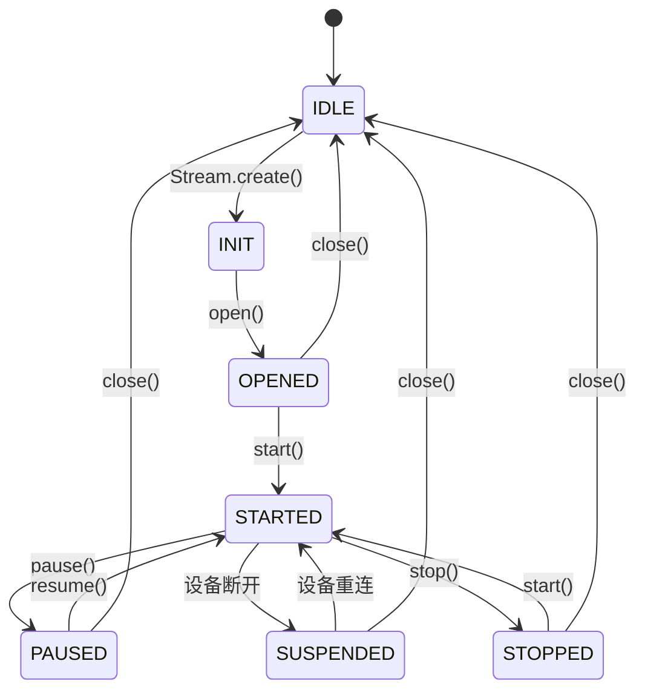

### 15.5.3.2 状态枚举与转换表

流状态枚举 `stream_state_t`：

| 枚举值 | 说明 | 允许的操作 |
|--------|------|-----------|
| `IDLE` | 初始/已关闭状态 | create() |
| `INIT` | 已创建未打开 | open(), close() |
| `OPENED` | 已打开未启动 | start(), close(), setDevice() |
| `STARTED` | 运行中 | write()/read(), pause(), stop(), setDevice() |
| `PAUSED` | 已暂停 | resume(), stop(), flush(), close() |
| `SUSPENDED` | 设备断开挂起 | 等待设备重连或close() |
| `STOPPED` | 已停止 | start(), close() |

### 15.5.3.3 完整状态转换表

| 当前状态 | 目标状态 | 触发方法 | 前置条件 | 副作用 |
|---------|---------|---------|---------|--------|
| IDLE | INIT | `Stream::create()` | 无 | 分配Stream子类实例 |
| INIT | OPENED | `open()` | Session可创建 | RM注册流, Session打开, Device打开 |
| OPENED | STARTED | `start()` | Device已连接 | Session启动, ALSA/AGM start |
| STARTED | PAUSED | `pause()` | 流支持暂停 | Session暂停, ALSA/AGM暂停 |
| PAUSED | STARTED | `resume()` | 无 | Session恢复 |
| STARTED | SUSPENDED | 设备热拔出 | Device断开 | 挂起数据传输, 等待重连 |
| SUSPENDED | STARTED | 设备热插入 | 同类型Device可用 | Session重连, 恢复数据传输 |
| STARTED | STOPPED | `stop()` | 无 | Session停止, ALSA/AGM stop |
| STOPPED | STARTED | `start()` | Device仍连接 | Session重新启动 |
| OPENED | IDLE | `close()` | 无 | Session关闭, RM注销流 |
| STOPPED | IDLE | `close()` | 无 | Session关闭, Device关闭 |
| PAUSED | IDLE | `close()` | 无 | Session关闭, 资源释放 |
| SUSPENDED | IDLE | `close()` | 无 | 强制关闭, 放弃重连等待 |

## 15.5.4 StreamPCM 深度解析

> 源码路径：`stream/inc/StreamPCM.h`、`stream/src/StreamPCM.cpp`

StreamPCM 是 PAL 中使用最广泛的子类，覆盖12+种 PCM 流类型，是音频播放和录制的主力实现。

### 15.5.4.1 覆盖的流类型

| 场景分组 | 流类型 | 方向 | Session子类 | 说明 |
|---------|--------|------|------------|------|
| 低延迟 | `LOW_LATENCY` / `ULTRA_LOW_LATENCY` | OUTPUT | SessionAlsaPcm | 触控音效、按键音、FAST_TRACK |
| 深缓冲 | `DEEP_BUFFER` | OUTPUT | SessionAlsaPcm | 音乐播放、视频音轨 |
| 代理/原始 | `PROXY` / `RAW` / `GENERIC` | OUTPUT | SessionAlsaPcm | 代理转发、原始PCM、通用流 |
| 触觉/总线 | `HAPTICS` / `PLAYBACK_BUS` | OUTPUT | SessionAlsaPcm | 振动马达、AAOS TDM总线 |
| VoIP | `VOIP` / `VOIP_RX` / `VOIP_TX` | I/O | SessionAlsaPcm | VoIP双向/下行/上行，含AEC/NS |
| 通话 | `VOICE_CALL` | I/O | SessionAlsaVoice | TDD/FDD语音通话 |

### 15.5.4.2 StreamPCM 与 Session 的配合

StreamPCM 在 `open()` 时通过 `Session::makeSession()` 创建对应的 Session：

- **SessionAlsaPcm**（GSL可用时）：通过 AGM 接口构建 DSP 音频图，数据走 Tunnel 路径。StreamPCM 的 `write()` 调用 `SessionAlsaPcm::write()` → `agm_write()` → ALSA FE pcm_write
- **SessionAlsaPcm**（GSL不可用时）：直接操作 ALSA PCM 设备，数据走 Non-Tunnel 路径。StreamPCM 的 `write()` 调用 `SessionAlsaPcm::write()` → `pcm_write()`
- **SessionAlsaVoice**（通话场景）：通过 VSID 管理通话通路，StreamPCM 的 `start()` 触发 `SessionAlsaVoice::start()` → 语音DSP图建立

### 15.5.4.3 缓冲区管理

StreamPCM 的缓冲区由 `pal_buffer` 结构体管理：

```cpp
struct pal_buffer {
    void *buffer;          // 数据缓冲区指针
    size_t size;           // 缓冲区大小(字节)
    uint32_t offset;       // 当前读写偏移
    struct pal_time_info ts; // 时间戳信息
};
```

缓冲区大小由 `mStreamAttr->in_media_config.rate/channels/bit_width` 计算得出，Session 层负责将数据写入 ALSA FE 节点。对于 SessionAlsaPcm，数据写入 ALSA FE 的 PCM 缓冲区后由 DMA 搬运到 DSP；对于 SessionAlsaPcm，数据直接写入 ALSA PCM 设备节点。

## 15.5.5 StreamCompress 深度解析

> 源码路径：`stream/inc/StreamCompress.h`、`stream/src/StreamCompress.cpp`

StreamCompress 用于 Offload 压缩播放，AP 将压缩数据（MP3/AAC/FLAC/ALAC/WMA等）直接传给 DSP 解码，AP 不参与解码过程，从而节省 CPU 功耗。

### 15.5.5.1 Offload 播放完整数据路径

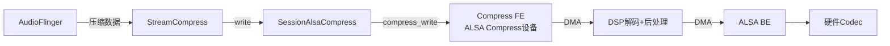

### 15.5.5.2 Compress Drain 机制

Offload 播放中，AP 需要知道 DSP 何时解码完所有数据，这通过 `drain()` 机制实现：

| Drain类型 | 枚举值 | 说明 |
|----------|--------|------|
| `PAL_DRAIN_ALL` | 全部排空 | 等待DSP解码完缓冲区中所有压缩数据 |
| `PAL_DRAIN_PARTIAL` | 部分排空 | 仅等待当前帧解码完成，用于seek操作 |

`drain()` 内部调用 `compress_drain(compress_dev)`，该调用阻塞直到 DSP 通知解码完成。AudioFlinger 通过 `callback_(PAL_STREAM_CBK_DRAIN_READY)` 收到通知后才会写入下一批数据或执行 seek。

### 15.5.5.3 Gapless 播放支持

StreamCompress 支持 Gapless（无缝衔接）播放，通过 `setParam()` 下发 Gapless 元数据：

```
StreamCompress::setParam(PARAM_ID_PLAYBACK_GAPLESS_METADATA, payload)
  ├── 解析 gapless_metadata: {pending_delay, initial_samples}
  ├── compress_set_gapless_metadata(compress_dev, ...)
  └── DSP 利用元数据消除曲目间间隙
```

Gapless 播放流程：第一首曲目播放时下发 `initial_samples`，后续曲目下发 `pending_delay`，DSP 据此在曲目边界做交叉淡入淡出。

## 15.5.6 StreamSoundTrigger 深度解析

> 源码路径：`stream/inc/StreamSoundTrigger.h`、`stream/src/StreamSoundTrigger.cpp`

StreamSoundTrigger 是语音唤醒（SVA - Sound Voice Activation）的流实现，与普通音频流不同，它不传输音频数据，而是驱动检测引擎进行关键短语识别。

### 15.5.6.1 SVA 引擎选择逻辑

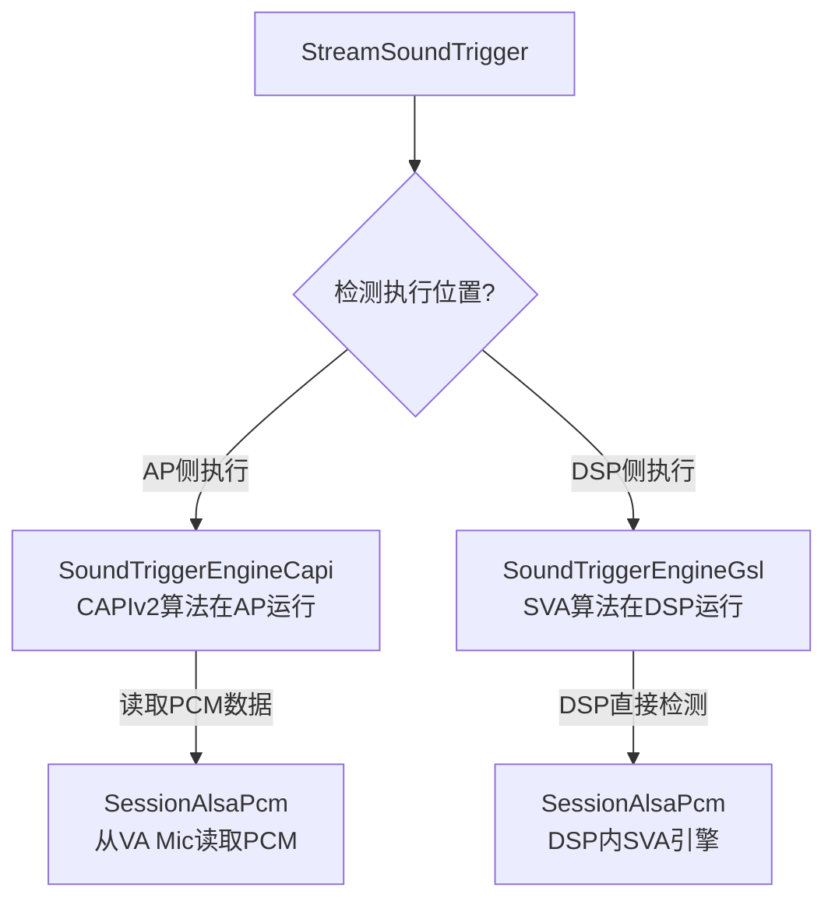

引擎选择由 `ResourceManager` 根据平台能力和配置决定：
- **SoundTriggerEngineCapi**：CAPIv2 算法库在 AP 侧执行，通过 SessionAlsaPcm 从 VA Mic 读取 PCM 数据，AP 侧运行检测算法
- **SoundTriggerEngineGsl**：SVA 算法在 DSP 侧执行，通过 SessionAlsaPcm 构建 DSP 检测图，DSP 直接处理 Mic 输入

### 15.5.6.2 模型加载与检测回调

**模型加载流程**：

1. 解析 `sound_model` 类型（KEYPHRASE / GENERIC）
2. 调用 `engine->loadSoundModel(sound_model)`：Capi引擎加载到AP内存，Gsl引擎通过AGM下发到DSP
3. 注册检测回调 `engine->registerCallback(detectionCallback)`
4. `currentState = OPENED`，等待 `start()` 触发检测

**检测事件回调链**：

```
DSP/CAPI 检测到关键短语
  → SoundTriggerEngine::detectionCallback()
    → StreamSoundTrigger::callback_(PAL_STREAM_CBK_EVENT, event_info)
      → Audio HAL: st_callback(SOUND_MODEL_STATE_DETECTED)
        → SoundTriggerMiddleware: 通知上层应用
```

检测事件 `pal_event_info` 包含：模型ID、关键短语ID、置信度分数、捕获的音频数据（可选）。

## 15.5.7 其他 Stream 子类详解

### 15.5.7.1 StreamInCall

> 源码路径：`stream/inc/StreamInCall.h`、`stream/src/StreamInCall.cpp`

通话辅助流，用于通话场景下的录音和背景音乐播放：

| 流类型 | 方向 | Session | 说明 |
|--------|------|---------|------|
| `PAL_STREAM_VOICE_CALL_RECORD` | INPUT | SessionAlsaPcm | 通话中录音，从Voice Proxy读取双向通话数据 |
| `PAL_STREAM_VOICE_CALL_MUSIC` | OUTPUT | SessionAlsaPcm | 通话中背景音乐，混入下行通路 |

StreamInCall 的特殊性在于它依赖已存在的 Voice Call Session，不能独立工作。`open()` 时会检查是否有活跃的语音通话流。

### 15.5.7.2 StreamACD

> 源码路径：`stream/inc/StreamACD.h`、`stream/src/StreamACD.cpp`

声学上下文检测流（Acoustic Context Detection），用于环境声学场景识别：

- 对应 `PAL_STREAM_ACD`，内部使用 `ACDEngine`
- ACD 引擎在 DSP 侧运行，通过 SessionAlsaPcm 构建检测图
- 支持的上下文类型：环境噪声级别、语音活动、音乐检测等
- 检测结果通过 `callback_(PAL_STREAM_CBK_EVENT)` 上报

### 15.5.7.3 StreamNonTunnel

非隧道模式流，对应 `PAL_STREAM_NON_TUNNEL`。数据路径不经过 DSP 处理链，AP 直接与 ALSA PCM 设备交互，使用 `SessionAlsaPcm`，适用于需要 AP 侧完整控制音频数据的场景。

### 15.5.7.4 StreamContextProxy / StreamSensorPCMData / StreamUltraSound

| 子类 | 流类型 | Session | 说明 |
|------|--------|---------|------|
| `StreamContextProxy` | `CONTEXT_PROXY` | ContextDetectionEngine | 上下文代理，统一管理SVA/ACD上下文事件 |
| `StreamSensorPCMData` | `SENSOR_PCM_DATA` | SessionAlsaPcm | 传感器音频数据采集（AMC/加速度计） |
| `StreamUltraSound` | `ULTRASOUND` | SessionAlsaPcm | 超声波近距检测，发射+接收回波 |

## 15.5.8 Stream::create() 工厂方法

`Stream::create()` 是创建流对象的核心工厂方法，根据 `pal_stream_type_t` 分配具体的子类实例：

| Stream子类 | 对应的 pal_stream_type_t | 核心用途 |
|------------|--------------------------|---------|
| `StreamPCM` | LOW_LATENCY, DEEP_BUFFER, GENERIC, VOIP_TX, VOIP_RX, PCM_OFFLOAD, VOICE_CALL, LOOPBACK, ULTRA_LOW_LATENCY, PROXY, PLAYBACK_BUS, HAPTICS, RAW | PCM播放/录制/通话 |
| `StreamCompress` | COMPRESSED | Offload压缩播放 |
| `StreamInCall` | VOICE_CALL_RECORD, VOICE_CALL_MUSIC | 通话录音/通话音乐 |
| `StreamSoundTrigger` | VOICE_UI, VOICE_ACTIVATION | 语音唤醒/触发 |
| `StreamACD` | ACD | 声学上下文检测 |
| `StreamNonTunnel` | NON_TUNNEL | 非隧道模式PCM |
| `StreamContextProxy` | CONTEXT_PROXY | 上下文代理 |
| `StreamSensorPCMData` | SENSOR_PCM_DATA | 传感器PCM数据 |
| `StreamUltraSound` | ULTRASOUND | 超声波近距检测 |

**工厂方法设计要点**：

- 多个流类型映射到同一子类（如13种类型都创建StreamPCM），子类内部根据具体type差异化处理
- `PAL_STREAM_PCM_OFFLOAD` 在 `Stream::create()` 中与其他 PCM 类型一同落入 `new StreamPCM` 分支（**并非** StreamCompress），仅 `PAL_STREAM_COMPRESSED` 独立创建 StreamCompress
- 工厂方法仅分配对象，不执行 `open()`，调用方需显式调用 `open()` 完成初始化

> **⚠️ 源码核实（勘误）** — 对照 `stream/src/Stream.cpp` 的 `Stream::create()` switch 分支：
> - 旧版将 `SPATIAL_AUDIO` 列入 StreamPCM → 源码无 `PAL_STREAM_SPATIAL_AUDIO`，已删除
> - 旧版遗漏 `LOOPBACK` → 真实 StreamPCM 分支含 `PAL_STREAM_LOOPBACK`，已补入
> - 旧版称 `PCM_OFFLOAD` 创建 StreamCompress → 源码中 `PAL_STREAM_PCM_OFFLOAD` 与 LOW_LATENCY 等同属 `new StreamPCM` 分支，已更正；StreamCompress 分支仅 `PAL_STREAM_COMPRESSED`

## 15.5.9 Stream 与 Session 交互时序

### 15.5.9.1 完整生命周期时序

```
Audio HAL → Stream::create(attributes)
  Stream → RM: registerStream(this)
Audio HAL → Stream::open()
  Stream → Device: getInstance(devId)
  Stream → Session: makeSession(rm, attributes) → session->open(this)
  Session: agm_session_open / pcm_open / compress_open
  Stream → Session: setupSessionDevice(this, devId)
Audio HAL → Stream::start()
  Stream → Session: start(this) → Device: start()
  Session: agm_graph_start / pcm_start
Audio HAL → Stream::write(buffer) / read(buffer)  [循环]
  Stream → Session: write/read(this, tag, buf, size)
Audio HAL → Stream::stop()
  Stream → Session: stop(this) → Session: agm_graph_stop / pcm_stop
Audio HAL → Stream::close()
  Stream → Session: close(this) → Device: close()
  Stream → RM: deregisterStream(this)
```

### 15.5.9.2 各阶段 Session 调用序列

| 阶段 | Stream调用 | Session调用 | 底层操作 |
|------|-----------|------------|---------|
| open | `open()` | `session->open(this)` | AGM: agm_session_open+graph_open; ALSA: pcm_open/compress_open |
| start | `start()` | `session->start(this)` | AGM: agm_graph_start; ALSA: pcm_start/compress_start |
| write | `write(buf)` | `session->write(this, tag, buf, &size)` | AGM: agm_write; ALSA: pcm_write/compress_write |
| read | `read(buf)` | `session->read(this, tag, buf, &size)` | AGM: agm_read; ALSA: pcm_read |
| stop | `stop()` | `session->stop(this)` | AGM: agm_graph_stop; ALSA: pcm_stop/compress_stop |
| close | `close()` | `session->close(this)` | AGM: agm_graph_close+session_close; ALSA: pcm_close/compress_close |

## 15.5.10 Stream 与 Device 关联机制

### 15.5.10.1 设备路由切换

Stream 通过 `mDevices` 向量维护关联的设备列表。`setDevice()` 是路由切换的核心入口：

- **播放流**：通常关联1个输出Device（如Speaker或Headphone），切换时断开旧Device、连接新Device
- **录音流**：通常关联1个输入Device（如SpeakerMic或HandsetVaMic）
- **双向流**（VoIP/VoiceCall）：关联2个Device（输出+输入），如Speaker+SpeakerMic

### 15.5.10.2 设备热插拔处理

当设备热插拔事件发生时（如耳机插拔），ResourceManager 通知受影响的 Stream：

```
ResourceManager::onDeviceConnectionStateChange(devId, connected)
  ├── 遍历所有活跃Stream
  ├── 对每个受影响Stream调用:
  │       ├── 设备断开: stream->pause() → currentState = SUSPENDED
  │       └── 设备连接: stream->setDevice(newDev) → stream->resume()
  └── 更新路由策略
```

SUSPENDED 状态是设备热插拔特有的中间状态，表示流因设备不可用而挂起，等待同类型设备重新可用后自动恢复。

## 15.5.11 并发流管理

### 15.5.11.1 同类型多流实例

PAL 允许同一流类型存在多个并发实例，由 ResourceManager 统一管理：

- 多个 `PAL_STREAM_LOW_LATENCY` 实例可同时存在（多个触控音效并发）
- 多个 `PAL_STREAM_DEEP_BUFFER` 实例可同时存在（多应用同时播放音乐）
- ResourceManager 维护 `mActiveStreams` 列表，跟踪所有活跃流

### 15.5.11.2 优先级抢占

当资源冲突时（如多个流争用同一Device），ResourceManager 根据流类型优先级决策：

| 优先级（高→低） | 流类型 | 抢占行为 |
|----------------|--------|---------|
| 最高 | `VOICE_CALL` | 抢占所有媒体流 |
| 高 | `VOICE_UI` | 语音唤醒时暂停媒体播放 |
| 中 | `RING` | 来电铃声优先于媒体 |
| 中低 | `LOW_LATENCY` | 系统提示音与媒体混音 |
| 低 | `DEEP_BUFFER` | 被高优先级流抢占 |

抢占流程：高优先级流的 `start()` 触发 RM 检查冲突 → 低优先级流被 `suspend()` → 高优先级流获得资源 → 低优先级流在高优先级流 `stop()` 后 `resume()`。

---

[← 上一个](15_15.4_流类型_pal_stream_type_t.md) | [← 返回15章](README.md) | [返回导航](../README.md) | [下一个 →](15_15.6_ResourceManager-PAL核心管理模块.md)

---


Device 是 PAL 三层抽象（Stream → Session → Device）的最底层，代表一个物理或逻辑音频端点。每个 Device 子类封装了特定硬件设备的初始化、ALSA 后端控制、混音器操作和参数管理逻辑。

## 15.6.1 Device 类层次图

```mermaid
graph TB
    Device[Device 基类<br/>device/inc/Device.h]

    subgraph AnalogOut[模拟输出设备]
        Speaker[Speaker<br/>PAL_DEVICE_OUT_SPEAKER]
        SpeakerProt[SpeakerProtection<br/>PAL_DEVICE_OUT_SPEAKER+保护]
        Handset[Handset<br/>PAL_DEVICE_OUT_HANDSET]
        Headphone[Headphone<br/>PAL_DEVICE_OUT_WIRED_HEADPHONE]
    end

    subgraph BtOut[蓝牙设备]
        Bluetooth[Bluetooth<br/>SCO+A2DP+LE Audio]
    end

    subgraph DigitalOut[数字输出设备]
        DisplayPort[DisplayPort<br/>PAL_DEVICE_OUT_AUX_DIGITAL]
        USBAudio[USBAudio<br/>PAL_DEVICE_OUT_USB_DEVICE/HEADSET]
        FMDevice[FMDevice<br/>PAL_DEVICE_OUT_FM]
        HapticsDev[HapticsDev<br/>PAL_DEVICE_OUT_HAPTICS_DEVICE]
        RTProxy[RTProxy<br/>PAL_DEVICE_OUT_PROXY]
        UltrasoundDev[UltrasoundDevice<br/>PAL_DEVICE_OUT_ULTRASOUND]
    end

    subgraph A2BOut[A2B总线设备]
        A2BSpeaker[A2BSpeaker<br/>PAL_DEVICE_OUT_A2B_SPKR]
        A2B2Speaker[A2B2Speaker<br/>PAL_DEVICE_OUT_A2B2_SPKR]
    end

    subgraph AnalogIn[模拟输入设备]
        SpeakerMic[SpeakerMic<br/>PAL_DEVICE_IN_SPEAKER_MIC]
        HandsetMic[HandsetMic<br/>PAL_DEVICE_IN_HANDSET_MIC]
        HandsetVaMic[HandsetVaMic<br/>PAL_DEVICE_IN_HANDSET_VA_MIC]
        HeadsetMic[HeadsetMic<br/>PAL_DEVICE_IN_WIRED_HEADSET]
        HeadsetVaMic[HeadsetVaMic<br/>PAL_DEVICE_IN_HEADSET_VA_MIC]
    end

    subgraph SpecialIn[特殊输入设备]
        ExtEC[ExtEC<br/>PAL_DEVICE_IN_EXT_EC_REF]
    end

    Device --> Speaker
    Device --> SpeakerProt
    Device --> Handset
    Device --> Headphone
    Device --> Bluetooth
    Device --> DisplayPort
    Device --> USBAudio
    Device --> FMDevice
    Device --> HapticsDev
    Device --> RTProxy
    Device --> UltrasoundDev
    Device --> A2BSpeaker
    Device --> A2B2Speaker
    Device --> SpeakerMic
    Device --> HandsetMic
    Device --> HandsetVaMic
    Device --> HeadsetMic
    Device --> HeadsetVaMic
    Device --> ExtEC
```

## 15.6.2 Device::getInstance() 工厂方法

Device 对象的创建由静态工厂方法 `Device::getInstance()` 驱动，根据 `pal_device_id_t` 枚举值映射到具体子类。

### 15.6.2.1 工厂方法签名

```cpp
class Device {
public:
    // 主工厂方法：创建Device实例，同时注册到ResourceManager
    static std::shared_ptr<Device> getInstance(
        struct pal_device *device,       // 包含pal_device_id_t和配置属性
        ResourceManager *rm              // 资源管理器引用
    );
    // 辅助工厂方法：仅创建对象，不注册
    static std::shared_ptr<Device> getObject(pal_device_id_t devId);
};
```

### 15.6.2.2 pal_device_id_t → Device子类映射表

`Device::getInstance()` 内部通过 switch-case 将 `pal_device_id_t` 映射到具体 Device 子类：

| pal_device_id_t | Device 子类 | ALSA BE | 用途 |
|-----------------|------------|---------|------|
| `PAL_DEVICE_OUT_SPEAKER` | Speaker | `speaker` | 扬声器播放 |
| `PAL_DEVICE_OUT_SPEAKER`(保护模式) | SpeakerProtection | `speaker` | 带温升保护的扬声器 |
| `PAL_DEVICE_OUT_HANDSET` | Handset | `handset` | 听筒播放 |
| `PAL_DEVICE_OUT_WIRED_HEADPHONE` | Headphone | `headphone` | 三段耳机 |
| `PAL_DEVICE_OUT_WIRED_HEADSET` | Headphone | `headset` | 四段耳麦输出 |
| `PAL_DEVICE_OUT_BLUETOOTH_SCO` | Bluetooth | `bt-sco` | SCO通话 |
| `PAL_DEVICE_OUT_BLUETOOTH_A2DP` | Bluetooth | `bt-a2dp` | A2DP媒体 |
| `PAL_DEVICE_OUT_AUX_DIGITAL` | DisplayPort | `display-port` | DP/HDMI音频 |
| `PAL_DEVICE_OUT_USB_DEVICE` | USBAudio | `usb-device` | USB音频设备 |
| `PAL_DEVICE_OUT_USB_HEADSET` | USBAudio | `usb-headset` | USB耳机 |
| `PAL_DEVICE_OUT_FM` | FMDevice | `fm` | FM收音机输出 |
| `PAL_DEVICE_OUT_HAPTICS_DEVICE` | HapticsDev | `haptics-dev` | 触觉反馈 |
| `PAL_DEVICE_OUT_PROXY` | RTProxy | `proxy-out` | 实时代理输出 |
| `PAL_DEVICE_OUT_ULTRASOUND` | UltrasoundDevice | `ultrasound` | 超声波 |
| `PAL_DEVICE_OUT_A2B_SPKR` | A2BSpeaker | `a2b-spkr` | A2B总线扬声器 |
| `PAL_DEVICE_OUT_A2B2_SPKR` | A2B2Speaker | `a2b2-spkr` | A2B2总线扬声器 |
| `PAL_DEVICE_IN_HANDSET_MIC` | HandsetMic | `handset-mic` | 手持麦克风 |
| `PAL_DEVICE_IN_SPEAKER_MIC` | SpeakerMic | `speaker-mic` | 扬声器麦克风 |
| `PAL_DEVICE_IN_HANDSET_VA_MIC` | HandsetVaMic | `va-mic` | VA语音唤醒麦 |
| `PAL_DEVICE_IN_WIRED_HEADSET` | HeadsetMic | `headset-mic` | 有线耳麦输入 |
| `PAL_DEVICE_IN_HEADSET_VA_MIC` | HeadsetVaMic | `va-mic-headset` | 耳机VA麦 |
| `PAL_DEVICE_IN_EXT_EC_REF` | ExtEC | `ext-ec-ref` | 外部回声参考 |

> **SpeakerProtection 选择逻辑**：当 ResourceManager 检测到 `spkr_prot_enable=true`，`getInstance()` 创建 `SpeakerProtection` 而非普通 `Speaker`。两者共享相同的 `pal_device_id_t`，通过 RM 的保护标志区分。

### 15.6.2.3 工厂方法内部流程

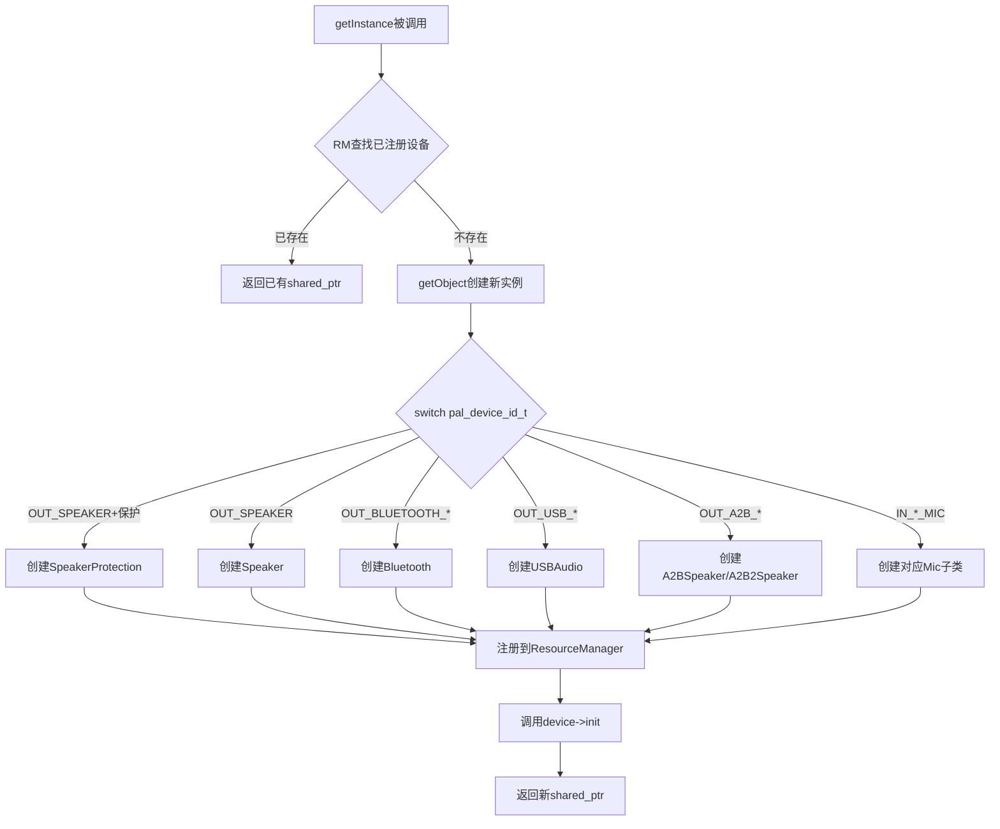

## 15.6.3 Device 基类详解

### 15.6.3.1 Device 基类定义

```cpp
class Device {
public:
    // === 生命周期管理 ===
    virtual int32_t init();                              // 设备初始化
    virtual int32_t deinit();                            // 设备注销
    virtual int32_t open() = 0;                          // 打开ALSA BE PCM设备
    virtual int32_t close() = 0;                         // 关闭ALSA BE PCM设备
    virtual int32_t start() = 0;                         // 启动音频数据流
    virtual int32_t stop() = 0;                          // 停止音频数据流

    // === 工厂方法 ===
    static std::shared_ptr<Device> getInstance(struct pal_device *device, ResourceManager *rm);
    static std::shared_ptr<Device> getObject(pal_device_id_t devId);

    // === 参数与属性 ===
    virtual int32_t setParam(uint32_t param_id, void *param);
    virtual int32_t getParam(uint32_t param_id, void **param);
    virtual int32_t setConfig(struct pal_device *device);
    struct pal_device* getDeviceAttributes();
    int32_t setDeviceAttributes(struct pal_device *attr);

protected:
    struct pal_device* mDeviceAttr;    // 设备属性（含id、config等）
    ResourceManager* rm;               // 资源管理器引用
    std::mutex mDeviceMutex;           // 设备操作互斥锁
};
```

### 15.6.3.2 设备状态机

每个 Device 实例遵循严格的生命周期状态机：

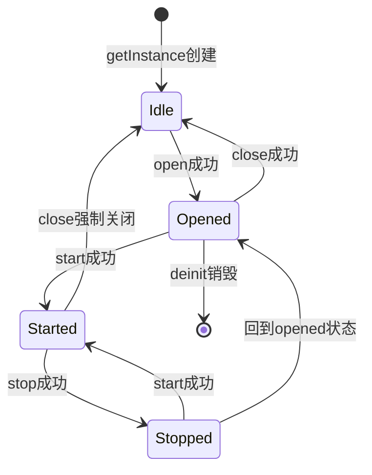

| 状态 | 说明 | ALSA操作 | 允许的转换 |
|------|------|---------|-----------|
| **Idle** | 设备已创建但未打开 | 无 | → Opened |
| **Opened** | ALSA BE已打开，PCM就绪 | `pcm_open()` / `mixer_open()` | → Started / → Idle |
| **Started** | 音频数据流运行中 | `pcm_start()` / `pcm_write()` | → Stopped |
| **Stopped** | 数据流暂停，设备保持打开 | `pcm_stop()` | → Started / → Opened |

> **关键约束**：Device 的 open/close 由 Stream 通过 Session 间接调用。`connectSessionDevice` 触发 open，`disconnectSessionDevice` 触发 close。

## 15.6.4 Device 与 Session 的连接机制

Device 与 Session 通过 `connectSessionDevice` / `disconnectSessionDevice` 建立和断开连接，是 Stream→Session→Device 三层协作的关键环节。

### 15.6.4.1 连接与断开流程

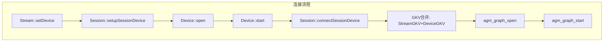

| Session 方法 | Device 侧响应 | 说明 |
|-------------|-------------|------|
| `setupSessionDevice(s, devId)` | 无直接调用 | 准备Session的设备侧配置 |
| `connectSessionDevice(s, d)` | `d->open()` + `d->start()` | 建立设备连接 |
| `disconnectSessionDevice(s, d)` | `d->stop()` + `d->close()` | 断开设备连接 |
| `setECRef(s, dev, is_enable)` | ExtEC设备open/close | AEC参考信号管理 |

## 15.6.5 Device 与 ResourceManager 的交互

Device 通过 `rm` 指针与 ResourceManager 交互，主要涉及设备路由、EC参考和并发管理：

| ResourceManager 方法 | 说明 | Device 调用场景 |
|---------------------|------|----------------|
| `getDeviceInfo(devId, &info)` | 获取设备配置信息 | Device::init 中读取设备属性 |
| `getSndDeviceName(devId, name)` | 获取ALSA声卡设备名 | ALSA PCM设备打开 |
| `getMixerName(name)` | 获取ALSA混音器名称 | Mixer控制 |
| `isDeviceAvailable(devId)` | 检查设备可用性 | 并发设备判断 |
| `getECRef(devId, &ecDev)` | 获取EC参考设备 | AEC配置 |
| `getSpkrProtEnable()` | 查询扬声器保护开关 | Speaker/SpeakerProtection选择 |
| `getCurrentPalDevice(devId)` | 获取已注册的Device实例 | 设备共享复用 |

**设备并发与EC参考管理**：
- **共享设备**：多个 Stream 可共享同一 Device 实例，第一个 connect 触发 open，最后一个 disconnect 触发 close
- **EC参考路由**：VoIP/通话需 AEC 时，RM 自动关联 ExtEC 设备作为回声参考
- **设备互斥**：Speaker 和 Handset 互斥；蓝牙 SCO 和 A2DP 可并发（双模）

## 15.6.6 关键 Device 子类详解

### 15.6.6.1 Speaker / SpeakerProtection

> 源码路径：`device/inc/Speaker.h`、`device/inc/SpeakerProtection.h`

**Speaker 核心方法逻辑**：

| 方法 | 内部逻辑 | ALSA/Mixer操作 |
|------|---------|---------------|
| `open()` | 读取RM配置→设置采样率/位深→打开ALSA BE PCM | `pcm_open(sndDevName)` → 配置 `PCM_FORMAT_S16_LE / 48kHz` |
| `start()` | 配置Speaker Mixer→启动PCM流 | `mixer_ctl_set(SPKR Switch, 1)` → `pcm_start()` |
| `stop()` | 停止PCM→关闭Speaker Switch | `pcm_stop()` → `mixer_ctl_set(SPKR Switch, 0)` |
| `close()` | 关闭ALSA PCM→释放资源 | `pcm_close()` |

**SpeakerProtection 温升保护与excursion限制**：

SpeakerProtection 是车载和移动设备中至关重要的安全机制，防止扬声器因过热或过冲程损坏：

```cpp
class SpeakerProtection : public Device {
    int thermalThre;                // 温度阈值（0.1℃单位）
    int spkrPos;                    // 扬声器位置（0=左，1=右）
    struct vi_feed_msg viMsg;       // VI反馈消息
    bool spkrCalState;              // 校准状态
    pal_device_id_t viDeviceId;     // VI反馈设备ID
    std::shared_ptr<Device> viDevice;  // VI反馈设备实例
    std::thread spkrProtThread;     // 保护监控线程
    bool isSpkrProtEnabled;         // 保护使能标志
};
```

| 保护类型 | 检测方法 | 响应动作 | 阈值来源 |
|---------|---------|---------|---------|
| **温升保护** | VI反馈→阻抗R=V/I→温度推算 | 逐级降低增益（-6dB/步），温度回落后恢复 | `spkr_prot_cfg` 配置 |
| **Excursion保护** | VI信号→振膜位移建模 | 限制低频能量，HPF截止频率上移 | `excursion_limit` 配置 |
| **校准** | 开机首次播放前VI采集 | 计算R0(静态阻抗)和Th(热时间常数)，存入ACDB | ACDB校准数据 |

> **VI反馈通道**：SpeakerProtection 通过 `PAL_DEVICE_IN_VI_FEEDBACK`（id=40）获取实时 VI 信号，读取扬声器音圈电压/电流，计算阻抗 R=V/I，再根据 R-T 曲线推算音圈温度。VI通道在 SpeakerProtection::start() 中打开，stop() 中关闭。

### 15.6.6.2 Handset / HandsetMic / HandsetVaMic

> 源码路径：`device/inc/Handset.h`

| 子类 | pal_device_id_t | ALSA BE | 用途 |
|------|----------------|---------|------|
| Handset | `PAL_DEVICE_OUT_HANDSET` | `handset` | 听筒输出（通话模式） |
| HandsetMic | `PAL_DEVICE_IN_HANDSET_MIC` | `handset-mic` | 手持麦克风（普通录音/通话上行） |
| HandsetVaMic | `PAL_DEVICE_IN_HANDSET_VA_MIC` | `va-mic` | 语音唤醒专用麦克风（低功耗DSP前端） |

**HandsetMic vs HandsetVaMic 关键差异**：

| 特性 | HandsetMic | HandsetVaMic |
|------|-----------|-------------|
| DSP前端 | 普通ADC采集 | 低功耗CPE/SLPI前端 |
| 唤醒场景 | 通话/录音 | 语音触发/Always-On |
| 采样率 | 16kHz/48kHz | 16kHz（标准SVA） |
| 通道配置 | 单通道 | 多通道（支持波束成形） |
| 功耗 | 正常 | 极低（仅CPE活跃时） |

### 15.6.6.3 Headphone / HeadsetMic

> 源码路径：`device/inc/Headphone.h`

Headphone 同时覆盖三段耳机（`PAL_DEVICE_OUT_WIRED_HEADPHONE`）和四段耳麦（`PAL_DEVICE_OUT_WIRED_HEADSET`），通过 `pal_device_id_t` 区分。

```cpp
class Headphone : public Device {
    bool isHeadsetMon;       // 是否为耳麦（含麦克风）监控
    int channelMode;         // 声道模式（立体声/单声道）
    int32_t processHotplugEvent();  // 处理耳机插拔事件
};
```

> **三段vs四段检测**：ALSA驱动层通过机械偏置检测（mic bias电压变化）区分三段/四段，上报到PAL后决定创建 Headphone(输出) 还是 HeadsetMic(输入+输出) 设备对。

### 15.6.6.4 Bluetooth — SCO/A2DP/LE Audio 三模式

> 源码路径：`device/inc/Bluetooth.h`

Bluetooth 是最复杂的 Device 子类，同时承载 SCO 通话、A2DP 媒体和 LE Audio 三种蓝牙音频模式：

```cpp
class Bluetooth : public Device {
    bt_pal_mode_t btMode;               // 当前模式: SCO/A2DP/LE_AUDIO
    audio_bt_codec_format_t codecFormat; // 当前编解码格式
    void *codecLibHandle;               // 编解码库动态加载句柄
    bt_codec_t *btCodec;                // 编解码器实例
    bool isWbSco;                       // 宽带SCO标志
    int scoFd;                          // SCO文件描述符
    uint32_t a2dpEncLatency;            // A2DP编码延迟
    uint32_t leAudioGroupId;            // LE Audio组ID
};
```

**三种模式核心参数对比**：

| 模式 | 编解码器 | ALSA BE | 采样率 | 延迟 | 用途 |
|------|---------|---------|--------|------|------|
| **SCO** | CVSD / mSBC | `bt-sco` | 8kHz(NB) / 16kHz(WB) | ~50ms | 语音通话 |
| **A2DP** | SBC / AAC / aptX / aptX-HD / LDAC | `bt-a2dp` | 44.1/48kHz | 100-200ms | 音乐播放 |
| **LE Audio** | LC3 | `bt-le-audio` | 16/24/32/48kHz | 20-40ms | 低延迟双向音频 |

**模式切换逻辑**：Bluetooth::open() 根据 `pal_device_id_t` 选择模式：
- `PAL_DEVICE_OUT_BLUETOOTH_SCO` → SCO模式：配置NB/WB语音编解码，打开bt-sco ALSA BE
- `PAL_DEVICE_OUT_BLUETOOTH_A2DP` → A2DP模式：选择编解码器(SBC/AAC/aptX/LDAC)，加载codec plugin，打开bt-a2dp ALSA BE
- `PAL_DEVICE_OUT_BLUETOOTH_LE` → LE Audio模式：配置LC3编解码，打开bt-le ALSA BE

> **A2DP编解码器插件**：A2DP编解码器通过 `plugins/codecs/` 动态库加载，每个编解码器实现 `bt_codec_t` 接口（`encoder_init/encode/deinit`），PAL 通过 `dlopen/dlsym` 动态加载。

### 15.6.6.5 USBAudio — 动态检测与能力查询

> 源码路径：`device/inc/USBAudio.h`

```cpp
class USBAudio : public Device {
    int usbCardId;                      // ALSA声卡号
    int usbDeviceId;                    // ALSA设备号
    bool isUsbConnected;                // USB连接状态
    std::vector<uint32_t> supportedRates;   // 支持的采样率列表
    std::vector<uint32_t> supportedFormats; // 支持的位深列表
    uint32_t supportedChannels;             // 支持的通道数
};
```

**USB设备动态检测**：PAL 通过 UEVENT 监听 `/dev/snd/` 下设备节点变化，解析 `card=N` 获取声卡号，通过 `/proc/asound/cardN/` 读取设备能力，缓存后通知 ResourceManager 触发 Stream 路由切换。

| 方法 | 关键逻辑 |
|------|---------|
| `open()` | 解析ALSA声卡路径→读取USB设备能力→配置PCM参数→打开ALSA BE |
| `getParam(PAL_PARAM_ID_USBAUDIO_CARD_STATUS)` | 返回USB声卡号和设备号 |
| `getParam(PAL_PARAM_ID_USBAUDIO_SUPPORTED_DEV)` | 返回支持的采样率/位深/通道列表 |

### 15.6.6.6 A2BSpeaker / A2B2Speaker — AAOS 车机专用

> 源码路径：`device/inc/A2BSpeaker.h`

A2B（Automotive Audio Bus）是 ADI 开发的车用音频总线协议，AAOS 车载音频的核心输出设备：

```cpp
class A2BSpeaker : public Device {
    int32_t a2bNodeId;             // A2B节点ID（总线拓扑位置）
    int32_t tdmSlot;               // TDM时隙号
    int32_t a2bSampleRate;         // A2B采样率（通常48kHz）
    bool isA2BMaster;              // 是否为主节点
};
```

| 特性 | 说明 |
|------|------|
| **总线协议** | A2B (Automotive Audio Bus)，ADI 开发 |
| **物理层** | 单双绞线，最大50m总线长度，最多11个从节点 |
| **TDM配置** | TDM8/TDM16/TDM32，每时隙32bit，48kHz帧率 |
| **ALSA后端** | A2B BE对应TDM DAI，`a2b-spkr` / `a2b2-spkr` |
| **AAOS映射** | A2BSpeaker→Zone0主舱，A2B2Speaker→Zone1后舱 |
| **延迟** | 极低（~1.5ms总线延迟+DSP处理） |
| **与CarAudio配合** | `PAL_STREAM_PLAYBACK_BUS` → SessionAlsaPcm → A2BSpeaker |

> **A2B vs A2B2**：SA8295 平台支持两条独立 A2B 总线。A2BSpeaker 映射第一条总线（Zone0），A2B2Speaker 映射第二条总线（Zone1），通过 CarAudio Zone 管理实现多舱独立音频路由。

### 15.6.6.7 其他特殊 Device 子类

#### DisplayPort（`device/inc/DisplayPort.h`）
- 设备ID：`PAL_DEVICE_OUT_AUX_DIGITAL`，ALSA BE：`display-port`
- 支持最高192kHz/8通道(7.1)，Mixer控制：`DisplayPort Audio Switch`、`DisplayPort Format`
- 支持HDCP音频保护，多显示器独立音频流

#### FMDevice（`device/inc/FMDevice.h`）
- 设备ID：`PAL_DEVICE_OUT_FM`，ALSA BE：`fm`
- FM收音机音频输出，通过 `audio_extn/fm.c` 与FM HAL交互
- 可与SCO并发（听FM同时接电话），需RM并发路由支持

#### HapticsDev（`device/inc/HapticsDev.h`）
- 设备ID：`PAL_DEVICE_OUT_HAPTICS_DEVICE`，ALSA BE：`haptics-dev`
- 触觉波形PCM数据，`PAL_STREAM_HAPTICS` → StreamPCM → SessionAlsaPcm → HapticsDev
- 触觉播放与音频播放可并发，各自独立ALSA BE

#### ExtEC（`device/inc/ExtEC.h`）
- 设备ID：`PAL_DEVICE_IN_EXT_EC_REF`，ALSA BE：`ext-ec-ref`
- 为VoIP/通话AEC提供外部回声参考信号，`Session::setECRef()` 触发 open/start
- 典型场景：外部PA回采、总线回声参考

#### RTProxy（`device/inc/RTProxy.h`）
- 设备ID：`PAL_DEVICE_OUT_PROXY` / `PAL_DEVICE_IN_PROXY`，ALSA BE：`proxy-out/in`
- 通话录音/上下行代理/Loopback，`PAL_STREAM_VOICE_CALL_RECORD` → RTProxy(In)

#### UltrasoundDevice（`device/inc/UltrasoundDevice.h`）
- 设备ID：`PAL_DEVICE_OUT_ULTRASOUND` + `PAL_DEVICE_IN_ULTRASOUND_MIC`
- 超声波近距检测（手势识别、接近传感），发射20-40kHz超声波

## 15.6.7 Device 子类与 ALSA 后端/Mixer 控制点汇总

| Device 子类 | ALSA BE 名称 | PCM 设备路径 | 关键 Mixer 控制点 |
|------------|-------------|-------------|------------------|
| Speaker | `speaker` | `pcmC0D0p` | `SPKR Switch`, `SPKR Volume`, `SPKR PA Gain` |
| SpeakerProtection | `speaker` | `pcmC0D0p` | 同上 + `VI_FEED Switch` |
| Handset | `handset` | `pcmC0D1p` | `Handset Switch`, `EAR PA Gain` |
| Headphone | `headphone` | `pcmC0D2p` | `Headphone Switch`, `HP Volume` |
| Bluetooth SCO | `bt-sco` | `pcmC0D4p/c` | `BT SCO Rate`, `BT SCO Format` |
| Bluetooth A2DP | `bt-a2dp` | `pcmC0D5p` | `BT A2DP Format`, `A2DP Encoder` |
| USBAudio | `usb-device` | `pcmC${card}D${dev}p` | 动态，取决于USB设备 |
| DisplayPort | `display-port` | `pcmC0D6p` | `DisplayPort Audio Switch` |
| A2BSpeaker | `a2b-spkr` | TDM BE | `A2B Slot`, `A2B Rate` |
| HapticsDev | `haptics-dev` | `pcmC0D7p` | `Haptics Switch` |
| ExtEC | `ext-ec-ref` | `pcmC0D8c` | `EC Ref Switch` |
| RTProxy | `proxy-out/in` | `pcmC0D9p/c` | `Proxy Switch` |

> **ALSA BE 命名规则**：ALSA Back-End 名称在 `resource_manager.xml` 的 `<device_profile>` 节点中定义，与内核 DTS 的 sound-dai 名称对应。PCM 路径中 `C0` 表示声卡0（内置CODEC），USB设备使用动态声卡号。

---


---


Session 是 PAL 三层抽象（Stream → Session → Device）的中间层，代表 Stream 与底层音频子系统（AGM/GSL/ALSA）之间的交互通道。Stream 负责面向应用的流生命周期管理，Device 负责物理端点控制，而 Session 封装了数据通路的具体建立与操作逻辑——包括音频图的构建与拆解、ALSA 设备的打开与关闭、KV 键值的配置下发等。不同类型的音频流需要不同类型的 Session 来驱动底层子系统。

## 15.7.1 Session 类层次图

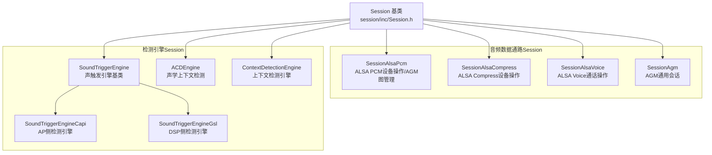

**类层次设计要点**：

- Session 基类定义统一的纯虚接口，所有子类通过实现这些接口完成对不同底层子系统的适配
- 音频数据通路 Session（SessionAlsaPcm / SessionAlsaCompress / SessionAlsaVoice / SessionAgm）面向音频数据传输
- 检测引擎 Session（SoundTriggerEngine / ACDEngine / ContextDetectionEngine）面向关键字/上下文检测
- SoundTriggerEngine 本身也是基类，拥有 Capi 和 GSL 两个子引擎实现

## 15.7.2 Session 基类接口定义

Session 基类是所有会话类型的公共抽象，定义了完整的生命周期、数据操作、配置和设备交互接口：

```cpp
class Session {
public:
    // === 生命周期管理 ===
    virtual int32_t open(Stream *s) = 0;
    virtual int32_t close(Stream *s) = 0;
    virtual int32_t start(Stream *s) = 0;
    virtual int32_t stop(Stream *s) = 0;

    // === 数据操作 ===
    virtual int32_t read(Stream *s, int tag,
                         struct pal_buffer *buf, uint32_t *size) = 0;
    virtual int32_t write(Stream *s, int tag,
                          struct pal_buffer *buf, uint32_t *size) = 0;

    // === 配置管理 ===
    virtual int32_t setConfig(Stream *s, configType type, int tag = 0) = 0;
    virtual int32_t setTKV(Stream *s, configType type,
                           effect_pal_effect_t effect = EFFECT_NONE) = 0;

    // === 设备交互 ===
    virtual int32_t setupSessionDevice(Stream *s, pal_device_id_t devId) = 0;
    virtual int32_t connectSessionDevice(Stream *s,
                                         std::shared_ptr<Device> d) = 0;
    virtual int32_t disconnectSessionDevice(Stream *s,
                                            std::shared_ptr<Device> d) = 0;

    // === 回声消除参考 ===
    virtual int32_t setECRef(Stream *s, std::shared_ptr<Device> dev,
                             bool is_enable) = 0;

    // === 工厂方法 ===
    static Session* makeSession(ResourceManager *rm,
                                struct pal_stream_attributes *attributes);
};
```

**接口分类解析**：

| 接口类别 | 方法 | 说明 |
|---------|------|------|
| 生命周期 | open/close/start/stop | 控制会话的创建、启动、停止、销毁 |
| 数据操作 | read/write | 音频数据的读写传输 |
| 配置管理 | setConfig/setTKV | 下发 GKV/CKV/TKV 等键值配置 |
| 设备交互 | setupSessionDevice/connectSessionDevice/disconnectSessionDevice | Session 与 Device 的绑定与解绑 |
| 回声消除 | setECRef | 设置回声消除参考信号设备 |
| 工厂方法 | makeSession | 根据流类型创建合适的 Session 子类 |

**关键设计**：所有方法都以 `Stream*` 作为第一参数，说明 Session 始终在 Stream 的上下文中被调用，Session 不独立存在，而是 Stream 的执行代理。

## 15.7.3 Session 生命周期状态机

Session 的生命周期由 Stream 驱动，遵循严格的状态转换规则：

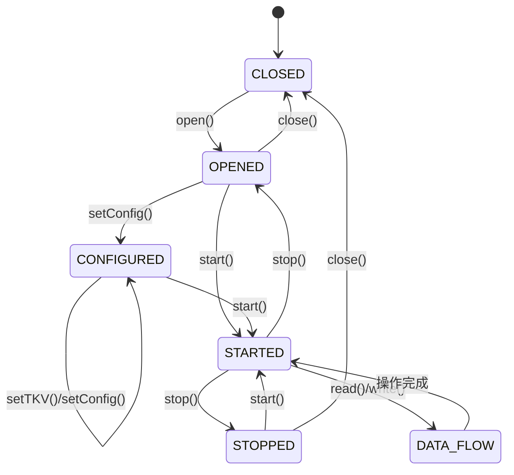

**状态详解**：

| 状态 | 含义 | 典型操作 |
|------|------|---------|
| CLOSED | 初始/已关闭状态 | Session 刚创建或已释放底层资源 |
| OPENED | 已打开底层通道 | 音频图/ALSA设备已打开，但尚未配置 |
| CONFIGURED | 已完成KV配置 | GKV/CKV/TKV 已下发，数据通路参数已设定 |
| STARTED | 已启动数据流 | 底层图/设备已启动，可进行 read/write |
| STOPPED | 已停止数据流 | 数据流暂停，但通道仍保持打开 |
| DATA_FLOW | 数据传输中 | 正在执行 read 或 write 操作 |

**Session 与 Stream 状态的对应关系**：

- Stream::open() → Session::open() + Session::setConfig()
- Stream::start() → Session::start()
- Stream::stop() → Session::stop()
- Stream::close() → Session::close()
- Stream::read()/write() → Session::read()/write()

## 15.7.4 GSL 音频图会话（由 SessionAlsaPcm 实现）

### 15.7.4.1 类定义与核心成员

> **重要更正（对照 `session/src/Session.cpp:83` makeSession）**：源码中**不存在** `SessionGsl` 运行类，`SessionGsl.cpp` 已从代码库移除，仅遗留 `session/inc/SessionGsl.h`。承担 GSL 音频图管理职责的是 **default 分支创建的 `SessionAlsaPcm`**（普通 PCM 类流）。下方类定义按 `SessionAlsaPcm` 承担的 GSL 交互职责给出，其中 gkv/ckv/tkv 与 GSL API 指针为真实的 GSL 库抽象。

`SessionAlsaPcm` 是 AudioReach 架构下 PCM 类流最核心的 Session 实现，经 AGM 管理 GSL 音频图的完整生命周期。绝大多数 PCM 类流（LOW_LATENCY/DEEP_BUFFER/ULL 等 default 分支）都通过它驱动：

```cpp
class SessionAlsaPcm : public Session {   // 承担原文档所述 "SessionGsl" 的 GSL 图管理职责
private:
    void* graphHandle;              // GSL/AGM音频图句柄
    gsl_key_vector_t* gkv;          // Graph Key Vector 图键向量
    gsl_key_vector_t* ckv;          // Calibration Key Vector 校准键向量
    gsl_key_vector_t* tkv;          // Tag Key Vector 标签键向量
    PayloadBuilder* builder;        // 载荷构建器，构建KV和配置payload
    void* gslLibHandle;             // GSL库动态加载句柄
    std::mutex gsl_lock_;           // GSL操作互斥锁
    struct pal_stream_attributes* streamAttr;  // 流属性缓存

    // GSL API函数指针（动态加载）
    int (*gsl_open_graph)(void*, gsl_key_vector_t*, void**);
    int (*gsl_start_graph)(void*);
    int (*gsl_stop_graph)(void*);
    int (*gsl_close_graph)(void*);
    int (*gsl_set_config)(void*, gsl_key_vector_t*, gsl_key_vector_t*);
    int (*gsl_read)(void*, gsl_key_vector_t*, struct gsl_buff*);
    int (*gsl_write)(void*, gsl_key_vector_t*, struct gsl_buff*);
};
```

**核心成员解析**：

| 成员 | 类型 | 说明 |
|------|------|------|
| graphHandle | void* | AGM/GSL 音频图的句柄，open 时获取，close 时释放 |
| gkv | gsl_key_vector_t* | 图键向量，定义音频图的拓扑结构（模块连接关系） |
| ckv | gsl_key_vector_t* | 校准键向量，携带音量/采样率等运行时校准参数 |
| tkv | gsl_key_vector_t* | 标签键向量，标识图中的特定模块或控制点 |
| builder | PayloadBuilder* | 构建器，负责根据 Stream/Device 属性构建 KV payload |
| gslLibHandle | void* | libgsl.so 或 libagm.so 的 dlopen 句柄 |

### 15.7.4.2 核心方法调用链

SessionAlsaPcm 的核心方法通过 AGM API 间接调用 GSL，形成完整的调用链：

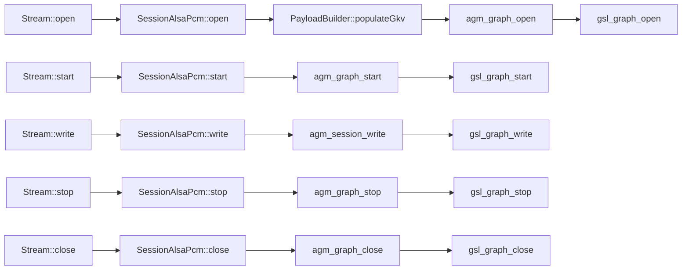

### 15.7.4.3 open() 方法详解

SessionAlsaPcm::open() 是最复杂的方法，需要完成 KV 构建、图打开和配置下发：

```
SessionAlsaPcm::open(Stream *s)
  ├── 1. 缓存流属性 streamAttr = s->getAttributes()
  ├── 2. PayloadBuilder::populateGkv()    → 构建 GKV
  │     └── 根据 pal_stream_type + pal_device_id 生成模块拓扑键值对
  ├── 3. PayloadBuilder::populateCkv()    → 构建 CKV
  │     └── 填充音量、采样率等运行时校准参数
  ├── 4. agm_graph_open(gkv, ckv, &graphHandle)
  │     ├── AudioReach路径: agm → gsl_fe → MM-HAB → QNX gsl_vm_be
  │     └── Legacy路径: agm → gsl_open_graph()
  ├── 5. 遍历关联设备列表
  │     ├── setupSessionDevice(s, devId)
  │     └── connectSessionDevice(s, device)
  └── 6. 返回 graphHandle（成功）或错误码
```

### 15.7.4.4 setConfig() 方法详解

setConfig() 是运行时配置的核心入口，根据 configType 执行不同配置操作：

| configType | 操作 | 底层调用 |
|------------|------|---------|
| MODULE | 配置模块参数 | agm_session_set_config(session_id, payload) |
| KV | 更新键值向量 | 重新构建 GKV/CKV/TKV 并下发 |
| STREAM | 配置流属性 | agm_session_set_config 带流参数 |
| DEVICE | 配置设备参数 | agm_session_set_config 带设备参数 |

### 15.7.4.5 SA8295 跨 VM 路径特殊性

在 SA8295 平台上，SessionAlsaPcm 的调用路径具有跨 VM 特征：

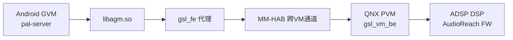

**跨 VM 路径要点**：

- Android 侧（GVM）PAL 进程调用 AGM API → libagm.so 内部由 gsl_fe 代理封装
- gsl_fe 通过 MM-HAB（MultiMedia-Hypervisor Application Buffer）跨 VM 通道转发到 QNX 侧（PVM）
- QNX 侧 gsl_vm_be 接收请求，调用真正的 GSL API 与 ADSP DSP 交互
- 此路径对 SessionAlsaPcm 代码完全透明——AGM API 签名不变，跨 VM 逻辑封装在 libagm.so 内部
- 时延增加约 0.5-2ms（取决于 MM-HAB 通道负载），对低延迟流有影响

## 15.7.5 SessionAgm — AGM 通用会话

> 源码路径：`session/inc/SessionAgm.h`、`session/src/SessionAgm.cpp`

> **⚠️ 源码核实（勘误）** — 本节原描述为"第二个 SessionAlsaPcm 通过 tinyalsa 直通、不经 DSP 图"，属虚构：`session/src/` 下**只有一个** `SessionAlsaPcm`（已在 15.7.4 描述，经 AGM 管理 GSL 图）。真实的第二类会话是 **`SessionAgm`**（AGM 通用会话）。原文 tinyalsa 直通类定义及"SessionAlsaPcm 与 SessionAlsaPcm 的选择逻辑"重复段已删除。

SessionAgm 直接封装 AGM（Audio Graph Manager）会话句柄，通过 `agm_session_*` API 驱动音频图，成员均为 AGM 抽象而非 tinyalsa 句柄：

```cpp
class SessionAgm : public Session {
private:
    int32_t instanceId;
    uint64_t agmSessHandle;                          // AGM会话句柄
    bool playback_started;
    bool playback_paused;
    int ioMode;
    std::vector<int> sessionIds;
    std::vector<std::pair<int,int>> ckv;             // Calibration KV
    std::vector<std::pair<int,int>> tkv;             // Tag KV
    struct agm_session_config *sess_config;          // AGM会话配置
    struct agm_media_config *in_media_cfg, *out_media_cfg;
    struct agm_buffer_config in_buff_cfg, out_buff_cfg;
};
```

**核心成员解析**：

| 成员 | 类型 | 说明 |
|------|------|------|
| agmSessHandle | uint64_t | AGM 会话句柄，由 agm_session_open() 返回 |
| sess_config | struct agm_session_config* | AGM 会话配置（方向/模式等） |
| in_media_cfg / out_media_cfg | struct agm_media_config* | 输入/输出媒体格式配置 |
| in_buff_cfg / out_buff_cfg | struct agm_buffer_config | 输入/输出缓冲区配置 |
| ckv / tkv | vector\<pair\<int,int\>\> | Calibration/Tag 键值对，下发校准与标签 |

**核心方法**（均 override 自 Session 基类）：

- `open/prepare/start/stop/close/pause/resume` — 通过 `agm_session_*` API 管理 AGM 会话生命周期
- `read/write` — 经 AGM 缓冲区读写音频数据
- `drain/flush/suspend` — 流控与状态管理
- `setParameters/getParameters` — 参数配置下发与查询
- `setupSessionDevice`/`connectSessionDevice`/`disconnectSessionDevice` — 在 SessionAgm 中为**空实现**（返回 0），因 AGM 会话的设备绑定由 AGM 内部管理

> **说明**：`Session::makeSession()`（`session/src/Session.cpp`）依据 `pal_stream_type_t` 选择具体 Session 子类——绝大多数 PCM/通话/Offload 类流走 `SessionAlsaPcm`（见 15.7.4），SessionAgm/SessionAlsaCompress/SessionAlsaVoice 承担各自专用场景。

## 15.7.6 SessionAlsaCompress — ALSA 压缩流会话

> 源码路径：`session/inc/SessionAlsaCompress.h`、`session/src/SessionAlsaCompress.cpp`

SessionAlsaCompress 通过 tinycompress 操作 Compress 设备节点，用于压缩格式（MP3/AAC/FLAC 等）的 Offload 播放：

```cpp
class SessionAlsaCompress : public Session {
private:
    std::vector<int> compressDevIds;    // Compress设备ID列表
    struct compress* compress;           // tinycompress句柄
    struct mixer* mixer;                 // ALSA mixer句柄
    struct compr_config compressConfig;  // 压缩配置参数
    uint32_t codec_id;                   // 编解码器ID
    struct snd_codec codec_params;       // 编解码器参数
    bool isGapless;                      // 是否无缝播放
    struct pal_compr_gapless_mdata gaplessMeta;  // 无缝播放元数据
};
```

**核心成员解析**：

| 成员 | 类型 | 说明 |
|------|------|------|
| compressDevIds | vector\<int\> | Compress 设备节点 ID 列表 |
| compress | struct compress* | tinycompress 操作句柄，由 compress_open() 返回 |
| compressConfig | struct compr_config | 压缩流配置：fragment_size/fragments 等 |
| codec_id | uint32_t | 编解码器标识，如 SND_CODEC_MP3 / SND_CODEC_AAC |
| codec_params | struct snd_codec | 编解码器详细参数：bit_rate / sample_rate 等 |
| isGapless | bool | 无缝播放标志，用于音乐曲目间无间断切换 |
| gaplessMeta | pal_compr_gapless_mdata | 无缝播放元数据，包含前/后延迟和padding信息 |

**核心方法详解**：

```
SessionAlsaCompress::open(Stream *s)
  ├── 1. rm->getAudioRoute() → 获取音频路由
  ├── 2. rm->getCompressDeviceId() → 获取Compress设备ID
  ├── 3. 设置codec_params（id/bit_rate/sample_rate/ch_in/ch_out）
  ├── 4. compress_open(card, device, flags, &compressConfig)
  └── 5. setupSessionDevice() → 配置设备

SessionAlsaCompress::write(Stream *s, tag, buf, size)
  ├── 1. 检查compress句柄有效性
  ├── 2. compress_write(compress, buf->buffer, buf->size)
  └── 3. 更新 *size = 实际写入字节数

SessionAlsaCompress::drain(Stream *s, pal_drain_type_t type)
  ├── 1. compress_drain(compress)     → 等待所有数据播放完毕
  └── 2. compress_partial_drain(compress) → 部分drain（无缝播放）

SessionAlsaCompress::setConfig(Stream *s, configType type, int tag)
  ├── MODULE → compress_set_codec_params()
  ├── KV → 更新编码参数
  └── STREAM → compress_set_volume()（通过mixer控制）
```

**Offload 播放数据流**：

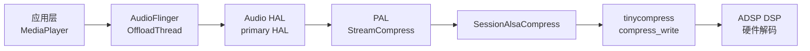

## 15.7.7 SessionAlsaVoice — ALSA 语音通话会话

> 源码路径：`session/inc/SessionAlsaVoice.h`、`session/src/SessionAlsaVoice.cpp`

SessionAlsaVoice 专门处理语音通话场景，通过 ALSA mixer 控制语音通话参数：

```cpp
class SessionAlsaVoice : public Session {
private:
    uint32_t vsid;                          // Voice Session ID
    struct mixer* mixer;                    // ALSA mixer句柄
    bool isCallActive;                      // 通话是否激活
    pal_stream_type_t voiceStreamType;      // 语音流类型
    std::mutex voice_lock_;                 // 语音操作互斥锁
};
```

**核心成员解析**：

| 成员 | 类型 | 说明 |
|------|------|------|
| vsid | uint32_t | Voice Session ID，标识具体的语音会话，与 Modem 交互时使用 |
| mixer | struct mixer* | ALSA mixer 句柄，用于控制通话音量/路由/静音 |
| isCallActive | bool | 通话状态标志 |
| voiceStreamType | pal_stream_type_t | 语音流类型：VOICE_CALL / VOIP 等 |

**核心方法详解**：

```
SessionAlsaVoice::open(Stream *s)
  ├── 1. 从Stream属性获取vsid
  ├── 2. mixer_open(card) → 打开ALSA mixer
  ├── 3. 设置语音通话mixer控制
  │     ├── mixer_ctl_set("Voice Rx Device", device_id)
  │     ├── mixer_ctl_set("Voice Tx Device", mic_id)
  │     └── mixer_ctl_set("Voice Call State", CALL_ACTIVE)
  └── 4. setupSessionDevice()

SessionAlsaVoice::start(Stream *s)
  ├── 1. mixer_ctl_set("Voice Call State", CALL_ACTIVE)
  ├── 2. isCallActive = true
  └── 3. 配置通话音量

SessionAlsaVoice::setConfig(Stream *s, configType type, int tag)
  ├── STREAM → mixer_ctl_set("Voice Volume", volume)
  ├── DEVICE → mixer_ctl_set("Voice Rx/Tx Device", device_id)
  └── MODULE → mixer_ctl_set("Voice Mute", mute_state)
```

**语音通话的 mixer 控制特点**：

与 SessionAlsaPcm/SessionAlsaPcm 不同，SessionAlsaVoice 不通过 PCM/Compress 节点传输数据，而是通过 mixer 控制切换通话路由和参数。语音通话的数据通路由 Modem 和 DSP 直接处理，Android 侧只负责控制面的配置。

## 15.7.8 SoundTriggerEngine — 声触发双引擎架构

> 源码路径：`session/inc/SoundTriggerEngine.h`

SoundTriggerEngine 是声触发检测的基类，其特殊之处在于拥有两个差异巨大的子引擎实现，分别面向不同的检测执行位置：

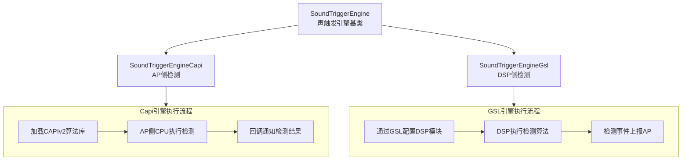

### 15.7.8.1 SoundTriggerEngineCapi — AP 侧检测引擎

```cpp
class SoundTriggerEngineCapi : public SoundTriggerEngine {
private:
    void* capiLibHandle;                   // CAPIv2算法库dlopen句柄
    capi_v2_t* capiHandle;                 // CAPIv2实例句柄
    capi_v2_init_fnt capiInit;             // capi_v2_init函数指针
    capi_v2_process_fnt capiProcess;       // capi_v2_process函数指针
    capi_v2_end_fnt capiEnd;               // capi_v2_end函数指针
    sound_model_t* soundModel;             // 声音模型数据
    detection_event_t* detectionEvent;     // 检测事件数据
    bool isFirstStage;                     // 是否第一阶段检测
};
```

**Capi 引擎工作流程**：

1. **初始化**：dlopen 加载 CAPIv2 算法库（如 libsmwrapper.so），获取 init/process/end 函数指针
2. **加载模型**：调用 capi_v2_init() 传入声音模型数据（关键字模型/用户模型）
3. **执行检测**：从 ALSA PCM 设备读取音频数据，调用 capi_v2_process() 在 AP 侧 CPU 执行检测算法
4. **结果回调**：检测到关键字时，通过 StreamSoundTrigger 的 callback 通知上层

**适用场景**：第一阶段粗检、低功耗场景、不支持 DSP 检测的芯片平台

### 15.7.8.2 SoundTriggerEngineGsl — DSP 侧检测引擎

```cpp
class SoundTriggerEngineGsl : public SoundTriggerEngine {
private:
    void* graphHandle;                     // GSL音频图句柄
    gsl_key_vector_t* gkv;                 // 图键向量
    gsl_key_vector_t* ckv;                 // 校准键向量
    PayloadBuilder* builder;               // 载荷构建器
    bool isSecondStage;                    // 是否第二阶段检测
    sound_model_t* soundModel;             // 声音模型数据
};
```

**GSL 引擎工作流程**：

1. **构建音频图**：通过 PayloadBuilder 构建 GKV/CKV，包含声触发检测模块的拓扑
2. **打开图**：agm_graph_open() 在 DSP 上建立包含检测模块的音频图
3. **加载模型**：将声音模型数据通过 agm_session_set_config() 下发到 DSP
4. **启动检测**：agm_graph_start() 启动 DSP 上的检测算法
5. **事件上报**：DSP 检测到关键字后，通过事件回调通知 AP 侧

**适用场景**：第二阶段精检、Always-On 检测、低功耗语音唤醒

### 15.7.8.3 双引擎协作模型

实际应用中，声触发通常采用两阶段检测策略：

| 阶段 | 引擎 | 执行位置 | 功耗 | 准确率 | 作用 |
|------|------|---------|------|--------|------|
| 第一阶段 | SoundTriggerEngineGsl | DSP | 极低 | 中等 | 常驻检测，粗筛关键字 |
| 第二阶段 | SoundTriggerEngineCapi | AP | 较高 | 高 | 精确验证，降低误触发 |

两阶段流程：DSP 常驻低功耗检测 → 检测到可能的关键字 → 唤醒 AP → Capi 引擎执行精确验证 → 确认后通知应用层

## 15.7.9 ACDEngine 与 ContextDetectionEngine

### 15.7.9.1 ACDEngine — 声学上下文检测引擎

> 源码路径：`session/inc/ACDEngine.h`

```cpp
class ACDEngine : public Session {
private:
    void* capiLibHandle;                   // CAPIv2算法库句柄
    capi_v2_t* capiHandle;                 // CAPIv2实例句柄
    acd_context_t contextType;             // 上下文类型
    float confidenceThreshold;             // 置信度阈值
    acd_detect_event_t* detectEvent;       // 检测事件
};
```

ACD（Acoustic Context Detection）引擎用于识别环境声学场景，如车内噪声环境、音乐播放环境等。其工作方式类似 SoundTriggerEngineCapi，在 AP 侧通过 CAPIv2 算法库执行检测。

### 15.7.9.2 ContextDetectionEngine — 上下文检测引擎

> 源码路径：`session/inc/ContextDetectionEngine.h`

```cpp
class ContextDetectionEngine : public Session {
private:
    std::vector<acd_context_t> activeContexts;  // 活跃上下文列表
    void* capiHandle;                             // CAPIv2实例句柄
    context_callback_t callback;                  // 上下文变化回调
};
```

ContextDetectionEngine 是更上层的上下文检测引擎，支持同时监测多种上下文类型，在上下文变化时通过回调通知上层。与 ACDEngine 相比，ContextDetectionEngine 更侧重于多上下文的综合管理。

## 15.7.10 Session 与 Stream/Device/ResourceManager 交互机制

### 15.7.10.1 Session 与 Stream 的委托关系

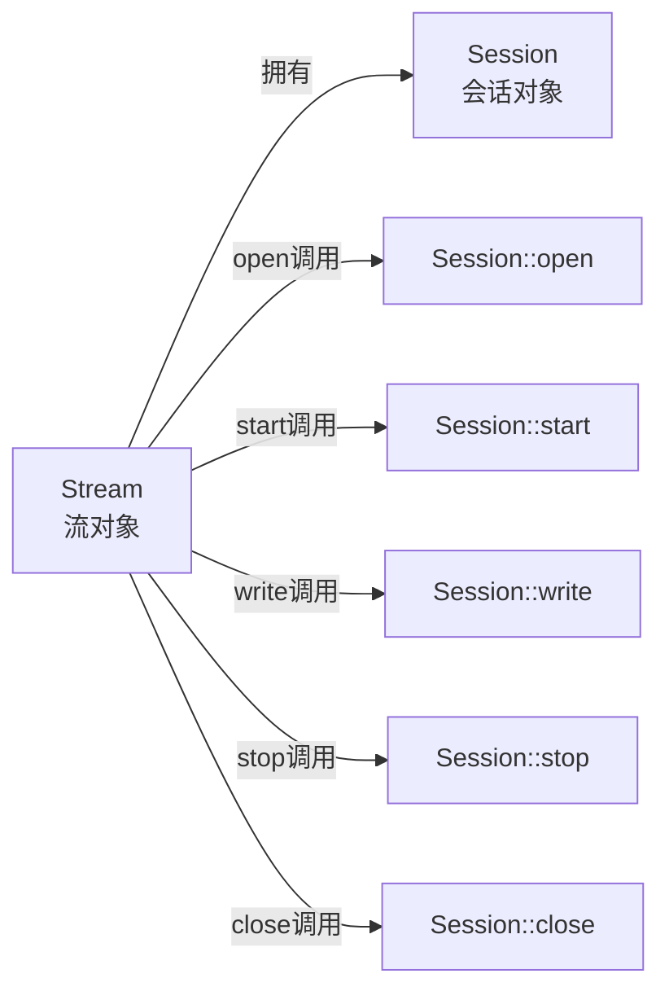

Stream 拥有 Session 指针（`Session* session`），所有流操作最终委托给 Session 执行。Session 不持有 Stream 的引用——它通过 `Stream*` 参数在方法调用时接收流上下文。

**典型调用序列**：

```
StreamPCM::open()
  ├── 1. Session::makeSession(rm, attributes) → 创建Session子类实例
  ├── 2. session->open(this)                  → Session打开底层通道
  ├── 3. 遍历mDevices
  │     ├── session->setupSessionDevice(this, devId)
  │     └── session->connectSessionDevice(this, device)
  └── 4. currentState = OPENED

StreamPCM::start()
  ├── 1. session->start(this)                 → Session启动数据流
  └── 2. currentState = STARTED
```

### 15.7.10.2 Session 与 Device 的交互机制

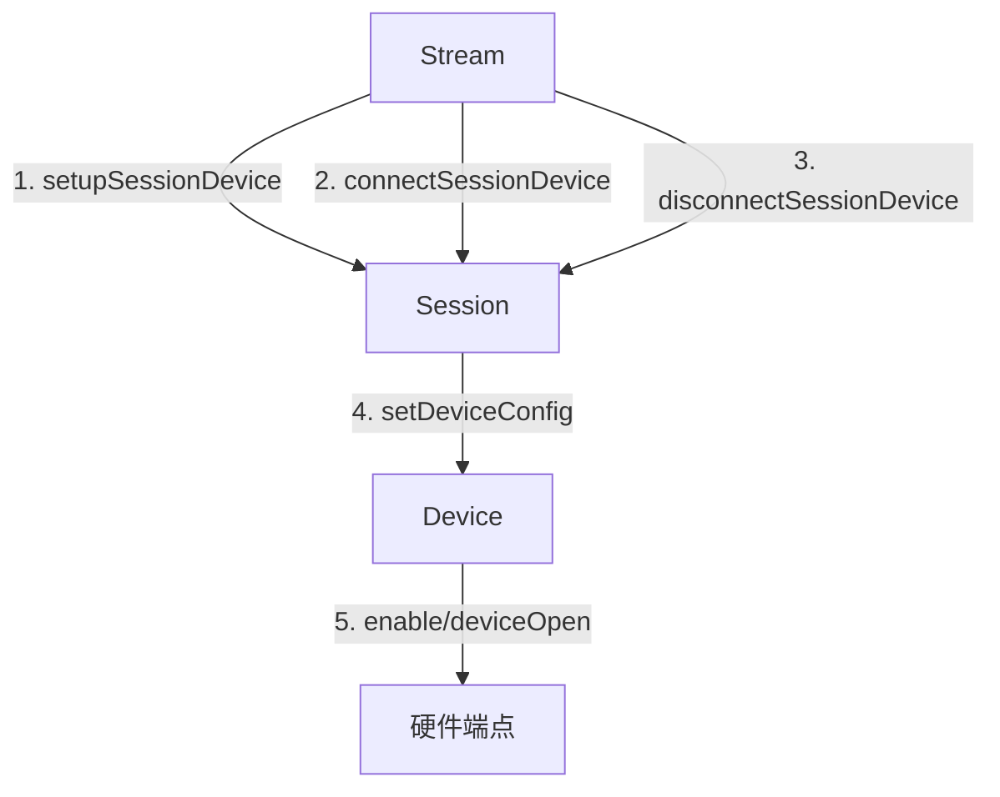

Session 与 Device 的交互通过三个核心方法完成：

| 方法 | 调用时机 | 作用 |
|------|---------|------|
| setupSessionDevice | Stream::open() 中 | 通知 Session 为特定 Device 配置底层参数（如 GKV 中加入 Device 模块） |
| connectSessionDevice | Device 连接时 | 将 Device 连接到 Session 的数据通路 |
| disconnectSessionDevice | Device 断开时 | 从 Session 的数据通路断开 Device |

**Session 内部的 Device 配置流程**：

```
SessionAlsaPcm::setupSessionDevice(s, devId)
  ├── 1. builder->populateGkv(streamType, devId) → 更新GKV加入Device模块
  ├── 2. builder->populateCkv() → 更新CKV加入Device校准参数
  └── 3. 如graphHandle已打开 → agm_session_set_config() 下发更新

SessionAlsaPcm::connectSessionDevice(s, device)
  ├── 1. device->open() → 打开Device
  ├── 2. device->setConfig() → 配置Device参数
  └── 3. 更新Session内的Device关联状态
```

### 15.7.10.3 Session 与 ResourceManager 的交互

Session 通过 ResourceManager 单例获取资源和配置信息：

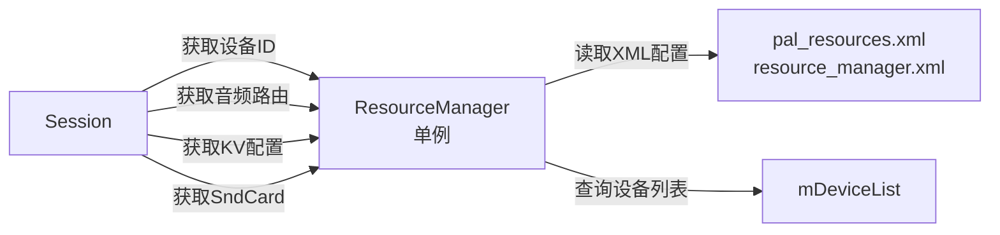

**Session 获取的关键资源配置**：

| 资源 | 获取方法 | 说明 |
|------|---------|------|
| PCM 设备 ID | rm->getpcmDeviceId() | 获取流类型对应的 ALSA PCM 设备号 |
| Compress 设备 ID | rm->getCompressDeviceId() | 获取压缩流设备号 |
| Sound Card | rm->getSndCard() | 获取 ALSA 声卡号 |
| 音频路由 | rm->getAudioRoute() | 获取当前音频路由配置 |
| KV 对 | rm->getGkv()/getCkv() | 获取流类型对应的 GKV/CKV 键值对 |
| 设备列表 | rm->getActiveDevices() | 获取当前活跃设备列表 |
| EcRef 设备 | rm->getEcRefDevice() | 获取回声消除参考设备 |

## 15.7.11 Session::makeSession() 工厂方法完整映射

Session::makeSession() 是创建 Session 实例的核心工厂方法，根据 `pal_stream_type_t` 和平台配置决定创建哪种 Session 子类：

```cpp
Session* Session::makeSession(ResourceManager *rm,
                               struct pal_stream_attributes *attributes) {
    switch (attributes->type) {
        // ... 根据流类型创建对应Session子类
    }
}
```

### 15.7.11.1 完整映射表

| pal_stream_type_t | Session 子类 | 底层接口 | 典型场景 |
|-------------------|-------------|---------|---------|
| PAL_STREAM_LOW_LATENCY | SessionAlsaPcm / SessionAlsaPcm | AGM/ALSA PCM | 触控音效、系统提示音 |
| PAL_STREAM_DEEP_BUFFER | SessionAlsaPcm / SessionAlsaPcm | AGM/ALSA PCM | 音乐播放 |
| PAL_STREAM_COMPRESSED | SessionAlsaCompress | tinycompress | Offload播放(MP3/AAC) |
| PAL_STREAM_PCM_OFFLOAD | SessionAlsaCompress | tinycompress | PCM Offload播放 |
| PAL_STREAM_VOICE_CALL | SessionAlsaVoice | ALSA mixer | 语音通话 |
| PAL_STREAM_VOIP | SessionAlsaPcm | AGM | VoIP双向通话 |
| PAL_STREAM_VOICE_UI | SoundTriggerEngineCapi/Gsl | CAPIv2/AGM | 语音唤醒 |
| PAL_STREAM_VOICE_ACTIVATION | SoundTriggerEngineGsl | AGM | 语音激活 |
| PAL_STREAM_ACD | ACDEngine | CAPIv2 | 声学上下文检测 |
| PAL_STREAM_CONTEXT_PROXY | ContextDetectionEngine | CAPIv2 | 上下文代理 |
| PAL_STREAM_ULTRA_LOW_LATENCY | SessionAlsaPcm | AGM | 超低延迟播放 |
| PAL_STREAM_PROXY | SessionAlsaPcm / SessionAlsaPcm | AGM/ALSA PCM | 代理PCM流 |
| PAL_STREAM_HAPTICS | SessionAlsaPcm | AGM | 触觉反馈振动 |
| PAL_STREAM_RAW | SessionAlsaPcm | ALSA PCM | 原始PCM流 |
| PAL_STREAM_PLAYBACK_BUS | SessionAlsaPcm | AGM | AAOS总线播放 |
| PAL_STREAM_LOOPBACK | SessionAlsaPcm | ALSA PCM | 回环测试 |
| PAL_STREAM_TRANSCODE | SessionAlsaCompress | tinycompress | 转码 |
| PAL_STREAM_NON_TUNNEL | SessionAlsaPcm | ALSA PCM | 非隧道模式 |

### 15.7.11.2 工厂方法选择策略

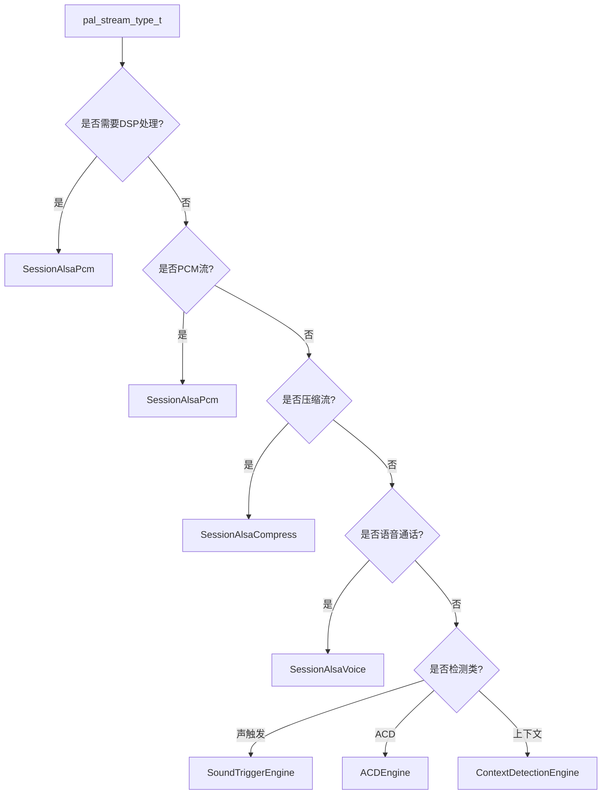

**选择决策因素**：

1. **是否需要 DSP 处理**：需要 DSP 音效/EC/NS → SessionAlsaPcm
2. **是否压缩格式**：Offload 播放 → SessionAlsaCompress
3. **是否语音通话**：通话场景 → SessionAlsaVoice
4. **是否检测类**：声触发/上下文 → 对应引擎 Session
5. **平台配置**：即使同为 PCM 流，不同平台可能选择不同的 Session 实现

### 15.7.11.3 Session 与 Stream 的创建时序

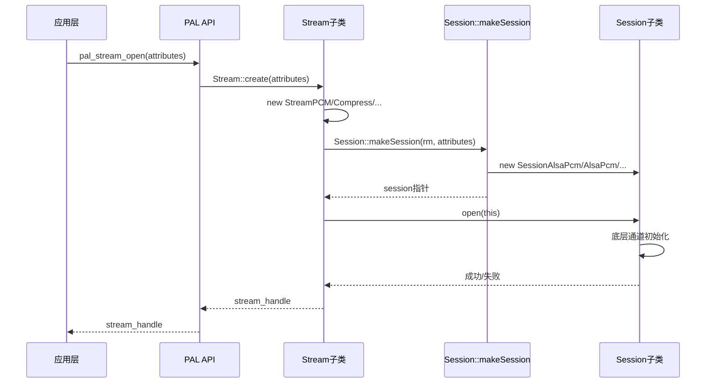

## 15.7.12 Session 类层次总结

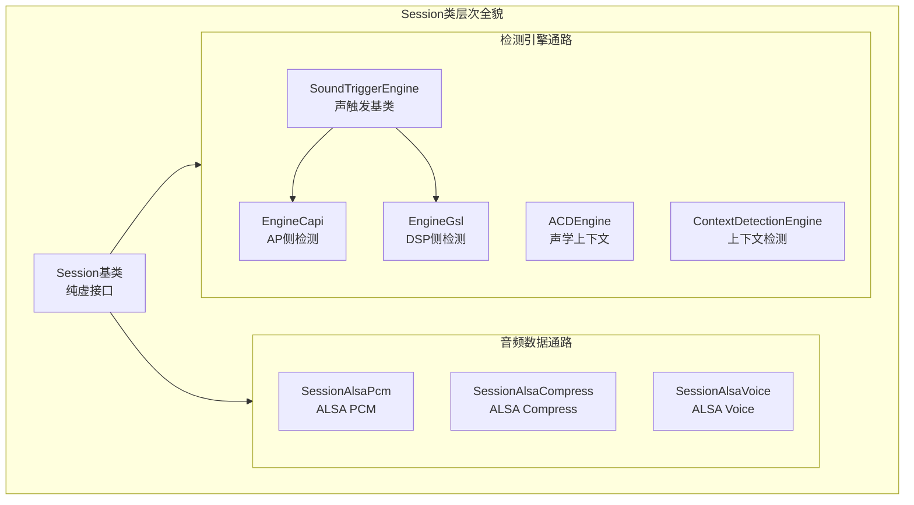

**核心要点回顾**：

1. Session 是 PAL 中 Stream 与底层音频子系统的桥梁，所有音频操作都经过 Session 转发
2. SessionAlsaPcm 是 AudioReach 架构的核心，通过 AGM API 管理 GSL 音频图，SA8295 上需跨 VM 到 QNX 侧执行
3. SessionAlsaPcm/Compress/Voice 通过 tinyalsa/tinycompress/ALSA mixer 直接操作 ALSA 设备
4. SoundTriggerEngine 采用 Capi（AP）+ GSL（DSP）双引擎架构，实现两阶段低功耗检测
5. Session::makeSession() 工厂方法根据流类型和平台配置动态选择 Session 子类
6. Session 与 Device 通过 setup/connect/disconnect 三个方法协作，与 ResourceManager 通过单例获取资源配置

---


---

[← 上一个](15_15.4_流类型_pal_stream_type_t.md) | [← 返回15章](README.md) | [返回导航](../README.md) | [下一个 →](15_15.6_ResourceManager-PAL核心管理模块.md)
