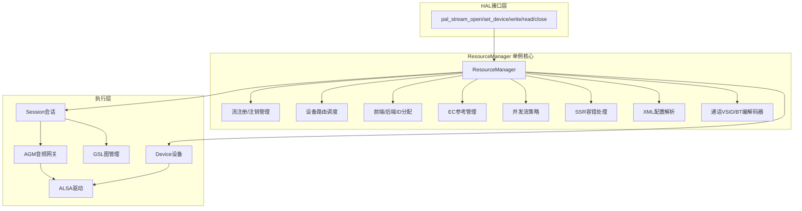
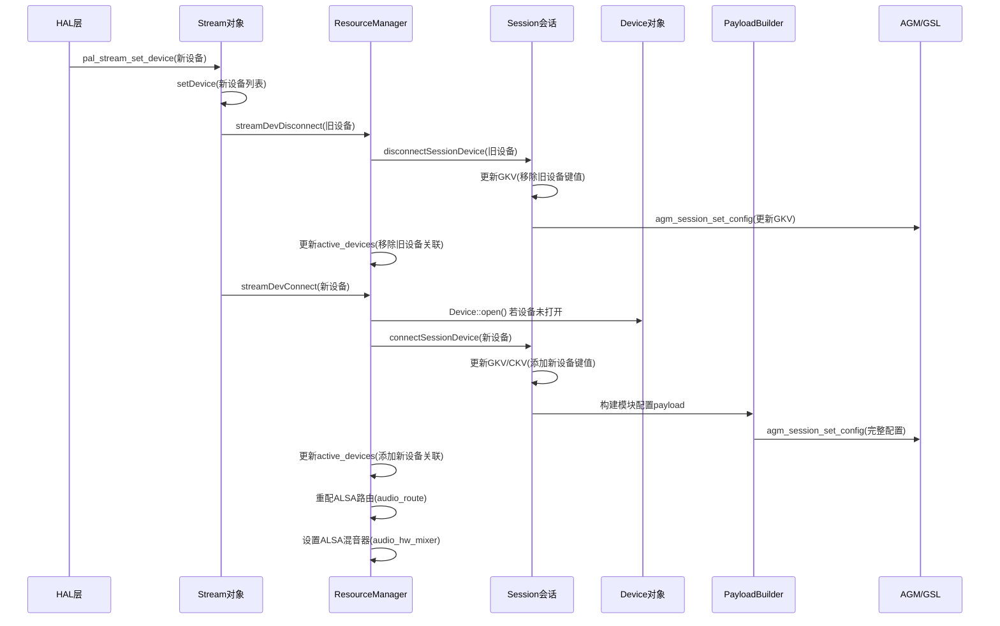
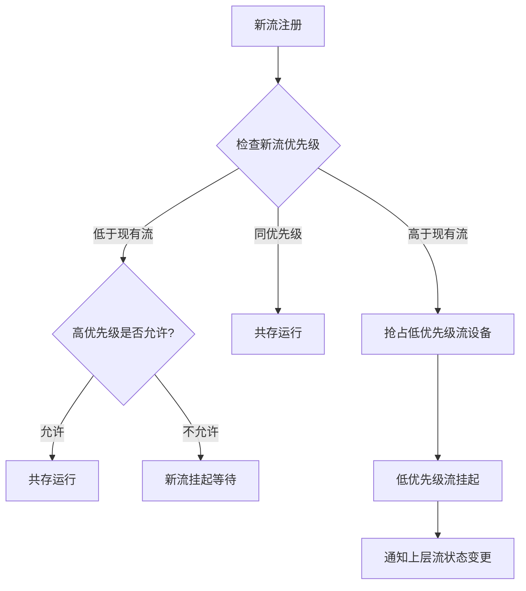
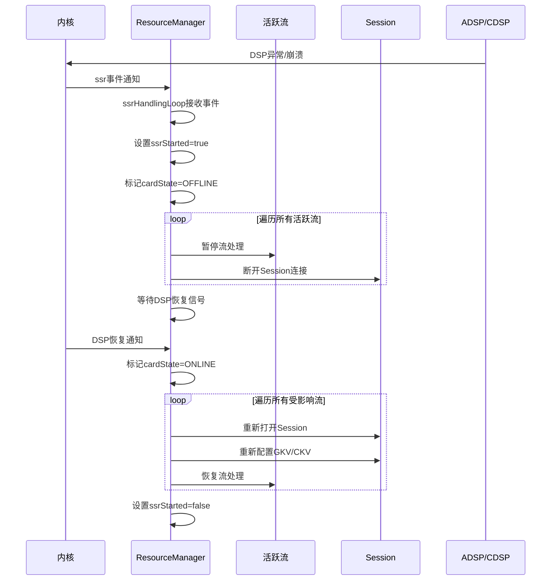
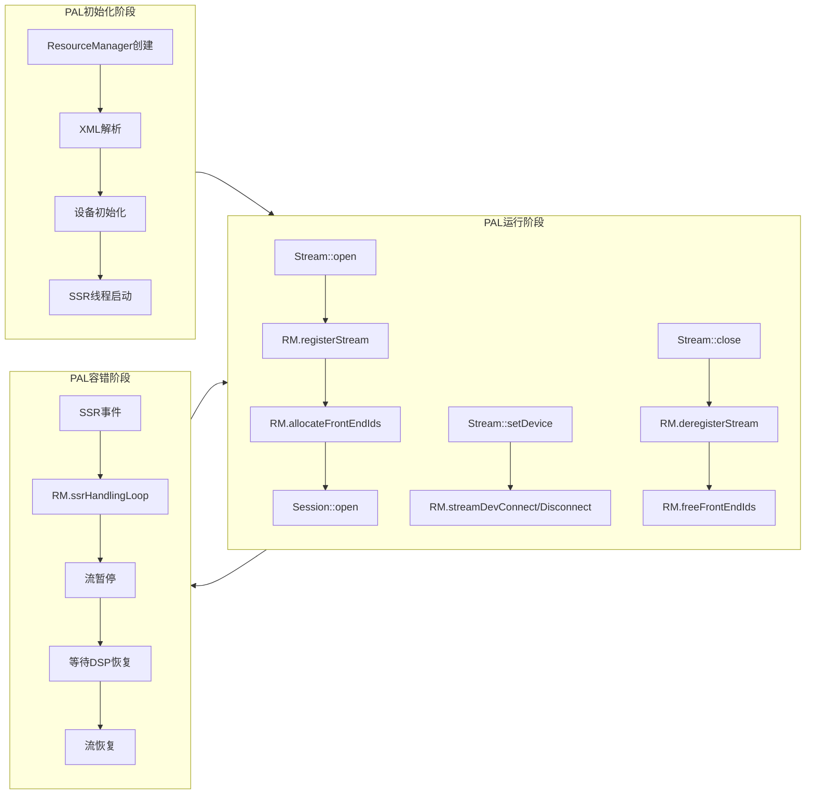

## 15.6 ResourceManager — PAL核心管理模块

> [← 上一个](15_15.5_核心类层次图-Stream-Device-Session.md) | [← 返回15章](README.md) | [返回导航](../README.md) | [下一个 →](15_15.7_PayloadBuilder-载荷构建器.md)

---

### 15.6.1 ResourceManager架构地位总览

ResourceManager是PAL（Platform Abstraction Layer）的**核心管理模块与调度中枢**，采用单例模式运行，是整个PAL音频子系统的"大脑"。它管理着所有活跃音频流、设备路由、前端/后端ID分配、EC参考映射、并发流策略、SSR容错恢复等关键资源，是连接上层HAL接口与下层Session/Device/GSL执行链的核心枢纽。

**源码路径：**
- 头文件：`resource_manager/inc/ResourceManager.h`（37.4KB）
- 实现：`resource_manager/src/ResourceManager.cpp`（389.8KB，PAL最大单文件）



#### 15.6.1.1 单例模式与初始化流程

ResourceManager采用**单例模式**确保全局唯一实例，通过`getInstance()`获取。首次调用时创建实例并执行`init()`完成全部初始化，后续调用直接返回已有实例。

**初始化流程（`ResourceManager::init()`）按序执行：**

1. **XML配置解析** — 解析`resourcemanager_XXX.xml`，加载设备列表、前端/后端ID映射、EC ref映射、通话VSID、BT编解码器、增益映射等
2. **设备列表初始化** — 根据XML配置创建所有Device对象，填充`deviceInfo`向量
3. **前端/后端ID池构建** — 从XML中提取PCM/Compress前端ID、后端ID，构建可用ID池
4. **ALSA路由初始化** — 打开ALSA mixer控制，获取`audio_route`和`audio_hw_mixer`句柄
5. **GSL库加载** — 加载GSL（Graph Service Library）共享库，初始化图管理器
6. **SSR监听线程启动** — 创建`ssrHandlingLoop`线程监听ADSP/CDSP子系统重启事件
7. **并发流配置加载** — 解析`concurrent_stream_config`定义的流优先级与并发规则

> **线程安全保证**：单例创建使用`pthread_once`（或`std::call_once`），确保多线程并发调用`getInstance()`时仅初始化一次。初始化完成后，ResourceManager的大多数方法通过内部互斥锁（`mResourceManagerMutex`）保护共享数据访问。

---

### 15.6.2 核心数据成员详解

ResourceManager的数据成员可分为**六大类别**，每类承担不同管理职责：

#### 流管理类

> **⚠️ 源码核实（勘误）**：流分列表在真实源码（`resource_manager/inc/ResourceManager.h`）中是**强类型列表**（各列表元素类型不同，非统一`list<Stream*>`），且数量远多于旧版所列。旧版还虚构了 `active_streams_voice`（不存在），并把 `active_streams_incall_record` 误写为 `active_streams_incall_rec`。下表为真实成员：

| 成员 | 类型 | 说明 |
|------|------|------|
| `active_streams_ll` | `list<StreamPCM*>` | 低延迟(Low Latency)活跃流列表 |
| `active_streams_ulla` | `list<StreamPCM*>` | ULL音频(ULLA)活跃流列表 |
| `active_streams_ull` | `list<StreamPCM*>` | 超低延迟活跃流列表 |
| `active_streams_db` | `list<StreamPCM*>` | 深缓冲活跃流列表 |
| `active_streams_po` | `list<StreamPCM*>` | PCM Offload活跃流列表 |
| `active_streams_proxy` | `list<StreamPCM*>` | 代理流活跃列表 |
| `active_streams_bus` | `list<StreamPCM*>` | 总线(Playback Bus)活跃流列表 |
| `active_streams_haptics` | `list<StreamPCM*>` | 触觉(Haptics)活跃流列表 |
| `active_streams_raw` | `list<StreamPCM*>` | 原始(RAW)活跃流列表 |
| `active_streams_comp` | `list<StreamCompress*>` | 压缩流活跃列表 |
| `active_streams_st` | `list<StreamSoundTrigger*>` | 音频触发流活跃列表 |
| `active_streams_acd` | `list<StreamACD*>` | ACD(声学上下文检测)流列表 |
| `active_streams_ultrasound` | `list<StreamUltraSound*>` | 超声波流列表 |
| `active_streams_sensor_pcm_data` | `list<StreamSensorPCMData*>` | 传感器PCM数据流列表 |
| `active_streams_context_proxy` | `list<StreamContextProxy*>` | 上下文代理流列表 |
| `active_streams_incall_record` | `list<StreamInCall*>` | 通话录音活跃列表 |
| `active_streams_incall_music` | `list<StreamInCall*>` | 通话音乐活跃列表 |
| `active_streams_non_tunnel` | `list<StreamNonTunnel*>` | 非隧道流活跃列表 |
| `mActiveStreams` | `list<Stream*>` | 全部活跃流汇总列表 |
| `stream_instances[PAL_STREAM_MAX]` | `uint64_t[]` | 各类型流实例计数 |
| `in_stream_instances[PAL_STREAM_MAX]` | `uint64_t[]` | 各类型输入流实例计数 |

> 流按类型分列表存储，各列表使用具体子类指针（`StreamPCM*`/`StreamCompress*`等），便于并发流策略快速遍历同类型流。`mActiveStreams`是所有流的汇总视图。注意：**并无单一的"语音通话流列表"**，语音通话由 `SessionAlsaVoice` 承载，并不单列 active_streams 分表。

#### 设备与路由类

| 成员 | 类型 | 说明 |
|------|------|------|
| `active_devices` | `vector<pair<shared_ptr<Device>, Stream*>>` | 活跃设备及关联流 |
| `audio_route` | `struct audio_route*` | ALSA路由控制句柄 |
| `audio_hw_mixer` | `struct audio_mixer*` | ALSA硬件混音器句柄（真实类型为 `struct audio_mixer*`，非 `audio_hw_mixer*`） |
| `deviceInfo` | `vector<deviceIn>` | 设备信息（含EC ref映射） |

> `active_devices`维护当前正在使用的设备及其关联的流，路由切换时据此判断哪些设备需要断开/连接。`audio_route`和`audio_hw_mixer`是ALSA驱动层的直接句柄，用于控制DSP路由路径和混音器设置。

#### 前端/后端ID类

| 成员 | 类型 | 说明 |
|------|------|------|
| `listAllPcmPlaybackFrontEnds` | `vector<int>` | PCM播放前端ID池 |
| `listAllPcmRecordFrontEnds` | `vector<int>` | PCM录音前端ID池 |
| `listAllCompressPlaybackFrontEnds` | `vector<int>` | Compress播放前端ID池 |
| `listAllCompressRecordFrontEnds` | `vector<int>` | Compress录音前端ID池 |
| `listAllBackEndIds` | `vector<pair<int32_t, string>>` | 后端ID列表（ID+名称） |

> 前端ID对应ALSA PCM/Compress设备号，由内核DTSI定义；后端ID对应DSP后端模块，标识具体硬件接口（CODEC_DMA/I2S/TDM/DisplayPort等）。

#### 配置与映射类

> **⚠️ 源码核实（勘误）**：旧版此表成员名多为虚构（`concurrentStreamInfo`/`devicePcmIdMap`/`nonHubStreamFeIds`/`gainDbToLevelMap` 均不存在）。真实成员如下：

| 成员 | 类型 | 说明 |
|------|------|------|
| `gainLvlMap` | `static vector<struct pal_amp_db_and_gain_table>` | 增益dB↔Level映射表（配 `getGainLevelMapping()`） |
| `is_concurrent_boost_state_` | `bool` | 并发提升状态（配 `getConcurrentBoostState()`） |
| `deviceInfo` | `static vector<deviceIn>` | 设备信息（并发/EC ref等策略内嵌于此） |

> 并发流规则并非存于单一 `concurrent_stream_config` 成员，而是由 `ConcurrentStreamStatus()` / `getConcurrentTxStream()` 等方法结合 `deviceInfo` 与流优先级动态计算。

#### 通话与BT类

> **⚠️ 源码核实（勘误）**：旧版 `voiceVSID`/`btCodecFormat`/`currentBTCodec` 均为虚构名。真实成员如下：

| 成员 | 类型 | 说明 |
|------|------|------|
| `vsidInfo` | `static struct vsid_info` | 通话VSID配置（含 `int vsid` + `vector<vsid_modepair> modepair`），配 `getVsidInfo()` |
| `btCodecMap` | `static map<pair<uint32_t,string>,string>` | BT编解码器映射（codecFormat+type → 库名），配 `getBtCodecLib()`/`updateBtCodecMap()` |

#### 同步与状态类

> **⚠️ 源码核实（勘误）**：锁的真实类型是 C++ `std::mutex`（非 `pthread_mutex_t`），且存在两把锁；SSR 状态成员真实名为 `cardState`/`ssrStarted`/`msgQ`，旧版虚构的 `ssrHandled`/`isAdspUp`/`isCbUp` **在源码中不存在**。下表为真实成员：

| 成员 | 类型 | 说明 |
|------|------|------|
| `mResourceManagerMutex` | `static std::mutex` | 核心互斥锁 |
| `mActiveStreamMutex` | `static std::mutex` | 活跃流列表互斥锁（配 `lockActiveStream()`/`unlockActiveStream()`） |
| `cardState` | `enum card_status_t` | 声卡/DSP状态（ONLINE/OFFLINE），SSR用 |
| `ssrStarted` | `bool` | SSR处理进行中标志 |
| `msgQ` | `static std::queue<card_status_t>` | SSR事件消息队列（供 `ssrHandlingLoop` 消费） |
| `screen_state_` | `bool` | 屏幕状态 |
| `charging_state_` | `bool` | 充电状态 |
| `isSpeakerProtectionEnabled` | `static bool` | 扬声器保护开关 |

---

### 15.6.3 流注册与注销机制

ResourceManager通过`registerStream`和`deregisterStream`管理音频流的生命周期，这是PAL流管理的核心入口。

#### 注册流程：`registerStream(Stream *s)`

1. **获取互斥锁** — `mResourceManagerMutex`保护共享数据
2. **流类型判断** — 根据Stream的`pal_stream_type_t`确定目标分列表
3. **插入分列表** — 将Stream指针加入对应的`active_streams_xxx`列表
4. **插入汇总列表** — 同时加入`mActiveStreams`全局列表
5. **实例计数递增** — `stream_instances[type]++`
6. **并发流检查** — 调用`ConcurrentStreamStatus()`评估新流对现有流的影响
7. **释放互斥锁**

#### 注销流程：`deregisterStream(Stream *s)`

1. **获取互斥锁**
2. **从分列表移除** — 在对应`active_streams_xxx`中查找并移除
3. **从汇总列表移除** — 从`mActiveStreams`中移除
4. **实例计数递减** — `stream_instances[type]--`
5. **释放前端ID** — 若流持有前端ID，调用`freeFrontEndIds()`归还
6. **并发流重评估** — 移除流后可能使低优先级流恢复
7. **释放互斥锁**

> **设计要点**：流分列表的设计使得并发流策略检查时只需遍历特定类型流，而非全部活跃流，显著提升路由决策效率。`stream_instances[]`数组提供O(1)复杂度的流存在性查询。

---

### 15.6.4 设备路由切换核心流程

设备路由切换是ResourceManager最核心也最复杂的功能，涉及多层协作。当HAL层调用`pal_stream_set_device()`时触发完整路由切换链：



#### 路由切换详细步骤

**阶段一：断开旧设备（streamDevDisconnect）**

1. 遍历旧设备列表，对每个旧设备执行断开
2. 调用`Session::disconnectSessionDevice()`更新GKV（Graph Key Vector），移除旧设备对应的键值对
3. 通过AGM接口下发更新后的GKV到DSP
4. 从`active_devices`中移除旧设备与流的关联
5. 若旧设备不再被任何流使用，可选关闭设备

**阶段二：连接新设备（streamDevConnect）**

1. 遍历新设备列表，对每个新设备执行连接
2. 若设备未打开，调用`Device::open()`初始化设备
3. 调用`Session::connectSessionDevice()`更新GKV/CKV
4. PayloadBuilder构建模块配置payload（采样率、位深、通道等）
5. 通过AGM/GSL下发完整配置到DSP
6. 更新`active_devices`添加新设备与流的关联
7. 重配ALSA路由：通过`audio_route`设置DSP路由路径
8. 设置ALSA混音器：通过`audio_hw_mixer`配置混音器控制

**阶段三：路由生效验证**

- Session调用`setConfig()`确认配置已生效
- 若配置失败，执行回滚（重新连接旧设备）

> **关键概念**：GKV（Graph Key Vector）标识DSP图拓扑，CKV（Cal Key Vector）标识校准参数，TKV（Tag Key Vector）标识模块标签。路由切换本质上是更新这些键值向量，使DSP图拓扑与当前活跃流-设备组合匹配。

---

### 15.6.5 前端/后端ID分配与映射

#### FE-BE架构概念

PAL音频数据通路基于ALSA的**前端-后端（FE-BE）架构**：

- **前端（FE）**：ALSA PCM或Compress设备，代表一个逻辑音频流端点。FE ID即ALSA设备号（如PCM0、PCM1），由内核DTSI定义
- **后端（BE）**：DSP后端模块，对应物理硬件接口。BE ID标识具体接口类型（CODEC_DMA、I2S、TDM、DisplayPort、SlimBus等）
- **FE-BE连接**：通过ALSA mixer控制建立前端到后端的连接，音频数据从FE流入DSP处理后从BE输出到硬件

#### 前端ID分配：`allocateFrontEndIds()`

分配逻辑：根据流类型和方向选择ID池（播放→`listAllPcmPlaybackFrontEnds`/`listAllCompressPlaybackFrontEnds`，录音→`listAllPcmRecordFrontEnds`），从池中分配最小可用ID（首次适配算法），标记为已使用并返回。

#### 前端ID释放：`freeFrontEndIds()`

释放逻辑：根据流类型和方向定位ID池，将FE ID标记为可用，归还到池中供后续流使用。

#### FE-BE映射关系

| BE类型 | 说明 | 典型硬件接口 |
|--------|------|-------------|
| CODEC_DMA | 编解码器DMA接口 | WSA881x、WCD938x |
| I2S | I2S数字音频接口 | 外部DAC |
| TDM | 时分复用接口 | 多通道功放 |
| DisplayPort | 显示端口音频 | DP音频输出 |
| SlimBus | SlimBus总线 | WCD9xxx |
| SoundWire | SoundWire总线 | WSA881x/WSA883x |
| AUX | AUX PCM接口 | 蓝牙HFP |
| RX/TX | AFE RX/TX端口 | 内部DSP连接 |

> **设计要点**：FE ID池化管理避免ID冲突，支持动态分配/释放。同一时刻一个FE ID只能被一个流占用，但一个BE可被多个FE共享（混音场景）。

---

### 15.6.6 EC参考管理

EC（Echo Cancellation，回声消除）参考信号管理是ResourceManager的重要职责之一。EC参考是指某些音频流（如语音通话、VoIP）需要将播放信号作为参考输入到回声消除算法中。

#### EC参考映射原理

```
播放流(Speaker) ──→ EC参考路径 ──→ 录音流(Mic)的AEC处理模块
```

当录音流需要EC参考时，ResourceManager负责建立播放设备到录音流的参考信号路由。

#### 核心方法：`updateECDeviceMap()`

`updateECDeviceMap(shared_ptr<Device> dev, Stream* stream, bool isEnable)` — dev为EC参考设备（播放端），stream为需要EC参考的流（录音端），isEnable控制启用/禁用。

**EC参考管理流程：**

1. **录音流打开时** — 检查流属性是否需要EC参考（`PAL_STREAM_FLAG_NEED_ECR`）
2. **查找参考设备** — 在`deviceInfo`中查找与录音设备关联的EC参考设备映射
3. **建立参考路由** — 调用`updateECDeviceMap()`启用EC参考，将播放设备信号路由到录音流的EC处理模块
4. **参考设备变更** — 当播放设备路由切换时，更新EC参考路由
5. **录音流关闭时** — 禁用EC参考，释放参考路由

#### EC ref映射在XML中的定义

XML中通过`<device_info>`的`<dev_info>`子节点定义EC参考映射：`<rx_device>`指定播放设备，`<tx_device>`指定录音设备，`<ec_ref>`指定EC参考源。

> **关键约束**：EC参考路由必须在播放设备已激活时才能建立。若录音流先于播放流打开，EC参考将在播放流路由设备时延迟建立。

---

### 15.6.7 并发流策略与优先级

ResourceManager管理多个音频流的并发运行，通过优先级机制解决资源冲突。

#### 流优先级定义

> **⚠️ 源码核实（勘误）**：低延迟播放的真实枚举名为 `PAL_STREAM_LOW_LATENCY`（值=1），并无 `PAL_STREAM_LL_PLAYBACK`。下表优先级为概念性归纳（真实优先级由 `getStreamAttrPriority()` 依据流属性计算），枚举名已按源码更正。

| 优先级 | 流类型 | 说明 |
|--------|--------|------|
| 最高 | `PAL_STREAM_VOICE_CALL` | 语音通话，不可被抢占 |
| 高 | `PAL_STREAM_VOIP` | VoIP通话 |
| 中高 | `PAL_STREAM_LOW_LATENCY` | 低延迟播放（如按键音） |
| 中 | `PAL_STREAM_DEEP_BUFFER` | 深缓冲播放（如媒体音乐） |
| 中低 | `PAL_STREAM_COMPRESSED` | 压缩流播放 |
| 低 | `PAL_STREAM_RAW` | 原始流 |

#### 并发流决策逻辑



#### 核心方法

- **`ConcurrentStreamStatus(pal_stream_type_t type)`** — 检查指定类型流是否允许与当前活跃流并发运行
- **`getStreamAttrPriority(const pal_stream_attributes* sAttr)`** — 获取流优先级值（真实入参为流属性指针 `pal_stream_attributes*`，非 `pal_stream_type_t`）
- **并发规则配置** — 并发/互斥判定逻辑在 `ConcurrentStreamStatus` 等方法中按流类型硬编码，配合 resourcemanager XML 中的流属性（`supported_stream`/`session_mode` 等）综合决策（非独立的 `concurrent_stream_config` 节点）

#### 典型并发场景

| 场景 | 行为 |
|------|------|
| 通话 + 媒体 | 媒体流被挂起，通话结束后恢复 |
| VoIP + 媒体 | 媒体流降低音量（Ducking）或挂起 |
| 通话 + 通话录音 | 通话录音流与通话流共存 |
| 导航 + 媒体 | 导航提示音与媒体混音共存 |
| 低延迟 + 深缓冲 | 同优先级共存，共享设备 |

---

### 15.6.8 SSR子系统重启处理

SSR（Subsystem Restart）是Qualcomm平台的容错机制，当DSP（ADSP/CDSP）发生异常重启时，ResourceManager负责恢复所有受影响的音频流。

#### SSR处理流程



#### SSR关键实现细节

1. **监听线程** — `ssrHandlingLoop()`在独立线程中运行，通过`poll()`监听内核uevent
2. **流暂停** — 遍历`mActiveStreams`，对所有活跃流调用`Stream::ssrDownHandler()`
3. **等待恢复** — 阻塞等待DSP上线通知（通过sysfs节点或uevent）
4. **流恢复** — 按注册顺序依次恢复：重新打开Session → 重配GKV/CKV → 重连设备路由 → 恢复写入/读取
5. **状态保护** — SSR处理期间，新流注册/设备路由请求被阻塞或排队

> **ADSP vs CDSP**：ADSP（Audio DSP）处理音频计算，CDSP（Compute DSP）处理语音触发检测。ResourceManager 通过单一的 `cardState`（`card_status_t`，取值 ONLINE/OFFLINE）跟踪声卡/DSP 在线状态，SSR 事件经 `msgQ` 队列投递给 `ssrHandlingLoop` 线程处理。（旧版所述"分别跟踪 `isAdspUp` 和 `isCbUp`"为虚构，源码中并无这两个成员。）

---

### 15.6.9 XML配置解析流程

ResourceManager初始化时解析`resourcemanager_XXX.xml`（XXX为平台代号），这是PAL运行的"配置蓝图"。

#### XML解析内容与对应数据结构

> **⚠️ 源码核实（勘误）**：(1) XML 解析器真实使用 **expat**（`XML_ParserCreate` + `XML_SetElementHandler`，注册 `startTag`/`endTag` 回调），**非 libxml2**；(2) 下表旧版列出的 XML 节点名（`device_profile`/`pcm_ids`/`compress_ids`/`concurrent_stream`/`voice_vsid`/`bt_codec`/`gain_db_to_level`/`custom_config` 等）多为示意/虚构，真实标签名为 `id`/`mixer`/`name`/`props`/`playback`/`capture`/`session_mode`/`supported_stream`/`use_volume_set_param` 等；(3) 存储位置成员名已同步为 `vsidInfo`/`btCodecMap`/`gainLvlMap`。下表"配置类别"仅作概念归类：

| 配置类别 | 解析目标 | 存储位置 |
|---------|----------|----------|
| 设备能力描述 | 设备 props/mixer/session_mode | `deviceInfo` |
| PCM前端ID | PCM前端ID列表 | `listAllPcmPlaybackFrontEnds` / `listAllPcmRecordFrontEnds` |
| Compress前端ID | Compress前端ID列表 | `listAllCompressPlaybackFrontEnds` / `listAllCompressRecordFrontEnds` |
| 后端ID | 后端ID与名称映射 | `listAllBackEndIds` |
| EC参考映射 | EC参考设备映射 | `deviceInfo`内嵌 |
| 通话VSID | VSID模式对配置 | `vsidInfo` |
| BT编解码器 | BT编解码器库映射 | `btCodecMap` |
| 增益映射 | 增益dB↔Level表 | `gainLvlMap` |

#### 解析流程

1. **打开XML文件** — 使用 **expat** 解析器（`XML_ParserCreate` + `XML_SetElementHandler` 注册 `startTag`/`endTag` 回调）
2. **元素回调分发** — `startTag` 按标签名分发到对应处理逻辑
3. **设备配置解析** — 创建Device对象，填充设备能力（采样率、位深、通道等）
4. **ID池构建** — 解析前端/后端ID，构建可用ID池
5. **映射关系建立** — EC ref映射、BT编解码器映射等
6. **策略配置加载** — VSID、增益映射等

---

### 15.6.10 通话VSID与BT编解码器管理

#### 通话VSID管理

VSID（Voice Session ID）标识不同的语音通话模式，ResourceManager根据通话类型选择对应VSID配置DSP语音通路：

> **⚠️ 源码核实（勘误）**：旧版所列 `CS_VSID`/`IMS_VSID`/`VOIP_VSID` 为虚构常量名。真实源码（`ResourceManager.cpp`）通过 `sAttr.info.voice_call_info.VSID` 判断，取值常量为 **`VOICEMMODE1`** 与 **`VOICEMMODE2`**（对应双语音模式），VSID 配置存于 `vsid_info vsidInfo`（含 `int vsid` + `vector<vsid_modepair> modepair`），经 `getVsidInfo()` 读取。

| VSID常量 | 说明 |
|----------|------|
| `VOICEMMODE1` | 语音模式1（Voice Multi-Mode 1） |
| `VOICEMMODE2` | 语音模式2（Voice Multi-Mode 2） |

通话流打开时，ResourceManager根据 `voice_call_info.VSID` 匹配 `vsidInfo` 中的 modepair 配置，下发到 SessionAlsaVoice。

#### BT编解码器管理

ResourceManager管理蓝牙音频编解码器的选择与切换：

- **编解码器格式** — SBC、AAC、aptX、aptX-HD、LDAC等
- **配置来源** — 由 `updateBtCodecMap()` 从 resourcemanager XML 解析后填入 `btCodecMap`（`map<pair<uint32_t,string>,string>`），运行时经 `getBtCodecLib()` 查询编解码器库（非独立的 `<bt_codec>` 节点）
- **动态切换** — 当BT设备连接/断开或编解码器协商变化时，ResourceManager更新BT编解码器配置并重新配置受影响的音频流
- **A2DP vs SCO** — A2DP（高级音频分发）使用压缩编解码器，SCO（同步面向连接）使用CVSD/MSBC编解码器，两者路由路径完全不同

---

### 15.6.11 ResourceManager在PAL生命周期中的位置



#### ResourceManager的核心角色总结

| 角色 | 对应方法 | 说明 |
|------|----------|------|
| 流生命周期管理 | registerStream / deregisterStream | 流的注册、注销、实例计数 |
| 设备路由调度 | streamDevConnect / streamDevDisconnect | 路由切换的核心决策与执行 |
| 资源分配器 | allocateFrontEndIds / freeFrontEndIds | 前端ID的动态分配与回收 |
| 并发策略引擎 | ConcurrentStreamStatus / getStreamAttrPriority | 流优先级判断与并发决策 |
| EC参考管理器 | updateECDeviceMap | 回声消除参考信号路由 |
| 容错恢复器 | ssrHandlingLoop | DSP异常重启后的流恢复 |
| 配置加载器 | init (XML解析) | 平台配置的统一加载入口 |
| 通话/BT管理 | voiceVSID / btCodec | 通话模式与BT编解码器管理 |

ResourceManager贯穿PAL的完整生命周期：从初始化时加载配置，到运行时管理流/设备/路由，再到异常时执行SSR恢复，它是PAL架构中**不可或缺的调度中枢**。

---

[← 上一个](15_15.5_核心类层次图-Stream-Device-Session.md) | [← 返回15章](README.md) | [返回导航](../README.md) | [下一个 →](15_15.7_PayloadBuilder-载荷构建器.md)