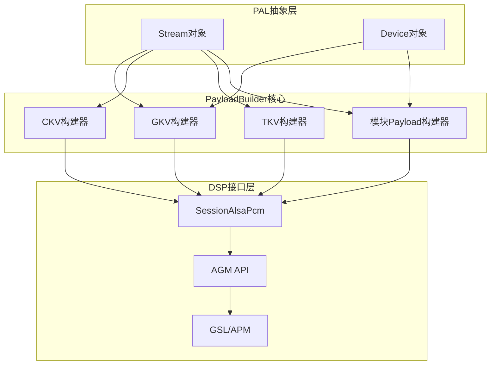
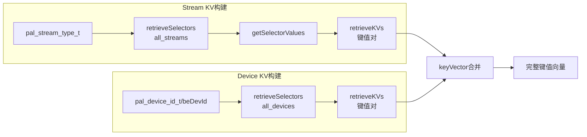
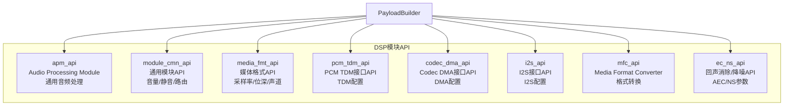
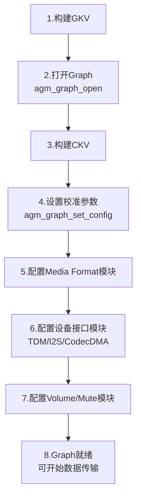
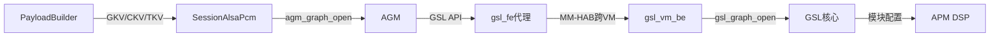
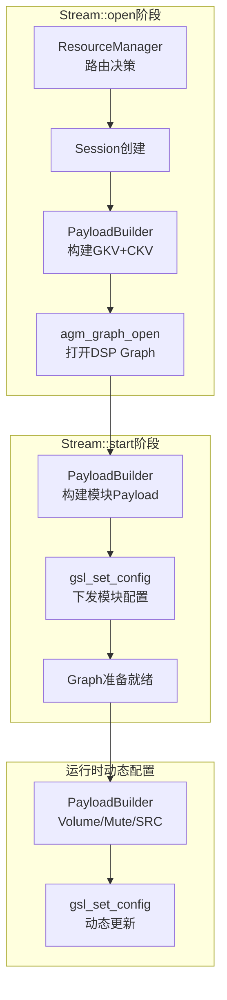

## 15.7 PayloadBuilder — 载荷构建器

> [← 上一个](15_15.6_ResourceManager-PAL核心管理模块.md) | [← 返回15章](README.md) | [返回导航](../README.md) | [下一个 →](15_15.8_HIDL_接口定义.md)

---

PayloadBuilder是PAL架构中将高层音频参数转换为DSP可识别配置载荷的核心组件。它将PAL语义（流类型、设备类型、采样率等）映射为GSL/AGM所需的键值向量（GKV/CKV/TKV）和模块配置payload，是连接PAL抽象层与DSP执行层的关键桥梁。



### 15.7.1 核心概念：三大键向量

PayloadBuilder构建的三种键向量是理解其工作机制的基础：

| 键向量 | 全称 | 用途 | 示例 |
|--------|------|------|------|
| **GKV** | Graph Key Vector | 描述DSP上的音频处理拓扑，每个GKV唯一标识一个DSP Graph | StreamRX+DeviceRX组合 |
| **CKV** | Calibration Key Vector | 校准键向量，包含采样率/位深/通道数等运行时参数 | 48kHz/16bit/2ch |
| **TKV** | Tag Key Vector | 标签键向量，用于模块内部参数配置和标识 | Volume Tag、Mute Tag |

**GKV的组合规则**：GKV由Stream GKV与Device GKV联合构成。Stream GKV根据`pal_stream_type_t`映射，Device GKV根据`pal_device_id_t`映射，两者组合后形成完整的Graph描述。例如：

```
GKV = Stream_GKV(PAL_STREAM_DEEP_BUFFER) + Device_GKV(PAL_DEVICE_OUT_SPEAKER)
    = {STREAMRX: 0xB3000002} + {DEVICERX: 0xB3000015}
```

### 15.7.2 PayloadBuilder类结构

> **⚠️ 源码核实（勘误）**：旧版本节列出的类结构（`populateGKV`/`populateDeviceGKV`/`populateCKV(bool isStreamCKV)`/`populateTKV(...effect_pal_effect_t)`/`buildGenericPayload`/`getStreamKV`/`getDeviceKV(pal_device_id_t)`/`populateCodecCdmaPayload`/`populateI2sPayload`/`populateMediaFormatPayload`/`populateVolumePayload`/`populateMutePayload`/`populateSrcPayload`）**绝大多数在源码中不存在**。真实 `session/inc/PayloadBuilder.h` 事实如下：
> - **KV 输出类型是 `std::vector<std::pair<int,int>>`**（键值对向量），**不是 `struct gsl_key_vector*`**。
> - KV 构建真实方法名：`populateStreamKV` / `populateStreamPPKV` / `populateStreamDeviceKV` / `populateDeviceKV` / `populateDevicePPKV` / `populateStreamCkv` / `populateDevicePPCkv` / `populateCalKeyVector` / `populateTagKeyVector`（无 GKV/CKV/TKV 命名的方法）。
> - Payload 构建真实以 `payload*Config` 命名，输出 `uint8_t** payload, size_t* size, uint32_t miid, ...`：`payloadMFCConfig` / `payloadVolumeConfig` / `payloadUsbAudioConfig` / `payloadDpAudioConfig` / `payloadSPConfig` / `payloadRATConfig` / `payloadLC3Config` / `payloadTWSConfig` / `payloadCopPackConfig` / `payloadCustomParam` / `payloadACDBParam` 等（无 `populate*Payload` / `build*Payload` 命名）。
> - XML 解析真实使用 **expat**（`startTag`/`endTag`/`handleData` + `XML_Char`），并维护静态向量 `all_streams`/`all_streampps`/`all_devices`/`all_devicepps`。

```cpp
class PayloadBuilder {
public:
    // === Payload 构建（输出 uint8_t** + size_t*，均带 miid）===
    void payloadMFCConfig(uint8_t** payload, size_t* size,
                          uint32_t miid, struct sessionToPayloadParam* data);
    void payloadVolumeConfig(uint8_t** payload, size_t* size,
                             uint32_t miid, struct pal_volume_data* data);
    void payloadUsbAudioConfig(uint8_t** payload, size_t* size,
                               uint32_t miid, struct usbAudioConfig* data);
    void payloadDpAudioConfig(uint8_t** payload, size_t* size,
                              uint32_t miid, struct dpAudioConfig* data);
    void payloadSPConfig(uint8_t** payload, size_t* size,
                         uint32_t miid, int paramId, void* data);
    int  payloadCustomParam(uint8_t** alsaPayload, size_t* size,
                            uint32_t* customayload, uint32_t customPayloadSize,
                            uint32_t moduleInstanceId, uint32_t dspParamId);
    int  payloadACDBParam(uint8_t** alsaPayload, size_t* size, uint8_t* acdbParam,
                          uint32_t moduleInstanceId, uint32_t sampleRate);
    // 还有 RAT/LC3/TWS/CopPack/PcmCnv/NREC/Scrambling/PopSuppressor 等 payload*Config

    // === 键值向量构建（输出 std::vector<std::pair<int,int>>）===
    int populateStreamKV(Stream* s, std::vector<std::pair<int,int>>& keyVector);
    int populateStreamDeviceKV(Stream* s, int32_t beDevId,
                               std::vector<std::pair<int,int>>& keyVector);
    int populateDeviceKV(Stream* s, int32_t beDevId,
                         std::vector<std::pair<int,int>>& keyVector);
    int populateStreamCkv(Stream* s, std::vector<std::pair<int,int>>& keyVector,
                          int tag, struct pal_volume_data**);
    int populateCalKeyVector(Stream* s, std::vector<std::pair<int,int>>& ckv, int tag);
    int populateTagKeyVector(Stream* s, std::vector<std::pair<int,int>>& tkv,
                             int tag, uint32_t* gsltag);

    // === expat XML 解析（静态回调）===
    static int  init();
    static void startTag(void* userdata, const XML_Char* tag_name, const XML_Char** attr);
    static void endTag(void* userdata, const XML_Char* tag_name);
    static void handleData(void* userdata, const char* s, int len);
    static int  getDeviceKV(int dev_id, std::vector<std::pair<int,int>>& deviceKV);

    PayloadBuilder();
    ~PayloadBuilder();

private:
    static std::vector<allKVs> all_streams;
    static std::vector<allKVs> all_streampps;
    static std::vector<allKVs> all_devices;
    static std::vector<allKVs> all_devicepps;
};
```

**设计要点**：
- `populate*KV` / `populate*Ckv` / `populate*KeyVector` 系列负责填充 `std::vector<std::pair<int,int>>` 键值对（Session 侧再转成 AGM/GSL 结构）。
- `payload*Config` 系列负责构建模块配置二进制载荷，统一输出 `uint8_t** payload + size_t* size`，且大多需要模块实例 ID `miid`。
- XML 键值映射由 `init()` 用 **expat** 解析后填入静态向量 `all_streams`/`all_devices` 等，`getDeviceKV` 等静态方法据此查询。

### 15.7.3 GKV构建逻辑详解

GKV（Graph Key Vector）是DSP Graph的唯一标识，其构建过程是PayloadBuilder最核心的功能之一。

> **⚠️ 源码核实（勘误）**：真实 PayloadBuilder **不使用硬编码的 `stream_kv_map`/`device_kv_map` 数组**，也没有 `STREAMRX`/`DEVICERX`/`0xB3xxxxxx` 这类固定映射表。真实机制是 **selector（选择器）驱动的运行时查表**：`populateStreamKV()` 调用 `retrieveSelectors(sattr->type, all_streams)` → `getSelectorValues(selectors, s, NULL)` → `retrieveKVs(...)`，从 `init()` 用 expat 解析 XML 后填充的静态向量 `all_streams` / `all_devices` 中动态检索键值对。下方键值编号仅为示意，请以运行时 XML 与 `retrieveKVs` 结果为准。



**Stream KV 示意**（真实键值来自 XML，编号仅示意）：

| PAL流类型 | 方向 | 说明 |
|-----------|------|------|
| `PAL_STREAM_LOW_LATENCY` | RX | 由 XML selector 决定实际键值 |
| `PAL_STREAM_DEEP_BUFFER` | RX | 同上 |
| `PAL_STREAM_COMPRESSED` | RX | 同上 |
| `PAL_STREAM_VOIP` | RX/TX | 同上 |
| `PAL_STREAM_VOICE_CALL` | RX/TX | 结合 `vsid_info` |

**Device KV 示意**（真实键值来自 XML）：

| PAL设备ID | 方向 | 说明 |
|-----------|------|------|
| `PAL_DEVICE_OUT_SPEAKER` | RX | 由 XML selector 决定 |
| `PAL_DEVICE_OUT_AUX_DIGITAL`(HDMI/DP) | RX | 同上 |
| `PAL_DEVICE_OUT_BLUETOOTH_A2DP` | RX | 走 BT 专用 `getBtDeviceKV` |
| `PAL_DEVICE_IN_HANDSET_MIC` | TX | 由 XML selector 决定 |
| `PAL_DEVICE_IN_BLUETOOTH_SCO` | TX | 走 BT 专用路径 |

**构建流程**：
1. `populateStreamKV()` 取 `sattr->type`，经 `retrieveSelectors`/`getSelectorValues`/`retrieveKVs` 从 `all_streams` 检索 Stream 侧键值对
2. `populateDeviceKV()` / `populateStreamDeviceKV()` 按 `beDevId` 从 `all_devices` 检索 Device 侧键值对（BT 设备走 `getBtDeviceKV`）
3. 键值对合并写入 `std::vector<std::pair<int,int>>`，由 Session 侧转换后传给 AGM/GSL 打开 DSP Graph

### 15.7.4 CKV构建逻辑详解

CKV（Calibration Key Vector）携带运行时校准参数，用于在Graph打开后配置具体的音频处理参数。

> **⚠️ 源码核实（勘误）**：旧版本节的 `PAL_KEY_SAMPLING_RATE`/`PAL_KEY_CHANNELS`/`PAL_KEY_VOLUME` 校准键表、`kvh2xml.h` 中 `CAL_KEY_VOLUME=0xB3000001` 之类"校准键映射表"、以及 `populateCKV(isStreamCKV)` 签名**均不存在于 PayloadBuilder 源码**。真实的 CKV 构建方法是 `populateStreamCkv(Stream* s, std::vector<std::pair<int,int>>& keyVector, int tag, struct pal_volume_data**)`、`populateCalKeyVector(Stream* s, std::vector<std::pair<int,int>>& ckv, int tag)`、`populateDevicePPCkv(...)`，输出类型是 `std::vector<std::pair<int,int>>`（**非 `gsl_key_vector*`**）。

**真实 CKV 构建机制**：`populateCalKeyVector` 以 `tag` 参数做 `switch`，按运行时状态往 `ckv` 追加键值对：

```cpp
int PayloadBuilder::populateCalKeyVector(Stream *s,
        std::vector<std::pair<int,int>> &ckv, int tag) {
    switch (static_cast<uint32_t>(tag)) {
    case TAG_DEVICE_PP_MBDRC:               // 增益校准
        level = s->getGainLevel();
        if (level != -1)
            ckv.push_back(std::make_pair(GAIN, level));
        break;
    case SPKR_PROT_ENABLE:                  // 扬声器保护：按声道数选映射
        ckv.push_back(std::make_pair(SPK_PRO_DEV_MAP, LEFT_RIGHT));  // 或 RIGHT_MONO
        break;
    case SPKR_VI_ENABLE:
        ckv.push_back(std::make_pair(SPK_PRO_VI_MAP, STEREO_SPKR));
        break;
    // ...
    }
}
```

- 键名（`GAIN`/`SPK_PRO_DEV_MAP`/`SPK_PRO_VI_MAP` 等）是 kvh2xml 生成的**枚举常量**，非 PayloadBuilder 内硬编码 `0xB3xxxxxx` 表。
- 值来自运行时查询（`getGainLevel()`、关联设备通道数等），而非静态映射。

采样率/通道数/位深等媒体格式参数并非通过 CKV 校准键传递，而是由 `payloadMFCConfig`（Media Format Converter）等 payload 方法直接下发到对应模块（见 15.7.6）。CKV 仅承载增益、扬声器保护映射等"校准"性质的键值。

### 15.7.5 TKV构建逻辑详解

TKV（Tag Key Vector）用于标识DSP模块内部的特定参数配置点。与GKV描述拓扑、CKV描述校准参数不同，TKV用于精确定位某个模块实例的某个配置入口。

**典型TKV使用场景**：
- **音量配置**：通过TKV定位Volume模块实例，设置音量值
- **静音配置**：通过TKV定位Mute模块实例，设置静音状态
- **音效参数**：通过TKV定位Effect模块实例，下发音效参数
- **路由切换**：通过TKV定位Router模块，修改信号路由

> **⚠️ 源码核实（勘误）**：真实的 TKV 构建方法是 `populateTagKeyVector(Stream* s, std::vector<std::pair<int,int>>& tkv, int tag, uint32_t* gsltag)`（**无 `populateTKV(tag, effect)` 签名**），输出 `std::vector<std::pair<int,int>>`，并通过 `gsltag` 出参返回对应的 GSL tag。`tag` 参数指定目标模块标签，运行时依据流/设备状态往 `tkv` 追加键值对。

### 15.7.6 模块配置Payload详解

模块配置Payload是PayloadBuilder的另一核心产出，每种DSP模块都有对应的配置数据结构。

> **⚠️ 源码核实（勘误）**：本节下方 `codec_dma_module_config` / `i2s_module_config` / `media_format_module_config` / `pcm_tdm_module_config` / `volume_module_config` / `mute_module_config` 等结构体名**在 PayloadBuilder 源码中均不存在**（属虚构命名）。真实 payload 由 `payload*Config` 系列方法（`payloadMFCConfig`/`payloadVolumeConfig`/`payloadUsbAudioConfig`/`payloadRATConfig`/`payloadSPConfig` 等）构建，填充的是 **spf API 头文件中的标准结构体**，通用头是 `struct apm_module_param_data`（真实存在）。真实结构体名对照：
>
> | 文档虚构结构体 | 真实 spf 结构体 | 构建方法 |
> |----------------|-----------------|----------|
> | `media_format_module_config` | `param_id_mfc_output_media_fmt_t` | `payloadMFCConfig` |
> | `volume_module_config` | `volume_ctrl_master_gain_t` | `payloadVolumeConfig` |
> | `codec_dma_module_config` / `i2s_module_config` / `pcm_tdm_module_config` | 无（设备接口配置由设备侧/AGM 处理，PayloadBuilder 不含这些结构） | — |
> | （USB 音频） | `struct param_id_usb_audio_intf_cfg_t` | `payloadUsbAudioConfig` |
> | （RAT 媒体格式） | `param_id_rat_mf_t` | `payloadRATConfig` |
> | （扬声器保护 SP） | `param_id_sp_*_t` 系列 | `payloadSPConfig` |
>
> 下方结构体字段仅作**概念示意**，请以 spf API 头文件为准。

#### 通用Payload头结构

所有模块Payload共享统一的头部：

```cpp
struct apm_module_param_data {
    uint32_t module_instance_id;    // 模块实例ID
    uint32_t param_id;              // 参数ID
    uint32_t param_size;            // 参数数据大小
    uint32_t error_code;            // 错误码(由DSP填写)
};
// 完整payload = apm_module_param_data + param_data
```

#### CODEC_DMA模块配置

```cpp
struct codec_dma_module_config {
    struct apm_module_param_data param_data;
    uint32_t codec_dma_cfg_minor_version;
    uint32_t direction;             // 0=RX, 1=TX
    uint32_t sample_rate;           // 采样率
    uint16_t bit_width;             // 位宽
    uint16_t channel_count;         // 通道数
    uint32_t data_format;           // 数据格式
    uint32_t codec_interface;       // Codec接口类型
    uint32_t codec_type;            // Codec类型
};
```

**用途**：配置编解码器DMA接口参数，用于与外部Codec芯片的数据传输。

#### I2S模块配置

```cpp
struct i2s_module_config {
    struct apm_module_param_data param_data;
    uint32_t i2s_cfg_minor_version;
    uint32_t bit_width;             // I2S位宽
    uint32_t channel_count;         // I2S通道数
    uint32_t sample_rate;           // 采样率
    uint32_t data_format;           // 数据格式
    uint32_t i2s_mode;              // I2S模式(标准/左对齐/TDM等)
    uint32_t i2s_intf;              // I2S接口编号
};
```

**用途**：配置I2S数字音频接口参数，常用于连接外部DSP或Codec。

#### Media Format模块配置

```cpp
struct media_format_module_config {
    struct apm_module_param_data param_data;
    uint32_t minor_version;
    uint32_t sample_rate;           // 采样率
    uint16_t bit_width;             // 位宽
    uint16_t channel_count;         // 通道数
    uint8_t  channel_mapping[8];    // 通道映射
    uint32_t data_format;           // 数据格式(PCM/压缩)
    uint32_t alignment;             // 对齐方式
    uint32_t bit_depth;             // 位深度
    uint32_t packet_size;           // 包大小
};
```

**用途**：配置PCM或压缩格式的媒体参数，是每个Stream必须配置的基础模块。

#### PCM TDM模块配置

```cpp
struct pcm_tdm_module_config {
    struct apm_module_param_data param_data;
    uint32_t tdm_cfg_minor_version;
    uint32_t lane_ctrl;             // Lane控制
    uint32_t port_id;               // 端口ID
    uint32_t bit_width;             // 位宽
    uint32_t channel;               // 通道数
    uint32_t sample_rate;           // 采样率
    uint32_t sync_src;              // 同步源
    uint32_t ctrl_data_out_enable;  // 数据输出使能
    uint32_t ctrl_invert_sync;      // 反相同步
    uint32_t ctrl_sync_res;         // 同步分辨率
    uint32_t ctrl_clk_framed;       // 时钟帧模式
    uint32_t slot_width;            // Slot宽度
    uint32_t slot_mask;             // Slot掩码
    uint32_t data_format;           // 数据格式
    uint32_t pcm_width;             // PCM宽度
};
```

**用途**：配置TDM多通道音频接口，用于车载多通道音频传输场景。

#### Volume/Mute模块配置

```cpp
struct volume_module_config {
    struct apm_module_param_data param_data;
    float volume[8];                // 每通道音量值(0.0~1.0)
    uint32_t ramp_duration_ms;      // 音量渐变时长
};

struct mute_module_config {
    struct apm_module_param_data param_data;
    uint32_t mute;                  // 0=取消静音, 1=静音
    uint32_t ramp_duration_ms;      // 静音渐变时长
};
```

**用途**：音量和静音控制，支持渐变（ramp）以避免pop/click噪声。

### 15.7.7 DSP模块API体系

PayloadBuilder支持多种DSP模块API，每种API对应不同的音频处理功能：



| 模块API | 真实对应方法 | 功能说明 |
|---------|----------|----------|
| `apm_api`（`apm_module_param_data` 通用头） | 所有 `payload*Config` 方法 | 通用模块参数头，包裹每个模块的具体参数 |
| MFC（Media Format Converter） | `payloadMFCConfig()`（填 `param_id_mfc_output_media_fmt_t`） | 采样率/位深/声道格式转换 |
| Volume | `payloadVolumeConfig()`（填 `volume_ctrl_master_gain_t`） | 音量控制 |
| USB 音频接口 | `payloadUsbAudioConfig()`（填 `param_id_usb_audio_intf_cfg_t`） | USB 音频接口配置 |
| RAT 媒体格式 | `payloadRATConfig()`（填 `param_id_rat_mf_t`） | RAT 模块媒体格式 |
| 扬声器保护 SP | `payloadSPConfig()`（填 `param_id_sp_*_t` 系列） | 扬声器保护/VI 反馈参数 |
| 自定义参数 | `payloadCustomParam()` | 透传任意 moduleInstanceId/paramId 自定义载荷 |

> **⚠️ 源码核实（勘误）**：上方 Mermaid 图与旧表中的 `buildGenericPayload`/`populateVolumePayload`/`populateMutePayload`/`populateMediaFormatPayload`/`buildPcmTdmPayload`/`populateCodecCdmaPayload`/`populateI2sPayload`/`buildMfcPayload` **均为虚构方法名**，PayloadBuilder 中不存在。真实方法一律以 `payload*Config` 命名（见上表），签名形如 `int payloadXxxConfig(uint8_t** payload, size_t* size, uint32_t miid, ...)`。设备接口（TDM/I2S/CodecDMA）配置不由 PayloadBuilder 完成。
|---------|----------|----------|
| `apm_api` | `buildGenericPayload()` | 通用音频处理模块，APM框架基础 |
| `module_cmn_api` | `populateVolumePayload()`/`populateMutePayload()` | 通用模块，音量/静音/路由控制 |
| `media_fmt_api` | `populateMediaFormatPayload()` | 媒体格式配置，采样率/位深/声道 |
| `pcm_tdm_api` | `buildPcmTdmPayload()` | PCM/TDM接口配置 |
| `codec_dma_api` | `populateCodecCdmaPayload()` | Codec DMA接口配置 |
| `i2s_api` | `populateI2sPayload()` | I2S接口配置 |
| `mfc_api` | `buildMfcPayload()` | 媒体格式转换器，采样率/位深转换 |
| `ec_ns_api` | 专用populate方法 | 回声消除/降噪参数配置 |

### 15.7.8 KV/Payload 在 open 流程中的消费

> **⚠️ 源码核实（勘误）**：`SessionAlsaPcm::configureGraph()` 方法**不存在**（属虚构），代码中的 `populateGKV`/`populateDeviceGKV`/`populateCKV`/`populateMediaFormatPayload`/`buildPcmTdmPayload`/`buildCodecDmaPayload`/`buildI2sPayload`/`populateVolumePayload` 及 `agm_graph_open`/`gsl_set_config` 直调链**均为虚构**。真实入口是 `SessionAlsaPcm::open()` → `SessionAlsaUtils::open()`，后者依次调用 PayloadBuilder 的真实方法，产出的 KV 通过 ALSA mixer control（而非直接 `gsl_set_config`）下发。

真实调用序列（`SessionAlsaUtils::open()`，PAL 源码）：

```cpp
int SessionAlsaUtils::open(Stream *streamHandle,
        std::shared_ptr<ResourceManager> rmHandle,
        std::vector<int> &pcmDevIds,
        const std::vector<...> &BackEnds) {
    std::vector<std::pair<int,int>> streamKV, streamCKV, deviceKV, streamDeviceKV, emptyKV;
    PayloadBuilder* builder = new PayloadBuilder();

    // 1. 流 GKV / CKV
    builder->populateStreamKV(streamHandle, streamKV);
    builder->populateStreamCkv(streamHandle, streamCKV, 0, nullptr);

    // 2. 设备 GKV
    builder->populateDeviceKV(streamHandle, be->first, deviceKV);

    // 3. 流-设备 GKV
    builder->populateStreamDeviceKV(streamHandle, be->first, streamDeviceKV);

    // 4. 校准键向量（按 tag）
    builder->populateCalKeyVector(streamHandle, emptyKV, tag);

    // 5. 组装 GKV/CKV 后经 ALSA mixer control 下发给 AGM
    // ...（setMixerParameter / mixer_ctl_set_array）
}
```

- KV 输出类型是 `std::vector<std::pair<int,int>>`，非 `gsl_key_vector`。
- Voice/Compress 路径（`SessionAlsaUtils::open` 的另一重载，源码 1215 行起）用 `populateStreamKV`（带方向参数重载）+ `populateStreamCkv` + `populateDeviceKV` + `populateStreamDeviceKV` + `populateCalKeyVector`，模式一致。

**流程总结**：



### 15.7.9 键值映射机制（XML + selector）

> **⚠️ 源码核实（勘误）**：旧版本节展示的 `kvh2xml_entry stream_kv_map[]` / `device_kv_map[]` / `cal_kv_map[]` 静态数组**在 PayloadBuilder 源码中不存在**，`STREAMRX`/`DEVICERX`/`CAL_KEY_*`/`0xB3xxxxxx` 也非本文件的映射定义。真实机制是：`PayloadBuilder::init()` 用 **expat** 解析 payload/resourcemanager 相关 XML，把流/设备/PP 的键值配置填入静态向量 `all_streams` / `all_streampps` / `all_devices` / `all_devicepps`；运行时通过 selector 检索（`retrieveSelectors` → `getSelectorValues` → `retrieveKVs`）动态生成 `std::vector<std::pair<int,int>>` 键值对。

真实数据源与检索链：

```cpp
// 静态向量：由 init() 用 expat 从 XML 填充
static std::vector<allKVs> all_streams;    // 流类型 → 键值/选择器配置
static std::vector<allKVs> all_streampps;  // 流后处理
static std::vector<allKVs> all_devices;    // 设备 → 键值/选择器配置
static std::vector<allKVs> all_devicepps;  // 设备后处理

// 运行时检索（populateStreamKV 内部）
selectors             = retrieveSelectors(sattr->type, all_streams);
filled_selector_pairs = getSelectorValues(selectors, s, NULL);
retrieveKVs(filled_selector_pairs, sattr->type, all_streams, keyVector);
```

**expat 解析回调**：`init()` 注册 `startTag`/`endTag`/`handleData`，遇到键值/选择器节点时调用 `processKVTypeData` / `processKVSelectorData` / `processGraphKVData` 将数据填入 `allKVs` 结构，最终追加到 `all_streams` / `all_devices` 等静态向量。

**selector 检索辅助**：`retrieveSelectors`/`getSelectorValues`/`retrieveKVs` 之外，还有 `removeDuplicateSelectors`/`isIdTypeAvailable`/`compareNumSelectors`/`removeSpaces`/`splitStrings` 等字符串/集合处理工具函数支撑运行时匹配。

**定制要点**：新增 Stream/Device 类型的键值不是改本文件的静态数组，而是**修改对应 XML 配置**（由 `init()` 通过 expat 加载）。设备侧另有静态方法 `getDeviceKV(int dev_id, ...)` / `getBtDeviceKV(...)` / `isBtDevice(...)` 提供固定设备 KV，不经 XML。

### 15.7.10 与GSL/AGM的交互数据流

PayloadBuilder的最终产物通过SessionAlsaPcm传递给AGM/GSL，完整数据流如下：



**调用链详解**：

| 阶段 | 接口 | 说明 |
|------|------|------|
| PayloadBuilder → SessionAlsaPcm | GKV/CKV/TKV结构体 | 内存传递，零拷贝 |
| SessionAlsaPcm → AGM | `agm_graph_open()`/`agm_graph_set_config()` | AGM公共API |
| AGM → gsl_fe | `gsl_graph_open()`/`gsl_set_config()` | GSL前端代理 |
| gsl_fe → gsl_vm_be | MM-HAB IPC | SA8295跨VM通信 |
| gsl_vm_be → GSL | `gsl_graph_open()`/`gsl_set_config()` | QNX侧GSL核心 |
| GSL → APM | 模块参数下发 | DSP固件执行 |

> **SA8295跨VM路径**：在SA8295平台上，AGM调用GSL API由`gsl_fe`代理经MM-HAB跨VM转发给QNX侧`gsl_vm_be`执行。Legacy架构下AGM直接调用GSL API，无需跨VM。详见[16.10 AGM深度解析](../16_Vendor_QNX_Architecture/README.md)和[16.14 GSL内部架构](../16_Vendor_QNX_Architecture/README.md)。

### 15.7.11 PayloadBuilder在PAL生命周期中的位置



| 生命周期阶段 | PayloadBuilder职责 | 产出 |
|-------------|-------------------|------|
| `Stream::open` | 经 `SessionAlsaUtils::open` 调用 `populateStreamKV`/`populateStreamCkv`/`populateDeviceKV`/`populateStreamDeviceKV`/`populateCalKeyVector` | KV（`vector<pair<int,int>>`）+ 校准键 |
| `Stream::start` | 构建模块 payload（`payload*Config`） | MediaFormat/Volume/SP 等模块参数 |
| `setVolume()` | `payloadVolumeConfig` | 动态音量更新 |
| `setMute()` | `payloadVolumeConfig`（volume=0）/相关 config | 动态静音更新 |
| `setParameters()` | `payloadCustomParam` 等 | 自定义/音效参数 |

> **⚠️ 源码核实（勘误）**：上方 Mermaid 图中的 `agm_graph_open`/`gsl_set_config` 直调、以及"构建GKV+CKV/模块Payload"等表述沿用了虚构方法命名。实际 KV 通过 ALSA mixer control 下发，payload 由 `payload*Config` 系列构建；无 `populateGKV`/`populateCKV`/`buildXxxPayload`。
|-------------|-------------------|------|
| `Stream::open` | 构建GKV和CKV | Graph标识和校准参数 |
| `Stream::start` | 构建所有模块Payload | MediaFormat/DeviceIF/Volume等配置 |
| `setVolume()` | 构建Volume Payload | 动态音量更新 |
| `setMute()` | 构建Mute Payload | 动态静音更新 |
| `setConfig()` | 构建SRC/Effect Payload | 采样率转换/音效参数 |

### 15.7.12 调试与故障排查

**常见问题**：

| 问题 | 原因 | 排查方法 |
|------|------|----------|
| Graph打开失败 | 键值检索失败或 XML 配置缺失 | 检查 payload/resourcemanager XML 中该流/设备的键值与 selector 配置；`retrieveKVs` 是否返回空 |
| 无声音输出 | 模块Payload配置错误 | 抓取AGM日志，确认 mixer control 下发的参数 |
| 采样率不匹配 | MFC 输出媒体格式配置错误 | 检查 `payloadMFCConfig` 填充的 `param_id_mfc_output_media_fmt_t` 字段 |
| 音量无变化 | Volume Payload未下发或 moduleInstanceId 错误 | 确认 `payloadVolumeConfig` 的 miid 与 tag 检索正确 |
| 跨VM通信失败 | MM-HAB通道异常 | 检查gsl_fe/gsl_vm_be日志 |

**关键日志标签**：
- `AGM`：AGM API调用日志
- `GSL`：GSL核心执行日志
- `PAL_DBG`：PAL层PayloadBuilder日志

---

> [← 上一个](15_15.6_ResourceManager-PAL核心管理模块.md) | [← 返回15章](README.md) | [返回导航](../README.md) | [下一个 →](15_15.8_HIDL_接口定义.md)