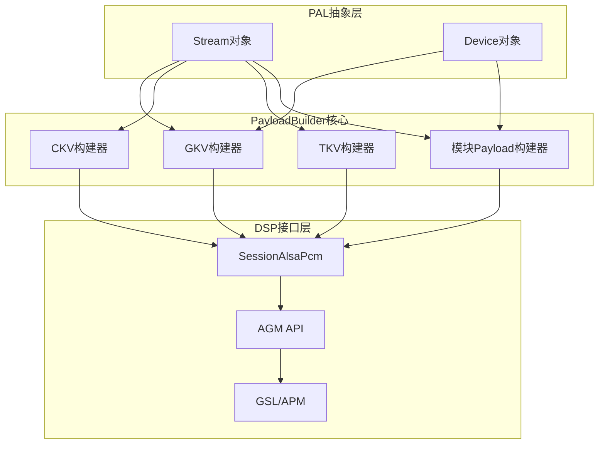
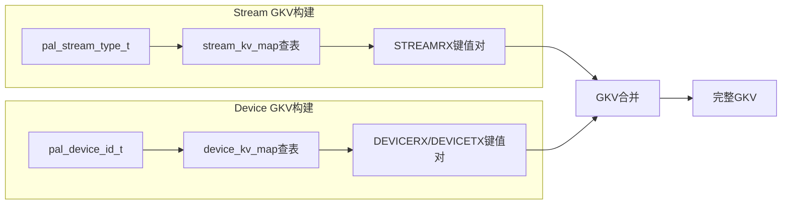
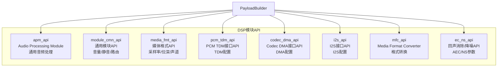
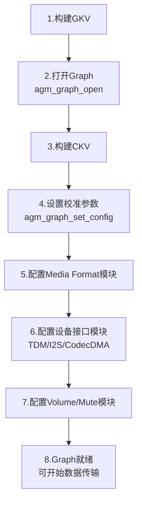
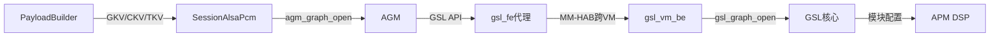
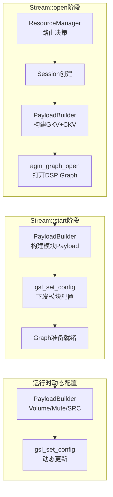

## 15.7 PayloadBuilder — 载荷构建器

> [← 上一个](15_15.6_架构地位.md) | [← 返回15章](README.md) | [返回导航](../README.md) | [下一个 →](15_15.8_HIDL_接口定义.md)

---

PayloadBuilder是PAL架构中将高层音频参数转换为DSP可识别配置载荷的核心组件。它将PAL语义（流类型、设备类型、采样率等）映射为GSL/AGM所需的键值向量（GKV/CKV/TKV）和模块配置payload，是连接PAL抽象层与DSP执行层的关键桥梁。



### 15.7.1 核心概念：三大键向量

PayloadBuilder构建的三种键向量是理解其工作机制的基础：

| 键向量 | 全称 | 用途 | 示例 |
|--------|------|------|------|
| **GKV** | Graph Key Vector | 描述DSP上的音频处理拓扑，每个GKV唯一标识一个DSP Graph | StreamRX+DeviceRX组合 |
| **CKV** | Calibration Key Vector | 校准键向量，包含采样率/位深/通道数等运行时参数 | 48kHz/16bit/2ch |
| **TKV** | Tag Key Vector | 标签键向量，用于模块内部参数配置和标识 | Volume Tag、Mute Tag |

**GKV的组合规则**：GKV由Stream GKV与Device GKV联合构成。Stream GKV根据`pal_stream_type_t`映射，Device GKV根据`pal_device_id_t`映射，两者组合后形成完整的Graph描述。例如：

```
GKV = Stream_GKV(PAL_STREAM_DEEP_BUFFER) + Device_GKV(PAL_DEVICE_OUT_SPEAKER)
    = {STREAMRX: 0xB3000002} + {DEVICERX: 0xB3000015}
```

### 15.7.2 PayloadBuilder类结构

```cpp
class PayloadBuilder {
public:
    // === GKV构建 ===
    int populateGKV(Stream *s, struct gsl_key_vector *gkv);
    int populateDeviceGKV(std::shared_ptr<Device> d,
                          struct gsl_key_vector *gkv);

    // === CKV构建 ===
    int populateCKV(Stream *s, struct gsl_key_vector *ckv,
                    bool isStreamCKV);

    // === TKV构建 ===
    int populateTKV(Stream *s, int tag,
                    struct gsl_key_vector *tkv,
                    effect_pal_effect_t effect);

    // === 模块配置Payload构建 ===
    int populateCodecCdmaPayload(struct gsl_key_vector *kv,
                                  void *payload, size_t *size);
    int populateI2sPayload(struct gsl_key_vector *kv,
                            void *payload, size_t *size);
    int populateMediaFormatPayload(struct pal_stream_attributes *attr,
                                    void *payload, size_t *size);
    int populateVolumePayload(struct pal_volume_data *vol,
                               void *payload, size_t *size);
    int populateMutePayload(bool mute,
                             void *payload, size_t *size);
    int populateSrcPayload(struct pal_stream_attributes *attr,
                            void *payload, size_t *size);

    // === 辅助静态方法 ===
    static int getStreamKV(Stream *s, struct gsl_key_vector *kv);
    static int getDeviceKV(pal_device_id_t devId,
                           struct gsl_key_vector *kv);

    // === 通用Payload构建 ===
    int buildGenericPayload(uint32_t module_id, uint32_t param_id,
                            void *param_data, size_t param_size,
                            void **payload, size_t *payload_size);
};
```

**设计要点**：
- `populate*`系列方法负责填充键向量（GKV/CKV/TKV），输出`gsl_key_vector`结构
- `build*Payload`系列方法负责构建模块配置的二进制载荷，输出`void* payload + size_t size`
- 静态方法`getStreamKV`/`getDeviceKV`提供独立的键值查询能力，不依赖PayloadBuilder实例

### 15.7.3 GKV构建逻辑详解

GKV（Graph Key Vector）是DSP Graph的唯一标识，其构建过程是PayloadBuilder最核心的功能之一。



**Stream GKV映射表**（`kvh2xml.h`中定义）：

| PAL流类型 | 方向 | DSP键值 |
|-----------|------|---------|
| `PAL_STREAM_LOW_LATENCY` | STREAMRX | 0xB3000001 |
| `PAL_STREAM_DEEP_BUFFER` | STREAMRX | 0xB3000002 |
| `PAL_STREAM_COMPRESSED` | STREAMRX | 0xB3000003 |
| `PAL_STREAM_VOIP` | STREAMRX | 0xB3000005 |
| `PAL_STREAM_VOICE_CALL` | STREAMRX | 0xB3000006 |
| `PAL_STREAM_GENERIC_CHIME` | STREAMRX | 0xB300000B |
| `PAL_STREAM_NAVI` | STREAMRX | 0xB300000E |

**Device GKV映射表**：

| PAL设备ID | 方向 | DSP键值 |
|-----------|------|---------|
| `PAL_DEVICE_OUT_SPEAKER` | DEVICERX | 0xB3000015 |
| `PAL_DEVICE_OUT_HDMI` | DEVICERX | 0xB3000012 |
| `PAL_DEVICE_OUT_BLUETOOTH_A2DP` | DEVICERX | 0xB300001A |
| `PAL_DEVICE_IN_HANDSET_MIC` | DEVICETX | 0xB3000004 |
| `PAL_DEVICE_IN_BLUETOOTH_SCO` | DEVICETX | 0xB3000017 |

**构建流程**：
1. `populateGKV()`根据Stream类型查`stream_kv_map`获取Stream侧键值对
2. `populateDeviceGKV()`根据Device类型查`device_kv_map`获取Device侧键值对
3. 两者合并写入`gsl_key_vector`结构，传递给`agm_graph_open()`打开DSP Graph

### 15.7.4 CKV构建逻辑详解

CKV（Calibration Key Vector）携带运行时校准参数，用于在Graph打开后配置具体的音频处理参数。

**CKV包含的校准键**：

| 校准键 | PAL常量 | 说明 |
|--------|---------|------|
| 采样率 | `PAL_KEY_SAMPLING_RATE` | 如48000、16000 |
| 通道数 | `PAL_KEY_CHANNELS` | 如1(单声道)、2(立体声) |
| 位深 | `PAL_KEY_BIT_WIDTH` | 如16、24、32 |
| 音量 | `PAL_KEY_VOLUME` | 音量级别校准 |

**校准键映射表**（`kvh2xml.h`）：

| 参数类型 | 映射键 | DSP键值 |
|----------|--------|---------|
| VOLUME | CAL_KEY_VOLUME | 0xB3000001 |
| GAIN | CAL_KEY_GAIN | 0xB3000002 |
| SAMPLINGRATE | CAL_KEY_RATE | 0xB3000003 |

`populateCKV()`根据Stream的`pal_stream_attributes`提取采样率、通道数、位深等参数，查表后填充到`gsl_key_vector`中。`isStreamCKV`参数区分Stream侧CKV和Device侧CKV的构建逻辑差异。

### 15.7.5 TKV构建逻辑详解

TKV（Tag Key Vector）用于标识DSP模块内部的特定参数配置点。与GKV描述拓扑、CKV描述校准参数不同，TKV用于精确定位某个模块实例的某个配置入口。

**典型TKV使用场景**：
- **音量配置**：通过TKV定位Volume模块实例，设置音量值
- **静音配置**：通过TKV定位Mute模块实例，设置静音状态
- **音效参数**：通过TKV定位Effect模块实例，下发音效参数
- **路由切换**：通过TKV定位Router模块，修改信号路由

`populateTKV()`的`tag`参数指定目标模块标签，`effect`参数在音效场景下标识具体的音效类型（如AEC、NS等）。

### 15.7.6 模块配置Payload详解

模块配置Payload是PayloadBuilder的另一核心产出，每种DSP模块都有对应的配置数据结构。

#### 通用Payload头结构

所有模块Payload共享统一的头部：

```cpp
struct apm_module_param_data {
    uint32_t module_instance_id;    // 模块实例ID
    uint32_t param_id;              // 参数ID
    uint32_t param_size;            // 参数数据大小
    uint32_t error_code;            // 错误码(由DSP填写)
};
// 完整payload = apm_module_param_data + param_data
```

#### CODEC_DMA模块配置

```cpp
struct codec_dma_module_config {
    struct apm_module_param_data param_data;
    uint32_t codec_dma_cfg_minor_version;
    uint32_t direction;             // 0=RX, 1=TX
    uint32_t sample_rate;           // 采样率
    uint16_t bit_width;             // 位宽
    uint16_t channel_count;         // 通道数
    uint32_t data_format;           // 数据格式
    uint32_t codec_interface;       // Codec接口类型
    uint32_t codec_type;            // Codec类型
};
```

**用途**：配置编解码器DMA接口参数，用于与外部Codec芯片的数据传输。

#### I2S模块配置

```cpp
struct i2s_module_config {
    struct apm_module_param_data param_data;
    uint32_t i2s_cfg_minor_version;
    uint32_t bit_width;             // I2S位宽
    uint32_t channel_count;         // I2S通道数
    uint32_t sample_rate;           // 采样率
    uint32_t data_format;           // 数据格式
    uint32_t i2s_mode;              // I2S模式(标准/左对齐/TDM等)
    uint32_t i2s_intf;              // I2S接口编号
};
```

**用途**：配置I2S数字音频接口参数，常用于连接外部DSP或Codec。

#### Media Format模块配置

```cpp
struct media_format_module_config {
    struct apm_module_param_data param_data;
    uint32_t minor_version;
    uint32_t sample_rate;           // 采样率
    uint16_t bit_width;             // 位宽
    uint16_t channel_count;         // 通道数
    uint8_t  channel_mapping[8];    // 通道映射
    uint32_t data_format;           // 数据格式(PCM/压缩)
    uint32_t alignment;             // 对齐方式
    uint32_t bit_depth;             // 位深度
    uint32_t packet_size;           // 包大小
};
```

**用途**：配置PCM或压缩格式的媒体参数，是每个Stream必须配置的基础模块。

#### PCM TDM模块配置

```cpp
struct pcm_tdm_module_config {
    struct apm_module_param_data param_data;
    uint32_t tdm_cfg_minor_version;
    uint32_t lane_ctrl;             // Lane控制
    uint32_t port_id;               // 端口ID
    uint32_t bit_width;             // 位宽
    uint32_t channel;               // 通道数
    uint32_t sample_rate;           // 采样率
    uint32_t sync_src;              // 同步源
    uint32_t ctrl_data_out_enable;  // 数据输出使能
    uint32_t ctrl_invert_sync;      // 反相同步
    uint32_t ctrl_sync_res;         // 同步分辨率
    uint32_t ctrl_clk_framed;       // 时钟帧模式
    uint32_t slot_width;            // Slot宽度
    uint32_t slot_mask;             // Slot掩码
    uint32_t data_format;           // 数据格式
    uint32_t pcm_width;             // PCM宽度
};
```

**用途**：配置TDM多通道音频接口，用于车载多通道音频传输场景。

#### Volume/Mute模块配置

```cpp
struct volume_module_config {
    struct apm_module_param_data param_data;
    float volume[8];                // 每通道音量值(0.0~1.0)
    uint32_t ramp_duration_ms;      // 音量渐变时长
};

struct mute_module_config {
    struct apm_module_param_data param_data;
    uint32_t mute;                  // 0=取消静音, 1=静音
    uint32_t ramp_duration_ms;      // 静音渐变时长
};
```

**用途**：音量和静音控制，支持渐变（ramp）以避免pop/click噪声。

### 15.7.7 DSP模块API体系

PayloadBuilder支持多种DSP模块API，每种API对应不同的音频处理功能：



| 模块API | 对应方法 | 功能说明 |
|---------|----------|----------|
| `apm_api` | `buildGenericPayload()` | 通用音频处理模块，APM框架基础 |
| `module_cmn_api` | `populateVolumePayload()`/`populateMutePayload()` | 通用模块，音量/静音/路由控制 |
| `media_fmt_api` | `populateMediaFormatPayload()` | 媒体格式配置，采样率/位深/声道 |
| `pcm_tdm_api` | `buildPcmTdmPayload()` | PCM/TDM接口配置 |
| `codec_dma_api` | `populateCodecCdmaPayload()` | Codec DMA接口配置 |
| `i2s_api` | `populateI2sPayload()` | I2S接口配置 |
| `mfc_api` | `buildMfcPayload()` | 媒体格式转换器，采样率/位深转换 |
| `ec_ns_api` | 专用populate方法 | 回声消除/降噪参数配置 |

### 15.7.8 configureGraph()完整流程

`SessionAlsaPcm::configureGraph()`是PayloadBuilder产物的消费方，展示了完整的配置流程：

```cpp
int SessionAlsaPcm::configureGraph(Stream *s) {
    struct pal_stream_attributes *attr = s->getAttributes();
    auto devices = s->getAssociatedDevices();

    // 1. 构建GKV - 打开DSP Graph
    populateGKV(s, &gkv);
    for (auto& dev : devices)
        populateDeviceGKV(dev, &gkv);
    agm_graph_open(&gkv, &graphHandle);

    // 2. 构建CKV - 设置校准参数
    populateCKV(s, &ckv, true);
    agm_graph_set_config(graphHandle, &ckv);

    // 3. 配置媒体格式模块
    populateMediaFormatPayload(attr, &media_payload, &size);
    gsl_set_config(graphHandle, &gkv, 0, media_payload);

    // 4. 配置设备接口模块（TDM/I2S/CodecDMA）
    for (auto& dev : devices) {
        switch (dev->getDeviceInterface()) {
        case TDM_INTERFACE:
            buildPcmTdmPayload(dev->getConfig(), &payload, &size);
            break;
        case CODEC_DMA_INTERFACE:
            buildCodecDmaPayload(dev->getConfig(), &payload, &size);
            break;
        case I2S_INTERFACE:
            buildI2sPayload(dev->getConfig(), &payload, &size);
            break;
        }
        gsl_set_config(graphHandle, &gkv, 0, payload);
    }

    // 5. 配置音量模块
    populateVolumePayload(s->getVolumeConfig(), &vol_payload, &size);
    gsl_set_config(graphHandle, &gkv, 0, vol_payload);
}
```

**流程总结**：



### 15.7.9 kvh2xml键值映射机制

`kvh2xml.h`是PayloadBuilder的映射数据源，定义了PAL语义键到DSP模块参数的完整映射关系。理解此映射表是定制和调试音频路由的关键。

```cpp
// Stream类型到DSP模块的映射
static const struct kvh2xml_entry stream_kv_map[] = {
    {PAL_STREAM_LOW_LATENCY,       STREAMRX, 0xB3000001},
    {PAL_STREAM_DEEP_BUFFER,       STREAMRX, 0xB3000002},
    {PAL_STREAM_COMPRESSED,        STREAMRX, 0xB3000003},
    {PAL_STREAM_VOIP,              STREAMRX, 0xB3000005},
    {PAL_STREAM_VOICE_CALL,        STREAMRX, 0xB3000006},
    {PAL_STREAM_GENERIC_CHIME,     STREAMRX, 0xB300000B},
    {PAL_STREAM_NAVI,              STREAMRX, 0xB300000E},
};

// Device类型到DSP模块的映射
static const struct kvh2xml_entry device_kv_map[] = {
    {PAL_DEVICE_OUT_SPEAKER,       DEVICERX, 0xB3000015},
    {PAL_DEVICE_OUT_HDMI,          DEVICERX, 0xB3000012},
    {PAL_DEVICE_OUT_BLUETOOTH_A2DP,DEVICERX, 0xB300001A},
    {PAL_DEVICE_IN_HANDSET_MIC,    DEVICETX, 0xB3000004},
    {PAL_DEVICE_IN_BLUETOOTH_SCO,  DEVICETX, 0xB3000017},
};

// 校准键映射
static const struct kvh2xml_entry cal_kv_map[] = {
    {VOLUME,      CAL_KEY_VOLUME, 0xB3000001},
    {GAIN,        CAL_KEY_GAIN,   0xB3000002},
    {SAMPLINGRATE,CAL_KEY_RATE,   0xB3000003},
};
```

**映射表结构**：每个`kvh2xml_entry`包含三个字段：
- **PAL侧标识**：`pal_stream_type_t`或`pal_device_id_t`
- **方向标识**：STREAMRX/STREAMTX/DEVICERX/DEVICETX
- **DSP侧键值**：0xB3xxxxxx格式的DSP模块标识

**定制要点**：新增Stream类型或Device类型时，必须同步更新`kvh2xml.h`中的映射表，否则PayloadBuilder无法构建正确的GKV，导致Graph打开失败。

### 15.7.10 与GSL/AGM的交互数据流

PayloadBuilder的最终产物通过SessionAlsaPcm传递给AGM/GSL，完整数据流如下：



**调用链详解**：

| 阶段 | 接口 | 说明 |
|------|------|------|
| PayloadBuilder → SessionAlsaPcm | GKV/CKV/TKV结构体 | 内存传递，零拷贝 |
| SessionAlsaPcm → AGM | `agm_graph_open()`/`agm_graph_set_config()` | AGM公共API |
| AGM → gsl_fe | `gsl_graph_open()`/`gsl_set_config()` | GSL前端代理 |
| gsl_fe → gsl_vm_be | MM-HAB IPC | SA8295跨VM通信 |
| gsl_vm_be → GSL | `gsl_graph_open()`/`gsl_set_config()` | QNX侧GSL核心 |
| GSL → APM | 模块参数下发 | DSP固件执行 |

> **SA8295跨VM路径**：在SA8295平台上，AGM调用GSL API由`gsl_fe`代理经MM-HAB跨VM转发给QNX侧`gsl_vm_be`执行。Legacy架构下AGM直接调用GSL API，无需跨VM。详见[16.10 AGM深度解析](../16_Vendor_QNX_Architecture/README.md)和[16.14 GSL内部架构](../16_Vendor_QNX_Architecture/README.md)。

### 15.7.11 PayloadBuilder在PAL生命周期中的位置



| 生命周期阶段 | PayloadBuilder职责 | 产出 |
|-------------|-------------------|------|
| `Stream::open` | 构建GKV和CKV | Graph标识和校准参数 |
| `Stream::start` | 构建所有模块Payload | MediaFormat/DeviceIF/Volume等配置 |
| `setVolume()` | 构建Volume Payload | 动态音量更新 |
| `setMute()` | 构建Mute Payload | 动态静音更新 |
| `setConfig()` | 构建SRC/Effect Payload | 采样率转换/音效参数 |

### 15.7.12 调试与故障排查

**常见问题**：

| 问题 | 原因 | 排查方法 |
|------|------|----------|
| Graph打开失败 | GKV映射缺失或键值冲突 | 检查`kvh2xml.h`中stream_kv_map/device_kv_map |
| 无声音输出 | 模块Payload配置错误 | 抓取AGM日志，确认gsl_set_config参数 |
| 采样率不匹配 | CKV中采样率键值错误 | 检查populateCKV输出的采样率字段 |
| 音量无变化 | Volume Payload未下发或模块ID错误 | 确认TKV中Volume Tag正确 |
| 跨VM通信失败 | MM-HAB通道异常 | 检查gsl_fe/gsl_vm_be日志 |

**关键日志标签**：
- `AGM`：AGM API调用日志
- `GSL`：GSL核心执行日志
- `PAL_DBG`：PAL层PayloadBuilder日志

---

> [← 上一个](15_15.6_架构地位.md) | [← 返回15章](README.md) | [返回导航](../README.md) | [下一个 →](15_15.8_HIDL_接口定义.md)