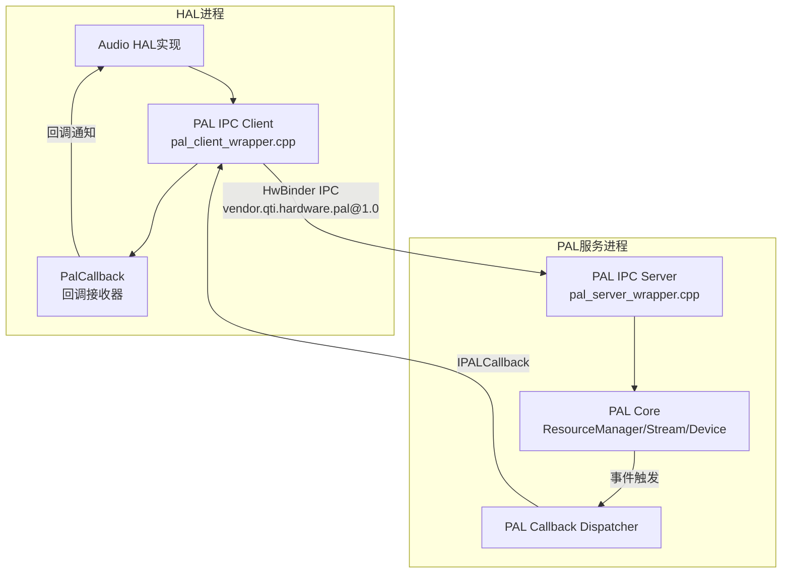
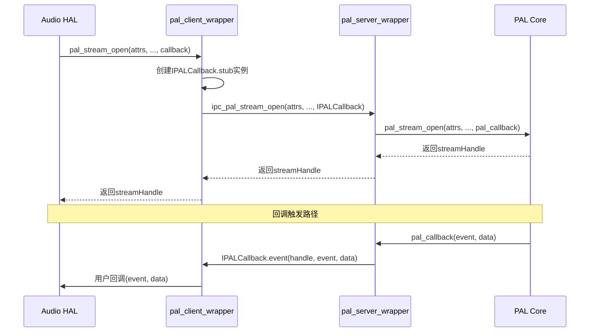
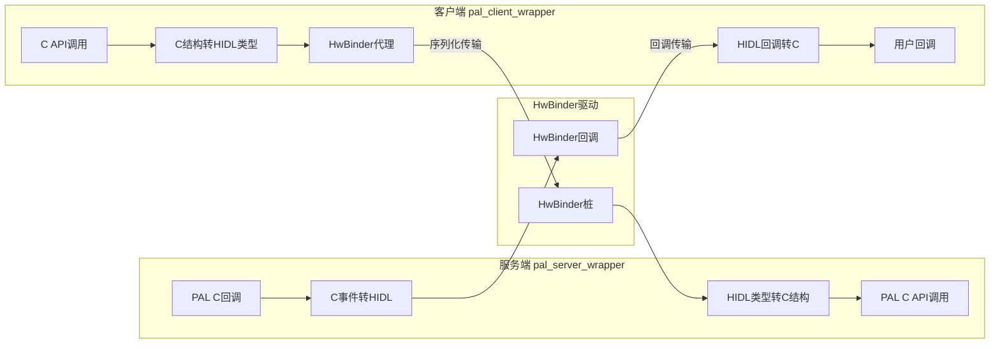
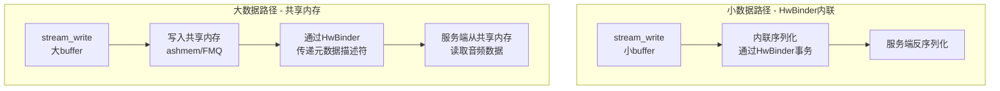
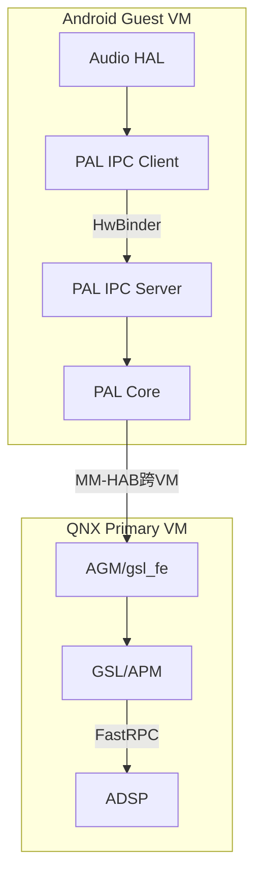

## 15.8 HIDL 接口定义

> [← 上一个](15_15.7_PayloadBuilder-载荷构建器.md) | [← 返回15章](README.md) | [返回导航](../README.md) | [下一个 →](15_15.9_配置文件列表.md)

---

## 15.8 HIDL接口定义与IPC机制

PAL通过HIDL(HAL Interface Definition Language)定义跨进程IPC接口，使Audio HAL进程与PAL服务进程之间能够通过HwBinder进行通信。这是PAL架构中实现进程隔离与安全访问的核心机制。



### 15.8.8.1 HIDL接口文件体系

PAL的HIDL接口定义位于`interfaces/`目录下，包含三个核心文件：

| 文件 | 路径 | 职责 |
|------|------|------|
| `IPAL.hal` | `interfaces/IPAL.hal` | 主接口，定义所有PAL API的IPC版本 |
| `IPALCallback.hal` | `interfaces/IPALCallback.hal` | 回调接口，PAL向HAL层传递事件通知 |
| `types.hal` | `interfaces/types.hal` | 类型定义，映射PalDefs.h中的C结构体 |

**接口包标识**：`vendor.qti.hardware.pal@1.0`

该包名在HIDL注册表中唯一标识PAL服务，客户端通过此包名发现并连接PAL服务。

### 15.8.8.2 IPAL.hal主接口方法

IPAL.hal是PAL IPC的核心接口，将PAL C API的每个函数映射为HIDL方法。方法分为四大类：

#### 生命周期管理方法

| HIDL方法 | 对应PAL C API | 参数 | 返回值 | 说明 |
|----------|--------------|------|--------|------|
| `ipc_pal_init()` | `pal_init()` | 无 | `int32_t` | 初始化PAL子系统，加载ResourceManager |
| `ipc_pal_deinit()` | `pal_deinit()` | 无 | `int32_t` | 反初始化，释放所有PAL资源 |
| `ipc_pal_stream_open()` | `pal_stream_open()` | `PalStreamAttributes, uint32_t, PalDevice[], uint32_t, IPALCallback, uint64_t` | `(int32_t, uint64_t)` | 打开音频流，返回stream handle |
| `ipc_pal_stream_close()` | `pal_stream_close()` | `uint64_t` | `int32_t` | 关闭音频流，释放流资源 |

#### 流控制方法

| HIDL方法 | 对应PAL C API | 说明 |
|----------|--------------|------|
| `ipc_pal_stream_start()` | `pal_stream_start()` | 启动音频流数据传输 |
| `ipc_pal_stream_stop()` | `pal_stream_stop()` | 停止音频流数据传输 |
| `ipc_pal_stream_pause()` | `pal_stream_pause()` | 暂停流，保持资源不释放 |
| `ipc_pal_stream_resume()` | `pal_stream_resume()` | 恢复暂停的流 |
| `ipc_pal_stream_flush()` | `pal_stream_flush()` | 刷新流缓冲区 |
| `ipc_pal_stream_drain()` | `pal_stream_drain()` | 排空流中剩余数据 |

#### 数据传输方法

| HIDL方法 | 对应PAL C API | 参数 | 说明 |
|----------|--------------|------|------|
| `ipc_pal_stream_write()` | `pal_stream_write()` | `uint64_t, uint32_t, PalBuffer` | 向流写入音频数据 |
| `ipc_pal_stream_read()` | `pal_stream_read()` | `uint64_t, uint32_t, PalBuffer` | 从流读取音频数据 |

> **数据传输优化**：大数据传输使用HwBinder共享内存(FMQ或ashmem)，避免逐字节IPC拷贝。

#### 参数与设备控制方法

| HIDL方法 | 对应PAL C API | 说明 |
|----------|--------------|------|
| `ipc_pal_stream_set_device()` | `pal_stream_set_device()` | 动态切换流的路由设备 |
| `ipc_pal_stream_get_device()` | `pal_stream_get_device()` | 获取流当前关联的设备 |
| `ipc_pal_stream_set_param()` | `pal_stream_set_param()` | 设置流级别参数(如采样率、声道) |
| `ipc_pal_stream_get_param()` | `pal_stream_get_param()` | 获取流级别参数 |
| `ipc_pal_stream_set_volume()` | `pal_stream_set_volume()` | 设置流音量 |
| `ipc_pal_stream_get_volume()` | `pal_stream_get_volume()` | 获取流音量 |
| `ipc_pal_stream_set_mute()` | `pal_stream_set_mute()` | 设置流静音状态 |
| `ipc_pal_get_param()` | `pal_get_param()` | 获取全局参数 |
| `ipc_pal_set_param()` | `pal_set_param()` | 设置全局参数 |

### 15.8.8.3 IPALCallback.hal回调接口

IPALCallback.hal定义PAL服务向客户端(HAL进程)推送事件的回调接口。客户端在`ipc_pal_stream_open()`时注册回调实例，PAL通过该实例异步通知事件。

#### 回调方法定义

| 回调方法 | 参数 | 触发场景 |
|----------|------|---------|
| `event()` | `uint64_t handle, PalEvent event, uint32_t event_data_size, vec<uint8_t> event_data` | 流事件通知：错误、 drained、EOS、SSR等 |
| `sessionId()` | `uint64_t handle, uint32_t sessionId` | 通知流的DSP session ID分配结果 |

#### PalEvent事件类型

| 事件 | 值 | 含义 |
|------|---|------|
| `PAL_EVENT_ERROR` | 0 | 流错误，需要关闭重建 |
| `PAL_EVENT_EOS` | 1 | End of Stream，数据播放完毕 |
| `PAL_EVENT_SR_CHANGE` | 2 | 采样率动态变化(如USB设备切换) |
| `PAL_EVENT_SSR` | 3 | SubSystem Restart，DSP子系统重启 |
| `PAL_EVENT_DRAIN` | 4 | Drain完成通知 |
| `PAL_EVENT_READ_DONE` | 5 | 异步读取完成 |
| `PAL_EVENT_WRITE_DONE` | 6 | 异步写入完成 |

#### 回调注册流程



### 15.8.8.4 types.hal类型定义

types.hal将PAL C API中的核心数据结构(PalDefs.h)映射为HIDL跨进程可序列化类型。

#### 核心枚举类型

| HIDL类型 | C类型 | 值域 | 说明 |
|----------|------|------|------|
| `PalStreamType` | `pal_stream_type_t` | PAL_STREAM_LOW_LATENCY ~ PAL_STREAM_MAX | 音频流类型枚举 |
| `PalStreamDirection` | `pal_stream_direction_t` | IN(0), OUT(1) | 流方向：输入/输出 |
| `PalDeviceId` | `pal_device_id_t` | PAL_DEVICE_NONE ~ PAL_DEVICE_MAX | 设备ID枚举 |
| `PalAudioFmt` | `pal_audio_fmt_t` | PCM_S16_LE ~ MAX | 音频格式枚举 |
| `PalEvent` | `pal_event_id_t` | ERROR ~ WRITE_DONE | 事件类型枚举 |

#### 核心结构体类型

| HIDL结构体 | C结构体 | 字段概述 |
|-----------|---------|---------|
| `PalStreamAttributes` | `pal_stream_attributes` | 流类型、方向、标志、媒体配置 |
| `PalDevice` | `pal_device` | 设备ID、配置(采样率/声道/位深) |
| `PalBuffer` | `pal_buffer` | 数据缓冲区指针、大小、元数据 |
| `PalChannelInfo` | `pal_channel_info` | 声道数和声道映射 |
| `PalMediaConfig` | `pal_media_config` | 采样率和位深配置 |
| `PalVolumeData` | `pal_volume_data` | 音量数据(多声道音量对) |
| `PalParamPayload` | `pal_param_payload` | 参数ID + 参数数据载荷 |

#### PalStreamAttributes结构详解

```
struct PalStreamAttributes {
    PalStreamType type;           // 流类型(LOW_LATENCY/DEEP_BUFFER/...)
    PalStreamDirection direction; // 方向(IN/OUT)
    uint32_t flags;               // 标志位(如PAL_STREAM_FLAG_MMAP)
    PalMediaConfig media_config;  // 采样率+位深
    PalAudioFmt fmt;              // 音频格式
};
```

#### PalDevice结构详解

```
struct PalDevice {
    PalDeviceId id;               // 设备ID(SPEAKER/BT_SCO/USB_HEADSET...)
    PalDeviceConfig config;       // 设备配置
};
struct PalDeviceConfig {
    PalAudioFmt fmt;              // 音频格式
    PalMediaConfig media_config;  // 采样率+位深
    PalChannelInfo ch_info;       // 声道信息
};
```

### 15.8.8.5 服务端实现：pal_server_wrapper.cpp

> 源码路径：`ipc/HwBinders/pal_ipc_server/pal_server_wrapper.cpp`

服务端实现IPAL.hal接口，将HIDL IPC调用转换为PAL C API本地调用。这是PAL IPC的服务端入口。

#### 核心类结构

```
class PAL : public IPAL {
    // 实现IPAL.hal的所有方法
    Return<int32_t> ipc_pal_init() override;
    Return<int32_t> ipc_pal_deinit() override;
    Return<void> ipc_pal_stream_open(
        const PalStreamAttributes& attrs,
        uint32_t noOfDevices,
        const hidl_vec<PalDevice>& devices,
        uint32_t noOfModifiers,
        uint32_t palStreamHandle,
        const sp<IPALCallback>& callback,
        open_cb _hidl_cb) override;
    Return<int32_t> ipc_pal_stream_close(uint64_t streamHandle) override;
    Return<int32_t> ipc_pal_stream_start(uint64_t streamHandle) override;
    // ... 其他方法
};
```

#### 关键实现逻辑

**1. stream_open实现**：
- 将HIDL `PalStreamAttributes`转换为C `pal_stream_attributes`
- 将HIDL `PalDevice[]`转换为C `pal_device[]`
- 注册`IPALCallback`到回调映射表：`callbackMap_[streamHandle] = callback`
- 调用`pal_stream_open()`，将C回调包装为IPALCallback调用
- 返回stream handle给客户端

**2. stream_write实现**：
- 从共享内存或HIDL buffer中获取音频数据
- 构造C `pal_buffer`结构
- 调用`pal_stream_write(handle, &buffer)`
- 返回写入字节数

**3. 回调分发实现**：
- PAL C回调触发时，从`callbackMap_`查找对应`IPALCallback`
- 将C事件数据序列化为HIDL `vec<uint8_t>`
- 调用`IPALCallback.event(handle, event, dataSize, data)`

### 15.8.8.6 客户端实现：pal_client_wrapper.cpp

> 源码路径：`ipc/HwBinders/pal_ipc_client/pal_client_wrapper.cpp`、`PalCallback.h`

客户端封装PAL API为HwBinder远程调用，对上层Audio HAL提供与PAL C API一致的函数签名。

#### 核心实现逻辑

**1. 服务发现与连接**：
```
// 获取PAL HIDL服务代理
pal_service_ = IPAL::getService("pal");
```

**2. API封装模式**（以stream_open为例）：
- 接收上层传入的C结构参数
- 将C `pal_stream_attributes`转换为HIDL `PalStreamAttributes`
- 将C `pal_device[]`转换为HIDL `PalDevice[]`
- 创建`PalCallback`实例包装用户回调
- 调用`pal_service_->ipc_pal_stream_open(attrs, ...)`
- 将返回的HIDL结果转换回C结构

**3. PalCallback类**：
- 继承`IPALCallback.stub`
- 在`event()`方法中，将HIDL事件数据反序列化
- 调用用户注册的C回调函数：`user_callback_(event, data)`

#### 客户端-服务端数据流转



### 15.8.8.7 IPC传输机制与性能模型

#### HwBinder传输架构

HwBinder是Android专用于HAL通信的Binder变体，运行于`/dev/hwbinder`设备节点上，与framework Binder(`/dev/binder`)隔离。

| 特性 | HwBinder | Framework Binder |
|------|----------|-----------------|
| 设备节点 | `/dev/hwbinder` | `/dev/binder` |
| 用途 | HAL进程间通信 | Framework进程间通信 |
| 稳定性要求 | 接口稳定性(跨版本) | API稳定性 |
| SELinux域 | hal_xxx域 | platform/app域 |
| 事务大小限制 | 1MB | 1MB |

#### 数据传输路径优化



**共享内存机制**：
- **ashmem**(Android Shared Memory)：用于一次性大buffer传输
- **FMQ**(Fast Message Queue)：用于持续数据流，读写端零拷贝访问同一内存
- 元数据(描述符、大小、偏移)通过HwBinder事务传递，数据本身在共享内存中

#### IPC延迟分析

| 操作 | 直接调用(同进程) | IPC模式(跨进程) | 额外开销 |
|------|----------------|----------------|---------|
| stream_open | ~2ms | ~5ms | HwBinder调度+序列化 |
| stream_start | ~1ms | ~3ms | HwBinder调度 |
| stream_write(4KB) | ~0.1ms | ~0.3ms | 序列化+共享内存映射 |
| stream_write(64KB) | ~0.5ms | ~0.8ms | FMQ元数据+零拷贝读取 |
| set_param | ~0.5ms | ~2ms | HwBinder+参数序列化 |
| callback事件 | ~0.1ms | ~0.5ms | 反向HwBinder调度 |

### 15.8.8.8 IPC模式 vs 直接调用模式

PAL支持两种调用模式，由编译配置和运行时条件决定：

| 维度 | 直接调用模式 | IPC模式 |
|------|------------|---------|
| **适用场景** | HAL与PAL同一进程 | HAL与PAL分属不同进程 |
| **调用路径** | HAL → PAL C API(函数调用) | HAL → pal_client → HwBinder → pal_server → PAL C API |
| **数据拷贝** | 零拷贝，指针传递 | 小数据序列化拷贝，大数据共享内存 |
| **延迟** | 最低，无IPC开销 | 有HwBinder调度和序列化开销 |
| **进程隔离** | 无隔离，崩溃传播 | 进程隔离，PAL崩溃不影响HAL |
| **安全边界** | 无独立安全边界 | SELinux策略控制跨进程访问 |
| **调试难度** | 单进程调试，简单 | 多进程调试，需跟踪IPC链路 |
| **内存占用** | 单进程共享地址空间 | 额外进程开销+共享内存管理 |

**模式选择逻辑**：
```
if (同一Android域 && 无进程隔离需求) {
    使用直接调用模式  // 如传统HAL架构
} else {
    使用IPC模式  // 如Passthrough HAL + 独立PAL进程
}
```

### 15.8.8.9 安全模型

#### SELinux策略

PAL IPC的跨进程通信受SELinux强制访问控制保护：

| 策略规则 | 含义 |
|----------|------|
| `allow hal_audio_default hal_pal_default:binder { call transfer }` | Audio HAL可调用PAL HIDL服务 |
| `allow hal_pal_default hal_audio_default:binder transfer` | PAL服务可向HAL发送回调 |
| `allow hal_pal_default hal_pal_default:shm { create read write }` | PAL服务可创建/访问共享内存 |

#### HwBinder权限控制

- **服务注册**：PAL服务进程需`hal_pal`域权限注册`vendor.qti.hardware.pal@1.0::IPAL/default`
- **客户端连接**：需`hal_audio`域权限查找并连接PAL服务
- **回调传递**：IPALCallback的binder对象在open时从客户端传递到服务端，服务端通过该binder反向调用客户端

#### SA8295安全考量

在SA8295平台上，PAL IPC的安全模型有特殊约束：

- **GVM内**：Audio HAL与PAL在同一Android Guest VM(GVM)内，PAL IPC使用标准HwBinder
- **跨VM**：GVM与PVM(QNX)之间的音频通信不经过PAL HIDL，而是通过AGM/gsl_fe的MM-HAB通道
- **ADSP访问**：PAL通过FastRPC访问ADSP，FastRPC通道受QNX侧SELinux/访问控制保护

### 15.8.8.10 SA8295平台PAL IPC特殊性

SA8295采用多VM架构，PAL IPC的部署和使用有其特殊模式：



**关键特征**：
1. **PAL IPC在GVM内部**：Audio HAL与PAL服务都在Android GVM内，HwBinder通信不跨VM
2. **跨VM走AGM通道**：PAL Core通过ResourceManager连接GVM侧AGM代理，AGM代理通过MM-HAB与PVM侧AGM/gsl_fe通信
3. **PAL IPC不涉及QNX**：QNX侧不参与PAL HIDL IPC，仅处理DSP交互
4. **故障隔离**：PAL进程崩溃不导致QNX侧ADSP重置，仅影响GVM内音频服务

### 15.8.8.11 HIDL到AIDL演进

Android 14+逐步从HIDL迁移到AIDL(Android Interface Definition Language)，PAL接口也面临这一演进：

| 维度 | HIDL | AIDL |
|------|------|------|
| **定义语言** | `.hal`文件 | `.aidl`文件 |
| **传输方式** | HwBinder(`/dev/hwbinder`) | Binder(`/dev/binder`) |
| **稳定性** | 接口稳定性(扩展兼容) | NDK后端稳定性 |
| **性能** | 专用于HAL，优化较好 | 通用Binder，持续优化中 |
| **工具链** | `hidl-gen` | `aidl`编译器 |
| **Android版本** | 8-13(主), 14+(兼容) | 14+(主) |
| **未来方向** | 逐步废弃 | 主推方向 |

**PAL迁移考量**：
- 短期(Android 14)：PAL仍使用HIDL，通过兼容层支持
- 中期(Android 15+)：PAL接口可能迁移到AIDL-HAL，需重写接口定义和wrapper
- 迁移影响：客户端/服务端wrapper需重写，但PAL Core内部逻辑不变

### 15.8.8.12 PAL IPC调试要点

| 调试场景 | 方法 | 命令/工具 |
|----------|------|-----------|
| 查看PAL服务状态 | hwservicemanager | `lshal | grep pal` |
| 跟踪HwBinder事务 | hwbinder调试 | `cat /sys/kernel/debug/hwbinder/proc` |
| IPC调用延迟 | systrace/perfetto | 追踪`hwbinder`标签 |
| 回调丢失 | 日志过滤 | `logcat | grep PalCallback` |
| 共享内存泄漏 | 内存分析 | `cat /proc/<pid>/maps | grep ashmem` |
| 序列化错误 | 日志+代码审查 | 检查HIDL类型与C类型对齐 |

---

> [← 上一个](15_15.7_PayloadBuilder-载荷构建器.md) | [← 返回15章](README.md) | [返回导航](../README.md) | [下一个 →](15_15.9_配置文件列表.md)