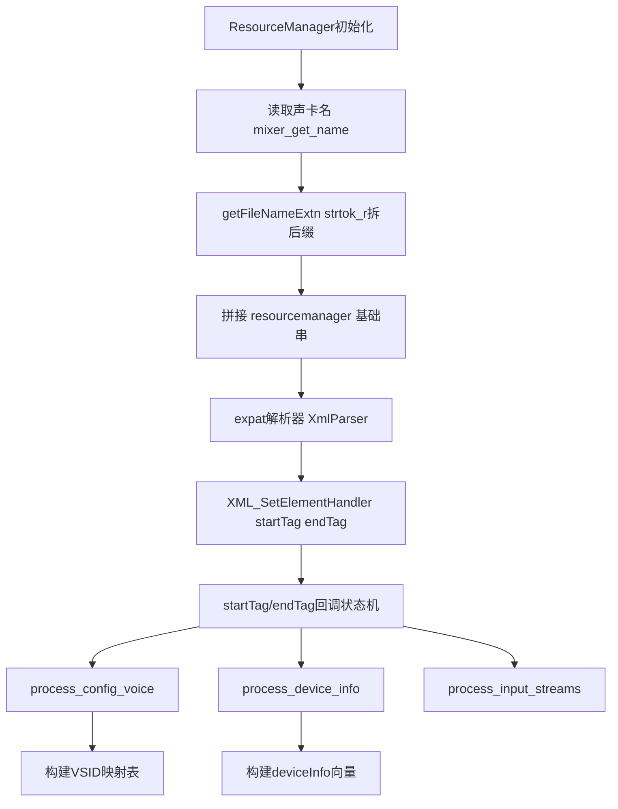
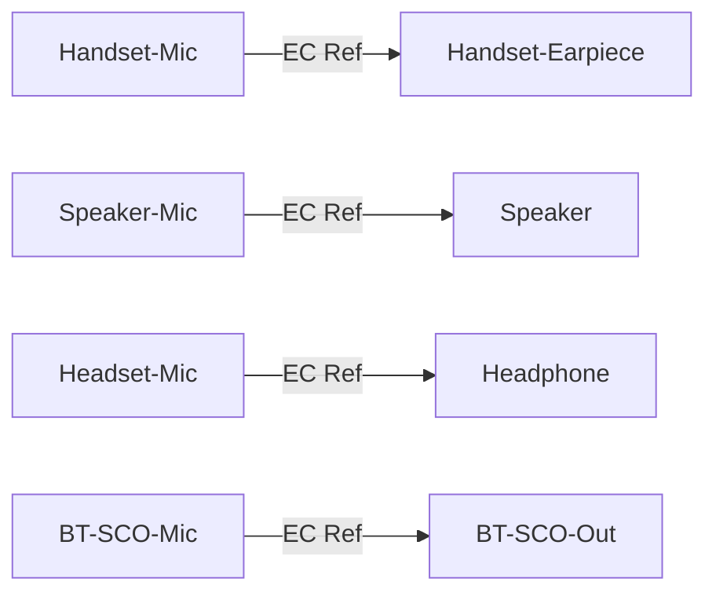
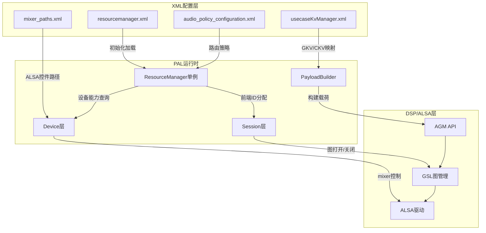

## 15.9 配置文件列表

> [← 上一个](15_15.8_HIDL_接口定义.md) | [← 返回15章](README.md) | [返回导航](../README.md) | [下一个 →](15_15.10_HAL-PAL适配层架构.md)

---

## 15.9 PAL配置文件体系

PAL（Platform Abstraction Layer）的运行行为完全由XML配置文件驱动。`resourcemanager_XXX.xml`是PAL的核心配置蓝图，ResourceManager在初始化阶段通过 **expat** 解析器加载该文件，从中提取设备能力、前端/后端ID映射、EC参考映射、通话VSID、BT编解码器、增益映射等全部运行参数。不同SoC平台使用不同的配置文件，形成**一套代码、多套配置**的平台适配模式。

> ⚠️ **源码核实（勘误）**：`ResourceManager::XmlParser()`（`resource_manager/src/ResourceManager.cpp`）使用的是 **expat**（`XML_ParserCreate` / `XML_ParseBuffer` / `XML_ParserFree` / `XML_SetElementHandler(parser, startTag, endTag)`），**不是 libxml2**。旧版所写"libxml2 解析器"为虚构。expat 是 SAX 风格流式解析，通过 `startTag()` / `endTag()` 回调 + `struct xml_userdata` 状态机逐节点处理，各子块由 `process_config_voice()` / `process_device_info()` / `process_input_streams()` 等分派函数处理。

### 15.9.9.1 配置文件总览

#### 核心配置文件 — resourcemanager_XXX.xml

| 文件名 | 平台代号 | SoC型号 | 产品代号 | 说明 |
|--------|----------|---------|----------|------|
| `resourcemanager_kona.xml` | kona | SM8250 | 骁龙865/870 | 2020旗舰平台 |
| `resourcemanager_lahaina.xml` | lahaina | SM8350 | 骁龙888 | 2021旗舰平台 |
| `resourcemanager_taro.xml` | taro | SM8450 | 骁龙8 Gen 1 | 2022旗舰平台 |
| `resourcemanager_monaco.xml` | monaco | SM7450 | 骁龙7 Gen 1 | 2022中高端平台 |
| `resourcemanager_kalama.xml` | kalama | SM8550 | 骁龙8 Gen 2 | 2023旗舰平台 |
| `resourcemanager_pineapple.xml` | pineapple | SM8650 | 骁龙8 Gen 3 | 2024旗舰平台 |
| `resourcemanager_sa8295.xml` | sa8295 | SA8295P | 车规级芯片 | 车机专用配置 |

> **平台选择逻辑**：ResourceManager 初始化时**读取声卡名（snd_card_name，经 `mixer_get_name()` 获取）**，用 `getFileNameExtn()`（`ResourceManager.cpp`）以 `strtok_r(name, "-")` 拆出扩展名后缀，拼接 `#define RMNGR_XMLFILE_BASE_STRING_NAME "resourcemanager"` 基础串生成 `rmngr_xml_file`，再调用 `ResourceManager::XmlParser(rmngr_xml_file)` 加载。
>
> ⚠️ **源码核实（勘误）**：真实实现**不存在 `getPlatformName()` 方法**，也不是"读取 SoC 信息拼接 `resourcemanager_<platform>.xml`"。真实是从**声卡名**拆取文件名扩展（`getFileNameExtn()` + `strtok_r("-")`）。声卡名匹配的平台串包括 kona / sm8150 / lahaina / waipio / diwali / bengal / monaco / sa8155 / sa6155 / **gvmauto** 等——**SA8295 车机在 GVM（Android 虚拟机）侧声卡名为 `gvmauto`，并非 "sa8295"**。下方平台文件名列表（kona/lahaina/taro/monaco/kalama/pineapple/sa8295）中的 taro/kalama/pineapple/sa8295 未在本地源码声卡匹配串中出现，属推测性列举，实际文件名以设备声卡名拆取结果为准。

#### 关联配置文件

| 文件名 | 用途 | 与PAL的关系 |
|--------|------|-------------|
| `usecaseKvManager.xml` | 用例键值管理 | 定义流类型到GKV/CKV的映射，PayloadBuilder引用 |
| `mixer_paths.xml` | ALSA mixer路径配置 | 定义ALSA控件切换路径，PAL通过audio_route引用 |
| `audio_policy_configuration.xml` | Audio Policy配置 | 定义设备路由策略、音量曲线，AudioFlinger/APS使用 |
| `audio_effects.xml` | 音效链配置 | 定义全局音效后处理链，EffectFlinger使用 |
| `media_codecs.xml` | 编解码器列表 | 定义OMX/Codec2编解码器，与PAL BT编解码器互补 |

### 15.9.9.2 配置文件加载流程



> ⚠️ **源码核实（勘误）**：真实加载入口为 `ResourceManager::XmlParser()`，用 **expat**（非 libxml2），通过 `XML_SetElementHandler(parser, startTag, endTag)` 注册 SAX 回调。子块处理由 `process_config_voice()` / `process_device_info()` / `process_input_streams()` 在 `endTag()` 中依据 `tag_name` 分派（见 `ResourceManager.cpp`）。旧版图中的 `getPlatformName`、`libxml2解析器打开`、独立 `解析config_params/bt_codecs/gain_db_to_level_mapping/group_device_cfg/policies-ec_ref/custom_config` 节点均为按推测绘制，与真实回调结构不符。

**解析阶段的关键数据结构映射：**

> ⚠️ **源码核实（勘误）**：下表右列 ResourceManager 存储成员经源码校验修正——真实静态成员为 `listAllPcmPlaybackFrontEnds` / `listAllPcmRecordFrontEnds` / `listAllCompressPlaybackFrontEnds` / `listAllBackEndIds`（`vector<pair<int32_t,string>>`）/ `deviceInfo`（`vector<deviceIn>`）/ `gainLvlMap`（`vector<pal_amp_db_and_gain_table>`，**非旧版 `gainDbToLevelMap`**）/ `btCodecMap`（`map<pair<uint32_t,string>,string>`，**非旧版 `btCodecFormat`**）。左列 XML 节点名（如 `<pcm_ids>` / `<compress_ids>` / `<backend_ids>` / `<voice_vsid>` / `<bt_codec>` / `<gain_db_to_level>` / `<concurrent_stream>`）为归纳性示意；真实 XML 标签（expat `tag_name` 比较）为 `id` / `pcm-device` / `compress-device` / `mixer` / `back_end_name` / `stream_type` / `low_power_vote_streams` / `vsid` / `config_voice` / `snd_device_name` / `channels` / `samplerate` / `bit_width` / `ec_ref` 等，节点命名以真实 XML 与 `startTag/endTag` 中的 `strcmp(tag_name, ...)` 为准。

| XML节点（示意） | 解析目标 | ResourceManager存储成员 | 用途 |
|---------|----------|------------------------|------|
| `device_profile` 类节点 | 设备能力描述 | `deviceInfo`（`vector<deviceIn>`） | 流打开时查询设备能力 |
| `pcm-device` 类节点 | PCM前端ID列表 | `listAllPcmPlaybackFrontEnds` / `listAllPcmRecordFrontEnds` | 为PCM流分配前端ID |
| `compress-device` 类节点 | Compress前端ID列表 | `listAllCompressPlaybackFrontEnds` | 为压缩流分配前端ID |
| `back_end_name` 节点 | 后端ID与名称映射 | `listAllBackEndIds` | 设备到ALSA后端的映射 |
| `ec_ref` 节点 | EC参考设备映射 | `deviceInfo` 内嵌 | AEC回声消除参考路由 |
| `stream_type` 类节点 | 流并发规则 | 强类型流列表 | 判断流并发合法性 |
| `vsid` 节点（`config_voice` 内） | 通话VSID配置 | VSID映射表 | 语音通话DSP通路选择 |
| `bt_codec` 类节点 | BT编解码器配置 | `btCodecMap` | A2DP编解码器协商 |
| `gain_db_to_level` 类节点 | 增益映射表 | `gainLvlMap` | dB值到增益级别的转换 |
| `custom_config` 类节点 | 自定义模块配置 | 按模块存储 | LPI/NPU等特殊配置 |

---

## 15.9.3 XML顶层结构详解

```mermaid
graph TB
    XML[resourcemanager.xml根节点]
    XML --> config_params[config_params 全局参数]
    XML --> bt_codecs[bt_codecs BT编解码器]
    XML --> gain_mapping[gain_db_to_level_mapping 增益映射]
    XML --> config_voice[config_voice 语音配置]
    XML --> device_profile[device_profile 设备配置]
    XML --> group_device[group_device_cfg 组合设备]
    XML --> policies[policies 策略配置]
    XML --> custom_config[custom_config 自定义配置]
    config_params --> native_audio[native_audio_mode]
    config_params --> max_sessions[max_sessions]
    config_params --> logging_level[logging_level]
    config_params --> speaker_mute[speaker_mute_on]
    bt_codecs --> bt_aac[AAC编解码器]
    bt_codecs --> bt_sbc[SBC编解码器]
    bt_codecs --> bt_ldac[LDAC编解码器]
    bt_codecs --> bt_aptx[aptX/aptX-HD]
    bt_codecs --> bt_lc3[LC3编解码器]
    config_voice --> vsid[VSID映射]
    config_voice --> mode_map[mode_map模式映射]
    device_profile --> in_dev[in-device输入设备]
    device_profile --> out_dev[out-device输出设备]
    policies --> ec_ref[ec_ref回声参考]
    policies --> lpi[LPI唤醒配置]
```



---

## 15.9.4 config_params — 全局运行参数

`<config_params>`定义PAL运行的全局控制参数，影响ResourceManager的核心行为：

```xml
<config_params>
    <param native_audio_mode="true" />
    <param max_sessions="16" />
    <param logging_level="3" />
    <param speaker_mute_on="false" />
    <param a2dp_offload_supported="true" />
    <param haptics_supported="true" />
    <param uhqa_enabled="true" />
</config_params>
```

| 参数 | 类型 | 默认值 | 说明 |
|------|------|--------|------|
| `native_audio_mode` | bool | true | 启用DSP原生音频处理模式。true=ADSP处理，false=ARM处理 |
| `max_sessions` | int | 16 | 最大并发音频会话数，限制同时活跃的Stream数量 |
| `logging_level` | int | 3 | PAL日志级别：0=无日志，1=ERROR，2=WARN，3=INFO，4=DEBUG，5=VERBOSE |
| `speaker_mute_on` | bool | false | 初始扬声器静音状态，用于开机静音保护 |
| `a2dp_offload_supported` | bool | true | A2DP Offload支持，true=DSP解码，false=Host解码 |
| `haptics_supported` | bool | true | 触觉反馈支持，控制振动马达音频通路 |
| `uhqa_enabled` | bool | true | UHQA(Ultra High Quality Audio)使能，影响24bit/192kHz支持 |

> **native_audio_mode的影响**：当设为true时，音频数据通过ADSP的GSL图处理，支持HW音效；当设为false时，音频数据在ARM侧通过TinyALSA处理，仅支持SW音效。车机平台SA8295通常设为true以利用ADSP算力。

---

## 15.9.5 bt_codecs — 蓝牙编解码器配置

`<bt_codecs>`定义A2DP和LE Audio支持的编解码器格式及方向：

```xml
<bt_codecs>
    <bt_codec codec_format="AAC" enc="true" dec="true" />
    <bt_codec codec_format="SBC" enc="true" dec="true" />
    <bt_codec codec_format="LDAC" enc="true" dec="false" />
    <bt_codec codec_format="APTX" enc="true" dec="false" />
    <bt_codec codec_format="APTX_HD" enc="true" dec="false" />
    <bt_codec codec_format="APTX_ADAPTIVE" enc="true" dec="false" />
    <bt_codec codec_format="LC3" enc="true" dec="true" />
</bt_codecs>
```

| 编解码器 | 编码enc | 解码dec | 典型码率 | 说明 |
|----------|---------|---------|----------|------|
| SBC | ✓ | ✓ | 328kbps | A2DP强制编解码器，兼容性最广 |
| AAC | ✓ | ✓ | 256-512kbps | iOS设备首选，高音质 |
| LDAC | ✓ | ✗ | 330-990kbps | Sony高解析度，仅编码侧Offload |
| aptX | ✓ | ✗ | 352kbps | Qualcomm低延迟 |
| aptX-HD | ✓ | ✗ | 576kbps | Qualcomm高解析度 |
| aptX-Adaptive | ✓ | ✗ | 动态自适应 | 自适应码率，最新一代 |
| LC3 | ✓ | ✓ | 动态 | LE Audio强制编解码器 |

> **enc/dec含义**：enc=true表示DSP可执行编码（用于A2DP Source Offload），dec=true表示DSP可执行解码（用于A2DP Sink Offload）。LDAC/aptX通常仅支持编码Offload，因为它们是Source端编解码器。

---

## 15.9.6 gain_db_to_level_mapping — 增益映射

`<gain_db_to_level_mapping>`将dB增益值映射为DSP可识别的增益级别索引，用于音量控制和AGM增益设置：

```xml
<gain_db_to_level_mapping>
    <gain_level_map level="0" db_value="-84" />
    <gain_level_map level="1" db_value="-42" />
    <gain_level_map level="2" db_value="-21" />
    <gain_level_map level="3" db_value="-10" />
    <gain_level_map level="4" db_value="0" />
</gain_level_map>
```

| 字段 | 说明 |
|------|------|
| `level` | 增益级别索引，0为最低（静音），递增到最大增益 |
| `db_value` | 对应的dB增益值，-84dB近似静音，0dB为最大无衰减 |

**映射逻辑**：当上层设置音量dB值时，ResourceManager在`gainDbToLevelMap`中查找最接近的level索引，通过PayloadBuilder构建CKV传递给DSP。

---

## 15.9.7 device_profile — 设备能力配置

`<device_profile>`是XML中最大的配置段，定义所有输入/输出设备的ALSA后端绑定和能力参数。每个设备条目包含完整的ALSA映射信息和流用例声明。

#### out-device 输出设备配置示例

```xml
<out-device>
    <device id="PAL_DEVICE_OUT_SPEAKER">
        <back_end_name>CODEC_DMA-LPAIF_RXTX-RX-0</back_end_name>
        <max_channels>2</max_channels>
        <samplerate>48000</samplerate>
        <snd_device_name>speaker</snd_device_name>
        <usecase>
            <name>PAL_STREAM_LOW_LATENCY</name>
            <priority>1</priority>
        </usecase>
        <usecase>
            <name>PAL_STREAM_DEEP_BUFFER</name>
            <priority>2</priority>
        </usecase>
        <usecase>
            <name>PAL_STREAM_COMPRESSED</name>
            <priority>3</priority>
        </usecase>
    </device>
</out-device>
```

#### in-device 输入设备配置示例

```xml
<in-device>
    <device id="PAL_DEVICE_IN_HANDSET_MIC">
        <back_end_name>CODEC_DMA-LPAIF_RXTX-TX-3</back_end_name>
        <max_channels>2</max_channels>
        <samplerate>48000</samplerate>
        <snd_device_name>handset-mic</snd_device_name>
        <sidetone_mode>SW_SIDETONE</sidetone_mode>
        <usecase>
            <name>PAL_STREAM_VOICE_CALL</name>
            <priority>1</priority>
        </usecase>
        <usecase>
            <name>PAL_STREAM_ULTRA_LOW_LATENCY</name>
            <priority>2</priority>
        </usecase>
    </device>
</in-device>
```

#### 设备配置字段详解

| 字段 | 说明 | 示例值 |
|------|------|--------|
| `id` | PAL设备ID常量，对应`pal_device_id_t`枚举 | `PAL_DEVICE_OUT_SPEAKER` |
| `back_end_name` | ALSA后端名称，标识DSP到ALSA的连接通道 | `CODEC_DMA-LPAIF_RXTX-RX-0` |
| `max_channels` | 设备支持的最大通道数 | 2（立体声）/ 1（单声道） |
| `samplerate` | 设备默认采样率 | 48000 / 96000 / 192000 |
| `snd_device_name` | ALSA声卡设备名称，对应mixer_paths中的路径 | `speaker` / `handset-mic` |
| `sidetone_mode` | 侧音模式（仅输入设备） | `SW_SIDETONE` / `HW_SIDETONE` / `DEFAULT_SIDETONE` |

#### usecase 流用例声明

每个设备通过`<usecase>`子节点声明支持的流类型和优先级：

| 字段 | 说明 |
|------|------|
| `name` | 流类型名称，对应`pal_stream_type_t`枚举 |
| `priority` | 优先级，数值越小优先级越高。同设备多流竞争时按优先级仲裁 |

**常见流类型与典型设备绑定：**

| 流类型 | 典型输出设备 | 典型输入设备 | 说明 |
|--------|-------------|-------------|------|
| `PAL_STREAM_LOW_LATENCY` | Speaker/Headphone | Handset-Mic | 系统音效、按键音 |
| `PAL_STREAM_DEEP_BUFFER` | Speaker/Headphone | — | 音乐播放 |
| `PAL_STREAM_COMPRESSED` | Speaker/Headphone | — | 压缩音频Offload |
| `PAL_STREAM_VOICE_CALL` | Earpiece/Speaker | Handset-Mic | 语音通话 |
| `PAL_STREAM_VOIP` | Speaker/Headphone | Handset-Mic | VoIP通话 |
| `PAL_STREAM_PCM_OFFLOAD` | Speaker/Headphone | — | PCM Offload |
| `PAL_STREAM_ULTRA_LOW_LATENCY` | — | Handset-Mic | 超低延迟录音 |
| `PAL_STREAM_PROXY` | Proxy-Out | Proxy-In | 音频代理 |

#### back_end_name后端命名规则

ALSA后端名称遵循统一命名规范，格式为`<TYPE>-<INTERFACE>-<DIR>-<INDEX>`：

| 后端类型 | 格式 | 说明 |
|----------|------|------|
| CODEC_DMA | `CODEC_DMA-LPAIF_RXTX-RX-0` | Codec DMA通道，最常用 |
| SLIMBUS | `SLIMBUS-0-RX-0` | SLIMBus接口 |
| TDM | `TDM-LPAIF-RX-0` | TDM接口，车机多用 |
| AUXPCM | `AUXPCM-RX-0` | AUX PCM接口 |
| USB_AUDIO | `USB_AUDIO-RX-0` | USB音频设备 |

> **车机平台SA8295特点**：SA8295使用TDM后端连接外部DSP/Amplifier，`back_end_name`通常为`TDM-LPAIF-RX-0`格式，支持多通道（4ch/6ch/8ch）输出到不同扬声器区域。

---

## 15.9.8 config_voice — 语音通话配置

`<config_voice>`定义语音通话的VSID（Voice Session ID）和通话模式映射，控制DSP语音通路选择：

```xml
<config_voice>
    <vsid>
        <vsid_value id="0x10DC0000" name="CS_VSID" />
        <vsid_value id="0x11DC0000" name="IMS_VSID" />
        <vsid_value id="0x12DC0000" name="VOIP_VSID" />
    </vsid>
    <mode_map>
        <mode id="0x10DC0000" name="CS" />
        <mode id="0x11DC0000" name="IMS" />
        <mode id="0x12DC0000" name="VOIP" />
    </mode_map>
</config_voice>
```

#### VSID类型与用途

| VSID类型 | 十六进制ID | 说明 | 典型场景 |
|----------|-----------|------|----------|
| CS_VSID | 0x10DC0000 | 电路交换语音 | 传统2G/3G通话 |
| IMS_VSID | 0x11DC0000 | IMS语音 | VoLTE/VoWiFi |
| VOIP_VSID | 0x12DC0000 | VoIP语音 | 第三方VoIP应用 |

**VSID选择流程**：通话流打开时，ResourceManager根据`pal_stream_type_t`和通话模式（通过`pal_param_id_voice_call_state`获取）选择对应VSID，配置到SessionAlsaVoice中，再通过AGM设置到DSP语音图。

---

## 15.9.9 policies/ec_ref — EC回声参考配置

`<policies>`中的`<ec_ref>`定义每个输入设备的回声消除（AEC）参考输出设备映射，是语音通话和语音识别中AEC功能的关键配置：

```xml
<policies>
    <ec_ref>
        <device id="PAL_DEVICE_IN_HANDSET_MIC">
            <rx_device id="PAL_DEVICE_OUT_HANDSET" />
        </device>
        <device id="PAL_DEVICE_IN_SPEAKER_MIC">
            <rx_device id="PAL_DEVICE_OUT_SPEAKER" />
        </device>
        <device id="PAL_DEVICE_IN_HEADSET_MIC">
            <rx_device id="PAL_DEVICE_OUT_HEADPHONE" />
        </device>
        <device id="PAL_DEVICE_IN_BLUETOOTH_SCO_HEADSET">
            <rx_device id="PAL_DEVICE_OUT_BLUETOOTH_SCO" />
        </device>
    </ec_ref>
</policies>
```

#### EC参考映射逻辑



**映射含义**：
- **TX设备**（输入）：采集近端语音+远端回声的麦克风
- **RX设备**（输出）：播放远端语音的扬声器/耳机
- **EC Ref**：AEC模块需要RX播放信号作为参考，从TX信号中消除回声分量

> **车机EC配置注意**：车机多区域场景下，每个区域的麦克风需要映射到对应区域的扬声器作为EC参考。若映射错误，AEC会消除错误区域的回声或无法消除。

---

## 15.9.10 group_device_cfg — 组合设备配置

`<group_device_cfg>`定义可以同时激活的设备组合，用于实现多设备并发输出场景：

```xml
<group_device_cfg>
    <group_device name="speaker-and-headphone">
        <device id="PAL_DEVICE_OUT_SPEAKER" />
        <device id="PAL_DEVICE_OUT_HEADPHONE" />
        <snd_device_name>speaker-and-headphone</snd_device_name>
    </group_device>
    <group_device name="speaker-and-bt">
        <device id="PAL_DEVICE_OUT_SPEAKER" />
        <device id="PAL_DEVICE_OUT_BLUETOOTH_A2DP" />
        <snd_device_name>speaker-and-bt-a2dp</snd_device_name>
    </group_device>
    <group_device name="dual-speaker">
        <device id="PAL_DEVICE_OUT_SPEAKER" />
        <snd_device_name>speaker-safe</snd_device_name>
    </group_device>
</group_device_cfg>
```

| 字段 | 说明 |
|------|------|
| `name` | 组合设备名称，标识设备组合类型 |
| `device id` | 组合中的成员设备PAL ID |
| `snd_device_name` | 组合设备的ALSA声卡设备名称，对应mixer_paths中的混合路径 |

**常见组合设备场景：**

| 组合名称 | 场景 | 说明 |
|----------|------|------|
| speaker-and-headphone | 插耳机同时外放 | 铃声响铃场景 |
| speaker-and-bt | BT+外放 | BT连接时铃声提醒 |
| dual-speaker | 双扬声器 | 立体声扬声器模式 |
| speaker-safe | 安全扬声器 | 仅主扬声器工作 |

---

## 15.9.11 custom_config — 自定义模块配置

`<custom_config>`为特定功能模块提供扩展配置，如LPI（Low Power Island）唤醒、NPU语音检测等：

```xml
<custom_config>
    <lpi>
        <param enable_lpi="true" />
        <param lpi_enable_channels="1" />
    </lpi>
    <npu>
        <param enable_npu="false" />
    </npu>
    <sensor>
        <param enable_sensor="true" />
        <param provider_library="libsensorndkportable.so" />
    </sensor>
</custom_config>
```

| 模块 | 参数 | 说明 |
|------|------|------|
| LPI | `enable_lpi` | 低功耗岛唤醒，ADSP在CPU休眠时独立检测关键词 |
| LPI | `lpi_enable_channels` | LPI模式使用的麦克风通道数 |
| NPU | `enable_npu` | NPU辅助语音检测（部分平台支持） |
| Sensor | `enable_sensor` | 传感器融合唤醒（如抬手亮屏） |
| Sensor | `provider_library` | 传感器Provider共享库路径 |

---

## 15.9.12 配置文件与PAL运行时的交互



### 配置查询关键路径

| 运行时操作 | 查询的配置数据 | 来源 |
|-----------|---------------|------|
| Stream::open | 设备能力、前端ID池 | `deviceInfo`、`listAllPcm*FrontEnds` |
| Stream::setDevice | 后端名称、snd_device_name | `listAllBackEndIds`、`deviceInfo` |
| Stream::setVolume | 增益级别映射 | `gainDbToLevelMap` |
| 语音通话打开 | VSID映射 | `voiceVSID` |
| AEC参考设置 | EC参考映射 | `deviceInfo`内嵌ec_ref |
| BT编解码器切换 | 编解码器格式列表 | `btCodecFormat` |
| 并发流判断 | 并发流规则 | `concurrentStreamInfo` |
| mixer路径切换 | snd_device_name | `mixer_paths.xml` |

---

## 15.9.13 平台配置差异要点

不同SoC平台的XML配置存在显著差异，主要体现在以下方面：

| 差异项 | 手机平台(kona/lahaina/taro) | 车机平台(SA8295) |
|--------|---------------------------|-----------------|
| 后端类型 | CODEC_DMA为主 | TDM为主 |
| 输出通道数 | 2ch（立体声） | 4ch/6ch/8ch（多区域） |
| 采样率 | 48kHz为主 | 48kHz为主，部分96kHz |
| EC参考 | 简单1对1映射 | 多区域多对多映射 |
| 组合设备 | speaker+headphone | 多区域并发输出 |
| 语音VSID | CS+IMS+VOIP | CS+IMS为主 |
| LPI唤醒 | 支持 | 通常禁用（车机常电） |
| BT Offload | A2DP Offload | A2DP Offload + SCO |

> **SA8295车机配置特殊点**：
> 1. 使用TDM后端连接外部DSP/Amp，需要配置TDM slot格式和时钟
> 2. 多音频区域需要独立的device_profile和EC参考映射
> 3. 车机不休眠，LPI唤醒通常禁用
> 4. 需要支持多路并发语音通话（主驾+副驾）

---

## 15.9.14 配置调试与验证

### 常用调试方法

| 方法 | 命令/操作 | 说明 |
|------|----------|------|
| 查看当前平台 | `adb shell getprop ro.board.platform` | 确认加载哪个XML |
| 查看PAL日志 | `adb logcat -s PAL:V` | 需logging_level≥4 |
| 查看设备列表 | `adb shell cat /proc/asound/cards` | 验证ALSA声卡 |
| 查看PCM设备 | `adb shell cat /proc/asound/pcm` | 验证前端ID分配 |
| 查看mixer控件 | `adb shell tinymix -D 0` | 验证mixer_paths配置 |
| dump音频路由 | `adb shell dumpsys audio` | 查看AudioFlinger路由状态 |

### 配置错误常见表现

| 错误类型 | 症状 | 排查方向 |
|----------|------|----------|
| back_end_name错误 | 流打开失败，无声音 | 检查ALSA后端是否存在于/proc/asound |
| snd_device_name错误 | mixer路径切换失败 | 对比mixer_paths.xml中的path名 |
| EC参考缺失 | AEC不工作，通话有回声 | 检查ec_ref映射是否完整 |
| VSID错误 | 语音通话无声音 | 检查VSID值与modem是否匹配 |
| 前端ID耗尽 | 新流无法打开 | 检查max_sessions和pcm_ids范围 |
| BT编解码器缺失 | A2DP连接后无声 | 检查bt_codecs是否包含协商格式 |

---

[← 上一个](15_15.8_HIDL_接口定义.md) | [← 返回15章](README.md) | [返回导航](../README.md) | [下一个 →](15_15.10_HAL-PAL适配层架构.md)