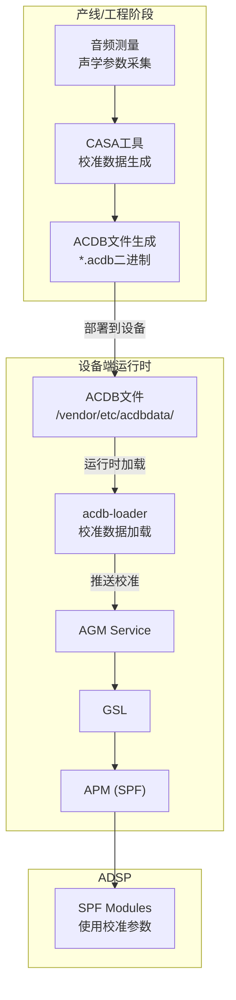
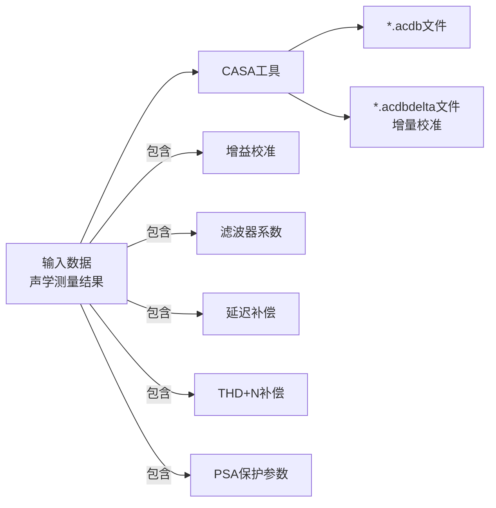
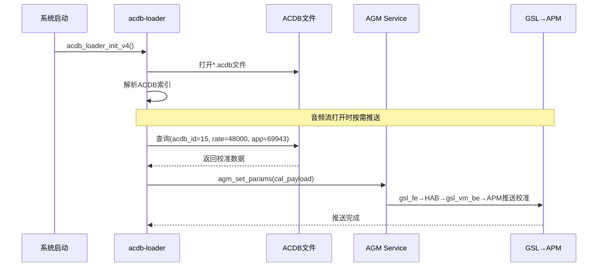

## 15.16 QC CASA：校准配置与数据管理工具

> [← 上一个](15_15.1_QC_CAPIv2_编解码接口.md) | [返回目录](README.md) | [下一个 →](15_17.1_QC_Sound_Trigger_HAL.md)

---

## 18.1 模块概述

CASA (Calibration and System Audio) 是 Qualcomm 平台的音频校准数据管理工具集，负责生成、管理和分发 ACDB (Audio Calibration Database) 校准数据文件。CASA 提供了一整套工具链，使音频工程师能够在产线校准阶段采集音频参数、生成 ACDB 二进制文件，并最终部署到设备上供运行时使用。

在 AudioReach 架构中，CASA 生成的 ACDB 文件由 `acdb-loader` 在运行时加载，并通过 AGM→GSL→APM 路径推送到 ADSP，确保 SPF 音频图中的各模块使用正确的校准参数。

> **源码路径**：`vendor/qcom/proprietary/mm-audio/casa/`
>
> **子目录**：
> - `acdbdata/` — ACDB 校准数据文件存储目录
> - 工具集 — ACDB 文件生成和管理工具

## 18.2 架构定位



## 18.3 CASA 核心功能

### 15.16.3.1 ACDB 文件生成

CASA 工具链的核心功能是将音频测量数据转换为 ACDB 二进制数据库文件：



### 15.16.3.2 ACDB 数据结构

ACDB 文件内部按层次结构组织校准数据：

```c
// ACDB 数据查询键值
struct acdb_key {
    uint32_t acdb_id;       // 设备ID（如15=Speaker, 14=Headphone）
    uint32_t sample_rate;   // 采样率
    uint32_t app_type;      // 应用类型（如69943=DeepBuffer, 69938=Compress）
};

// ACDB 校准数据条目
struct acdb_entry {
    uint32_t module_id;     // DSP模块ID（如MODULE_ID_MBDRC）
    uint32_t param_id;      // 参数ID（如PARAM_ID_MBDRC_GAIN）
    uint32_t data_size;     // 校准数据大小
    void    *data;          // 校准数据（滤波器系数、增益表等）
};
```

### 15.16.3.3 ACDB ID 映射

ACDB ID 是校准数据的核心索引，每个音频设备对应唯一的 ACDB ID：

| ACDB ID | 设备 | 说明 |
|---------|------|------|
| 14 | Headphone | 耳机 |
| 15 | Speaker | 扬声器 |
| 26 | Handset | 听筒 |
| 42 | Speaker + Headphone | 双输出 |
| 65 | BT A2DP | 蓝牙A2DP |
| 67 | USB Headset | USB耳机 |
| 3 | Handset Mic | 听筒麦克风 |
| 4 | Speaker Mic | 扬声器麦克风 |
| 7 | Headset Mic | 耳机麦克风 |

## 18.4 acdbdata 目录结构

`casa/acdbdata/` 目录存放平台相关的 ACDB 校准数据文件：

```
acdbdata/
├── MTP/                          # MTP参考设计
│   ├── MTP_Bluetooth_cal.acdb
│   ├── MTP_General_cal.acdb
│   ├── MTP_Global_cal.acdb
│   ├── MTP_Handset_cal.acdb
│   ├── MTP_Hdmi_cal.acdb
│   ├── MTP_Headset_cal.acdb
│   ├── MTP_Speaker_cal.acdb
│   └── MTP_WorkspaceFile.qwsp
├── QRD/                          # QRD参考设计
│   └── ...
├── IDP/                          # IDP参考设计
│   └── ...
└── SA8295/                       # SA8295车载平台
    ├── SA8295_Speaker_cal.acdb
    ├── SA8295_Mic_cal.acdb
    ├── SA8295_Bluetooth_cal.acdb
    └── SA8295_General_cal.acdb
```

### 15.16.4.1 ACDB 文件分类

| 文件 | 用途 | 推送目标 |
|------|------|----------|
| `*_General_cal.acdb` | 通用校准（AFE端口配置） | AFE/COPP |
| `*_Speaker_cal.acdb` | 扬声器校准（SPK保护、增益） | ADSP Module |
| `*_Handset_cal.acdb` | 听筒校准 | ADSP Module |
| `*_Headset_cal.acdb` | 耳机校准 | ADSP Module |
| `*_Bluetooth_cal.acdb` | 蓝牙校准 | ADSP Module |
| `*_Hdmi_cal.acdb` | HDMI校准 | ADSP Module |
| `*_Global_cal.acdb` | 全局校准（通用参数） | APM |

## 18.5 CASA 与 auto-casa-xml 的关系

在 SA8295 平台上，存在两个容易混淆的概念：

| 概念 | 路径 | 功能 | 作用阶段 |
|------|------|------|----------|
| **CASA** | `vendor/qcom/proprietary/mm-audio/casa/` | ACDB文件生成工具 | 产线/工程 |
| **auto-casa-xml** | `vendor/qcom/opensource/audio-hal-ar/primary-hal/auto-casa-xml/` | PAL资源配置XML | 运行时 |

- **CASA**：离线工具，生成 `.acdb` 校准二进制文件
- **auto-casa-xml**：运行时配置，定义 PAL 的流/设备/编解码器映射关系（参见[N.9 auto-casa-xml配置](../16_Vendor_QNX_Architecture/16_9.1_auto-casa-xml配置.md)）

## 18.6 与 ACDB 运行时加载的交互

### 15.16.6.1 ACDB 加载流程



### 15.16.6.2 CASA → ACDB → ADSP 数据流

```
CASA工具(产线) → *.acdb文件(部署) → acdb-loader(运行时) → AGM → gsl_fe → MM-HAB → gsl_vm_be → APM → SPF Module
```

## 18.7 SA8295 双域 ACDB 部署

在 SA8295 虚拟化架构下，ACDB 文件需要分别部署到两个域：

| 域 | ACDB 文件位置 | 用途 |
|----|-------------|------|
| Android (GVM) | `/vendor/etc/acdbdata/` | Android 音频流校准 |
| QNX (PVM) | QNX fs上的ACDB路径 | QNX 域音频校准 |

详细的双域 ACDB 共享机制参见 [N.7 ACDB校准数据（Android与QNX双域共享）](../16_Vendor_QNX_Architecture/16_7.1_ACDB校准数据Android与QNX双域共享.md)。

## 18.8 调试参考

```bash
# 检查ACDB文件是否部署
ls -la /vendor/etc/acdbdata/*.acdb

# 检查ACDB文件大小（非空）
du -h /vendor/etc/acdbdata/*.acdb

# 查看acdb-loader初始化日志
logcat -s acdb_loader ACDB

# 检查校准推送是否成功
logcat -s AGM GSL

# 手动触发校准推送（调试用）
# 通过PAL debug接口触发
```