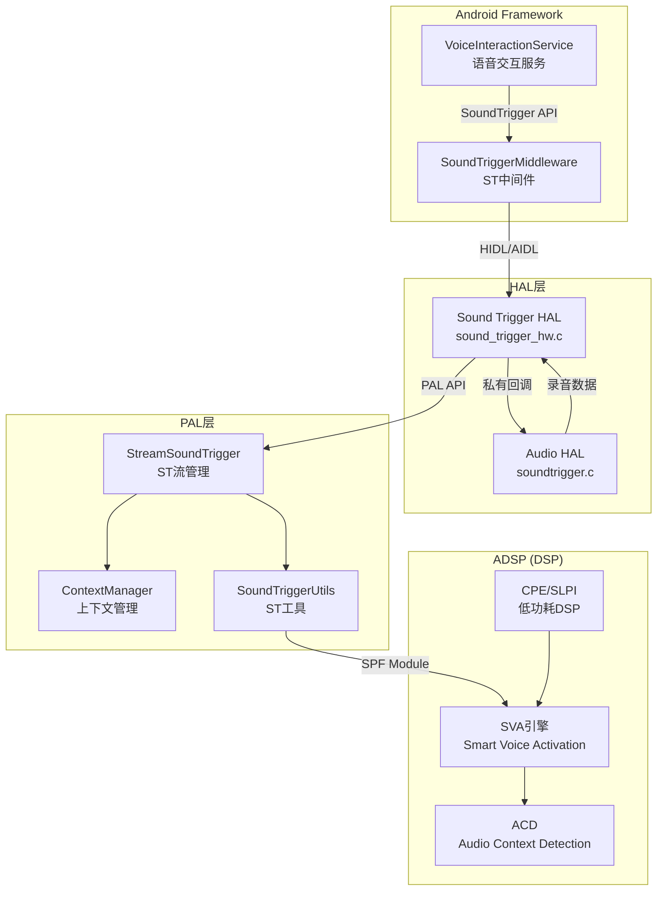
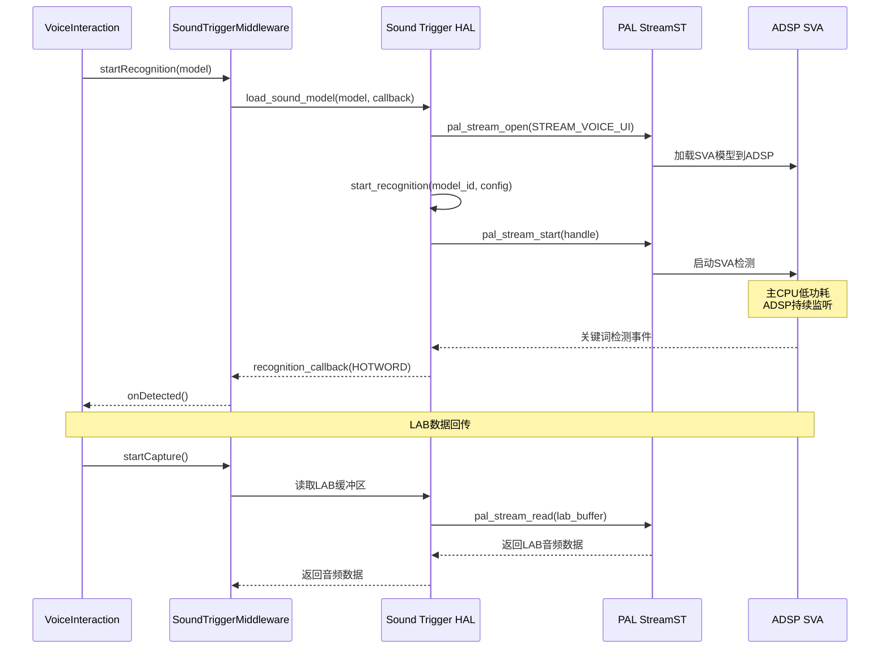

## 15.17 QC Sound Trigger HAL：语音触发HAL实现

> [← 上一个](15_16.1_QC_CASA_校准配置工具.md) | [返回目录](README.md) | [下一个 →](15_99.1_附录_Stream-Session-Device映射关系.md)

---

## 19.1 模块概述

Sound Trigger HAL 是 Qualcomm 平台的语音触发硬件抽象层实现，提供基于 DSP 的离线语音关键词检测（Key Phrase Detection）功能。该模块实现了 Android SoundTrigger HAL 接口，使得 Android Framework 的 SoundTriggerMiddleware 可以通过标准 HAL 接口加载语音模型、启动/停止识别，而实际的语音检测运算由 ADSP 上的 SVA (Smart Voice Activation) 引擎完成，主 CPU 处于低功耗状态。

在车载场景中，Sound Trigger HAL 用于实现"你好，XX"等语音唤醒功能，确保在车辆熄火待机状态下也能通过语音激活系统，同时最小化功耗。

> **源码路径**：`vendor/qcom/opensource/audio-hal/st-hal/`
>
> **关键文件**：
> - `sound_trigger_hw.c` — SoundTrigger HAL 核心实现
> - `sound_trigger_hw.h` — 内部数据结构和宏定义
> - `sound_trigger_platform.c/h` — 平台相关配置
> - `ListenSoundModelLib.h` — DSP 语音模型库接口
> - `sound_trigger_prop_intf.h` — AHAL-STHAL 私有接口

## 19.2 架构定位



## 19.3 核心 HAL 接口

### 15.17.3.1 sound_trigger_hw_device_t

Sound Trigger HAL 实现了 Android 标准的 `sound_trigger_hw_device_t` 接口：

```c
struct sound_trigger_hw_device {
    struct hw_device_t common;

    /**
     * get_properties() — 获取ST硬件属性
     * @dev:     HAL设备指针
     * @props:   输出属性结构
     */
    int (*get_properties)(const struct sound_trigger_hw_device *dev,
                          struct sound_trigger_properties *props);

    /**
     * load_sound_model() — 加载语音模型
     * @dev:       HAL设备指针
     * @model:     语音模型数据
     * @callback:  识别结果回调
     * @cookie:    回调上下文
     * @model_id:  输出模型ID
     */
    int (*load_sound_model)(const struct sound_trigger_hw_device *dev,
                            struct sound_trigger_sound_model *model,
                            sound_model_callback_t callback,
                            void *cookie,
                            sound_model_handle_t *model_id);

    /**
     * unload_sound_model() — 卸载语音模型
     */
    int (*unload_sound_model)(const struct sound_trigger_hw_device *dev,
                              sound_model_handle_t model_id);

    /**
     * start_recognition() — 启动识别
     * @dev:       HAL设备指针
     * @model_id:  模型ID
     * @config:    识别配置
     * @callback:  事件回调
     * @cookie:    回调上下文
     */
    int (*start_recognition)(const struct sound_trigger_hw_device *dev,
                             sound_model_handle_t model_id,
                             const struct sound_trigger_recognition_config *config,
                             recognition_callback_t callback,
                             void *cookie);

    /**
     * stop_recognition() — 停止识别
     */
    int (*stop_recognition)(const struct sound_trigger_hw_device *dev,
                            sound_model_handle_t model_id);

    /**
     * stop_all_recognitions() — 停止所有识别
     */
    int (*stop_all_recognitions)(const struct sound_trigger_hw_device *dev);
};
```

### 15.17.3.2 语音模型类型

```c
// 关键词语音模型
struct sound_trigger_phrase_sound_model {
    struct sound_trigger_sound_model common;
    unsigned int num_phrases;           // 关键短语数量
    struct sound_trigger_phrase *phrases; // 关键短语数组
};

// 通用语音模型（Vendor自定义）
struct sound_trigger_sound_model {
    sound_model_handle_t handle;        // 模型句柄
    unsigned int type;                   // 模型类型
    unsigned int vendor_uuid;           // Vendor UUID
    unsigned int data_size;             // 模型数据大小
    unsigned int data_offset;           // 模型数据偏移
};
```

## 19.4 AHAL-STHAL 私有接口

Audio HAL 和 Sound Trigger HAL 之间存在私有接口（`sound_trigger_prop_intf.h`），用于协调录音和语音检测的交互：

### 15.17.4.1 私有接口定义

```c
// AHAL → STHAL 回调类型
typedef enum {
    ST_EVENT_SESSION_REGISTER,          // 会话注册
    ST_EVENT_SESSION_DEREGISTER         // 会话注销
} sound_trigger_event_type_t;

// Audio HAL → STHAL 事件类型
typedef enum {
    AUDIO_EVENT_CAPTURE_DEVICE_INACTIVE,    // 录音设备不活跃
    AUDIO_EVENT_CAPTURE_DEVICE_ACTIVE,      // 录音设备活跃
    AUDIO_EVENT_PLAYBACK_STREAM_INACTIVE,   // 播放流不活跃
    AUDIO_EVENT_PLAYBACK_STREAM_ACTIVE,     // 播放流活跃
    AUDIO_EVENT_STOP_LAB,                   // 停止LAB
    AUDIO_EVENT_SSR,                        // 子系统重启
    AUDIO_EVENT_NUM_ST_SESSIONS,            // ST会话数查询
    AUDIO_EVENT_READ_SAMPLES,               // 读取采样数据
    AUDIO_EVENT_DEVICE_CONNECT,             // 设备连接
    AUDIO_EVENT_DEVICE_DISCONNECT,          // 设备断开
    AUDIO_EVENT_SVA_EXEC_MODE,              // SVA执行模式
} audio_event_type_t;

// STHAL → AHAL 回调函数
typedef int (*sound_trigger_hw_call_back_t)(audio_event_type_t,
                                            struct audio_event_info*);
```

### 15.17.4.2 会话信息

```c
struct sound_trigger_session_info {
    void *p_ses;           // 不透明ST会话指针
    int capture_handle;    // 录音流句柄
    struct pcm *pcm;       // ALSA PCM指针
    struct pcm_config config; // PCM配置
};
```

## 19.5 SoundTrigger 平台配置

### 15.17.5.1 sound_trigger_platform.c/h

平台配置文件定义了 SVA 引擎和模型相关的平台参数：

```c
struct sound_trigger_platform_info {
    // SVA 执行模式
    // 0 = CPE模式(低功耗DSP)
    // 1 = ADSP模式(主DSP)
    int sva_exec_mode;

    // 支持的语音模型数量
    int max_sound_models;

    // 支持的关键短语数量
    int max_key_phrases;

    // 支持的用户数量
    int max_users;

    // LAB (Look-Ahead Buffer) 配置
    bool lab_enable;
    uint32_t lab_buffer_duration_ms;

    // ACD (Audio Context Detection) 配置
    bool acd_enable;
};
```

### 15.17.5.2 ListenSoundModelLib 接口

`ListenSoundModelLib.h` 定义了与 DSP 语音模型库的交互接口：

```c
// 语音模型库操作
int listen_sound_model_load(uint32_t model_id,
                            const void *model_data,
                            size_t model_size);

int listen_sound_model_unload(uint32_t model_id);

int listen_sound_model_start(uint32_t model_id,
                             const struct sound_trigger_recognition_config *config);

int listen_sound_model_stop(uint32_t model_id);

int listen_sound_model_get_param(uint32_t model_id,
                                 uint32_t param_id,
                                 void *param_data,
                                 size_t *param_size);

int listen_sound_model_set_param(uint32_t model_id,
                                 uint32_t param_id,
                                 const void *param_data,
                                 size_t param_size);
```

## 19.6 语音唤醒工作流程

### 15.17.6.1 完整识别流程



### 15.17.6.2 SVA 执行模式

| 模式 | 执行DSP | 功耗 | 延迟 | 适用场景 |
|------|---------|------|------|----------|
| CPE模式 | CPE/SLPI (低功耗DSP) | 极低 | 较高 | 待机语音唤醒 |
| ADSP模式 | ADSP (主DSP) | 中等 | 较低 | 充电/活跃状态唤醒 |

在 SA8295 车载平台上，由于 ADSP 始终处于活跃状态，通常使用 ADSP 模式运行 SVA。

## 19.7 与上下游模块的交互

### 15.17.7.1 上游：Android Framework

- `VoiceInteractionService` 通过 `SoundTriggerManager` 发起语音识别请求
- `SoundTriggerMiddleware` 通过 HIDL/AIDL 调用 Sound Trigger HAL
- 识别结果通过 `recognition_callback` 回调通知 Framework

### 15.17.7.2 下游：PAL

Sound Trigger HAL 通过 PAL API 管理 ST 流：

| STHAL 操作 | PAL API | 说明 |
|-----------|---------|------|
| 加载模型 | `pal_stream_open(STREAM_VOICE_UI)` | 创建ST流 |
| 启动识别 | `pal_stream_start()` | 启动SVA检测 |
| 读取LAB | `pal_stream_read()` | 读取Look-Ahead Buffer |
| 停止识别 | `pal_stream_stop()` | 停止SVA检测 |
| 卸载模型 | `pal_stream_close()` | 关闭ST流 |
| 设置参数 | `pal_stream_set_param()` | 配置SVA参数 |

### 15.17.7.3 横向：Audio HAL

Audio HAL 的 `soundtrigger.c` 扩展模块与 STHAL 通过私有接口交互：

- **录音协调**：当 STHAL 检测到关键词后，Audio HAL 需要提供 LAB 缓冲区的录音数据
- **并发管理**：当有其他录音流活跃时，通知 STHAL 避免冲突
- **SSR 通知**：ADSP 重启事件需要通知 STHAL 重新加载模型

## 19.8 PAL 中的 SoundTrigger 相关组件

PAL 内部有专门的 ST 管理组件（详见[第13节](15_11.1_编解码器插件_pluginscodecs.md)的 Utils 和 ContextManager 部分）：

| 组件 | 源码路径 | 功能 |
|------|----------|------|
| `StreamSoundTrigger` | `pal/stream/src/StreamSoundTrigger.cpp` | ST流管理 |
| `SessionStGsl` | `pal/session/src/SessionStGsl.cpp` | ST GSL会话 |
| `ContextManager` | `pal/context_manager/` | 上下文管理（ACD/SVA） |
| `SoundTriggerPlatformInfo` | `pal/utils/` | ST平台信息配置 |
| `ACDPlatformInfo` | `pal/utils/` | ACD平台信息配置 |
| `SoundTriggerUtils` | `pal/utils/` | ST工具函数 |

## 19.9 调试参考

```bash
# 查看SoundTrigger HAL日志
logcat -s sound_trigger SoundTriggerHAL

# 查看PAL ST流日志
logcat -s PAL StreamSoundTrigger

# 查看SVA引擎状态
logcat -s SVA ACD

# 检查ST HAL库
ls -la /vendor/lib*/hw/sound_trigger.primary.*

# 查看语音模型加载状态
dumpsys audio | grep -i "sound trigger"

# 检查ADSP SVA模块
logcat -s APM GSL | grep -i sva
```