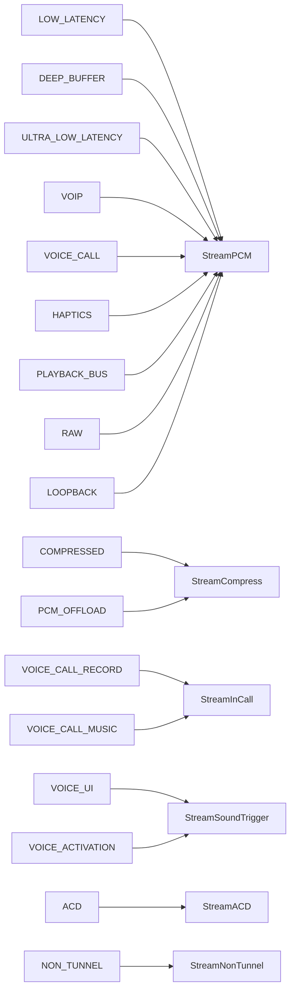
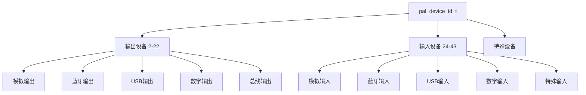
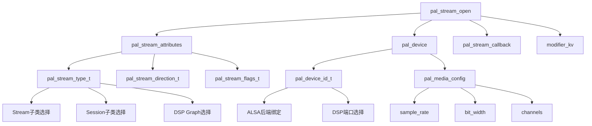

## 15.4 流类型与核心枚举体系 (pal_stream_type_t / pal_device_id_t)

> [← 上一个](15_3.1_API_分类总览.md) | [← 返回15章](README.md) | [返回导航](../README.md) | [下一个 →](15_5.1_核心类层次图-Stream-Device-Session.md)

---

PAL（Platform Abstraction Layer）的流类型、设备类型、音频格式和流方向枚举，是PAL Stream/Session/Device三层架构的基础定义。本章深度解析这些枚举的分组语义、结构体字段、映射关系和DSP路径关联。

## 15.4.1 流类型枚举体系总览

PAL 定义 27 种流类型（`pal_stream_type_t`），覆盖从超低延迟播放到语音触发的全部音频场景。每种流类型决定了：
- **Stream子类**：`Stream::create()` 工厂方法根据类型创建对应子类
- **Session子类**：`Session::makeSession()` 创建匹配的会话管理器
- **DSP Graph**：通过GKV/CKV选择对应的DSP处理图

```mermaid
graph TB
    PST[pal_stream_type_t 27种] --> Playback[播放组]
    PST --> Capture[录音组]
    PST --> Bidir[双向组]
    PST --> Detect[检测组]

    Playback --> LL[LOW_LATENCY]
    Playback --> UL[ULTRA_LOW_LATENCY]
    Playback --> DB[DEEP_BUFFER]
    Playback --> CO[COMPRESSED]
    Playback --> PO[PCM_OFFLOAD]
    Playback --> HA[HAPTICS]
    Playback --> PB[PLAYBACK_BUS]
    Playback --> RA[RAW]

    Capture --> VR[VOICE_CALL_RECORD]
    Capture --> SE[SENSOR_PCM_DATA]

    Bidir --> VC[VOICE_CALL]
    Bidir --> VO[VOIP]
    Bidir --> VRX[VOIP_RX]
    Bidir --> VTX[VOIP_TX]
    Bidir --> VCTX[VOICE_CALL_TX]
    Bidir --> VCRX[VOICE_CALL_RX_TX]
    Bidir --> VCM[VOICE_CALL_MUSIC]

    Detect --> VUI[VOICE_UI]
    Detect --> VA[VOICE_ACTIVATION]
    Detect --> ACD[ACD]
    Detect --> US[ULTRASOUND]
    Detect --> CP[CONTEXT_PROXY]

    Playback --> GE[GENERIC]
    Playback --> LO[LOOPBACK]
    Playback --> TR[TRANSCODE]
    Playback --> PR[PROXY]
    Playback --> NT[NON_TUNNEL]
```



### 流类型完整枚举表

| 值 | 枚举名 | 说明 | Stream子类 | 典型方向 |
|----|--------|------|-----------|---------|
| 1 | `PAL_STREAM_LOW_LATENCY` | 低延迟播放，触控音效/按键音 | StreamPCM | OUTPUT |
| 2 | `PAL_STREAM_DEEP_BUFFER` | 深缓冲播放，音乐/视频常规播放 | StreamPCM | OUTPUT |
| 3 | `PAL_STREAM_COMPRESSED` | 压缩流，Offload播放(MP3/AAC/FLAC) | StreamCompress | OUTPUT |
| 4 | `PAL_STREAM_VOIP` | VoIP双向流，含AEC/NS处理 | StreamPCM | INPUT_OUTPUT |
| 5 | `PAL_STREAM_VOIP_RX` | VoIP接收(下行) | StreamPCM | OUTPUT |
| 6 | `PAL_STREAM_VOIP_TX` | VoIP发送(上行) | StreamPCM | INPUT |
| 7 | `PAL_STREAM_VOICE_CALL_MUSIC` | 通话中混合音乐 | StreamInCall | OUTPUT |
| 8 | `PAL_STREAM_GENERIC` | 通用流 | StreamPCM | OUTPUT |
| 9 | `PAL_STREAM_RAW` | 原始PCM流，低延迟直通 | StreamPCM | OUTPUT |
| 10 | `PAL_STREAM_VOICE_ACTIVATION` | 语音激活检测 | StreamSoundTrigger | INPUT |
| 11 | `PAL_STREAM_VOICE_CALL_RECORD` | 通话录音 | StreamInCall | INPUT |
| 12 | `PAL_STREAM_VOICE_CALL_TX` | 通话上行录音 | StreamPCM | INPUT |
| 13 | `PAL_STREAM_VOICE_CALL_RX_TX` | 通话双向录音 | StreamPCM | INPUT |
| 14 | `PAL_STREAM_VOICE_CALL` | 语音通话(TDD/FDD) | StreamPCM | INPUT_OUTPUT |
| 15 | `PAL_STREAM_LOOPBACK` | 回环流，环路测试 | StreamPCM | OUTPUT |
| 16 | `PAL_STREAM_TRANSCODE` | 转码流，格式转换 | StreamPCM | OUTPUT |
| 17 | `PAL_STREAM_VOICE_UI` | 语音UI/SVA热词检测 | StreamSoundTrigger | INPUT |
| 18 | `PAL_STREAM_PCM_OFFLOAD` | PCM Offload，Host解码后DSP后处理 | StreamCompress | OUTPUT |
| 19 | `PAL_STREAM_ULTRA_LOW_LATENCY` | 超低延迟流，FAST_TRACK | StreamPCM | OUTPUT |
| 20 | `PAL_STREAM_PROXY` | 代理流，跨进程音频转发 | StreamPCM | OUTPUT |
| 21 | `PAL_STREAM_NON_TUNNEL` | 非隧道模式流，Host侧处理 | StreamNonTunnel | OUTPUT |
| 22 | `PAL_STREAM_HAPTICS` | 触觉反馈流，振动马达 | StreamPCM | OUTPUT |
| 23 | `PAL_STREAM_ACD` | 声学上下文检测流 | StreamACD | INPUT |
| 24 | `PAL_STREAM_CONTEXT_PROXY` | 上下文代理流 | StreamPCM | INPUT |
| 25 | `PAL_STREAM_SENSOR_PCM_DATA` | 传感器PCM数据流 | StreamPCM | INPUT |
| 26 | `PAL_STREAM_ULTRASOUND` | 超声波近距检测流 | StreamPCM | INPUT_OUTPUT |
| 27 | `PAL_STREAM_PLAYBACK_BUS` | 总线播放流(AAOS Car Audio) | StreamPCM | OUTPUT |

## 15.4.2 流类型分组详解

### 播放组（Playback Group）

播放组包含9种流类型，按延迟和缓冲策略分层：

| 流类型 | 延迟等级 | 缓冲大小 | app_type | PCM设备 | DSP路径 |
|--------|---------|---------|----------|---------|---------|
| ULTRA_LOW_LATENCY | <5ms | 极小 | 69938 | MultiMedia5 | 直通，无处理 |
| LOW_LATENCY | ~5-20ms | 小 | 69940 | MultiMedia5 | 简单解码+音量 |
| DEEP_BUFFER | ~50-100ms | 大 | 69941 | MultiMedia1 | 完整处理链 |
| COMPRESSED | ~50-100ms | 大 | 69941 | MultiMedia2 | DSP解码+后处理 |
| PCM_OFFLOAD | ~50-100ms | 大 | 69941 | MultiMedia2 | Host解码+DSP后处理 |
| RAW | ~5ms | 小 | 69940 | MultiMedia5 | 直通，绕过音效 |
| HAPTICS | ~5ms | 小 | — | Haptics | 触觉驱动 |
| PLAYBACK_BUS | ~50ms | 中 | — | Bus Device | AAOS区域混音 |
| GENERIC | ~50ms | 中 | 69941 | MultiMedia1 | 通用处理 |

**关键区别**：
- **ULTRA_LOW_LATENCY vs LOW_LATENCY**：前者用于FAST_TRACK（<5ms），后者用于系统音效（~20ms）
- **DEEP_BUFFER vs COMPRESSED**：前者Host侧PCM解码，后者DSP侧Offload解码
- **COMPRESSED vs PCM_OFFLOAD**：前者DSP全链路处理，后者Host解码后仅DSP后处理

### 双向组（Bidirectional Group）

双向组用于语音通话场景，RX/TX可独立或组合：

| 流类型 | Session类型 | 典型场景 | DSP特性 |
|--------|-----------|---------|---------|
| VOICE_CALL | SessionAlsaVoice | CS/IMS通话 | 完整语音链(AEC+NS+编码) |
| VOIP | SessionAlsaVoip | WeChat/ZOOM | VoIP AEC+NS |
| VOIP_RX | SessionAlsaVoip | VoIP下行 | 仅解码+播放 |
| VOIP_TX | SessionAlsaVoip | VoIP上行 | 仅编码+发送 |
| VOICE_CALL_TX | SessionAlsaPcm | 通话上行录音 | TX PCM捕获 |
| VOICE_CALL_RX_TX | SessionAlsaPcm | 通话双向录音 | RX+TX PCM捕获 |
| VOICE_CALL_MUSIC | SessionAlsaPcm | 通话中背景音乐 | InCall并发 |

### 检测组（Detection Group）

检测组使用DSP常驻图（Evergreen Graph），无需Host侧数据传输：

| 流类型 | 检测模式 | DSP模块 | 功耗影响 |
|--------|---------|---------|---------|
| VOICE_UI | SVA/Hotword | SVA模块 | 低功耗常驻 |
| VOICE_ACTIVATION | 语音激活 | VAD模块 | 极低功耗 |
| ACD | 声学上下文 | ACD模块 | 低功耗 |
| ULTRASOUND | 近距检测 | US模块 | 低功耗 |
| CONTEXT_PROXY | 上下文代理 | 代理模块 | 极低功耗 |

## 15.4.3 pal_stream_attributes 结构体

`pal_stream_attributes` 是 `pal_stream_open()` 的核心参数，定义流的全部属性：

```c
struct pal_stream_attributes {
    pal_stream_type_t type;           // 流类型，决定Stream子类和Session子类
    pal_stream_flags_t flags;         // 流标志位
    pal_stream_direction_t direction; // 方向：PAL_AUDIO_INPUT/OUTPUT/INPUT_OUTPUT
    uint32_t in_media_config;         // 输入媒体配置（采样率/位深/声道）
    uint32_t out_media_config;        // 输出媒体配置
};
```

### 字段详解

| 字段 | 类型 | 说明 | 取值范围 |
|------|------|------|---------|
| `type` | `pal_stream_type_t` | 流类型，驱动Stream/Session子类选择 | 1-27 |
| `flags` | `pal_stream_flags_t` | 流标志，控制行为模式 | FLAG_NONTUNNEL等 |
| `direction` | `pal_stream_direction_t` | 数据方向 | OUTPUT/INPUT/INPUT_OUTPUT |
| `in_media_config` | `uint32_t` | 输入侧媒体配置（仅INPUT/INPUT_OUTPUT有效） | 采样率编码 |
| `out_media_config` | `uint32_t` | 输出侧媒体配置（仅OUTPUT/INPUT_OUTPUT有效） | 采样率编码 |

### type 与 Stream 子类的映射关系



## 15.4.4 设备类型枚举体系

PAL 定义 50+ 种设备类型（`pal_device_id_t`），分为输出设备、输入设备和特殊设备三大类。



### 输出设备 (PAL_DEVICE_OUT_*, 值 2-22)

| 值 | 枚举名 | 说明 | 分类 |
|----|--------|------|------|
| 2 | `PAL_DEVICE_OUT_HANDSET` | 听筒输出 | 模拟 |
| 3 | `PAL_DEVICE_OUT_SPEAKER` | 扬声器输出 | 模拟 |
| 4 | `PAL_DEVICE_OUT_WIRED_HEADSET` | 有线耳机(含麦克风) | 模拟 |
| 5 | `PAL_DEVICE_OUT_WIRED_HEADPHONE` | 有线耳机(无麦克风) | 模拟 |
| 6 | `PAL_DEVICE_OUT_LINE` | Line Out | 模拟 |
| 7 | `PAL_DEVICE_OUT_BLUETOOTH_SCO` | BT SCO 输出 | 蓝牙 |
| 8 | `PAL_DEVICE_OUT_BLUETOOTH_A2DP` | BT A2DP 输出 | 蓝牙 |
| 9 | `PAL_DEVICE_OUT_AUX_DIGITAL` | AUX 数字输出 | 数字 |
| 10 | `PAL_DEVICE_OUT_HDMI` | HDMI 输出 | 数字 |
| 11 | `PAL_DEVICE_OUT_USB_DEVICE` | USB 设备输出 | USB |
| 12 | `PAL_DEVICE_OUT_USB_HEADSET` | USB 耳机输出 | USB |
| 13 | `PAL_DEVICE_OUT_SPDIF` | SPDIF 输出 | 数字 |
| 14 | `PAL_DEVICE_OUT_FM` | FM 输出 | 特殊 |
| 15 | `PAL_DEVICE_OUT_AUX_LINE` | AUX Line 输出 | 模拟 |
| 16 | `PAL_DEVICE_OUT_PROXY` | Proxy 输出 | 特殊 |
| 17 | `PAL_DEVICE_OUT_AUX_DIGITAL_1` | AUX 数字输出 1 | 数字 |
| 18 | `PAL_DEVICE_OUT_HEARING_AID` | 助听器输出 | 蓝牙 |
| 19 | `PAL_DEVICE_OUT_HAPTICS_DEVICE` | 触觉反馈设备 | 特殊 |
| 20 | `PAL_DEVICE_OUT_ULTRASOUND` | 超声波输出 | 特殊 |
| 21 | `PAL_DEVICE_OUT_A2B_SPKR` | A2B 总线扬声器 | 总线 |
| 22 | `PAL_DEVICE_OUT_A2B2_SPKR` | A2B2 总线扬声器 | 总线 |

### 输入设备 (PAL_DEVICE_IN_*, 值 24-43)

| 值 | 枚举名 | 说明 | 分类 |
|----|--------|------|------|
| 24 | `PAL_DEVICE_IN_HANDSET_MIC` | 手持麦克风 | 模拟 |
| 25 | `PAL_DEVICE_IN_SPEAKER_MIC` | 扬声器麦克风 | 模拟 |
| 26 | `PAL_DEVICE_IN_BLUETOOTH_SCO_HEADSET` | BT SCO 耳麦输入 | 蓝牙 |
| 27 | `PAL_DEVICE_IN_WIRED_HEADSET` | 有线耳麦输入 | 模拟 |
| 28 | `PAL_DEVICE_IN_AUX_DIGITAL` | AUX 数字输入 | 数字 |
| 29 | `PAL_DEVICE_IN_HDMI` | HDMI 输入 | 数字 |
| 30 | `PAL_DEVICE_IN_USB_ACCESSORY` | USB 配件输入 | USB |
| 31 | `PAL_DEVICE_IN_USB_DEVICE` | USB 设备输入 | USB |
| 32 | `PAL_DEVICE_IN_USB_HEADSET` | USB 耳麦输入 | USB |
| 33 | `PAL_DEVICE_IN_FM_TUNER` | FM 调谐器 | 特殊 |
| 34 | `PAL_DEVICE_IN_LINE` | Line In | 模拟 |
| 35 | `PAL_DEVICE_IN_SPDIF` | SPDIF 输入 | 数字 |
| 36 | `PAL_DEVICE_IN_PROXY` | Proxy 输入 | 特殊 |
| 37 | `PAL_DEVICE_IN_HANDSET_VA_MIC` | 手持语音激活麦克风 | VA专用 |
| 38 | `PAL_DEVICE_IN_BLUETOOTH_A2DP` | BT A2DP 输入 | 蓝牙 |
| 39 | `PAL_DEVICE_IN_HEADSET_VA_MIC` | 耳机语音激活麦克风 | VA专用 |
| 40 | `PAL_DEVICE_IN_VI_FEEDBACK` | VI 反馈输入 | 特殊 |
| 41 | `PAL_DEVICE_IN_TELEPHONY_RX` | 电话下行输入 | 通话 |
| 42 | `PAL_DEVICE_IN_ULTRASOUND_MIC` | 超声波麦克风 | 特殊 |
| 43 | `PAL_DEVICE_IN_EXT_EC_REF` | 外部回声参考 | AEC参考 |

> **VA麦克风说明**：`HANDSET_VA_MIC`(37)和`HEADSET_VA_MIC`(39)是语音激活专用的低功耗麦克风输入，与普通麦克风(24/25)使用不同的DSP前端配置，支持barge-in（通话中唤醒）场景。

## 15.4.5 设备类型与 Android audio_devices_t 映射

HAL-PAL适配层（AudioDevice类）在初始化时构建 `android_device_map_`（`std::map<audio_devices_t, pal_device_id_t>`），将Android HAL设备ID转换为PAL设备ID。

### 输出设备映射

| audio_devices_t (Android HAL) | pal_device_id_t (PAL) | 说明 |
|-------------------------------|----------------------|------|
| `AUDIO_DEVICE_OUT_EARPIECE` | `PAL_DEVICE_OUT_HANDSET` | 听筒输出 |
| `AUDIO_DEVICE_OUT_SPEAKER` | `PAL_DEVICE_OUT_SPEAKER` | 扬声器输出 |
| `AUDIO_DEVICE_OUT_WIRED_HEADSET` | `PAL_DEVICE_OUT_WIRED_HEADSET` | 有线耳机(含麦) |
| `AUDIO_DEVICE_OUT_WIRED_HEADPHONE` | `PAL_DEVICE_OUT_WIRED_HEADPHONE` | 有线耳机(无麦) |
| `AUDIO_DEVICE_OUT_LINE` | `PAL_DEVICE_OUT_LINE` | Line Out |
| `AUDIO_DEVICE_OUT_BLUETOOTH_SCO` | `PAL_DEVICE_OUT_BLUETOOTH_SCO` | BT SCO |
| `AUDIO_DEVICE_OUT_BLUETOOTH_A2DP` | `PAL_DEVICE_OUT_BLUETOOTH_A2DP` | BT A2DP |
| `AUDIO_DEVICE_OUT_AUX_DIGITAL` | `PAL_DEVICE_OUT_HDMI` | HDMI输出 |
| `AUDIO_DEVICE_OUT_USB_DEVICE` | `PAL_DEVICE_OUT_USB_DEVICE` | USB设备 |
| `AUDIO_DEVICE_OUT_USB_HEADSET` | `PAL_DEVICE_OUT_USB_HEADSET` | USB耳机 |
| `AUDIO_DEVICE_OUT_TELEPHONY_TX` | `PAL_DEVICE_OUT_VOICE_TX` | 通话TX |

### 输入设备映射

| audio_devices_t (Android HAL) | pal_device_id_t (PAL) | 说明 |
|-------------------------------|----------------------|------|
| `AUDIO_DEVICE_IN_BUILTIN_MIC` | `PAL_DEVICE_IN_HANDSET_MIC` | 内置麦克风 |
| `AUDIO_DEVICE_IN_WIRED_HEADSET` | `PAL_DEVICE_IN_WIRED_HEADSET` | 有线耳麦 |
| `AUDIO_DEVICE_IN_BLUETOOTH_SCO_HEADSET` | `PAL_DEVICE_IN_BLUETOOTH_SCO` | BT SCO麦克风 |
| `AUDIO_DEVICE_IN_USB_DEVICE` | `PAL_DEVICE_IN_USB_DEVICE` | USB麦克风 |
| `AUDIO_DEVICE_IN_USB_HEADSET` | `PAL_DEVICE_IN_USB_HEADSET` | USB耳麦 |
| `AUDIO_DEVICE_IN_TELEPHONY_RX` | `PAL_DEVICE_IN_VOICE_RX` | 通话RX |
| `AUDIO_DEVICE_IN_HDMI` | `PAL_DEVICE_IN_HDMI` | HDMI输入 |
| `AUDIO_DEVICE_IN_FM_TUNER` | `PAL_DEVICE_IN_FM_TUNER` | FM调谐器 |
| `AUDIO_DEVICE_IN_PROXY` | `PAL_DEVICE_IN_PROXY` | Proxy输入 |

> **映射查找流程**：`AudioDevice::GetPalDeviceIds()` 遍历 `android_device_map_`，将 `std::set<audio_devices_t>` 转换为 `pal_device_id_t[]` 数组，每个HAL设备ID对应一个PAL设备ID。

## 15.4.6 音频格式详解 (pal_audio_fmt_t)

PAL 支持 15+ 种音频格式，分为PCM线性格式和压缩格式两大类。

### PCM 线性格式

| 格式枚举 | 位深 | 字节宽度 | 说明 | 典型用途 |
|---------|------|---------|------|---------|
| `PAL_AUDIO_FMT_PCM_S16_LE` | 16-bit | 2字节 | 小端有符号PCM | 默认播放/录音格式 |
| `PAL_AUDIO_FMT_PCM_S24_LE` | 24-bit | 4字节(对齐) | 小端有符号PCM(32bit容器) | 高品质播放 |
| `PAL_AUDIO_FMT_PCM_S24_3LE` | 24-bit | 3字节(紧凑) | 小端有符号PCM(3字节打包) | USB DAC |
| `PAL_AUDIO_FMT_PCM_S32_LE` | 32-bit | 4字节 | 小端有符号PCM | 专业音频/Hi-Res |

### 压缩格式与 Offload 支持矩阵

| 格式枚举 | 编解码标准 | DSP Offload | A2DP Offload | 典型容器 |
|---------|-----------|-------------|-------------|---------|
| `PAL_AUDIO_FMT_MP3` | MPEG-1 Layer III | ✅ | ❌ | .mp3 |
| `PAL_AUDIO_FMT_AAC` | AAC-LC/HE-AAC | ✅ | ✅ | .m4a (raw) |
| `PAL_AUDIO_FMT_AAC_ADTS` | AAC with ADTS | ✅ | ✅ | .aac (ADTS) |
| `PAL_AUDIO_FMT_FLAC` | FLAC Lossless | ✅ | ❌ | .flac |
| `PAL_AUDIO_FMT_ALAC` | Apple Lossless | ✅ | ❌ | .m4a |
| `PAL_AUDIO_FMT_APE` | Monkey's Audio | ✅ | ❌ | .ape |
| `PAL_AUDIO_FMT_WMA_STD` | WMA Standard | ✅ | ❌ | .wma |
| `PAL_AUDIO_FMT_WMA_PRO` | WMA Professional | ✅ | ❌ | .wma |
| `PAL_AUDIO_FMT_VORBIS` | Ogg Vorbis | ❌ | ❌ | .ogg |
| `PAL_AUDIO_FMT_AMR_NB` | AMR Narrowband | ✅ | ❌ | 通话录音 |
| `PAL_AUDIO_FMT_AMR_WB` | AMR Wideband | ✅ | ❌ | 通话录音 |

> **Offload判定逻辑**：`StreamCompress::open()` 检查ResourceManager中对应格式的DSP支持能力。DSP Offload通过COMPRESSED流类型实现；A2DP Offload通过蓝牙SoC端硬解码实现，Host仅传输压缩码流。

## 15.4.7 流方向与标志

### 流方向 (pal_stream_direction_t)

| 值 | 枚举名 | 说明 | 适用流类型 |
|----|--------|------|-----------|
| 0x1 | `PAL_AUDIO_OUTPUT` | 输出(播放) | DEEP_BUFFER, LOW_LATENCY, COMPRESSED等 |
| 0x2 | `PAL_AUDIO_INPUT` | 输入(录音) | VOICE_CALL_RECORD, VOIP_TX, SENSOR_PCM_DATA等 |
| 0x3 | `PAL_AUDIO_INPUT_OUTPUT` | 双向 | VOICE_CALL, VOIP, ULTRASOUND等 |

### 流标志 (pal_stream_flags_t)

| 标志 | 说明 | 影响行为 |
|------|------|---------|
| `PAL_STREAM_FLAG_NONTUNNEL` | 非隧道模式 | Host侧处理，绕过DSP直通 |
| `PAL_STREAM_FLAG_MMAP` | MMAP模式 | 低延迟共享内存传输 |
| `PAL_STREAM_FLAG_OFFLOAD` | Offload模式 | DSP侧解码+后处理 |
| `PAL_STREAM_FLAG_COMPRESS` | 压缩模式 | 压缩数据直传DSP |

> **方向与标志组合**：`direction` 决定数据流向，`flags` 决定数据通路模式。例如 VoIP 使用 `INPUT_OUTPUT + FLAG_OFFLOAD`，表示双向流且DSP处理AEC/NS。

## 15.4.8 pal_device 结构体

`pal_device` 是 `pal_stream_open()` 和 `pal_stream_set_device()` 的设备参数，定义设备ID和配置：

```c
struct pal_device {
    pal_device_id_t id;              // 设备ID，对应pal_device_id_t枚举
    pal_stream_type_t type;          // 关联流类型
    uint32_t config;                 // 设备配置(采样率/位深/声道)
    struct pal_media_config media_config;  // 媒体配置详情
};
```

### pal_media_config 子结构体

```c
struct pal_media_config {
    uint32_t sample_rate;            // 采样率 (48000/96000/192000等)
    uint32_t bit_width;              // 位深 (16/24/32)
    uint32_t channels;               // 声道数 (1=单声道, 2=立体声, 4=四声道)
    struct pal_channel_info ch_info; // 声道映射信息
};
```

### 字段详解

| 字段 | 类型 | 说明 | 示例值 |
|------|------|------|--------|
| `id` | `pal_device_id_t` | 设备ID，决定ALSA后端和DSP端口 | PAL_DEVICE_OUT_SPEAKER |
| `type` | `pal_stream_type_t` | 关联流类型，影响usecase选择 | PAL_STREAM_DEEP_BUFFER |
| `config` | `uint32_t` | 设备配置位掩码 | 0 |
| `media_config.sample_rate` | `uint32_t` | 采样率 | 48000 |
| `media_config.bit_width` | `uint32_t` | 位深 | 16 |
| `media_config.channels` | `uint32_t` | 声道数 | 2 |

> **设备配置流程**：`pal_stream_set_device()` 接收 `pal_device*` 数组，Stream子类将其转换为GKV（Graph Key-Value），通过Session设置到DSP Graph，建立Stream→Device的音频路由。

## 15.4.9 关键辅助类型

### pal_buffer — 音频数据缓冲区

```c
struct pal_buffer {
    void *buffer;                    // 数据指针
    size_t size;                     // 缓冲区大小(字节)
    uint32_t frames;                 // 帧数
    struct timespec timestamp;       // 时间戳
};
```

| 字段 | 说明 |
|------|------|
| `buffer` | 音频数据内存指针，由调用方分配 |
| `size` | 缓冲区字节数 = frames × channels × bit_width / 8 |
| `frames` | PCM帧数，1帧 = 1个采样点 × 声道数 |
| `timestamp` | 首帧时间戳，用于AV同步 |

### pal_volume_data — 音量控制

```c
struct pal_volume_data {
    uint32_t no_of_volumes;          // 音量对数(通常=声道数)
    struct pal_channel_vol channel_vol[]; // 各声道音量
};

struct pal_channel_vol {
    float left;                      // 左声道音量 [0.0, 1.0]
    float right;                     // 右声道音量 [0.0, 1.0]
};
```

> **音量设置路径**：`pal_stream_set_volume()` → Stream子类 → Session → PayloadBuilder构建Volume CKV → DSP Volume模块。

### modifier_kv — 键值对修饰符

```c
struct modifier_kv {
    uint32_t key;                    // 修饰键(GKV/CKV键)
    uint32_t value;                  // 修饰值
};
```

`modifier_kv` 用于扩展Stream属性，常见用途：
- **语音VSID**：key=VOICE_VSID, value=对应VSID值
- **实例ID**：key=INSTANCE, value=Stream实例编号
- **语音模式**：key=VOICE_MODE, value=NB/WB/QCELP等

### pal_stream_callback — 异步事件回调

```c
typedef int32_t (*pal_stream_callback)(
    pal_stream_handle_t *stream_handle,
    uint32_t event_id,
    uint32_t *event_data,
    uint32_t event_size,
    void *cookie
);
```

| 参数 | 说明 |
|------|------|
| `stream_handle` | 触发事件的流句柄 |
| `event_id` | 事件ID（如PAL_STREAM_CBK_EVENT_WRITE_READY） |
| `event_data` | 事件数据指针 |
| `event_size` | 事件数据大小 |
| `cookie` | 用户上下文，pal_stream_open时传入 |

**常见事件ID**：

| 事件 | 说明 | 触发场景 |
|------|------|---------|
| `CBK_EVENT_WRITE_READY` | 写就绪 | Compress Offload可写 |
| `CBK_EVENT_DRAIN_READY` | 排空完成 | Offload播放结束 |
| `CBK_EVENT_ERROR` | 流错误 | DSP异常/设备断开 |
| `CBK_EVENT_SUSPEND` | 流挂起 | 路由切换/优先级抢占 |
| `CBK_EVENT_METADATA_INFO` | 元数据更新 | ID3标签/章节信息 |

---

## 15.4.10 枚举体系关联总图



---

[← 上一个](15_3.1_API_分类总览.md) | [← 返回15章](README.md) | [返回导航](../README.md) | [下一个 →](15_5.1_核心类层次图-Stream-Device-Session.md)