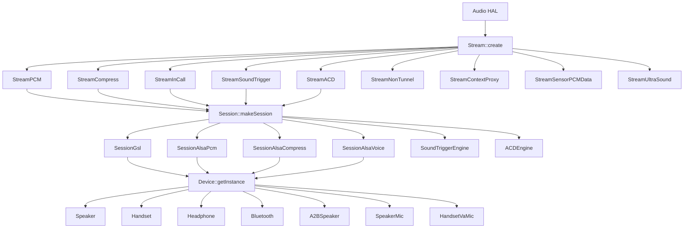
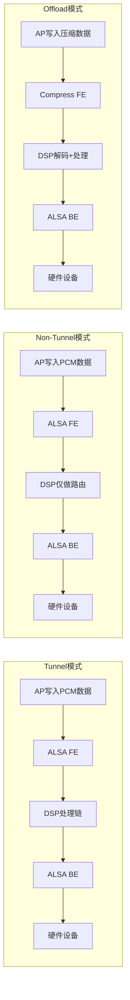
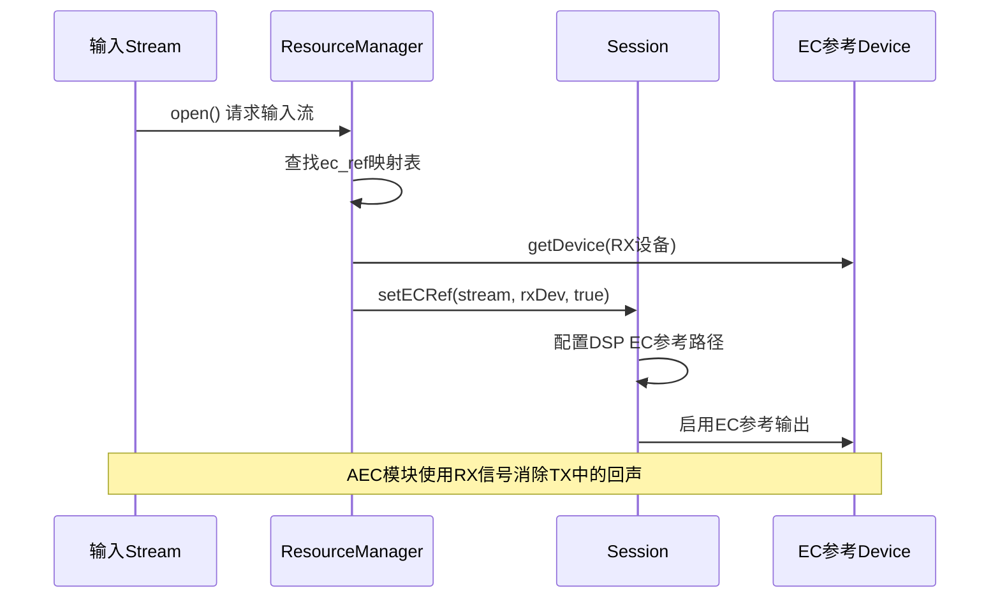
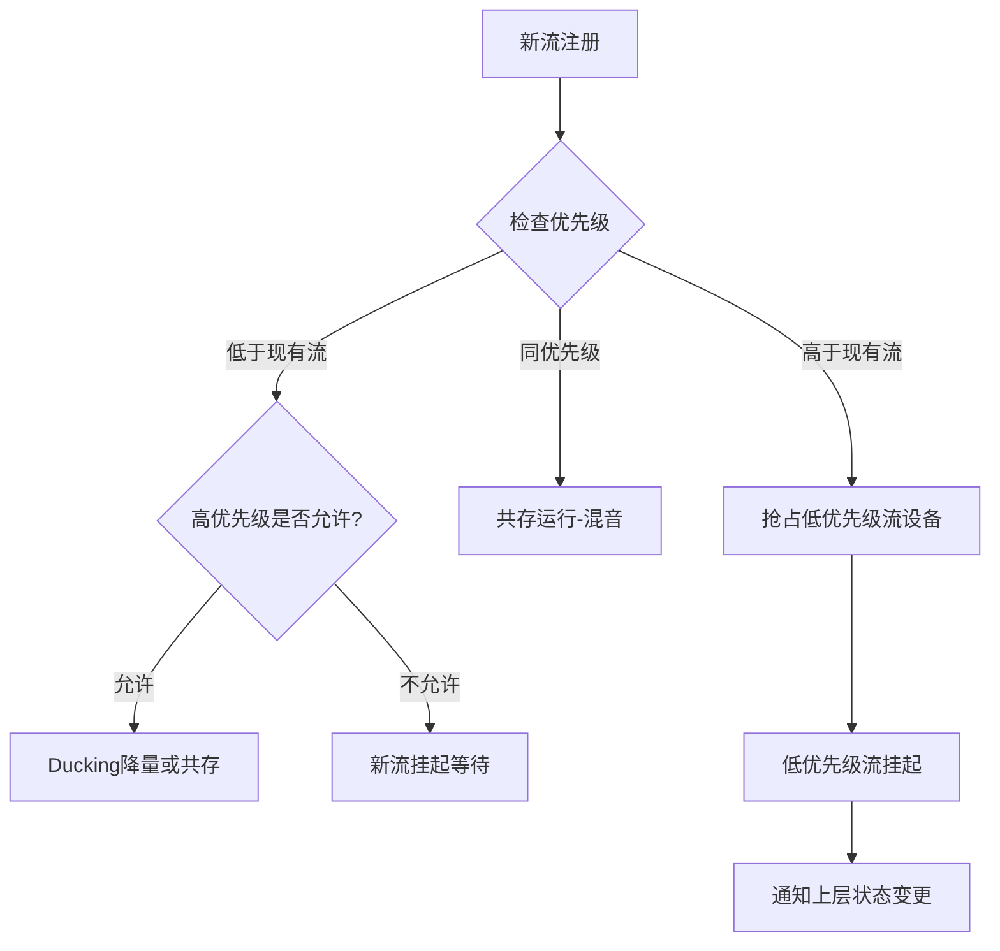

## 附录：Stream-Session-Device映射关系

> [← 上一个](15_17.1_QC_Sound_Trigger_HAL.md) | [← 返回15章](README.md) | [返回导航](../README.md) | [下一个 →](../16_Vendor_QNX_Architecture/README.md)

---

## 15.99.1 映射关系总览

PAL架构的核心是Stream、Session、Device三层抽象的协作。每个音频请求从Audio HAL到达PAL后，经历三层映射：

1. **Stream层**：`Stream::create()` 根据 `pal_stream_type_t` 创建具体Stream子类
2. **Session层**：`Session::makeSession()` 根据Stream类型创建Session子类，管理数据通路
3. **Device层**：`Device::getInstance()` 根据 `pal_device_id_t` 创建Device子类，管理硬件设备



---

## 15.99.2 Stream→Session工厂映射详解

### Stream::create() 工厂方法

`Stream::create()` 是创建流对象的核心入口，根据 `pal_stream_type_t` 分配具体子类：

| Stream子类 | 对应的 pal_stream_type_t | 核心用途 |
|------------|--------------------------|---------|
| `StreamPCM` | LOW_LATENCY, DEEP_BUFFER, ULTRA_LOW_LATENCY, PROXY, HAPTICS, RAW, PLAYBACK_BUS, VOIP, VOIP_RX, VOIP_TX, GENERIC, SPATIAL_AUDIO, PCM_OFFLOAD | PCM播放/录制 |
| `StreamCompress` | COMPRESSED | 压缩格式Offload播放 |
| `StreamInCall` | VOICE_CALL_RECORD, VOICE_CALL_MUSIC | 通话录音/通话音乐 |
| `StreamSoundTrigger` | VOICE_UI, VOICE_ACTIVATION | 语音唤醒/触发 |
| `StreamACD` | ACD | 声学上下文检测 |
| `StreamNonTunnel` | NON_TUNNEL | 非隧道模式PCM |
| `StreamContextProxy` | CONTEXT_PROXY | 上下文代理 |
| `StreamSensorPCMData` | SENSOR_PCM_DATA | 传感器PCM数据 |
| `StreamUltraSound` | ULTRASOUND | 超声波近距检测 |

### Session::makeSession() 工厂方法

`Session::makeSession()` 根据 `pal_stream_type_t` 选择Session子类，决策逻辑如下：

| Session子类 | 对应的 pal_stream_type_t | 数据通路特征 |
|-------------|--------------------------|-------------|
| `SessionGsl` | LOW_LATENCY, DEEP_BUFFER, ULTRA_LOW_LATENCY, VOIP, PROXY, HAPTICS, PLAYBACK_BUS, RAW, GENERIC, SPATIAL_AUDIO | DSP Tunnel模式，通过GSL图管理 |
| `SessionAlsaPcm` | NON_TUNNEL, PCM_OFFLOAD | Non-Tunnel模式，直接ALSA PCM操作 |
| `SessionAlsaCompress` | COMPRESSED | DSP Offload，压缩数据直传DSP解码 |
| `SessionAlsaVoice` | VOICE_CALL, VOICE_CALL_TX, VOICE_CALL_RX_TX | DSP Voice通路，VSID管理 |
| `SoundTriggerEngineCapi` | VOICE_UI (AP模式) | CAPIv2算法在应用处理器执行 |
| `SoundTriggerEngineGsl` | VOICE_UI (DSP模式) | SVA算法在DSP执行 |
| `ACDEngine` | ACD | DSP ACD检测引擎 |
| `ContextDetectionEngine` | CONTEXT_PROXY | 上下文检测引擎 |

> **SessionGsl vs SessionAlsaPcm 选择逻辑**：当GSL库可用时（AudioReach架构），PCM类流优先使用SessionGsl走DSP Tunnel路径；GSL不可用时回退到SessionAlsaPcm走ALSA直接路径。SA8295上SessionGsl通过AGM→gsl_fe→MM-HAB→gsl_vm_be跨VM调用DSP。

---

## 15.99.3 完整Stream-Session-Device三维映射表

### 15.99.3.1 播放类流映射

| Stream类型 | Stream子类 | Session子类 | 典型输出Device | 音频路径 |
|------------|-----------|-------------|---------------|---------|
| `PAL_STREAM_LOW_LATENCY` | StreamPCM | SessionGsl / SessionAlsaPcm | Speaker / Headphone / BT A2DP | Tunnel / Non-Tunnel |
| `PAL_STREAM_DEEP_BUFFER` | StreamPCM | SessionGsl / SessionAlsaPcm | Speaker / Headphone / BT A2DP | Tunnel |
| `PAL_STREAM_COMPRESSED` | StreamCompress | SessionAlsaCompress | Speaker / Headphone / BT A2DP | Offload |
| `PAL_STREAM_PCM_OFFLOAD` | StreamPCM | SessionAlsaPcm | Speaker / Headphone | Non-Tunnel Offload |
| `PAL_STREAM_ULTRA_LOW_LATENCY` | StreamPCM | SessionGsl | Speaker / Headphone | Tunnel (短延迟) |
| `PAL_STREAM_GENERIC` | StreamPCM | SessionGsl | Speaker / Headphone | Tunnel |
| `PAL_STREAM_RAW` | StreamPCM | SessionGsl | Speaker / Headphone | Tunnel (原始PCM) |
| `PAL_STREAM_HAPTICS` | StreamPCM | SessionGsl | HapticsDev | Tunnel |
| `PAL_STREAM_PLAYBACK_BUS` | StreamPCM | SessionGsl | A2BSpeaker / A2B2Speaker | Tunnel (AAOS TDM) |
| `PAL_STREAM_NON_TUNNEL` | StreamNonTunnel | SessionAlsaPcm | Speaker / Headphone | Non-Tunnel |
| `PAL_STREAM_SPATIAL_AUDIO` | StreamPCM | SessionGsl | Speaker / Headphone / BT | Tunnel |
| `PAL_STREAM_PROXY` | StreamPCM | SessionGsl | RTProxy (Out) | Tunnel |

### 15.99.3.2 通话与VoIP类流映射

| Stream类型 | Stream子类 | Session子类 | 典型Device组合 | 音频路径 |
|------------|-----------|-------------|---------------|---------|
| `PAL_STREAM_VOICE_CALL` | StreamPCM | SessionAlsaVoice | Handset+HandsetMic / Speaker+SpeakerMic / BT SCO双向 | DSP Voice |
| `PAL_STREAM_VOIP` | StreamPCM | SessionGsl | Speaker+SpeakerMic / Headphone+HeadsetMic / BT SCO | Tunnel双向+AEC |
| `PAL_STREAM_VOIP_RX` | StreamPCM | SessionGsl | Speaker / Headphone | Tunnel (仅下行) |
| `PAL_STREAM_VOIP_TX` | StreamPCM | SessionGsl | SpeakerMic / HeadsetMic | Tunnel (仅上行) |
| `PAL_STREAM_VOICE_CALL_RECORD` | StreamInCall | SessionGsl | Proxy (In) | Tunnel (录音) |
| `PAL_STREAM_VOICE_CALL_TX` | StreamInCall | SessionGsl | Proxy (In) | Tunnel (上行录音) |
| `PAL_STREAM_VOICE_CALL_RX_TX` | StreamInCall | SessionGsl | Proxy (In) | Tunnel (双向录音) |
| `PAL_STREAM_VOICE_CALL_MUSIC` | StreamInCall | SessionGsl | Speaker / Headphone | Tunnel (通话背景音) |
| `PAL_STREAM_PCM_HFP` | StreamPCM | SessionGsl | BT SCO双向 | Tunnel (免提) |

### 15.99.3.3 语音触发与检测类流映射

| Stream类型 | Stream子类 | Session子类 | 典型输入Device | 音频路径 |
|------------|-----------|-------------|---------------|---------|
| `PAL_STREAM_VOICE_UI` | StreamSoundTrigger | SoundTriggerEngineCapi/Gsl | HandsetVaMic / HeadsetVaMic | DSP SVA / AP CAPI |
| `PAL_STREAM_VOICE_ACTIVATION` | StreamSoundTrigger | SoundTriggerEngineGsl | HandsetVaMic | DSP SVA |
| `PAL_STREAM_ACD` | StreamACD | ACDEngine | HandsetVaMic / SpeakerMic | DSP ACD |
| `PAL_STREAM_CONTEXT_PROXY` | StreamContextProxy | ContextDetectionEngine | HandsetVaMic | DSP Context |
| `PAL_STREAM_SENSOR_PCM_DATA` | StreamSensorPCMData | SessionGsl | SpeakerMic / HandsetVaMic | Tunnel (传感器) |

### 15.99.3.4 特殊流映射

| Stream类型 | Stream子类 | Session子类 | 典型Device | 音频路径 |
|------------|-----------|-------------|-----------|---------|
| `PAL_STREAM_LOOPBACK` | StreamPCM | SessionGsl | RTProxy (In+Out) | DSP Loopback |
| `PAL_STREAM_TRANSCODE` | StreamPCM | SessionGsl | Proxy | DSP转码 |
| `PAL_STREAM_ULTRASOUND` | StreamUltraSound | SessionGsl | UltrasoundDev + UltrasoundMic | DSP超声波 |
| `PAL_STREAM_NAVI` | StreamPCM | SessionGsl | Speaker / A2BSpeaker | Tunnel (导航) |
| `PAL_STREAM_GENERIC_CHIME` | StreamPCM | SessionGsl | Speaker / Headphone | Tunnel (提示音) |

---

## 15.99.4 音频路径类型详解

PAL中存在三种主要的音频数据路径，决定了数据在AP和DSP之间的流转方式：



### 15.99.4.1 Tunnel模式

| 特征 | 说明 |
|------|------|
| 数据格式 | AP发送原始PCM到DSP FE |
| DSP角色 | 完整处理链：解码→音量→EQ→混音→路由 |
| 延迟 | 中等（~20-50ms），DSP内部缓冲 |
| 适用场景 | DEEP_BUFFER, VOIP, HAPTICS, PLAYBACK_BUS |
| Session | SessionGsl |
| 关键接口 | `agm_graph_open/start/stop/close` |

### 15.99.4.2 Non-Tunnel模式

| 特征 | 说明 |
|------|------|
| 数据格式 | AP发送PCM到ALSA FE，DSP仅做路由转发 |
| DSP角色 | 最小化处理，仅路由到BE |
| 延迟 | 最低（~5-10ms），AP直控 |
| 适用场景 | NON_TUNNEL, PCM_OFFLOAD, 超低延迟场景 |
| Session | SessionAlsaPcm |
| 关键接口 | `pcm_open/write/read/close` (ALSA lib) |

### 15.99.4.3 Offload模式

| 特征 | 说明 |
|------|------|
| 数据格式 | AP发送压缩数据（MP3/AAC/FLAC等）到Compress FE |
| DSP角色 | 完整解码+后处理，AP完全不参与解码 |
| 延迟 | 较高（解码延迟+缓冲） |
| 适用场景 | COMPRESSED（音乐Offload播放） |
| Session | SessionAlsaCompress |
| 关键接口 | `compress_open/write/start/stop/close` (tinycompress) |

> **SA8295路径特化**：Tunnel模式下SessionGsl通过AGM→gsl_fe→MM-HAB→gsl_vm_be跨VM调用QNX侧GSL，最终由GSL管理DSP图。Non-Tunnel模式下SessionAlsaPcm直接操作ALSA设备节点，不经过跨VM调用。

---

## 15.99.5 Session→Device连接机制详解

### 15.99.5.1 设备发现与创建

Stream在`open()`阶段通过ResourceManager获取Device实例，调用链如下：

```
Stream::open()
  → ResourceManager::getDevice(pal_device*)
    → Device::getInstance(pal_device*, rm)
      → Device::getObject(pal_device_id_t)  // 根据devId创建子类
```

`Device::getInstance()` 是工厂方法，根据 `pal_device_id_t` 创建对应子类。ResourceManager维护设备实例缓存，相同设备ID复用已有实例。

### 15.99.5.2 设备连接流程

Session通过以下方法与Device建立连接：

| Session方法 | 功能 | 调用时机 |
|------------|------|---------|
| `setupSessionDevice(Stream*, pal_device_id_t)` | 配置Session的GKV/CKV中设备相关键值 | Stream::open() |
| `connectSessionDevice(Stream*, shared_ptr<Device>)` | 将设备连接到Session的DSP图 | Stream::start()前 |
| `disconnectSessionDevice(Stream*, shared_ptr<Device>)` | 从Session的DSP图断开设备 | Stream::stop()后 |
| `setECRef(Stream*, shared_ptr<Device>, bool)` | 设置/清除回声参考设备 | 输入流需要AEC时 |

### 15.99.5.3 Device→pal_device_id_t映射表

| Device子类 | pal_device_id_t | 方向 | 典型用途 |
|-----------|----------------|------|---------|
| Speaker | PAL_DEVICE_OUT_SPEAKER | 输出 | 媒体/铃声外放 |
| SpeakerProtection | PAL_DEVICE_OUT_SPEAKER | 输出 | 扬声器保护模式 |
| Handset | PAL_DEVICE_OUT_HANDSET | 输出 | 听筒通话 |
| Headphone | PAL_DEVICE_OUT_WIRED_HEADPHONE | 输出 | 有线耳机播放 |
| Bluetooth (A2DP) | PAL_DEVICE_OUT_BLUETOOTH_A2DP | 输出 | BT媒体播放 |
| Bluetooth (SCO) | PAL_DEVICE_OUT_BLUETOOTH_SCO | 输出 | BT通话播放 |
| HapticsDev | PAL_DEVICE_OUT_HAPTICS_DEVICE | 输出 | 触觉反馈 |
| UltrasoundDev | PAL_DEVICE_OUT_ULTRASOUND | 输出 | 超声波发射 |
| RTProxy (Out) | PAL_DEVICE_OUT_PROXY | 输出 | 代理输出 |
| A2BSpeaker | PAL_DEVICE_OUT_A2B_SPKR | 输出 | A2B总线播放 |
| A2B2Speaker | PAL_DEVICE_OUT_A2B2_SPKR | 输出 | A2B2总线播放 |
| DisplayPort | PAL_DEVICE_OUT_HDMI | 输出 | DP/HDMI音频 |
| USBAudio | PAL_DEVICE_OUT_USB_DEVICE | 输出 | USB音频播放 |
| FMDevice | PAL_DEVICE_OUT_FM | 输出 | FM输出 |
| SpeakerMic | PAL_DEVICE_IN_SPEAKER_MIC | 输入 | 扬声器区域麦克风 |
| HandsetMic | PAL_DEVICE_IN_HANDSET_MIC | 输入 | 手持麦克风 |
| HandsetVaMic | PAL_DEVICE_IN_HANDSET_VA_MIC | 输入 | 语音激活麦克风 |
| HeadsetMic | PAL_DEVICE_IN_WIRED_HEADSET | 输入 | 有线耳麦输入 |
| HeadsetVaMic | PAL_DEVICE_IN_HEADSET_VA_MIC | 输入 | 耳机VA麦克风 |
| Bluetooth (SCO In) | PAL_DEVICE_IN_BLUETOOTH_SCO_HEADSET | 输入 | BT通话上行 |
| ExtEC | PAL_DEVICE_IN_EXT_EC_REF | 输入 | 外部回声参考 |
| UltrasoundMic | PAL_DEVICE_IN_ULTRASOUND_MIC | 输入 | 超声波接收 |
| RTProxy (In) | PAL_DEVICE_IN_PROXY | 输入 | 代理输入 |

---

## 15.99.6 EC参考映射

输入流需要回声消除（AEC）时，必须关联一个输出设备作为EC参考。ResourceManager在 `resourcemanager_XXX.xml` 的 `<ec_ref>` 节点中定义映射关系。

### EC参考映射表

| 输入Device (TX) | EC参考输出Device (RX) | 使用场景 |
|-----------------|---------------------|---------|
| PAL_DEVICE_IN_SPEAKER_MIC | PAL_DEVICE_OUT_SPEAKER | 扬声器免提通话/VoIP |
| PAL_DEVICE_IN_HANDSET_MIC | PAL_DEVICE_OUT_HANDSET | 听筒通话 |
| PAL_DEVICE_IN_WIRED_HEADSET | PAL_DEVICE_OUT_WIRED_HEADPHONE | 有线耳麦VoIP |
| PAL_DEVICE_IN_BLUETOOTH_SCO_HEADSET | PAL_DEVICE_OUT_BLUETOOTH_SCO | BT SCO通话 |
| PAL_DEVICE_IN_HEADSET_VA_MIC | PAL_DEVICE_OUT_SPEAKER | 耳机VA+外放参考 |
| PAL_DEVICE_IN_HANDSET_VA_MIC | PAL_DEVICE_OUT_SPEAKER | 手持VA+外放参考 |

### EC参考设置流程



> **车机多区域EC注意**：车机多区域场景下，每个区域的麦克风必须映射到对应区域的扬声器作为EC参考。若映射错误，AEC会消除错误区域的回声或完全无法消除。例如前排麦克风应映射到前排扬声器，而非后排。

---

## 15.99.7 并发流组合规则

### 15.99.7.1 流优先级体系

ResourceManager通过优先级机制管理多流并发，优先级从高到低：

| 优先级 | 流类型 | 说明 |
|--------|--------|------|
| 最高 | PAL_STREAM_VOICE_CALL | 语音通话，不可被抢占 |
| 高 | PAL_STREAM_VOIP | VoIP通话 |
| 中高 | PAL_STREAM_LOW_LATENCY / ULTRA_LOW_LATENCY | 低延迟播放（按键音等） |
| 中 | PAL_STREAM_DEEP_BUFFER | 深缓冲播放（媒体音乐） |
| 中低 | PAL_STREAM_COMPRESSED | 压缩流播放 |
| 低 | PAL_STREAM_RAW / GENERIC | 原始/通用流 |

### 15.99.7.2 并发流决策



### 15.99.7.3 典型并发场景

| 场景 | 行为 | 说明 |
|------|------|------|
| 通话 + 媒体 | 媒体挂起 | 通话结束后媒体恢复 |
| VoIP + 媒体 | 媒体Ducking | VoIP通话时媒体降低音量 |
| 通话 + 通话录音 | 共存 | 通话录音流与通话流共用Voice通路 |
| 导航 + 媒体 | 混音共存 | 导航提示音与媒体在DSP混音 |
| 低延迟 + 深缓冲 | 共存 | 同优先级，共享设备或分别路由 |
| SVA + ACD | 共存 | 两种检测引擎可同时运行 |
| Haptics + 媒体 | 共存 | 触觉反馈独立通路，不影响媒体 |
| PLAYBACK_BUS + 其他 | 共存 | AAOS多区域独立播放 |

### 15.99.7.4 并发配置

并发规则在 `resourcemanager_XXX.xml` 的 `<concurrent_stream>` 节点定义：

```xml
<concurrent_stream>
    <stream_type type="PAL_STREAM_VOICE_CALL">
        <concurrent_type type="PAL_STREAM_VOICE_CALL_RECORD" />
        <concurrent_type type="PAL_STREAM_VOICE_CALL_MUSIC" />
    </stream_type>
    <stream_type type="PAL_STREAM_VOIP">
        <concurrent_type type="PAL_STREAM_LOW_LATENCY" />
    </stream_type>
</concurrent_stream>
```

核心检查方法：`ConcurrentStreamStatus(pal_stream_type_t type)` — 查询指定类型流是否允许与当前活跃流并发。

---

## 15.99.8 SA8295车机特有映射

### 15.99.8.1 A2B总线设备映射

SA8295车机使用A2B（Automotive Audio Bus）连接多区域扬声器，这是手机平台不具备的特殊映射：

| PAL流类型 | Session | A2B Device | TDM后端 | 说明 |
|-----------|---------|-----------|---------|------|
| PAL_STREAM_PLAYBACK_BUS | SessionGsl | PAL_DEVICE_OUT_A2B_SPKR | TDM TX | 前排A2B区域 |
| PAL_STREAM_PLAYBACK_BUS | SessionGsl | PAL_DEVICE_OUT_A2B2_SPKR | TDM TX | 后排A2B区域 |
| PAL_STREAM_LOOPBACK | SessionGsl | RTProxy | TDM RX | 车内录音/回声参考 |

### 15.99.8.2 多区域并发播放

AAOS多区域场景下，多个PLAYBACK_BUS流可同时向不同A2B区域播放：

```
区域1(前排): PAL_STREAM_PLAYBACK_BUS → SessionGsl → A2BSpeaker → TDM1 TX
区域2(后排): PAL_STREAM_PLAYBACK_BUS → SessionGsl → A2B2Speaker → TDM2 TX
导航提示:    PAL_STREAM_NAVI → SessionGsl → A2BSpeaker → TDM1 TX (混音)
```

### 15.99.8.3 跨VM路径

SA8295 Android(GVM)通过MM-HAB与QNX(PVM)通信：

| 操作路径 | GVM侧 | MM-HAB | PVM侧 |
|---------|--------|--------|--------|
| Tunnel播放 | SessionGsl → AGM → gsl_fe | → HAB → | gsl_vm_be → GSL → ADSP |
| Non-Tunnel | SessionAlsaPcm → ALSA lib | 直连 | QNX ALSA PCM |
| Voice通话 | SessionAlsaVoice → AGM | → HAB → | GSL → ADSP Voice |
| SVA检测 | SoundTriggerEngineGsl | → HAB → | GSL → ADSP SVA |

---

## 15.99.9 app_type与PCM设备映射

每种Stream类型对应固定的app_type和DSP前端PCM设备，由 `resourcemanager_XXX.xml` 配置：

| PAL流类型 | app_type | PCM前端设备 | DSP处理链 |
|-----------|----------|------------|----------|
| LOW_LATENCY | 69940 | MultiMedia5 | 简单解码+音量 |
| DEEP_BUFFER | 69941 | MultiMedia1 | 完整处理链 |
| COMPRESSED | 69941 | MultiMedia2 | 解码+后处理 |
| VOIP | 69946 | MultiMedia7 | AEC+NS+编码 |
| VOICE_CALL | 69943 | VOICE | 完整语音处理 |
| VOICE_UI | 69940 | MultiMedia15 | SVA检测 |
| ACD | 69940 | MultiMedia15 | ACD检测 |
| GENERIC_CHIME | 69943 | MultiMedia23 | 提示音通路 |
| NAVI | 69942 | MultiMedia5 | 导航混音通路 |
| PLAYBACK_BUS | 69941 | MultiMedia1 | AAOS区域播放 |
| HAPTICS | 69940 | MultiMedia5 | Haptics波形 |
| ULTRASOUND | 69940 | MultiMedia5 | 超声波收发 |

> **app_type含义**：app_type是DSP识别流类型的标识，决定了DSP内部加载哪种处理模块图。相同app_type的流共享相同的DSP模块拓扑，通过不同的instance_id区分。

---

[← 上一个](15_17.1_QC_Sound_Trigger_HAL.md) | [← 返回15章](README.md) | [返回导航](../README.md) | [下一个 →](../16_Vendor_QNX_Architecture/README.md)]