# 第十六篇：PAL(Porting Audio Layer)架构深度解析

> [← 上一篇：Bluetooth Audio](14_Bluetooth_Audio.md) | [返回导航](README.md) | [下一篇：Vendor+QNX双域架构 →](17_Vendor_QNX_Architecture.md)

---

## 目录

- [16.1 PAL 概述](#16.1-pal-概述)
- [16.2 整体架构与层次关系](#16.2-整体架构与层次关系)
- [16.3 PAL API 层](#16.3-pal-api-层)
- [16.4 类型定义体系](#16.4-类型定义体系)
- [16.5 Stream 类层次](#16.5-stream-类层次)
- [16.6 Device 类层次](#16.6-device-类层次)
- [16.7 Session 类层次](#16.7-session-类层次)
- [16.8 ResourceManager 资源管理器](#16.8-resourcemanager-资源管理器)
- [16.9 PayloadBuilder 载荷构建器](#16.9-payloadbuilder-载荷构建器)
- [16.10 IPC 机制](#16.10-ipc-机制)
- [16.11 XML 配置体系](#16.11-xml-配置体系)
- [16.12 HAL-PAL 适配层](#16.12-hal-pal-适配层)
- [16.13 Plugins 插件体系](#16.13-plugins-插件体系)
- [16.14 Utils 工具集](#16.14-utils-工具集)
- [16.15 ContextManager 上下文管理](#16.15-contextmanager-上下文管理)
- [16.16 SndCardMonitor 声卡监控](#16.16-sndcardmonitor-声卡监控)
- [16.17 核心流程分析](#16.17-核心流程分析)

---

## 16.1 PAL 概述

PAL (Porting Audio Layer) 是 Qualcomm AudioReach 架构的核心抽象层，位于 Android Audio HAL 与底层 AGM (Audio Graph Manager) 之间。PAL 封装了音频流管理、设备路由、会话控制、音量调节等核心功能，为上层 HAL 提供统一的 C API 接口，同时向下通过 AGM Service 与 DSP Graph Service Layer(GSL) 和 APM(SPF) 交互。在SA8295虚拟化架构下，GSL运行在QNX域(PVM)，Android域(GVM)的AGM Service通过gsl_fe→MM-HAB→gsl_vm_be跨VM通道与GSL交互。

> **AudioReach架构路径**：PAL → AGM Service → gsl_fe → MM-HAB → gsl_vm_be → GSL → APM(SPF) → SPF Modules
>
> **SA8295跨VM说明**：在SA8295虚拟化架构下，Android域(GVM)的AGM Service调用GSL API时，由libar-gsl_fe.so代理实现，通过MM-HAB跨VM通道转发给QNX域(PVM)的gsl_vm_be执行。GSL实际运行在QNX域。
>
> **Legacy路径(对比)**：PAL → GSL → ADM → ASM → COPP

### 16.1.1 设计目标

- **硬件抽象**：屏蔽底层 DSP/ADSP 的差异，提供统一的音频操作接口
- **流-设备-会话解耦**：Stream、Device、Session 三层分离，支持灵活组合
- **资源集中管理**：通过 ResourceManager 统一管理并发流、设备路由、前端 ID 分配
- **可配置化**：通过 XML 配置文件适配不同平台（kona/lahaina/taro/monaco 等）
- **IPC 隔离**：通过 HwBinder 支持 HAL 与 PAL 进程隔离部署

### 16.1.2 源码路径

| 模块 | 相对路径 |
|------|---------|
| PAL 核心 | `vendor/qcom/opensource/pal/` |
| HAL-PAL 适配层 | `vendor/qcom/opensource/audio-hal-ar/primary-hal/hal-pal/` |
| Stream | `vendor/qcom/opensource/pal/stream/` |
| Device | `vendor/qcom/opensource/pal/device/` |
| Session | `vendor/qcom/opensource/pal/session/` |
| ResourceManager | `vendor/qcom/opensource/pal/resource_manager/` |
| IPC | `vendor/qcom/opensource/pal/ipc/HwBinders/` |
| Configs | `vendor/qcom/opensource/pal/configs/` |
| Plugins | `vendor/qcom/opensource/pal/plugins/` |
| Utils | `vendor/qcom/opensource/pal/utils/` |

---

## 16.2 整体架构与层次关系

### 2.1 架构层次图

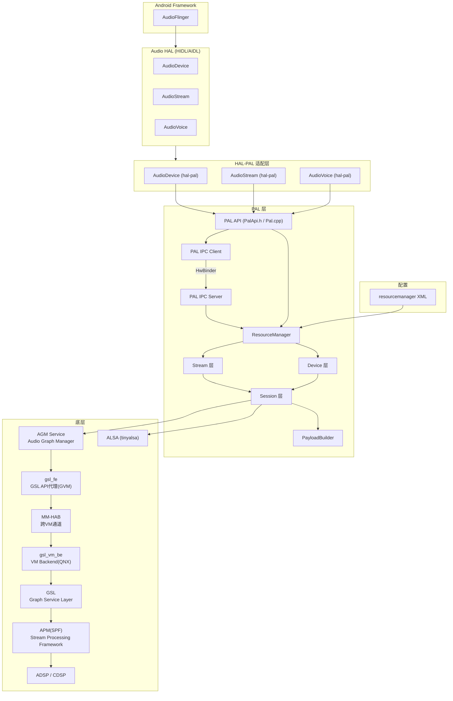

### 2.2 数据流向

```mermaid
graph LR
    App["应用层"] --> AudioFlinger["AudioFlinger"]
    AudioFlinger --> HAL["Audio HAL"]
    HAL -->|pal_stream_write| PAL["PAL"]
    PAL -->|Session.write| Session["Session"]
    Session -->|agm_session_write<br/>或gsl_write(Legacy)| AGM["AGM"]
    AGM -->|gsl_fe代理| GSL_FE["gsl_fe"]
    GSL_FE -->|MM-HAB| GSL_BE["gsl_vm_be"]
    GSL_BE --> GSL["GSL"]
    GSL --> APM["APM(SPF)"]
    APM --> DSP["ADSP"]
    DSP --> Codec["Codec/AMP"]
    Codec --> Speaker["Speaker"]
```

---

## 16.3 PAL API 层

PAL API 是整个 PAL 框架的入口，定义在 `PalApi.h` 中，实现在 `Pal.cpp` 中。所有上层调用均通过这些 C API 进入 PAL 内部。

> 源码路径：`PalApi.h`、`Pal.cpp`

### 3.1 API 分类总览

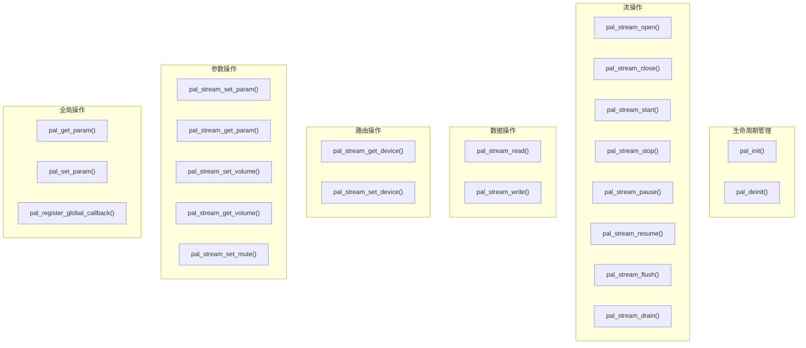

### 3.2 核心 API 详解

#### 3.2.1 初始化与反初始化

```c
// 初始化PAL，加载配置、初始化ResourceManager
int32_t pal_init();
// 反初始化PAL，释放所有资源
int32_t pal_deinit();
```

- `pal_init()` 内部调用 `ResourceManager::getInstance()` 完成单例初始化
- 首次调用时解析 XML 配置、初始化设备列表、加载 GSL 库（SA8295上PAL依赖libar-gsl提供GSL公共头文件，实际GSL调用由AGM通过gsl_fe代理跨VM执行）

#### 3.2.2 流生命周期

```c
int32_t pal_stream_open(
    struct pal_stream_attributes *attributes,   // 流属性(类型/方向/采样率等)
    uint32_t no_of_devices,                     // 设备数量
    struct pal_device *devices,                 // 设备数组
    uint32_t no_of_modifiers,                   // 修饰符数量
    struct modifier_kv *modifiers,              // 修饰符键值对
    pal_stream_callback callback,               // 事件回调函数
    uint64_t cookie,                            // 回调cookie
    pal_stream_handle_t **stream_handle         // 输出: 流句柄
);
int32_t pal_stream_close(pal_stream_handle_t stream_handle);
int32_t pal_stream_start(pal_stream_handle_t stream_handle);
int32_t pal_stream_stop(pal_stream_handle_t stream_handle);
```

`pal_stream_open()` 内部流程：
1. 调用 `Stream::create()` 工厂方法，根据 `pal_stream_type_t` 创建具体 Stream 子类
2. 调用 `s->open()` 完成流打开
3. 返回流句柄给调用者

#### 3.2.3 数据读写

```c
int32_t pal_stream_read(pal_stream_handle_t stream_handle, struct pal_buffer *buffer);
int32_t pal_stream_write(pal_stream_handle_t stream_handle, struct pal_buffer *buffer);
```

#### 3.2.4 设备路由

```c
int32_t pal_stream_get_device(pal_stream_handle_t stream_handle,
                               uint32_t *no_of_devices, struct pal_device **devices);
int32_t pal_stream_set_device(pal_stream_handle_t stream_handle,
                               uint32_t no_of_devices, struct pal_device *devices);
```

#### 3.2.5 音量与静音

```c
int32_t pal_stream_set_volume(pal_stream_handle_t stream_handle, struct pal_volume_data *volume);
int32_t pal_stream_get_volume(pal_stream_handle_t stream_handle, struct pal_volume_data **volume);
int32_t pal_stream_set_mute(pal_stream_handle_t stream_handle, bool state);
```

#### 3.2.6 全局参数

```c
int32_t pal_get_param(uint32_t param_id, void **param_payload, size_t *payload_size, struct pal_param_payload *query);
int32_t pal_set_param(uint32_t param_id, void *param_payload, size_t payload_size);
int32_t pal_register_global_callback(pal_global_callback cb, uint64_t cookie);
```

---

## 16.4 类型定义体系

> 源码路径：`PalDefs.h`

### 4.1 流类型 (pal_stream_type_t)

PAL 支持 27 种流类型，覆盖从低延迟播放到语音触发的各种场景：

| 值 | 枚举名 | 说明 |
|----|--------|------|
| 1 | `PAL_STREAM_LOW_LATENCY` | 低延迟播放，用于触控音效等 |
| 2 | `PAL_STREAM_DEEP_BUFFER` | 深缓冲播放，用于音乐等常规播放 |
| 3 | `PAL_STREAM_COMPRESSED` | 压缩流，Offload 播放 (MP3/AAC/FLAC等) |
| 4 | `PAL_STREAM_VOIP` | VoIP 双向流 |
| 5 | `PAL_STREAM_VOIP_RX` | VoIP 接收 |
| 6 | `PAL_STREAM_VOIP_TX` | VoIP 发送 |
| 7 | `PAL_STREAM_VOICE_CALL_MUSIC` | 通话中混合音乐 |
| 8 | `PAL_STREAM_GENERIC` | 通用流 |
| 9 | `PAL_STREAM_RAW` | 原始 PCM 流 |
| 10 | `PAL_STREAM_VOICE_ACTIVATION` | 语音激活 |
| 11 | `PAL_STREAM_VOICE_CALL_RECORD` | 通话录音 |
| 12 | `PAL_STREAM_VOICE_CALL_TX` | 通话上行 |
| 13 | `PAL_STREAM_VOICE_CALL_RX_TX` | 通话双向 |
| 14 | `PAL_STREAM_VOICE_CALL` | 语音通话 |
| 15 | `PAL_STREAM_LOOPBACK` | 回环流 |
| 16 | `PAL_STREAM_TRANSCODE` | 转码流 |
| 17 | `PAL_STREAM_VOICE_UI` | 语音 UI (SVA) |
| 18 | `PAL_STREAM_PCM_OFFLOAD` | PCM Offload |
| 19 | `PAL_STREAM_ULTRA_LOW_LATENCY` | 超低延迟流 |
| 20 | `PAL_STREAM_PROXY` | 代理流 |
| 21 | `PAL_STREAM_NON_TUNNEL` | 非隧道模式流 |
| 22 | `PAL_STREAM_HAPTICS` | 触觉反馈流 |
| 23 | `PAL_STREAM_ACD` | 声学上下文检测流 |
| 24 | `PAL_STREAM_CONTEXT_PROXY` | 上下文代理流 |
| 25 | `PAL_STREAM_SENSOR_PCM_DATA` | 传感器 PCM 数据流 |
| 26 | `PAL_STREAM_ULTRASOUND` | 超声波近距检测流 |
| 27 | `PAL_STREAM_PLAYBACK_BUS` | 总线播放流 (AAOS) |

### 4.2 设备类型 (pal_device_id_t)

#### 输出设备 (2-22)

| 值 | 枚举名 | 说明 |
|----|--------|------|
| 2 | `PAL_DEVICE_OUT_HANDSET` | 听筒输出 |
| 3 | `PAL_DEVICE_OUT_SPEAKER` | 扬声器输出 |
| 4 | `PAL_DEVICE_OUT_WIRED_HEADSET` | 有线耳机(含麦克风) |
| 5 | `PAL_DEVICE_OUT_WIRED_HEADPHONE` | 有线耳机(无麦克风) |
| 6 | `PAL_DEVICE_OUT_LINE` | Line Out |
| 7 | `PAL_DEVICE_OUT_BLUETOOTH_SCO` | BT SCO 输出 |
| 8 | `PAL_DEVICE_OUT_BLUETOOTH_A2DP` | BT A2DP 输出 |
| 9 | `PAL_DEVICE_OUT_AUX_DIGITAL` | AUX 数字输出 |
| 10 | `PAL_DEVICE_OUT_HDMI` | HDMI 输出 |
| 11 | `PAL_DEVICE_OUT_USB_DEVICE` | USB 设备输出 |
| 12 | `PAL_DEVICE_OUT_USB_HEADSET` | USB 耳机输出 |
| 13 | `PAL_DEVICE_OUT_SPDIF` | SPDIF 输出 |
| 14 | `PAL_DEVICE_OUT_FM` | FM 输出 |
| 15 | `PAL_DEVICE_OUT_AUX_LINE` | AUX Line 输出 |
| 16 | `PAL_DEVICE_OUT_PROXY` | Proxy 输出 |
| 17 | `PAL_DEVICE_OUT_AUX_DIGITAL_1` | AUX 数字输出 1 |
| 18 | `PAL_DEVICE_OUT_HEARING_AID` | 助听器输出 |
| 19 | `PAL_DEVICE_OUT_HAPTICS_DEVICE` | 触觉反馈设备 |
| 20 | `PAL_DEVICE_OUT_ULTRASOUND` | 超声波输出 |
| 21 | `PAL_DEVICE_OUT_A2B_SPKR` | A2B 总线扬声器 |
| 22 | `PAL_DEVICE_OUT_A2B2_SPKR` | A2B2 总线扬声器 |

#### 输入设备 (24-43)

| 值 | 枚举名 | 说明 |
|----|--------|------|
| 24 | `PAL_DEVICE_IN_HANDSET_MIC` | 手持麦克风 |
| 25 | `PAL_DEVICE_IN_SPEAKER_MIC` | 扬声器麦克风 |
| 26 | `PAL_DEVICE_IN_BLUETOOTH_SCO_HEADSET` | BT SCO 耳麦输入 |
| 27 | `PAL_DEVICE_IN_WIRED_HEADSET` | 有线耳麦输入 |
| 28 | `PAL_DEVICE_IN_AUX_DIGITAL` | AUX 数字输入 |
| 29 | `PAL_DEVICE_IN_HDMI` | HDMI 输入 |
| 30 | `PAL_DEVICE_IN_USB_ACCESSORY` | USB 配件输入 |
| 31 | `PAL_DEVICE_IN_USB_DEVICE` | USB 设备输入 |
| 32 | `PAL_DEVICE_IN_USB_HEADSET` | USB 耳麦输入 |
| 33 | `PAL_DEVICE_IN_FM_TUNER` | FM 调谐器 |
| 34 | `PAL_DEVICE_IN_LINE` | Line In |
| 35 | `PAL_DEVICE_IN_SPDIF` | SPDIF 输入 |
| 36 | `PAL_DEVICE_IN_PROXY` | Proxy 输入 |
| 37 | `PAL_DEVICE_IN_HANDSET_VA_MIC` | 手持语音激活麦克风 |
| 38 | `PAL_DEVICE_IN_BLUETOOTH_A2DP` | BT A2DP 输入 |
| 39 | `PAL_DEVICE_IN_HEADSET_VA_MIC` | 耳机语音激活麦克风 |
| 40 | `PAL_DEVICE_IN_VI_FEEDBACK` | VI 反馈输入 |
| 41 | `PAL_DEVICE_IN_TELEPHONY_RX` | 电话下行输入 |
| 42 | `PAL_DEVICE_IN_ULTRASOUND_MIC` | 超声波麦克风 |
| 43 | `PAL_DEVICE_IN_EXT_EC_REF` | 外部回声参考 |

### 4.3 音频格式 (pal_audio_fmt_t)

| 格式 | 说明 |
|------|------|
| `PCM_S16_LE` | 16-bit 小端 PCM |
| `PCM_S24_LE` | 24-bit 小端 PCM |
| `PCM_S24_3LE` | 24-bit (3字节) 小端 PCM |
| `PCM_S32_LE` | 32-bit 小端 PCM |
| `MP3` | MPEG-1 Audio Layer III |
| `AAC` | Advanced Audio Coding (raw) |
| `AAC_ADTS` | AAC with ADTS header |
| `WMA_STD` | Windows Media Audio Standard |
| `WMA_PRO` | Windows Media Audio Professional |
| `ALAC` | Apple Lossless Audio Codec |
| `APE` | Monkey's Audio |
| `FLAC` | Free Lossless Audio Codec |
| `VORBIS` | Ogg Vorbis |
| `AMR_NB` | AMR Narrowband |
| `AMR_WB` | AMR Wideband |

### 4.4 流方向 (pal_stream_direction_t)

| 值 | 枚举名 | 说明 |
|----|--------|------|
| 0x1 | `PAL_AUDIO_OUTPUT` | 输出(播放) |
| 0x2 | `PAL_AUDIO_INPUT` | 输入(录音) |
| 0x3 | `PAL_AUDIO_INPUT_OUTPUT` | 双向(VoIP等) |

---

## 16.5 Stream 类层次

Stream 是 PAL 中音频流的核心抽象，定义了流的完整生命周期接口。

> 源码路径：`stream/inc/Stream.h`

### 5.1 类层次图

```mermaid
graph TB
    Stream["Stream (基类)<br/>stream/inc/Stream.h"]
    StreamPCM["StreamPCM<br/>stream/inc/StreamPCM.h"]
    StreamCompress["StreamCompress<br/>stream/inc/StreamCompress.h"]
    StreamInCall["StreamInCall<br/>stream/inc/StreamInCall.h"]
    StreamNonTunnel["StreamNonTunnel<br/>stream/inc/Stream.h"]
    StreamSoundTrigger["StreamSoundTrigger<br/>stream/inc/StreamSoundTrigger.h"]
    StreamACD["StreamACD<br/>stream/inc/StreamACD.h"]
    StreamContextProxy["StreamContextProxy<br/>stream/inc/StreamContextProxy.h"]
    StreamSensorPCMData["StreamSensorPCMData<br/>stream/inc/StreamSensorPCMData.h"]
    StreamUltraSound["StreamUltraSound<br/>stream/inc/StreamUltraSound.h"]

    Stream --> StreamPCM
    Stream --> StreamCompress
    Stream --> StreamInCall
    Stream --> StreamNonTunnel
    Stream --> StreamSoundTrigger
    Stream --> StreamACD
    Stream --> StreamContextProxy
    Stream --> StreamSensorPCMData
    Stream --> StreamUltraSound
```

### 5.2 Stream 基类

Stream 基类定义了纯虚接口，是所有流类型的公共抽象：

```cpp
class Stream {
public:
    // 生命周期
    virtual int32_t open() = 0;
    virtual int32_t close() = 0;
    virtual int32_t start() = 0;
    virtual int32_t stop() = 0;
    virtual int32_t pause() = 0;
    virtual int32_t resume() = 0;
    virtual int32_t flush() = 0;
    virtual int32_t drain(pal_drain_type_t type) = 0;

    // 数据操作
    virtual int32_t read(struct pal_buffer *buffer) = 0;
    virtual int32_t write(struct pal_buffer *buffer) = 0;

    // 设备路由
    virtual int32_t setDevice(std::vector<shared_ptr<Device>> &devices) = 0;

    // 参数与音量
    virtual int32_t setParam(uint32_t param_id, void *payload) = 0;
    virtual int32_t getParam(uint32_t param_id, void **payload) = 0;
    virtual int32_t setVolume(struct pal_volume_data *volume) = 0;
    virtual int32_t setMute(bool state) = 0;

    // 工厂方法
    static Stream* create(struct pal_stream_attributes *attributes,
                          uint32_t no_of_devices,
                          struct pal_device *devices,
                          uint32_t no_of_modifiers,
                          struct modifier_kv *modifiers,
                          pal_stream_callback callback,
                          uint64_t cookie);
protected:
    std::vector<shared_ptr<Device>> mDevices;    // 关联设备列表
    Session* session;                              // 关联Session
    struct pal_stream_attributes* mStreamAttr;    // 流属性
    shared_ptr<ResourceManager> rm;                // 资源管理器
    stream_state_t currentState;                   // 流状态机
};
```

### 5.3 流状态机

```mermaid
stateDiagram-v2
    [*] --> IDLE
    IDLE --> INIT: Stream::create()
    INIT --> OPENED: open()
    OPENED --> STARTED: start()
    STARTED --> PAUSED: pause()
    PAUSED --> STARTED: resume()
    STARTED --> SUSPENDED: suspend(设备断开)
    SUSPENDED --> STARTED: resume(设备重连)
    STARTED --> STOPPED: stop()
    STOPPED --> STARTED: start()
    OPENED --> IDLE: close()
    STOPPED --> IDLE: close()
```

流状态枚举 `stream_state_t`：
- `IDLE` - 初始/关闭状态
- `INIT` - 已创建，未打开
- `OPENED` - 已打开，未启动
- `STARTED` - 运行中
- `PAUSED` - 已暂停
- `SUSPENDED` - 已挂起(设备断开等)
- `STOPPED` - 已停止

### 5.4 Stream 子类详解

#### StreamPCM

> 源码路径：`stream/inc/StreamPCM.h`、`stream/src/StreamPCM.cpp`

PCM 流实现，覆盖多种 PCM 场景：

| 场景 | 对应流类型 | 说明 |
|------|-----------|------|
| 低延迟播放 | `PAL_STREAM_LOW_LATENCY` | 触控音效、系统提示音 |
| 深缓冲播放 | `PAL_STREAM_DEEP_BUFFER` | 音乐播放 |
| 超低延迟 | `PAL_STREAM_ULTRA_LOW_LATENCY` | 超低延迟场景 |
| 代理 | `PAL_STREAM_PROXY` | 代理 PCM 流 |
| 触觉反馈 | `PAL_STREAM_HAPTICS` | 触觉振动 |
| 原始 | `PAL_STREAM_RAW` | 原始 PCM |
| 总线播放 | `PAL_STREAM_PLAYBACK_BUS` | AAOS 总线播放 |
| VoIP | `PAL_STREAM_VOIP` | VoIP 双向 |

StreamPCM 内部维护 `session` 指针，在 `open()` 时通过 `Session::makeSession()` 创建对应的 Session (如 SessionAlsaPcm 或 SessionGsl)。

#### StreamCompress

> 源码路径：`stream/inc/StreamCompress.h`、`stream/src/StreamCompress.cpp`

压缩流实现，用于 Offload 播放场景：
- 对应 `PAL_STREAM_COMPRESSED` 和 `PAL_STREAM_PCM_OFFLOAD`
- 内部使用 `SessionAlsaCompress` 进行压缩数据传输
- 支持 MP3/AAC/FLAC/ALAC 等格式的 Offload 解码

#### StreamInCall

> 源码路径：`stream/inc/StreamInCall.h`、`stream/src/StreamInCall.cpp`

通话中录音/音乐流：
- 对应 `PAL_STREAM_VOICE_CALL_RECORD`、`PAL_STREAM_VOICE_CALL_MUSIC`
- 内部使用 `SessionAlsaVoice`

#### StreamSoundTrigger

> 源码路径：`stream/inc/StreamSoundTrigger.h`、`stream/src/StreamSoundTrigger.cpp`

语音触发流（SVA - Sound Voice Activation）：
- 对应 `PAL_STREAM_VOICE_UI`、`PAL_STREAM_VOICE_ACTIVATION`
- 内部使用 `SoundTriggerEngine`（Capi 或 GSL 引擎）
- 支持关键短语检测、声音模型加载

#### StreamACD

> 源码路径：`stream/inc/StreamACD.h`、`stream/src/StreamACD.cpp`

声学上下文检测流：
- 对应 `PAL_STREAM_ACD`
- 内部使用 `ACDEngine`
- 用于环境声学场景识别

#### StreamNonTunnel

> 源码路径：`stream/inc/Stream.h`

非隧道模式流：
- 对应 `PAL_STREAM_NON_TUNNEL`
- 数据路径不经过 DSP，直接在应用处理器和编解码器之间传输

#### StreamContextProxy

> 源码路径：`stream/inc/StreamContextProxy.h`

上下文代理流，对应 `PAL_STREAM_CONTEXT_PROXY`。

#### StreamSensorPCMData

> 源码路径：`stream/inc/StreamSensorPCMData.h`

传感器 PCM 数据流，对应 `PAL_STREAM_SENSOR_PCM_DATA`，用于传感器相关的音频数据采集。

#### StreamUltraSound

> 源码路径：`stream/inc/StreamUltraSound.h`

超声波近距检测流，对应 `PAL_STREAM_ULTRASOUND`，用于基于超声波的接近检测功能。

### 5.5 Stream::create() 工厂方法

`Stream::create()` 是创建流对象的核心工厂方法，根据 `pal_stream_type_t` 分配具体的子类：

```cpp
Stream* Stream::create(pal_stream_attributes *attributes, ...) {
    switch (attributes->type) {
        case PAL_STREAM_LOW_LATENCY:
        case PAL_STREAM_DEEP_BUFFER:
        case PAL_STREAM_ULTRA_LOW_LATENCY:
        case PAL_STREAM_PROXY:
        case PAL_STREAM_HAPTICS:
        case PAL_STREAM_RAW:
        case PAL_STREAM_PLAYBACK_BUS:
            s = new StreamPCM(attributes, devices, modifiers, callback, cookie);
            break;
        case PAL_STREAM_COMPRESSED:
        case PAL_STREAM_PCM_OFFLOAD:
            s = new StreamCompress(attributes, devices, modifiers, callback, cookie);
            break;
        case PAL_STREAM_VOICE_CALL_RECORD:
        case PAL_STREAM_VOICE_CALL_MUSIC:
            s = new StreamInCall(attributes, devices, modifiers, callback, cookie);
            break;
        case PAL_STREAM_VOICE_UI:
        case PAL_STREAM_VOICE_ACTIVATION:
            s = new StreamSoundTrigger(attributes, devices, modifiers, callback, cookie);
            break;
        case PAL_STREAM_ACD:
            s = new StreamACD(attributes, devices, modifiers, callback, cookie);
            break;
        case PAL_STREAM_NON_TUNNEL:
            s = new StreamNonTunnel(attributes, devices, modifiers, callback, cookie);
            break;
        case PAL_STREAM_CONTEXT_PROXY:
            s = new StreamContextProxy(attributes, devices, modifiers, callback, cookie);
            break;
        case PAL_STREAM_SENSOR_PCM_DATA:
            s = new StreamSensorPCMData(attributes, devices, modifiers, callback, cookie);
            break;
        case PAL_STREAM_ULTRASOUND:
            s = new StreamUltraSound(attributes, devices, modifiers, callback, cookie);
            break;
    }
    return s;
}
```

---

## 16.6 Device 类层次

Device 是 PAL 中音频设备的抽象，负责管理具体音频外设的启停和配置。

> 源码路径：`device/inc/Device.h`

### 6.1 类层次图

```mermaid
graph TB
    Device["Device (基类)<br/>device/inc/Device.h"]

    subgraph Output["输出设备"]
        Speaker["Speaker"]
        SpeakerProtection["SpeakerProtection"]
        Handset["Handset"]
        Headphone["Headphone"]
        Bluetooth["Bluetooth"]
        DisplayPort["DisplayPort"]
        USBAudio["USBAudio"]
        FMDevice["FMDevice"]
        HapticsDev["HapticsDev"]
        UltrasoundDev["UltrasoundDevice"]
        RTProxy["RTProxy"]
        A2B["A2BSpeaker / A2B2Speaker"]
    end

    subgraph Input["输入设备"]
        SpeakerMic["SpeakerMic"]
        HandsetMic["HandsetMic"]
        HandsetVaMic["HandsetVaMic"]
        HeadsetMic["HeadsetMic"]
        HeadsetVaMic["HeadsetVaMic"]
        ExtEC["ExtEC"]
    end

    Device --> Speaker
    Device --> SpeakerProtection
    Device --> Handset
    Device --> Headphone
    Device --> Bluetooth
    Device --> DisplayPort
    Device --> USBAudio
    Device --> FMDevice
    Device --> HapticsDev
    Device --> UltrasoundDev
    Device --> RTProxy
    Device --> A2B
    Device --> SpeakerMic
    Device --> HandsetMic
    Device --> HandsetVaMic
    Device --> HeadsetMic
    Device --> HeadsetVaMic
    Device --> ExtEC
```

### 6.2 Device 基类

```cpp
class Device {
public:
    virtual int32_t init();
    virtual int32_t deinit();
    virtual int32_t open() = 0;
    virtual int32_t close() = 0;
    virtual int32_t start() = 0;
    virtual int32_t stop() = 0;
    static std::shared_ptr<Device> getInstance(struct pal_device *device, ResourceManager *rm);
    static std::shared_ptr<Device> getObject(pal_device_id_t devId);
    virtual int32_t setParam(uint32_t param_id, void *param);
    virtual int32_t getParam(uint32_t param_id, void **param);
protected:
    struct pal_device* mDeviceAttr;
    ResourceManager* rm;
};
```

### 6.3 关键 Device 子类

#### Speaker / SpeakerProtection
> 源码路径：`device/inc/Speaker.h`、`device/inc/SpeakerProtection.h`

- **Speaker**：扬声器输出，支持立体声/单声道配置
- **SpeakerProtection**：扬声器保护，含温升监控(Thermal Mitigation)和excursion限制
- 通过VI(Voice Impedance)反馈通道实时监测扬声器状态

#### Handset
> 源码路径：`device/inc/Handset.h`

- **Handset**：听筒输出；**HandsetMic**：听筒麦克风；**HandsetVaMic**：听筒语音激活麦克风

#### Headphone / HeadsetMic
> 源码路径：`device/inc/Headphone.h`

- **Headphone**：有线耳机输出；**HeadsetMic**：有线耳麦输入；**HeadsetVaMic**：耳机VA麦克风
- 支持三段/四段耳机检测

#### Bluetooth
> 源码路径：`device/inc/Bluetooth.h`

- 支持SCO(通话)和A2DP(媒体)两种模式
- SCO模式：窄带/宽带语音通话
- A2DP模式：高质量音频流，编解码器通过plugins/codecs管理
- 支持LE Audio (LC3编解码)

#### DisplayPort / USBAudio / FMDevice / HapticsDev
- **DisplayPort**：`device/inc/DisplayPort.h`，DisplayPort音频输出
- **USBAudio**：`device/inc/USBAudio.h`，USB音频设备，动态检测能力
- **FMDevice**：`device/inc/FMDevice.h`，FM设备
- **HapticsDev**：`device/inc/HapticsDev.h`，触觉反馈设备

#### ExtEC / RTProxy / UltrasoundDevice / A2BSpeaker
- **ExtEC**：`device/inc/ExtEC.h`，外部回声参考设备
- **RTProxy**：`device/inc/RTProxy.h`，实时代理设备
- **UltrasoundDevice**：`device/inc/UltrasoundDevice.h`，超声波设备
- **A2BSpeaker/A2B2Speaker**：`device/inc/A2BSpeaker.h`，A2B(Automotive Audio Bus)总线扬声器

---

## 16.7 Session 类层次

Session 是 PAL 中音频会话的抽象，代表 Stream 与底层音频子系统(AGM/GSL/ALSA)之间的交互通道。

> 源码路径：`session/inc/Session.h`

### 7.1 类层次图

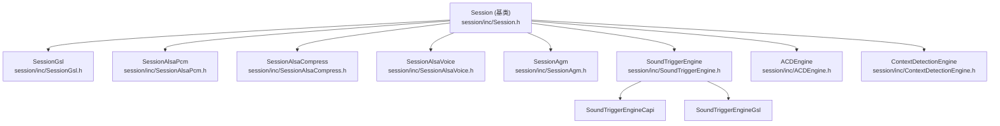

### 7.2 Session 基类

```cpp
class Session {
public:
    virtual int32_t open(Stream *s) = 0;
    virtual int32_t close(Stream *s) = 0;
    virtual int32_t start(Stream *s) = 0;
    virtual int32_t stop(Stream *s) = 0;
    virtual int32_t read(Stream *s, int tag, struct pal_buffer *buf, uint32_t *size) = 0;
    virtual int32_t write(Stream *s, int tag, struct pal_buffer *buf, uint32_t *size) = 0;
    virtual int32_t setConfig(Stream *s, configType type, int tag = 0) = 0;
    virtual int32_t setTKV(Stream *s, configType type, effect_pal_effect_t effect = EFFECT_NONE) = 0;
    virtual int32_t setupSessionDevice(Stream *s, pal_device_id_t devId) = 0;
    virtual int32_t connectSessionDevice(Stream *s, std::shared_ptr<Device> d) = 0;
    virtual int32_t disconnectSessionDevice(Stream *s, std::shared_ptr<Device> d) = 0;
    virtual int32_t setECRef(Stream *s, std::shared_ptr<Device> dev, bool is_enable) = 0;
    static Session* makeSession(ResourceManager *rm, struct pal_stream_attributes *attributes);
};
```

### 7.3 Session 子类详解

#### SessionGsl - GSL会话
> 源码路径：`session/inc/SessionGsl.h`、`session/src/SessionGsl.cpp`

AudioReach架构中最核心的Session实现：

```cpp
class SessionGsl : public Session {
    void* graphHandle;              // GSL图句柄
    gsl_key_vector_t* gkv;          // Graph Key Vector
    gsl_key_vector_t* ckv;          // Calibration Key Vector
    gsl_key_vector_t* tkv;          // Tag Key Vector
    PayloadBuilder* builder;        // 载荷构建器
    void* gslLibHandle;             // GSL库动态加载句柄
};
```

> **AudioReach路径**：SessionGsl通过AGM API(agm_graph_open/start/stop/close)间接调用GSL内部API(gsl_graph_open/start/stop/close)，而非直接调用GSL。SA8295上AGM调用GSL API由gsl_fe代理经MM-HAB跨VM转发给QNX侧gsl_vm_be。
> **Legacy路径(对比)**：SessionGsl直接调用GSL API(gsl_open_graph/gsl_start/gsl_stop/gsl_close_graph)。

#### SessionAgm - AGM会话
> 源码路径：`session/inc/SessionAgm.h`

通过AGM库接口管理音频图，AGM是GSL的高层封装。在AudioReach架构下，SessionGsl也通过AGM与GSL交互（SA8295上AGM调用GSL API由gsl_fe代理经MM-HAB跨VM转发给QNX侧gsl_vm_be执行）。

#### SoundTriggerEngine - 声触发引擎
> 源码路径：`session/inc/SoundTriggerEngine.h`

- **SoundTriggerEngineCapi**：在应用处理器上执行检测算法
- **SoundTriggerEngineGsl**：在DSP上执行检测算法

#### ACDEngine / ContextDetectionEngine
- **ACDEngine** (`session/inc/ACDEngine.h`)：ACD声学上下文检测引擎
- **ContextDetectionEngine** (`session/inc/ContextDetectionEngine.h`)：上下文检测引擎

### 7.4 Session::makeSession() 工厂方法

根据流类型创建合适的Session子类：
- PCM类流(LL/DB/ULL/Proxy/Haptics/Raw/Bus)：`SessionGsl`或`SessionAlsaPcm`
- 压缩流(Compressed/Offload)：`SessionAlsaCompress`
- 通话流(Voice/InCall)：`SessionAlsaVoice`
- VoIP：`SessionGsl`
- 语音触发(VoiceUI)：`SoundTriggerEngineCapi`或`SoundTriggerEngineGsl`
- ACD：`ACDEngine`

---

## 16.8 ResourceManager 资源管理器

ResourceManager 是 PAL 的核心管理模块，采用单例模式，统一管理所有流、设备、会话的资源和配置。

> 源码路径：`resource_manager/inc/ResourceManager.h` (37.4KB)、`resource_manager/src/ResourceManager.cpp` (389.8KB)

### 8.1 架构地位

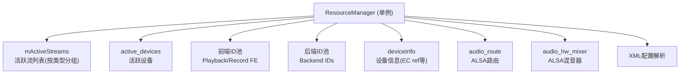

### 8.2 关键数据成员

| 成员 | 类型 | 说明 |
|------|------|------|
| `active_streams_ll/db/ull/comp/st/...` | `list<Stream*>` | 各类活跃流分列表 |
| `mActiveStreams` | `list<Stream*>` | 全部活跃流 |
| `active_devices` | `vector<pair<shared_ptr<Device>, Stream*>>` | 活跃设备及关联流 |
| `audio_route` | `struct audio_route*` | ALSA路由控制 |
| `audio_hw_mixer` | `struct audio_hw_mixer*` | ALSA硬件混音器 |
| `listAllPcmPlaybackFrontEnds` | `vector<int>` | PCM播放前端ID池 |
| `listAllPcmRecordFrontEnds` | `vector<int>` | PCM录音前端ID池 |
| `listAllCompressPlaybackFrontEnds` | `vector<int>` | Compress播放前端ID池 |
| `listAllBackEndIds` | `vector<pair<int32_t, string>>` | 后端ID列表 |
| `deviceInfo` | `vector<deviceIn>` | 设备信息(含EC ref映射) |
| `stream_instances[]` | `int[PAL_STREAM_MAX]` | 流实例计数 |

### 8.3 核心功能

#### 流注册/注销
- `registerStream(Stream *s)` - 根据流类型加入对应分列表
- `deregisterStream(Stream *s)` - 从列表移除

#### 设备路由
- `streamDevConnect(Stream*, shared_ptr<Device>)` - 流-设备连接(路由切换核心)
- `streamDevDisconnect(Stream*, shared_ptr<Device>)` - 流-设备断开

路由切换流程：断开旧设备 → 连接新设备 → 更新Session GKV/CKV → 重配ALSA路由

#### EC参考管理
- `updateECDeviceMap(shared_ptr<Device>, Stream*, bool)` - 更新EC设备映射
- EC ref映射关系在`deviceInfo`中定义，通过XML配置

#### 前端ID分配
- `allocateFrontEndIds(pal_stream_type_t, int dir)` - 从池中分配最小可用ID
- `freeFrontEndIds(int, pal_stream_type_t, int dir)` - 归还ID到池中

#### SSR处理
- `ssrHandlingLoop()` - 监听ADSP/CDSP的Subsystem Restart事件
- SSR发生时：暂停所有活跃流 → 等待DSP恢复 → 重新打开流

#### 并发流管理
- `ConcurrentStreamStatus(pal_stream_type_t)` - 并发流状态检查
- `getStreamAttrPriority(pal_stream_type_t)` - 流优先级获取
- 优先级：通话 > VoIP > 低延迟 > 深缓冲

#### XML配置解析
ResourceManager初始化时解析`resourcemanager_XXX.xml`，加载设备配置、前端/后端ID映射、EC ref映射、通话VSID配置、BT编解码器配置、增益映射等。

---

## 16.9 PayloadBuilder 载荷构建器

PayloadBuilder 负责构建与 GSL/AGM 交互的配置载荷，将高层音频参数转换为底层模块可识别的键值对格式。

> 源码路径：`session/inc/PayloadBuilder.h`

### 9.1 核心职责

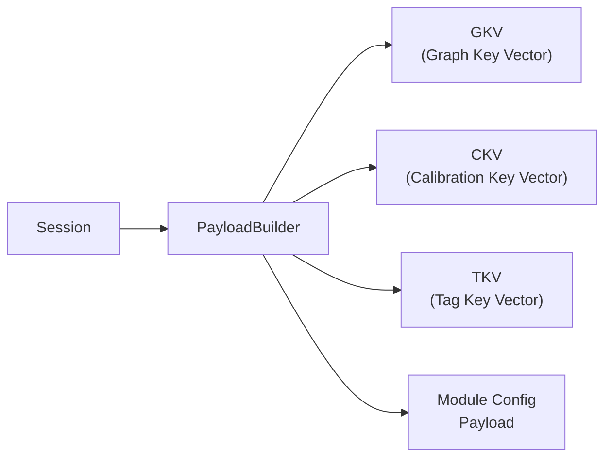

### 9.2 关键功能

| 功能 | 说明 |
|------|------|
| GKV构建 | 根据流类型和设备类型，构建图键向量，描述DSP上的音频处理拓扑 |
| CKV构建 | 根据采样率、位深、通道数等参数，构建校准键向量 |
| TKV构建 | 构建标签键向量，用于模块内部参数配置 |
| CODEC_DMA配置 | 编解码器DMA模块配置载荷 |
| I2S配置 | I2S接口模块配置载荷 |
| Media Format配置 | PCM/压缩格式参数配置载荷 |
| Volume/Mute配置 | 音量和静音配置载荷 |
| SRC配置 | 采样率转换器配置载荷 |

### 9.3 与GSL/AGM的交互

`PayloadBuilder → GKV/CKV/TKV → SessionGsl → AGM(agm_graph_open/set_config) → gsl_fe(代理) → MM-HAB → gsl_vm_be → GSL(gsl_graph_open/set_config) → APM`

> 在AudioReach架构下，PAL Session通过AGM API与GSL交互；SA8295上AGM调用GSL API由gsl_fe代理经MM-HAB跨VM转发给QNX侧gsl_vm_be执行；Legacy架构下直接调用GSL API。详见[17.10 AGM深度解析](17_Vendor_QNX_Architecture.md)和[17.14 GSL内部架构](17_Vendor_QNX_Architecture.md)。

---

## 16.10 IPC 机制

PAL 支持通过 HwBinder 进行进程间通信，允许 HAL 和 PAL 运行在不同进程中。

> 源码路径：`ipc/HwBinders/`

### 10.1 HIDL 接口定义

```mermaid
graph TB
    subgraph HAL_Process["HAL 进程"]
        HAL["Audio HAL"]
        IPC_Client["PAL IPC Client<br/>pal_client_wrapper.cpp"]
    end

    subgraph PAL_Process["PAL 进程"]
        IPC_Server["PAL IPC Server<br/>pal_server_wrapper.cpp"]
        PalCore["PAL Core"]
    end

    HAL --> IPC_Client
    IPC_Client -->|HwBinder<br/>vendor.qti.hardware.pal@1.0| IPC_Server
    IPC_Server --> PalCore
    PalCore -->|callback| IPC_Server
    IPC_Server -->|callback| IPC_Client
```

### 10.2 HIDL 接口文件

| 文件 | 说明 |
|------|------|
| `IPAL.hal` | 主接口，包含所有PAL API的IPC版本 |
| `IPALCallback.hal` | 回调接口，PAL向HAL层传递事件通知 |
| `types.hal` | 类型定义，映射PalDefs.h中的结构体 |

### 10.3 服务端与客户端

**服务端 (pal_ipc_server)**
> 源码路径：`ipc/HwBinders/pal_ipc_server/pal_server_wrapper.cpp`

- 实现 `IPAL.hal` 接口，转发到PAL API
- 将PAL回调通过 `IPALCallback` 传回客户端

**客户端 (pal_ipc_client)**
> 源码路径：`ipc/HwBinders/pal_ipc_client/pal_client_wrapper.cpp`、`PalCallback.h`

- 封装PAL API调用为HwBinder远程调用
- 提供 `PalCallback` 类接收服务端回调

### 10.4 IPC vs 直接调用

| 模式 | 适用场景 | 优势 | 劣势 |
|------|---------|------|------|
| 直接调用 | HAL与PAL同进程 | 零拷贝，低延迟 | 无隔离 |
| IPC模式 | HAL与PAL分进程 | 进程隔离，安全性高 | 额外拷贝和调度开销 |

---

## 16.11 XML 配置体系

PAL 通过 XML 配置文件适配不同平台，核心配置文件为 `resourcemanager_XXX.xml`。

> 源码路径：`configs/`

### 11.1 配置文件列表

| 文件 | 说明 |
|------|------|
| `resourcemanager_kona.xml` | Kona平台(SM8250/骁龙865) |
| `resourcemanager_lahaina.xml` | Lahaina平台(SM8350/骁龙888) |
| `resourcemanager_taro.xml` | Taro平台(SM8450/骁龙8 Gen1) |
| `resourcemanager_monaco.xml` | Monaco平台(SM7450) |
| `usecaseKvManager.xml` | 用例键值管理 |

### 11.2 配置结构

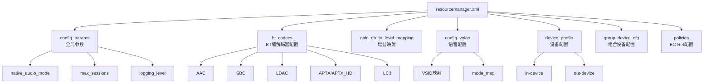

### 11.3 关键配置项详解

#### config_params - 全局参数

```xml
<config_params>
    <param native_audio_mode="true" />
    <param max_sessions="16" />
    <param logging_level="3" />
</config_params>
```

- `native_audio_mode`：是否启用原生音频模式(DSP处理)
- `max_sessions`：最大并发会话数
- `logging_level`：日志级别

#### bt_codecs - BT编解码器

支持AAC/SBC/LDAC/APTX/APTX_HD/LC3编解码器配置，指定编解码方向(enc/dec)。

#### device_profile - 设备配置

每个设备包含：`id`(设备ID)、`back_end_name`(ALSA后端名称)、`max_channels`(最大通道数)、`samplerate`(支持的采样率)、`snd_device_name`(ALSA声卡设备名称)、`usecase`(支持的流类型及优先级、sidetone_mode)

#### config_voice - 语音配置

- `vsid`：Voice Session ID，标识语音通话会话
- `mode_map`：通话模式映射

#### policies - EC Ref配置

定义每个输入设备的回声参考输出设备映射关系：
```xml
<policies>
    <ec_ref>
        <device id="PAL_DEVICE_IN_HANDSET_MIC">
            <rx_device id="PAL_DEVICE_OUT_SPEAKER" />
        </device>
    </ec_ref>
</policies>
```

#### group_device_cfg - 组合设备

定义可以同时使用的设备组合。

---

## 16.12 HAL-PAL 适配层

HAL-PAL 适配层是 Android Audio HAL 与 PAL API 之间的桥梁。

> 源码路径：`vendor/qcom/opensource/audio-hal-ar/primary-hal/hal-pal/`

### 12.1 架构

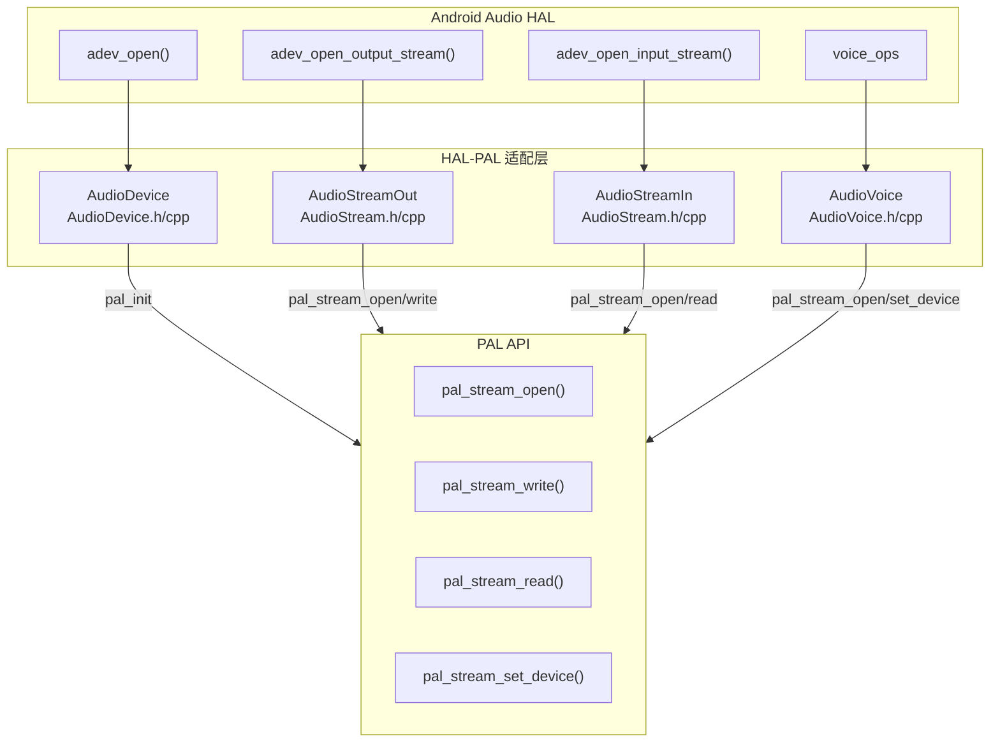

### 12.2 核心类

#### AudioDevice
> 源码路径：`hal-pal/AudioDevice.h`、`hal-pal/AudioDevice.cpp`

- 实现 `audio_hw_device` 接口
- `adev_open()` → `pal_init()`
- `adev_open_output_stream()` → 创建 `AudioStreamOut`
- 管理设备路由：`adev_set_parameters()` → `pal_stream_set_device()`

#### AudioStreamOut / AudioStreamIn
> 源码路径：`hal-pal/AudioStream.h`、`hal-pal/AudioStream.cpp`

- 实现 `audio_stream_out` / `audio_stream_in` 接口
- `out_write()` → `pal_stream_write()`；`in_read()` → `pal_stream_read()`
- `out_standby()` → `pal_stream_stop()`
- 生命周期：`open()` → `pal_stream_open()`，`close()` → `pal_stream_close()`

#### AudioVoice
> 源码路径：`hal-pal/AudioVoice.h`、`hal-pal/AudioVoice.cpp`

- 语音通话管理，`voice_start_call()` / `voice_stop_call()`
- 通话路由：`voice_set_device()` → `pal_stream_set_device()`

### 12.3 audio_extn 扩展
> 源码路径：`hal-pal/audio_extn/`

提供A2DP Offload扩展、旋屏处理、听筒校准、功耗优化等。

---

## 16.13 Plugins 插件体系

> 源码路径：`plugins/`

### 13.1 编解码器插件 (plugins/codecs/)

| 目录 | 说明 |
|------|------|
| `plugins/codecs/bt_aptx/` | aptX/aptX-HD 编解码器实现 |
| `plugins/codecs/bt_base/` | BT编解码器基类 |
| `plugins/codecs/bt_ble/` | BLE Audio (LC3) 编解码器实现 |
| `plugins/codecs/bt_bundle/` | BT编解码器打包 |

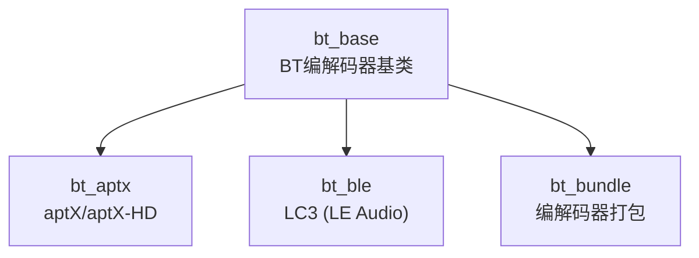

### 13.2 控制插件 (plugins/controls/)

| 文件 | 说明 |
|------|------|
| `plugins/controls/PluginControlIntf.h` | 控制插件接口定义 |
| `plugins/controls/defaultPluginControls.cpp` | 默认控制实现 |

---

## 16.14 Utils 工具集

> 源码路径：`utils/`

| 工具 | 源码 | 说明 |
|------|------|------|
| PalRingBuffer | `utils/PalRingBuffer.h/cpp` | PAL环形缓冲区，流数据缓冲 |
| ChargerListener | `utils/ChargerListener.h/cpp` | 充电器状态监听，影响音频路由 |
| SoundTriggerPlatformInfo | `utils/SoundTriggerPlatformInfo.h/cpp` | ST平台信息，SVA模型和引擎配置 |
| XmlParser | `utils/XmlParser.h/cpp` | 通用XML解析工具 |
| ACDPlatformInfo | `utils/ACDPlatformInfo.h/cpp` | ACD平台信息，ACD场景和模型配置 |
| SoundTriggerUtils | `utils/SoundTriggerUtils.h/cpp` | ST工具函数，模型加载/卸载等 |

### PalRingBuffer
环形缓冲区用于流数据中间缓冲：`写入端(Stream.write) → [RingBuffer] → 读取端(Session.write/AGM→gsl_fe→HAB→gsl_vm_be→GSL)`。支持多读者单写者模式，无锁设计。

### ChargerListener
监听充电状态变化，通过uevent监听充电事件，回调通知ResourceManager更新路由。

---

## 16.15 ContextManager 上下文管理

> 源码路径：`context_manager/`

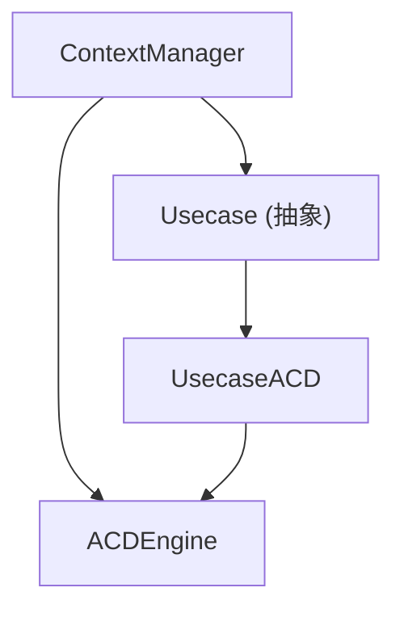

- **ContextManager**：上下文管理器，协调用例和引擎
- **Usecase**：用例抽象基类，定义检测场景
- **UsecaseACD**：ACD用例实现

---

## 16.16 SndCardMonitor 声卡监控

> 源码路径：`resource_manager/inc/SndCardMonitor.h`

### 16.1 核心功能

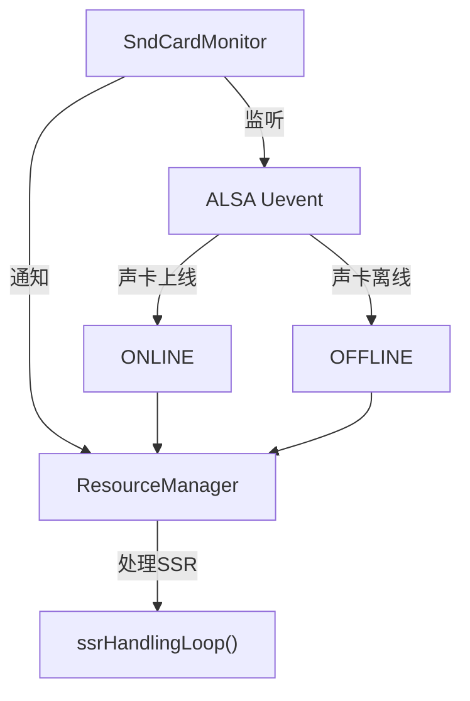

### 16.2 SSR 处理流程

1. SndCardMonitor 监听 `/dev/snd/` 下的 uevent
2. 检测到 ADSP/CDSP 子系统重启事件（声卡OFFLINE）
3. 通知 ResourceManager 触发 SSR 处理
4. RM执行：暂停所有活跃流 → 等待声卡重新上线 → 重新打开和恢复所有流

### 16.3 关键接口

```cpp
class SndCardMonitor {
    void startMonitor();
    void stopMonitor();
    void onSndCardStateChange(snd_card_state_t state);
};
```

声卡状态：`SND_CARD_STATE_ONLINE`(在线)、`SND_CARD_STATE_OFFLINE`(离线/SSR)

---

## 16.17 核心流程分析

### 16.17.1 播放流完整生命周期

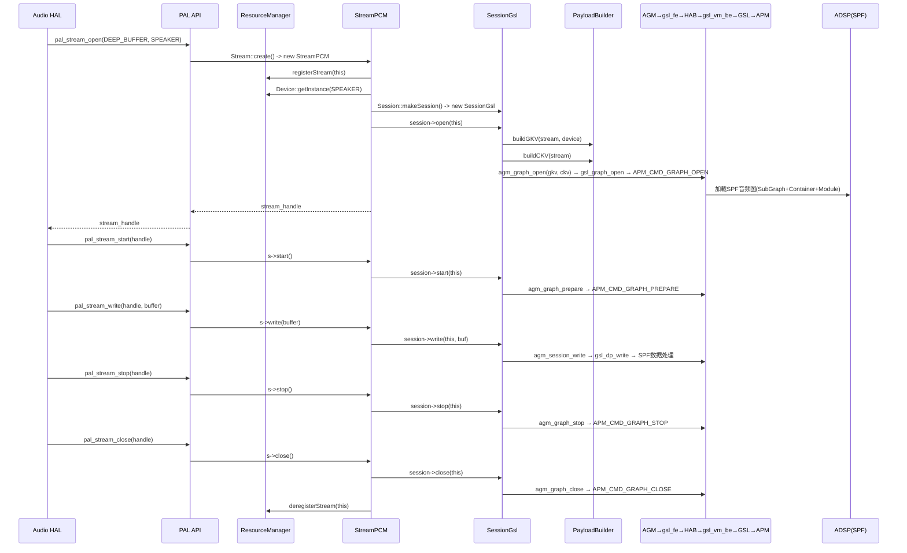

### 16.17.2 设备路由切换流程

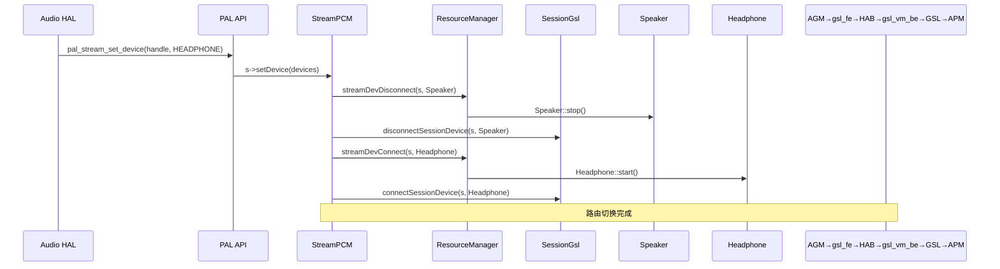

### 16.17.3 SSR 处理流程

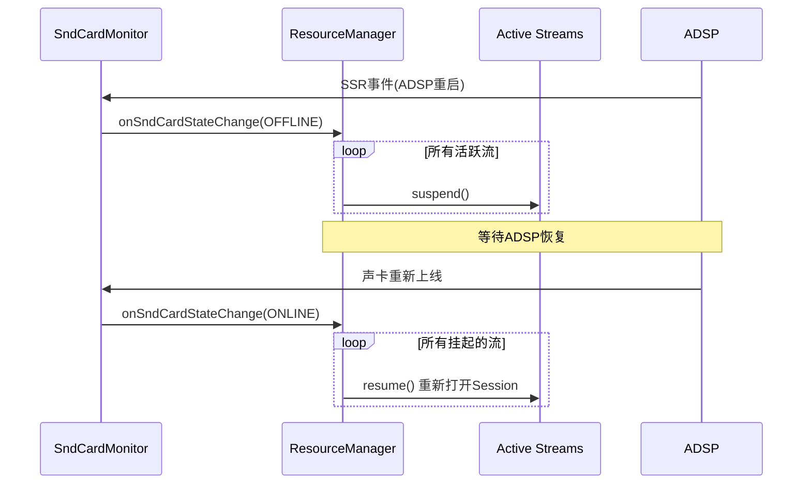

### 16.17.4 语音触发(SVA)流程

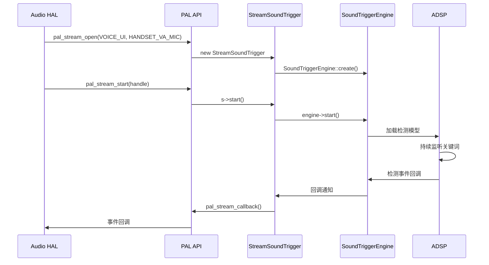

### 16.17.5 EC回声消除参考设置流程

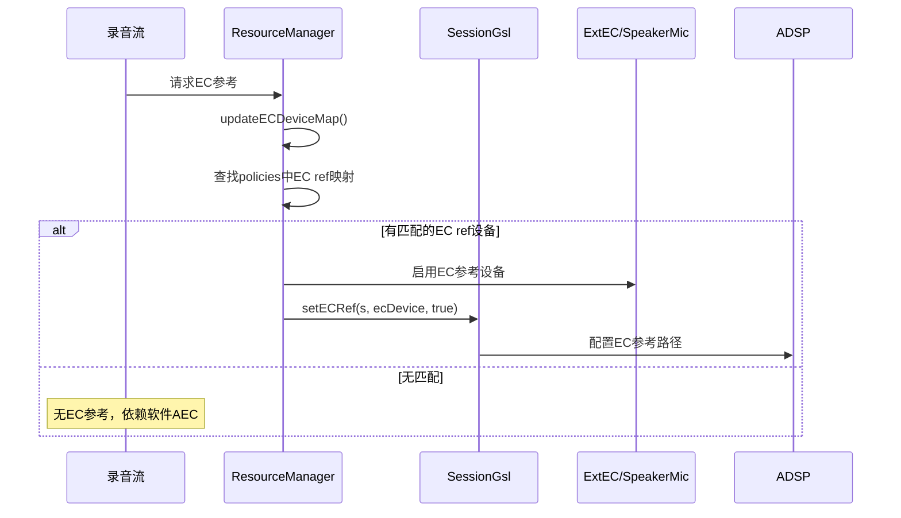

---

## 附录：Stream-Session-Device 映射关系

| Stream 类型 | Session 类型 | 典型 Device | 数据路径 |
|-------------|-------------|-------------|---------|
| `PAL_STREAM_LOW_LATENCY` | SessionGsl / SessionAlsaPcm | Speaker / Headphone / BT | DSP Tunnel / Non-Tunnel |
| `PAL_STREAM_DEEP_BUFFER` | SessionGsl / SessionAlsaPcm | Speaker / Headphone / BT | DSP Tunnel |
| `PAL_STREAM_COMPRESSED` | SessionAlsaCompress | Speaker / Headphone / BT | DSP Offload |
| `PAL_STREAM_VOIP` | SessionGsl | Speaker + SpeakerMic | DSP Tunnel (双向) |
| `PAL_STREAM_VOICE_CALL` | SessionAlsaVoice | Handset / Speaker + Mic | DSP Voice |
| `PAL_STREAM_VOICE_UI` | SoundTriggerEngine | HandsetVaMic / HeadsetVaMic | DSP SVA |
| `PAL_STREAM_ACD` | ACDEngine | HandsetVaMic | DSP ACD |
| `PAL_STREAM_HAPTICS` | SessionGsl | HapticsDev | DSP Tunnel |
| `PAL_STREAM_ULTRASOUND` | SessionGsl | UltrasoundDevice | DSP |
| `PAL_STREAM_PLAYBACK_BUS` | SessionGsl | A2BSpeaker | DSP Tunnel (AAOS) |
| `PAL_STREAM_NON_TUNNEL` | SessionAlsaPcm | Speaker / Headphone | Non-Tunnel |

---

> [← 上一篇：Bluetooth Audio](14_Bluetooth_Audio.md) | [返回导航](README.md) | [下一篇：Vendor+QNX双域架构 →](17_Vendor_QNX_Architecture.md)
| `PAL_STREAM_LOOPBACK` | SessionGsl | RTProxy | DSP Loopback |