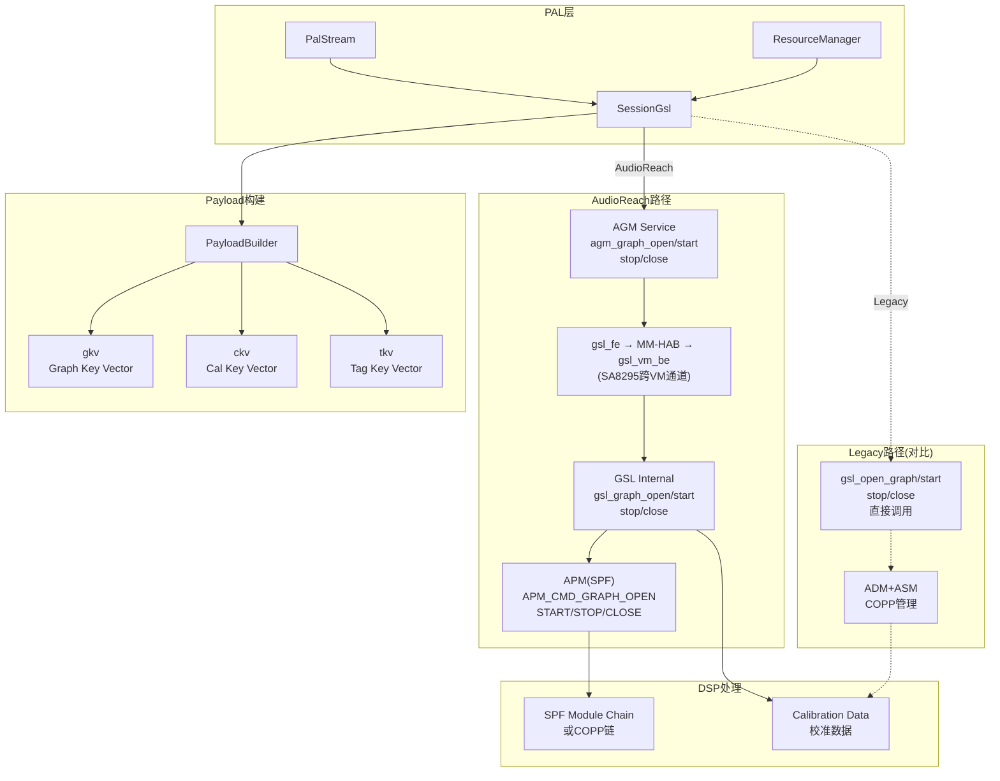
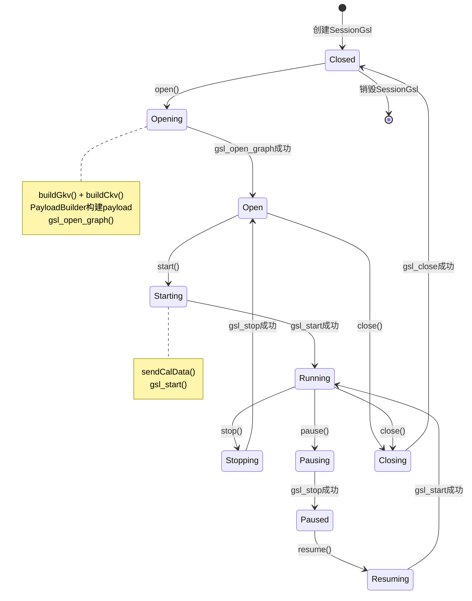
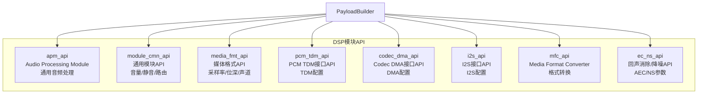

[← N.10 AGM(Audio Graph](16_10.1_AGMAudio_Graph_Manager深度解.md) | [← 返回SA8295 Vendor+QNX双域音频架构深度解析](README.md) | [返回导航](../README.md) | [N.12 Android+QNX双域架构 →](16_12.1_Android+QNX双域架构总结.md)

---

N.11 SessionGsl与GSL接口

N.11.1 概述

`SessionGsl`是PAL层Session子系统的一种实现，负责管理DSP音频图的创建、配置、启停和销毁。它将PAL Stream的音频语义转换为底层Graph操作。

> **架构说明**：在8295 AudioReach架构下，PAL通过AGM Service与DSP交互（PAL→AGM→gsl_fe→MM-HAB→gsl_vm_be→GSL→APM→SPF），SessionGsl的实现通过AGM API调用GSL服务。本章节保留GSL接口的详细描述（Legacy架构下SessionGsl直接调用GSL），以帮助理解GSL层的内部机制——这些机制在AudioReach架构下由AGM Service封装后，在GVM上通过libar-gsl_fe.so代理经MM-HAB跨VM转发给QNX侧gsl_vm_be执行。



N.11.2 SessionGsl类定义

```cpp
class SessionGsl : public Session {
public:
    SessionGsl(std::shared_ptr<ResourceManager> rm);
    virtual ~SessionGsl();

    // Session基类接口实现
    int open(Stream *s) override;
    int start(Stream *s) override;
    int stop(Stream *s) override;
    int close(Stream *s) override;
    int pause(Stream *s) override;
    int resume(Stream *s) override;
    int write(Stream *s, struct pal_buffer *buf) override;
    int read(Stream *s, struct pal_buffer *buf) override;
    int setParameters(Stream *s, uint32_t param_id,
                      void *payload) override;
    int getParameters(Stream *s, uint32_t param_id,
                      void **payload) override;

private:
    // GSL Graph句柄
    graph_handle_t graphHandle;

    // Key Vectors
    struct gsl_key_vector gkv;    // Graph Key Vector
    struct gsl_key_vector ckv;    // Cal Key Vector
    struct gsl_key_vector tkv;    // Tag Key Vector

    // Payload构建器
    std::shared_ptr<PayloadBuilder> payloadBuilder;

    // 辅助方法
    int buildGkv(Stream *s);
    int buildCkv(Stream *s);
    int buildTkv(Stream *s);
    int configureGraph(Stream *s);
    int sendCalData(Stream *s);
};
```

N.11.3 gsl_key_vector详解

GSL使用键值对(key-value pair)向量来描述和配置Graph，这是GSL的核心抽象：

```cpp
// gsl_key_vector结构定义
struct gsl_key_vector {
    uint32_t num_kv_pairs;           // 键值对数量
    struct gsl_key_value_pair *kvp;  // 键值对数组
};

struct gsl_key_value_pair {
    uint32_t key;                    // 参数键
    uint32_t value;                  // 参数值
};
```

#### 三种Key Vector的职责

| Key Vector | 全称 | 用途 | 设置时机 |
|-----------|------|------|---------|
| **gkv** | Graph Key Vector | 定义Graph的拓扑结构(流类型+设备类型) | open时设置 |
| **ckv** | Cal Key Vector | 定义校准参数(音量/增益等) | open/start时设置 |
| **tkv** | Tag Key Vector | 定义模块标签(特定DSP模块实例) | 配置阶段设置 |

#### gkv构建示例

```cpp
int SessionGsl::buildGkv(Stream *s) {
    struct pal_stream_attributes *attr = s->getAttributes();
    std::vector<std::pair<uint32_t, uint32_t>> gkv_pairs;

    // 流类型键值对
    gkv_pairs.push_back({STREAMRX, attr->type});  // 如PAL_STREAM_DEEP_BUFFER

    // 设备类型键值对
    for (auto& dev : s->getAssociatedDevices()) {
        gkv_pairs.push_back({DEVICERX, dev->getDeviceId()});
        // 如PAL_DEVICE_OUT_SPEAKER
    }

    // 实例ID键值对
    gkv_pairs.push_back({INSTANCE, instance_id});

    // 填充gkv结构
    gkv.num_kv_pairs = gkv_pairs.size();
    gkv.kvp = new gsl_key_value_pair[gkv.num_kv_pairs];
    for (size_t i = 0; i < gkv_pairs.size(); i++) {
        gkv.kvp[i].key = gkv_pairs[i].first;
        gkv.kvp[i].value = gkv_pairs[i].second;
    }

    return 0;
}
```

#### ckv构建示例

```cpp
int SessionGsl::buildCkv(Stream *s) {
    std::vector<std::pair<uint32_t, uint32_t>> ckv_pairs;

    // 音量校准键值对
    ckv_pairs.push_back({VOLUME, s->getVolume()});

    // 采样率校准
    ckv_pairs.push_back({SAMPLINGRATE, s->getSampleRate()});

    // 增益校准
    ckv_pairs.push_back({GAIN, s->getGain()});

    // 填充ckv结构
    ckv.num_kv_pairs = ckv_pairs.size();
    ckv.kvp = new gsl_key_value_pair[ckv.num_kv_pairs];
    for (size_t i = 0; i < ckv_pairs.size(); i++) {
        ckv.kvp[i].key = ckv_pairs[i].first;
        ckv.kvp[i].value = ckv_pairs[i].second;
    }

    return 0;
}
```

N.11.4 Session生命周期



N.11.5 open()实现

```cpp
int SessionGsl::open(Stream *s) {
    int ret = 0;

    // Step 1: 构建Key Vectors
    ret = buildGkv(s);
    if (ret) goto error;

    ret = buildCkv(s);
    if (ret) goto error;

    ret = buildTkv(s);
    if (ret) goto error;

    // Step 2: 构建Payload
    std::vector<std::pair<int, void *>> payload_list;
    ret = payloadBuilder->buildPayload(s, &payload_list);
    if (ret) goto error;

    // Step 3: 打开GSL Graph
    ret = gsl_open_graph(&gkv, &graphHandle);
    if (ret) {
        ALOGE("gsl_open_graph failed: %d", ret);
        goto error;
    }

    // Step 4: 配置Graph（发送模块配置）
    ret = configureGraph(s);
    if (ret) goto error;

    // Step 5: 发送校准数据
    ret = sendCalData(s);
    if (ret) goto error;

    return 0;

error:
    if (graphHandle) {
        gsl_close(graphHandle);
        graphHandle = nullptr;
    }
    return ret;
}
```

N.11.6 start()/stop()/close()实现

```cpp
int SessionGsl::start(Stream *s) {
    int ret = gsl_start(graphHandle);
    if (ret) {
        ALOGE("gsl_start failed: %d", ret);
    }
    return ret;
}

int SessionGsl::stop(Stream *s) {
    int ret = gsl_stop(graphHandle);
    if (ret) {
        ALOGE("gsl_stop failed: %d", ret);
    }
    return ret;
}

int SessionGsl::close(Stream *s) {
    int ret = 0;

    if (graphHandle) {
        // 停止Graph
        gsl_stop(graphHandle);

        // 关闭Graph
        ret = gsl_close(graphHandle);
        if (ret) {
            ALOGE("gsl_close failed: %d", ret);
        }
        graphHandle = nullptr;
    }

    // 释放Key Vector资源
    delete[] gkv.kvp;
    delete[] ckv.kvp;
    delete[] tkv.kvp;
    gkv.num_kv_pairs = 0;
    ckv.num_kv_pairs = 0;
    tkv.num_kv_pairs = 0;

    return ret;
}
```

N.11.7 PayloadBuilder

`PayloadBuilder`将PAL的Stream/Device参数转换为DSP可识别的payload，依赖`kvh2xml.h`键值映射表：

```cpp
class PayloadBuilder {
public:
    // 构建完整payload
    int buildPayload(Stream *s,
                     std::vector<std::pair<int, void *>> *payload_list);

    // 构建特定模块payload
    int buildPcmTdmPayload(struct pcm_tdm_config *cfg,
                           void **payload, size_t *size);
    int buildCodecDmaPayload(struct codec_dma_config *cfg,
                             void **payload, size_t *size);
    int buildI2sPayload(struct i2s_config *cfg,
                        void **payload, size_t *size);
    int buildMediaFmtPayload(struct media_format *fmt,
                             void **payload, size_t *size);
    int buildVolumePayload(struct volume_config *cfg,
                           void **payload, size_t *size);
    int buildMfcPayload(struct mfc_config *cfg,
                        void **payload, size_t *size);

    // 通用payload构建
    int buildGenericPayload(uint32_t module_id, uint32_t param_id,
                            void *param_data, size_t param_size,
                            void **payload, size_t *payload_size);
};
```

#### Payload结构

```cpp
// DSP模块payload通用头
struct apm_module_param_data {
    uint32_t module_instance_id;    // 模块实例ID
    uint32_t param_id;              // 参数ID
    uint32_t param_size;            // 参数数据大小
    uint32_t error_code;            // 错误码(由DSP填写)
};

// 完整payload = header + param_data
// [apm_module_param_data][param_data...]
```

N.11.8 DSP模块API体系

PayloadBuilder支持多种DSP模块API，每种API对应不同的音频处理功能：



#### 模块API示例：pcm_tdm_api

```cpp
// PCM TDM配置payload
struct pcm_tdm_module_config {
    struct apm_module_param_data param_data;  // 通用头
    uint32_t tdm_cfg_minor_version;           // 版本
    uint32_t lane_ctrl;                       // Lane控制
    uint32_t port_id;                         // 端口ID
    uint32_t bit_width;                       // 位宽
    uint32_t channel;                         // 通道数
    uint32_t sample_rate;                     // 采样率
    uint32_t sync_src;                        // 同步源
    uint32_t ctrl_data_out_enable;            // 数据输出使能
    uint32_t ctrl_invert_sync;                // 反相同步
    uint32_t ctrl_sync_res;                   // 同步分辨率
    uint32_t ctrl_clk_framed;                 // 时钟帧模式
    uint32_t slot_width;                      // Slot宽度
    uint32_t slot_mask;                       // Slot掩码
    uint32_t data_format;                     // 数据格式
    uint32_t pcm_width;                       // PCM宽度
};
```

#### 模块API示例：media_fmt_api

```cpp
// 媒体格式payload
struct media_format_module_config {
    struct apm_module_param_data param_data;
    uint32_t minor_version;
    uint32_t sample_rate;                     // 采样率
    uint16_t bit_width;                       // 位宽
    uint16_t channel_count;                   // 通道数
    uint8_t  channel_mapping[8];              // 通道映射
    uint32_t data_format;                     // 数据格式
    uint32_t alignment;                       // 对齐方式
    uint32_t bit_depth;                       // 位深度
    uint32_t packet_size;                     // 包大小
};
```

N.11.9 kvh2xml键值映射

`kvh2xml.h`定义了PAL语义键到DSP模块参数的映射关系：

```cpp
// kvh2xml.h关键映射定义
// Stream类型到DSP模块的映射
static const struct kvh2xml_entry stream_kv_map[] = {
    {PAL_STREAM_LOW_LATENCY,       STREAMRX, 0xB3000001},
    {PAL_STREAM_DEEP_BUFFER,       STREAMRX, 0xB3000002},
    {PAL_STREAM_COMPRESSED,        STREAMRX, 0xB3000003},
    {PAL_STREAM_VOIP,              STREAMRX, 0xB3000005},
    {PAL_STREAM_VOICE_CALL,        STREAMRX, 0xB3000006},
    {PAL_STREAM_GENERIC_CHIME,     STREAMRX, 0xB300000B},
    {PAL_STREAM_NAVI,              STREAMRX, 0xB300000E},
};

// Device类型到DSP模块的映射
static const struct kvh2xml_entry device_kv_map[] = {
    {PAL_DEVICE_OUT_SPEAKER,       DEVICERX, 0xB3000015},
    {PAL_DEVICE_OUT_HDMI,          DEVICERX, 0xB3000012},
    {PAL_DEVICE_OUT_BLUETOOTH_A2DP,DEVICERX, 0xB300001A},
    {PAL_DEVICE_IN_HANDSET_MIC,    DEVICETX, 0xB3000004},
    {PAL_DEVICE_IN_BLUETOOTH_SCO,  DEVICETX, 0xB3000017},
};

// 校准键映射
static const struct kvh2xml_entry cal_kv_map[] = {
    {VOLUME,      CAL_KEY_VOLUME, 0xB3000001},
    {GAIN,        CAL_KEY_GAIN,   0xB3000002},
    {SAMPLINGRATE,CAL_KEY_RATE,   0xB3000003},
};
```

N.11.10 configureGraph()实现

```cpp
int SessionGsl::configureGraph(Stream *s) {
    int ret = 0;

    // 获取流和设备属性
    struct pal_stream_attributes *attr = s->getAttributes();
    auto devices = s->getAssociatedDevices();

    // 1. 配置媒体格式模块
    struct media_format_module_config media_cfg;
    memset(&media_cfg, 0, sizeof(media_cfg));
    media_cfg.sample_rate = attr->in_media_config.sample_rate;
    media_cfg.bit_width = attr->in_media_config.bit_width;
    media_cfg.channel_count = attr->in_media_config.ch_info.channels;

    void *media_payload = nullptr;
    size_t media_payload_size = 0;
    ret = payloadBuilder->buildMediaFmtPayload(&media_cfg,
            &media_payload, &media_payload_size);
    if (ret) goto exit;

    ret = gsl_set_config(graphHandle, &gkv, 0, media_payload);
    free(media_payload);

    // 2. 配置设备接口模块（TDM/I2S/CodecDMA）
    for (auto& dev : devices) {
        void *dev_payload = nullptr;
        size_t dev_payload_size = 0;

        switch (dev->getDeviceInterface()) {
        case TDM_INTERFACE:
            ret = payloadBuilder->buildPcmTdmPayload(
                dev->getConfig(), &dev_payload, &dev_payload_size);
            break;
        case CODEC_DMA_INTERFACE:
            ret = payloadBuilder->buildCodecDmaPayload(
                dev->getConfig(), &dev_payload, &dev_payload_size);
            break;
        case I2S_INTERFACE:
            ret = payloadBuilder->buildI2sPayload(
                dev->getConfig(), &dev_payload, &dev_payload_size);
            break;
        }

        if (ret) goto exit;

        ret = gsl_set_config(graphHandle, &gkv, 0, dev_payload);
        free(dev_payload);
    }

    // 3. 配置音量模块
    void *vol_payload = nullptr;
    size_t vol_payload_size = 0;
    ret = payloadBuilder->buildVolumePayload(s->getVolumeConfig(),
            &vol_payload, &vol_payload_size);
    if (!ret) {
        gsl_set_config(graphHandle, &gkv, 0, vol_payload);
        free(vol_payload);
    }

exit:
    return ret;
}
```

---

---

[← N.10 AGM(Audio Graph](16_10.1_AGMAudio_Graph_Manager深度解.md) | [← 返回SA8295 Vendor+QNX双域音频架构深度解析](README.md) | [返回导航](../README.md) | [N.12 Android+QNX双域架构 →](16_12.1_Android+QNX双域架构总结.md)
