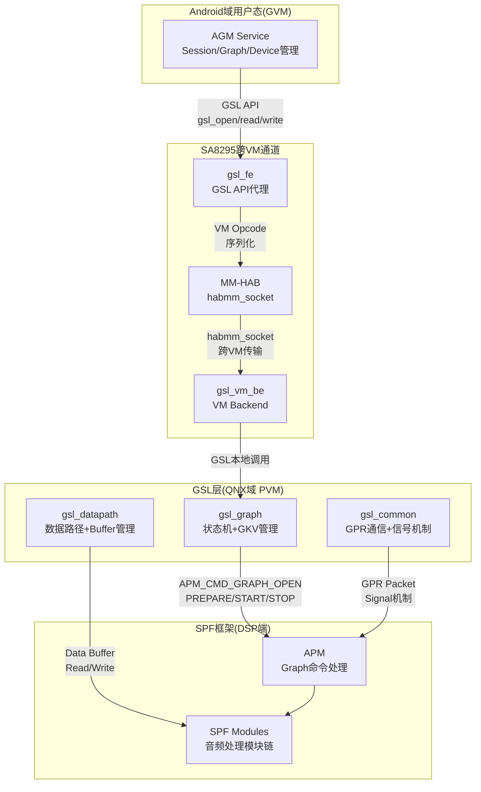
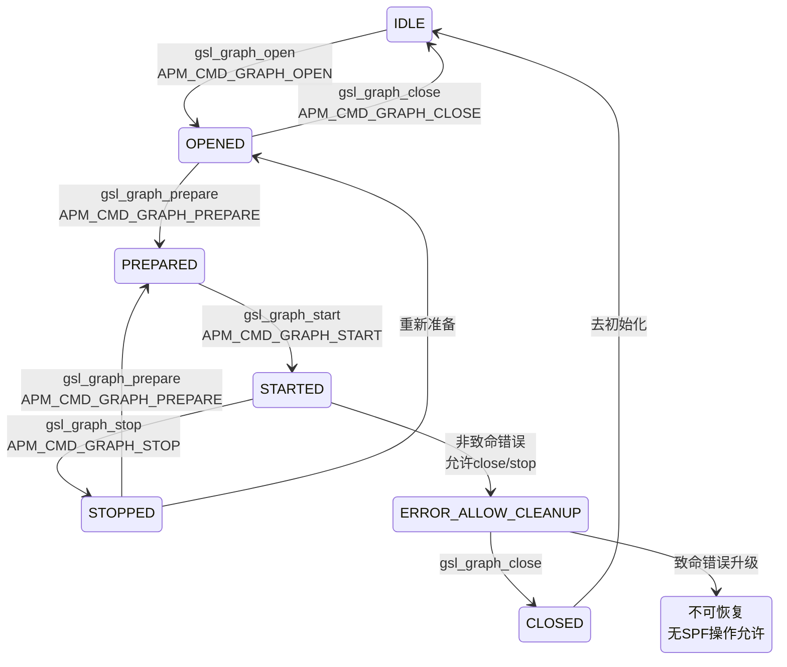
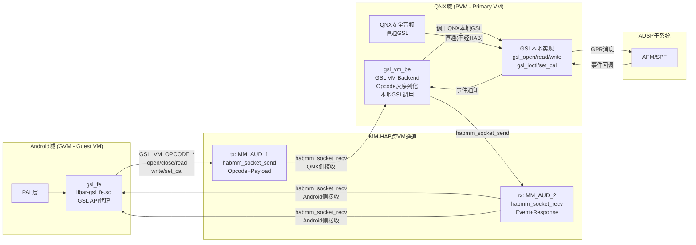

[← N.13 Primary HAL(Aud](16_13.1_Primary_HALAudioReach版深度解.md) | [← 返回SA8295 Vendor+QNX双域音频架构深度解析](README.md) | [返回导航](../README.md) | [N.15 常见问题与解答(Q&A) →](16_15.1_常见问题与解答Q&A.md)

---

N.14 GSL(Graph Service Layer)内部架构深度解析

N.14.1 概述与架构定位

GSL(Graph Service Layer)是DSP端AudioReach架构的Graph服务层，位于AGM Service和APM(SPF)之间。在SA8295虚拟化架构下，GSL运行在QNX域(PVM)，Android域(GVM)的AGM Service通过gsl_fe→MM-HAB→gsl_vm_be跨VM通道与GSL交互。GSL负责Graph的创建、状态管理、数据路径配置和GPR通信，是DSP Graph操作的核心引擎。

**源码路径**：`vendor/qcom/proprietary/args/gsl/inc/`（私有源码）

**GSL在AudioReach架构中的位置**：



N.14.2 Graph状态机

GSL Graph遵循严格的状态机模型，每个状态对应特定的SPF命令和允许的操作（[`gsl_graph.h`](vendor/qcom/proprietary/args/gsl/inc/gsl_graph.h)）。



**状态详细说明**：

| 状态 | 描述 | 允许的操作 |
|------|------|-----------|
| GRAPH_IDLE | 初始化完成，等待open | open |
| GRAPH_OPENED | Graph在SPF上成功打开 | prepare, close, set_config, add_new, change |
| GRAPH_STARTED | Graph在SPF上运行 | stop, write, read, set_config, flush |
| GRAPH_STOPPED | Graph在SPF上停止 | prepare, close, start |
| GRAPH_CLOSED | Graph在SPF上关闭，未去初始化 | re-init |
| GRAPH_ERROR_ALLOW_CLEANUP | 非致命错误，允许清理操作 | close, stop |
| GRAPH_ERROR | 不可恢复错误 | 无SPF操作 |

**控制信号分组**：

| 信号组 | 包含操作 | 说明 |
|--------|---------|------|
| GRAPH_CTRL_GRP1_CMD_SIG | OPEN, CLOSE, PREPARE, START, STOP, CONFIGURE_READ/WRITE_BUFFERS | 串行化控制命令 |
| GRAPH_CTRL_GRP2_CMD_SIG | SET_CFG, REGISTER_CFG, FLUSH, REGISTER_MODULE_EVENTS | 并行配置命令 |

N.14.3 GKV Node与SubGraph管理

GKV(Graph Key Vector)Node是GSL管理Graph的核心数据结构，每个GKV对应一组SubGraph。

**gsl_graph_gkv_node结构**（[`gsl_graph.h`](vendor/qcom/proprietary/args/gsl/inc/gsl_graph.h)）：

```cpp
struct gsl_graph_gkv_node {
    ar_list_node_t node;                   // 链表节点
    struct gsl_key_vector gkv;             // Graph Key Vector
    struct gsl_key_vector ckv;             // Calibration Key Vector
    uint32_t num_of_subgraphs;             // SubGraph数量
    struct gsl_subgraph **sg_array;        // SubGraph指针数组
    uint32_t num_of_gp_cals;               // 全局持久校准数
    struct gsl_glbl_persist_cal_iid_list *glbl_persist_cal_list;
    struct gsl_graph_sg_conn_data sg_conn_data;  // SubGraph连接数据

    uint32_t sg_stop_mask;                 // SubGraph停止位掩码(最多32个)
    uint32_t sg_start_mask;                // SubGraph启动位掩码(最多32个)
    uint32_t spf_ss_mask;                  // SPF子系统掩码(ADSP/CDSP等)
    struct gsl_graph_rtc_cache rtc_cache;  // 实时校准缓存
};
```

**SubGraph连接数据**：

```cpp
struct gsl_graph_sg_conn_data {
    uint32_t num_sgs;                      // SubGraph数量
    size_t size;                           // 连接数据大小
    AcdbSubgraph *subgraphs;               // ACDB SubGraph数据
};
```

**RTGM(Real-Time Graph Change)缓存**：

```cpp
struct gsl_graph_rtc_cache {
    struct gsl_sgid_list pruned_plus_reopen_sgids;     // 需重新打开的SG ID列表
    struct gsl_graph_sg_conn_data pruned_plus_reopen_sg_conn;  // 需重新打开的SG连接数据
};
```

**gsl_graph核心结构**：

```cpp
struct gsl_graph {
    enum gsl_graph_states graph_state;      // 当前状态
    ar_osal_mutex_t graph_lock;             // Graph操作锁
    ar_osal_mutex_t get_set_cfg_lock;       // 配置操作锁
    struct gsl_signal graph_signal[GRAPH_CMD_SIG_MAX]; // 控制信号数组
    struct gsl_transient_state_info transient_state_info; // 瞬态信息
    uint32_t src_port;                      // GPR源端口
    uint32_t proc_id;                       // 处理器ID
    struct gsl_data_path_info read_info;    // 读数据路径
    struct gsl_data_path_info write_info;   // 写数据路径
    gsl_cb_func_ptr cb;                     // 客户端回调
    void *client_data;                      // 客户端数据
    uint32_t num_gkvs;                      // GKV数量
    struct ar_list_t gkv_list;              // GKV链表
    ar_osal_mutex_t gkv_list_lock;          // GKV链表锁
    uint32_t ss_mask;                       // SPF子系统掩码
};
```

N.14.4 GPR通信与信号机制

GSL通过GPR(Generic Packet Router)与SPF/APM通信，信号机制用于同步命令响应（[`gsl_common.h`](vendor/qcom/proprietary/args/gsl/inc/gsl_common.h)）。

**GPR域ID配置**：

| 常量 | 值 | 说明 |
|------|-----|------|
| GSL_GPR_SRC_DOMAIN_ID | GPR_IDS_DOMAIN_ID_APPS_V | APPS域(源) |
| GSL_GPR_DST_DOMAIN_ID | GPR_IDS_DOMAIN_ID_ADSP_V | ADSP域(目标) |

**SPF超时配置**：

| 常量 | 值(ms) | 说明 |
|------|--------|------|
| GSL_SPF_TIMEOUT_MS | 1000 | SPF通用超时 |
| GSL_GRAPH_OPEN_TIMEOUT_MS | 4000 | Graph Open超时(更长) |
| GSL_SPF_READ_WRITE_TIMEOUT_MS | 1000 | Read/Write超时 |

**信号事件掩码**：

| 事件掩码 | 值 | 说明 |
|----------|-----|------|
| GSL_SIG_EVENT_MASK_SPF_RSP | 0x1 | SPF响应收到 |
| GSL_SIG_EVENT_MASK_CLOSE | 0x2 | 客户端触发close |
| GSL_SIG_EVENT_MASK_RTGM_DONE | 0x4 | 实时Graph切换完成 |
| GSL_SIG_EVENT_CLIENT_OP_DONE | 0x8 | 客户端操作完成 |
| GSL_SIG_EVENT_MASK_SSR | 0x10 | SSR(子系统重启)事件 |

**GSL信号结构**：

```cpp
struct gsl_signal {
    ar_osal_signal_t sig;        // OS信号对象
    ar_osal_mutex_t *lock;       // 同步锁
    uint32_t flags;              // 事件标志(SPF_RSP/CLOSE/RTGM_DONE/SSR)
    int32_t status;              // 信号状态
    void *gpr_packet;            // GPR包指针(携带响应数据)
};
```

**GPR命令发送流程**：

```cpp
// 1. 分配GPR包
gsl_allocate_gpr_packet(opcode, src_port, dst_port, payload_size,
                         token, dest_domain, &packet);
// 2. 发送并等待响应
gsl_send_spf_cmd(&packet, &signal, &rsp_pkt);
// 或发送并等待basic response
gsl_send_spf_cmd_wait_for_basic_rsp(&packet, &signal);
```

**SPF Basic Response**：

```cpp
struct spf_cmd_basic_rsp {
    uint32_t opcode;     // 响应的操作码
    int32_t status;      // 执行状态码
};
```

N.14.5 DataPath与Buffer管理

GSL DataPath负责Graph的数据读写路径管理，包括Buffer分配、队列管理和SPF数据传输（[`gsl_datapath.h`](vendor/qcom/proprietary/args/gsl/inc/gsl_datapath.h)）。

**Buffer内部结构**：

```cpp
struct gsl_buff_internal {
    gsl_msg_t gsl_msg;               // 内存分配消息
    uint32_t size_from_spf;          // SPF返回的数据大小(读场景)
    uint64_t spf_timestamp;          // SPF时间戳(读场景)
    uint32_t spf_flags;              // SPF标志(读场景)
};

struct gsl_metadata_buff_internal {
    gsl_msg_t gsl_msg;               // 内存分配消息
    uint8_t *client_md_ptr;          // 客户端Metadata缓冲区
    uint32_t size;                   // Metadata大小
    uint32_t md_size_from_spf;       // SPF返回的Metadata大小
    uint32_t md_status_from_spf;     // SPF返回的Metadata状态
};
```

**DataPath信息结构**：

```cpp
struct gsl_data_path_info {
    struct gsl_cmd_configure_read_write_params config; // 客户端配置
    struct gsl_buff_internal *buff_list;               // Buffer数组(最多16个)
    struct gsl_metadata_buff_internal *md_buff_list;   // Metadata Buffer数组
    struct gsl_signal dp_signal;                       // DataPath信号
    int32_t buff_used_status;                          // Buffer使用位掩码
    int32_t curr_buff_index;                           // 当前Buffer索引
    uint32_t miid;                                     // 缓存的Module IID
    uint32_t cached_tag;                               // 缓存的Tag ID
    uint32_t processed_buf_cnt;                        // 已处理Buffer计数
    uint32_t src_port;                                 // GPR源端口
    bool_t oob_metadata_flag;                          // OOB Metadata标志
    uint32_t master_proc_id;                           // 主处理器ID
    bool_t is_shmem_supported;                         // 共享内存支持标志
};
```

**DataPath核心API**：

| API | 说明 |
|-----|------|
| gsl_data_path_init | 初始化数据路径 |
| gsl_data_path_deinit | 去初始化数据路径 |
| gsl_dp_config_data_path | 配置数据路径(读写方向/Buffer数/共享内存) |
| gsl_dp_read | 从SPF读取数据 |
| gsl_dp_write | 向SPF写入数据 |
| gsl_dp_write_send_eos | 发送EOS标记 |
| gsl_handle_read_buff_done | 处理读Buffer完成回调 |
| gsl_handle_write_buff_done | 处理写Buffer完成回调 |
| gsl_dp_queue_read_buffers_to_spf | 将读Buffer队列提交给SPF |
| gsl_wait_for_all_buffs_to_be_avail | 等待所有Buffer可用 |

N.14.6 Graph操作API汇总

| API | 对应APM命令 | 说明 |
|-----|-------------|------|
| gsl_graph_open | APM_CMD_GRAPH_OPEN | 打开Graph(加载GKV到SPF) |
| gsl_graph_prepare | APM_CMD_GRAPH_PREPARE | 准备Graph(配置数据路径) |
| gsl_graph_start | APM_CMD_GRAPH_START | 启动Graph(开始数据流) |
| gsl_graph_stop | APM_CMD_GRAPH_STOP | 停止Graph(停止数据流) |
| gsl_graph_close | APM_CMD_GRAPH_CLOSE | 关闭Graph(释放SPF资源) |
| gsl_graph_flush | APM_CMD_GRAPH_FLUSH | 刷新Graph(清空缓冲区) |
| gsl_graph_set_cal | APM_CMD_SET_CFG | 设置校准(CKV→SPF) |
| gsl_graph_set_config | APM_CMD_SET_CFG | 设置配置(Tag+TKV→SPF) |
| gsl_graph_set_custom_config | APM_CMD_SET_CFG | 自定义配置(Payload→SPF) |
| gsl_graph_get_custom_config | APM_CMD_GET_CFG | 获取配置(SPF→Payload) |
| gsl_graph_add_new | APM_CMD_GRAPH_OPEN | 添加新GKV到现有Graph |
| gsl_graph_change | APM_CMD_GRAPH_OPEN+CLOSE | 切换Graph(旧GKV→新GKV) |
| gsl_graph_change_single_gkv | RTGM流程 | 单GKV切换(实时校准) |
| gsl_graph_remove_old | APM_CMD_GRAPH_CLOSE | 移除旧GKV |
| gsl_acdb_get_graph | ACDB查询 | 从ACDB获取Graph信息 |

N.14.7 gsl_FE与gsl_BE：GSL虚拟化前后端

在SA8295虚拟化架构中，GSL（Graph Service Layer）被分为**VM前端(gsl_fe)**和**VM后端(gsl_vm_be)**，运行在不同的VM域中，通过MM-HAB跨VM通道通信。这是QNX主控架构在GSL层的核心实现机制。

> **源码验证**：本节内容基于`code/qc`目录下的实际源码验证：
> - QNX侧gsl_vm_be：`Qnx/apps/qnx_ap/AMSS/multimedia/audio/audio_ar/audio_driver/gsl_be/`
> - Android侧gsl_fe：`Android/lagvm/.../prebuilt_HY11/.../gsl_fe/`（预编译库libar-gsl_fe.so）
> - 共享消息定义：`gsl_vm_msg.h` / `gsl_vm_common.h`

#### VM前后端架构定义

| 概念 | 全称 | 运行位置 | 说明 |
|------|------|---------|------|
| gsl_fe | GSL VM Frontend | Android域(GVM) | 预编译库libar-gsl_fe.so，将GSL API调用序列化为VM Opcode，通过MM-HAB发送给QNX侧 |
| gsl_vm_be | GSL VM Backend | QNX域(PVM) | 接收HAB消息，反序列化Opcode，调用QNX本地GSL API（gsl_open/gsl_read/gsl_write等），直接与ADSP交互 |
| MM-HAB | Multimedia Hypervisor Audio Bus | 跨VM通道 | Qualcomm的跨VM通信机制，基于habmm_socket API，音频通道：tx=MM_AUD_1, rx=MM_AUD_2 |

> **关键区别**：gsl_fe/gsl_vm_be是**虚拟化层级**的FE/BE概念，不是DSP内部AFE/ABE概念。gsl_fe在Android域代理所有GSL API调用，gsl_vm_be在QNX域执行真正的GSL操作。Android域完全不直接访问ADSP，所有GSL请求必须通过gsl_fe→MM-HAB→gsl_vm_be路径。

#### VM前后端交互架构



#### VM Opcode协议

gsl_fe和gsl_vm_be之间通过`gsl_vm_opcode_t`枚举定义的Opcode进行通信（源码：gsl_vm_msg.h）：

| Opcode | 值 | 对应GSL API | 说明 |
|--------|-----|------------|------|
| GSL_VM_OPCODE_GET_VERSION | 1 | gsl_get_version() | 版本协商 |
| GSL_VM_OPCODE_INIT | 2 | gsl_init() | 初始化GSL |
| GSL_VM_OPCODE_INIT_V2 | 35 | gsl_init() V2 | 支持GUEST内存模式 |
| GSL_VM_OPCODE_DEINIT | 3 | gsl_deinit() | 反初始化 |
| GSL_VM_OPCODE_OPEN | 4 | gsl_open() | 打开Graph |
| GSL_VM_OPCODE_CLOSE | 5 | gsl_close() | 关闭Graph |
| GSL_VM_OPCODE_SET_CAL | 6 | gsl_set_cal() | 设置校准数据 |
| GSL_VM_OPCODE_SET_CONFIG | 7 | gsl_set_config() | 设置配置 |
| GSL_VM_OPCODE_IOCTL | 13 | gsl_ioctl() | IO控制(start/stop/flush) |
| GSL_VM_OPCODE_READ | 14 | gsl_read() | 读取音频数据 |
| GSL_VM_OPCODE_WRITE | 15 | gsl_write() | 写入音频数据 |
| GSL_VM_OPCODE_REGISTER_EVENT_CB | 16 | gsl_register_event_cb() | 注册事件回调 |
| GSL_VM_OPCODE_SET_CAL_TO_ACDB | 20 | gsl_set_cal_data_to_acdb() | 写校准到ACDB |
| GSL_VM_OPCODE_ADD_ACDB_DATABASE | 38 | - | 添加GVM的ACDB数据库 |
| GSL_VM_OPCODE_INTERNAL_REQUEST_BUFF | 33 | - | GVM从PVM请求OOB缓冲区(HOST模式) |
| GSL_VM_OPCODE_INTERNAL_RELEASE_BUFF | 34 | - | GVM释放OOB缓冲区(HOST模式) |
| GSL_VM_OPCODE_INTERNAL_PROVIDE_BUFF | 36 | - | GVM向PVM提供OOB缓冲区(GUEST模式) |
| GSL_VM_OPCODE_INTERNAL_RETRIEVE_BUFF | 37 | - | GVM取回OOB缓冲区(GUEST模式) |

#### MM-HAB通信机制

gsl_vm_be在QNX侧通过MM-HAB与Android域通信，核心代码流程（源码：gsl_be.c）：

1. **BE服务启动**：gsl_vm_be服务在QNX侧启动，通过`habmm_socket_open()`打开两个HAB通道
   - `MM_AUD_1`：命令通道(tx)，接收Android域的GSL请求
   - `MM_AUD_2`：事件通道(rx)，向Android域发送DSP事件通知
   - 标志：`HABMM_SOCKET_OPEN_FLAGS_SINGLE_BE_SINGLE_FE`（一对一连接）

2. **请求处理循环**：每个GVM会话一个线程
   - `habmm_socket_recv(tx_hab_handle)` → 阻塞等待Android域请求
   - 解析Opcode → 调用对应的QNX本地GSL API（如`gsl_open()`、`gsl_read()`）
   - `habmm_socket_send(tx_hab_handle)` → 发送响应回Android域

3. **事件回调通道**：ADSP事件从QNX侧推送到Android域
   - GSL事件回调 → `habmm_socket_send(rx_hab_handle)` → Android域gsl_fe接收

4. **会话管理**：最多支持8个GVM会话（`GSL_BE_MAX_SESSIONS = 8`），每个会话独立线程

#### 双内存模式

| 模式 | 值 | 说明 | OOB缓冲区操作 |
|------|-----|------|-------------|
| GSL_VM_MEM_TYPE_HOST | 0 | PVM(QNX)侧分配内存 | GVM用REQUEST_BUFF/RELEASE_BUFF |
| GSL_VM_MEM_TYPE_GUEST | 1 | GVM(Android)侧分配内存 | GVM用PROVIDE_BUFF/RETRIEVE_BUFF |

> V2版本(GSL_VM_VERSION_2)支持GUEST内存模式，允许Android域分配共享内存，减少一次HAB数据拷贝。

#### 典型场景的VM前后端交互流程

| 音频场景 | Android域(gsl_fe) | MM-HAB | QNX域(gsl_vm_be) | ADSP |
|---------|-------------------|--------|-------------------|------|
| 媒体播放 | PAL→gsl_fe发送OPEN+WRITE | OPCODE_OPEN→OPCODE_WRITE | gsl_open()→gsl_write() | APM创建Graph→处理音频 |
| 麦克风录音 | PAL→gsl_fe发送OPEN+READ | OPCODE_OPEN→OPCODE_READ | gsl_open()→gsl_read() | APM创建Graph→回传音频 |
| 校准设置 | acdb-loader→gsl_fe发送SET_CAL | OPCODE_SET_CAL | gsl_set_cal() | APM应用校准 |
| 安全音频 | (不经gsl_fe) | (不经MM-HAB) | QNX直通GSL | APM处理安全流 |
| ADSP事件 | gsl_fe接收事件回调 | Event via rx_hab | 事件回调触发send | APM→GSL→BE→FE |

#### 源码位置参考

| 组件 | 源码路径 | 关键文件 |
|------|---------|---------|
| gsl_vm_be | `Qnx/.../audio_ar/audio_driver/gsl_be/` | `gsl_be.c`(HAB通信), `gsl_vm_be.c`(Opcode处理), `gsl_vm_be.h`(API声明), `gsl_be_i.h`(内部结构体) |
| 共享消息定义 | `gsl_be/inc/` | `gsl_vm_msg.h`(Opcode+消息结构体), `gsl_vm_common.h`(公共定义) |
| QNX本地GSL | `Qnx/.../audio_ar/audio_driver/audio_reach/gsl/` | `gsl_graph.c`, `gsl_main.c`, `gsl_datapath.c`等 |
| gsl_fe | `Android/.../prebuilt_HY11/.../gsl_fe/` | `gsl_intf.h`(预编译头文件), `libar-gsl_fe.so`(预编译库) |
| MM-HAB | `Android/.../mm-hab/` | `habmm.h`(HAB API头文件), `uhab.c`(用户态实现) |
| acph_vm_fe | `Android/.../mm-audio-auto-cal/audcal/acph_vm_fe/` | `acph_vm_fe.c`(ACDB校准VM前端，也使用HAB通道) |

---

---

[← N.13 Primary HAL(Aud](16_13.1_Primary_HALAudioReach版深度解.md) | [← 返回SA8295 Vendor+QNX双域音频架构深度解析](README.md) | [返回导航](../README.md) | [N.15 常见问题与解答(Q&A) →](16_15.1_常见问题与解答Q&A.md)
