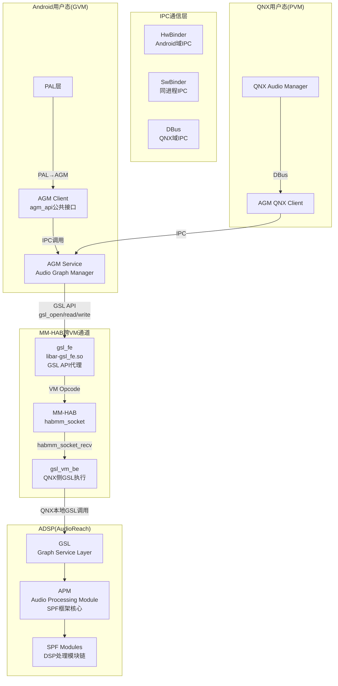
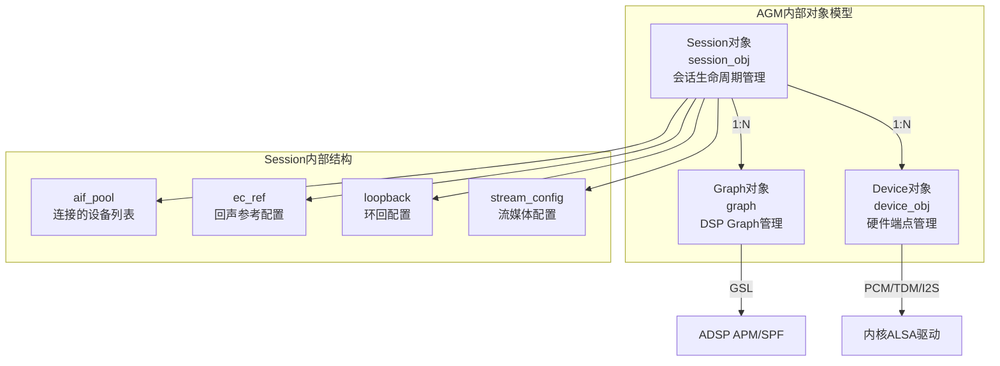
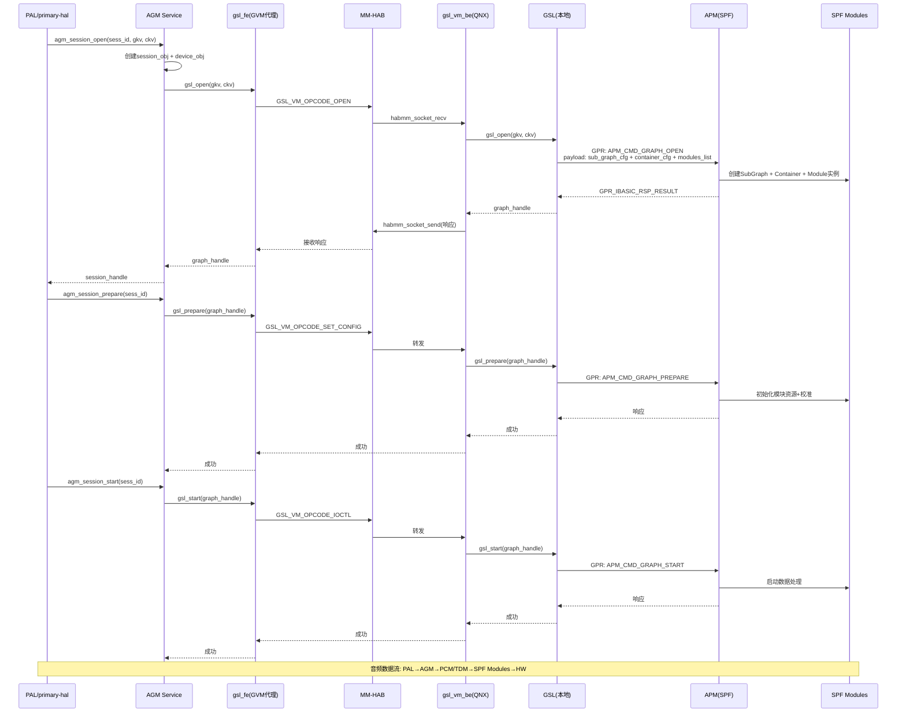
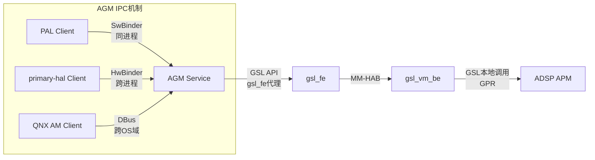

[← 16.9 auto-casa-xml配置](16_16.9_auto-casa-xml配置.md) | [← 返回SA8295 Vendor+QNX双域音频架构深度解析](README.md) | [返回导航](../README.md) | [16.11 SessionGsl与GSL接 →](16_16.11_SessionGsl与GSL接口.md)

---

## 16.10 AGM(Audio Graph Manager)深度解析

### 16.10.1 AGM概述与架构定位

AGM(Audio Graph Manager)是SA8295 AudioReach架构的核心中间层组件，位于PAL和GSL/APM之间，负责在用户态管理DSP音频图的完整生命周期。在AudioReach架构中，AGM替代了旧版legacy架构中的ADM(Audio Device Manager)角色，成为Android域与ADSP交互的统一入口。

> **关键区分**：AGM ≠ ADM。AGM是AudioReach架构的用户态Graph管理器，通过GSL与ADSP APM(SPF框架)通信；ADM是legacy架构的DSP端设备管理器，通过APR通信。SA8295默认使用AudioReach架构，AGM是主要交互通道。

> **SA8295虚拟化注意**：AGM Service内部调用GSL API（如gsl_open/gsl_read/gsl_write等），在GVM(Android)平台上这些GSL API由`libar-gsl_fe.so`代理实现，通过MM-HAB跨VM通道转发给QNX域的gsl_vm_be执行。因此完整路径为：AGM Service → gsl_fe(代理) → MM-HAB → gsl_vm_be(QNX) → GSL本地调用 → APM → ADSP。



**源码路径**：`vendor/qcom/opensource/agm/`

AGM采用Client-Service架构：
- **AGM Client**（公共接口）：`agm_api.h`，PAL和primary-hal通过此接口调用AGM
- **AGM Service**（核心实现）：内部管理graph/device/session对象，通过GSL API与ADSP交互。源码中调用`gsl_open/gsl_read/gsl_write/gsl_ioctl`等GSL接口（源码：agm/service/src/graph.c），在GVM平台上由`libar-gsl_fe.so`代理→MM-HAB→QNX侧gsl_vm_be执行
- **IPC桥接**：Android域使用HwBinder/SwBinder，QNX域使用DBus
- **GSL链接**：AGM Service依赖`libar-gsl_fe`（GVM代理库）和`libar-gsl`（GSL公共头文件），源码确认：`agm/service/Android.mk`中`LOCAL_SHARED_LIBRARIES += libar-gsl_fe libar-gsl`

### 16.10.2 AGM公共API(agm_api.h)

AGM公共API定义在`agm_api.h`中，是PAL/primary-hal与AGM交互的唯一入口：

#### 核心数据结构

```cpp
// 键值对基础结构（gkv/ckv/tkv共用）
struct agm_key_value {
    uint32_t key;     // 参数键（如STREAMRX=流类型，DEVICERX=设备类型）
    uint32_t value;   // 参数值（如PAL_STREAM_DEEP_BUFFER=0x2）
};

// Graph Key Vector — 定义Graph拓扑
struct agm_key_vector_gsl {
    uint32_t num_kvs;              // 键值对数量
    struct agm_key_value *kvs;     // 键值对数组
};

// Cal Key Vector — 定义校准参数
// Tag Key Vector — 定义模块标签
// （结构与gkv相同，语义不同）

// AGM元数据（组合gkv+ckv）
struct agm_meta_data_gsl {
    struct agm_key_vector_gsl gkv;    // Graph Key Vector
    struct agm_key_vector_gsl ckv;    // Cal Key Vector
    struct agm_sg_props sg_props;     // Sub-graph属性
};
```

#### 媒体配置结构

```cpp
// 音频媒体格式配置
struct agm_media_config {
    uint32_t rate;          // 采样率（如48000）
    uint32_t channels;      // 通道数（如2）
    uint32_t format;        // 格式枚举值
};

// AGM格式枚举（PCM + 压缩格式）
enum agm_format {
    AGM_FORMAT_PCM_S8         = 0,
    AGM_FORMAT_PCM_S16_LE     = 1,    // 16-bit小端（最常用）
    AGM_FORMAT_PCM_S24_LE     = 2,
    AGM_FORMAT_PCM_S24_3LE    = 3,
    AGM_FORMAT_PCM_S32_LE     = 4,
    // 压缩格式
    AGM_FORMAT_MP3            = 5,
    AGM_FORMAT_AAC            = 6,
    AGM_FORMAT_FLAC           = 7,
    AGM_FORMAT_ALAC           = 8,
    AGM_FORMAT_APE            = 9,
    AGM_FORMAT_WMA            = 10,
    AGM_FORMAT_AMR_NB         = 11,
    AGM_FORMAT_AMR_WB         = 12,
    AGM_FORMAT_EVRC           = 13,
    AGM_FORMAT_G711            = 14,
};
```

#### 会话配置结构

```cpp
// AGM会话配置
struct agm_session_config {
    uint32_t dir;              // 方向：TX/RX/TX_RX
    uint32_t sess_mode;        // 会话模式枚举
    uint32_t start_threshold;  // 启动阈值
    uint32_t codec_config;     // 编解码器配置
    uint32_t data_mode;        // 数据模式
};

// AGM会话模式枚举
enum agm_session_mode {
    AGM_SESSION_DEFAULT   = 0,  // 默认模式（Host参与）
    AGM_SESSION_NO_HOST   = 1,  // Hostless模式（DSP自主运行）
    AGM_SESSION_NON_TUNNEL = 2, // 非隧道模式
    AGM_SESSION_NO_CONFIG  = 3, // 无配置模式
};
```

> **NO_HOST(Hostless)**模式是车载关键设计——TDM直连通路(MERC/A2B)使用此模式，音频数据不经Android域处理。

#### 缓冲区配置

```cpp
// AGM缓冲区配置
struct agm_buffer_config {
    uint32_t count;    // 缓冲区数量（通常4）
    uint32_t size;     // 每个缓冲区大小（字节）
};
```

### 16.10.3 AGM核心对象模型

AGM内部管理三个核心对象：**Session**、**Graph**、**Device**，它们的关系如下：



#### Device对象(device.h)

Device对象管理硬件端点（音频接口），对应物理音频通路：

```cpp
// Device对象核心结构
struct device_obj {
    char name[64];                  // 设备名称
    uint32_t card_id;               // ALSA声卡ID
    uint32_t pcm_id;                // PCM设备ID
    struct hw_ep_info hw_ep_info;   // 硬件端点配置
    struct agm_media_config media_config;  // 媒体格式
    struct agm_meta_data_gsl metadata;     // 元数据(gkv+ckv)
    enum device_state state;        // 设备状态机
};

// 硬件端点信息
struct hw_ep_info {
    enum hw_ep_intf intf;           // 接口类型枚举
    enum hw_ep_dir dir;             // 方向(TX/RX)
    struct hw_ep_config ep_config;  // 端点详细配置
};

// 硬件接口类型枚举（SA8295支持的接口）
enum hw_ep_intf {
    CODEC_DMA_INTERFACE,      // Codec DMA（内部编解码器）
    MI2S_INTERFACE,           // MI2S（多通道I2S）
    TDM_INTERFACE,            // TDM（时分复用，车载最常用）
    AUXPCM_INTERFACE,         // AUX PCM（辅助PCM）
    SLIMBUS_INTERFACE,        // SlimBus（高速音频总线）
    DISPLAY_PORT_INTERFACE,   // Display Port（HDMI音频）
    USB_AUDIO_INTERFACE,      // USB音频
    PCM_RT_PROXY_INTERFACE,   // PCM实时代理
    AUDIOSS_DMA_INTERFACE,    // AudioSS DMA（安全域DMA）
};

// PCM接口索引（对应LPAIF端口）
enum pcm_intf_idx {
    PRIMARY = 0,       // LPAIF_PRI
    SECONDARY = 1,     // LPAIF_SEC
    TERTIARY = 2,      // LPAIF_TER（车载主区域TDM）
    QUATERNARY = 3,    // LPAIF_QUAT（A2B区域TDM）
    QUINARY = 4,       // LPAIF_QUIN
    SENARY = 5,        // LPAIF_SEN
};

// Codec DMA I2S TDM配置（车载TDM核心）
struct hw_ep_cdc_dma_i2s_tdm_config {
    uint32_t lpaif_type;     // LPAIF类型
    uint32_t intf_idx;       // 接口索引（PRIMARY~SENARY）
    uint32_t sd_line_idx;    // SD线索引
};
```

#### Graph对象(graph.h)

Graph对象管理DSP端的音频处理图，是AGM与ADSP交互的核心：

```cpp
// Graph状态机
enum graph_state {
    GRAPH_CLOSED,      // 未打开
    GRAPH_OPENED,      // 已打开（GSL/APM分配资源）
    GRAPH_PREPARED,    // 已准备（DSP模块链配置完成）
    GRAPH_STARTED,     // 已启动（数据处理开始）
    GRAPH_STOPPED,     // 已停止
};

// Graph核心API流程
// 1. graph_open(meta_data_kv, session_obj, device_obj)
//    → 构建gkv/ckv → gsl_open_graph() → APM_CMD_GRAPH_OPEN
// 2. graph_prepare(graph_handle)
//    → gsl_prepare() → APM_CMD_GRAPH_PREPARE
// 3. graph_start(graph_handle)
//    → gsl_start() → APM_CMD_GRAPH_START
// 4. graph_read/write(graph_handle, buffer, size)
//    → 数据读写（PCM/TDM）
// 5. graph_stop(graph_handle)
//    → gsl_stop() → APM_CMD_GRAPH_STOP
// 6. graph_close(graph_handle)
//    → gsl_close() → APM_CMD_GRAPH_CLOSE
```

> **Graph生命周期**：CLOSED → open() → OPENED → prepare() → PREPARED → start() → STARTED → stop() → STOPPED → close() → CLOSED

#### Session对象(session_obj.h)

Session对象是AGM的最高层管理单元，一个Session对应一个音频流：

```cpp
// Session状态机
enum session_state {
    SESSION_CLOSED,    // 未打开
    SESSION_OPENED,    // 已打开
    SESSION_PREPARED,  // 已准备
    SESSION_STARTED,   // 已运行
    SESSION_STOPPED,   // 已停止
};

// Session核心结构
struct session_obj {
    uint32_t sess_id;                      // 会话ID
    enum session_state state;              // 会话状态
    struct agm_meta_data_gsl sess_meta;    // 会话元数据
    struct aif_pool *aif_pool;             // 连接的设备池
    struct graph *graph;                   // Graph对象引用
    struct agm_stream_config stream_config; // 流配置
    struct agm_ec_ref ec_ref;              // 回声参考配置
    struct agm_loopback loopback;          // 环回配置
};

// aif(Audio Interface)结构 — Session与Device的连接
struct aif {
    uint32_t aif_id;             // 接口ID
    struct device_obj *dev_obj;  // Device对象引用
    enum aif_state state;        // 连接状态
    struct agm_meta_data_gsl sess_aif_meta; // 连接元数据
};
```

**关键API**：

| API | 作用 | DSP对应命令 |
|------|------|------------|
| `session_obj_open()` | 打开会话+连接设备 | APM_CMD_GRAPH_OPEN |
| `session_obj_set_config()` | 设置会话参数 | APM_CMD_SET_CFG |
| `session_obj_prepare()` | 准备会话 | APM_CMD_GRAPH_PREPARE |
| `session_obj_start()` | 启动会话 | APM_CMD_GRAPH_START |
| `session_obj_stop()` | 停止会话 | APM_CMD_GRAPH_STOP |
| `session_obj_close()` | 关闭会话 | APM_CMD_GRAPH_CLOSE |
| `session_obj_sess_aif_connect()` | 连接/断开设备 | APM_CMD_SET_CFG |
| `session_obj_set_ec_ref()` | 设置回声参考 | APM_CMD_SET_CFG |
| `session_obj_set_loopback()` | 设置环回 | APM_CMD_SET_CFG |

### 16.10.4 AGM与APM(SPF)交互

AGM通过GSL层向APM发送GPR命令，APM是AudioReach架构的DSP端框架核心。在SA8295虚拟化架构下，AGM Service调用GSL API时，实际由gsl_fe代理→MM-HAB→gsl_vm_be在QNX侧执行：



#### APM命令体系(apm_api.h)

APM接收的GPR命令采用统一的命令头结构：

```cpp
// APM命令通用头（所有命令共用）
struct apm_cmd_header_t {
    uint32_t payload_address_lsw;  // Payload地址低32位
    uint32_t payload_address_msw;  // Payload地址高32位
    uint32_t mem_map_handle;       // 共享内存映射句柄
    uint32_t payload_size;         // Payload大小
};

// APM模块参数数据（跟随cmd_header）
struct apm_module_param_data_t {
    uint32_t module_instance_id;   // 模块实例ID
    uint32_t param_id;             // 参数ID
    uint32_t param_size;           // 参数数据大小
    uint32_t error_code;           // 错误码(DSP填写)
};
```

**APM_CMD_GRAPH_OPEN的Payload结构层次**：

```
apm_cmd_header_t
  → apm_module_param_data_t → APM_PARAM_ID_SUB_GRAPH_CONFIG
    → apm_sub_graph_cfg_t (performance_mode, direction, scenario_id)
  → apm_module_param_data_t → APM_PARAM_ID_CONTAINER_CONFIG
    → apm_container_cfg_t (container_type, stack_size, proc_domain)
  → apm_module_param_data_t → APM_PARAM_ID_MODULES_LIST
    → apm_module_cfg_t (module_instance_id, module_id)
  → apm_module_param_data_t → APM_PARAM_ID_MODULE_PROP
    → apm_module_prop_id_port_info_t (max_input/output_ports)
  → apm_module_param_data_t → APM_PARAM_ID_MODULE_CONN
    → apm_module_conn_cfg_t (src_module→dst_module连接)
```

### 16.10.5 AGM IPC机制

AGM Service与Client之间通过多种IPC机制通信：

| IPC类型 | 使用场景 | 特点 |
|---------|---------|------|
| **HwBinder** | Android域跨进程调用 | 标准Android IPC，支持SELinux |
| **SwBinder** | 同进程调用(PAL→AGM) | 低延迟，无序列化开销 |
| **DBus** | QNX域调用 | QNX IPC标准，跨OS域 |
| **GPR** | AGM→GSL内部通信(GSL→APM) | DSP端通用包路由，替代APR，GSL内部使用 |



### 16.10.6 AudioReach vs Legacy架构对比

SA8295支持两种DSP音频架构，AudioReach是默认和主要架构：

| 维度 | AudioReach架构 | Legacy架构 |
|------|---------------|-----------|
| **用户态管理** | AGM(Audio Graph Manager) | 无独立管理器，PAL直接通过IOCTL |
| **DSP框架** | APM(SPF框架核心) + SPF Modules | ADM(Audio Device Manager) |
| **DSP流管理** | SPF(Stream Processing Framework) | ASM(Audio Stream Manager) |
| **通信协议** | GPR(General Packet Router) | APR(Asynchronous Packet Router) |
| **Graph构建** | 基于KV描述→APM动态构建 | 基于COPP静态配置 |
| **校准推送** | AGM→gsl_fe→HAB→gsl_vm_be→GSL→APM | acdb-loader→ADM IOCTL |
| **模块配置** | SubGraph+Container+Module层次 | COPP(Audio Post Processor) |
| **配置灵活性** | 高(动态拓扑，实时Graph Change) | 低(固定拓扑，预设COPP链) |
| **适用场景** | SA8295默认架构，车载多区域 | 旧版平台兼容，简略补充 |

> **架构选择**：SA8295平台默认使用AudioReach架构，Legacy架构仅在特定兼容场景下使用。本文后续内容以AudioReach为主，Legacy仅作简略对比参考。

---

---

[← 16.9 auto-casa-xml配置](16_16.9_auto-casa-xml配置.md) | [← 返回SA8295 Vendor+QNX双域音频架构深度解析](README.md) | [返回导航](../README.md) | [16.11 SessionGsl与GSL接 →](16_16.11_SessionGsl与GSL接口.md)
