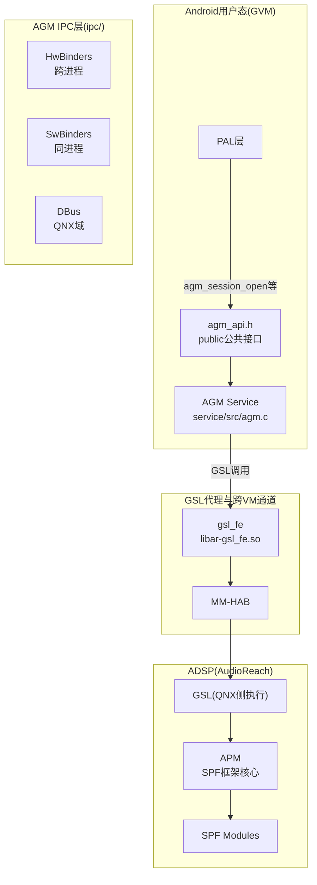
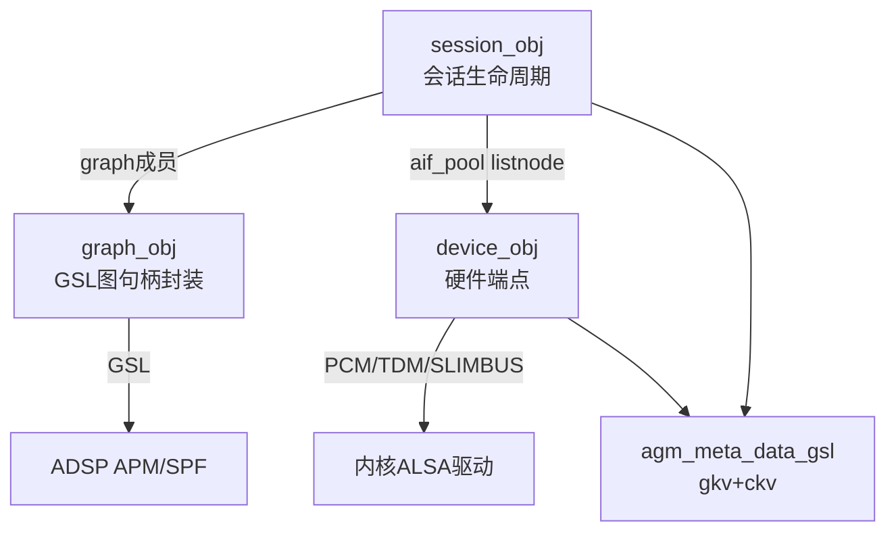
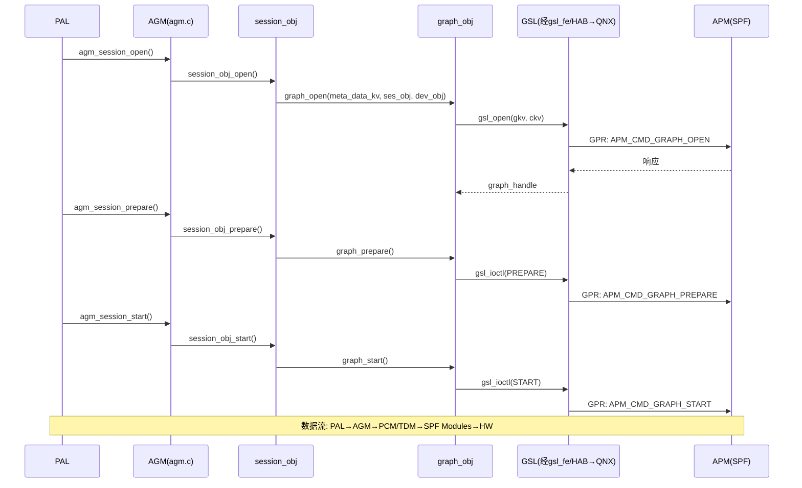
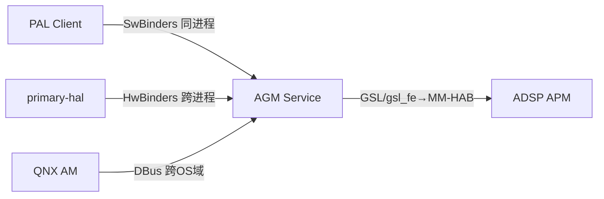

[← 16.9 auto-casa-xml配置](16_16.9_auto-casa-xml配置.md) | [← 返回SA8295 Vendor+QNX双域音频架构深度解析](README.md) | [返回导航](../README.md) | [16.11 SessionGsl与GSL接 →](16_16.11_SessionGsl与GSL接口.md)

---

## 16.10 AGM(Audio Graph Manager)深度解析

### 16.10.1 AGM概述与架构定位

AGM(Audio Graph Manager)是SA8295 AudioReach架构的用户态中间层组件，位于PAL和GSL之间，负责在用户态管理DSP音频图(Graph)的完整生命周期。在AudioReach架构中，AGM通过GSL与ADSP APM(SPF框架)交互，是Android域向DSP下发图/会话/设备操作的统一入口。

> **源码说明**：
> - **源码路径**：本机真实源码顶层为 `ipc/ plugins/ service/ snd_parser/`，AGM 服务核心全部在 `service/` 下：公共 API 在 `service/inc/public/agm/agm_api.h`，私有头在 `service/inc/private/agm/`（device.h/graph.h/session_obj.h/metadata.h/graph_module.h/agm_priv.h），实现在 `service/src/`（agm.c/graph.c/session_obj.c/device.c/metadata.c/graph_module.c/device_hw_ep.c）。
> - `agm_key_vector_gsl`/`agm_meta_data_gsl` 是 AGM **私有元数据**结构，定义/使用于 `service/inc/private/agm/metadata.h` 及各私有对象头；公共 `agm_api.h` 对外暴露的是 `agm_key_value`/`agm_tag_config`/`agm_cal_config`(柔性数组 `kv[]`) 等。

> **SA8295虚拟化注意**：AGM Service 内部调用 GSL API，在 GVM(Android) 平台上这些 GSL API 由 `libar-gsl_fe.so` 代理实现，通过 MM-HAB 跨 VM 转发给 QNX 域执行。完整路径：PAL → AGM Service → gsl_fe(代理) → MM-HAB → QNX侧 GSL → APM → ADSP。



AGM采用Client-Service架构：

- **公共接口**：`service/inc/public/agm/agm_api.h`，PAL/primary-hal 通过此接口调用 AGM
- **服务核心**：`service/src/agm.c` 做 API 分发，内部管理 session/graph/device 对象，经 GSL 与 ADSP 交互
- **IPC桥接**：`ipc/` 下提供三套实现 —— `HwBinders/`(Android 跨进程)、`SwBinders/`(同进程)、`DBus/`(QNX 域)
- **插件**：`plugins/` 下有 `alsalib`/`tinyalsa` PCM/CTL 插件(即 UCM 中 `LibraryConfig.agm` 引用的 AGM 插件)

### 16.10.2 AGM公共API(agm_api.h)

`agm_api.h` 对外暴露完整的会话/设备/图操作函数(实际源码为 `int agm_xxx(...)` 风格)：

| API | 作用 |
|------|------|
| `agm_init()` / `agm_deinit()` | AGM 初始化/去初始化 |
| `agm_aif_set_media_config()` | 设置音频接口(设备)媒体格式 |
| `agm_aif_set_metadata()` | 设置设备元数据(gkv/ckv) |
| `agm_session_set_metadata()` | 设置会话元数据 |
| `agm_session_aif_set_metadata()` | 设置会话+设备连接元数据 |
| `agm_session_aif_connect()` | 连接/断开会话与设备 |
| `agm_session_aif_get_tag_module_info()` | 获取标签→模块信息 |
| `agm_session_open()` | 打开会话 |
| `agm_session_set_config()` | 设置会话配置 |
| `agm_session_prepare()` | 准备会话 |
| `agm_session_start()` / `agm_session_stop()` | 启动/停止会话 |
| `agm_session_pause()` / `agm_session_resume()` | 暂停/恢复 |
| `agm_session_flush()` | 冲刷缓冲 |
| `agm_session_suspend()` | 挂起 |
| `agm_session_read()` / `agm_session_write()` | 数据读写 |
| `agm_session_aif_set_cal()` | 下发校准(ckv) |
| `agm_set_params_with_tag()` | 按 tkv 标签下发参数 |
| `agm_set_params_with_tag_to_acdb()` | 参数写回 ACDB |
| `agm_session_register_cb()` / `agm_session_register_for_events()` | 回调/事件注册 |

> **源码说明**：真实 `agm_api.h` 的核心价值正是这批 `agm_session_*`/`agm_aif_*` 函数，PAL 即通过它们驱动 AGM。

#### 核心数据结构(agm_api.h 真实定义)

```cpp
// 键值对基础结构（公共 API 层）
struct agm_key_value {
    uint32_t key;     // 键
    uint32_t value;   // 值
};

// Tag Key Vector（柔性数组，非 num_kvs+指针）
struct agm_tag_config {
    uint32_t tag;
    uint32_t num_tkvs;
    struct agm_key_value kv[];   // 柔性数组成员
};

// Cal Key Vector
struct agm_cal_config {
    uint32_t num_ckvs;
    struct agm_key_value kv[];
};
```

> **源码说明**：公共层用的是 `agm_tag_config`/`agm_cal_config`(柔性数组 `kv[]`)；`agm_key_vector_gsl`/`agm_meta_data_gsl` 属 **私有** metadata.h(见 16.10.3)。

#### 媒体配置结构（真实字段）

```cpp
struct agm_media_config {
    uint32_t rate;                 // 采样率
    uint32_t channels;             // 通道数
    enum agm_media_format format;  // 格式(枚举，非 uint32_t)
    uint32_t data_format;          // 数据格式
};

// TDM 分组媒体配置(A2B/多DAI关键)
struct agm_group_media_config {
    struct agm_media_config config;
    uint32_t slot_mask;            // TDM slot 掩码
};
```

#### 格式枚举 enum agm_media_format（真实枚举名与值序）

```cpp
enum agm_media_format {
    AGM_FORMAT_INVALID,          // 0（首值是 INVALID，非 PCM_S8=0）
    AGM_FORMAT_PCM_S8,
    AGM_FORMAT_PCM_S16_LE,       // 最常用
    AGM_FORMAT_PCM_S24_LE,
    AGM_FORMAT_PCM_S24_3LE,
    AGM_FORMAT_PCM_S32_LE,
    AGM_FORMAT_MP3,
    AGM_FORMAT_AAC,
    AGM_FORMAT_FLAC,
    AGM_FORMAT_ALAC,
    AGM_FORMAT_APE,
    AGM_FORMAT_WMASTD,           // WMA std
    AGM_FORMAT_WMAPRO,           // WMA pro
    AGM_FORMAT_VORBIS,
    AGM_FORMAT_AMR_NB,
    AGM_FORMAT_AMR_WB,
    AGM_FORMAT_AMR_WB_PLUS,
    AGM_FORMAT_EVRC,
    AGM_FORMAT_G711,
    AGM_FORMAT_QCELP,
    AGM_FORMAT_MAX,
};
```

> **源码说明**：真实 `enum agm_media_format` 包含 `INVALID/WMASTD/WMAPRO/VORBIS/AMR_WB_PLUS/QCELP/MAX` 等成员，以源码为准。

#### 会话与缓冲配置（真实字段）

```cpp
enum direction { RX = 1, TX };   // 真实：RX=1, TX=2（无 TX_RX）

struct agm_session_config {
    enum direction dir;               // 方向
    enum agm_session_mode sess_mode;  // 会话模式
    uint32_t start_threshold;
    uint32_t stop_threshold;
    union agm_session_codec codec;    // 编解码器(union，非 uint32_t codec_config)
    enum agm_data_mode data_mode;
    uint32_t sess_flags;              // 会话标志
};

enum agm_session_mode {
    AGM_SESSION_DEFAULT,      // 普通 tunnel 会话
    AGM_SESSION_NO_HOST,      // Hostless 模式(车载 TDM 直连关键)
    AGM_SESSION_NON_TUNNEL,   // 非隧道
    AGM_SESSION_NO_CONFIG,    // 无配置
};

struct agm_buffer_config {
    uint32_t count;             // 缓冲区数量
    size_t   size;              // 每缓冲区大小(size_t)
    size_t   max_metadata_size; // 每缓冲最大元数据
};
```

> **NO_HOST(Hostless)** 模式是车载关键设计——TDM 直连通路使用此模式，音频数据不经 Android 域处理。

### 16.10.3 AGM核心对象模型(私有头)

AGM Service 内部管理三个核心对象：**Session**(session_obj.h)、**Graph**(graph.h)、**Device**(device.h)，元数据由 metadata.h 统一封装。



#### 私有元数据(metadata.h)

```cpp
// Graph/Cal Key Vector（私有 GSL 层）
struct agm_key_vector_gsl {
    size_t num_kvs;
    struct agm_key_value *kv;
};

// 会话/设备元数据（gkv + ckv）
struct agm_meta_data_gsl {
    struct agm_key_vector_gsl gkv;   // Graph Key Vector
    struct agm_key_vector_gsl ckv;   // Cal Key Vector
    struct prop_data sg_props;       // Sub-graph 属性
};
// 辅助：metadata_merge/metadata_copy/metadata_free/metadata_update_cal/metadata_print
```

#### Device对象(device.h)

```cpp
// 接口类型是宏定义(非枚举)
#define CODEC_DMA  0x0
#define MI2S       0x1
#define TDM        0x2   // 车载最常用
#define AUXPCM     0x3
#define SLIMBUS    0x4

enum device_state { DEV_CLOSED, DEV_OPENED, DEV_PREPARED, DEV_STARTED, DEV_STOPPED };

// 硬件端点信息(typedef)
typedef struct hw_ep_info {
    uint32_t intf;                 // 接口(CODEC_DMA/MI2S/TDM/AUXPCM/SLIMBUS)
    uint32_t dir;                  // 方向(RX/TX)
    union hw_ep_config ep_config;
} hw_ep_info_t;

// Codec DMA / I2S / TDM 端点配置(真实仅两字段)
struct hw_ep_cdc_dma_i2s_tdm_config {
    uint32_t lpaif_type;           // LPAIF/LPAIF_WSA/LPAIF_RX_TX ...
    uint32_t intf_idx;             // Primary/Secondary/Tertiary ...
};

struct device_obj {
    char name[MAX_DEV_NAME_LEN];   // 来自 /proc/asound/pcm，如 TDM-LPAIF_WSA-RX-SECONDARY
    struct listnode list_node;
    pthread_mutex_t lock;
    uint32_t card_id;
    hw_ep_info_t hw_ep_info;
    uint32_t pcm_id;
    struct pcm *pcm;               // 或 snd_pcm_t*(DEVICE_USES_ALSALIB)
    struct agm_media_config media_config;
    struct agm_meta_data_gsl metadata;
    struct refcount refcnt;        // open/prepare/start 引用计数
    int state;
    void *params;  size_t params_size;
    bool is_virtual_device;        // 虚拟设备(A2B 关键)
    int num_virtual_child;
    struct device_obj *parent_dev;
    struct device_group_data *group_data;  // TDM 分组(多DAI/A2B)
};
```

> **源码说明**：真实接口类型是 **宏**(CODEC_DMA/MI2S/TDM/AUXPCM/SLIMBUS)，且 device_obj 含 **虚拟设备/group_data/refcount** 等车载关键字段。

#### Graph对象(graph.h)

Graph 对象在源码中是 `struct graph_obj`。真实 API：

```cpp
int graph_init();  int graph_deinit();
int graph_open(struct agm_meta_data_gsl *meta_data_kv,
               struct session_obj *ses_obj, struct device_obj *dev_obj, ...);
int graph_set_config(struct graph_obj *gph_obj, void *payload, size_t size);
int graph_prepare(struct graph_obj *gph_obj);
int graph_start(struct graph_obj *gph_obj);
int graph_read (struct graph_obj *gph_obj, struct agm_buff *buffer, size_t *size);
int graph_write(struct graph_obj *gph_obj, struct agm_buff *buffer, size_t *size);
int graph_pause/graph_flush/graph_resume/graph_suspend(struct graph_obj *gph_obj);
int graph_stop (struct graph_obj *gph_obj, ...);
int graph_close(struct graph_obj *gph_obj);
// 动态图操作(AudioReach 实时拓扑变更关键)
int graph_add   (struct graph_obj *gph_obj, ...);
int graph_change(struct graph_obj *gph_obj, ...);
int graph_remove(struct graph_obj *gph_obj, ...);
int graph_register_cb / graph_register_for_events(...);
```

> **源码说明**：`graph_add/graph_change/graph_remove` 这三个 API 是 AudioReach **动态图变更**核心接口。

#### Session对象(session_obj.h)

```cpp
enum session_state { SESSION_CLOSED, SESSION_OPENED, /*...*/ SESSION_STARTED, /*...*/ };

struct session_obj {
    struct listnode node;
    uint32_t sess_id;
    enum session_state state;
    struct agm_meta_data_gsl sess_meta;
    struct listnode aif_pool;          // 连接设备池(listnode，非 aif_pool* 指针)
    struct listnode cb_pool;
    struct graph_obj *graph;
    struct agm_session_config stream_config;
    struct agm_media_config in_media_config, out_media_config;
    struct agm_buffer_config in_buffer_config, out_buffer_config;
    void *params;  size_t params_size;
    uint32_t loopback_sess_id;  bool loopback_state;  // 环回(两字段)
    uint32_t ec_ref_aif_id;     bool ec_ref_state;    // 回声参考(两字段)
    uint32_t rx_metadata_sz, tx_metadata_sz;
    pthread_mutex_t lock, cb_pool_lock;
};
```

**关键 API**：`session_obj_open()`/`session_obj_set_config()`/`session_obj_prepare()`/`session_obj_start()`/`session_obj_stop()`/`session_obj_close()`/`session_obj_pause()`/`session_obj_resume()`/`session_obj_flush()`/`session_obj_read()`/`session_obj_write()`/`session_obj_sess_aif_connect()`/`session_obj_set_ec_ref()`/`session_obj_set_loopback()`/`session_obj_set_sess_aif_cal()` 等。

> **源码说明**：`aif_pool` 真实是 `struct listnode`；回声参考/环回是平铺字段 `ec_ref_aif_id+ec_ref_state` / `loopback_sess_id+loopback_state`（各两个字段）。

### 16.10.4 AGM与APM(SPF)交互

AGM 经 GSL 向 ADSP APM 下发命令。SA8295 虚拟化下，GSL 调用由 gsl_fe 代理经 MM-HAB 转发到 QNX 侧执行：



> **通信协议**：AGM→GSL→APM 之间在 DSP 侧使用 **GPR**(General Packet Router，AudioReach 替代 legacy APR)。APM 命令(如 `APM_CMD_GRAPH_OPEN/PREPARE/START/STOP/CLOSE`)与 payload 结构(SubGraph/Container/Module 层次)定义在 ADSP 侧 `apm_api.h`(SPF 头文件)，非 AGM 仓库。

### 16.10.5 AGM IPC机制(ipc/)

| IPC类型 | 目录 | 使用场景 |
|---------|------|---------|
| **HwBinders** | `ipc/HwBinders/` | Android 域跨进程调用(agm_ipc_client/agm_ipc_service) |
| **SwBinders** | `ipc/SwBinders/` | 同进程调用(PAL→AGM)，低延迟 |
| **DBus** | `ipc/DBus/` | QNX 域调用，跨 OS 域 |



### 16.10.6 AudioReach vs Legacy架构对比

| 维度 | AudioReach | Legacy |
|------|-----------|--------|
| **用户态管理** | AGM(Audio Graph Manager) | 无独立管理器，PAL 直接 IOCTL |
| **DSP框架** | APM(SPF) + SPF Modules | ADM(Audio Device Manager) |
| **DSP流管理** | SPF | ASM(Audio Stream Manager) |
| **通信协议** | GPR | APR |
| **Graph构建** | 基于 KV → APM 动态构建 | 基于 COPP 静态配置 |
| **模块配置** | SubGraph+Container+Module | COPP |
| **配置灵活性** | 高(graph_add/change/remove 动态拓扑) | 低(固定拓扑) |
| **适用场景** | SA8295 默认，车载多区域 | 传统架构兼容 |

---

### 16.10.7 源码路径参考(本机真实)

```
vendor/qcom/opensource/agm/
├── ipc/                         # IPC 服务端/客户端
│   ├── DBus/                    # QNX 域 IPC
│   ├── SwBinders/               # 同进程 IPC
│   └── HwBinders/               # Android 跨进程 IPC
├── plugins/                     # AGM PCM/CTL 插件(UCM LibraryConfig.agm 引用)
│   ├── alsalib/  tinyalsa/
├── snd_parser/                  # snd card/UCM 解析
└── service/
    ├── inc/public/agm/agm_api.h        # 公共 API
    ├── inc/private/agm/                # 私有头
    │   ├── device.h  graph.h  session_obj.h
    │   ├── metadata.h  graph_module.h  agm_priv.h
    └── src/                            # 实现
        ├── agm.c  graph.c  session_obj.c  device.c
        ├── metadata.c  graph_module.c  device_hw_ep.c
```

> **交互对照**：AGM 图操作最终经 GSL → GPR → ADSP APM 完成，APM 命令体系定义在 ADSP 侧 `apm_api.h`(SPF)。详见 [16.11 SessionGsl与GSL接口](16_16.11_SessionGsl与GSL接口.md) 与 [16.14 GSL/Graph Service Layer内部架构](16_16.14_GSLGraph_Service_Layer内部架.md)。