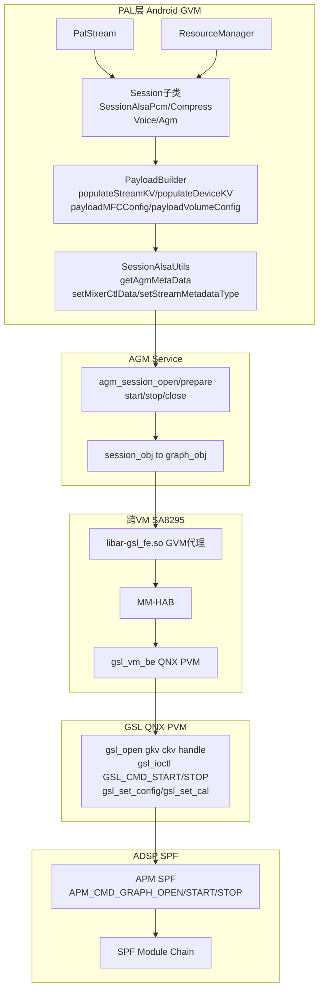

[← 16.10 AGM(Audio Graph](16_16.10_AGMAudio_Graph_Manager深度解.md) | [← 返回SA8295 Vendor+QNX双域音频架构深度解析](README.md) | [返回导航](../README.md) | [16.12 Android+QNX双域架构 →](16_16.12_Android+QNX双域架构总结.md)

---

## 16.11 PAL Session、AGM 与 GSL 接口

### 16.11.1 概述与重大澄清

> **本章重大澄清（对照真实源码，2026 核对）**：旧版本章存在若干根本性臆造，现按真实源码逐条纠正。核对依据：
> - Android(GVM) 侧 PAL 源码：`vendor/qcom/opensource/pal/session/`（本机 `/home/ylz/code/qc/Android/lagvm/LINUX/android/vendor/qcom/opensource/pal/`）
> - GSL 真实源码：**QNX(PVM) 侧** `AMSS/multimedia/audio/audio_ar/audio_driver/audio_reach/gsl/`，公共 API 头 `gsl/api/gsl_intf.h`
>
> **澄清一：不存在 `SessionGsl` 运行时类。** `session/inc/SessionGsl.h` 头文件仍在代码库中保留，但 **没有对应的 `SessionGsl.cpp`**（`session/src/` 下确认无此文件）。`Session::makeSession()` 实际创建的是 `SessionAlsaPcm` / `SessionAlsaCompress` / `SessionAlsaVoice` / `SessionAgm` 四个真实子类。
>
> **澄清二：PAL Session 层根本不直接调用 `gsl_*` API。** 在 `session/src/` 下 grep `gsl_open`/`gsl_ioctl`/`gsl_intf.h` **零命中**。PAL 通过 **AGM**（`agm/agm_api.h`）和 **ALSA mixer control** 与底层交互，GSL 由 AGM Service 内部驱动。GSL 真实运行在 QNX(PVM) 侧，GVM 侧仅有代理转发（经 MM-HAB 跨 VM）。
>
> **澄清三：GSL 真实 API 名与旧版臆造完全不同。** 真实是 `gsl_open` / `gsl_close` / `gsl_ioctl`（用 `GSL_CMD_START`/`GSL_CMD_STOP` 命令控制启停），而非旧版臆造的 `gsl_open_graph` / `gsl_start` / `gsl_stop` 独立函数。
>
> **澄清四：`gsl_key_vector` 字段名是 `num_kvps`（非旧版臆造的 `num_kv_pairs`）。**
>
> **澄清五：PayloadBuilder 真实方法名是 `payloadXxxConfig` + `populateXxxKV`（非旧版臆造的 `buildXxxPayload`）。**

在 SA8295 AudioReach 架构下，一次音频图从 PAL 到 DSP 的真实调用链为：

```
PAL Stream
  → Session 子类(SessionAlsaPcm/Compress/Voice/Agm)
    → PayloadBuilder(populateStreamKV/populateDeviceKV 生成 gkv/ckv;payloadXxxConfig 生成模块 payload)
      → SessionAlsaUtils(getAgmMetaData 打包 + setMixerCtlData/setStreamMetadataType 经 ALSA mixer control 下发)
        → AGM Service(agm.c → session_obj → graph_obj)
          → GSL(gsl_open(gkv,ckv,&handle) / gsl_ioctl(GSL_CMD_START/STOP) / gsl_set_config)   ← QNX(PVM) 侧
            → GPR → APM(SPF) → DSP Module Chain
```

SA8295 虚拟化下：GVM 侧 GSL 调用由 `libar-gsl_fe.so` 代理，经 MM-HAB 跨 VM 转发到 QNX 侧 `gsl_vm_be` 执行。



### 16.11.2 真实 Session 子类与基类接口

> 真实 Session 子类均继承自 `Session` 基类（`session/inc/Session.h`），由 `Session::makeSession()` 工厂创建。下表为 `SessionAgm` 的真实公共接口（对照 `session/inc/SessionAgm.h`），其它子类接口签名一致。

| 真实方法（override 自 Session 基类） | 签名要点 |
|-----------------------------------|---------|
| `open(Stream *s)` | 打开会话 |
| `prepare(Stream *s)` | 准备图 |
| `start(Stream *s)` / `stop(Stream *s)` | 启停 |
| `close(Stream *s)` | 关闭 |
| `pause(Stream *s)` / `resume(Stream *s)` | 暂停/恢复 |
| `read(Stream *s, int tag, struct pal_buffer *buf, int *size)` | 读(注意含 tag/size 指针) |
| `write(Stream *s, int tag, struct pal_buffer *buf, int *size, int flag)` | 写 |
| `setParameters(Stream *s, int tagId, uint32_t param_id, void *payload)` | 设参 |
| `getParameters(Stream *s, int tagId, uint32_t param_id, void **payload)` | 取参 |
| `registerCallBack(session_callback cb, uint64_t cookie)` | 注册回调 |
| `drain(pal_drain_type_t type)` / `flush()` / `suspend()` | 排空/冲刷/挂起 |
| `getTagsWithModuleInfo(Stream *s, size_t *size, uint8_t *payload)` | 获取标签模块信息 |
| `setupSessionDevice` / `connectSessionDevice` / `disconnectSessionDevice` | 设备连接管理 |

> **澄清**：旧版臆造的 `buildGkv()` / `buildCkv()` / `buildTkv()` / `configureGraph()` / `sendCalData()` 这些成员方法在真实 Session 子类中 **均不存在**。KV 的构建由 `PayloadBuilder::populateStreamKV` 等完成；图配置经 ALSA mixer control 下发给 AGM。

`SessionAgm` 真实持有的 AGM 数据结构成员（对照 `SessionAgm.h`）：

```cpp
// session/inc/SessionAgm.h（真实节选）
class SessionAgm : public Session {
    struct agm_session_config *sess_config;
    struct agm_media_config  *in_media_cfg, *out_media_cfg;
    struct agm_buffer_config  in_buff_cfg{0,0,0}, out_buff_cfg = in_buff_cfg;
};
```

> 注意：这些是 **AGM 公共层结构**（详见 [16.10 AGM](16_16.10_AGMAudio_Graph_Manager深度解.md)），而非 GSL 结构。`SessionAlsaPcm` 则持有 `std::vector<std::pair<int,int>> gkv;`（**普通 vector，不是 `struct gsl_key_vector`**）。

### 16.11.3 GSL 真实公共 API（QNX 侧 gsl_intf.h）

> GSL 的对外接口定义在 QNX 侧 `gsl/api/gsl_intf.h`。核心是 `gsl_open` + `gsl_ioctl` 命令模型。

```c
// gsl/api/gsl_intf.h（真实）
typedef void *gsl_handle_t;  // 不透明句柄（旧版臆造的 graph_handle_t 不存在）

struct gsl_key_value_pair {
    uint32_t key;    // 键
    uint32_t value;  // 值
};

struct gsl_key_vector {
    uint32_t num_kvps;                // 键值对数量（真实字段名，非 num_kv_pairs）
    struct gsl_key_value_pair *kvp;   // 键值对数组
};

// 打开一个图：同时传入 gkv 和 ckv，返回 handle
int32_t gsl_open(const struct gsl_key_vector *graph_key_vect,
                 const struct gsl_key_vector *cal_key_vect,
                 gsl_handle_t *graph_handle);

int32_t gsl_close(gsl_handle_t graph_handle);

// 启停/准备/冲刷/动态图等一律通过 ioctl 命令控制
int32_t gsl_ioctl(gsl_handle_t graph_handle, enum gsl_cmd_id cmd_id,
                  void *cmd_payload, size_t cmd_payload_sz);

int32_t gsl_set_cal(gsl_handle_t graph_handle, ...);
int32_t gsl_set_config(gsl_handle_t graph_handle, ...);
int32_t gsl_set_custom_config(gsl_handle_t graph_handle, ...);
int32_t gsl_set_tagged_custom_config(gsl_handle_t graph_handle, uint32_t tag, ...);
int32_t gsl_read(gsl_handle_t graph_handle, uint32_t tag, ...);
int32_t gsl_write(gsl_handle_t graph_handle, uint32_t tag, ...);
int32_t gsl_register_event_cb(gsl_handle_t graph_handle, ...);
```

`enum gsl_cmd_id`（真实命令集，节选）：

| 命令 | 值 | 说明 |
|------|----|----|
| `GSL_CMD_START` | 0x0 | 启动图（对应旧版臆造的 gsl_start） |
| `GSL_CMD_PREPARE` | 0x1 | 可选，START 前预初始化 |
| `GSL_CMD_FLUSH` | 0x3 | 冲刷 |
| `GSL_CMD_STOP` | 0x4 | 停止图（对应旧版臆造的 gsl_stop） |
| `GSL_CMD_ADD_GRAPH` | 0x5 | 动态图：增加子图 |
| `GSL_CMD_REMOVE_GRAPH` | 0x6 | 动态图：移除子图 |
| `GSL_CMD_CHANGE_GRAPH` | 0x7 | 动态图：切换子图 |
| `GSL_CMD_EOS` | 0xC | 流结束 |
| `GSL_CMD_GET_WRITE_BUFF_INFO` / `..READ..` | 0xD/0xE | 共享内存缓冲信息 |
| `GSL_CMD_REGISTER_CUSTOM_EVENT` | 0x11 | 注册自定义事件 |

> **澄清**：旧版本章的 `gsl_open_graph(&gkv, &handle)`、`gsl_start(handle)`、`gsl_stop(handle)` 三个函数在真实 `gsl_intf.h` 中 **都不存在**。真实 open 是 `gsl_open(gkv, ckv, &handle)`（一次传两个 KV 向量），启停用 `gsl_ioctl(handle, GSL_CMD_START/STOP, ...)`。

### 16.11.4 PayloadBuilder 真实方法（session/inc/PayloadBuilder.h）

> PayloadBuilder 负责两类工作：**构建 KV 向量**（`populateXxxKV`，返回 `std::vector<std::pair<int,int>>`）与 **构建模块参数 payload**（`payloadXxxConfig`，通过 `uint8_t** payload, size_t* size, uint32_t miid` 输出）。

```cpp
// session/inc/PayloadBuilder.h（真实节选）

// —— KV 构建：返回 int，KV 通过引用参数 vector<pair<int,int>>& 输出 ——
int populateStreamKV(Stream *s, std::vector<std::pair<int,int>> &keyVector);
int populateStreamPPKV(Stream *s, std::vector<std::pair<int,int>> &keyVector);
int populateDeviceKV(Stream *s, int beDevId, std::vector<std::pair<int,int>> &keyVector);
int populateStreamDeviceKV(Stream *s, int beDevId,
                           std::vector<std::pair<int,int>> &streamDeviceKV);
int populateDevicePPKV(Stream *s, int beDevId, std::vector<std::pair<int,int>> &keyVector);
int populateStreamCkv(Stream *s, std::vector<std::pair<int,int>> &ckv, ...);
int populateCalKeyVector(Stream *s, std::vector<std::pair<int,int>> &ckv, int tag);

// —— 模块参数 payload 构建 ——
void payloadMFCConfig(uint8_t **payload, size_t *size, uint32_t miid, ...);
void payloadVolumeConfig(uint8_t **payload, size_t *size, uint32_t miid, ...);
void payloadCustomParam(uint8_t **payload, size_t *size, uint32_t *customData, ...);
void payloadACDBParam(uint8_t **payload, size_t *size, uint8_t *data, uint32_t miid, ...);
void payloadUsbAudioConfig(uint8_t **payload, size_t *size, uint32_t miid, ...);
void payloadDpAudioConfig(uint8_t **payload, size_t *size, uint32_t miid, ...);
void payloadRATConfig(uint8_t **payload, size_t *size, uint32_t miid, ...);
void payloadLC3Config(uint8_t **payload, size_t *size, uint32_t miid, ...);
void payloadTWSConfig(uint8_t **payload, size_t *size, uint32_t miid, ...);
void payloadSPConfig(uint8_t **payload, size_t *size, uint32_t miid, ...);
```

> **澄清**：旧版臆造的 `buildGkv()` / `buildCkv()` / `buildTkv()` / `buildPayload()` / `buildPcmTdmPayload()` / `pcm_tdm_module_config` 等方法与结构在真实 `PayloadBuilder.h` 中 **均不存在**。真实是上述 `populateXxxKV` + `payloadXxxConfig`。

### 16.11.5 KV 如何真正传到底层（ALSA mixer control）

> PAL 构建好的 `vector<pair<int,int>>` KV 并不直接喂给 GSL，而是经 `SessionAlsaUtils` 打包为 AGM metadata，再通过 **ALSA mixer control** 下发给 AGM 的 ALSA 插件。AGM Service 收到后才组装 `struct gsl_key_vector` 并调用 `gsl_open`。

```cpp
// session/inc/SessionAlsaUtils.h（真实节选）
static int getAgmMetaData(const std::vector<std::pair<int,int>> &kv,
                          const std::vector<std::pair<int,int>> &ckv,
                          struct prop_data *prop,
                          struct agm_key_vector_gsl &gkv,
                          struct agm_key_vector_gsl &ckv_out);

static int setMixerCtlData(struct mixer_ctl *ctl, /* metadata blob */ ...);
static int setStreamMetadataType(struct mixer *mixer, int device,
                                 const char *val, ...);
```

传递链：

```
PayloadBuilder.populateStreamKV/populateDeviceKV
  → vector<pair<int,int>> kv/ckv
    → SessionAlsaUtils::getAgmMetaData(kv, ckv, ...)  打包 agm_key_vector_gsl
      → setMixerCtlData / setStreamMetadataType  写 ALSA mixer control
        → AGM ALSA 插件 → AGM Service → 组 struct gsl_key_vector → gsl_open(gkv, ckv, &handle)
```

> **澄清**：`kvh2xml.h` 是 **自动生成的键值宏头文件**（真实位置 `mm-audio-headers/acdbdata/kvh2xml.h`），只是 `#define` 一堆 KEY_/VALUE_ 宏与 tag 枚举，供 ACDB/PayloadBuilder 引用；它 **不是** 旧版臆造的"映射表数组结构"。

### 16.11.6 GSL 的双域职责（SA8295 虚拟化）

| 维度 | Android(GVM) 侧 | QNX(PVM) 侧 |
|------|-----------------|-------------|
| PAL / AGM | 运行于此，构建 KV、经 mixer control 下发 | 无 |
| GSL 真实执行体 | 仅 `libar-gsl_fe.so` 代理（前端） | `gsl_intf.h` 全部实现 + `gsl_vm_be` 后端 |
| gsl_open/ioctl 落地 | 转发调用| 真正打开图、与 GPR/APM(SPF) 通信 |
| 跨域通道 | MM-HAB 客户端 | MM-HAB 服务端 |

即：Android 侧构建图的"意图"（KV），真正的图打开/启停在 QNX 侧 GSL 完成，二者经 MM-HAB 跨 VM 桥接。

### 16.11.7 真实源码路径速查

```
# Android(GVM) —— PAL Session 层（不直接调 GSL）
vendor/qcom/opensource/pal/session/inc/
  ├── Session.h            # 基类 + makeSession() 工厂
  ├── SessionAgm.h         # SessionAgm（持 agm_session_config/agm_media_config）
  ├── SessionAlsaPcm.h     # gkv 是 std::vector<std::pair<int,int>>
  ├── SessionAlsaCompress.h
  ├── SessionAlsaVoice.h
  ├── SessionGsl.h         # 头保留，但无 .cpp（非运行时类）
  ├── PayloadBuilder.h     # populateXxxKV + payloadXxxConfig
  └── SessionAlsaUtils.h   # getAgmMetaData / setMixerCtlData / setStreamMetadataType
vendor/qcom/opensource/pal/session/src/   # 无 SessionGsl.cpp；grep gsl_open 零命中

# QNX(PVM) —— GSL 真实实现
AMSS/multimedia/audio/audio_ar/audio_driver/audio_reach/gsl/
  ├── api/gsl_intf.h       # 公共 API：gsl_open/close/ioctl/set_config...
  ├── inc/                 # 内部头：gsl_graph.h/gsl_subgraph.h/gsl_common.h...
  └── src/                 # GSL 实现

# 键值宏头（自动生成）
mm-audio-headers/acdbdata/kvh2xml.h
```

### 16.11.8 小结

1. **PAL Session 层不碰 GSL**：真实经 PayloadBuilder 构 KV → SessionAlsaUtils 打包 → ALSA mixer control → AGM → GSL。
2. **不存在 SessionGsl 运行时类**：`SessionGsl.h` 只是遗留头，无 `.cpp`。
3. **GSL 真实 API 是 `gsl_open`(gkv+ckv) + `gsl_ioctl`(命令式启停)**，运行在 QNX(PVM) 侧，GVM 侧仅代理。
4. **PayloadBuilder 真实方法 `populateXxxKV` + `payloadXxxConfig`**，返回/输出普通 C++ 容器，非旧版臆造的 `buildXxxPayload`。

---

[← 16.10 AGM(Audio Graph](16_16.10_AGMAudio_Graph_Manager深度解.md) | [返回SA8295 Vendor+QNX双域音频架构深度解析](README.md) | [16.12 Android+QNX双域架构 →](16_16.12_Android+QNX双域架构总结.md)