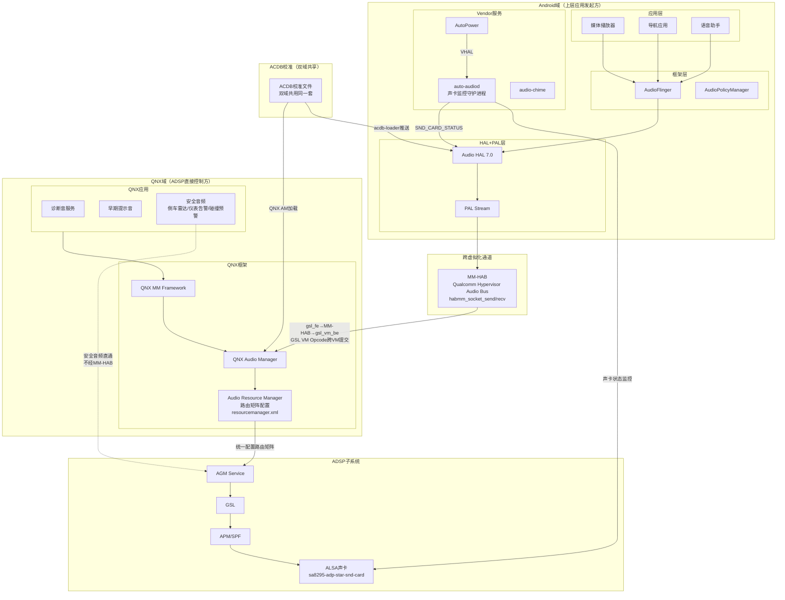
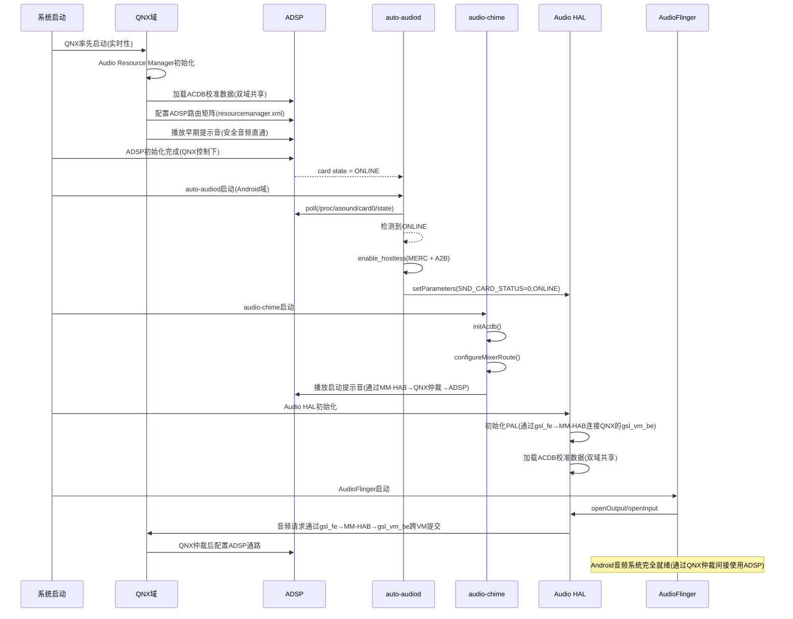
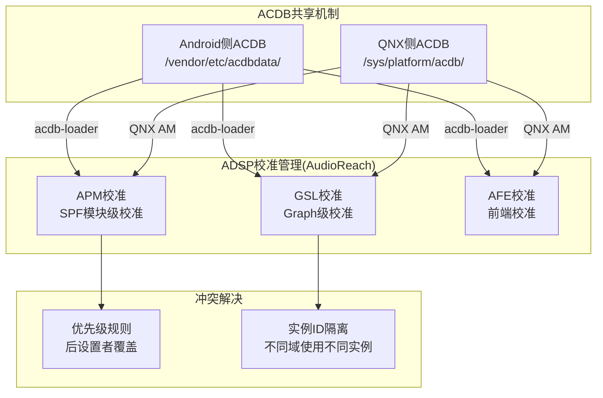
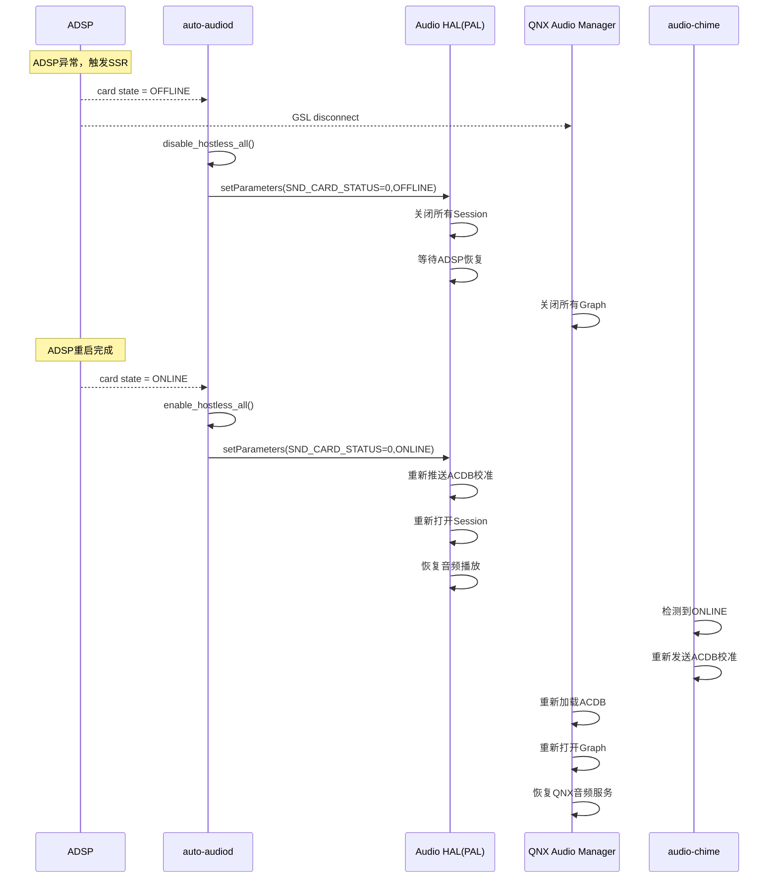

[← 16.11 SessionGsl与GSL接](16_16.11_SessionGsl与GSL接口.md) | [← 返回SA8295 Vendor+QNX双域音频架构深度解析](README.md) | [返回导航](../README.md) | [16.13 Primary HAL(Aud →](16_16.13_Primary_HALAudioReach版深度解.md)

---

## 16.12 Android+QNX双域架构总结

### 16.12.1 双域数据流全景

> **架构核心**：QNX域是ADSP唯一控制方(Audio Resource Manager)，Android域所有音频请求通过gsl_fe→MM-HAB→gsl_vm_be跨虚拟化通道提交给QNX，由QNX统一配置ADSP路由矩阵。

### 16.12.2 双域启动时序

> **关键顺序**：QNX域率先启动并成为ADSP唯一控制方，Android域随后启动并通过gsl_fe→MM-HAB→gsl_vm_be跨VM通道与QNX协商音频请求。

### 16.12.3 ACDB共享机制

**Android域和QNX域共用同一套ACDB校准数据**，两者最终都服务于同一个ADSP，仅加载方式和时机不同：

**ACDB冲突解决策略**：

| 场景 | 冲突类型 | 解决策略 |
|------|---------|---------|
| Android播放媒体 + QNX播放提示音 | 同一Graph实例竞争 | 使用不同Graph实例，DSP内部混音 |
| Android设置Speaker校准 + QNX设置Speaker校准 | 校准数据覆盖 | 最后设置者生效，通常Android域优先 |
| 双域同时打开录音流 | APM路由冲突 | 使用不同TDM通道，AFE端口隔离 |

### 16.12.4 SSR协同恢复

当ADSP发生SSR(Subsystem Restart)时，两个域需要协同恢复：

### 16.12.5 双域音频优先级

在车载场景中，不同域的音频优先级由**QNX域Audio Resource Manager统一仲裁**，Android域的音频焦点请求通过gsl_fe→MM-HAB跨VM提交给QNX协商：

| 优先级 | 音频类型 | 来源域 | 处理方式 |
|--------|---------|--------|---------|
| 1(最高) | 紧急警告(ADAS) | QNX域(直通ADSP) | Duck所有其他音频，不受Android崩溃影响 |
| 2 | 安全提示音 | QNX域(直通ADSP) | Duck媒体音频 |
| 3 | 语音通话 | Android域(经MM-HAB→QNX仲裁) | 暂停媒体播放 |
| 4 | 导航提示 | Android域(经MM-HAB→QNX仲裁) | Duck媒体音频 |
| 5 | 通知提示音 | Android域(经MM-HAB→QNX仲裁) | 短暂Duck |
| 6(最低) | 媒体播放 | Android域(经MM-HAB→QNX仲裁) | 正常播放 |

### 16.12.6 关键配置文件汇总

| 配置文件 | 路径 | 作用域 | 说明 |
|---------|------|--------|------|
| resourcemanager.xml | /vendor/etc/ | Android域 | PAL资源配置 |
| sa8295-adp-star-snd-card.conf | /vendor/etc/ | Android域 | ALSA UCM配置 |
| acdb_cal.acdb | 双域共享 | Android+QNX | ACDB校准数据库（双域共用同一套） |
| acdb_cal.acdbdelta | 双域共享 | Android+QNX | ACDB增量校准（双域共用同一套） |
| audio_policy_configuration.xml | /vendor/etc/ | Android域 | 音频策略配置 |
| car_audio_configuration.xml | /vendor/etc/ | Android域 | 车载音频区域配置 |
| resourcemanager.xml | /sys/platform/audio/ | QNX域 | QNX Audio Resource Manager配置 |
| mixer_paths.xml | /sys/platform/audio/ | QNX域 | QNX Mixer路由配置(ADSP路由矩阵) |
| adsp_avs_config.acdb.pvm | /sys/platform/acdb/ | QNX域 | AVS配置 |

---

---

[← 16.11 SessionGsl与GSL接](16_16.11_SessionGsl与GSL接口.md) | [← 返回SA8295 Vendor+QNX双域音频架构深度解析](README.md) | [返回导航](../README.md) | [16.13 Primary HAL(Aud →](16_16.13_Primary_HALAudioReach版深度解.md)
