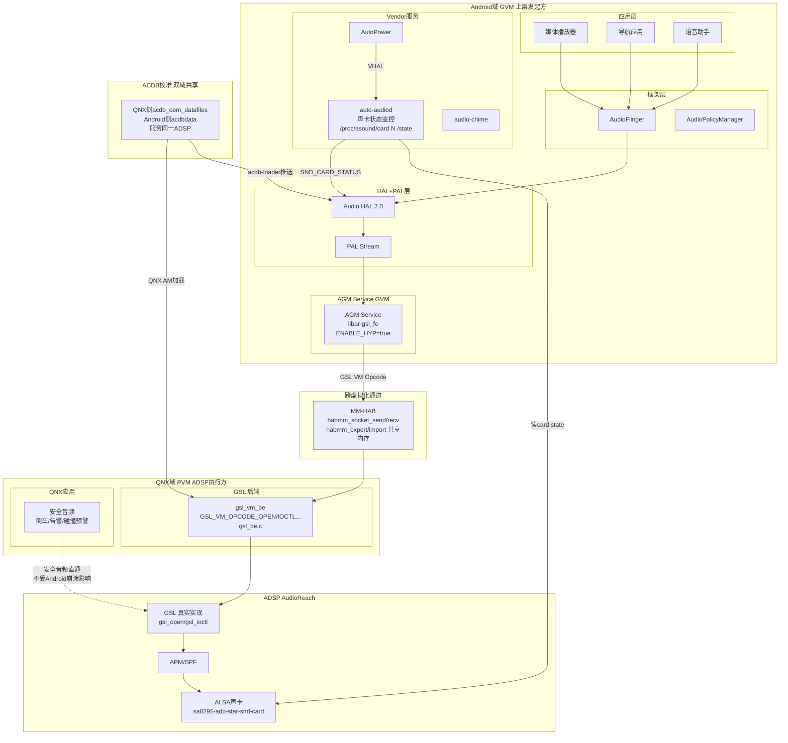
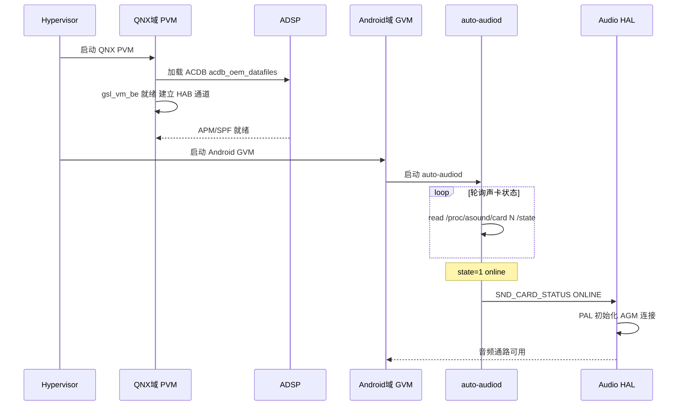
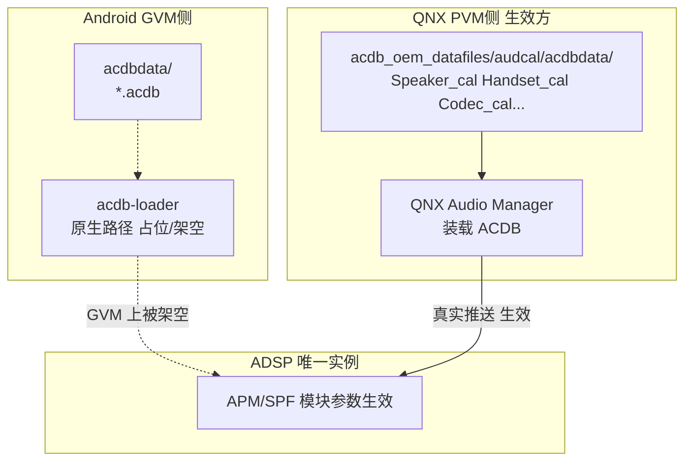
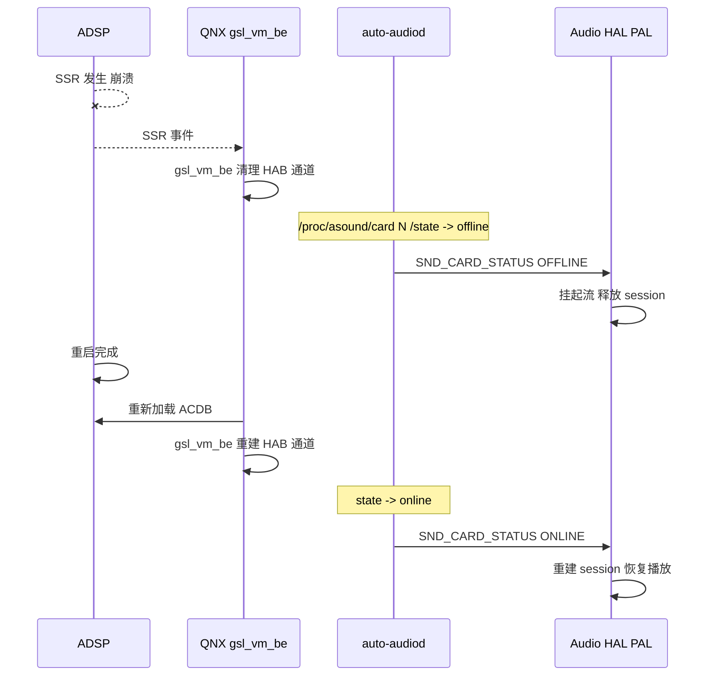

[← 16.11 SessionGsl与GSL接](16_16.11_SessionGsl与GSL接口.md) | [← 返回SA8295 Vendor+QNX双域音频架构深度解析](README.md) | [返回导航](../README.md) | [16.13 Primary HAL(Aud →](16_16.13_Primary_HALAudioReach版深度解.md)

---

## 16.12 Android+QNX双域架构总结

### 16.12.1 概述与重大澄清

> **本章重大澄清（对照真实源码，2026 核对）**：本章核心机制（MM-HAB / gsl_fe / gsl_vm_be / GSL VM Opcode）经真实源码验证**全部存在且命名正确**，但有两处需按源码修正：
>
> **澄清一：`libar-gsl_fe`（GSL 前端代理）在 AGM Service 层，不是 PAL 层。** 依据 `agm/service/Android.mk`：
> ```makefile
> ifeq ($(ENABLE_HYP), true)          # 虚拟化开启（SA8295 GVM）
> LOCAL_SHARED_LIBRARIES += libar-gsl_fe    # GSL 前端，跨 VM 到 QNX
> else
> LOCAL_SHARED_LIBRARIES += libar-gsl       # 本地完整 GSL（非虚拟化）
> endif
> ```
> 即：`ENABLE_HYP=true` 时，AGM Service 链接 `libar-gsl_fe`（把 GSL 调用转成跨 VM 请求）；PAL 只经 AGM，不直接持有 gsl_fe。因此正确调用链是 **PAL → AGM Service(gsl_fe) → MM-HAB → QNX(gsl_vm_be)**。
>
> **澄清二：QNX 侧配置/校准文件路径为真实路径。** QNX 侧 ACDB 真实位于 `boards/audio_driver/adp_8295/acdb_oem_datafiles/audcal/acdbdata/`（分类 `.acdb` 文件：Speaker_cal / Handset_cal / Codec_cal / General_cal / Hdmi_cal 等）；GSL 子图/路由配置为 `gsl/api/gsl_subgraph_driver_props.xml`。

### 16.12.2 双域数据流全景

> **架构核心**：QNX(PVM) 是 ADSP 的最终执行方，GSL 真实实现运行在 QNX 侧（`gsl_vm_be`）。Android(GVM) 侧的音频图请求经 **PAL → AGM(libar-gsl_fe) → MM-HAB(habmm) → QNX(gsl_vm_be) → GSL → GPR → APM(SPF)** 提交给 ADSP。



> **真实证据**：
> - `libar-gsl_fe` / `libar-gsl`：`agm/service/Android.mk`（ENABLE_HYP 条件编译）
> - `gsl_vm_be.c` / `gsl_vm_msg.h`：QNX `audio_ar/audio_driver/gsl_be/`
> - `GSL_VM_OPCODE_OPEN=4 / IOCTL=13 / READ=14 / WRITE=15`：`gsl_vm_msg.h`（每个 opcode 直映一个 GSL API）
> - `habmm_export/habmm_import/habmm_unexport`（共享内存跨 VM 零拷贝）：`gsl_vm_be.c`（`#include "habmm.h"`）
> - `/proc/asound/card<N>/state`（声卡状态）：`audiod/AudioDaemon.cpp`

### 16.12.3 双域启动时序

> QNX(PVM) 先于 Android(GVM) 启动，ADSP/GSL 后端就绪后 Android 侧声卡才可用；`auto-audiod` 通过轮询 `/proc/asound/card<N>/state` 判定声卡上线（online/offline）。



### 16.12.4 ACDB校准双域共享机制

> **核心事实**（见 16.7）：ADSP 只有一份，校准最终生效方是 **QNX 侧装载的 ACDB**（`acdb_oem_datafiles`）。Android 侧虽保留 acdb-loader 直连路径，但在 SA8295 GVM 上被架空/占位——真正推送到 DSP 的校准以 QNX 侧为准。



### 16.12.5 SSR 协同恢复

> ADSP 发生 SSR（子系统重启）时，QNX(PVM) 是主控恢复方，Android(GVM) 侧通过声卡状态变化被动感知并重建通路。



### 16.12.6 双域音频优先级

> ⚠ **说明性/设计推演，非源码直接定义。** 下表为对车载场景音频优先级的架构性归纳，用于理解 QNX 安全音频与 Android 娱乐音频的分域关系；实际优先级由 ADSP 侧路由/混音策略与各域 stream 属性共同决定，源码中并无单一"优先级表"。

| 优先级 | 音频类型 | 所属域 | 说明（推演） |
|--------|---------|--------|------|
| 最高 | 安全告警/碰撞预警/倒车提示 | QNX(PVM) | 直通 DSP，不受 Android 崩溃影响 |
| 高 | 电话/eCall 语音 | Android(GVM) | 语音通路，可打断媒体 |
| 中 | 导航 TTS | Android(GVM) | 可与媒体混音/闪避(ducking) |
| 低 | 媒体播放 | Android(GVM) | 常规娱乐音频 |

### 16.12.7 关键配置文件汇总（按真实路径）

> ⚠ 以下路径以本机真实源码为准；标注"运行时/推测"者非源码文件。

| 类别 | 域 | 真实路径 | 说明 |
|------|----|---------|------|
| ACDB 校准 | QNX(PVM) | `boards/audio_driver/adp_8295/acdb_oem_datafiles/audcal/acdbdata/` | 分类 .acdb：Speaker_cal / Handset_cal / Codec_cal / General_cal / Hdmi_cal |
| GSL 子图/路由 | QNX(PVM) | `gsl/api/gsl_subgraph_driver_props.xml`、`gsl_subgraph_platform_driver_props.xml` | 子图属性/平台驱动属性 |
| GSL VM 后端 | QNX(PVM) | `audio_ar/audio_driver/gsl_be/`（gsl_vm_be.c / gsl_vm_msg.h） | 跨 VM GSL 后端 + Opcode 协议 |
| AGM Service | Android(GVM) | `agm/service/Android.mk`（ENABLE_HYP → libar-gsl_fe） | 虚拟化时链接 GSL 前端代理 |
| PAL | Android(GVM) | `pal/`（Android.mk 链接 libar-gsl） | PAL Stream/Session 实现 |
| 声卡状态监控 | Android(GVM) | `/proc/asound/cards`、`/proc/asound/card<N>/state`（运行时） | auto-audiod/AudioDaemon 读取 |
| ACDB（GVM 占位） | Android(GVM) | `acdbdata/*.acdb` | 原生 acdb-loader 路径，GVM 上被架空 |

### 16.12.8 小结

1. **QNX(PVM) 是 ADSP/GSL 的真实执行方**：GSL 真实实现（`gsl_vm_be` + `gsl_intf.h`）运行在 QNX 侧。
2. **Android(GVM) 通过 AGM 的 `libar-gsl_fe` 跨 VM**：`ENABLE_HYP=true` 时 AGM Service 链接 gsl_fe，把 GSL 调用经 GSL VM Opcode 封装、走 MM-HAB(habmm 共享内存) 提交给 QNX。
3. **ACDB 校准以 QNX 侧为准**：Android 原生 acdb-loader 路径在 GVM 上被架空/占位。
4. **声卡状态经 `/proc/asound/card<N>/state` 感知**：auto-audiod 轮询判定 online/offline，驱动启动与 SSR 恢复。