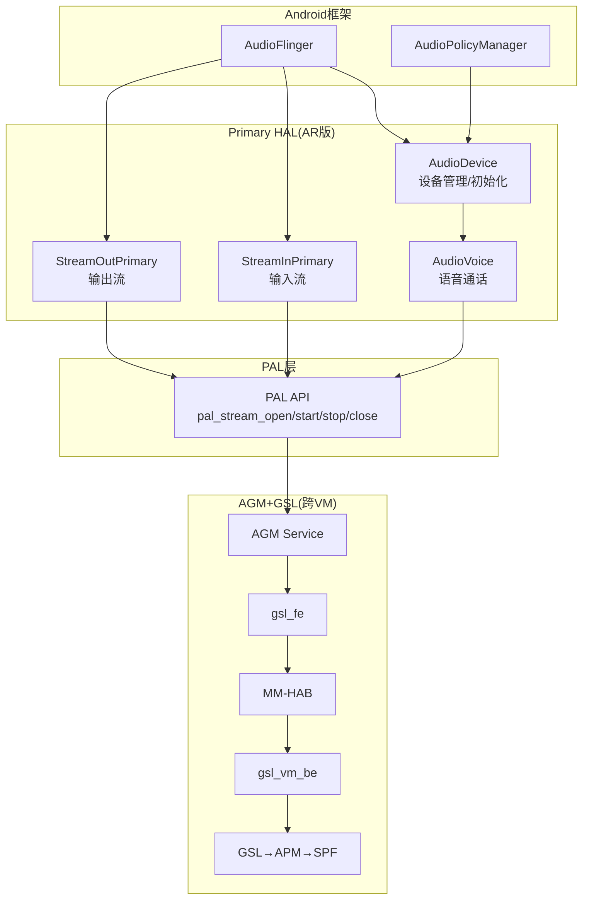

[← 16.12 Android+QNX双域架构](16_16.12_Android+QNX双域架构总结.md) | [← 返回SA8295 Vendor+QNX双域音频架构深度解析](README.md) | [返回导航](../README.md) | [16.14 GSL(Graph Servi →](16_16.14_GSLGraph_Service_Layer内部架.md)

---

## 16.13 Primary HAL(AudioReach版)深度解析

### 16.13.1 概述与架构定位

Primary HAL(AudioReach版)是8295平台上AudioReach架构的Audio HAL 7.0实现，位于PAL层之上，将Android框架的音频语义转换为PAL API调用。与旧版`audio-hal`不同，AR版专为AudioReach架构设计，通过PAL→AGM→gsl_fe→MM-HAB→gsl_vm_be→GSL→APM路径与DSP交互。

**源码路径**：`vendor/qcom/opensource/audio-hal-ar/primary-hal/hal-pal/`

**核心类关系**：



### 16.13.2 AudioDevice类

`AudioDevice`是Primary HAL的核心管理类，负责设备初始化、流创建/销毁、Audio Patch管理和麦克风特性解析。

**关键定义**（[`AudioDevice.h`](vendor/qcom/opensource/audio-hal-ar/primary-hal/hal-pal/AudioDevice.h)）：

| 常量/类型 | 值 | 说明 |
|-----------|-----|------|
| COMPRESS_VOIP_IO_BUF_SIZE_NB | 320 | VoIP窄带缓冲区 |
| COMPRESS_VOIP_IO_BUF_SIZE_WB | 640 | VoIP宽带缓冲区 |
| COMPRESS_VOIP_IO_BUF_SIZE_SWB | 1280 | VoIP超宽带缓冲区 |
| COMPRESS_VOIP_IO_BUF_SIZE_FB | 1920 | VoIP全频带缓冲区 |
| MIN_VOLUME_VALUE_MB | -6000 | 最小音量(mB) |
| MAX_VOLUME_VALUE_MB | 0 | 最大音量(mB) |

**核心方法**：

```cpp
class AudioDevice {
public:
    static std::shared_ptr<AudioDevice> GetInstance();
    int Init(hw_device_t **device, const hw_module_t *module);
    // 流管理
    std::shared_ptr<StreamOutPrimary> CreateStreamOut(...);
    void CloseStreamOut(std::shared_ptr<StreamOutPrimary> stream);
    std::shared_ptr<StreamInPrimary> CreateStreamIn(...);
    void CloseStreamIn(std::shared_ptr<StreamInPrimary> stream);
    // Audio Patch
    int CreateAudioPatch(audio_patch_handle_t* handle,
                         const std::vector<struct audio_port_config>& sources,
                         const std::vector<struct audio_port_config>& sinks);
    int ReleaseAudioPatch(audio_patch_handle_t handle);
    // 设备映射
    int GetPalDeviceIds(const std::set<audio_devices_t>& hal_device_id,
                        pal_device_id_t* pal_device_id);
    // 参数控制
    int SetParameters(const char *kvpairs);
    char* GetParameters(const char *keys);
    int SetMode(const audio_mode_t mode);
    int SetVoiceVolume(float volume);
    int SetMicMute(bool state);
    // 麦克风特性(XML解析)
    static microphone_characteristics_t microphones;
    static snd_device_to_mic_map_t microphone_maps[PAL_MAX_INPUT_DEVICES];
protected:
    std::shared_ptr<AudioVoice> voice_;
    std::vector<std::shared_ptr<StreamOutPrimary>> stream_out_list_;
    std::vector<std::shared_ptr<StreamInPrimary>> stream_in_list_;
    std::map<audio_devices_t, pal_device_id_t> android_device_map_;
    std::map<audio_patch_handle_t, AudioPatch*> patch_map_;
};
```

**AudioPatch类**：支持3种Patch类型

| PatchType | 说明 |
|-----------|------|
| PATCH_PLAYBACK | 播放Patch(源→输出设备) |
| PATCH_CAPTURE | 录音Patch(输入设备→源) |
| PATCH_DEVICE_LOOPBACK | 设备间Loopback |

**麦克风特性解析**：通过Expat XML解析器解析`microphone_characteristics.xml`，将PAL设备ID映射到`audio_microphone_characteristic_t`结构体。

### 16.13.3 AudioStream类与延迟参数

`StreamOutPrimary`和`StreamInPrimary`继承自`StreamPrimary`基类，负责音频流的打开、读写、路由和生命周期管理。

**延迟参数定义**（[`AudioStream.h`](vendor/qcom/opensource/audio-hal-ar/primary-hal/hal-pal/AudioStream.h)）：

| 常量 | 值(ms) | 说明 |
|------|--------|------|
| LOW_LATENCY_PLATFORM_DELAY | 13 | 低延迟播放延迟 |
| DEEP_BUFFER_PLATFORM_DELAY | 70 | Deep Buffer播放延迟 |
| PCM_OFFLOAD_PLATFORM_DELAY | 30 | PCM Offload播放延迟 |
| MMAP_PLATFORM_DELAY | 3 | MMAP播放延迟 |
| ULL_PLATFORM_DELAY | 4 | Ultra Low Latency延迟 |

**缓冲区参数**：

| 常量 | 值 | 说明 |
|------|-----|------|
| LOW_LATENCY_PLAYBACK_PERIOD_SIZE | 240帧(5ms@48kHz) | 低延迟播放周期大小 |
| LOW_LATENCY_PLAYBACK_PERIOD_COUNT | 2 | 低延迟播放周期数 |
| DEEP_BUFFER_PLAYBACK_PERIOD_SIZE | 1920帧(40ms@48kHz) | Deep Buffer播放周期大小 |
| DEEP_BUFFER_PLAYBACK_PERIOD_COUNT | 2 | Deep Buffer播放周期数 |
| MMAP_PERIOD_SIZE | 48帧(1ms@48kHz) | MMAP播放周期大小 |
| MMAP_PERIOD_COUNT_DEFAULT | 512 | MMAP周期数(最大) |
| ULL_PERIOD_SIZE | 48帧(1ms@48kHz) | ULL周期大小 |
| ULL_PERIOD_COUNT_DEFAULT | 512 | ULL周期数 |
| DEFAULT_OUTPUT_SAMPLING_RATE | 48000 | 默认输出采样率 |

**UseCase枚举**（完整映射）：

| 分类 | UseCase | 字符串标识 |
|------|---------|-----------|
| 播放 | USECASE_AUDIO_PLAYBACK_DEEP_BUFFER | deep-buffer-playback |
| 播放 | USECASE_AUDIO_PLAYBACK_LOW_LATENCY | low-latency-playback |
| 播放 | USECASE_AUDIO_PLAYBACK_ULL | audio-ull-playback |
| 播放 | USECASE_AUDIO_PLAYBACK_MMAP | mmap-playback |
| 播放 | USECASE_AUDIO_PLAYBACK_OFFLOAD(0-9) | compress-offload-playback(0-9) |
| 播放 | USECASE_AUDIO_PLAYBACK_VOIP | audio-playback-voip |
| 录音 | USECASE_AUDIO_RECORD | audio-record |
| 录音 | USECASE_AUDIO_RECORD_LOW_LATENCY | low-latency-record |
| 录音 | USECASE_AUDIO_RECORD_VOIP | audio-record-voip |
| 录音 | USECASE_AUDIO_RECORD_MMAP | mmap-record |
| 语音 | USECASE_VOICEMMODE1_CALL | voicemmode1-call |
| 语音 | USECASE_VOICEMMODE2_CALL | voicemmode2-call |
| 车载 | USECASE_AUDIO_PLAYBACK_MEDIA | media-playback |
| 车载 | USECASE_AUDIO_PLAYBACK_SYS_NOTIFICATION | sys-notification-playback |
| 车载 | USECASE_AUDIO_PLAYBACK_NAV_GUIDANCE | nav-guidance-playback |
| 车载 | USECASE_AUDIO_PLAYBACK_PHONE | phone-playback |
| FM | USECASE_AUDIO_PLAYBACK_FM | play-fm |
| HFP | USECASE_AUDIO_HFP_SCO | hfp-sco |
| 通话录音 | USECASE_INCALL_REC_UPLINK | incall-rec-uplink |

**车载音频流类型**：

| 常量 | 值 | 说明 |
|------|-----|------|
| CAR_AUDIO_STREAM_MEDIA | 0 | 媒体流 |
| CAR_AUDIO_STREAM_SYS_NOTIFICATION | 1 | 系统通知流 |
| CAR_AUDIO_STREAM_NAV_GUIDANCE | 2 | 导导流 |
| CAR_AUDIO_STREAM_PHONE | 3 | 电话流 |
| CAR_AUDIO_STREAM_FRONT_PASSENGER | 8 | 前排乘客流 |
| CAR_AUDIO_STREAM_REAR_SEAT | 16 | 后排座椅流 |
| MAX_CAR_AUDIO_STREAMS | 32 | 最大车载流数 |

**StreamOutPrimary核心方法**：

```cpp
class StreamOutPrimary : public StreamPrimary {
public:
    ssize_t write(const void *buffer, size_t bytes);  // PCM数据写入
    int Open();                                        // 打开PAL Stream
    int Standby();                                     // 待机
    int SetVolume(float left, float right);            // 音量设置
    int Pause()/Resume();                              // 暂停/恢复
    int Drain(audio_drain_type_t type);                // Drain操作
    int Flush();                                       // 刷新
    int RouteStream(const std::set<audio_devices_t>&); // 路由切换
    static pal_stream_type_t GetPalStreamType(
        audio_output_flags_t halStreamFlags, char *address);
    int64_t GetRenderLatency(audio_output_flags_t flags, char *address);
    // Offload Effects
    int StartOffloadEffects(audio_io_handle_t, pal_stream_handle_t*);
    int StopOffloadEffects(audio_io_handle_t, pal_stream_handle_t*);
    // MMAP支持
    int CreateMmapBuffer(int32_t min_size_frames, struct audio_mmap_buffer_info *info);
    int GetMmapPosition(struct audio_mmap_position *position);
protected:
    pal_stream_handle_t* pal_stream_handle_;           // PAL流句柄
    struct pal_stream_attributes streamAttributes_;    // PAL流属性
    audio_output_flags_t flags_;                       // HAL输出标志
};
```

**格式映射表**（Android格式→PAL格式）：

| Android格式 | PAL格式 |
|-------------|---------|
| AUDIO_FORMAT_PCM_16_BIT | PAL_AUDIO_FMT_PCM_S16_LE |
| AUDIO_FORMAT_PCM_24_BIT_PACKED | PAL_AUDIO_FMT_PCM_S24_3LE |
| AUDIO_FORMAT_PCM_8_24_BIT | PAL_AUDIO_FMT_PCM_S24_LE |
| AUDIO_FORMAT_PCM_32_BIT | PAL_AUDIO_FMT_PCM_S32_LE |
| AUDIO_FORMAT_MP3 | PAL_AUDIO_FMT_MP3 |
| AUDIO_FORMAT_AAC | PAL_AUDIO_FMT_AAC |
| AUDIO_FORMAT_FLAC | PAL_AUDIO_FMT_FLAC |
| AUDIO_FORMAT_ALAC | PAL_AUDIO_FMT_ALAC |
| AUDIO_FORMAT_APE | PAL_AUDIO_FMT_APE |

### 16.13.4 AudioVoice类与语音VSID

`AudioVoice`管理语音通话的生命周期，包括VSID映射、通话状态更新和设备路由。

**VSID定义**（[`AudioVoice.h`](vendor/qcom/opensource/audio-hal-ar/primary-hal/hal-pal/AudioVoice.h)）：

| 常量 | 值 | 说明 |
|------|-----|------|
| VOICEMMODE1_VSID | 0x11C05000 | Voice Mode 1 VSID |
| VOICEMMODE2_VSID | 0x11DC5000 | Voice Mode 2 VSID |
| MAX_VOICE_SESSIONS | 2 | 最大语音会话数 |
| CALL_INACTIVE | 1 | 通话未激活 |
| CALL_ACTIVE | 2 | 通话激活 |

**语音会话结构**：

```cpp
struct voice_session_t {
    call_state_t state;           // current_/new_ 通话状态
    uint32_t vsid;                // VSID标识
    uint32_t tty_mode;            // TTY模式(tty_off/vco/hco/full)
    pal_stream_handle_t* pal_voice_handle;  // PAL语音流句柄
    bool volume_boost;            // 音量增强
    bool slow_talk;               // 慢速通话
    bool hd_voice;                // HD语音
    struct pal_volume_data *pal_vol_data;  // PAL音量数据
    pal_device_mute_t device_mute;         // 设备静音
};
```

**语音参数Key**：

| 参数Key | 说明 |
|---------|------|
| AUDIO_PARAMETER_KEY_VSID | VSID标识 |
| AUDIO_PARAMETER_KEY_CALL_STATE | 通话状态 |
| AUDIO_PARAMETER_KEY_DEVICE_MUTE | 设备静音 |
| AUDIO_PARAMETER_KEY_DIRECTION | 麦克风/扬声器方向 |
| AUDIO_PARAMETER_KEY_VOLUME_BOOST | 音量增强 |
| AUDIO_PARAMETER_KEY_SLOWTALK | 慢速通话 |
| AUDIO_PARAMETER_KEY_HD_VOICE | HD语音 |
| AUDIO_PARAMETER_KEY_TTY_MODE | TTY模式 |

**AudioVoice核心方法**：

```cpp
class AudioVoice {
public:
    int VoiceStart(voice_session_t *session);    // 启动语音
    int VoiceStop(voice_session_t *session);     // 停止语音
    int VoiceSetDevice(voice_session_t *session); // 设置语音设备
    int UpdateCallState(uint32_t vsid, int call_state); // 更新通话状态
    int SetMicMute(bool mute);                   // 麦克风静音
    int SetVoiceVolume(float volume);            // 语音音量
    int RouteStream(const std::set<audio_devices_t>&);  // 语音路由
    int GetMatchingTxDevices(...);                // TX设备匹配
    pal_device_id_t pal_voice_tx_device_id_;     // TX PAL设备ID
    pal_device_id_t pal_voice_rx_device_id_;     // RX PAL设备ID
};
```

### 16.13.5 audio_extn扩展模块

Primary HAL通过`audio_extn`扩展模块支持多种音频功能：

| 扩展模块 | 说明 | AudioReach适配 |
|----------|------|---------------|
| auto_hal | 车载音频区域管理 | 通过PAL Car Stream映射 |
| battery_listener | 电池状态监听 | 影响PA供电策略 |
| FM | FM收音机 | FM Tuner→PAL Stream |
| Hfp | HFP蓝牙通话 | SCO→PAL Voice Session |
| soundtrigger | 语音触发 | PAL SVA/Hotword Stream |
| Gef | Generic Effect Framework | Offload Effect Plugin |
| Gain | 增益控制 | PAL Volume Control |
| a2dp | A2DP蓝牙音频 | PAL A2DP Stream |
|custom_compress|自定义压缩格式| PAL Compress Offload |

### 16.13.6 Primary HAL(AR版) vs Legacy版对比

| 维度 | AR版(audio-hal-ar) | Legacy版(audio-hal) |
|------|--------------------|--------------------|
| DSP架构 | AudioReach(AGM+APM+SPF) | Legacy(ADM+ASM+COPP) |
| DSP通信路径 | PAL→AGM→gsl_fe→HAB→gsl_vm_be→GSL→APM→SPF | PAL→GSL→ADM→ASM→COPP |
| Graph管理 | AGM Session+Graph对象 | SessionGsl直接管理 |
| 流类型 | PAL_STREAM_ULL新增 | 无ULL支持 |
| 车载流 | Media/Nav/Phone/SysNoti | 无专用车载流 |
| 语音VSID | VOICEMMODE1/2双模 | VOICEMMODE1单模 |
| MMAP | 支持(48帧/1ms周期) | 支持但配置不同 |
| Format | PAL_AUDIO_FMT完整映射 | 部分格式缺失 |
| Offload | libqcompostprocbundle.so | 同 |
| 编译路径 | hal-pal/ | hal/ |

---

### 16.13.7 源码路径参考

> **真实磁盘路径（对照源码）**：Primary HAL(AudioReach版) 属于 Android(GVM) 侧,源码位于 `vendor/qcom/opensource/audio-hal-ar/primary-hal/hal-pal/`。该目录为 AOSP vendor 树下的逻辑路径,本知识库所在工作区未同步 vendor 源码,实际以设备端 vendor 分支为准。AR 版对接 PAL,再经 AGM→gsl_fe→HAB 跨 VM 抵达 QNX(PVM) 侧 GSL;Legacy 版位于 `audio-hal/`(`hal/`),两者以编译路径区分。

```
vendor/qcom/opensource/audio-hal-ar/primary-hal/hal-pal/
├── AudioDevice.h / AudioDevice.cpp   # 设备管理(枚举/路由/参数)
├── AudioStream.h / AudioStream.cpp   # 流对象(播放/录制/MMAP/ULL,延迟参数)
├── AudioVoice.h  / AudioVoice.cpp    # 语音通路(VSID: VOICEMMODE1/2 双模)
├── audio_extn/                       # 扩展模块(offload/后处理等)
└── Android.mk / Android.bp           # 构建配置(hal-pal)
```

> **对照说明**：AR 版通过 PAL 的流/设备抽象与 [16.11 SessionGsl](16_16.11_SessionGsl与GSL接口.md)、[16.10 AGM](16_16.10_AGMAudio_Graph_Manager深度解.md) 协作;PAL_STREAM_ULL、车载流(Media/Nav/Phone/SysNoti)与 PAL_AUDIO_FMT 映射为 AR 版相较 Legacy 的关键增强。

---

---

[← 16.12 Android+QNX双域架构](16_16.12_Android+QNX双域架构总结.md) | [← 返回SA8295 Vendor+QNX双域音频架构深度解析](README.md) | [返回导航](../README.md) | [16.14 GSL(Graph Servi →](16_16.14_GSLGraph_Service_Layer内部架.md)
