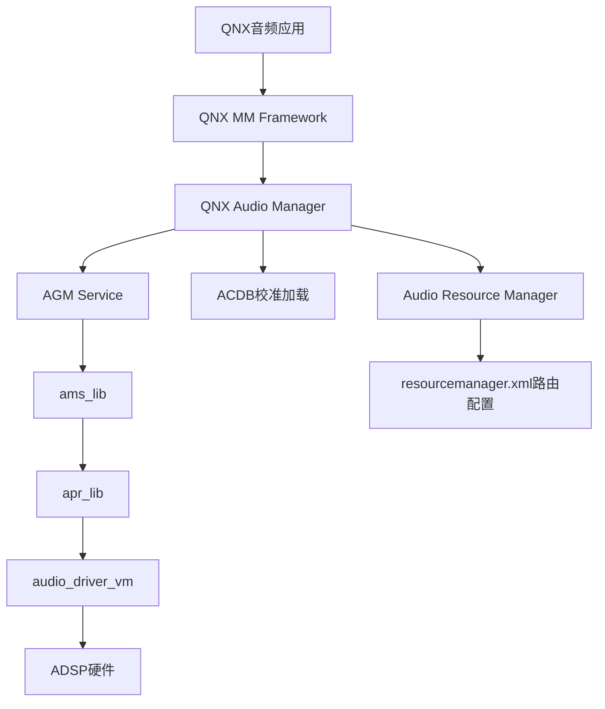
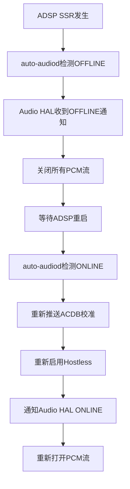
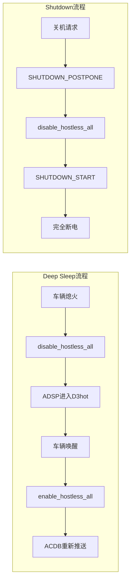
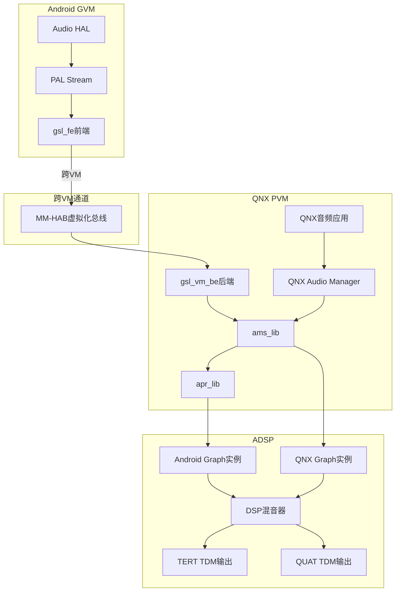
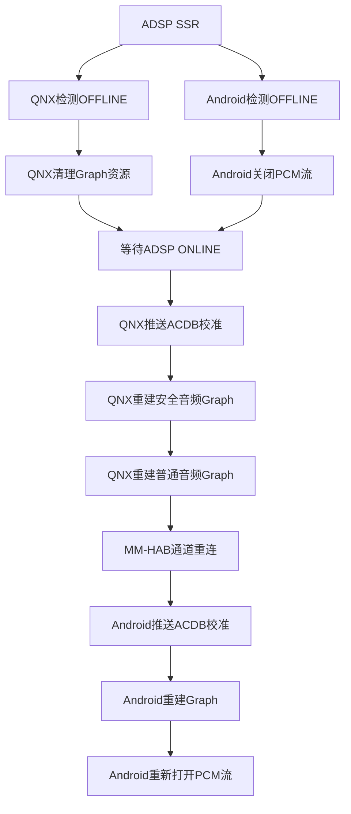
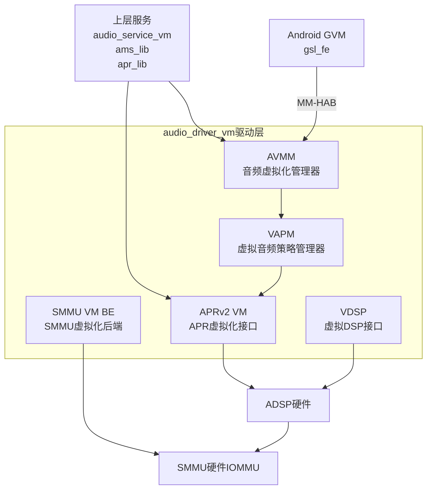
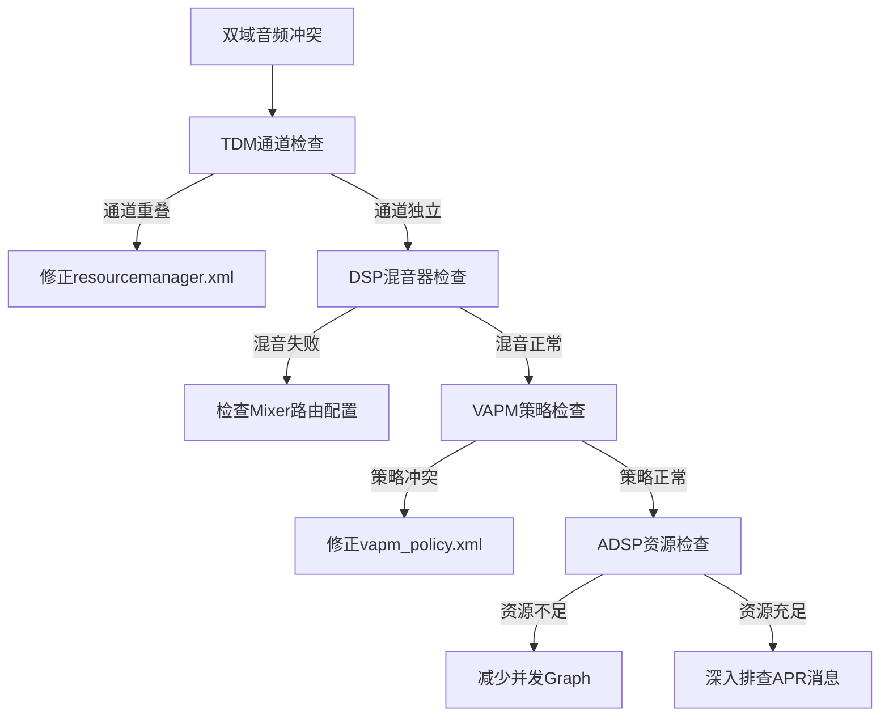
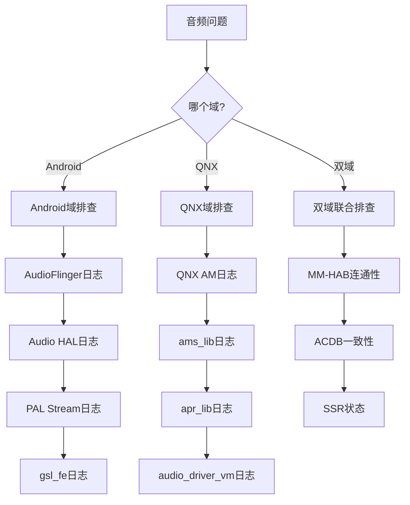

[← 16.14 GSL(Graph Servi](16_16.14_GSLGraph_Service_Layer内部架.md) | [← 返回16章](README.md) | [返回导航](../README.md)

---

## 16.15 常见问题与解答(Q&A)

本章汇总SA8295 QNX+Android双域音频架构开发与调试中的高频问题，涵盖auto-audiod、ACDB校准、GSL Graph、MM-HAB跨VM通信、AVMM/VAPM虚拟化、SSR跨域恢复、安全音频等核心场景。每个问题均提供系统化排查步骤、命令示例和常见错误码。

### 16.15.1 声卡与auto-audiod相关

#### Q1: auto-audiod检测不到ADSP声卡上线怎么办？

**A**: 按以下步骤系统化排查：

**Step 1 — 确认ADSP硬件是否正常启动**：
```bash
cat /proc/asound/cards
# 应能看到 sa8295-adp-star-snd-card 或类似声卡
# 若无输出，说明ADSP未就绪或内核驱动未加载
```

**Step 2 — 检查声卡state文件**：
```bash
cat /proc/asound/card0/state
# 应显示 ONLINE；若为 OFFLINE 说明ADSP尚未完成初始化
```

**Step 3 — 查看auto-audiod日志**：
```bash
logcat -s AutoAudioDaemon
# 重点关注 getSndCardFDs() 返回值
# 错误码 ENODEV(19) = 声卡设备节点不存在
# 错误码 EACCES(13) = 权限不足
```

**Step 4 — 确认声卡名匹配过滤条件**：auto-audiod只监控以`msm`/`apq`/`sa`开头的声卡，自定义声卡名需修改过滤逻辑。

**Step 5 — 检查ADSP低功耗状态**：
```bash
cat /proc/asound/card0/power
# D0 = 正常工作；D3hot = 低功耗休眠
# 若卡在D3hot，需检查GDSC供电和clock是否使能
```

**Step 6 — 检查uevent机制**：
```bash
# 确认内核uevent能正常上报
udevadm monitor --kernel --subsystem-match=sound
# 观察 ONLINE/OFFLINE 事件
```

**常见错误码**：

| 错误码 | 含义 | 解决方法 |
|--------|------|----------|
| ENODEV(19) | 声卡设备不存在 | 检查ADSP固件是否加载 |
| EACCES(13) | 权限不足 | 检查/dev/snd权限和SELinux策略 |
| ETIMEDOUT(110) | 等待超时 | ADSP启动过慢，增大poll超时 |

---

#### Q2: Hostless会话无法启用怎么排查？

**A**: Hostless启用失败常见原因及排查步骤：

**Step 1 — Mixer控制不存在**：检查Port Mixer名称是否匹配当前平台
```bash
tinymix -D 0 | grep "Port Mixer"
# 应能看到 TERT_TDM_TX_0 Port Mixer SEC_TDM_RX_0
# 若无输出，检查UCM配置中Hostless Mixer定义
```

**Step 2 — PCM设备打开失败**：检查PCM设备是否被占用
```bash
ls -la /dev/snd/pcmC0D*
# PCM#48-51为hostless专用，检查是否有其他进程占用
fuser /dev/snd/pcmC0D48c  # 检查capture设备
fuser /dev/snd/pcmC0D49p  # 检查playback设备
```

**Step 3 — ADSP未就绪**：确认声卡处于ONLINE和D0状态
```bash
cat /proc/asound/card0/state  # ONLINE
cat /proc/asound/card0/power  # D0
```

**Step 4 — Wakelock问题**：检查wakelock是否正常持有
```bash
cat /sys/power/wake_lock
# 应包含 hostless_merc 和 hostless_a2b
# 若wakelock丢失，系统可能进入suspend导致hostless断开
```

**Step 5 — A2B总线状态**（A2B Hostless场景）：
```bash
# A2B节点发现失败也会导致hostless无法启用
logcat -s AutoAudioDaemon | grep -i a2b
# 检查A2B节点枚举是否完成
```

---

### 16.15.2 早期音频与ACDB校准

#### Q3: audio-chime启动音播放失败怎么排查？

**A**: 按以下顺序排查：

**Step 1 — ACDB初始化失败**：
```bash
logcat -s AudioChime
# 检查 acdb_loader_init_v4 返回值
# 检查 acdb_loader_send_audio_cal_v6 返回值
# 错误码 -1 = ACDB文件打开失败
# 错误码 -2 = ACDB ID不存在
```

**Step 2 — Mixer路由未配置**：
```bash
tinymix -D 0 "TERT_TDM_RX_0 Audio Mixer MultiMedia23"
# 应为1；若为0说明路由未建立
```

**Step 3 — PCM设备打开失败**：
```bash
tinypcminfo -D 0 -c 22
# 检查MULTIMEDIA23(PCM#22)是否可用
# audio-chime使用专用PCM避免与主Audio HAL冲突
```

**Step 4 — 静默启动模式**：检查系统属性
```bash
getprop persist.audio.silent_boot
# 如果为1，audio-chime不会播放
# Silent Boot模式下跳过启动音以加速开机
```

**Step 5 — WAV文件不存在或格式错误**：
```bash
ls -la /vendor/etc/chime/*.wav
# 确认WAV文件存在且为PCM格式
# 采样率必须为48000Hz，16bit，匹配ADSP配置
```

---

#### Q4: ACDB校准数据没有正确推送到ADSP怎么排查？

**A**: ACDB推送失败的常见原因：

**Step 1 — ACDB文件缺失或损坏**：
```bash
ls -la /vendor/etc/acdbdata/*.acdb
# 确认ACDB文件存在且非空
md5sum /vendor/etc/acdbdata/acdb_cal.acdb
# 对比编译产物确认文件完整性
```

**Step 2 — acdb-loader初始化失败**：
```bash
logcat -s AcdbLoader
# 检查 acdb_loader_init_v4 返回值
# AR架构使用 acdb_loader_init_v4
# Legacy架构使用 acdb_loader_init_v2
```

**Step 3 — ACDB ID不匹配**：确认使用的acdb_id在ACDB文件中有对应条目
```cpp
// 常见ID映射：
// 15 = Speaker Rx Calibration
// 60 = Media Rx Calibration
// 22 = BT_SCO_RX Calibration
// 36 = Handset Tx Calibration
// 使用ACDB工具验证ID是否存在
```

**Step 4 — ADSP服务未就绪**：确认APM/AGM服务已启动
```bash
cat /proc/asound/card0/state  # ONLINE
# ADSP必须处于ONLINE状态才能接收校准数据
```

**Step 5 — IOCTL调用失败**：检查内核日志
```bash
dmesg | grep -E "apm|adm|acdb"
# 常见错误：
# "adm: failed to send ACDB cal" = ADSP未就绪
# "acdb: invalid cal type" = 校准类型ID无效
```

**Step 6 — 双域ACDB冲突检查**：
```bash
# 确认Android域和QNX域不会同时推送同一个ACDB ID
# QNX侧推送的Instance ID域与Android不同
logcat -s AcdbLoader | grep "instance_id"
```

---

### 16.15.3 QNX域音频问题

#### Q5: QNX侧音频无法播放怎么排查？

**A**: QNX侧音频问题需从服务链路逐层排查：



**Step 1 — 确认QNX Audio Manager服务状态**：
```bash
# QNX侧使用slog2info查看服务日志
slog2info | grep -i "audio_manager"
# 确认audio_service_vm进程正在运行
pidin | grep audio_service
```

**Step 2 — 检查QNX侧ACDB文件是否正确加载**：
```bash
# 确认ACDB文件路径
ls -la /etc/acdbdata/acdb_cal.acdb     # AR架构
ls -la /etc/acdbdata/Handset_cal.acdb  # Legacy架构
# QNX侧ACDB路径可能不同于Android侧
```

**Step 3 — 确认ADSP Graph是否成功打开**：
```bash
# 查看QNX AM日志中Graph open返回值
slog2info | grep -E "graph_open|gsl_open"
# 错误码 0x0001 = Module not found
# 错误码 0x0003 = Calibration missing
```

**Step 4 — 检查TDM通道是否被Android域占用**：
```bash
# QNX使用QUAT/QUIN TDM通道
# 若通道被Android错误占用，需检查路由矩阵配置
slog2info | grep -E "TDM|tdm_interface"
```

**Step 5 — 确认AVS配置**：
```bash
ls -la /etc/acdbdata/avs_config/adsp_avs_config.acdb.pvm
# AVS配置决定ADSP工作频率和电压
# 配置错误会导致ADSP无法正常处理音频
```

---

### 16.15.4 SSR与电源联动

#### Q6: ADSP SSR后音频未恢复怎么办？

**A**: SSR(Subsystem Restart)恢复流程排查：

**Step 1 — 确认auto-audiod检测到ONLINE**：
```bash
logcat -s AutoAudioDaemon | grep "ONLINE"
# SSR后ADSP重启，auto-audiod应检测到 OFFLINE→ONLINE 转换
```

**Step 2 — 确认hostless重新启用**：
```bash
cat /sys/power/wake_lock | grep hostless
tinymix -D 0 | grep "Port Mixer"
# SSR恢复需要重新配置所有Mixer控制和wakelock
```

**Step 3 — 确认Audio HAL收到通知**：
```bash
logcat -s AudioHAL | grep "SND_CARD_STATUS"
# Audio HAL需要收到ONLINE通知才能重新打开PCM流
```

**Step 4 — 确认ACDB重新推送**：
```bash
logcat -s AcdbLoader
# SSR后需要重新推送所有校准数据到ADSP
# 这是必须步骤，ADSP重启后校准数据丢失
```

**Step 5 — 手动触发恢复**（如果自动恢复失败）：
```bash
# 通知Audio HAL声卡上线
setprop persist.audio.ssr_recovery 1
# 或重启audio HAL服务
stop vendor.audio-hal
start vendor.audio-hal
```

**Step 6 — QNX域SSR恢复检查**：
```bash
# QNX侧也需要重新初始化Graph
slog2info | grep -E "SSR|subsystem_restart"
# 确认QNX Audio Manager重新打开Graph成功
```

**SSR恢复时序图**：



---

#### Q11: 如何理解AutoPower的deep sleep和shutdown流程？

**A**:

**Deep Sleep流程**：
1. 车辆熄火→MCU发送sleep信号→Android进入Deep Sleep
2. `AutoPower`收到`SHUTDOWN_PREPARE`→`disable_hostless_all()`关闭所有Hostless会话
3. 系统进入Deep Sleep，ADSP进入D3hot低功耗状态
4. 车辆唤醒→MCU发送wake信号→Android退出Deep Sleep
5. `AutoPower`收到`DEEP_SLEEP_EXIT`→`enable_hostless_all()`重新启用Hostless
6. `auto-audiod`检测到ADSP ONLINE→重新推送ACDB校准数据

**Shutdown流程**：
1. 长按电源键或系统关机请求
2. `AutoPower`收到`SHUTDOWN_PREPARE`
3. 延迟阶段(`SHUTDOWN_POSTPONE`)：`disable_hostless_all()`释放音频资源
4. 开始关机(`SHUTDOWN_START`)：所有音频服务停止
5. 系统完全关闭

**关键区别**：Deep Sleep保留内存供电，唤醒后可快速恢复；Shutdown完全断电，重启后需完整初始化。



---

### 16.15.5 GSL与Graph配置

#### Q7: 如何理解gkv、ckv、tkv三个Key Vector的区别？

**A**: 三种Key Vector是GSL的参数传递机制，区别如下：

| 维度 | gkv (Graph Key Vector) | ckv (Cal Key Vector) | tkv (Tag Key Vector) |
|------|----------------------|---------------------|---------------------|
| 用途 | 描述"要什么样的Graph" | 描述"用什么校准参数" | 描述"针对哪个模块" |
| 包含内容 | 流类型+设备类型 | 音量/增益/采样率 | 模块实例标签 |
| GSL操作 | 选择正确的DSP模块链 | 从ACDB获取校准数据 | 精确定位特定模块 |
| 类比 | 告诉餐厅"我要牛肉饭" | 告诉厨师"五分熟不放辣" | "这是2号桌的订单" |

**示例对比**：
```cpp
// gkv: 我要 DEEP_BUFFER_PLAYBACK + SPEAKER 的Graph
gkv = {STREAM_DEEP_BUFFER, DEVICE_SPEAKER}

// ckv: 音量级别为8，采样率48000
ckv = {VOLUME_LEVEL_8, SAMPLE_RATE_48000}

// tkv: 针对SP模块实例0x1000
tkv = {TAG_SP_MODULE, INSTANCE_0x1000}
```

---

#### Q8: PAL Session（SessionAlsaPcm）的open()和start()有什么区别？

> 注：本问所述 GSL 图操作由 `SessionAlsaPcm` 经 AGM 完成，源码中不存在 `SessionGsl` 运行类。

**A**: 两个方法对应DSP Graph的不同生命周期阶段：

| 阶段 | open() | start() |
|------|--------|---------|
| DSP操作 | `gsl_open_graph()` | `gsl_start()` |
| 功能 | 创建并配置Graph | 启动数据处理 |
| 资源分配 | DSP分配资源、构建模块链 | 开始PCM数据读写 |
| 参数配置 | 媒体格式、设备接口、校准数据 | 无(配置在open阶段完成) |
| 类比 | "搭建舞台、安装设备" | "演出开始" |

**关键注意**：open()之后Graph已存在但不处理数据；必须调用start()才开始实际的音频数据流转。若open()成功但start()失败，需要先stop()再close()释放资源。

---

#### Q9: multiple_mix_dsp模式和single_mix_dsp模式有什么区别？

**A**:

| 维度 | multiple_mix_dsp | single_mix_dsp |
|------|-----------------|---------------|
| PCM设备 | 多流共享同一PCM设备 | 单一PCM设备 |
| 混音位置 | ADSP内部混音 | 无混音 |
| 流并发 | 每流独立Graph实例，DSP端混音输出 | 同一时间仅一个活跃流 |
| ACDB校准 | 每流独立app_type和校准 | 单一校准 |
| 适用场景 | 车载多区域并发(媒体+导航+通话) | 简单单流场景 |

SA8295车载平台默认使用`multiple_mix_dsp`模式，因为需要同时支持媒体播放、导航提示、语音通话等多个并发音频流。每个流有独立的SP Module Chain，最终在DSP端混音后输出到不同TDM通道。

---

#### Q10: 如何调试DSP Graph配置问题？

**A**: DSP Graph调试方法：

**Step 1 — 启用GSL调试日志**：
```bash
setprop persist.audio.gsl.debug 1
# 启用后GSL会输出详细的Graph操作日志
```

**Step 2 — 检查Graph Key Vector**：
```bash
logcat -s SessionAlsaPcm | grep "gkv"
# 确认gkv中的流类型和设备类型是否正确
# 常见错误：STREAM_VOICE_CALL使用了DEEP_BUFFER的gkv
```

**Step 3 — 检查Payload内容**：
```bash
logcat -s PayloadBuilder
# 查看发送到DSP的payload结构
# 确认媒体格式、通道数、采样率是否正确
```

**Step 4 — ADSP日志**：
```bash
# 通过QXDM抓取ADSP日志(需硬件调试工具)
# 或通过debugfs查看Graph状态
cat /sys/kernel/debug/audio/adsp_graph_status
```

**Step 5 — RTAC运行时校准验证**：
```bash
# 使用acdb-rtac读取当前DSP校准值
# 确认校准数据是否正确应用
```

**常见Graph错误码**：

| 错误码 | 含义 | 解决方法 |
|--------|------|----------|
| 0x0001 | Module not found | 检查gkv映射和ACDB模块定义 |
| 0x0002 | Invalid param | 检查payload结构和参数对齐 |
| 0x0003 | Calibration missing | 检查ACDB数据是否已推送 |
| 0x0004 | Resource busy | 检查是否有流冲突或Graph未关闭 |
| 0x0005 | Graph not ready | 等待ADSP ONLINE后重试 |
| 0x0006 | Port route failed | 检查TDM路由和Mixer配置 |
| 0x0007 | Memory allocation | DSP内存不足，减少并发Graph |

---

### 16.15.6 双域架构隔离

#### Q12: Android域和QNX域的音频如何互不干扰？

**A**: 双域音频隔离通过以下机制实现：

| 隔离维度 | 机制 | 说明 |
|----------|------|------|
| TDM通道 | 物理隔离 | Android用TERT/SEC，QNX用QUAT/QUIN |
| Graph实例 | 逻辑隔离 | 每域打开独立Graph，DSP内部隔离处理 |
| ACDB校准 | Instance ID隔离 | 每域维护自己的校准数据，通过Instance ID区分 |
| PCM设备 | 设备号隔离 | Android用MultiMedia1-23，QNX用独立PCM |
| 混音策略 | 优先级仲裁 | DSP内置混音器按优先级规则处理多Graph输出 |
| APR端点 | 地址隔离 | QNX PVM和Android GVM使用不同APR地址域 |

**双域隔离架构图**：



---

### 16.15.7 MM-HAB跨VM通信问题

#### Q13: MM-HAB通信超时或断开怎么排查？

**A**: MM-HAB是Android GVM与QNX PVM之间的虚拟化音频通道，通信失败会导致Android侧所有音频请求无法到达ADSP。

**Step 1 — 检查MM-HAB模块加载状态**：
```bash
# Android侧
ls /dev/habmm
# 应能看到 habmm 设备节点
# 若不存在，说明HAB驱动未加载
dmesg | grep habmm
```

**Step 2 — 检查gsl_fe连接状态**：
```bash
logcat -s GslFe
# 查找连接建立/断开日志
# "gsl_fe: habmm_socket_connect success" = 连接成功
# "gsl_fe: habmm_socket_send failed" = 发送失败
```

**Step 3 — 检查gsl_vm_be服务状态**：
```bash
# QNX侧
slog2info | grep -E "gsl_vm_be|gsl_be"
# 确认后端服务正在运行
pidin | grep gsl_vm_be
```

**Step 4 — 测试MM-HAB连通性**：
```bash
# 发送测试opcode观察响应
logcat -s GslFe | grep "opcode"
# 常见opcode:
# 0x0001 = GSL_CMD_OPEN_GRAPH
# 0x0002 = GSL_CMD_CLOSE_GRAPH
# 0x0003 = GSL_CMD_START_GRAPH
# 无响应 = MM-HAB通道断开
```

**Step 5 — 检查Hypervisor日志**：
```bash
# QNX侧查看Hypervisor相关日志
slog2info | grep -i hypervisor
# "VM channel disconnected" = VM通道断开
# "HAB MM session timeout" = 会话超时
```

**常见错误码**：

| 错误码 | 含义 | 解决方法 |
|--------|------|----------|
| HABMM_ECONNREFUSED | 连接被拒绝 | 检查gsl_vm_be是否启动 |
| HABMM_ETIMEDOUT | 通信超时 | 检查QNX PVM负载和调度 |
| HABMM_ENOMEM | 内存不足 | 增大HAB共享内存配置 |
| HABMM_EINVAL | 无效参数 | 检查opcode格式和payload |

---

#### Q14: GSL VM前端(gsl_fe)和后端(gsl_vm_be)调试方法？

**A**: gsl_fe运行在Android GVM，gsl_vm_be运行在QNX PVM，两者通过MM-HAB配对工作。

**gsl_fe调试（Android侧）**：
```bash
# 启用GSL前端调试日志
setprop persist.audio.gsl.debug 1
setprop persist.vendor.audio.gsl.verbose 1

# 查看前端与后端的通信日志
logcat -s GslFe GslFeCmd
# 重点关注:
# - open_graph请求是否发送成功
# - 后端响应是否收到
# - 共享内存buffer分配是否成功
```

**gsl_vm_be调试（QNX侧）**：
```bash
# 查看后端服务日志
slog2info | grep -E "gsl_vm_be|gsl_be"
# 重点关注:
# - 是否收到前端的opcode
# - Graph操作是否转发给ams_lib
# - 共享内存映射是否正确
```

**常见问题与解决**：

| 问题 | 现象 | 解决方法 |
|------|------|----------|
| 前端无法连接 | habmm_socket_connect失败 | 检查gsl_vm_be进程是否运行 |
| 请求无响应 | open_graph超时 | 检查QNX侧ADSP是否ONLINE |
| 数据传输错误 | 音频数据损坏 | 检查SMMU映射和共享内存对齐 |
| Graph ID不匹配 | 前后端Graph ID不一致 | 检查VM ID分配配置 |

---

### 16.15.8 ACDB双域共享问题

#### Q15: ACDB双域共享数据不一致怎么排查？

**A**: Android域和QNX域共用同一套ACDB校准数据，数据不一致会导致音频参数差异。

**Step 1 — 确认ACDB文件版本一致**：
```bash
# Android侧
md5sum /vendor/etc/acdbdata/acdb_cal.acdb

# QNX侧
md5sum /etc/acdbdata/acdb_cal.acdb
# 两者的MD5必须一致
# 若不一致，说明分区镜像不同步
```

**Step 2 — 确认ACDB加载时序**：
```bash
# Android侧
logcat -s AcdbLoader | grep "acdb_loader_init"
# QNX侧
slog2info | grep -i "acdb_init"
# 确认两侧加载的是同一个ACDB文件
# AR架构共用acdb_cal.acdb
# Legacy架构各设备文件需完整
```

**Step 3 — 检查Instance ID隔离**：
```bash
# 两侧使用不同的Instance ID域推送校准
# Android: Instance ID 0x1 (GVM域)
# QNX: Instance ID 0x2 (PVM域)
logcat -s AcdbLoader | grep "instance"
# 若Instance ID冲突，校准数据会互相覆盖
```

**Step 4 — ACDB delta文件检查**：
```bash
# AR架构的acdbdelta文件允许OEM覆盖参数
ls -la /vendor/etc/acdbdata/acdb_cal.acdbdelta
# 确认delta文件在两个域中版本一致
# delta覆盖可能导致同一ACDB ID的实际参数不同
```

**Step 5 — 运行时校准数据验证**：
```bash
# 通过RTAC接口读取ADSP中实际生效的校准值
# 对比Android推送和QNX推送的参数是否冲突
# 相同ACDB ID + 不同Instance ID = 各自独立
# 相同ACDB ID + 相同Instance ID = 后推送覆盖先推送
```

---

### 16.15.9 APR虚拟化问题

#### Q16: APR虚拟化通信失败怎么排查？

**A**: APRv2 VM是audio_driver_vm中的关键模块，负责QNX与ADSP之间的消息路由，虚拟化失败会导致所有APR消息无法送达。

**Step 1 — 检查APR端点注册**：
```bash
# QNX侧
slog2info | grep -E "apr_register|apr_endpoint"
# 确认QNX侧APR端点已成功注册
# 端点地址格式: domain:port:address
# 常见domain: ADSP=1, MODEM=3
```

**Step 2 — 检查APRv2 VM初始化**：
```bash
slog2info | grep -E "aprv2_vm|apr_vm_init"
# APRv2 VM初始化失败 = audio_driver_vm未正确加载
# 检查驱动模块: ls /dev/apr_vm
```

**Step 3 — 检查APR消息路由**：
```bash
slog2info | grep -E "apr_route|apr_send|apr_recv"
# 消息发送成功但无响应 = ADSP侧服务未注册
# 消息发送失败 = APR路由表配置错误
```

**Step 4 — 检查Android侧APR通道**：
```bash
# Android通过gsl_fe→MM-HAB→gsl_vm_be→apr_lib间接使用APR
# 若APR消息超时，需逐段排查
logcat -s GslFe | grep -i apr
```

**常见APR错误码**：

| 错误码 | 含义 | 解决方法 |
|--------|------|----------|
| APR_EFAILED | 通用失败 | 检查ADSP是否ONLINE |
| APR_ENOTREADY | 端点未就绪 | 等待APR服务注册完成 |
| APR_ETIMEOUT | 响应超时 | 检查ADSP负载和消息队列 |
| APR_EBADPARAM | 参数错误 | 检查消息payload格式 |
| APR_EHANDLE | 句柄无效 | 检查Graph handle是否有效 |

---

### 16.15.10 AVMM/VAPM调试

#### Q17: AVMM/VAPM调试方法？

**A**: AVMM(音频虚拟化管理器)和VAPM(虚拟音频策略管理器)是audio_driver_vm的核心虚拟化组件。

**AVMM调试**：
```bash
# AVMM负责VM间音频通道的建立与销毁
slog2info | grep -E "avmm_|avmm_init"
# 关键日志:
# "avmm: vm channel created" = 通道创建成功
# "avmm: vm channel destroy" = 通道销毁
# "avmm: resource arbitration" = 资源仲裁

# 检查AVMM通道状态
slog2info | grep "avmm_channel_state"
# ACTIVE = 通道活跃
# IDLE = 通道空闲
# ERROR = 通道错误
```

**VAPM调试**：
```bash
# VAPM管理多VM间的音频优先级和音效叠加
slog2info | grep -E "vapm_|vapm_policy"
# 关键日志:
# "vapm: policy applied vm=X priority=Y" = 策略应用
# "vapm: duck requested" = 闪避请求
# "vapm: focus changed" = 焦点变更

# 检查VAPM策略决策
slog2info | grep "vapm_decision"
# 策略文件通常位于 /etc/audio/vapm_policy.xml
```

**AVMM与VAPM交互调试**：
```bash
# AVMM创建通道后，VAPM对该通道应用策略
slog2info | grep -E "avmm|vapm" | tail -50
# 正常流程: avmm channel created → vapm policy applied
# 异常流程: avmm channel created 但无vapm策略 = 策略文件缺失
```

**常见AVMM/VAPM错误**：

| 错误 | 含义 | 解决方法 |
|------|------|----------|
| AVMM_ECHANNEL | 通道创建失败 | 检查MM-HAB和Hypervisor配置 |
| AVMM_ERESOURCE | 资源不足 | 减少并发VM音频流 |
| VAPM_EPOLICY | 策略加载失败 | 检查vapm_policy.xml格式 |
| VAPM_ECONFLICT | 策略冲突 | 检查多VM优先级配置 |

---

### 16.15.11 SSR跨域恢复

#### Q18: SSR跨域恢复失败怎么排查？

**A**: SSR跨域恢复比单域恢复复杂，需要Android和QNX两侧协同完成。

**Step 1 — 确认两侧均检测到SSR**：
```bash
# Android侧
logcat -s AutoAudioDaemon | grep -E "OFFLINE|ONLINE"
# QNX侧
slog2info | grep -E "SSR|subsystem_restart|adsp_state"
# 两侧都应检测到OFFLINE→ONLINE转换
# 若只有一侧检测到，说明通知机制异常
```

**Step 2 — 检查跨域Graph恢复顺序**：
```bash
# QNX安全音频Graph应优先恢复
# Android Graph在QNX恢复完成后恢复
# 恢复顺序: QNX安全音频 → QNX普通音频 → Android音频
slog2info | grep -E "graph_recover|graph_open"
logcat -s GslFe | grep "graph_open"
```

**Step 3 — 检查MM-HAB通道重连**：
```bash
# SSR后MM-HAB通道需要重新建立
logcat -s GslFe | grep -E "reconnect|habmm_socket"
# "reconnect success" = 重连成功
# "reconnect failed" = 需要重启gsl_fe
```

**Step 4 — 检查ACDB重新推送时序**：
```bash
# 两侧都需要重新推送ACDB，但不能同时推送
# QNX先推送(PVM优先)，Android后推送
logcat -s AcdbLoader | grep "acdb_loader_send"
slog2info | grep "acdb_send"
```

**SSR跨域恢复时序**：



---

### 16.15.12 安全音频调试

#### Q19: 安全音频(倒车雷达/仪表告警)调试方法？

**A**: 安全音频是车载关键功能，直接通过QNX PVM处理，不经过Android，确保Android崩溃时安全音频仍可用。

**Step 1 — 确认安全音频Graph是否正常打开**：
```bash
# QNX侧查看安全音频Graph
slog2info | grep -E "safety_audio|safety_graph"
# 安全音频使用专用的Graph Key Vector
# gkv中包含SAFETY_AUDIO流类型
```

**Step 2 — 检查安全音频直通路径**：
```bash
# 安全音频不经过MM-HAB，直接通过APR→ADSP
slog2info | grep -E "safety.*apr|safety.*route"
# 确认安全音频消息走APR直通通道
# 而非gsl_fe→MM-HAB→gsl_vm_be路径
```

**Step 3 — 检查TDM通道绑定**：
```bash
# 安全音频使用专用的TDM通道(通常为QUAT_TDM)
slog2info | grep -E "QUAT_TDM|safety.*tdm"
# 确认通道未被Android域占用
```

**Step 4 — 检查VAPM策略**：
```bash
# 安全音频拥有最高优先级
slog2info | grep -E "vapm.*safety|vapm.*priority"
# 安全音频应能闪避(duck)所有其他音频
# 包括Android域正在播放的媒体音频
```

**Step 5 — 模拟安全音频测试**：
```bash
# 通过QNX诊断命令触发安全音频
# 确认从触发到输出的端到端延迟
slog2info | grep "safety_latency"
# 安全音频端到端延迟应 < 50ms
# 超过此阈值需检查Graph配置
```

---

### 16.15.13 ams_lib与audio_service_vm问题

#### Q20: ams_lib DSP图管理失败怎么排查？

**A**: ams_lib是QNX音频栈中图管理的中枢，失败会影响QNX域所有音频路由。

**Step 1 — 检查ams_lib初始化**：
```bash
slog2info | grep -E "ams_init|ams_lib_init"
# 初始化失败常见原因:
# - APR通道未建立
# - audio_driver_vm未加载
# - ACDB文件加载失败
```

**Step 2 — 检查图操作返回值**：
```bash
slog2info | grep -E "ams_graph_open|ams_graph_close|ams_graph_start|ams_graph_stop"
# 返回值 0 = 成功
# 返回值 -EINVAL = 参数无效
# 返回值 -EBUSY = Graph资源被占用
# 返回值 -ENODEV = ADSP设备不存在
```

**Step 3 — 检查硬件接口映射**：
```bash
# ams_lib负责TDM硬件接口与Graph的绑定
slog2info | grep -E "hw_interface|tdm_mapping"
# TDM接口映射表:
# TERT_TDM = Android域主输出
# SEC_TDM = Android域辅输出
# QUAT_TDM = QNX域安全音频
# QUIN_TDM = QNX域普通音频
```

**Step 4 — 检查与apr_lib的通信**：
```bash
# ams_lib通过apr_lib向ADSP发送图命令
slog2info | grep -E "ams.*apr_send|ams.*apr_callback"
# APR消息发送成功但无回调 = ADSP服务未注册
```

---

#### Q21: audio_service_vm启动失败怎么排查？

**A**: audio_service_vm是QNX音频服务中枢，启动失败会导致QNX域所有音频功能不可用。

**Step 1 — 检查进程启动日志**：
```bash
slog2info | grep -E "audio_service_vm|audio_service"
# 查找启动错误信息
# "failed to initialize ams_lib" = ams_lib初始化失败
# "failed to load ACDB" = ACDB加载失败
# "apr_lib init failed" = APR库初始化失败
```

**Step 2 — 检查依赖服务**：
```bash
# audio_service_vm依赖以下组件:
pidin | grep audio_driver_vm  # 底层驱动
pidin | grep apr              # APR服务
# 确认所有依赖服务已启动
```

**Step 3 — 检查CSD OEM库**：
```bash
# audio_service_vm加载CSD(Client Specific Data) OEM库
slog2info | grep -E "csd_oem|csd_lib_wrapper"
# CSD库加载失败 = OEM定制库缺失或版本不匹配
ls -la /lib/csd_oem_lib.so
```

**Step 4 — 检查配置文件**：
```bash
# resourcemanager.xml = 路由矩阵配置
ls -la /etc/audio/resourcemanager.xml
# vapm_policy.xml = 虚拟化策略配置
ls -la /etc/audio/vapm_policy.xml
# 配置文件缺失或格式错误会导致启动失败
```

---

### 16.15.14 audio_driver_vm驱动层问题

#### Q22: QNX侧audio_driver_vm驱动层调试方法？

**A**: audio_driver_vm是QNX音频栈最底层驱动，包含AVMM、VAPM、APRv2 VM、VDSP、SMMU VM BE五个核心模块。

**Step 1 — 检查驱动模块加载**：
```bash
# 确认驱动模块已加载
ls /dev/audio_vm
ls /dev/apr_vm
# 若设备节点不存在，说明驱动未初始化
```

**Step 2 — 检查APRv2 VM状态**：
```bash
slog2info | grep -E "aprv2_vm|apr_vm_init|apr_vm_connect"
# APRv2 VM是audio_driver_vm与ADSP通信的桥梁
# 初始化失败 = 无法与ADSP建立消息通道
```

**Step 3 — 检查SMMU VM BE映射**：
```bash
# SMMU VM BE负责共享内存的虚拟化地址映射
slog2info | grep -E "smmu_vm|smmu_map|smmu_unmap"
# 映射失败 = 跨VM音频数据传输异常
# 常见错误: SMMU映射对齐不满足(需要4K对齐)
```

**Step 4 — 检查VDSP接口**：
```bash
# VDSP是虚拟DSP接口，提供ADSP的抽象访问
slog2info | grep -E "vdsp_|vdsp_init|vdsp_cmd"
# VDSP命令失败 = ADSP通信异常
```

**audio_driver_vm内部模块关系**：



---

### 16.15.15 SMMU与双域并发问题

#### Q23: SMMU VM BE地址映射错误怎么排查？

**A**: SMMU(System MMU)虚拟化后端负责跨VM音频数据传输的地址映射，映射错误会导致数据损坏或传输失败。

**Step 1 — 检查SMMU映射日志**：
```bash
slog2info | grep -E "smmu_map|smmu_unmap|smmu_fault"
# SMMU fault = 地址映射违规
# 常见fault类型:
# - Translation fault = 地址翻译失败
# - Permission fault = 权限不足
# - Address size fault = 地址越界
```

**Step 2 — 检查共享内存对齐**：
```bash
# SMMU映射要求4K对齐
slog2info | grep -E "smmu_align|alignment"
# 若buffer地址未4K对齐，映射会失败
# 需要在分配共享内存时指定对齐要求
```

**Step 3 — 检查SMMU VM BE与ADSP的映射一致性**：
```bash
# Android GVM的gsl_fe分配的共享内存
# 需要在SMMU VM BE中正确映射
# ADSP通过IOVA访问该内存
slog2info | grep -E "iova|smmu_iova"
# IOVA不匹配 = ADSP读取的数据位置错误
```

**Step 4 — 检查SMMU上下文银行配置**：
```bash
# 每个VM有独立的SMMU上下文银行(CB)
# CB配置错误 = VM无法正确访问ADSP共享内存
slog2info | grep -E "smmu_cb|context_bank"
```

---

#### Q24: 双域并发音频冲突怎么排查？

**A**: 双域并发音频冲突表现为：某域正在播放时另一域无法播放、音频中断、或混音异常。

**Step 1 — 检查TDM通道分配**：
```bash
# 确认两域使用不同TDM通道
# Android: TERT_TDM_RX_0, SEC_TDM_RX_0
# QNX: QUAT_TDM_RX_0, QUIN_TDM_RX_0
# 若通道重叠，需要在resourcemanager.xml中修正
```

**Step 2 — 检查DSP混音器状态**：
```bash
# ADSP内置混音器处理多Graph输出
logcat -s AudioHAL | grep -E "mix|concurrent"
# 确认混音器支持当前的Graph组合
```

**Step 3 — 检查VAPM策略**：
```bash
# VAPM决定多VM音频的优先级和闪避策略
slog2info | grep -E "vapm.*duck|vapm.*focus|vapm.*priority"
# QNX安全音频 > QNX普通音频 > Android媒体
# 若优先级配置错误，可能导致低优先级音频抢占高优先级
```

**Step 4 — 检查Graph资源竞争**：
```bash
# ADSP资源有限，过多并发Graph可能导致资源不足
slog2info | grep -E "resource.*busy|graph.*alloc.*fail"
# 解决方法: 优化Graph数量，减少不必要的并发流
```

**双域并发冲突排查流程图**：



---

#### Q25: APR消息路由跨VM延迟过高怎么排查？

**A**: APR消息从Android GVM→gsl_fe→MM-HAB→gsl_vm_be→apr_lib→ADSP，链路较长，任何环节都可能引入延迟。

**Step 1 — 测量各段延迟**：
```bash
# 在gsl_fe中添加时间戳日志
logcat -s GslFe | grep -E "timestamp|latency"
# 比较请求发送时间和响应接收时间
# 正常单程延迟 < 5ms，超过10ms需排查
```

**Step 2 — 检查MM-HAB通道负载**：
```bash
# MM-HAB通道带宽有限，大量并发消息可能导致排队
slog2info | grep -E "hab.*queue|hab.*backlog"
# 队列积压 = 需要优化消息合并策略
```

**Step 3 — 检查QNX PVM调度**：
```bash
# QNX PVM中audio_driver_vm的线程优先级
pidin | grep -E "audio_driver|apr_vm"
# 优先级过低可能导致调度延迟
# 安全相关线程应设为高优先级(优先级 > 50)
```

**Step 4 — 检查ADSP响应时间**：
```bash
# ADSP本身处理延迟
slog2info | grep -E "adsp.*response.*time|apr.*latency"
# ADSP处理延迟过高 = Graph配置过于复杂
```

---

#### Q26: QNX A2B总线音频问题怎么排查？

**A**: A2B(Audio Bus)是车载音频专用总线，QNX侧通过audio_a2b模块管理。

**Step 1 — 检查A2B节点发现**：
```bash
slog2info | grep -E "a2b.*discover|a2b.*node"
# A2B总线枚举失败 = 从节点未发现
# 检查物理连接和终端电阻配置
```

**Step 2 — 检查A2B Hostless状态**：
```bash
# A2B Hostless是A2B音频的核心运行模式
cat /sys/power/wake_lock | grep hostless_a2b
# wakelock丢失 = A2B Hostless断开
```

**Step 3 — 检查I2S/TDM配置**：
```bash
# A2B需要正确的I2S配置
slog2info | grep -E "a2b.*i2s|a2b.*tdm|a2b.*clock"
# 时钟不匹配 = 采样率不一致
# BCLK/LRCK比率错误 = 通道配置不匹配
```

---

### 16.15.16 综合排查速查表

#### Q27: 双域音频问题快速定位方法？

**A**: 遵循"从上到下、从Android到QNX"的排查原则：

**快速定位流程图**：



**关键日志命令速查表**：

| 组件 | 命令 | 关键信息 |
|------|------|----------|
| auto-audiod | `logcat -s AutoAudioDaemon` | 声卡ONLINE/OFFLINE |
| Audio HAL | `logcat -s AudioHAL` | SND_CARD_STATUS |
| ACDB Loader | `logcat -s AcdbLoader` | 校准推送结果 |
| gsl_fe | `logcat -s GslFe` | MM-HAB通信状态 |
| QNX AM | `slog2info \| grep audio_manager` | QNX音频管理 |
| ams_lib | `slog2info \| grep ams_` | 图操作结果 |
| apr_lib | `slog2info \| grep apr_` | APR消息路由 |
| audio_driver_vm | `slog2info \| grep avmm\|vapm\|aprv2` | 虚拟化状态 |
| ADSP状态 | `cat /proc/asound/card0/state` | ONLINE/OFFLINE |
| ADSP电源 | `cat /proc/asound/card0/power` | D0/D3hot |
| TDM路由 | `tinymix -D 0 \| grep TDM` | 通道路由配置 |
| PCM设备 | `ls -la /dev/snd/pcmC0D*` | 设备可用性 |

---

> **本章小结**：SA8295平台的QNX+Android双域音频架构调试需要同时掌握Android域和QNX域的排查方法。核心原则是：Android侧问题从AudioFlinger→HAL→PAL→gsl_fe逐层排查；QNX侧问题从Audio Manager→ams_lib→apr_lib→audio_driver_vm逐层排查；双域问题重点关注MM-HAB连通性、ACDB一致性和SSR跨域恢复。掌握各组件的日志命令和错误码含义，是快速定位问题的关键。

---

[← 上一个](16_16.14_GSLGraph_Service_Layer内部架.md) | [← 返回16章](README.md) | [返回导航](../README.md)