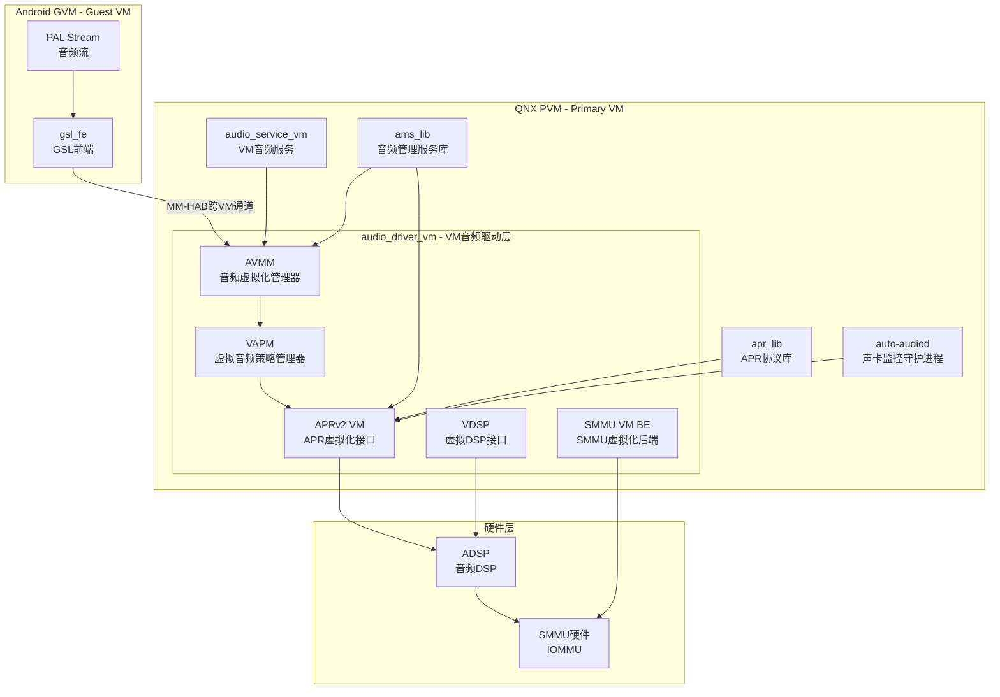
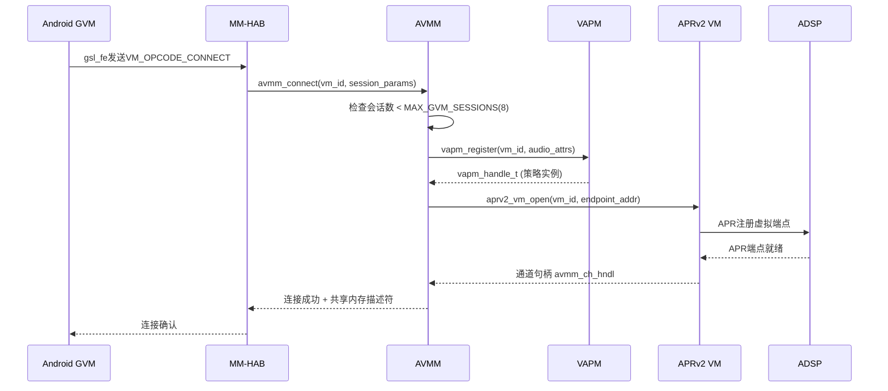
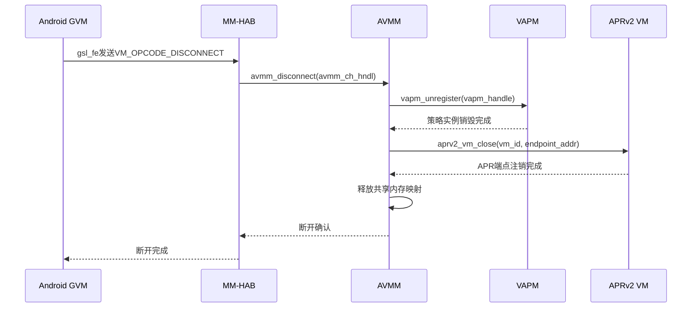
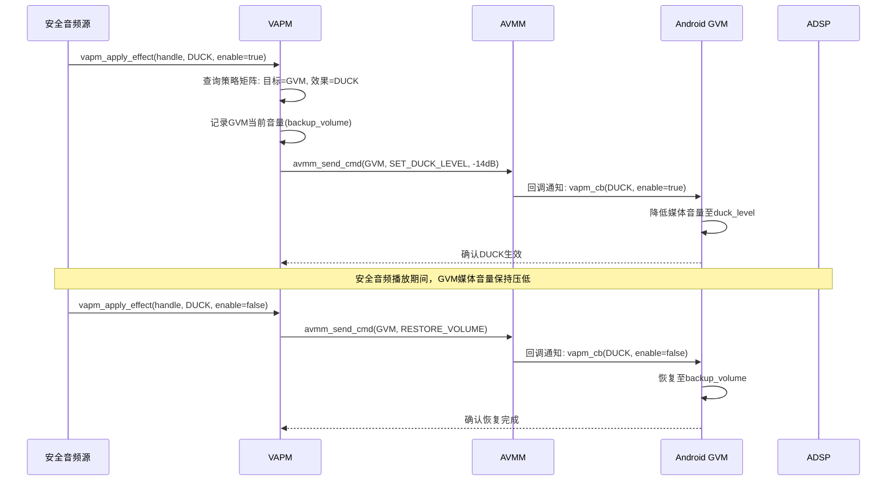
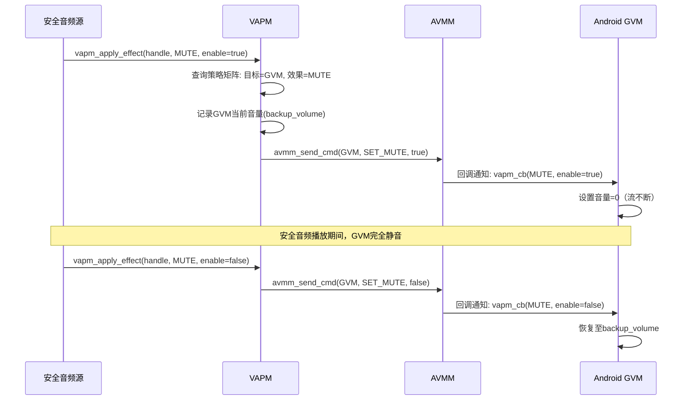
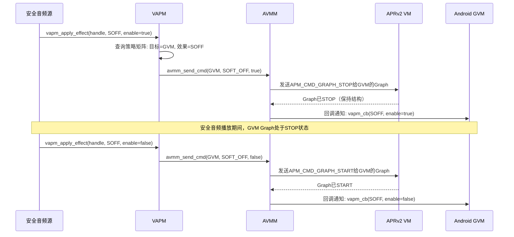
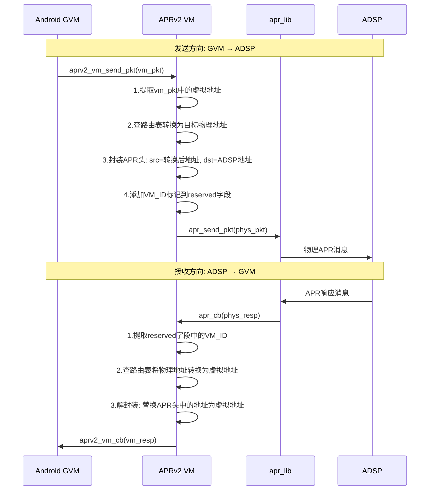
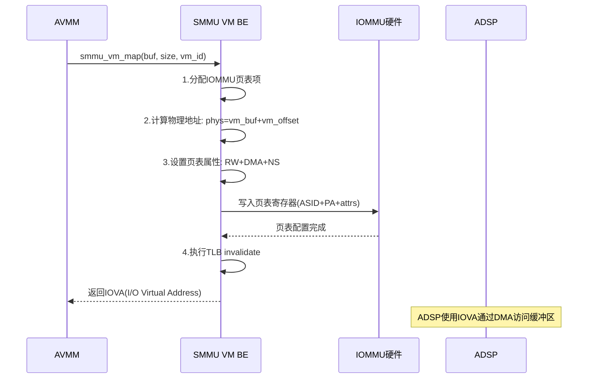
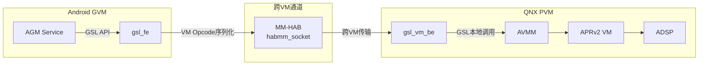
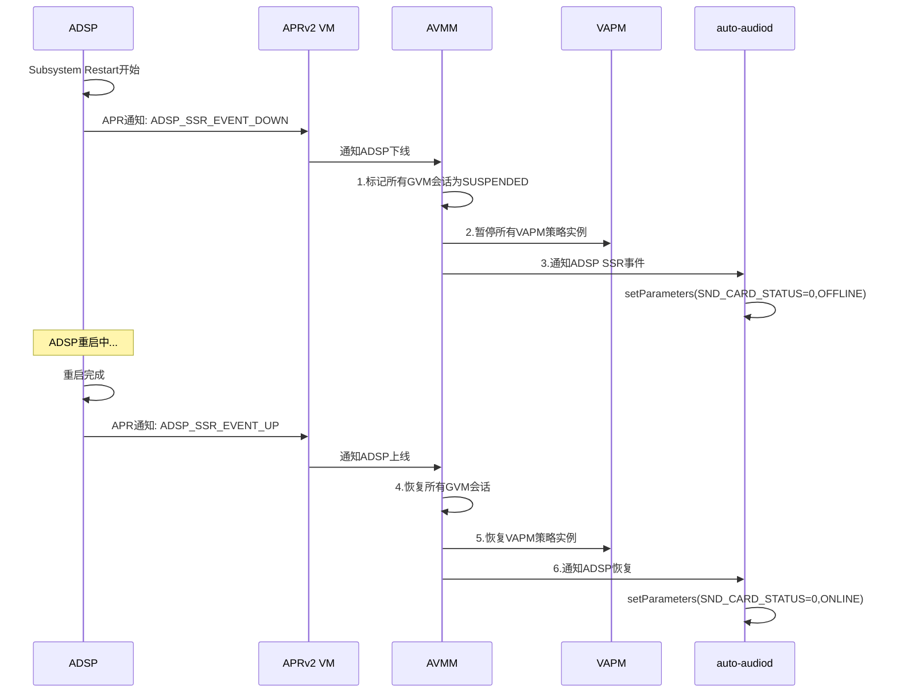

[← 上一个](16_16.15_常见问题与解答Q&A.md) | [← 返回16章](README.md) | [返回导航](../README.md) | [下一个 →](16_16.17_QNX_audio_service_vm_VM音频服务.md)

---

## 16.16 audio_driver_vm — QNX VM音频驱动层

> **架构归属说明（对照源码 `qc/Qnx/apps/qnx_ap/AMSS/multimedia/audio/`）**：SA8295 在 QNX 侧同时提供两套音频架构——`audio_elite/`（Elite 架构）与 `audio_ar/`（AudioReach 架构），由产品线经板级配置（`boards/audio_driver/adp_8295` vs `adp_8295_ar`）选择。本节描述的 `audio_driver_vm`、`audio_service_vm`（16.17）、`ams_lib`（16.18）、`apr_lib`（16.19）均为 **`audio_elite/` 架构下的真实组件**。若产品采用 `audio_ar/`（AudioReach）配置，其 `audio_driver/` 下对应实现为 `amfs2_lib`、`audio_reach`、`avmm_lib`、`gsl_be` 等。本知识库 15/16 章 PAL/AGM/GSL 主链路描述的是 AudioReach 路径。

### 16.16.1 概述

`audio_driver_vm` 是SA8295 QNX域中最底层的音频驱动模块，运行在QNX Primary VM（PVM）中，直接与ADSP硬件通信。它是整个QNX音频栈的**驱动基石**，向上为`audio_service_vm`和`ams_lib`提供内核级音频服务，向下通过APRv2协议与ADSP建立消息路由。在SA8295 Hypervisor虚拟化架构下，该驱动承担了音频虚拟化的全部底层实现，包括VM间音频通道管理、跨VM策略仲裁、APR地址虚拟化以及SMMU安全映射。

**架构定位**：

| 维度 | 说明 |
|------|------|
| 层级 | QNX音频栈最底层驱动，直接与ADSP通信 |
| 运行域 | QNX PVM（Primary VM），Hypervisor隔离域0 |
| 核心职责 | APRv2虚拟化、音频虚拟化管理(AVMM)、虚拟音频策略管理(VAPM)、SMMU VM后端、VDSP抽象 |
| 与Android关系 | Android GVM无直接访问权；音频请求经gsl_fe→MM-HAB→gsl_vm_be→AVMM→APRv2 VM间接到达ADSP |
| 安全属性 | 安全音频（倒车雷达/仪表告警）通过此驱动直通ADSP，不受Android崩溃影响 |
| 最大GVM会话 | 最多支持8个GVM并发音频会话通过AVMM接入 |
| SSR恢复 | 检测ADSP Subsystem Restart并协同auto-audiod完成恢复 |

**与其他QNX组件的关系**：

| 组件 | 交互方式 | 说明 |
|------|----------|------|
| audio_service_vm | 调用驱动接口 | 初始化音频服务、创建APR端点 |
| ams_lib | APR通道+AVMM | 向ADSP发送图管理命令、注册VM音频策略 |
| apr_lib | APR消息路由 | 使用其消息路由能力与ADSP通信 |
| MM-HAB/gsl_vm_be | AVMM层对接 | Android侧gsl_fe的虚拟化后端 |
| auto-audiod | SSR协同 | ADSP上下线事件通知与恢复 |

### 16.16.2 架构总览



**模块职责一览**：

| 模块 | 全称 | 核心职责 |
|------|------|----------|
| AVMM | Audio Virtualization Manager | VM间音频通道建立/销毁、数据流虚拟化转发、跨VM资源仲裁 |
| VAPM | Virtual Audio Policy Manager | 多VM音频策略执行（DUCK/MUTE/SOFF）、优先级仲裁、回调通知 |
| APRv2 VM | APR v2 Virtualization | APR端点地址虚拟化、消息封装/解封装、多VM路由 |
| VDSP | Virtual DSP | DSP实例抽象、多DSP管理、与AGM Service交互 |
| SMMU VM BE | SMMU VM Backend | IOMMU页表配置、共享内存映射、DMA安全访问 |

### 16.16.3 源码路径与头文件

```
vendor/qcom/proprietary/audio_driver_vm/
├── inc/
│   ├── avmm.h              # 音频虚拟化管理器接口
│   ├── vapm.h              # 虚拟音频策略管理器接口
│   ├── aprv2_vm.h          # APRv2虚拟化接口
│   ├── vdsp.h              # 虚拟DSP接口
│   ├── audio_smmu_vm_be.h  # SMMU VM后端接口
│   └── audio_driver_vm.h   # 驱动总入口头文件
├── src/
│   ├── avmm.c              # AVMM实现
│   ├── vapm.c              # VAPM实现
│   ├── aprv2_vm.c          # APRv2 VM实现
│   ├── vdsp.c              # VDSP实现
│   ├── audio_smmu_vm_be.c  # SMMU VM BE实现
│   └── audio_driver_vm.c   # 驱动初始化与分发
├── cfg/
│   └── audio_vm_cfg.xml    # VM音频配置（最大会话数、策略优先级等）
└── Makefile                 # QNX构建配置
```

### 16.16.4 AVMM — 音频虚拟化管理器深度解析

AVMM（Audio Virtualization Manager）是Hypervisor虚拟化音频的核心管理器，负责VM间音频通道的全生命周期管理、数据流虚拟化转发以及跨VM资源仲裁。

#### 16.16.4.1 VM间音频通道建立/销毁流程

**通道建立流程**（Android GVM发起音频请求时）：



**通道销毁流程**：



#### 16.16.4.2 音频数据流虚拟化转发机制

AVMM在VM间转发音频数据时，采用**共享内存+信号通知**的零拷贝机制：

| 步骤 | 操作 | 说明 |
|------|------|------|
| 1 | SMMU映射 | AVMM调用`smmu_vm_map()`为GVM音频缓冲区建立IOMMU映射 |
| 2 | 共享内存注册 | GVM和PVM通过Hypervisor共享内存区域交换音频数据 |
| 3 | 数据写入 | GVM将PCM数据写入共享缓冲区，通过habmm_socket_send通知AVMM |
| 4 | 虚拟化转发 | AVMM根据通道类型将数据路由到对应的APR端点 |
| 5 | ADSP读取 | ADSP通过SMMU映射的物理地址DMA读取音频数据 |
| 6 | 反向路径 | ADSP→APR→AVMM→共享内存→GVM（录音/回声参考） |

**数据流类型**：

| 流类型 | 方向 | 缓冲区属性 | 典型场景 |
|--------|------|------------|----------|
| PCM Playback | GVM→ADSP | 非交错、16/24/32bit | 媒体播放、导航提示 |
| PCM Capture | ADSP→GVM | 非交错、16bit | 语音识别、通话录音 |
| Compressed | GVM→ADSP | 压缩格式（AAC/FLAC） | Offload播放 |
| Hostless | ADSP↔ADSP | 无VM数据参与 | EC Ref、A2B透传 |

#### 16.16.4.3 跨VM资源仲裁策略

当多个VM并发请求同一音频资源时，AVMM执行以下仲裁：

| 优先级 | VM类型 | 说明 |
|--------|--------|------|
| 最高(3) | 安全域 | 倒车雷达、ADAS告警、碰撞预警等安全关键音频 |
| 高(2) | QNX PVM | QNX域音频（诊断音、系统提示音） |
| 中(1) | Android GVM | 媒体播放、导航、通话等 |
| 低(0) | 备用VM | 预留扩展 |

**仲裁规则**：
- 安全域请求**抢占**所有低优先级VM的音频资源
- QNX PVM请求**可压低**Android GVM的音量（通过VAPM DUCK效果）
- 同优先级VM请求**混合**输出（如多个GVM媒体流混音）
- 资源释放后，AVMM通知VAPM恢复被压低/静音的VM音频

#### 16.16.4.4 AVMM与MM-HAB的对接细节

AVMM通过以下接口与MM-HAB（Qualcomm Hypervisor Audio Bus）交互：

```c
// AVMM与MM-HAB的对接接口
typedef struct {
    uint32_t vm_id;           // VM标识符 (0=PVM, 1=GVM)
    uint32_t hab_port_id;     // MM-HAB端口号
    void    *shared_mem_base; // 共享内存基地址
    size_t   shared_mem_size; // 共享内存大小
} avmm_hab_config_t;

// AVMM接收来自MM-HAB的VM Opcode
int32_t avmm_hab_msg_handler(
    uint32_t opcode,          // VM_OPCODE_CONNECT/DISCONNECT/DATA/CMD
    void    *payload,         // Opcode载荷
    size_t   payload_size,    // 载荷大小
    avmm_hab_config_t *config // HAB配置
);
```

**VM Opcode映射**：

| MM-HAB Opcode | AVMM动作 | 说明 |
|---------------|----------|------|
| VM_OPCODE_CONNECT | avmm_connect() | 建立VM音频通道 |
| VM_OPCODE_DISCONNECT | avmm_disconnect() | 销毁VM音频通道 |
| VM_OPCODE_DATA | avmm_send_data()/recv_data() | 传输音频数据 |
| VM_OPCODE_CMD | 转发至APRv2 VM | 控制命令（Graph操作等） |
| VM_OPCODE_SSR | avmm_ssr_handler() | SSR事件处理 |

### 16.16.5 VAPM — 虚拟音频策略管理器深度解析

VAPM（Virtual Audio Policy Manager）在虚拟化环境下执行音频策略，管理多VM间的音频优先级和音效叠加。它是安全音频优先机制的核心执行者。

#### 16.16.5.1 策略优先级矩阵

VAPM维护一个二维策略矩阵，行表示音频源类型，列表示VM域，交叉点为策略效果：

| 音频源\VM域 | 安全域(Priority=3) | QNX PVM(Priority=2) | Android GVM(Priority=1) |
|-------------|-------------------|--------------------|-----------------------|
| 倒车雷达 | 直通 | DUCK | MUTE |
| ADAS告警 | 直通 | DUCK | DUCK |
| 碰撞预警 | 直通 | SOFF | MUTE |
| 导航提示 | — | 直通 | DUCK |
| 通话 | — | 直通 | 直通(共享) |
| 媒体播放 | — | — | 直通 |
| 系统提示音 | — | 直通 | DUCK |

**策略效果说明**：

| 效果 | 全称 | 行为 | 恢复条件 |
|------|------|------|----------|
| DUCK | Duck/压低 | 目标VM音量降低至配置的duck_level（默认-14dB） | 高优先级源撤除后自动恢复 |
| MUTE | Mute/静音 | 目标VM音量设为0，流不断但无声 | 高优先级源撤除后自动恢复 |
| SOFF | Soft Off/软件关断 | 目标VM流被软件暂停（保持Graph但STOP） | 高优先级源撤除后需显式重启 |

#### 16.16.5.2 DUCK效果执行流程



#### 16.16.5.3 MUTE效果执行流程



#### 16.16.5.4 SOFF效果执行流程



#### 16.16.5.5 VAPM回调机制详解

VAPM通过回调函数向VM通知策略变化，回调在AVMM的上下文中执行：

```c
// VAPM核心数据结构
typedef enum {
    VM_TYPE_0,   // Primary VM (QNX PVM)
    VM_TYPE_1,   // Guest VM (Android GVM)
    VM_TYPE_2,   // 备用VM
    VM_TYPE_3,   // 备用VM
} vapm_vm_t;

typedef enum {
    VAPM_EFFECT_DUCK,   // 压低（如导航提示压低媒体音量）
    VAPM_EFFECT_MUTE,   // 静音
    VAPM_EFFECT_SOFF,   // 软件关断(Soft Off)
} vapm_effect_t;

typedef uint32_t vapm_handle_t;

// VAPM回调参数
typedef struct {
    vapm_handle_t handle;    // 策略实例句柄
    vapm_effect_t effect;    // 施加的音效类型
    bool          enable;    // true=启用音效, false=禁用音效
    int32_t       duck_level;// DUCK时的目标音量(dB), MUTE/SOFF时无效
} vapm_cb_param_t;

// VAPM回调函数指针
typedef void (*vapm_callback_t)(vapm_cb_param_t *param);
```

**回调时序保证**：
- 回调在AVMM事件循环中同步执行，保证策略生效的实时性
- 同一VM的多个策略效果**串行**执行，避免竞态
- 回调失败时VAPM重试最多3次，间隔10ms

#### 16.16.5.6 VAPM与QNX Audio Manager的联动

VAPM与QNX Audio Manager（QNX AM）通过以下方式联动：

1. **QNX AM注册策略**：QNX AM在初始化时调用`vapm_register()`注册安全音频源的策略规则
2. **安全源激活通知**：QNX AM检测到安全音频源激活（如倒挡信号），通知VAPM执行策略
3. **策略执行反馈**：VAPM执行完策略后，回调通知QNX AM策略生效/失效
4. **路由协调**：QNX AM的Audio Resource Manager与VAPM协调，确保路由矩阵与策略一致

### 16.16.6 APRv2 VM — APR虚拟化接口深度解析

APRv2（Audio Packet Router v2）虚拟化扩展，使QNX PVM和Android GVM都能通过统一的APR路由与ADSP通信。APRv2 VM负责APR端点地址的虚拟化映射、消息封装/解封装以及多VM路由。

#### 16.16.6.1 APR端点地址虚拟化映射

APR使用32位地址标识通信端点，格式为`[domain:port]`。在虚拟化环境下，APRv2 VM为每个VM维护独立的地址空间：

```c
// APR端点地址结构
typedef struct {
    uint16_t domain;   // APR域ID (ADSP=1, MODEM=3, etc.)
    uint16_t port;     // APR端口号
} apr_addr_t;

// VM地址映射表项
typedef struct {
    apr_addr_t vm_addr;    // VM侧虚拟地址
    apr_addr_t phys_addr;  // 物理APR地址(ADSP侧)
    uint32_t  vm_id;       // 所属VM ID
    bool      is_active;   // 映射是否激活
} aprv2_vm_map_entry_t;
```

**PVM/GVM地址转换规则**：

| VM类型 | 虚拟域ID | 物理域ID | 端口偏移 | 说明 |
|--------|----------|----------|----------|------|
| QNX PVM | 0x01 | 0x01 | +0 | PVM直接使用物理地址，无需转换 |
| Android GVM | 0x11 | 0x01 | +VM_ID*0x100 | GVM地址需转换为物理地址 |
| 备用VM | 0x21 | 0x01 | +VM_ID*0x100 | 预留扩展 |

**地址转换流程**：
1. GVM发送APR消息，源地址为`[0x11:port]`
2. APRv2 VM查路由表，将源地址转换为`[0x01:port+VM_ID*0x100]`
3. 转换后的消息发送给ADSP
4. ADSP响应消息的目的地址为`[0x01:port+VM_ID*0x100]`
5. APRv2 VM反向查表，将目的地址转换回`[0x11:port]`
6. 转换后的响应路由到GVM

#### 16.16.6.2 消息封装/解封装流程



#### 16.16.6.3 多VM APR路由表

APRv2 VM维护一个全局路由表，管理所有VM的APR端点映射：

```c
// APRv2 VM路由表
typedef struct {
    aprv2_vm_map_entry_t entries[MAX_APR_ENDPOINTS];  // 映射表项
    uint32_t             entry_count;                  // 当前表项数
    pthread_mutex_t      lock;                         // 路由表锁
} aprv2_vm_route_table_t;

// 路由操作
int32_t aprv2_vm_route_add(uint32_t vm_id, apr_addr_t *vm_addr, apr_addr_t *phys_addr);
int32_t aprv2_vm_route_remove(uint32_t vm_id, apr_addr_t *vm_addr);
int32_t aprv2_vm_route_lookup(uint32_t vm_id, apr_addr_t *vm_addr, apr_addr_t *phys_addr);
```

**路由表容量**：

| 参数 | 值 | 说明 |
|------|-----|------|
| MAX_APR_ENDPOINTS | 256 | 最大APR端点映射数 |
| MAX_GVM_SESSIONS | 8 | 最大GVM并发会话数 |
| MAX_PVM_ENDPOINTS | 64 | PVM保留端点数 |

#### 16.16.6.4 APRv2 VM与apr_lib的交互接口

APRv2 VM在内部使用apr_lib进行实际的APR消息收发：

```c
// APRv2 VM初始化时注册到apr_lib
int32_t aprv2_vm_init(void) {
    // 1.初始化路由表
    aprv2_vm_route_table_init();
    // 2.向apr_lib注册回调
    apr_register_cb(APR_DOMAIN_ADSP, aprv2_vm_msg_handler);
    // 3.创建PVM端点
    apr_open(APR_DOMAIN_ADSP, PVM_SERVICE_PORT);
    return 0;
}

// apr_lib回调 → APRv2 VM消息处理
void aprv2_vm_msg_handler(apr_pkt_t *pkt) {
    uint32_t vm_id = extract_vm_id(pkt);
    if (vm_id == VM_TYPE_0) {
        // PVM消息：直接处理
        handle_pvm_message(pkt);
    } else {
        // GVM消息：地址转换后路由
        aprv2_vm_route_to_gvm(pkt, vm_id);
    }
}
```

### 16.16.7 SMMU VM BE — SMMU虚拟化后端深度解析

SMMU（System Memory Management Unit）VM后端管理音频DMA的IOMMU映射，确保ADSP通过DMA安全访问VM的音频缓冲区。

#### 16.16.7.1 IOMMU页表配置流程



#### 16.16.7.2 共享内存映射机制

| 步骤 | 操作 | 说明 |
|------|------|------|
| 1 | VM分配缓冲区 | GVM/PVM分配音频PCM缓冲区 |
| 2 | Hypervisor共享 | Hypervisor将缓冲区物理页标记为跨VM共享 |
| 3 | SMMU映射 | SMMU VM BE为缓冲区创建IOMMU映射，返回IOVA |
| 4 | ADSP DMA | ADSP使用IOVA作为DMA源/目标地址 |
| 5 | 缓冲区同步 | 通过cache flush/invalidate保证数据一致性 |

#### 16.16.7.3 DMA缓冲区安全访问保证

- **地址隔离**：每个VM的IOVA空间独立，GVM无法访问PVM的IOVA区域
- **权限控制**：IOMMU页表项设置RW权限，禁止VM执行DMA缓冲区代码
- **边界检查**：SMMU VM BE验证DMA传输不越界
- **Fault处理**：IOMMU fault时触发SMMU fault handler，记录fault信息并通知AVMM

```c
// SMMU fault处理
void smmu_vm_fault_handler(uint32_t asid, uint64_t iova, uint32_t fault_type) {
    // fault_type: 0=translation, 1=permission, 2=access
    log_error("SMMU fault: asid=%d, iova=0x%lx, type=%d", asid, iova, fault_type);
    // 通知AVMM断开对应VM的音频通道
    avmm_notify_smmu_fault(asid, iova);
}
```

### 16.16.8 VDSP — 虚拟DSP接口深度解析

VDSP（Virtual DSP）为上层提供统一的DSP访问抽象，屏蔽物理DSP的多实例细节。

#### 16.16.8.1 虚拟DSP接口抽象层

```c
// VDSP实例描述
typedef struct {
    uint32_t dsp_id;          // DSP实例ID (0=ADSP, 1=CDSP, etc.)
    uint32_t dsp_state;       // DSP状态: OFFLINE/ONLINE/SSR
    apr_addr_t apr_addr;      // DSP的APR地址
    uint32_t graph_count;     // 当前活跃Graph数
} vdsp_instance_t;

// VDSP管理器
typedef struct {
    vdsp_instance_t instances[MAX_DSP_INSTANCES]; // DSP实例数组
    uint32_t        instance_count;                // 实例数
    pthread_mutex_t lock;                          // 管理器锁
} vdsp_manager_t;
```

#### 16.16.8.2 多DSP实例管理

SA8295支持多个DSP实例，VDSP统一管理：

| DSP实例 | ID | 用途 | APR域 |
|---------|-----|------|-------|
| ADSP | 0 | 音频处理主DSP | APR_DOMAIN_ADSP(1) |
| CDSP | 1 | 计算DSP（离线音频处理） | APR_DOMAIN_CDSP(5) |
| SLPI | 2 | 传感器低功耗岛（语音唤醒） | APR_DOMAIN_SLPI(4) |

#### 16.16.8.3 VDSP与AGM Service的交互

AGM Service通过VDSP访问DSP资源：
1. AGM调用`vdsp_open(dsp_id=0)`获取ADSP实例
2. AGM调用`vdsp_ioctl(VDSP_IOCTL_GRAPH_OPEN, ...)`创建Graph
3. VDSP将ioctl转换为APR消息，通过APRv2 VM发送给ADSP
4. ADSP响应通过APRv2 VM→VDSP→AGM返回

### 16.16.9 audio_driver_vm与gsl_vm_be的交互

Android侧的GSL请求通过以下路径接入audio_driver_vm：



**GVM会话管理**：
- AVMM维护最多8个GVM并发会话的会话表
- 每个会话包含：VM ID、APR端点、VAPM句柄、共享内存描述符
- 会话创建时分配唯一session_id，销毁时释放所有关联资源
- GVM崩溃时，AVMM检测到HAB连接断开，自动清理该GVM的所有会话

### 16.16.10 ADSP SSR恢复机制

#### 16.16.10.1 audio_driver_vm的SSR检测



#### 16.16.10.2 与auto-audiod的协同

| 阶段 | audio_driver_vm | auto-audiod |
|------|----------------|-------------|
| SSR检测 | APR收到ADSP_SSR_EVENT_DOWN | 收到OFFLINE通知 |
| 资源清理 | 暂停GVM会话、注销APR端点 | 通知Audio HAL声卡下线 |
| ADSP重启 | 等待ADSP_SSR_EVENT_UP | poll(/proc/asound/card0/state) |
| 恢复重建 | 恢复APR端点、重建GVM会话 | 通知Audio HAL声卡上线、重新enable_hostless |
| 策略恢复 | 恢复VAPM策略实例 | — |

### 16.16.11 完整API接口列表

#### 16.16.11.1 AVMM API

| API | 参数 | 返回值 | 说明 |
|-----|------|--------|------|
| `avmm_connect()` | vm_id, session_params | avmm_ch_hndl / 错误码 | 建立VM音频通道 |
| `avmm_disconnect()` | avmm_ch_hndl | 0 / 错误码 | 销毁VM音频通道 |
| `avmm_send_data()` | avmm_ch_hndl, buf, size | 实际发送字节数 | 发送音频数据到VM通道 |
| `avmm_recv_data()` | avmm_ch_hndl, buf, size | 实际接收字节数 | 从VM通道接收音频数据 |
| `avmm_send_cmd()` | avmm_ch_hndl, cmd_id, payload | 0 / 错误码 | 发送控制命令 |
| `avmm_get_ch_status()` | avmm_ch_hndl | 通道状态 | 查询通道状态 |
| `avmm_ssr_handler()` | ssr_event | 0 / 错误码 | SSR事件处理 |
| `avmm_hab_msg_handler()` | opcode, payload, size, config | 0 / 错误码 | MM-HAB消息处理 |

#### 16.16.11.2 VAPM API

| API | 参数 | 返回值 | 说明 |
|-----|------|--------|------|
| `vapm_register()` | vm_id, audio_attrs, callback | vapm_handle_t | 注册策略实例 |
| `vapm_unregister()` | vapm_handle_t | 0 / 错误码 | 注销策略实例 |
| `vapm_apply_effect()` | handle, effect, enable | 0 / 错误码 | 施加/撤销策略效果 |
| `vapm_get_effect()` | vapm_handle_t | 当前effect状态 | 查询当前策略效果 |
| `vapm_set_duck_level()` | vapm_handle_t, level_dB | 0 / 错误码 | 设置DUCK目标音量 |
| `vapm_callback_t` | vapm_cb_param_t* | void | 策略变化回调 |

#### 16.16.11.3 APRv2 VM API

| API | 参数 | 返回值 | 说明 |
|-----|------|--------|------|
| `aprv2_vm_open()` | vm_id, endpoint_addr | aprv2_hndl | 打开虚拟APR端点 |
| `aprv2_vm_close()` | aprv2_hndl | 0 / 错误码 | 关闭虚拟APR端点 |
| `aprv2_vm_send_pkt()` | aprv2_hndl, vm_pkt | 0 / 错误码 | 发送虚拟APR消息 |
| `aprv2_vm_register_cb()` | aprv2_hndl, callback | 0 / 错误码 | 注册APR响应回调 |
| `aprv2_vm_route_add()` | vm_id, vm_addr, phys_addr | 0 / 错误码 | 添加路由映射 |
| `aprv2_vm_route_remove()` | vm_id, vm_addr | 0 / 错误码 | 移除路由映射 |
| `aprv2_vm_route_lookup()` | vm_id, vm_addr | phys_addr | 查询路由映射 |

#### 16.16.11.4 VDSP API

| API | 参数 | 返回值 | 说明 |
|-----|------|--------|------|
| `vdsp_open()` | dsp_id | vdsp_hndl | 打开DSP实例 |
| `vdsp_close()` | vdsp_hndl | 0 / 错误码 | 关闭DSP实例 |
| `vdsp_ioctl()` | vdsp_hndl, cmd, arg | cmd相关 | DSP控制命令 |
| `vdsp_get_state()` | dsp_id | DSP状态 | 查询DSP状态 |
| `vdsp_get_graph_count()` | dsp_id | Graph数 | 查询活跃Graph数 |

#### 16.16.11.5 SMMU VM BE API

| API | 参数 | 返回值 | 说明 |
|-----|------|--------|------|
| `smmu_vm_map()` | buf, size, vm_id | IOVA | 创建IOMMU映射 |
| `smmu_vm_unmap()` | IOVA, size | 0 / 错误码 | 移除IOMMU映射 |
| `smmu_vm_flush()` | IOVA, size, dir | 0 / 错误码 | 刷新DMA缓存 |
| `smmu_vm_invalidate()` | IOVA, size | 0 / 错误码 | 使TLB项无效 |
| `smmu_vm_get_iova()` | buf, vm_id | IOVA | 查询缓冲区IOVA |

### 16.16.12 调试方法

#### 16.16.12.1 日志标签

| 模块 | 日志标签 | 级别 | 说明 |
|------|----------|------|------|
| AVMM | `AVMM` | INFO/ERROR | 音频虚拟化管理器 |
| VAPM | `VAPM` | INFO/ERROR | 虚拟音频策略管理器 |
| APRv2 VM | `APR_VM` | DEBUG/INFO/ERROR | APR虚拟化 |
| VDSP | `VDSP` | INFO/ERROR | 虚拟DSP |
| SMMU VM BE | `SMMU_VM` | ERROR | SMMU虚拟化后端 |
| 驱动总入口 | `AUDIO_DRV_VM` | INFO/ERROR | 驱动初始化与分发 |

#### 16.16.12.2 常见错误码

| 错误码 | 值 | 含义 | 排查方向 |
|--------|-----|------|----------|
| AVMM_E_MAX_SESSION | -1 | GVM会话数超限(>8) | 检查是否有会话泄漏 |
| AVMM_E_NO_MEM | -2 | 共享内存分配失败 | 检查Hypervisor内存配置 |
| AVMM_E_HAB_FAIL | -3 | MM-HAB通信失败 | 检查HAB连接状态 |
| VAPM_E_NOT_REGISTERED | -10 | 策略实例未注册 | 检查vapm_register调用 |
| VAPM_E_CONFLICT | -11 | 策略冲突 | 检查策略矩阵配置 |
| APR_VM_E_ROUTE_FULL | -20 | 路由表满 | 检查APR端点泄漏 |
| APR_VM_E_ADDR_INVALID | -21 | APR地址无效 | 检查VM地址转换 |
| SMMU_E_FAULT | -30 | IOMMU fault | 检查IOVA和页表配置 |
| SMMU_E_MAP_FAIL | -31 | 映射失败 | 检查物理内存连续性 |

#### 16.16.12.3 调试命令

```bash
# 查看AVMM会话状态
slog2info -t AVMM

# 查看VAPM策略执行情况
slog2info -t VAPM

# 查看APR路由表
slog2info -t APR_VM

# 查看SMMU映射状态
slog2info -t SMMU_VM

# 查看所有audio_driver_vm日志
slog2info -t AUDIO_DRV_VM -t AVMM -t VAPM -t APR_VM -t VDSP -t SMMU_VM

# 查看ADSP声卡状态（SSR排查）
cat /proc/asound/card0/state

# 查看APR端点注册信息
cat /proc/asound/card0/apr

# 查看IOMMU映射（需root权限）
cat /sys/kernel/debug/iommu/audio-mapping
```

### 16.16.13 与Android域的交互关系总结

#### 16.16.13.1 Android→QNX音频请求路径

```
Android App → AudioFlinger → PAL gsl_fe
    → MM-HAB跨VM通道 → gsl_vm_be(QNX侧)
    → AVMM → VAPM(策略检查) → APRv2 VM → ADSP
```

#### 16.16.13.2 安全音频隔离

```
QNX安全音频源 → VAPM(施加DUCK/MUTE给GVM) → audio_driver_vm → APRv2 → ADSP
                                      ↓
                        Android GVM媒体流被压低/静音
```

**关键保证**：
- **Android崩溃不影响**：QNX PVM和ADSP由Hypervisor硬件隔离，Android GVM崩溃时QNX音频驱动继续运行
- **安全音频优先**：VAPM确保安全音频（倒车雷达/ADAS告警）始终可听
- **资源仲裁**：AVMM在多VM并发请求时进行资源仲裁，QNX PVM始终拥有最高优先级
- **SSR透明恢复**：ADSP SSR时audio_driver_vm协同auto-audiod完成透明恢复，上层无感知

---

[← 上一个](16_16.15_常见问题与解答Q&A.md) | [← 返回16章](README.md) | [返回导航](../README.md) | [下一个 →](16_16.17_QNX_audio_service_vm_VM音频服务.md)