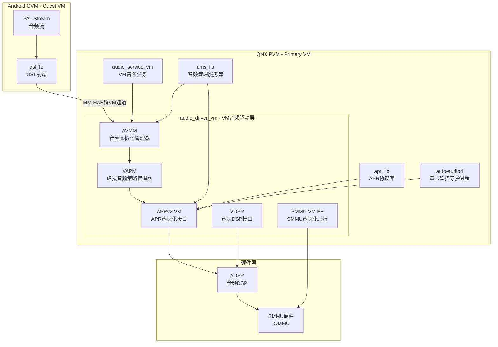
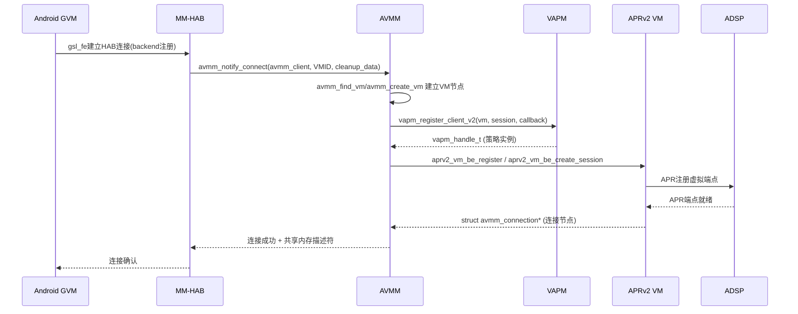
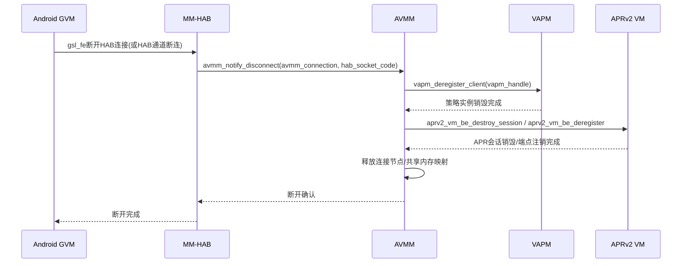
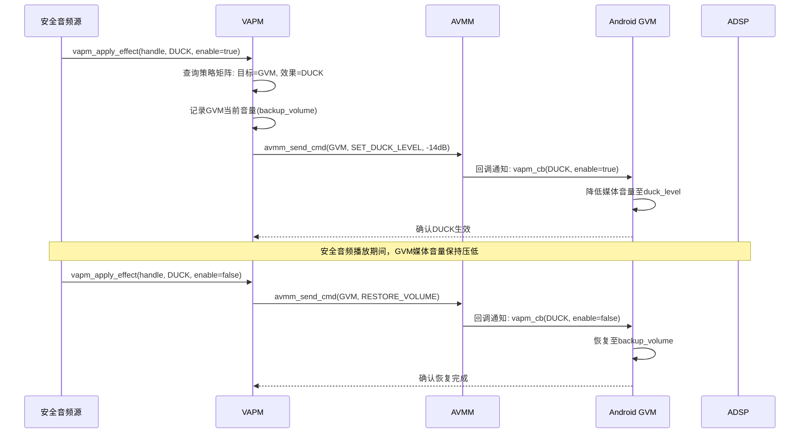
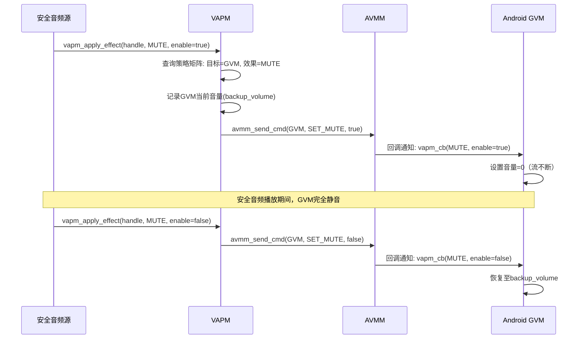
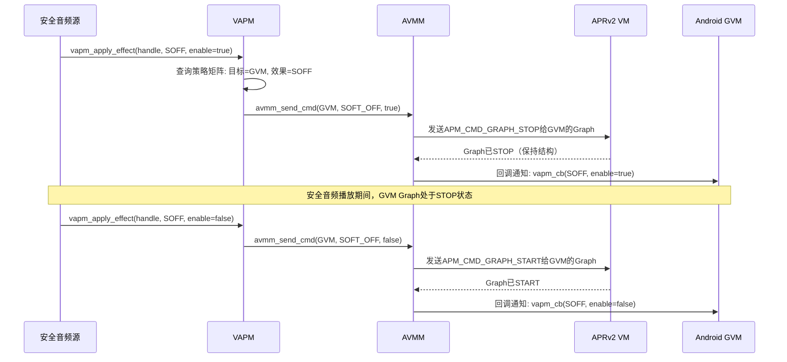
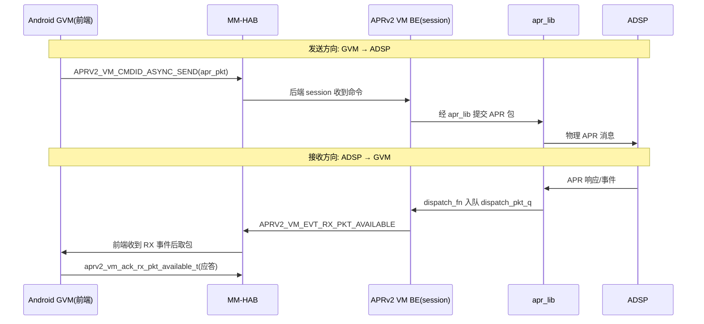
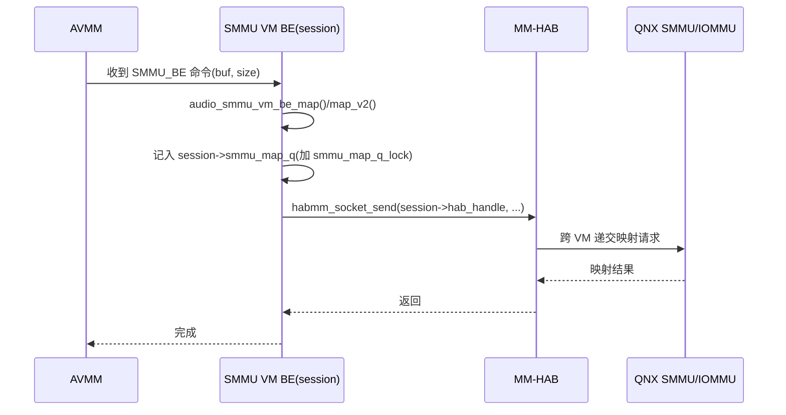
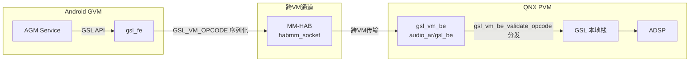
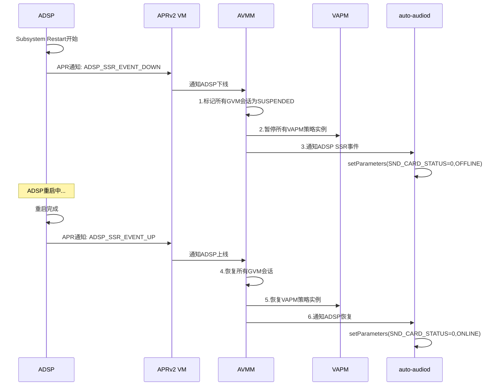

[← 上一个](16_16.15_常见问题与解答Q&A.md) | [← 返回16章](README.md) | [返回导航](../README.md) | [下一个 →](16_16.17_QNX_audio_service_vm_VM音频服务.md)

---

## 16.16 audio_driver_vm — QNX VM音频驱动层

> **架构归属说明（对照源码 `qc/Qnx/apps/qnx_ap/AMSS/multimedia/audio/`）**：SA8295 在 QNX 侧同时提供两套音频架构——`audio_elite/`（Elite 架构）与 `audio_ar/`（AudioReach 架构），由产品线经板级配置（`boards/audio_driver/adp_8295` vs `adp_8295_ar`）选择。本节描述的 `audio_driver_vm`、`audio_service_vm`（16.17）、`ams_lib`（16.18）、`apr_lib`（16.19）均为 **`audio_elite/` 架构下的真实组件**。若产品采用 `audio_ar/`（AudioReach）配置，其 `audio_driver/` 下对应实现为 `amfs2_lib`、`audio_reach`、`avmm_lib`、`gsl_be` 等。本知识库 15/16 章 PAL/AGM/GSL 主链路描述的是 AudioReach 路径。

### 16.16.1 概述

`audio_driver_vm` 是SA8295 QNX域中最底层的音频驱动模块，运行在QNX Primary VM（PVM）中，直接与ADSP硬件通信。它是整个QNX音频栈的**驱动基石**，向上为`audio_service_vm`和`ams_lib`提供内核级音频服务，向下通过APRv2协议与ADSP建立消息路由。在SA8295 Hypervisor虚拟化架构下，该驱动承担了音频虚拟化的全部底层实现，包括VM间音频通道管理、跨VM策略仲裁、APR地址虚拟化以及SMMU安全映射。

**架构定位**：

| 维度 | 说明 |
|------|------|
| 层级 | QNX音频栈最底层驱动，直接与ADSP通信 |
| 运行域 | QNX PVM（Primary VM），Hypervisor隔离域0 |
| 核心职责 | APRv2虚拟化、音频虚拟化管理(AVMM)、虚拟音频策略管理(VAPM)、SMMU VM后端、VDSP抽象 |
| 与Android关系 | Android GVM无直接访问权；音频请求经gsl_fe→MM-HAB→gsl_vm_be→AVMM→APRv2 VM间接到达ADSP |
| 安全属性 | 安全音频（倒车雷达/仪表告警）通过此驱动直通ADSP，不受Android崩溃影响 |
| VM/连接管理 | VM 与连接均由链表（`avmm_list_t vm_list` / `connection_list`，`avmm_i.h`）**动态管理，无固定数量上限**；后端客户端类型固定为 `enum avmm_backend_id` 6 种（VCODEC_PLUGIN/ACPH_BE/VAPM/APR_BE/AMFS_BE/SMMU_BE）。注：`AVMM_MAX_SIZE=32` 实为 `be_name[]` 后端名字符串缓冲区长度，**非会话数** |
| SSR恢复 | 检测ADSP Subsystem Restart并协同auto-audiod完成恢复 |

**与其他QNX组件的关系**：

| 组件 | 交互方式 | 说明 |
|------|----------|------|
| audio_service_vm | 调用驱动接口 | 初始化音频服务、创建APR端点 |
| ams_lib | APR通道+AVMM | 向ADSP发送图管理命令、注册VM音频策略 |
| apr_lib | APR消息路由 | 使用其消息路由能力与ADSP通信 |
| MM-HAB/gsl_vm_be | AVMM层对接 | Android侧gsl_fe的虚拟化后端 |
| auto-audiod | SSR协同 | ADSP上下线事件通知与恢复 |

### 16.16.2 架构总览



**模块职责一览**：

| 模块 | 全称 | 核心职责 |
|------|------|----------|
| AVMM | Audio Virtualization Manager | VM间音频通道建立/销毁、数据流虚拟化转发、跨VM资源仲裁 |
| VAPM | Virtual Audio Policy Manager | 多VM音频策略执行（DUCK/MUTE/SOFF）、优先级仲裁、回调通知 |
| APRv2 VM | APR v2 Virtualization | APR端点地址虚拟化、消息封装/解封装、多VM路由 |
| VDSP | Virtual DSP | DSP实例抽象、多DSP管理、与AGM Service交互 |
| SMMU VM BE | SMMU VM Backend | IOMMU页表配置、共享内存映射、DMA安全访问 |

### 16.16.3 源码路径与头文件

> **⚠️ 源码核实（勘误）**：早期文档给出的路径 `vendor/qcom/proprietary/audio_driver_vm/` 及 `inc/avmm.h`、`src/avmm.c` 等扁平结构与真实源码不符。经核对，`audio_driver_vm` 真实位于 QNX 侧
> [`audio_elite/audio_driver_vm/`](Qnx/apps/qnx_ap/AMSS/multimedia/audio/audio_elite/audio_driver_vm)，
> 采用**按功能划分的多子库(lib)结构**，各子库下再分 `inc/`、`src/`、`aarch64/`。下方为真实目录树。

```
Qnx/apps/qnx_ap/AMSS/multimedia/audio/audio_elite/audio_driver_vm/
├── avmm_lib/                       # AVMM 音频虚拟化管理器
│   ├── inc/avmm_i.h
│   └── src/avmm.c
├── vapm_lib/                       # VAPM 虚拟音频策略管理器
│   ├── inc/vapm_be_i.h
│   ├── src/vapm_be.c
│   └── etc/                        # 策略配置
├── apr_vm_lib/                     # APRv2 VM + VDSP + 各服务域(ADM/AFE/ASM/AVCS)
│   ├── inc/  (aprv2_vm_i.h, vdsp_internal.h, vdsp_aprv2_api_inline.h,
│   │          vadm.h, vafe.h, vasm.h, vavcs.h)
│   └── src/  (aprv2_vm_be.c, vdsp.c, vadm.c, vafe.c, vasm.c, vavcs.c)
├── audio_smmu_vm_lib/              # SMMU VM 后端
│   ├── inc/audio_smmu_vm_be_i.h
│   └── src/audio_smmu_vm_be.c
├── apr_fe_lib/                     # APR 前端(core/domain/osal/utils)
├── vcodec_lib/                     # 虚拟编解码插件
│   ├── inc/vcodec_plugin_be.h
│   └── src/vcodec_plugin_be.c
├── amfs_lib/                       # 音频文件系统服务(be_lib/fe_lib)
└── Makefile                        # QNX 构建配置
```

> 说明：**VDSP 并非独立目录**，其实现(`vdsp.c` / `vdsp_internal.h`)位于 `apr_vm_lib/` 内，
> 与 APRv2 VM 及 ADM/AFE/ASM/AVCS 各服务域同库。

### 16.16.4 AVMM — 音频虚拟化管理器深度解析

AVMM（Audio Virtualization Manager）是Hypervisor虚拟化音频的核心管理器，负责VM间音频通道的全生命周期管理、数据流虚拟化转发以及跨VM资源仲裁。

#### 16.16.4.1 VM间音频通道建立/销毁流程

**通道建立流程**（Android GVM发起音频请求时）：



**通道销毁流程**：



#### 16.16.4.2 音频数据流虚拟化转发机制

AVMM在VM间转发音频数据时，采用**共享内存+信号通知**的零拷贝机制：

| 步骤 | 操作 | 说明 |
|------|------|------|
| 1 | SMMU映射 | SMMU VM 后端调用 `audio_smmu_vm_be_map()`/`audio_smmu_vm_be_map_v2()`（`audio_smmu_vm_be.c`）为 GVM 音频缓冲区建立 IOMMU 映射 |
| 2 | 共享内存注册 | GVM和PVM通过Hypervisor共享内存区域交换音频数据 |
| 3 | 数据写入 | GVM将PCM数据写入共享缓冲区，经 MM-HAB（`habmm_socket_send()`）通知对应 VM 后端 |
| 4 | 虚拟化转发 | 各 backend 根据通道类型将数据路由到对应的 APR 端点（`aprv2_vm_be.c`） |
| 5 | ADSP读取 | ADSP通过SMMU映射的物理地址DMA读取音频数据 |
| 6 | 反向路径 | ADSP→APR→VM 后端→共享内存→GVM（录音/回声参考） |

> ⚠️ **源码核实（勘误）**：早期文档所写 `smmu_vm_map()` 名称不准确，真实函数为 `audio_smmu_vm_be_map()`/`audio_smmu_vm_be_map_v2()`（见 [`audio_smmu_vm_be.c`](Qnx/apps/qnx_ap/AMSS/multimedia/audio/audio_elite/audio_driver_vm/audio_smmu_vm_lib/src/audio_smmu_vm_be.c:95)）；`habmm_socket_send()` 确为真实 MM-HAB API，但在 SMMU VM 后端等各 backend 内直接调用，并非由 AVMM 统一转发。

**数据流类型**：

| 流类型 | 方向 | 缓冲区属性 | 典型场景 |
|--------|------|------------|----------|
| PCM Playback | GVM→ADSP | 非交错、16/24/32bit | 媒体播放、导航提示 |
| PCM Capture | ADSP→GVM | 非交错、16bit | 语音识别、通话录音 |
| Compressed | GVM→ADSP | 压缩格式（AAC/FLAC） | Offload播放 |
| Hostless | ADSP↔ADSP | 无VM数据参与 | EC Ref、A2B透传 |

#### 16.16.4.3 跨VM资源仲裁策略

当多个VM并发请求同一音频资源时，AVMM执行以下仲裁：

| 优先级 | VM类型 | 说明 |
|--------|--------|------|
| 最高(3) | 安全域 | 倒车雷达、ADAS告警、碰撞预警等安全关键音频 |
| 高(2) | QNX PVM | QNX域音频（诊断音、系统提示音） |
| 中(1) | Android GVM | 媒体播放、导航、通话等 |
| 低(0) | 备用VM | 预留扩展 |

**仲裁规则**：
- 安全域请求**抢占**所有低优先级VM的音频资源
- QNX PVM请求**可压低**Android GVM的音量（通过VAPM DUCK效果）
- 同优先级VM请求**混合**输出（如多个GVM媒体流混音）
- 资源释放后，AVMM通知VAPM恢复被压低/静音的VM音频

#### 16.16.4.4 AVMM与MM-HAB的对接细节

> **⚠️ 源码核实（勘误）**：早期文档虚构了 `avmm_connect()`/`avmm_disconnect()`/`avmm_send_data()`、
> `avmm_hab_msg_handler()`、结构体 `avmm_hab_config_t`、宏 `MAX_GVM_SESSIONS(8)` 等，均在源码中**不存在**。
> 经核对 [`avmm_i.h`](Qnx/apps/qnx_ap/AMSS/multimedia/audio/audio_elite/audio_driver_vm/avmm_lib/inc/avmm_i.h) 与
> [`avmm.c`](Qnx/apps/qnx_ap/AMSS/multimedia/audio/audio_elite/audio_driver_vm/avmm_lib/src/avmm.c)，
> AVMM 采用 **client(backend) + connection** 模型，真实公共 API 如下。

AVMM 以 backend 客户端为中心组织连接，真实公共 API（见 `avmm.c`）：

```c
/* 全局单例 */
struct avmm* avmm_get_avmm(void);
struct avmm* avmm_create(shutdown_reg_function_t reg_func, ...);
int32_t      avmm_destroy(struct avmm *avmm);

/* backend 客户端（VCODEC/ACPH/VAPM/APR/AMFS/SMMU 各注册为一个 client） */
struct avmm_client* avmm_create_client(struct avmm* avmm, ...);
int32_t             avmm_destroy_client(struct avmm_client* avmm_client);

/* 某个 GVM 上的连接建立/断开（返回/传入 connection 节点） */
struct avmm_connection* avmm_notify_connect(struct avmm_client* avmm_client,
                                            uint32_t VMID,
                                            void* cleanup_data);
int32_t avmm_notify_disconnect(struct avmm_connection* avmm_connection,
                               int32_t hab_socket_code);
```

**真实数据模型**（三级链表，`avmm_i.h`）：

| 结构 | 说明 |
|------|------|
| `struct avmm` | 全局单例，持有 `client_list` 与 `vm_list` |
| `struct avmm_client` | 一个 backend（见 `enum avmm_backend_id`） |
| `struct avmm_vm` | 一个 GVM 节点，持有 `connection_list` |
| `struct avmm_connection` | 某 client 在某 VM 上的连接 |

**backend 类型**（`enum avmm_backend_id`，同时定义 GVM shutdown 时的清理顺序）：

| 值 | backend | 对应子库 |
|----|---------|----------|
| 1 | AVMM_CLIENT_VCODEC_PLUGIN | vcodec_lib |
| 2 | AVMM_CLIENT_ACPH_BE | ACPH 后端 |
| 3 | AVMM_CLIENT_VAPM | vapm_lib |
| 4 | AVMM_CLIENT_APR_BE | apr_vm_lib（含 VDSP/ADM/AFE/ASM/AVCS） |
| 5 | AVMM_CLIENT_AMFS_BE | amfs_lib |
| 6 | AVMM_CLIENT_SMMU_BE | audio_smmu_vm_lib |

**client 分类**（`enum avmm_client_class`）：`CLASS_A`（阻塞在 `hab_recv()`，通道断连时会回调 `notify_disconnect`）/ `CLASS_B`（非阻塞，不回调 disconnect）。

**规模上限**：`#define AVMM_MAX_SIZE (32)`（`avmm_i.h`）——注意源码中并不存在"最多 8 个 GVM 会话"这一常量，早期文档所述 8 为臆测。
> ⚠️ **源码核实（勘误）**：早期文档在此列出的 `VM_OPCODE_CMD`/`VM_OPCODE_SSR` 等"opcode 分发表"在 AVMM 源码中并不存在。AVMM 不是基于 opcode 分发的消息处理器，而是 client(backend)+connection 的连接生命周期管理器（`avmm_notify_connect`/`avmm_notify_disconnect`）；控制命令转发实际由各 backend（如 `aprv2_vm_be.c`）自行处理。

### 16.16.5 VAPM — 虚拟音频策略管理器深度解析

VAPM（Virtual Audio Policy Manager）在虚拟化环境下执行音频策略，管理多VM间的音频优先级和音效叠加。它是安全音频优先机制的核心执行者。

#### 16.16.5.1 策略优先级矩阵

VAPM维护一个二维策略矩阵，行表示音频源类型，列表示VM域，交叉点为策略效果：

| 音频源\VM域 | 安全域(Priority=3) | QNX PVM(Priority=2) | Android GVM(Priority=1) |
|-------------|-------------------|--------------------|-----------------------|
| 倒车雷达 | 直通 | DUCK | MUTE |
| ADAS告警 | 直通 | DUCK | DUCK |
| 碰撞预警 | 直通 | SOFF | MUTE |
| 导航提示 | — | 直通 | DUCK |
| 通话 | — | 直通 | 直通(共享) |
| 媒体播放 | — | — | 直通 |
| 系统提示音 | — | 直通 | DUCK |

**策略效果说明**：

| 效果 | 全称 | 行为 | 恢复条件 |
|------|------|------|----------|
| DUCK | Duck/压低 | 目标VM音量降低至配置的duck_level（默认-14dB） | 高优先级源撤除后自动恢复 |
| MUTE | Mute/静音 | 目标VM音量设为0，流不断但无声 | 高优先级源撤除后自动恢复 |
| SOFF | Soft Off/软件关断 | 目标VM流被软件暂停（保持Graph但STOP） | 高优先级源撤除后需显式重启 |

#### 16.16.5.2 DUCK效果执行流程



#### 16.16.5.3 MUTE效果执行流程



#### 16.16.5.4 SOFF效果执行流程



#### 16.16.5.5 VAPM回调机制详解

VAPM通过回调函数向VM通知策略变化，回调在AVMM的上下文中执行：

```c
// VAPM核心数据结构（真实定义见 vapm.h）
typedef enum vapm_vm_t {
    VAPM_VM_TYPE_0 = 0,   // Primary VM (QNX PVM)
    VAPM_VM_TYPE_1 = 1,   // Guest VM (Android GVM)
    VAPM_VM_TYPE_2 = 2,   // 备用VM
    VAPM_VM_TYPE_3 = 3,   // 备用VM
    VAPM_VM_TYPE_MAX,
} vapm_vm_t;

typedef enum vapm_effect_t {
    VAPM_EFFECT_NONE,
    VAPM_EFFECT_DUCK,   // 压低（如安全音频压低媒体音量）
    VAPM_EFFECT_MUTE,   // 静音
    VAPM_EFFECT_SOFF,   // 软件关断(switch off)
    VAPM_EFFECT_MAX,
} vapm_effect_t;

typedef int32_t vapm_handle_t;

// VAPM回调参数（真实字段仅 3 个，无 duck_level）
typedef struct vapm_cb_param {
    vapm_handle_t handle;    // 客户端句柄
    vapm_effect_t effect;    // 施加的音效类型
    bool_t        enable;    // true=启用音效, false=禁用音效
} vapm_cb_param;

// VAPM回调函数指针（返回 int32_t）
typedef int32_t (*vapm_callback_t)(vapm_cb_param *param);
```

**真实公共 API**（见 [`vapm.h`](Qnx/apps/qnx_ap/AMSS/multimedia/audio/audio_elite/audio_driver_vm/inc/vapm.h:66)）：

| 接口 | 说明 |
|------|------|
| `vapm_register_client(vapm_vm_t vm, vapm_callback_t cb)` | 注册客户端并绑定回调，返回 `vapm_handle_t` |
| `vapm_deregister_client(vapm_handle_t)` | 注销客户端（与 register 成对） |
| `vapm_request_permission(vapm_handle_t)` | 申请音频播放权限（高优先级源触发 DUCK/MUTE/SOFF） |
| `vapm_release_permission(vapm_handle_t)` | 释放权限，触发被压制 VM 恢复 |

> ⚠️ **源码核实（勘误）**：早期文档所写 `vapm_apply_effect()`/`avmm_send_cmd()`/`vapm_cb()` 等 API 名均不存在；`vapm_cb_param` 真实字段仅 `handle`/`effect`/`enable` 三项（**无 `duck_level`**）；`vapm_effect_t` 真实成员含 `VAPM_EFFECT_NONE`/`MAX`；回调返回值为 `int32_t`（非 `void`）。VAPM 后端经 MM-HAB 以 S2C 命令（`VAPM_CMDID_S2C_DUCK/MUTE/SOFF`）下发效果。上文 DUCK/MUTE/SOFF 时序图为逻辑示意。

**规模上限**：`VAPM_BE_MAX_SESSIONS=8`（`vapm_be_i.h`）——VAPM 后端最多支持 8 个 GVM 会话（PVM 使用 `VAPM_BE_PVM_SESSION_ID`）。此 8 仅为 VAPM 层限制，与 AVMM 的 `AVMM_MAX_SIZE=32` 属不同层的不同常量。

**回调时序保证**：
- 回调在AVMM事件循环中同步执行，保证策略生效的实时性
- 同一VM的多个策略效果**串行**执行，避免竞态
- 回调失败时VAPM重试最多3次，间隔10ms

#### 16.16.5.6 VAPM与QNX Audio Manager的联动

VAPM与QNX Audio Manager（QNX AM）通过以下方式联动：

1. **QNX AM注册策略**：QNX AM在初始化时调用`vapm_register_client()`/`vapm_register_client_v2()`注册安全音频源的策略规则
2. **安全源激活通知**：QNX AM检测到安全音频源激活（如倒挡信号），通知VAPM执行策略
3. **策略执行反馈**：VAPM执行完策略后，回调通知QNX AM策略生效/失效
4. **路由协调**：QNX AM的Audio Resource Manager与VAPM协调，确保路由矩阵与策略一致

### 16.16.6 APRv2 VM — APR虚拟化接口深度解析

APRv2（Audio Packet Router v2）虚拟化扩展，使 QNX PVM 和 Android GVM 都能通过统一的 APR 路由与 ADSP 通信。APRv2 VM 后端（`aprv2_vm_be.c`）以每个 GVM 一个会话（`aprv2_vm_be_session_t`）的方式，代客户端完成 APR 服务名注册、异步发包、以及 RX 包事件回送。

> ⚠️ **源码核实（勘误）**：早期文档描述的"APR 端点地址虚拟化映射表 `aprv2_vm_route_table_t`/`aprv2_vm_map_entry_t`/`apr_addr_t`"、API `aprv2_vm_send_pkt()`/`aprv2_vm_cb()`/`aprv2_vm_route_add/remove/lookup()`/`aprv2_vm_msg_handler()`、常量 `MAX_APR_ENDPOINTS`/`MAX_GVM_SESSIONS`/`MAX_PVM_ENDPOINTS`，以及 `[0x11:port]→[0x01:port+VM_ID*0x100]` 地址转换规则，在源码中均**不存在**（属臆测）。真实实现见 [`aprv2_vm_i.h`](Qnx/apps/qnx_ap/AMSS/multimedia/audio/audio_elite/audio_driver_vm/apr_vm_lib/inc/aprv2_vm_i.h) 与 [`aprv2_vm_be.c`](Qnx/apps/qnx_ap/AMSS/multimedia/audio/audio_elite/audio_driver_vm/apr_vm_lib/src/aprv2_vm_be.c)，采用命令协议 + per-VM 会话模型，如下。

#### 16.16.6.1 APRv2 VM 命令协议（真实）

APRv2 VM 通过 MM-HAB 在前端(GVM)与后端(PVM)之间传递以下命令/事件（`aprv2_vm_i.h`）：

| 命令ID | 值 | 方向 | 说明 |
|--------|-----|------|------|
| `APRV2_VM_CMDID_REGISTER` | 0x1 | C→S | 客户端注册 APR 服务名（`name[APRV2_VM_MAX_DNS_SIZE=31]`） |
| `APRV2_VM_CMDID_DEREGISTER` | 0x2 | C→S | 注销 APR 服务 |
| `APRV2_VM_CMDID_ASYNC_SEND` | 0x3 | C→S | 异步发送一个 APR 包给 ADSP |
| `APRV2_VM_EVT_RX_PKT_AVAILABLE` | 0x4 | S→C | 后端通知客户端有 RX 包可取（配 `aprv2_vm_ack_rx_pkt_available_t` 应答） |

每个命令均有对应的 `_rsp` 应答结构（如 `aprv2_vm_cmd_register_rsp_t`）。

#### 16.16.6.2 消息收发流程（真实）



#### 16.16.6.3 多VM会话模型（真实）

> ⚠️ **源码核实（勘误）** — 权威源码：`apr_vm_lib/src/aprv2_vm_be.c`、`apr_vm_lib/inc/aprv2_vm_i.h`
>
> 旧版本描述了一个"全局路由表 + 地址映射"模型，经核实**全部为虚构**：
> - `aprv2_vm_route_table_t` / `aprv2_vm_map_entry_t` / `apr_addr_t` → 不存在
> - `aprv2_vm_route_add()` / `aprv2_vm_route_remove()` / `aprv2_vm_route_lookup()` → 不存在
> - `MAX_APR_ENDPOINTS(256)` / `MAX_GVM_SESSIONS(8)` / `MAX_PVM_ENDPOINTS(64)` → 不存在
> - "虚拟地址→物理地址转换规则" → 臆测；APRv2 VM 后端不做地址翻译，仅按 session 转发 APR 包
>
> **真实模型**：APRv2 VM 后端为每个 GVM 维护一个会话对象，不用路由表。

APRv2 VM 后端采用 **per-GVM 会话数组**（非路由表）管理各 VM 的 APR 通道：

```c
// apr_vm_lib/src/aprv2_vm_be.c —— 真实后端结构
struct aprv2_vm_be_session_t {
    // ... 每个 GVM 对应一个会话
    apr_list_t dispatch_pkt_q;          // 待派发给该 VM 的 RX 包队列(dispatch_pkt_item)
    // ...
};

// 会话占用位图(数组)，容量 APRV2_VM_BE_MAX_SESSIONS
static bool_t aprv2_vm_session_id_in_use[APRV2_VM_BE_MAX_SESSIONS];

// 注册项/派发项(每个 GVM 注册的服务名 + 待派发包)
struct aprv2_vm_be_register_track_item_t;   // 跟踪 REGISTER 的服务名(name[APRV2_VM_MAX_DNS_SIZE])
struct aprv2_vm_be_dispatch_pkt_item_t;     // 待派发给 VM 的单个 APR 包

// APRv2 VM 后端注册为 AVMM 的 APR_BE client
static struct avmm_client *aprv2_vm_be_avmm_client;
```

**真实容量常量**：

| 参数 | 说明 |
|------|------|
| `APRV2_VM_BE_MAX_SESSIONS` | APR VM 后端会话数上限（per-GVM 一会话，`aprv2_vm_be.c`）|
| `APRV2_VM_MAX_DNS_SIZE` (=31) | REGISTER 命令中服务名(DNS)最大长度（`aprv2_vm_i.h`）|

> **层级辨析**：`APRV2_VM_BE_MAX_SESSIONS`（APR VM 层）≠ `VAPM_BE_MAX_SESSIONS=8`（VAPM 层）≠ `AVMM_MAX_SIZE=32`（AVMM 层），三者属不同层的独立常量。

#### 16.16.6.4 APRv2 VM 公共接口与 apr_lib 交互（真实）

> ⚠️ **源码核实（勘误）** — 权威源码：`apr_vm_lib/src/aprv2_vm_be.c`
>
> 旧版本的 `aprv2_vm_init()` 函数体与 `aprv2_vm_msg_handler()` 均为虚构：
> - `aprv2_vm_route_table_init()` / `apr_register_cb()` / `apr_open()` / `PVM_SERVICE_PORT` → 不存在
> - `aprv2_vm_msg_handler()` / `aprv2_vm_route_to_gvm()` / `extract_vm_id()` / `handle_pvm_message()` → 不存在
> - `APR_DOMAIN_ADSP(1)` → 域值错误（APR 域：MODEM=3 / ADSP=4 / APPS=5，见 `aprv2_ids_domains.h`；非 1）
>
> **真实模型**：APRv2 VM 通过 AVMM client 机制接入，后端派发用内部 `aprv2_vm_be_dispatch_fn_v2()`，公共接口仅 init/deinit/ssr_init/get_active_session。

APRv2 VM 的真实公共 API（`aprv2_vm_be.c`）：

| 函数 | 说明 |
|------|------|
| `aprv2_vm_init()` | 初始化 APRv2 VM 后端，注册为 AVMM 的 APR_BE client（`aprv2_vm_be_avmm_client`）|
| `aprv2_vm_deinit()` | 反初始化，释放会话资源 |
| `aprv2_vm_ssr_init()` | SSR（子系统重启）相关初始化 |
| `aprv2_vm_get_active_session()` | 查询当前活跃会话 |

内部派发通过 `aprv2_vm_be_dispatch_fn_v2()` 完成：接收 AVMM 转来的跨 VM 命令（REGISTER/DEREGISTER/ASYNC_SEND），并把 ADSP 侧回包放入对应会话的 `dispatch_pkt_q`，再以 `APRV2_VM_EVT_RX_PKT_AVAILABLE` 通知前端。APRv2 VM 后端**不注册 apr_lib 回调、不做地址翻译**，实际 APR 收发由 apr_lib 层承担。

### 16.16.7 SMMU VM BE — SMMU虚拟化后端深度解析

SMMU（System Memory Management Unit）VM后端管理音频DMA的IOMMU映射，确保ADSP通过DMA安全访问VM的音频缓冲区。

#### 16.16.7.1 SMMU 映射流程（真实）

> ⚠️ **源码核实（勘误）** — 权威源码：`audio_smmu_vm_lib/src/audio_smmu_vm_be.c`
>
> 旧版本使用的 `smmu_vm_map()`、"IOMMU 页表寄存器/ASID/TLB invalidate/返回 IOVA"等描述为虚构或臆测。真实实现名为 `audio_smmu_vm_be_map()` / `audio_smmu_vm_be_map_v2()`，映射请求经 MM-HAB（`habmm_socket_send`）跨 VM 传递，底层 SMMU/IOMMU 由 QNX 侧承接，后端仅登记映射项。



#### 16.16.7.2 共享内存映射机制

| 步骤 | 操作 | 说明 |
|------|------|------|
| 1 | VM分配缓冲区 | GVM/PVM分配音频PCM缓冲区 |
| 2 | Hypervisor共享 | Hypervisor将缓冲区物理页标记为跨VM共享 |
| 3 | SMMU映射 | SMMU VM BE为缓冲区创建IOMMU映射，返回IOVA |
| 4 | ADSP DMA | ADSP使用IOVA作为DMA源/目标地址 |
| 5 | 缓冲区同步 | 通过cache flush/invalidate保证数据一致性 |

#### 16.16.7.3 后端结构与 API（真实）

真实的 SMMU VM 后端结构与公共 API（`audio_smmu_vm_be.c`）：

```c
// 每 VM 一个 SMMU 会话
struct audio_smmu_vm_be_session_t {
    apr_list_t   smmu_map_q;        // 已登记的映射项列表(audio_smmu_vm_map_list_item_t)
    apr_lock_t   smmu_map_q_lock;   // 映射队列锁
    /* hab_handle 等 */             // MM-HAB 句柄
    // ...
};
```

| 函数 | 说明 |
|------|------|
| `audio_smmu_vm_be_init()` | 初始化 SMMU VM 后端（注册为 AVMM 的 SMMU_BE client）|
| `audio_smmu_vm_deinit()` | 反初始化 |
| `audio_smmu_vm_be_map()` | 登记一次共享缓冲区映射 |
| `audio_smmu_vm_be_map_v2()` | 映射的 v2 变体 |

> ⚠️ **源码核实（勘误）**：旧版本的 `smmu_vm_fault_handler()` 与 `avmm_notify_smmu_fault()` 均为虚构，源码中不存在此类 fault 回调；后端不实现 IOMMU fault handler，也不向 AVMM 发送 fault 通知。跨 VM 传输统一通过 `habmm_socket_send(session->hab_handle, ...)`。

### 16.16.8 VDSP — 虚拟DSP接口深度解析

VDSP（Virtual DSP）为上层提供统一的DSP访问抽象，屏蔽物理DSP的多实例细节。

#### 16.16.8.1 VDSP 接口抽象（真实）

> ⚠️ **源码核实（勘误）** — 权威源码：`apr_vm_lib/src/vdsp.c`、`apr_vm_lib/inc/vdsp_internal.h`
>
> 旧版本把 VDSP 描述为"多 DSP 实例管理器"（`vdsp_instance_t` / `vdsp_manager_t` / `dsp_id` / `MAX_DSP_INSTANCES` / `vdsp_open` / `vdsp_ioctl` / ADSP/CDSP/SLPI 实例表）——**全部为虚构**。真实的 VDSP 是一个 **client + apr_call 抽象**：不是多 DSP 实例管理，句柄类型均为 opaque。

```c
// vdsp_internal.h —— opaque 句柄
typedef struct vdsp_t        vdsp_t;         // VDSP 实例(不透明)
typedef struct vdsp_client_t vdsp_client_t;  // VDSP 客户端(不透明)
```

真实公共 API（`vdsp.c`）：

| 函数 | 说明 |
|------|------|
| `vdsp_create(apr_call_function_t apr_call_fn)` | 创建 VDSP 实例，注入 APR 调用函数 |
| `get_vdsp()` | 获取全局 VDSP 实例 |
| `vdsp_create_client(vdsp_t*, virt_addr_lookup_function_t)` | 创建 VDSP 客户端 |
| `vdsp_destroy()` / `vdsp_destroy_client()` | 销毁实例 / 客户端 |
| `vdsp_ssr_cleanup_client()` | SSR 时清理客户端 |
| `vdsp_apr_call(client, cmd_id, params, size)` | 通过客户端发起 APR 调用 |
| `vdsp_get_active_session()` / `vdsp_get_active_afe_port()` | 查询活跃会话 / AFE 端口 |

#### 16.16.8.2 交互模型（真实）

VDSP 不做多 DSP 实例路由；上层（如 AGM/gsl 侧）通过 `vdsp_create_client()` 拿到 client，再以 `vdsp_apr_call()` 发起对 ADSP 的 APR 命令：

1. `vdsp_create(apr_call_fn)` 建立 VDSP 实例（注入 APR 调用回调）
2. `vdsp_create_client(vdsp, lookup_fn)` 创建 client（注入虚拟地址查找回调）
3. `vdsp_apr_call(client, cmd_id, params, size)` 提交 APR 命令，经注入的 `apr_call_fn` 下发
4. SSR 时以 `vdsp_ssr_cleanup_client()` 清理，`vdsp_destroy_client()`/`vdsp_destroy()` 释放

### 16.16.9 audio_driver_vm 与 gsl_vm_be 的交互

> ⚠️ **源码核实（勘误）** — 权威源码：`audio_ar/audio_driver/gsl_be/inc/gsl_vm_be.h` / `gsl_vm_msg.h` / `src/gsl_vm_be.c`
>
> `gsl_vm_be` 真实存在，但**不在 `audio_driver_vm/` 目录下**，而位于 `audio_ar/audio_driver/gsl_be/`。它与本章 `audio_driver_vm`（AVMM/APRv2 VM/VAPM/SMMU 等）是**并列的两套跨 VM 后端**：gsl_vm_be 走 GSL VM opcode 协议，audio_driver_vm 走 AVMM client/backend 协议。二者不是"gsl_vm_be 调用 AVMM"的上下游关系。

Android 侧的 GSL 请求通过 **GSL VM opcode 序列化** 接入 QNX 侧 gsl_vm_be：



**真实 GSL VM opcode 模型**（`gsl_vm_msg.h`）：前端把 GSL API 调用编码为 `enum` opcode，后端 `gsl_vm_be_validate_opcode()` 校验并分发到对应处理函数（均以 `gsl_be_session_t *session` 为参数）：

| opcode | 值 | 对应 GSL API |
|--------|-----|-------------|
| `GSL_VM_OPCODE_GET_VERSION` | 1 | `gsl_get_version()` |
| `GSL_VM_OPCODE_INIT` / `DEINIT` | 2 / 3 | `gsl_init()` / `gsl_deinit()` |
| `GSL_VM_OPCODE_OPEN` / `CLOSE` | 4 / 5 | `gsl_open()` / `gsl_close()` |
| `GSL_VM_OPCODE_SET_CAL` / `SET_CONFIG` | 6 / 7 | `gsl_set_cal()` / `gsl_set_config()` |
| `GSL_VM_OPCODE_IOCTL` | 13 | `gsl_ioctl()` |
| `GSL_VM_OPCODE_READ` / `WRITE` | 14 / 15 | `gsl_read()` / `gsl_write()` |
| `GSL_VM_OPCODE_REGISTER_EVENT_CB` | 16 | `gsl_register_event_cb()` |
| `GSL_VM_OPCODE_HW_RSC_INIT` / `DEINIT` | 27 / 28 | `gsl_hw_rsc_init()` / `deinit()` |
| ...（完整枚举见 `gsl_vm_msg.h`，共 30+ 项，一一映射 gsl_* API）| | |

> **对比说明**：前文（16.16.1 起）删除的"AVMM opcode 表"确为虚构——**AVMM/APRv2 VM 用 client/backend + 命令 ID 协议，不用 opcode 分发**；而此处 gsl_vm_be 的 `GSL_VM_OPCODE_*` 是**另一套真实存在的协议**，二者不可混淆。

**GVM 连接管理（AVMM 真实模型）**：

> ⚠️ **源码核实（勘误）** — 权威源码：`audio_driver_vm/inc/avmm.h`
>
> 旧版称"AVMM 会话表容量为 `AVMM_MAX_SIZE=32`"——**误读**。`AVMM_MAX_SIZE=32` 是 `be_name[AVMM_MAX_SIZE]` **后端名字符串长度上限**，不是会话/连接数量上限。AVMM 本身不用固定大小的"会话表"，而是以 **client → connection 链表**动态管理。

AVMM 以 **三级实体**管理跨 VM 连接（均为 opaque 结构）：

- `struct avmm`：GVM 监控器单例（`avmm_get_avmm()` 获取）
- `struct avmm_client`：每个后端(BE)驱动一个 client，`be_name` 取值仅限 `CODEC_PLUGIN` / `RTC` / `VAPM` / `APR` / `AMFS` / `SMMU` 六类
- `struct avmm_connection`：每次 GVM 成功连接产生一个 connection（`avmm_notify_connect` 返回）

GVM 崩溃/断开时，通过 `avmm_notify_disconnect(connection, hab_socket_code)` 释放该连接，并触发 client 注册的 `audio_be_cleanup_handler` 清理关联资源。

### 16.16.10 ADSP SSR恢复机制

#### 16.16.10.1 audio_driver_vm的SSR检测



#### 16.16.10.2 与auto-audiod的协同

| 阶段 | audio_driver_vm | auto-audiod |
|------|----------------|-------------|
| SSR检测 | APR收到ADSP_SSR_EVENT_DOWN | 收到OFFLINE通知 |
| 资源清理 | 暂停GVM会话、注销APR端点 | 通知Audio HAL声卡下线 |
| ADSP重启 | 等待ADSP_SSR_EVENT_UP | poll(/proc/asound/card0/state) |
| 恢复重建 | 恢复APR端点、重建GVM会话 | 通知Audio HAL声卡上线、重新enable_hostless |
| 策略恢复 | 恢复VAPM策略实例 | — |

### 16.16.11 完整API接口列表

#### 16.16.11.1 AVMM API

> ⚠️ **源码核实（勘误）** — 权威源码：`audio_driver_vm/inc/avmm.h`
>
> 旧版所列 `avmm_connect` / `avmm_disconnect` / `avmm_send_data` / `avmm_recv_data` / `avmm_send_cmd` / `avmm_get_ch_status` / `avmm_ssr_handler` / `avmm_hab_msg_handler` **均为虚构**。AVMM 只负责 GVM 监控与 client/connection 生命周期，**不做数据收发**（数据面由各后端自持 hab_handle 通过 `habmm_socket_send/recv` 直接处理）。以下为 `avmm.h` 真实公共 API。

| API | 参数 | 返回值 | 说明 |
|-----|------|--------|------|
| `avmm_get_avmm()` | void | `struct avmm*` | 获取 GVM 监控器单例 |
| `avmm_create_client()` | `avmm`, `be_name`, `cleanup_fn` | `struct avmm_client*` | 为某 BE 创建 client（be_name 限 CODEC_PLUGIN/RTC/VAPM/APR/AMFS/SMMU）|
| `avmm_notify_connect()` | `avmm_client`, `VMID`, `cleanup_data` | `struct avmm_connection*` | 通知 AVMM 某 GVM 已成功连接 |
| `avmm_notify_disconnect()` | `avmm_connection`, `hab_socket_code` | 0 / 错误码 | 通知 GVM/FE 断开，触发清理 |
| `avmm_destroy_client()` | `avmm_client` | 0 / 错误码 | 销毁 client |
| `avmm_create()` / `avmm_destroy()` | `reg_func`/`unreg_func` 等 | — | 创建/销毁 AVMM 实例（内部使用）|

#### 16.16.11.2 VAPM API

> ⚠️ **源码核实（勘误）** — 权威源码：`audio_driver_vm/inc/vapm.h`
>
> 旧版所列 `vapm_register` / `vapm_unregister` / `vapm_apply_effect` / `vapm_get_effect` / `vapm_set_duck_level` **均为虚构**。VAPM 是**权限申请 + S2C 通知模型**，不是"施加 effect / 设置 duck 电平"的直接接口。回调 `vapm_callback_t` 返回 `int32_t`（非 void），回调参数 `vapm_cb_param` 仅含 `{handle, effect, enable}`，**无 `duck_level`**。

| API | 参数 | 返回值 | 说明 |
|-----|------|--------|------|
| `vapm_register_client()` | `vapm_vm_t`, `vapm_callback_t` | `vapm_handle_t` | 注册 client，返回句柄 |
| `vapm_deregister_client()` | `vapm_handle_t` | 0 / 错误码 | 注销 client |
| `vapm_request_permission()` | `vapm_handle_t` 等 | 0 / 错误码 | 申请音频权限 |
| `vapm_release_permission()` | `vapm_handle_t` 等 | 0 / 错误码 | 释放音频权限 |
| `vapm_callback_t` | `vapm_cb_param{handle,effect,enable}` | `int32_t` | 权限变化通知回调 |

#### 16.16.11.3 APRv2 VM API

> ⚠️ **源码核实（勘误）** — 权威源码：`apr_vm_lib/src/aprv2_vm_be.c`
>
> 旧版所列 `aprv2_vm_open` / `aprv2_vm_close` / `aprv2_vm_send_pkt` / `aprv2_vm_register_cb` / `aprv2_vm_route_add/remove/lookup` **均为虚构**（无地址路由表、无 open/close/send_pkt 接口）。真实模型：以 AVMM client + per-GVM `aprv2_vm_be_session_t`（含 `dispatch_pkt_q`）承载，命令用 `APRV2_VM_CMDID_REGISTER/DEREGISTER/ASYNC_SEND` + 事件 `APRV2_VM_EVT_RX_PKT_AVAILABLE`。以下为真实公共 API。

| API | 参数 | 返回值 | 说明 |
|-----|------|--------|------|
| `aprv2_vm_init()` | — | 0 / 错误码 | 初始化 APRv2 VM 后端（创建 AVMM client）|
| `aprv2_vm_deinit()` | — | 0 / 错误码 | 反初始化 |
| `aprv2_vm_ssr_init()` | — | 0 / 错误码 | SSR 相关初始化 |
| `aprv2_vm_get_active_session()` | — | session 指针 | 查询当前活跃 GVM 会话 |

（内部分发：`aprv2_vm_be_dispatch_fn_v2()`；会话槽位 `aprv2_vm_session_id_in_use[APRV2_VM_BE_MAX_SESSIONS]`）

#### 16.16.11.4 VDSP API

> ⚠️ **源码核实（勘误）** — 权威源码：`apr_vm_lib/src/vdsp.c` / `inc/vdsp_internal.h`
>
> 旧版所列 `vdsp_open` / `vdsp_close` / `vdsp_ioctl` / `vdsp_get_state` / `vdsp_get_graph_count` 及 `dsp_id` **均为虚构**。真实 VDSP 是 **client + apr_call 抽象**（opaque `vdsp_t` / `vdsp_client_t`），非多 DSP 实例管理。

| API | 参数 | 返回值 | 说明 |
|-----|------|--------|------|
| `vdsp_create()` | `apr_call_function_t` | `vdsp_t*` | 创建 VDSP 实例，注入 APR 调用函数 |
| `get_vdsp()` | — | `vdsp_t*` | 获取全局 VDSP 实例 |
| `vdsp_create_client()` | `vdsp_t*`, `virt_addr_lookup_function_t` | `vdsp_client_t*` | 创建 client |
| `vdsp_apr_call()` | `client`, `cmd_id`, `params`, `size` | 0 / 错误码 | 经 client 发起 APR 调用 |
| `vdsp_destroy()` / `vdsp_destroy_client()` | 实例 / client | 0 / 错误码 | 销毁 |
| `vdsp_ssr_cleanup_client()` | client | 0 / 错误码 | SSR 清理 client |
| `vdsp_get_active_session()` / `vdsp_get_active_afe_port()` | — | 会话 / 端口 | 查询活跃会话 / AFE 端口 |

#### 16.16.11.5 SMMU VM BE API

> ⚠️ **源码核实（勘误）** — 权威源码：`audio_smmu_vm_lib/src/audio_smmu_vm_be.c`
>
> 旧版所列 `smmu_vm_map` / `smmu_vm_unmap` / `smmu_vm_flush` / `smmu_vm_invalidate` / `smmu_vm_get_iova` 及"返回 IOVA"**均为虚构**。真实后端只有 init/deinit/map/map_v2，映射请求经 `session->hab_handle` 用 `habmm_socket_send` 下发，映射项挂在 `session->smmu_map_q`。

| API | 参数 | 返回值 | 说明 |
|-----|------|--------|------|
| `audio_smmu_vm_be_init()` | — | 0 / 错误码 | 初始化 SMMU VM 后端（创建 AVMM client）|
| `audio_smmu_vm_deinit()` | — | 0 / 错误码 | 反初始化 |
| `audio_smmu_vm_be_map()` | `session` 等 | 0 / 错误码 | 处理来自 GVM 的 SMMU 映射请求 |
| `audio_smmu_vm_be_map_v2()` | `session` 等 | 0 / 错误码 | 映射请求 v2 |

（结构：`audio_smmu_vm_be_session_t` 含 `smmu_map_q` / `smmu_map_q_lock` / `hab_handle`；映射项 `audio_smmu_vm_map_list_item_t`）

### 16.16.12 调试方法

#### 16.16.12.1 日志标签

| 模块 | 日志标签 | 级别 | 说明 |
|------|----------|------|------|
| AVMM | `AVMM` | INFO/ERROR | 音频虚拟化管理器 |
| VAPM | `VAPM` | INFO/ERROR | 虚拟音频策略管理器 |
| APRv2 VM | `APR_VM` | DEBUG/INFO/ERROR | APR虚拟化 |
| VDSP | `VDSP` | INFO/ERROR | 虚拟DSP |
| SMMU VM BE | `SMMU_VM` | ERROR | SMMU虚拟化后端 |
| 驱动总入口 | `AUDIO_DRV_VM` | INFO/ERROR | 驱动初始化与分发 |

#### 16.16.12.2 常见错误码

#### 16.16.12.2 常见错误码

> ⚠️ **源码核实（勘误）** — 下表错误码名/值/含义**均为示意性推演，未在源码中逐一核实**（源码普遍返回通用 `int32_t` 负值或 `APR_E*` / `AR_E*` 系列，并非下列专用宏）。特别地：
> - `AVMM_E_MAX_SESSION(>8)` **不成立**——AVMM 不设"最多 8 会话"上限（`AVMM_MAX_SIZE=32` 是后端名字符串长度，见 16.16.9）；
> - `APR_VM_E_ROUTE_FULL` **不成立**——APRv2 VM 无地址路由表（见 16.16.11.3）；
> - `SMMU_E_FAULT` 对应的独立 `fault_handler` **不存在**（见 16.16.7）。
>
> 实际排障请以 slog2 日志与源码返回值为准，勿据此表构造判断。

| 错误码（示意） | 含义 | 排查方向 |
|--------|------|----------|
| 内存分配失败 | 共享内存/结构分配失败 | 检查 Hypervisor 内存配置 |
| MM-HAB 通信失败 | `habmm_socket_send/recv` 失败 | 检查 HAB 连接状态 / hab_handle |
| 未注册/未连接 | client 未 create 或 connection 未建立 | 检查 `avmm_create_client` / `avmm_notify_connect` |
| SMMU 映射失败 | map/map_v2 处理失败 | 检查物理内存与映射请求参数 |

#### 16.16.12.3 调试命令

```bash
# 查看AVMM会话状态
slog2info -t AVMM

# 查看VAPM策略执行情况
slog2info -t VAPM

# 查看APR路由表
slog2info -t APR_VM

# 查看SMMU映射状态
slog2info -t SMMU_VM

# 查看所有audio_driver_vm日志
slog2info -t AUDIO_DRV_VM -t AVMM -t VAPM -t APR_VM -t VDSP -t SMMU_VM

# 查看ADSP声卡状态（SSR排查）
cat /proc/asound/card0/state

# 查看APR端点注册信息
cat /proc/asound/card0/apr

# 查看IOMMU映射（需root权限）
cat /sys/kernel/debug/iommu/audio-mapping
```

### 16.16.13 与Android域的交互关系总结

#### 16.16.13.1 Android→QNX音频请求路径

> ⚠️ **源码核实（勘误）** — 旧版把路径画成 `gsl_vm_be → AVMM → VAPM → APRv2 → ADSP` 的单一串行链，**不准确**：`gsl_vm_be`（位于 `audio_ar/gsl_be/`）与 `audio_driver_vm`（AVMM/APRv2/VAPM/SMMU）是**并列的两套跨 VM 后端**，不是上下游。GSL 数据面走 gsl_vm_be 的 opcode 通道；APR 控制面走 APRv2 VM；权限仲裁走 VAPM。三者经各自的 MM-HAB 通道并行接入 QNX 侧，最终汇聚到 ADSP。

```
Android App → AudioFlinger → PAL
  ├─ 数据/图控制 → gsl_fe → MM-HAB → gsl_vm_be(audio_ar) → GSL 本地栈 ─┐
  ├─ APR 控制    → apr_fe → MM-HAB → APRv2 VM(audio_driver_vm) ────────┤→ ADSP
  └─ 权限申请    → VAPM(audio_driver_vm，S2C 权限仲裁) ─────────────────┘
```

#### 16.16.13.2 安全音频隔离

> ⚠️ **源码核实（勘误）** — VAPM 是**权限申请 + S2C 通知模型**（见 16.16.5 / 16.16.11.2），通过回调把 `effect/enable` 通知 GVM，由 GVM 侧自行响应；"VAPM 直接对 GVM 施加 DUCK/MUTE 电平"的表述为推演。

```
QNX安全音频源 → VAPM(权限仲裁，回调通知 GVM: effect/enable)
                                      ↓
                        Android GVM媒体流被压低/静音
```

**关键保证**：
- **Android崩溃不影响**：QNX PVM和ADSP由Hypervisor硬件隔离，Android GVM崩溃时QNX音频驱动继续运行
- **安全音频优先**：VAPM确保安全音频（倒车雷达/ADAS告警）始终可听
- **资源仲裁**：AVMM在多VM并发连接时进行 client/connection 生命周期管理，QNX PVM始终拥有最高优先级
- **SSR透明恢复**：ADSP SSR时audio_driver_vm协同auto-audiod完成透明恢复，上层无感知

---

[← 上一个](16_16.15_常见问题与解答Q&A.md) | [← 返回16章](README.md) | [返回导航](../README.md) | [下一个 →](16_16.17_QNX_audio_service_vm_VM音频服务.md)