[← 上一个](16_16.16_QNX_audio_driver_vm_VM音频驱动层.md) | [← 返回16章](README.md) | [返回导航](../README.md) | [下一个 →](16_16.18_QNX_ams_lib_音频管理服务库.md)

---

## 16.17 audio_service_vm — QNX VM音频服务

> **架构归属说明**：`audio_service_vm` 属于 SA8295 QNX 侧 `audio_elite/`（Elite 架构）组件。SA8295 另有 `audio_ar/`（AudioReach 架构，对应 `amfs2_lib`/`audio_reach`/`avmm_lib`/`gsl_be`），由板级配置 `adp_8295` vs `adp_8295_ar` 选择。详见 [16.16 架构归属说明](16_16.16_QNX_audio_driver_vm_VM音频驱动层.md)。


> ⚠️ **全章源码核实（重大勘误）** — 本章多处早期内容基于推演，与真实源码（`Qnx/apps/qnx_ap/AMSS/multimedia/audio/audio_elite/audio_service_vm/`）存在系统性偏差，核实要点如下，阅读全章时以此为准：
>
> 1. **真实源文件**：`src/` 下仅有 `main.c`、`coreinit.c`、`csd_oem_lib_wrapper.c`、`audio_stubs.c`、`ftm_oem_dev_map_wrapper.c`、`gpio_client_stub.c`；`inc/` 仅 `coreinit.h`、`adsp_default_listener.h`。**不存在** `event_handler.c` / `ssr_handler.c`（旧版列为源文件属虚构）。
> 2. **不存在"6步初始化"编排**。真实初始化在 `coreinit.c` 的 `audio_service_base_init()`：`DALSYS_InitMod` → `DALSYS_RegisterMod(&gDALModDriverInfoList)` → `CSD_IPC_Server_Start` → `RTPD_IPC_Server_Start` → `init_csd_oem_lib()` → （`#ifdef ENABLE_AUDIO_BACKEND`）`aprv2_vm_init()` / `audio_smmu_vm_be_init()` / `vcodec_plugin_be_start()` / `vapm_be_init()` / `vaudio_gpio_config()`。旧版的 Step1驱动open/Step2 ACDB加载/Step3 AMS/Step4 GSL/Step6 VAPM回调注册及其 C 代码均为**虚构伪代码**（`ioctl(AUDIO_DRV_GET_VERSION)`、`acdb_loader_*`、`ams_init`、`agm_init`、`vapm_register_callback` 等在本进程源码中不存在）。真实代码中大量 ADSP/AMFS/fastrpc 逻辑被 `#if 0 //tf` 关闭。
> 3. **入口非"事件循环"**：`main()` 用 `getopt(argc, argv, "vhf:U:")` 解析参数，随后 `Resource_Daemonize()` → `audio_service_core_init()`（内部只调 `audio_service_base_init`）→ `sysctrl_init()` → `sysctrl_start(DEVICE_NAME)` 阻塞在 QNX resmgr 框架（非 `event_loop_run`）。
> 4. **设备节点是 `/dev/audio_service`**（resmgr 名，用于单实例互斥检查），**非** `/dev/snd/audio_driver_vm`。
> 5. **命令行参数**为 `-v`(verbose)/`-h`(usage)/`-f <lpass_config_path>`/`-U <uid:gid>`（SECPOL），**非** `-d -c config.xml`。信号仅处理 `SIGTERM`（`handle_sigterm` 直接 `exit(0)`），无 SIGINT/SIGHUP 热重载。
> 6. **CSD OEM 库名为 `libcsd_oem_lib-cdc.so`**（`csd_oem_lib_wrapper.c`），`dlsym` 4 个符号：`csd_dev_oem_init`/`csd_dev_oem_dinit`/`csd_dev_oem_get_dev_count`/`csd_dev_oem_msg`；无 dlclose 卸载流程。
> 7. **属 Elite 架构**（`audio_elite/`），AR 架构板级用 `audio_reach/` 等（见 16.16 架构归属说明）。

### 16.17.1 概述

`audio_service_vm` 是SA8295 QNX域中的音频服务进程实例，运行在QNX Primary VM（PVM）用户态，作为QNX音频栈的**服务中枢**。它以独立守护进程形式启动，负责初始化并协调QNX侧音频子系统的运行。真实初始化编排见 `coreinit.c` 的 `audio_service_base_init()`：DAL 框架初始化/驱动注册 → CSD/RTPD IPC 服务启动 → CSD OEM 库动态加载 → （编译开关 `ENABLE_AUDIO_BACKEND` 下）APRv2 VM / SMMU VM / vcodec plugin / VAPM 后端启动与 GPIO 配置。

在SA8295 Hypervisor虚拟化架构下，`audio_service_vm` 是 QNX 侧音频子系统的**启动/控制面进程**：它在启动阶段按依赖顺序拉起 QNX 音频后端，随后作为 resmgr 服务常驻。由于QNX是ADSP的唯一控制方（PVM），Android（GVM）的音频请求经 MM-HAB 跨 VM 通道到达 QNX 域，由本服务在启动阶段拉起的底层子系统进行处理。作为运行在 QNX PVM 的原生守护进程，其生命周期独立于 Android GVM；本服务本身**不实现**任何安全音频/倒车雷达/ADAS 专用处理路径（相关策略入口为 VAPM 后端，见 16.17.9），也不参与运行时数据面（见 16.17.10）。

**架构定位**：

| 维度 | 说明 |
|------|------|
| 层级 | QNX音频栈服务层（用户态守护进程） |
| 运行域 | QNX PVM（Primary VM），Hypervisor隔离域0 |
| 进程类型 | QNX原生守护进程，`Resource_Daemonize()` 后台化，`sysctrl_start` 阻塞于 resmgr |
| 核心职责 | DAL 框架初始化、CSD/RTPD IPC 服务启动、CSD OEM 库动态加载、APRv2/SMMU/vcodec/VAPM 后端启动（`ENABLE_AUDIO_BACKEND`） |
| 与Android关系 | Android GVM无直接调用；数据面经 gsl_fe→MM-HAB→gsl_vm_be（`audio_ar`），控制面经 apr_fe→MM-HAB→APRv2 VM（`audio_driver_vm`）并行到达 ADSP |
| 生命周期 | 运行于 QNX PVM，独立于 Android GVM；本服务不实现安全音频专用路径（见 16.17.9） |
| 启动依赖 | 依赖 DAL/ADSP 就绪；resmgr 设备节点 `/dev/audio_service` 用于单实例互斥 |

**关键源文件**（真实 `src/`）：

| 源文件 | 核心职责 |
|--------|----------|
| `main.c` | 服务入口，`getopt` 参数解析，`Resource_Daemonize`，`sysctrl_start` resmgr 阻塞，SIGTERM 处理 |
| `coreinit.c` | `audio_service_base_init()` 初始化编排（DAL/IPC server/CSD OEM/后端启动），`enable_csd_device()` |
| `csd_oem_lib_wrapper.c` | CSD OEM 库（`libcsd_oem_lib-cdc.so`）`dlopen`/`dlsym` 封装，4 个 CSD OEM 符号转发 |
| `audio_stubs.c` | 未启用功能的桩实现 |
| `ftm_oem_dev_map_wrapper.c` | FTM OEM 设备映射封装（FTM 未在车规启用） |
| `gpio_client_stub.c` | GPIO 客户端桩 |

> ⚠️ 旧版列出的 `event_handler.c` / `ssr_handler.c` 在真实 `src/` 中**不存在**。

**与其他QNX组件的关系**：

| 组件 | 交互方式 | 说明 |
|------|----------|------|
| audio_driver_vm | 设备节点open/ioctl | 初始化时打开驱动设备节点，创建APR端点 |
| ams_lib | 链接调用 | 初始化音频管理服务，注册硬件接口映射 |
| apr_lib | 链接调用 | 建立与ADSP的APR通信通道 |
| AGM/GSL | 链接调用 | 初始化图管理器，建立默认音频路由拓扑 |
| ACDB/acdb-loader | 链接调用 | 加载ACDB校准数据并推送到ADSP |
| auto-audiod | DBus/共享库 | QNX音频策略守护进程，协同SSR恢复 |
| VAPM | 内核接口 | 注册虚拟音频策略回调，参与跨VM策略仲裁 |

### 16.17.2 架构总览

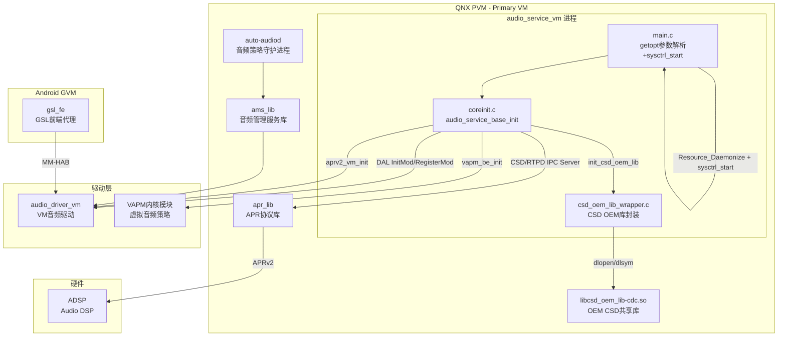

### 16.17.3 服务启动完整时序

> ⚠️ **源码核实（勘误）**：本节旧版描述的 sysinit `waitfor /dev/snd/audio_driver_vm` + `audio_service_vm -d -c config.xml`、`daemon()`、`openlog()`、`getopt("dc:h")`、`coreinit_init()`、`event_loop_run()`、`coreinit_deinit()`、SIGINT/SIGHUP 处理、"6步初始化"时序，**在本进程源码中均不存在**，属旧版虚构。以下依据 `audio_service_vm/src/main.c` 与 `coreinit.c` 重写为真实流程。

#### 16.17.3.1 启动与单实例保护

`audio_service_vm` 由 QNX 启动脚本拉起，可执行接受可选参数 `-v/-h/-f/-U`（详见 16.17.3.2）。进程启动后通过 `open(DEVICE_NAME, O_RDONLY)` 检查 `/dev/audio_service` 是否已被占用来做单实例保护，随后 `Resource_Daemonize()` 转为后台 resmgr 服务。

**真实启动依赖链**：

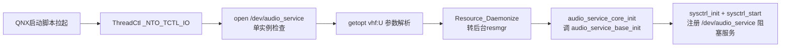

进程不使用 `waitfor` 等待驱动设备节点，也不进入"降级模式"分支；`sysctrl_start(DEVICE_NAME)` 会阻塞在 resmgr 消息循环上直到进程被 `SIGTERM` 终止。

#### 16.17.3.2 main.c服务入口深度分析

`main.c` 是 `audio_service_vm` 的入口点，真实核心流程如下（依据 `audio_service_vm/src/main.c`）：

```c
// main.c 真实实现结构
const static char* DEVICE_NAME = "/dev/audio_service";

static void handle_sigterm(int no)
{
    fprintf(stderr, "audio_service_vm: received SIGTERM, exiting\n");
    exit(0);   // 直接退出，无优雅清理
}

int audio_service_core_init(int flags, const char *lpass_config_path)
{
    static int inited = 0;
    if (inited) return DAL_SUCCESS;   // 单次初始化保护
    inited = 1;
    if (DAL_SUCCESS != audio_service_base_init(flags, lpass_config_path))
        return DAL_ERROR;
    return DAL_SUCCESS;
}

int main(int argc, char** argv)
{
    int c;
    int audio_service_initFlags = 0;
    char *lpass_config_path = NULL;

    ThreadCtl(_NTO_TCTL_IO, 0);              // 请求 I/O 权限
    signal(SIGTERM, handle_sigterm);         // 仅注册 SIGTERM

    // 单实例保护：设备节点已存在则说明已有实例
    open(DEVICE_NAME, O_RDONLY);

    // 参数解析：仅 v/h/f/U
    while ((c = getopt(argc, argv, "vhf:U:")) != -1) {
        switch (c) {
        case 'v': add_verbosity++;           break;   // 提升日志详细度
        case 'h': print_usage(argv[0]);      return 0;
        case 'f': lpass_config_path = strdup(optarg); break; // LPASS 配置路径
        case 'U': /* SECPOL: set_ids_from_arg 降权 */ break;
        default:  print_usage(argv[0]);      return -1;
        }
    }

    Resource_Daemonize();                    // 转后台 resmgr 服务
    audio_service_core_init(audio_service_initFlags, lpass_config_path);
    sysctrl_init();
    sysctrl_start(DEVICE_NAME);              // 阻塞在 resmgr 消息循环
    return 0;
}
```

**命令行参数详解**（真实 `getopt(argc, argv, "vhf:U:")`）：

| 参数 | 说明 | 备注 |
|------|------|------|
| `-v` | 提升日志详细度（`add_verbosity++`，可叠加） | 无值 |
| `-h` | 打印用法并退出 | 无值 |
| `-f <path>` | 指定 LPASS 配置路径（`strdup` 后传给 `audio_service_base_init`） | 带值 |
| `-U <ids>` | SECPOL 降权，设置运行时用户/组 ID | 带值 |

> 旧版描述的 `-d`（daemon）/`-c <config>` 参数在真实源码中不存在。守护进程化由无参数的 `Resource_Daemonize()` 完成；配置文件路径通过 `-f` 而非 `-c` 传入。

**信号处理**（真实仅注册一个信号）：

| 信号 | 处理方式 | 说明 |
|------|----------|------|
| SIGTERM | `handle_sigterm` 直接 `exit(0)` | 无优雅退出/清理流程 |

> 旧版描述的 SIGINT（Ctrl+C）与 SIGHUP（配置热重载）处理器在真实源码中不存在，进程不支持配置热重载。

#### 16.17.3.3 启动时序图

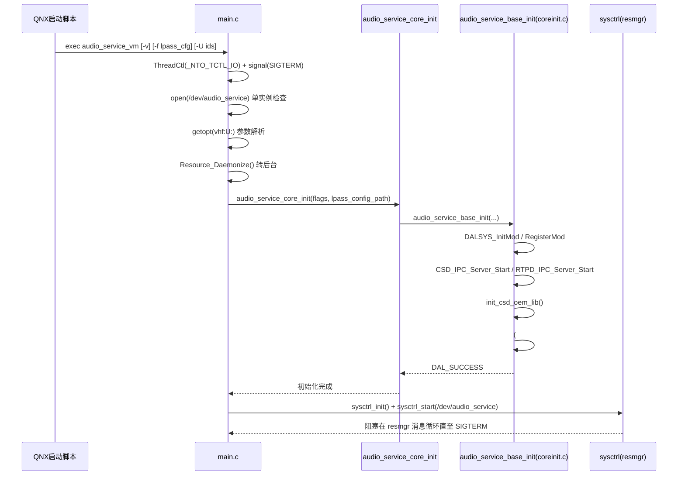

### 16.17.4 coreinit.c — audio_service_base_init 核心初始化深度解析

> ⚠️ **源码核实（勘误）**：本节旧版描述的"6步初始化编排"（Step1 驱动 open + `ioctl(AUDIO_DRV_GET_VERSION)`、Step2 `acdb_loader_init/load_file/push_to_adsp`、Step3 `ams_init/ams_register_hw_intf`、Step4 `agm_init/agm_load_graph_topology`、Step5 `csd_oem_lib_load/open`、Step6 `ioctl(AUDIO_DRV_VAPM_REGISTER)` + `coreinit_init` 编排 + goto 回滚清理），**在本进程源码 `coreinit.c` 中均不存在**，属旧版虚构（Android/PAL 风格伪代码）。真实核心初始化函数是 `audio_service_base_init(int flags, const char *lpass_config_path)`，无"6步"分层、无版本校验、无 ACDB 加载、无 AMS/AGM/GSL 初始化、无 VAPM ioctl 注册、无 goto 清理。以下依据 `audio_service_vm/src/coreinit.c` 重写。

`coreinit.c` 的核心是 `audio_service_base_init()`，由 `main.c` 经 `audio_service_core_init()` 调用一次。它按固定顺序完成 DAL 模块注册、CSD/RTPD IPC 服务器启动、CSD OEM 库加载，并在编译宏 `ENABLE_AUDIO_BACKEND` 打开时启动一组音频后端。**大量 ADSP / AMFS / fastrpc / enable_csd_device 逻辑被 `#if 0 //tf` 包裹关闭**，不属于运行时行为。

#### 16.17.4.1 audio_service_base_init 真实实现

```c
// coreinit.c - 真实核心初始化
int audio_service_base_init(int flags, const char *lpass_config_path)
{
    (void)flags;
    (void)lpass_config_path;

    // 1. DAL 模块系统初始化与驱动模块注册
    DALSYS_InitMod(NULL);
    DALSYS_RegisterMod(&gDALModDriverInfoList);

    // 2. 启动 CSD / RTPD IPC 服务器（QNX 侧音频 IPC 入口）
    CSD_IPC_Server_Start(NULL);
    RTPD_IPC_Server_Start(NULL);

    // 3. 动态加载 CSD OEM 库（libcsd_oem_lib-cdc.so）
    init_csd_oem_lib();

#if 0 //tf
    // 以下 ADSP/AMFS/fastrpc 相关逻辑在本板级配置中被整体关闭
    audio_smmu_restart();
    amfs_init();
    fastrpc_qnx_init();
    adsp_default_listener_register();
    enable_csd_device();     // ASIC_8295: mcm_init; ASIC_6155: csd_init/open/ioctl
#endif

#ifdef ENABLE_AUDIO_BACKEND
    // 4. 编译期启用音频后端时，依次启动各后端
    aprv2_vm_init();          // APRv2 VM 后端
    audio_smmu_vm_be_init();  // SMMU VM 后端
    vcodec_plugin_be_start(); // vcodec 插件后端
    vapm_be_init();           // VAPM 后端
    vaudio_gpio_config();     // 音频 GPIO 配置
#endif

    return DAL_SUCCESS;
}
```

**真实初始化步骤说明**：

| 顺序 | 调用 | 说明 |
|------|------|------|
| 1 | `DALSYS_InitMod(NULL)` | 初始化 DAL（Device Abstraction Layer）模块系统 |
| 2 | `DALSYS_RegisterMod(&gDALModDriverInfoList)` | 注册驱动模块信息表 |
| 3 | `CSD_IPC_Server_Start(NULL)` | 启动 CSD IPC 服务器 |
| 4 | `RTPD_IPC_Server_Start(NULL)` | 启动 RTPD IPC 服务器 |
| 5 | `init_csd_oem_lib()` | dlopen 加载 CSD OEM 库并绑定 4 个符号（详见 16.17.5） |
| 6 | `#if 0 //tf` 块 | ADSP/AMFS/fastrpc/enable_csd_device 全部关闭，不生效 |
| 7 | `#ifdef ENABLE_AUDIO_BACKEND` 块 | 条件编译启用：aprv2_vm_init / audio_smmu_vm_be_init / vcodec_plugin_be_start / vapm_be_init / vaudio_gpio_config |

> **关键点**：真实实现**不打开** `/dev/snd/audio_driver_vm`、**不做**驱动版本校验、**不加载** ACDB、**不初始化** AMS/AGM、**不通过 ioctl 注册 VAPM 回调**；`flags` 与 `lpass_config_path` 参数被透传但在核心分支中未实际使用。

#### 16.17.4.2 条件编译与关闭代码块

`coreinit.c` 中存在两类编译控制，理解它们是判断"哪些代码真正运行"的关键：

| 编译控制 | 包裹的逻辑 | 运行时是否生效 |
|----------|-----------|----------------|
| `#if 0 //tf` | `audio_smmu_restart` / `amfs_init` / `fastrpc_qnx_init` / `adsp_default_listener_register` / `enable_csd_device` | **否**，源码级关闭 |
| `#ifdef ENABLE_AUDIO_BACKEND` | `aprv2_vm_init` / `audio_smmu_vm_be_init` / `vcodec_plugin_be_start` / `vapm_be_init` / `vaudio_gpio_config` | 取决于编译宏是否定义 |

其中 `enable_csd_device()`（位于 `#if 0` 内）的分支逻辑为：`ASIC_8295` 走 `mcm_init()`；`ASIC_6155` 走 `csd_init/csd_open/csd_ioctl`。由于整体被 `#if 0` 关闭，这些调用在当前构建中并不执行，文档不应将其描述为运行时行为。

#### 16.17.4.3 初始化调用链总览

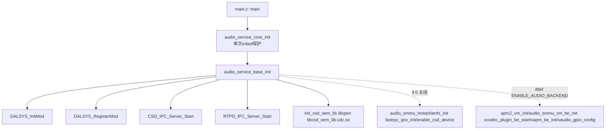

### 16.17.5 CSD OEM库动态加载机制深度分析

> ⚠️ **源码核实（勘误）**：本节旧版描述的库路径 `/usr/lib/libcsd_oem.so`（及备用路径）、`RTLD_NOW`、必需/可选符号 `csd_open/csd_close/csd_enable_device/csd_disable_device/csd_start_voice/csd_stop_voice/csd_set_volume/csd_mic_mute`、默认实现回退、`csd_oem_lib_unload` + `dlclose` 卸载、SIGHUP 热重载，**均与真实源码 `csd_oem_lib_wrapper.c` 不符**，属旧版虚构。真实实现只加载 `libcsd_oem_lib-cdc.so`，用 `RTLD_NOW|RTLD_GLOBAL`，仅解析 **4 个符号**，**无 dlclose 卸载流程**，符号缺失也不回退默认实现。以下依据源码重写。

#### 16.17.5.1 CSD OEM库架构角色

`csd_oem_lib_wrapper.c` 封装了平台特定 CSD OEM 库 `libcsd_oem_lib-cdc.so` 的动态加载与调用转发。它在 `audio_service_base_init()` 的 `init_csd_oem_lib()` 步骤被加载一次，向上暴露 4 个转发函数，供 CSD 层调用底层 OEM 设备管理逻辑。

| 特性 | 真实行为 |
|------|----------|
| 库名 | `libcsd_oem_lib-cdc.so`（无绝对路径，由动态链接器按搜索路径解析） |
| dlopen 标志 | `RTLD_NOW | RTLD_GLOBAL` |
| 解析符号数 | 4 个（见下表），无必需/可选之分 |
| 卸载 | **无 dlclose**，库随进程生命周期常驻 |
| 懒加载 | 转发函数调用时若函数指针为空则重新 `init_csd_oem_lib()` |

#### 16.17.5.2 init_csd_oem_lib 真实实现

```c
// csd_oem_lib_wrapper.c - 真实动态加载实现
static const char csd_oem[] = "libcsd_oem_lib-cdc.so";

static void *handle = NULL;
static csd_dev_oem_init_t          csd_dev_oem_init_fn          = NULL;
static csd_dev_oem_dinit_t         csd_dev_oem_dinit_fn         = NULL;
static csd_dev_oem_get_dev_count_t csd_dev_oem_get_dev_count_fn = NULL;
static csd_dev_oem_msg_t           csd_dev_oem_msg_fn           = NULL;

void init_csd_oem_lib(void)
{
    // 以 RTLD_NOW|RTLD_GLOBAL 加载 OEM 库
    handle = dlopen(csd_oem, RTLD_NOW | RTLD_GLOBAL);
    if (!handle) {
        // 记录 dlerror，不做备用路径/默认实现回退
        return;
    }

    // 解析 4 个符号
    csd_dev_oem_init_fn          = dlsym(handle, "csd_dev_oem_init");
    csd_dev_oem_dinit_fn         = dlsym(handle, "csd_dev_oem_dinit");
    csd_dev_oem_get_dev_count_fn = dlsym(handle, "csd_dev_oem_get_dev_count");
    csd_dev_oem_msg_fn           = dlsym(handle, "csd_dev_oem_msg");
}

// 转发函数示例（懒加载：函数指针为空则重新初始化）
int csd_dev_oem_init(void)
{
    if (!csd_dev_oem_init_fn) init_csd_oem_lib();
    if (csd_dev_oem_init_fn)  return csd_dev_oem_init_fn();
    return -1;
}
// 另有 csd_dev_oem_dinit / csd_dev_oem_get_dev_count / csd_dev_oem_msg 三个同构转发函数
```

**dlopen/dlsym 真实流程图**：

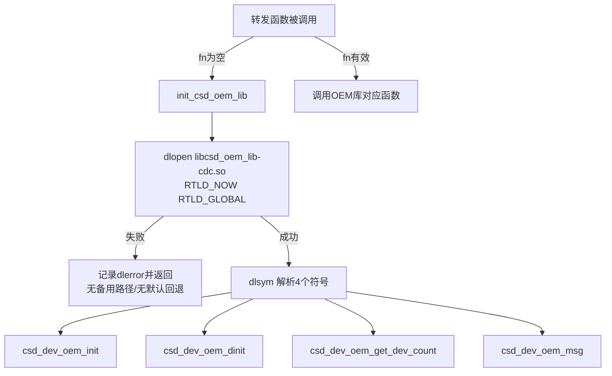

#### 16.17.5.3 CSD OEM 接口函数表

真实源码通过 `dlsym` 解析并转发以下 **4 个** OEM 符号，无"必需/可选"分级，无默认实现：

| 函数符号 | 转发函数 | 说明 |
|----------|----------|------|
| `csd_dev_oem_init` | `csd_dev_oem_init()` | 初始化 OEM 设备管理 |
| `csd_dev_oem_dinit` | `csd_dev_oem_dinit()` | 反初始化 OEM 设备管理 |
| `csd_dev_oem_get_dev_count` | `csd_dev_oem_get_dev_count()` | 查询 OEM 设备数量 |
| `csd_dev_oem_msg` | `csd_dev_oem_msg()` | 向 OEM 设备层发送消息/命令 |

> 旧版列出的 `csd_open/csd_close/csd_enable_device/csd_disable_device/csd_start_voice/csd_stop_voice/csd_set_volume/csd_mic_mute` 等符号在真实 wrapper 中不存在。

### 16.17.6 事件循环机制

> ⚠️ **源码核实（勘误）**：旧版本节描述的 `event_handler.c` / `event_loop_run()` / `MAX_POLL_FDS` / `poll()` 多路复用 / self-pipe 信号技巧 / `DBus` 消息 / `timerfd` 健康检查 / `SIGHUP` → `config_reload()` **在真实源码中均不存在**。`audio_service_vm` 没有独立的 `event_handler.c`，也不使用 `poll()`。其真正的“事件循环”是 [`main.c`](Qnx/apps/qnx_ap/AMSS/multimedia/audio/audio_elite/audio_service_vm/src/main.c:250) 末尾调用的 `sysctrl_start(DEVICE_NAME)`——一个 **QNX resmgr（资源管理器）消息循环**，由平台工具库 `sysctrl`（[`sysctrl_service.c`](Qnx/apps/qnx_ap/AMSS/platform/utilities/sysctrl/src/sysctrl_service.c:160)）实现。

#### 16.17.6.1 真实事件循环 = QNX resmgr 消息循环

`main()` 在完成 `audio_service_core_init()` 与 `sysctrl_init()` 后，调用 `sysctrl_start(DEVICE_NAME)` 进入阻塞式消息循环，此后进程常驻响应对设备节点 `/dev/audio_service` 的 open/write/devctl 请求：

```c
// main.c 末尾（真实）
if (DAL_SUCCESS != sysctrl_init()) {
    PROCESS_ERROR_CRITICAL("audio_service: sysctrl_init Error");
}
sysctrl_start(DEVICE_NAME);   // 阻塞，进入 resmgr 消息循环，永不返回（除非出错）
```

`sysctrl_start()` 校验初始化状态后转入 `start_service()`，后者是真正的循环载体：

```c
// sysctrl_service.c: start_service()（真实，节选）
int start_service(const char* device_name)
{
    resmgr_attr_t       resmgr_attr;
    dispatch_t          *dpp;
    dispatch_context_t  *ctp;
    int                 id;

    /* 1. 创建 dispatch 句柄 */
    if ((dpp = dispatch_create()) == NULL) { ... return EXIT_FAILURE; }

    /* 2. resmgr 属性：单消息、最大 2048 字节 */
    memset(&resmgr_attr, 0, sizeof resmgr_attr);
    resmgr_attr.nparts_max   = 1;
    resmgr_attr.msg_max_size = 2048;

    /* 3. 绑定 connect/io 回调 */
    iofunc_func_init(_RESMGR_CONNECT_NFUNCS, &connect_funcs,
                     _RESMGR_IO_NFUNCS, &io_funcs);
    connect_funcs.open = io_open;
    io_funcs.write     = io_write;
    io_funcs.acl       = io_acl;
    io_funcs.devctl    = io_devctl;

    /* 4. 初始化设备属性 + ACL */
    iofunc_attr_init(&attr, S_IFCHR | 0660, NULL, NULL);
    attr.mount = &mount;
    iofunc_acl_init(&attr, iofunc_acl_posix_ctrl, 0);

    /* 5. 挂载设备名 /dev/audio_service */
    if ((id = resmgr_attach(dpp, &resmgr_attr, device_name, _FTYPE_ANY, 0,
            &connect_funcs, &io_funcs, (RESMGR_HANDLE_T *)&attr)) == -1) {
        ... return EXIT_FAILURE;
    }

    /* 6. 分配 dispatch 上下文 */
    ctp = dispatch_context_alloc(dpp);

    /* 通知上层 resmgr 已就绪（uresmgr_ready 回调，若注册） */
    if (p_sysctrl_ctxt->uops.uresmgr_ready)
      p_sysctrl_ctxt->uops.uresmgr_ready(p_sysctrl_ctxt->uctxt);

    /* 7. 消息循环：dispatch_block 阻塞收消息 → dispatch_handler 分发 */
    while (1) {
        if ((ctp = dispatch_block(ctp)) == NULL) {
            logger_log(..., "core_service [%s]: dispatch_block error", device_name);
            return EXIT_FAILURE;
        }
        dispatch_handler(ctp);   // 分发到 io_open / io_write / io_devctl / io_acl
    }
}
```

**要点**：

- 循环体是标准 QNX resmgr 惯用法 `while(1){ ctp = dispatch_block(ctp); dispatch_handler(ctp); }`，**不是** `poll()` 多路复用。
- 唯一被监听的“事件源”是内核消息通道：客户端对 `/dev/audio_service` 的 `open()/write()/devctl()` 会被内核转成消息，由 `dispatch_block()` 收取。
- `resmgr_attr.msg_max_size = 2048`、`nparts_max = 1`：单条消息上限 2048 字节。

#### 16.17.6.2 真实的消息处理入口（io 回调）

`audio_service_vm` 对外暴露的能力由 `sysctrl_service.c` 注册的这几个 resmgr 回调承载，而非旧版臆造的 `apr_event_callback / vapm_policy_handler / dbus_message_handler` 等：

| 回调 | 触发时机 | 说明 |
|------|----------|------|
| `io_open()` | 客户端 `open("/dev/audio_service")` | 分配 OCB，做 ACL 权限校验 |
| `io_write()` | 客户端 `write()` | 把写入的命令串交由 `dispatch_rm_command_ex()` 解析执行 |
| `io_devctl()` | 客户端 `devctl()` | 设备控制命令 |
| `io_acl()` | ACL 检查 | POSIX ACL 权限控制 |

命令解析走 [`sysctrl_dispatcher.c`](Qnx/apps/qnx_ap/AMSS/platform/utilities/sysctrl/src/sysctrl_dispatcher.c:108) 的 `dispatch_rm_command_ex()`，它对写入的字符串按分隔符切分并执行对应动作。

#### 16.17.6.3 真实事件循环流程

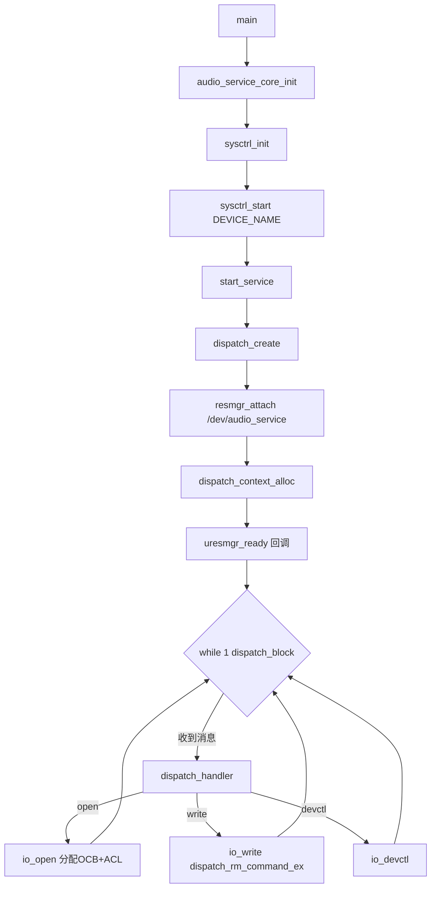

#### 16.17.6.4 信号处理（真实）

真实实现里信号处理极简：`main()` 仅注册 `SIGTERM`，处理函数直接 `exit(0)`，**没有** self-pipe、没有 `SIGHUP` 配置热重载、没有把信号编号写入管道唤醒 `poll` 的技巧：

```c
// main.c（真实）
static void handle_sigterm(int sig)
{
    (void)sig;
    exit(0);
}
...
signal(SIGTERM, handle_sigterm);   // 仅此一处信号注册
```

### 16.17.7 与 ADSP 音频后端的交互接口

> ⚠️ **源码核实（勘误）**：旧版本节声称 `audio_service_vm` 通过打开 `/dev/snd/audio_driver_vm` 并调用一组 `ioctl` 命令（`AUDIO_DRV_GET_VERSION` / `AUDIO_DRV_APR_OPEN` / `AUDIO_DRV_APR_SEND` / `AUDIO_DRV_VAPM_REGISTER` / `AUDIO_DRV_AVMM_GET_STATUS` / `AUDIO_DRV_SSR_SUBSCRIBE`）与所谓 `audio_driver_vm` 交互——**这些设备节点、ioctl 命令码在真实源码中均不存在**，`audio_service_vm` 源码里也没有任何 `audio_driver_vm` 概念。真实的“与 ADSP 交互”是在 [`coreinit.c`](Qnx/apps/qnx_ap/AMSS/multimedia/audio/audio_elite/audio_service_vm/src/coreinit.c:224) 的 `#ifdef ENABLE_AUDIO_BACKEND` 块里，通过一组后端初始化函数拉起 APR/SMMU/vcodec/VAPM/GPIO 后端来完成。

#### 16.17.7.1 真实后端启动序列（ENABLE_AUDIO_BACKEND）

当编译打开 `ENABLE_AUDIO_BACKEND` 时，`audio_service_base_init()` 依次调用以下后端初始化函数（均为 `extern`，实现分布在各后端库中）：

```c
// coreinit.c: audio_service_base_init() 内 #ifdef ENABLE_AUDIO_BACKEND 块（真实）
#ifdef ENABLE_AUDIO_BACKEND
    LOG(QCLOG_INFO,"launching APR backend");
    aprv2_vm_init();               // APRv2 VM 侧后端：建立与 ADSP 的 APR 消息通道
    LOG(QCLOG_INFO,"launching audio SMMU backend");
    (void)audio_smmu_vm_be_init(); // 音频 SMMU VM 后端：DMA 地址映射
    LOG(QCLOG_INFO,"launching vcodec backend");
    vcodec_plugin_be_start();      // 虚拟 codec 插件后端
    LOG(QCLOG_INFO,"launching VAPM backend");
    vapm_be_init();                // VAPM（虚拟音频策略管理）后端
    LOG(QCLOG_INFO,"configuring GPIOs");
    vaudio_gpio_config();          // 音频相关 GPIO 配置
#endif
```

#### 16.17.7.2 后端函数职责

| 后端函数 | 声明 | 职责 |
|----------|------|------|
| `aprv2_vm_init()` | `extern` | 初始化 APRv2 VM 侧后端，建立向 ADSP 投递/接收 APR 消息的通道（VM 内 APR 路由） |
| `audio_smmu_vm_be_init()` | `extern int32_t (void)` | 初始化音频 SMMU VM 后端，配置音频 DMA 的地址翻译/映射；返回值被 `(void)` 显式忽略 |
| `vcodec_plugin_be_start()` | `extern int32_t (void)` | 启动虚拟 codec 插件后端 |
| `vapm_be_init()` | `extern int32_t (void)` | 初始化 VAPM 后端（虚拟音频策略管理，跨 VM 音频资源仲裁的 VM 侧对接） |
| `vaudio_gpio_config()` | `extern void (void)` | 配置音频相关 GPIO |

> 这些函数只有 `extern` 声明（[`coreinit.c`](Qnx/apps/qnx_ap/AMSS/multimedia/audio/audio_elite/audio_service_vm/src/coreinit.c:82) 附近），实现体在各自的后端库中，不在 `audio_service_vm` 目录内。

#### 16.17.7.3 真实交互流程

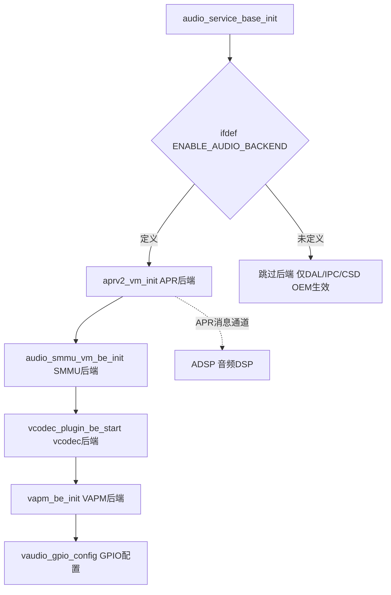

**要点**：

- 与 ADSP 的实际消息通道由 `aprv2_vm_init()` 拉起的 **APRv2 VM 后端**承载，而非旧版臆造的 `ioctl(fd, AUDIO_DRV_APR_SEND, ...)`。
- 若编译未定义 `ENABLE_AUDIO_BACKEND`，则整个后端块被跳过——此时 `audio_service_vm` 只执行 DAL 模块注册、CSD/RTPD IPC Server 与 CSD OEM 库加载。
### 16.17.8 ADSP SSR 相关符号（桩实现，主流程未启用）

> ⚠️ 源码核实（勘误）：旧版本节描述的 SSR 恢复框架**在 audio_service_vm 中并不存在**，属虚构：
> - 无 `ssr_handler.c` / `ssr_handler_process()` / SSR_DOWN/SSR_UP 事件机
> - 无 `apr_lib_pause()` / `apr_lib_reinit()` / `ams_ssr_notify()` / `dbus_notify_ssr()`
> - 无 `agm_mark_graphs_dirty()` / `acdb_loader_push_to_adsp()` / `agm_ssr_recovery()`
> - 无“5 步恢复 + 超时/重试”表
>
> 真实情况：`audio_service_vm` 目录里与 SSR 相关的符号**全部是 `audio_stubs.c` 中的空桩（`return 0;`）**，且 `coreinit.c` 中真正调用 SSR/监听逻辑的代码块**都被 `#if 0` 关闭**。audio_service_vm 本身**不承担 ADSP SSR 恢复职责**，仅链接这些桩以满足符号依赖。

#### 16.17.8.1 audio_stubs.c 中的 SSR 空桩

`audio_stubs.c` 提供了一批 SSR/子系统重启相关函数的空实现，全部直接 `return 0`，不含任何恢复逻辑：

```c
// audio_stubs.c — 全部为空桩（return 0），无实际功能
uint32_t ssrestart_init(const char* parm)
{
    return 0;
}

uint32_t ssrestart_register_cb(
        SsrestartEventCallback p_cb_func,
        uint32_t ss_id_mask,
        uint32_t event_mask,
        uint32_t client_data)
{
    return 0;
}

uint32_t ssrestart_unregister_cb(SsrestartEventCallback p_cb_func)
{
    return 0;
}

int ssr_register_callback_events(uint64_t client_magic,
        int (*event_handler)(enum ssr_ss_id, enum ssr_events, void *ctx),
        uint32_t event_mask, void **priv_data,
        const char *client_name, void *ctx)
{
    return 0;
}

int ssr_unregister_callback(void *priv_data)
{
    return 0;
}

int32_t mcm_enable_bootup_dev(bool_t is_ssr, bool_t is_lpm)
{
    return 0;
}
```

| 桩函数 | 语义（正常平台） | 在 audio_service_vm 中 |
|--------|------------------|------------------------|
| `ssrestart_init` | 初始化子系统重启框架 | 空桩，`return 0` |
| `ssrestart_register_cb` | 注册 SSR 事件回调 | 空桩，不注册任何回调 |
| `ssrestart_unregister_cb` | 注销 SSR 回调 | 空桩 |
| `ssr_register_callback_events` | 按 event_mask 订阅 SSR 事件 | 空桩，不订阅 |
| `ssr_unregister_callback` | 注销 SSR 事件订阅 | 空桩 |
| `mcm_enable_bootup_dev` | 按 is_ssr 标志启动/恢复设备 | 空桩 |

#### 16.17.8.2 coreinit.c 中 SSR 逻辑被 `#if 0` 关闭

`coreinit.c` 曾预留过 SMMU 重启与 ADSP 默认监听器注册的调用，但均处于**编译关闭**状态：

```c
// coreinit.c 头部 —— ssrestart.h 的 include 被 #if 0 包裹（第 37~40 行）
#if 0
#include "ssrestart.h"
#endif

// adsp_default_listener.h 仍被包含（第 53 行），但其调用点关闭
#include "adsp_default_listener.h"

// coreinit.c 初始化体内 —— 第 207~223 行均在 #if 0 //tf 块中
#if 0 //tf
    if (0 != audio_smmu_restart())
    {
        LOG(QCLOG_ERROR, "failure in audio_smmu_restart");
        ...
    }
#endif
    adsp_default_listener_register();
#endif
#endif //tf
```

- `#include "ssrestart.h"` 位于 `#if 0`(37) / `#endif`(40) 之间——头文件**不参与编译**。
- `audio_smmu_restart()`(第 208 行) 与 `adsp_default_listener_register()`(第 221 行) 位于 `#if 0 //tf`(207) / `#endif //tf`(223) 之间——**均不会执行**。

因此 audio_service_vm 启动路径中，**不会调用任何 SSR 检测、恢复或 ADSP 监听器注册逻辑**。

#### 16.17.8.3 真实职责边界

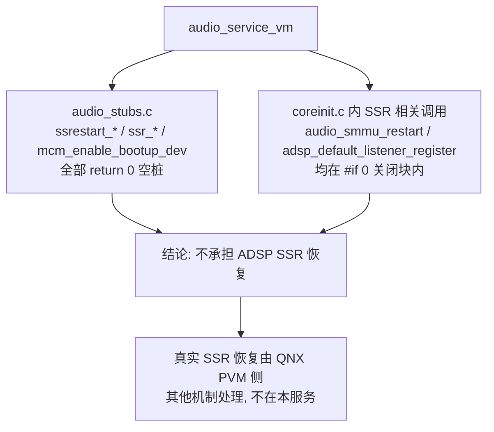

**要点**：
- audio_service_vm 只提供 SSR 符号的**空桩**，不实现恢复流程；
- 相关调用点在源码中被 `#if 0` 显式关闭，属未启用代码；
- ADSP SSR 的真实检测与恢复不在 audio_service_vm 主流程内，勿据旧版“5 步恢复框架”进行分析或推断。

### 16.17.9 安全音频与策略仲裁（源码边界说明）

> ⚠️ 源码核实（勘误）：旧版本节描述的“安全音频独立处理路径”在 audio_service_vm 中**没有对应实现**，属虚构：
> - `audio_service_vm/` 目录内**不含** safety / secure_audio / parking / adas / cluster 任何字样（grep 全目录为空）
> - 无“安全音频客户端 QNX 原生进程”、无“专用 APR 端点”、无“安全流抢占普通流”的隔离表
> - 旧版 Mermaid 图使用了 `style ... fill:#...` 样式（违反知识库无样式约定），且节点/连线均为推演
>
> audio_service_vm **不实现任何独立的安全音频路径**。与“策略/优先级仲裁”真正相关的只有 VAPM 后端。

#### 16.17.9.1 与策略仲裁相关的唯一真实入口：VAPM 后端

`coreinit.c` 在 `#ifdef ENABLE_AUDIO_BACKEND` 块内启动 VAPM（Virtual Audio Policy Manager）后端，这是 audio_service_vm 中唯一与“音频策略”相关的真实调用（详见 16.17.7）：

```c
// coreinit.c — VAPM 后端 extern 声明（第 85~87 行）
// VAPM backend initializer
extern int32_t vapm_be_init(void);
extern void   vaudio_gpio_config(void);

// coreinit.c — ENABLE_AUDIO_BACKEND 块内启动（第 232~235 行）
    LOG(QCLOG_INFO, "launching VAPM backend");
    vapm_be_init();
    ...
    vaudio_gpio_config();
```

| 函数 | 职责 | 实现位置 |
|------|------|----------|
| `vapm_be_init()` | 初始化 VAPM 策略后端（跨 VM 音频策略/优先级仲裁的接入点） | 各后端库，**不在** audio_service_vm 目录 |
| `vaudio_gpio_config()` | 配置虚拟音频相关 GPIO | 各后端库，不在本目录 |

- audio_service_vm 只负责**启动** VAPM 后端；真正的策略仲裁逻辑在 VAPM 库内部，不在本服务源码中。
- 任何“安全音频优先级/抢占”的分析都应指向 VAPM 及 ADSP 侧策略实现，而非 audio_service_vm。

#### 16.17.9.2 真实职责边界

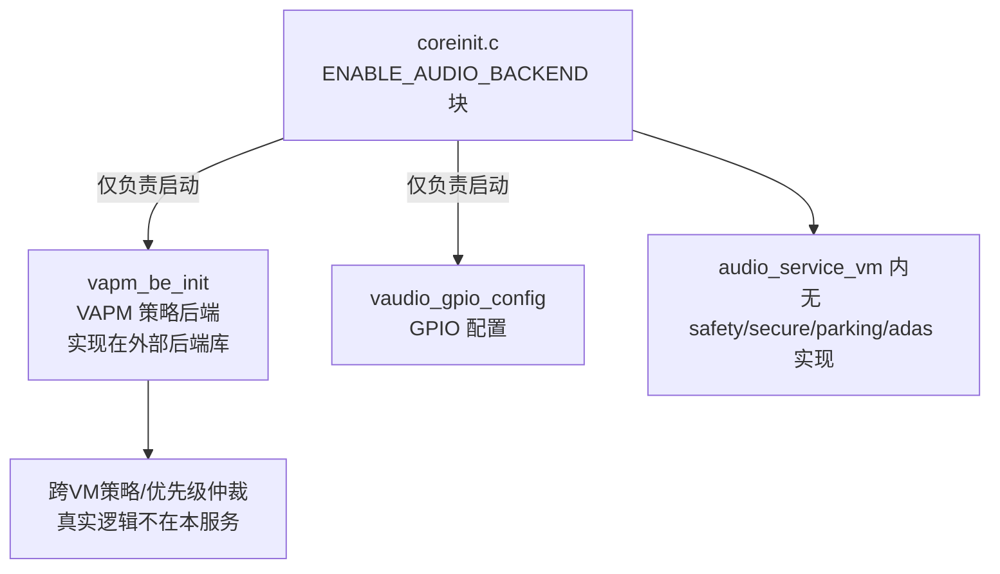

**要点**：
- audio_service_vm **不含**安全音频专用路径的任何源码；
- 唯一沾边的是 VAPM 后端启动调用，策略仲裁实体在外部库；
- 勿据旧版“安全音频客户端 / 专用 APR 端点 / 隔离表”做架构推断。

### 16.17.10 在 Android→QNX 音频链路中的角色

> ⚠️ 源码核实（勘误）：旧版本节把 audio_service_vm 的角色写成“SSR 恢复 / 健康监控 / 策略协调”，与源码不符：
> - **无 SSR 恢复**：相关函数全是 audio_stubs.c 空桩，调用点被 `#if 0` 关闭（见 16.17.8）
> - **无健康监控**：源码中无 timerfd / health_check / 周期性子系统巡检（见 16.17.6）
> - **策略协调**仅限“启动 VAPM 后端”，仲裁逻辑不在本服务（见 16.17.9）
> - 旧版时序图中的 `audio_driver_vm(AVMM)` + `ioctl(APR_SEND)` 交互不存在（真实为 ENABLE_AUDIO_BACKEND 后端函数，见 16.17.7）
>
> 下面按真实源码给出 audio_service_vm 在整条链路中的实际角色。

#### 16.17.10.1 音频数据链路（全局架构，audio_service_vm 不在数据面）

运行期音频数据流经如下路径（详见相关章节），audio_service_vm **不处于数据通路上**：

```
Android App → AudioTrack → AudioFlinger → PAL
  → AGM Service → gsl_fe(libar-gsl_fe.so)
  → MM-HAB(habmm_socket) → gsl_vm_be(QNX)
  → ams_lib → ADSP → 物理输出
```

- 上述数据面由 PAL / gsl_fe / MM-HAB / gsl_vm_be / ams_lib 承担；
- audio_service_vm 只在**启动阶段**把 QNX 侧音频后端拉起，运行期不介入每次流的 open/write。

#### 16.17.10.2 audio_service_vm 的真实角色：一次性后端启动

audio_service_vm 的作用是在 QNX 侧**启动并注册音频服务**，为后续数据面就绪做准备（真实调用见 16.17.6、16.17.7）：

1. `main()` 解析参数后调用 `sysctrl_start(DEVICE_NAME)`，进入 QNX resmgr 消息循环并注册 `/dev/audio_service`（见 16.17.6）。
2. `coreinit.c` 在 `ENABLE_AUDIO_BACKEND` 块内依次启动后端：`aprv2_vm_init()` / `audio_smmu_vm_be_init()` / `vcodec_plugin_be_start()` / `vapm_be_init()` / `vaudio_gpio_config()`（见 16.17.7）。
3. 完成后，QNX 侧音频后端（含 APR 通道、SMMU 映射、VAPM 策略、GPIO）就绪，gsl_vm_be / ams_lib 得以正常服务 Android 侧请求。

audio_service_vm **不做**：SSR 恢复、健康监控、每流路由、跨 VM 数据搬运。

#### 16.17.10.3 角色关系图

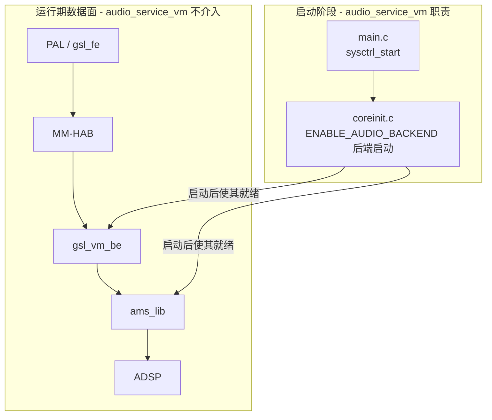

**要点**：
- audio_service_vm 是**控制面启动服务**，负责把 QNX 侧音频后端拉起；
- 音频数据的实际流转在 PAL/gsl_fe/MM-HAB/gsl_vm_be/ams_lib 链路上，本服务不参与；
- 勿把 SSR 恢复 / 健康监控 / 每流策略协调归到 audio_service_vm。

### 16.17.11 错误处理机制（失败即退出 + 上报 sanity monitor）

> ⚠️ 源码核实（勘误）：旧版本节的“降级层次模型 / 6 步初始化 / 服务模式表 / 容错恢复表”均属虚构，与源码不符：
> - 无“完全/降级 1-3/最小/关键”多级服务模式，无 fallback 校准、无 dlopen 失败降级、无“默认 CSD 实现”
> - 无 SSR 恢复 5 步（35 秒）、无 poll 超时重试、无“AVMM 会话断开”“XML 解析失败降级”
> - 真实源码里初始化失败的唯一处理就是 **打错误日志 + 直接返回错误码/退出**，并向 **sanity monitor（OEM 工具）** 上报关键错误。

#### 16.17.11.1 core_init 内部：失败即返回 DAL_ERROR

`coreinit.c` 的初始化各步一旦失败，只做“打错误日志 + `return DAL_ERROR`”，**没有降级或重试**：

```c
// coreinit.c — 典型错误处理（各步一致）
if (rc != 0) {
    LOG(QCLOG_ERROR, "mcm_init failed for master clk devices rc %d!", rc);
    return DAL_ERROR;      // 第 124~125 行
}
...
if (rc != 0) {
    LOG(QCLOG_ERROR, "failure in csd_init rc %d!", rc);
    return DAL_ERROR;      // 第 137~138 行
}
if (handle == 0) {
    LOG(QCLOG_ERROR, "csd open failed handle is 0!");
    return DAL_ERROR;      // 第 145~146 行
}
...
return DAL_SUCCESS;        // 全部成功才返回（第 164 / 249 行）
```

#### 16.17.11.2 main：任一初始化失败即 EXIT_FAILURE

`main.c` 对 core_init / sysctrl_init 的返回值只有“成功继续 / 失败退出”两种路径：

```c
// main.c
if (DAL_SUCCESS != audio_service_core_init(audio_service_initFlags, lpass_config_path)) {
    free(lpass_config_path);       // 释放资源
    return EXIT_FAILURE;           // 第 233~238 行：直接退出，无降级
}
...
if (DAL_SUCCESS != sysctrl_init()) {
    return EXIT_FAILURE;           // 第 244~246 行
}
```

- 单例保护：若服务已在运行，`PROCESS_ERROR_CRITICAL("...Already running...Exiting...")` 后 `return EXIT_FAILURE`（第 189~190 行）。
- `PROCESS_ERROR_CRITICAL(...)` 用于向 **sanity monitor（OEM 工具）** 上报关键错误（第 182 行注释：`Kept in case PROCESS_ERROR_CRITICAL fails to report to sanity monitor`）。
- 收到退出信号时，信号处理函数直接 `exit(0)`（第 58~59 行）。

#### 16.17.11.3 真实错误处理模型

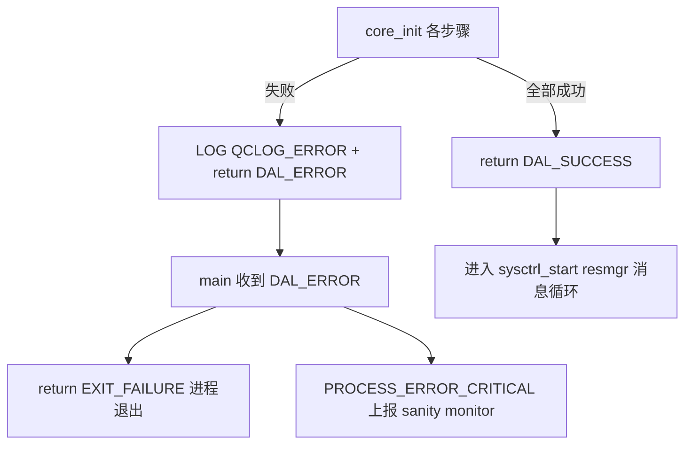

**要点**：
- 初始化失败的处理是**打错误日志 + 返回错误码 + 进程退出**，无多级降级/fallback/重试；
- 关键错误通过 `PROCESS_ERROR_CRITICAL` 上报 OEM 的 **sanity monitor**，由其决定后续（如重启进程）；
- 勿据旧版“降级层次模型 / 容错恢复表”做可靠性分析。

### 16.17.12 调试方法与日志

> ⚠️ 源码核实（勘误）：旧版本节的日志标签表与部分调试命令与源码不符：
> - **无** `.coreinit / .csd / .ssr / .event` 等子标签；日志统一走一个 slog2 缓冲区，级别只有 `QCLOG_INFO` / `QCLOG_ERROR`（`-v` 提高 verbosity）
> - 设备节点是 **`/dev/audio_service`**，**不是** `/dev/snd/audio_driver_vm`
> - **无** `kill -HUP` 配置重载、`/proc/asound/apr_status`、`/proc/asound/avmm_sessions`、`acdb_loaded`/`vapm_registered` 状态节点（均虚构）

#### 16.17.12.1 日志机制：logger_log → slog2

日志由 `coreinit.h` 的 `LOG` 宏统一封装，底层在启用 `LOGGER_USE_SLOG2` 时输出到 QNX slog2：

```c
// inc/coreinit.h:38 — LOG 宏
#define LOG(sev, format, ...) \
    logger_log(QCLOG_AMSS_QNP_SERVICES_AUDIO_SERVICE, \
               QCLOG_AMSS_AUDIO_SERVICE_MINOR, sev, format, ##__VA_ARGS__)

// src/main.c — slog2 缓冲区在构造函数中注册（第 69~90 行）
#ifdef LOGGER_USE_SLOG2
void __attribute__((constructor)) __ctor_slog2_init(void);
static slog2_buffer_t amss_default_slog2_buffer;
const static slog2_buffer_set_config_t buffer_cfg = {
    .num_buffers = 1, // 最多 MAX_SLOG2_BUFFERS(4)
    ...
};
void __ctor_slog2_init(void)
{
    if (-1 == slog2_register(&buffer_cfg, &amss_default_slog2_buffer, 0)) {
        ...
    }
}
#endif
```

- 日志分类：`QCLOG_AMSS_QNP_SERVICES_AUDIO_SERVICE`（主分类）+ `QCLOG_AMSS_AUDIO_SERVICE_MINOR`（次分类），**不是**按功能拆的字符串标签。
- 级别：`QCLOG_INFO` / `QCLOG_ERROR`；命令行 `-v` 会在基准级别上叠加 verbosity（见 16.17.13）。

#### 16.17.12.2 真实日志字样（来自源码）

初始化路径打印的典型日志（可用于对照定位阶段）：

| 日志字样 | 来源（coreinit.c） | 含义 |
|----------|--------------------|------|
| `calling csd_init` | 第 133 行 | 开始 CSD 初始化 |
| `csd open failed handle is 0!` | 第 145 行 | CSD 打开失败 |
| `CSD_IPC_Server_Start` | 第 194 行 | 启动 CSD IPC 服务 |
| `csd_oem driver Start` | 第 202 行 | 启动 CSD OEM 驱动 |
| `start amfs_init` | 第 216 行 | AMFS 初始化 |
| `start fastrpc_qnx_init` | 第 219 行 | FastRPC 初始化 |
| `launching APR backend` | 第 226 行 | 启动 APR 后端（ENABLE_AUDIO_BACKEND） |
| `audio_service_base_init done` | main.c | 基础初始化完成 |

#### 16.17.12.3 调试命令

```bash
# 1. 查看服务进程
pidin | grep audio_service

# 2. 查看服务日志（QNX slog2）
slog2info | grep -i audio_service

# 3. 确认服务已注册的 resmgr 设备节点
ls -l /dev/audio_service

# 4. 提高日志详细度：以 -v 启动（可叠加，见 16.17.13）
audio_service -v
```

**要点**：
- 日志经 `LOG`→`logger_log`→slog2，单缓冲区、双级别，无功能子标签；
- 关注 `/dev/audio_service` 是否成功注册（resmgr）；
- 用真实日志字样（如 `launching APR backend`）定位启动阶段，勿依赖旧版虚构的 `apr_status`/`avmm_sessions` 节点。

### 16.17.13 配置参数与启动选项

> ⚠️ 源码核实（勘误）：旧版本节的 `service_config.xml`（driver/acdb/ams/gsl/csd/ssr/event_loop 各段）**在源码中不存在**，属虚构。`audio_service_vm` **不读取任何 XML 服务配置文件**；它只通过命令行 `getopt` 解析少量启动选项，可选 `-f` 传入 LPASS 配置路径。

#### 16.17.13.1 命令行启动选项（真实）

`main()` 用 `getopt(argc, argv, "vhf:U:")` 解析参数（src/main.c:193）：

```c
while ((c = getopt(argc, argv, "vhf:U:")) != -1) {
    switch (c) {
        case 'v': add_verbosity++; break;                 // 提高 slog2 verbosity（可叠加）
        case 'h': print_usage(); return EXIT_SUCCESS;     // 打印帮助后退出
        case 'f': lpass_config_path = strdup(optarg); break; // 设置 LPASS 配置路径
        case 'U': if (_secpol_in_use()) set_ids_from_arg(optarg); break; // 设置 UID/GID
        case '?':
        default: break;
    }
}
#ifdef _SLOGGER2_UTILS_ENABLE_
if (add_verbosity)
    slog2_set_verbosity(amss_default_slog2_buffer, QCLOG_ERROR + add_verbosity);
#endif
```

| 选项 | 是否带参 | 作用 | 源码依据 |
|------|----------|------|----------|
| `-v` | 否 | 提高日志 verbosity；每多一个 `v` 递增（`add_verbosity++`），最终 `slog2_set_verbosity(buf, QCLOG_ERROR + add_verbosity)` | main.c:195-197 |
| `-h` | 否 | 打印 usage 后 `EXIT_SUCCESS` 退出 | main.c:198-204 |
| `-f <path>` | 是 | 设置 LPASS 配置路径，`strdup(optarg)` 后传入 `audio_service_core_init(flags, lpass_config_path)` | main.c:205-210 |
| `-U <arg>` | 是 | 在启用安全策略（`_secpol_in_use()`）时 `set_ids_from_arg(optarg)` 设置进程 UID/GID（降权） | main.c:211-218 |

真实 usage 文本（`print_usage()`，main.c:107）：

```
Usage Details:
-v , Enable verbose sloging. Disabled by default. Verbosity level increases on specifying extra v.
-h , Print this usage message.
-f , Set LPASS config path.
```

（注：`-U` 未在 usage 中列出，但代码中已实现。）

#### 16.17.13.2 相关行为

- 默认日志级别：`severity_level()` 在无 `-v` 时返回 `QCLOG_INFO`，有 `-v` 时返回 `QCLOG_ERROR + add_verbosity`（main.c）。
- 单实例保护在参数解析之前：`open(DEVICE_NAME, O_RDONLY)` 成功即认为已在运行，`PROCESS_ERROR_CRITICAL` 上报后 `EXIT_FAILURE`。
- 解析完成后 `Resource_Daemonize()` 转后台，再执行 `audio_service_core_init()`。

### 16.17.14 源码路径参考

> ⚠️ 源码核实（勘误）：旧版本节列出的 `event_handler.c` / `ssr_handler.c` / `config_parser.c` / `signal_handler.c` 以及 `csd_oem_lib.h` / `event_handler.h` / `ssr_handler.h` / `service_config.h` / `config/service_config.xml` **在源码中均不存在**，属虚构。真实目录结构如下。

真实路径（`Qnx/apps/qnx_ap/AMSS/multimedia/audio/audio_elite/audio_service_vm/`）：

```
audio_service_vm/
├── src/
│   ├── main.c                     # 服务主入口：参数解析、单实例保护、core_init、sysctrl_start
│   ├── coreinit.c                 # 核心初始化编排：DAL/CSD/OEM/(ENABLE_AUDIO_BACKEND下)APR等后端
│   ├── csd_oem_lib_wrapper.c      # CSD OEM 库 dlopen/dlsym 封装
│   ├── audio_stubs.c              # 依赖符号空桩（SSR/mcm 等 return 0）
│   ├── ftm_oem_dev_map_wrapper.c  # FTM OEM 设备映射封装
│   └── gpio_client_stub.c         # GPIO 客户端桩
└── inc/
    ├── coreinit.h                 # 核心初始化接口 + LOG 宏定义
    └── adsp_default_listener.h    # ADSP 默认监听接口声明（相关调用在 #if 0 内）
```

- `src/` 共 **6** 个文件，`inc/` 共 **2** 个头文件；无独立事件循环/SSR/配置解析/信号处理源文件。
- SSR 相关符号集中在 `audio_stubs.c`（空桩）与 `coreinit.c` 的 `#if 0` 关闭块，见 16.17.8。

### 16.17.15 总结

`audio_service_vm` 是 SA8295 QNX 域中的**音频服务启动/控制面进程**，其真实职责可归纳为：

1. **初始化编排（控制面）**：`main()` → `audio_service_core_init()`（coreinit.c）按顺序完成 DAL 框架初始化、CSD/RTPD IPC 服务启动、CSD OEM 库动态加载，并在编译开关 `ENABLE_AUDIO_BACKEND` 下启动 APRv2 VM / SMMU VM / vcodec plugin / VAPM 后端与 GPIO 配置。
2. **resmgr 服务常驻**：`sysctrl_start(DEVICE_NAME)` 注册 `/dev/audio_service` 并进入 QNX 资源管理器消息循环，响应客户端 open/write/devctl（无 poll 多路复用、无独立事件循环）。
3. **CSD 扩展**：通过 dlopen/dlsym 动态加载 OEM CSD 库（`csd_oem_lib_wrapper.c`）。
4. **失败即退出**：各初始化步骤失败 `LOG(QCLOG_ERROR)` + `return DAL_ERROR`；`main` 侧转 `EXIT_FAILURE`，关键错误经 `PROCESS_ERROR_CRITICAL` 上报 sanity monitor（无降级/重试/fallback）。
5. **不承担**：ADSP SSR 恢复（空桩+`#if 0`）、独立安全音频路径（无对应实现，策略入口为 VAPM 后端）、每流路由、跨 VM 数据搬运（数据面在 PAL/gsl_fe/MM-HAB/gsl_vm_be/ams_lib）。

一句话：`audio_service_vm` 是**一次性把 QNX 侧音频后端拉起来、随后作为 resmgr 服务常驻**的控制面进程，不参与运行时数据面处理，也不做 SSR/降级/安全音频仲裁。

---

[← 上一个](16_16.16_QNX_audio_driver_vm_VM音频驱动层.md) | [← 返回16章](README.md) | [返回导航](../README.md) | [下一个 →](16_16.18_QNX_ams_lib_音频管理服务库.md)]