[← 上一个](16_16.17_QNX_audio_service_vm_VM音频服务.md) | [← 返回16章](README.md) | [返回导航](../README.md)

---

## 16.18 ams_lib — QNX音频管理服务库

> **架构归属说明**：`ams_lib` 属于 SA8295 QNX 侧 `audio_elite/`（Elite 架构）组件。SA8295 另有 `audio_ar/`（AudioReach 架构，对应 `amfs2_lib`/`audio_reach`/`avmm_lib`/`gsl_be`），由板级配置 `adp_8295` vs `adp_8295_ar` 选择。详见 [16.16 架构归属说明](16_16.16_QNX_audio_driver_vm_VM音频驱动层.md)。


### 16.18.1 概述

`ams_lib`（Audio Management Service Library）是SA8295 QNX域中的**音频管理核心共享库**，提供DSP图（Graph）全生命周期管理和硬件接口（TDM/I2S/PDM）映射的编程接口。作为QNX音频栈中间层的关键枢纽，它将上层组件（audio_service_vm、auto-audiod、AGMAudio）的音频路由请求转化为ADSP可执行的图操作命令，并管理音频数据流与物理硬件接口的绑定关系。

在SA8295 Hypervisor虚拟化架构下，QNX是ADSP的唯一控制方（PVM），Android（GVM）的所有图操作请求都需通过MM-HAB跨VM通道到达QNX域，由ams_lib转化为APR命令发送至ADSP执行。ams_lib同时管理安全音频图（倒车雷达、ADAS告警等），确保Android域崩溃时安全音频通路不受影响。

**架构定位**：

| 维度 | 说明 |
|------|------|
| 层级 | QNX音频栈中间层（共享库 .so） |
| 运行域 | QNX PVM（Primary VM），Hypervisor隔离域0 |
| 库类型 | 共享库，被audio_service_vm和auto-audiod链接 |
| 核心职责 | DSP图生命周期管理、硬件接口(TDM)映射、图参数配置 |
| 与Android关系 | Android GSL图请求经gsl_fe→MM-HAB→gsl_vm_be→ams_lib→APR→ADSP |
| 安全属性 | 管理安全音频图的独立创建与路由，与Android图完全隔离 |
| 初始化时序 | 由audio_service_vm的coreinit Step3调用ams_init()初始化 |

**与其他QNX组件的关系**：

| 组件 | 交互方式 | 说明 |
|------|----------|------|
| audio_service_vm | 链接调用 | coreinit Step3初始化ams，注册硬件接口映射 |
| auto-audiod | 链接调用 | 策略守护进程通过ams_lib执行音频路由变更 |
| AGM/GSL | 链接调用 | 图管理器使用ams_lib的底层图操作能力 |
| audio_driver_vm | 间接调用 | ams_lib通过APR命令经驱动发送到ADSP |
| apr_lib | 链接调用 | ams_lib使用APR协议封装图操作消息 |
| ACDB/acdb-loader | 数据依赖 | 校准数据通过ams_lib的set_param推送到Graph |
| VAPM | 策略交互 | VAPM保证QNX图优先获得ADSP资源 |

### 16.18.2 架构总览

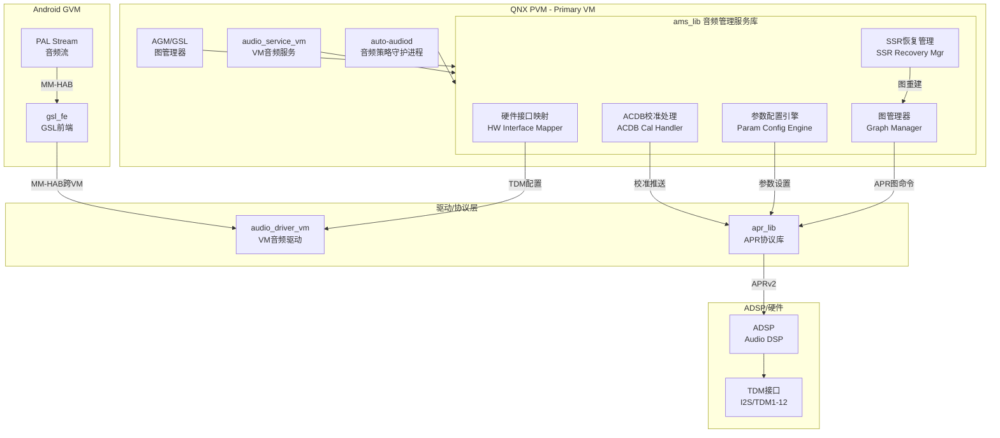

#### 16.18.2.1 内部模块职责

| 模块 | 核心职责 | 关键API |
|------|----------|---------|
| Graph Manager | DSP图的创建/销毁/启停/参数管理 | ams_graph_open/close/start/stop/set_param/get_param |
| HW Interface Mapper | TDM/I2S/PDM接口的打开/关闭/绑定 | ams_hw_interface_open/close/connect/disconnect |
| Param Config Engine | 图参数的构建与下发（音量/路由/校准/格式） | 内部辅助函数，被set_param调用 |
| ACDB Cal Handler | 从ACDB获取校准数据并推送到Graph | 配合acdb-loader使用 |
| SSR Recovery Mgr | ADSP SSR后的图状态恢复 | 内部SSR事件处理 |

### 16.18.3 关键数据结构

#### 16.18.3.1 ams_graph_basic_params_t — 图基本参数

```c
typedef struct {
    uint32_t processor_id;   // 目标DSP处理器ID
    uint32_t sample_rate;    // 采样率
    uint32_t block_size;     // 块大小（每处理周期的采样数）
    uint32_t flags;          // 图标志位
} ams_graph_basic_params_t;
```

**完整字段解析与典型值**：

| 字段 | 说明 | 典型值 | 备注 |
|------|------|--------|------|
| processor_id | 目标DSP处理器标识 | ADSP_ID=0, MDSP_ID=1 | SA8295主要使用ADSP |
| sample_rate | 图的采样率（Hz） | 48000, 96000, 192000, 16000, 8000 | 48kHz为最常见值 |
| block_size | 每帧采样数，决定延迟 | 192, 384, 480, 960, 1024, 2048 | 值越小延迟越低，CPU负载越高 |
| flags | 图属性标志位 | 0=默认, bit0=低延迟, bit1=安全图 | 安全图标志保证资源隔离 |

**block_size与延迟对应关系**：

| block_size | 采样率48kHz时延迟 | 适用场景 |
|------------|-------------------|----------|
| 192 | 4ms | 超低延迟（ADAS告警、语音识别） |
| 384 | 8ms | 低延迟（语音通话、主动降噪） |
| 480 | 10ms | 标准延迟（媒体播放、导航提示） |
| 960 | 20ms | 常规延迟（音乐播放） |
| 1024 | 21.3ms | 通用场景 |
| 2048 | 42.7ms | 非实时场景（离线处理） |

#### 16.18.3.2 ams_graph_handle_t — 图句柄

```c
typedef uint32_t ams_graph_handle_t;

#define AMS_GRAPH_HANDLE_INVALID  0xFFFFFFFF
#define AMS_GRAPH_HANDLE_SAFE_OFFSET  0x80000000  // 安全图句柄偏移
```

图句柄是ams_lib管理DSP图实例的不透明标识。安全图句柄的最高位为1，与Android图句柄隔离。

| 句柄范围 | 用途 | 说明 |
|----------|------|------|
| 0x00000001 ~ 0x7FFFFFFF | Android图实例 | 由gsl_vm_be请求创建 |
| 0x80000001 ~ 0xFFFFFFFE | 安全音频图实例 | 由auto-audiod独立创建 |
| 0xFFFFFFFF | 无效句柄 | 用于错误标识 |

#### 16.18.3.3 ams_hw_interface_id_t — 硬件接口枚举

```c
typedef enum {
    AMS_HW_IF_TDM1  = 0,
    AMS_HW_IF_TDM2  = 1,
    AMS_HW_IF_TDM3  = 2,
    AMS_HW_IF_TDM4  = 3,
    AMS_HW_IF_TDM5  = 4,
    AMS_HW_IF_TDM6  = 5,
    AMS_HW_IF_TDM7  = 6,
    AMS_HW_IF_TDM8  = 7,
    AMS_HW_IF_TDM9  = 8,
    AMS_HW_IF_TDM10 = 9,
    AMS_HW_IF_TDM11 = 10,
    AMS_HW_IF_TDM12 = 11,
    AMS_HW_IF_MI2S_RX = 12,
    AMS_HW_IF_MI2S_TX = 13,
    AMS_HW_IF_PDM_TX  = 14,
    AMS_HW_IF_MAX
} ams_hw_interface_id_t;
```

#### 16.18.3.4 ams_hw_interface_config_t — 硬件接口配置

```c
typedef struct {
    ams_hw_interface_id_t id;     // 接口ID
    uint32_t direction;            // 0=TX(输出), 1=RX(输入)
    uint32_t sample_rate;          // 采样率
    uint32_t bit_width;            // 位宽 (16/24/32)
    uint32_t num_channels;         // 通道数
    uint32_t data_format;          // 数据格式 (I2S/LPCM/COMP)
    uint32_t sync_clk_src;         // 同步时钟源
    uint32_t sync_clk_freq;        // 同步时钟频率(Hz)
} ams_hw_interface_config_t;
```

**TDM接口配置参数详解**：

| 参数 | 说明 | 典型值 |
|------|------|--------|
| direction | 数据流方向 | 0=TX(Playback), 1=RX(Capture) |
| sample_rate | 接口采样率 | 48000, 96000, 192000 |
| bit_width | 每采样位宽 | 16(标准), 24(高品质), 32(原始) |
| num_channels | 通道数 | 2(立体声), 4(四声道), 6(5.1), 8(7.1) |
| data_format | TDM数据格式 | 0=I2S, 1=LPCM, 2=Compressed |
| sync_clk_src | BCLK/WCLK时钟源 | 0=Internal, 1=External |
| sync_clk_freq | MCLK频率 | 12288000, 24576000 |

#### 16.18.3.5 ams_init_params_t — AMS初始化参数

```c
typedef struct {
    int driver_fd;                    // audio_driver_vm设备文件描述符
    void *apr_handle;                 // APR协议库句柄
    uint32_t hw_intf_count;           // 硬件接口数量
    ams_hw_intf_entry_t *hw_intf_table; // 硬件接口注册表
    ams_event_cb_t event_cb;          // 事件回调函数
    void *event_cb_cookie;            // 事件回调Cookie
} ams_init_params_t;
```

此结构由audio_service_vm的coreinit Step3构建，传入driver_fd和apr_handle，实现ams_lib与底层驱动的连接。

### 16.18.4 核心API详解

#### 16.18.4.1 图管理API

| API | 签名 | 说明 | 返回值 |
|-----|------|------|--------|
| ams_graph_open | `int ams_graph_open(ams_graph_basic_params_t *params, ams_graph_handle_t *handle)` | 创建DSP图 | 0成功，负数为错误码 |
| ams_graph_close | `int ams_graph_close(ams_graph_handle_t handle)` | 销毁DSP图，释放资源 | 0成功 |
| ams_graph_start | `int ams_graph_start(ams_graph_handle_t handle)` | 启动图处理（数据流开始流动） | 0成功 |
| ams_graph_stop | `int ams_graph_stop(ams_graph_handle_t handle)` | 停止图处理 | 0成功 |
| ams_graph_set_param | `int ams_graph_set_param(ams_graph_handle_t handle, uint32_t param_id, void *payload, uint32_t payload_size)` | 设置图参数 | 0成功 |
| ams_graph_get_param | `int ams_graph_get_param(ams_graph_handle_t handle, uint32_t param_id, void *payload, uint32_t *payload_size)` | 获取图参数 | 0成功 |

**ams_graph_open 详解**：

```c
int ams_graph_open(ams_graph_basic_params_t *params, ams_graph_handle_t *handle)
{
    // 1. 参数校验
    if (!params || !handle) return -EINVAL;
    if (params->sample_rate == 0 || params->block_size == 0) return -EINVAL;

    // 2. 分配图上下文
    graph_ctx_t *ctx = calloc(1, sizeof(graph_ctx_t));
    if (!ctx) return -ENOMEM;

    // 3. 复制参数
    memcpy(&ctx->basic_params, params, sizeof(*params));

    // 4. 构建APR图打开命令
    struct apr_graph_open_cmd cmd;
    cmd.hdr.dest_domain = APR_DOMAIN_ADSP;
    cmd.hdr.opcode = APR_OPCODE_GRAPH_OPEN;
    cmd.processor_id = params->processor_id;
    cmd.sample_rate = params->sample_rate;
    cmd.block_size = params->block_size;
    cmd.flags = params->flags;

    // 5. 通过APR发送到ADSP
    int ret = apr_send_sync(apr_handle, &cmd, sizeof(cmd), &rsp, &rsp_size);
    if (ret < 0) {
        free(ctx);
        return ret;
    }

    // 6. 保存图句柄
    ctx->graph_handle = rsp.graph_handle;
    *handle = ctx->graph_handle;

    // 7. 加入图管理列表
    pthread_mutex_lock(&graph_list_lock);
    list_add_tail(&graph_list, &ctx->node);
    pthread_mutex_unlock(&graph_list_lock);

    return 0;
}
```

**ams_graph_set_param 参数类型详解**：

| param_id | 参数类型 | payload结构 | 典型场景 |
|----------|----------|-------------|----------|
| AMS_PARAM_VOLUME | 音量控制 | `{uint32_t channel; float gain_db;}` | 音量调节、静音 |
| AMS_PARAM_ROUTING | 路由控制 | `{uint32_t src_module; uint32_t dst_module;}` | 音频路由切换 |
| AMS_PARAM_CALIBRATION | ACDB校准 | `{uint32_t cal_type; void *cal_data; size_t cal_size;}` | 校准数据推送 |
| AMS_PARAM_MEDIA_FORMAT | 媒体格式 | `{uint32_t format; uint32_t sr; uint32_t ch; uint32_t bw;}` | 格式切换 |
| AMS_PARAM_DEVICE_PP | 设备后处理 | `{uint32_t pp_id; void *pp_params;}` | 均衡器/压缩器配置 |
| AMS_PARAM_CUSTOM | 自定义参数 | `{uint32_t tag; void *data; size_t size;}` | OEM扩展参数 |

#### 16.18.4.2 硬件接口管理API

| API | 签名 | 说明 |
|-----|------|------|
| ams_hw_interface_open | `int ams_hw_interface_open(ams_hw_interface_id_t id, ams_hw_interface_config_t *config)` | 打开TDM/MI2S/PDM接口 |
| ams_hw_interface_close | `int ams_hw_interface_close(ams_hw_interface_id_t id)` | 关闭硬件接口 |
| ams_hw_interface_connect | `int ams_hw_interface_connect(ams_hw_interface_id_t id, ams_graph_handle_t handle)` | 将接口绑定到指定Graph |
| ams_hw_interface_disconnect | `int ams_hw_interface_disconnect(ams_hw_interface_id_t id, ams_graph_handle_t handle)` | 断开接口与Graph的绑定 |

**ams_hw_interface_open 执行流程**：

```c
int ams_hw_interface_open(ams_hw_interface_id_t id, ams_hw_interface_config_t *config)
{
    // 1. 接口ID范围检查
    if (id >= AMS_HW_IF_MAX) return -EINVAL;

    // 2. 检查接口是否已打开
    if (hw_intf_table[id].is_opened) return -EBUSY;

    // 3. 构建AFE端口打开命令
    struct afe_port_open_cmd cmd;
    cmd.port_id = hw_intf_to_afe_port(id);  // TDM1→AFE_PORT_ID_TDM_1_RX等
    cmd.sample_rate = config->sample_rate;
    cmd.bit_width = config->bit_width;
    cmd.num_channels = config->num_channels;
    cmd.data_format = config->data_format;

    // 4. 通过APR发送AFE端口打开命令
    int ret = apr_send_sync(apr_handle, &cmd, sizeof(cmd), &rsp, &rsp_size);
    if (ret < 0) return ret;

    // 5. 更新接口状态
    hw_intf_table[id].is_opened = true;
    hw_intf_table[id].afe_port = cmd.port_id;
    memcpy(&hw_intf_table[id].config, config, sizeof(*config));

    return 0;
}
```

#### 16.18.4.3 AMS初始化/事件API

| API | 签名 | 说明 |
|-----|------|------|
| ams_init | `int ams_init(ams_init_params_t *params)` | 初始化AMS，注册硬件接口 |
| ams_deinit | `int ams_deinit(void)` | 反初始化，释放所有资源 |
| ams_register_event_cb | `int ams_register_event_cb(ams_event_cb_t cb, void *cookie)` | 注册事件回调 |
| ams_register_hw_intf | `int ams_register_hw_intf(ams_hw_intf_entry_t *entry)` | 注册硬件接口到AMS |

**AMS事件类型**：

| 事件 | 触发条件 | 处理方式 |
|------|----------|----------|
| AMS_EVENT_GRAPH_OPENED | ADSP图创建完成 | 更新本地图状态 |
| AMS_EVENT_GRAPH_CLOSED | ADSP图销毁完成 | 清理本地图上下文 |
| AMS_EVENT_GRAPH_ERROR | 图运行时错误 | 根据错误类型决定重试或上报 |
| AMS_EVENT_SSR_DOWN | ADSP子系统重启开始 | 标记所有图为SUSPENDED |
| AMS_EVENT_SSR_UP | ADSP子系统重启完成 | 触发图重建流程 |
| AMS_EVENT_HW_INTF_READY | 硬件接口就绪 | 更新接口可用状态 |
| AMS_EVENT_HW_INTF_ERROR | 硬件接口错误 | 关闭接口并尝试重开 |

### 16.18.5 图管理完整生命周期

#### 16.18.5.1 生命周期状态机

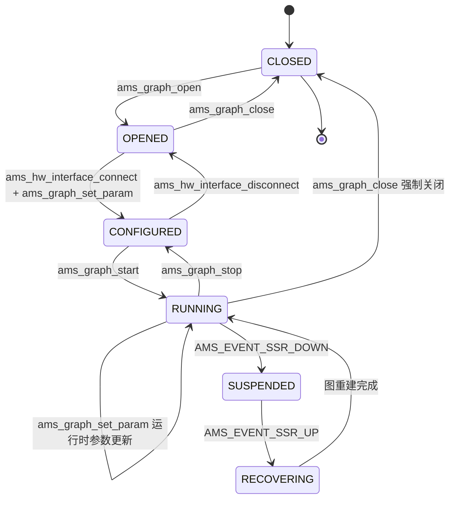

**图状态说明**：

| 状态 | 说明 | 允许的操作 |
|------|------|------------|
| CLOSED | 图未创建，初始状态 | ams_graph_open |
| OPENED | 图已在ADSP创建，未连接硬件接口 | ams_hw_interface_connect, ams_graph_close |
| CONFIGURED | 硬件接口已连接，参数已配置 | ams_graph_start, ams_hw_interface_disconnect, ams_graph_set_param |
| RUNNING | 图正在ADSP上运行，数据流流动 | ams_graph_stop, ams_graph_set_param, ams_graph_close |
| SUSPENDED | ADSP SSR导致图中断 | 等待SSR_UP事件 |
| RECOVERING | SSR后图正在重建 | 等待重建完成 |

#### 16.18.5.2 图创建到运行完整时序

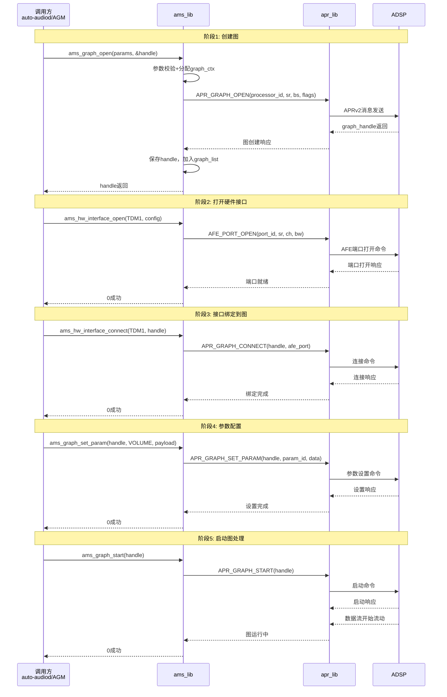

#### 16.18.5.3 图停止与销毁时序

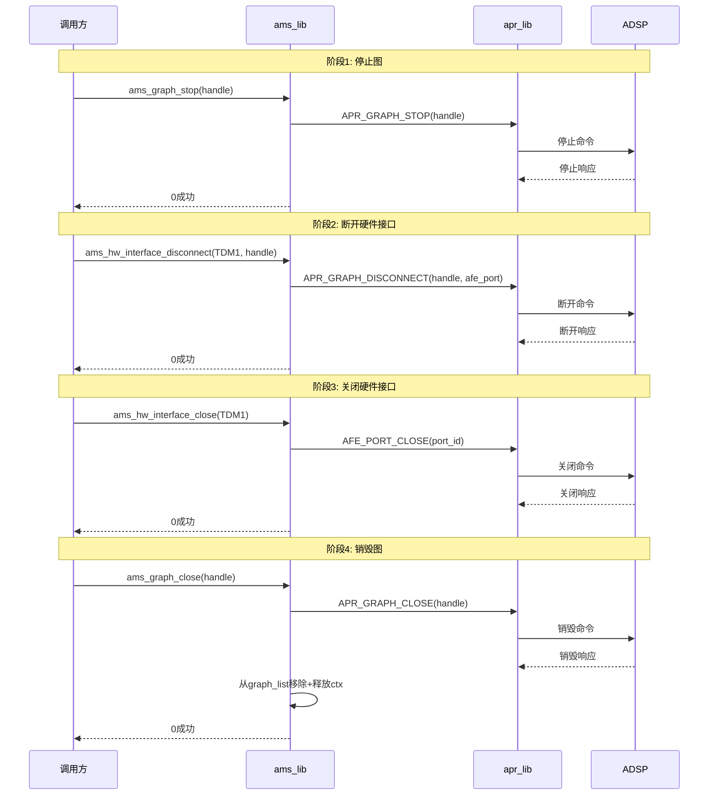

### 16.18.6 TDM接口映射详解

#### 16.18.6.1 SA8295 TDM接口完整映射表

| TDM接口 | 枚举值 | 典型用途 | 方向 | 通道数 | 采样率 | AFE Port ID | 安全音频 |
|---------|--------|----------|------|--------|--------|-------------|----------|
| TDM1 | AMS_HW_IF_TDM1 | 主扬声器 FL/FR | TX(输出) | 2 | 48kHz | 0x9001 | 否 |
| TDM2 | AMS_HW_IF_TDM2 | 后扬声器 RL/RR | TX(输出) | 2 | 48kHz | 0x9002 | 否 |
| TDM3 | AMS_HW_IF_TDM3 | 中置/低音 | TX(输出) | 2 | 48kHz | 0x9003 | 否 |
| TDM4 | AMS_HW_IF_TDM4 | HUD/仪表盘 | TX(输出) | 2 | 48kHz | 0x9004 | 是 |
| TDM5 | AMS_HW_IF_TDM5 | 麦克风阵列 | RX(输入) | 4-8 | 48/96kHz | 0x9005 | 否 |
| TDM6 | AMS_HW_IF_TDM6 | A2B总线音频 | 双向 | 4-8 | 48kHz | 0x9006 | 是 |
| TDM7 | AMS_HW_IF_TDM7 | 第三区耳机 | TX(输出) | 2 | 48kHz | 0x9007 | 否 |
| TDM8 | AMS_HW_IF_TDM8 | 蓝牙语音 | 双向 | 1 | 8/16kHz | 0x9008 | 否 |
| TDM9 | AMS_HW_IF_TDM9 | ADAS告警输出 | TX(输出) | 2 | 48kHz | 0x9009 | 是 |
| TDM10 | AMS_HW_IF_TDM10 | 倒车雷达音频 | TX(输出) | 1 | 16kHz | 0x900A | 是 |
| TDM11 | AMS_HW_IF_TDM11 | 紧急告警eCall | TX(输出) | 1 | 8kHz | 0x900B | 是 |
| TDM12 | AMS_HW_IF_TDM12 | 预留扩展 | - | - | - | 0x900C | - |

**安全音频TDM接口**（TDM4/TDM6/TDM9/TDM10/TDM11）由QNX独立管理，即使Android GVM崩溃也能保证安全音频输出。

#### 16.18.6.2 TDM接口与Graph绑定关系

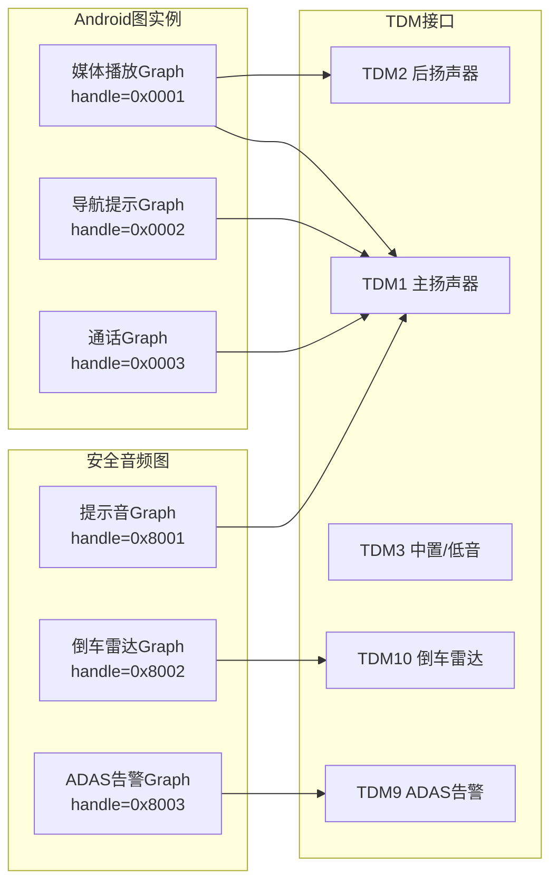

**绑定规则**：

| 规则 | 说明 |
|------|------|
| 单接口多图 | 同一TDM接口可被多个Graph连接（如TDM1连接媒体+导航+通话+提示音） |
| ADSP混音 | ADSP内部负责多路音频混合后输出到同一TDM |
| 安全优先 | 安全图绑定的TDM接口在VAPM仲裁时获得更高优先级 |
| 图隔离 | 安全图句柄(0x8xxxxxxx)与Android图句柄(0x0xxxxxxx)在ADSP中完全隔离 |

### 16.18.7 图参数配置深度解析

#### 16.18.7.1 ACDB校准数据推送流程

ACDB校准数据是ADSP正确处理音频信号的基础，包含各音频设备的增益、滤波器系数、延迟补偿等参数。校准数据通过ams_graph_set_param推送到Graph中的各模块。

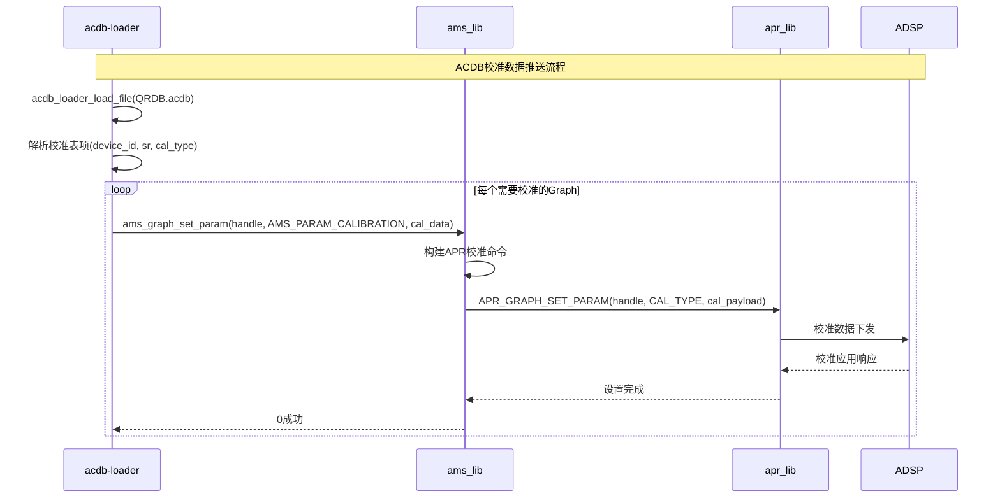

**校准数据类型**：

| 校准类型 | cal_type值 | 说明 | 推送时机 |
|----------|-----------|------|----------|
| APM_CAL | 0x00000001 | 音频处理器模块校准 | Graph打开后 |
| AFE_CAL | 0x00000002 | AFE（前端）校准 | 硬件接口打开后 |
| ASM_CAL | 0x00000003 | 音频流模块校准 | Graph启动前 |
| ADM_CAL | 0x00000004 | 音频设备模块校准 | 硬件接口连接后 |
| LSD_CAL | 0x00000005 | 唤醒词检测校准 | 语音识别图创建时 |
| CUSTOM_CAL | 0x0000FFFF | OEM自定义校准 | 按需 |

#### 16.18.7.2 音量参数配置

```c
// 音量设置示例
typedef struct {
    uint32_t channel_mask;    // 通道掩码 (0x03=FL/FR)
    float    gain_db;         // 增益(dB)，范围-120.0~+24.0
    uint32_t ramp_ms;        // 渐变时间(ms)，0=立即
} ams_volume_param_t;

// 调用示例：设置主扬声器音量为-10dB，100ms渐变
ams_volume_param_t vol = {
    .channel_mask = 0x03,  // FL/FR
    .gain_db = -10.0f,
    .ramp_ms = 100
};
ams_graph_set_param(graph_handle, AMS_PARAM_VOLUME, &vol, sizeof(vol));
```

**音量参数应用位置**：

| 应用位置 | 说明 | 场景 |
|----------|------|------|
| ADM输出增益 | ADSP设备输出增益 | 系统音量调节 |
| ASM流增益 | ADSP流级增益 | 单流音量控制 |
| AFE端口增益 | AFE硬件增益 | 硬件级增益微调 |

#### 16.18.7.3 路由参数配置

```c
// 路由设置示例
typedef struct {
    uint32_t src_module_id;    // 源模块ID (ASM)
    uint32_t src_instance_id;  // 源实例ID
    uint32_t dst_module_id;    // 目标模块ID (ADM)
    uint32_t dst_instance_id;  // 目标实例ID
    uint32_t route_id;         // 路由ID
} ams_routing_param_t;
```

路由参数定义了音频数据在ADSP图中的流向：ASM(流)→ADM(设备)→AFE(端口)。ams_lib将路由参数翻译为ADSP内部模块间的连接关系。

#### 16.18.7.4 媒体格式参数配置

```c
// 媒体格式设置示例
typedef struct {
    uint32_t format;          // PCM=0, AAC=1, MP3=2, SBC=3
    uint32_t sample_rate;     // 48000
    uint32_t num_channels;    // 2
    uint32_t bit_width;       // 16
    uint32_t endianness;      // 0=LE, 1=BE
} ams_media_format_param_t;
```

**格式切换场景**：

| 场景 | 变更项 | 处理流程 |
|------|--------|----------|
| 音乐48kHz→96kHz | sample_rate | graph_stop→set_param(MEDIA_FORMAT)→graph_start |
| 立体声→5.1 | num_channels | 需要graph_close→重新graph_open |
| PCM→压缩格式 | format | 需要重新创建图，插入解码模块 |

### 16.18.8 与AGM Service的交互关系

#### 16.18.8.1 层次关系

ams_lib是AGM（Audio Graph Manager）Service的底层接口库。AGM提供更高层的图管理抽象，而ams_lib负责将AGM的操作请求转化为ADSP可执行的APR命令。

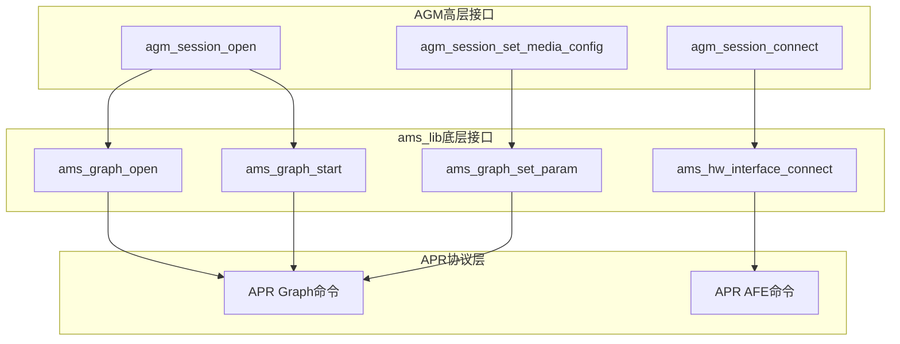

**AGM→ams_lib映射表**：

| AGM API | ams_lib调用 | 说明 |
|---------|-------------|------|
| agm_session_open | ams_graph_open + ams_hw_interface_open | 创建图并打开接口 |
| agm_session_close | ams_graph_close + ams_hw_interface_close | 销毁图并关闭接口 |
| agm_session_prepare | ams_hw_interface_connect + ams_graph_set_param(CAL) | 绑定接口并推送校准 |
| agm_session_start | ams_graph_start | 启动图处理 |
| agm_session_stop | ams_graph_stop | 停止图处理 |
| agm_session_set_vol | ams_graph_set_param(VOLUME) | 音量控制 |
| agm_session_set_media_config | ams_graph_set_param(MEDIA_FORMAT) | 格式配置 |

#### 16.18.8.2 多Graph并发管理

SA8295平台上可以同时运行多个Graph实例，ams_lib通过graph_list链表管理所有活跃的图实例。

```c
// ams_lib内部图管理结构
typedef struct graph_ctx {
    ams_graph_handle_t handle;           // 图句柄
    ams_graph_basic_params_t params;     // 图基本参数
    uint32_t state;                      // 当前状态
    uint32_t connected_hw_intfs;         // 已连接的硬件接口位图
    uint32_t ref_count;                  // 引用计数
    struct list_node node;               // 链表节点
} graph_ctx_t;

// 全局图管理链表
static struct list_head graph_list;
static pthread_mutex_t graph_list_lock = PTHREAD_MUTEX_INITIALIZER;
```

**并发Graph典型场景**：

| 场景 | 活跃Graph | TDM绑定 | 说明 |
|------|-----------|---------|------|
| 导航+媒体 | Graph_Nav + Graph_Media | 均连TDM1 | ADSP内部混音 |
| 通话中 | Graph_Call | TDM1+TDM8 | 双向音频 |
| 倒车+提示音 | Graph_PDC + Graph_Chim e | TDM10+TDM1 | 安全图独立输出 |
| 全功能 | Graph_Media + Graph_Nav + Graph_Call + Graph_PDC | TDM1/2/8/10 | 多图并发，ADSP混音 |

### 16.18.9 安全音频图管理

#### 16.18.9.1 安全音频图创建流程

安全音频图由QNX侧独立创建，不经过Android域，保证Android崩溃时安全音频通路不受影响。

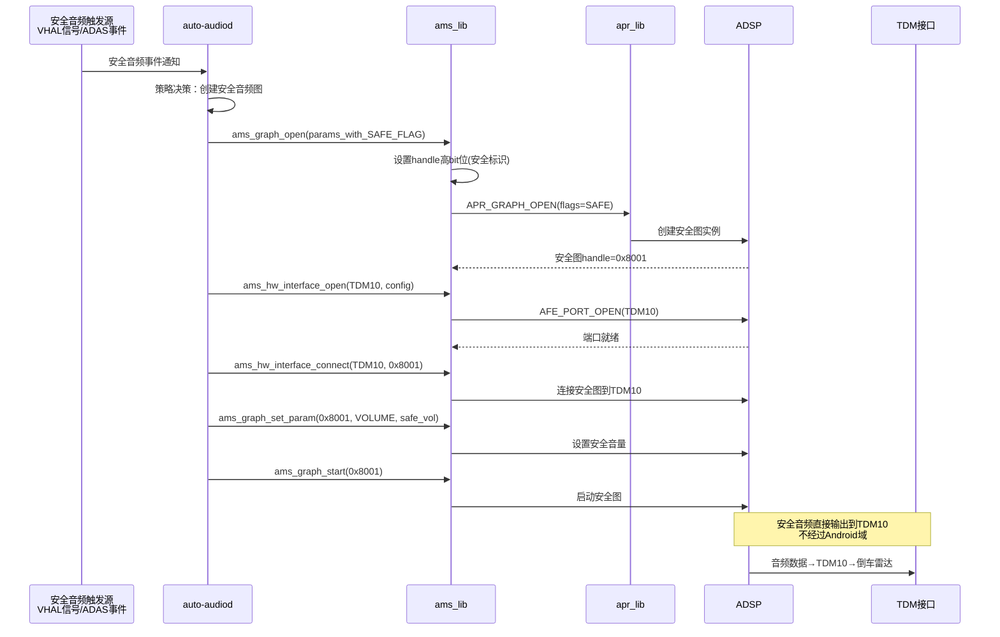

#### 16.18.9.2 安全图隔离保证机制

| 保证项 | 实现机制 | 效果 |
|--------|----------|------|
| 句柄隔离 | 安全图handle高bit=1，Android图handle高bit=0 | ADSP内部区分两类图 |
| TDM接口独立 | 安全图绑定独立TDM（TDM9/10/11） | 物理输出通道隔离 |
| VAPM优先级 | VAPM策略保证QNX图优先获得ADSP资源 | 资源冲突时安全图优先 |
| Android崩溃免疫 | 图实例在ADSP中，由QNX PVM管理 | GVM崩溃不影响安全图 |
| 独立参数空间 | 安全图的音量/路由/校准独立配置 | Android无法修改安全图参数 |

**VAPM优先级仲裁**：

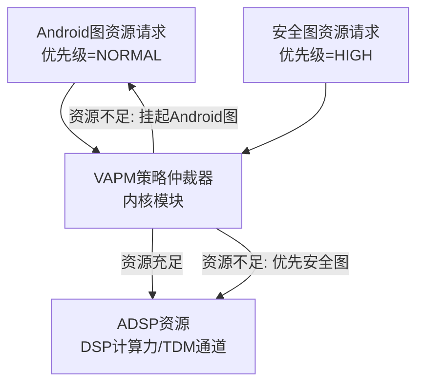

### 16.18.10 ADSP SSR恢复与图重建

#### 16.18.10.1 SSR事件处理流程

ADSP Subsystem Restart（SSR）是SA8295平台的异常恢复机制。当ADSP固件异常重启时，ams_lib需要重建所有活跃的Graph实例。

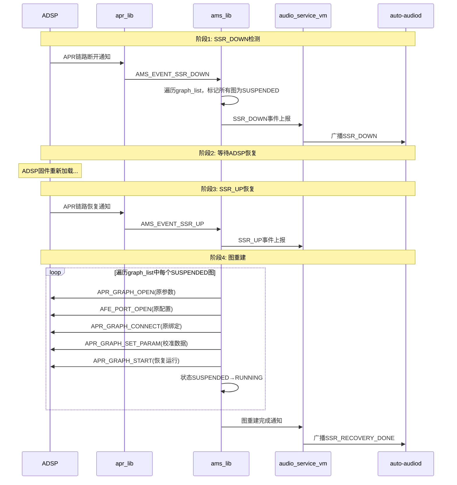

#### 16.18.10.2 SSR图重建策略

| 策略 | 说明 |
|------|------|
| 状态保存 | 每个graph_ctx保存完整的创建参数，SSR后用原参数重建 |
| 优先恢复安全图 | 安全音频图（倒车/ADAS）优先重建，确保安全功能最先恢复 |
| ACDB重新推送 | SSR后需重新推送ACDB校准数据到ADSP |
| 渐进恢复 | 按优先级依次恢复图，避免同时重建导致ADSP过载 |
| 失败重试 | 单个图重建失败时最多重试3次，仍失败则标记为ERROR |
| 降级运行 | 若ACDB文件不可用，使用fallback校准降级运行 |

**图重建优先级**：

| 优先级 | 图类型 | 恢复顺序 |
|--------|--------|----------|
| P0-最高 | 倒车雷达Graph | 第1批 |
| P0-最高 | ADAS告警Graph | 第1批 |
| P1-高 | eCall紧急呼叫Graph | 第2批 |
| P2-中 | 通话Graph | 第3批 |
| P3-低 | 导航提示Graph | 第4批 |
| P4-最低 | 媒体播放Graph | 第5批 |

### 16.18.11 Android域图请求完整处理链路

#### 16.18.11.1 从Android到ADSP的完整路径

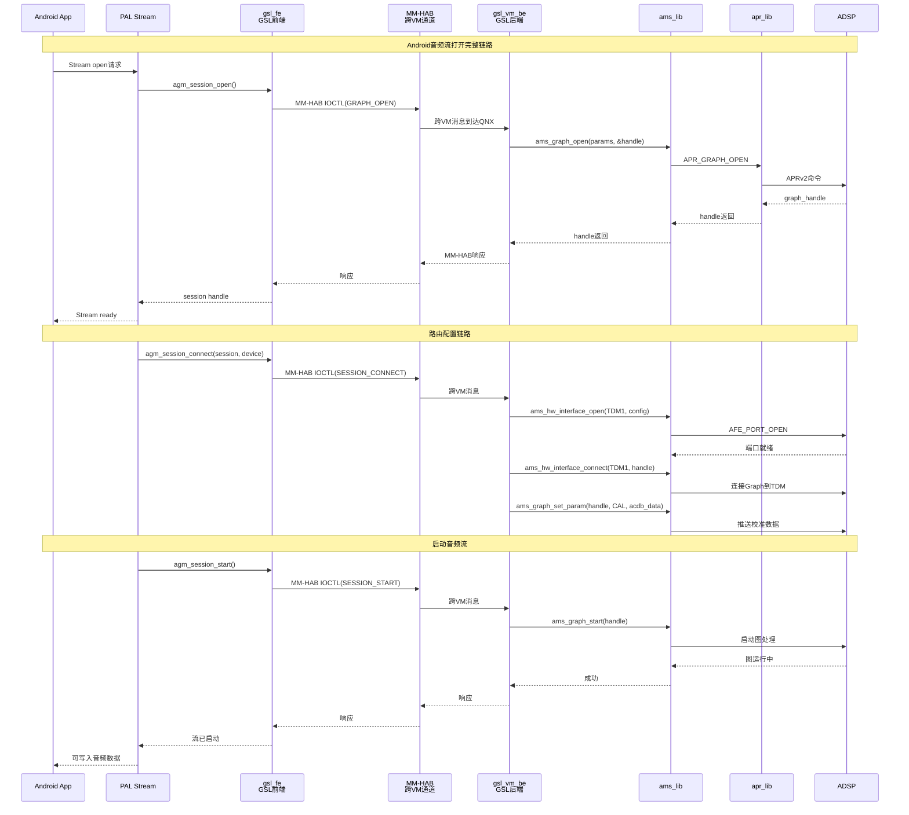

#### 16.18.11.2 关键中间数据结构

**gsl_fe→gsl_vm_be的MM-HAB消息格式**：

| 字段 | 类型 | 说明 |
|------|------|------|
| msg_type | uint32_t | 命令类型：GRAPH_OPEN/CLOSE/START/STOP/SET_PARAM |
| session_id | uint32_t | 会话标识 |
| graph_handle | uint32_t | 图句柄（响应时填充） |
| param_id | uint32_t | 参数ID（SET_PARAM时使用） |
| payload_size | uint32_t | 负载大小 |
| payload | uint8_t[] | 负载数据 |

### 16.18.12 与audio_driver_vm的交互

ams_lib不直接操作audio_driver_vm的设备节点，而是通过apr_lib发送APR协议消息。audio_driver_vm作为APR消息的内核态传输通道。

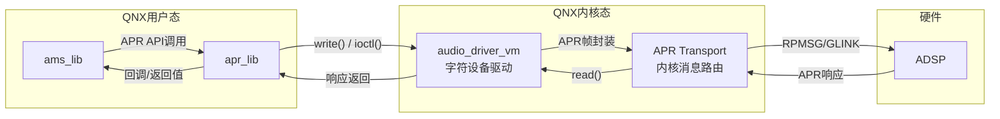

**交互接口**：

| 接口 | 说明 |
|------|------|
| open(/dev/snd/audio_driver_vm) | 打开驱动设备节点，获取fd |
| write(fd, apr_msg, len) | 发送APR命令到ADSP |
| read(fd, buf, len) | 读取ADSP响应 |
| ioctl(fd, APR_REGISTER_CB, &cb) | 注册APR事件回调 |
| ioctl(fd, APR_SET_SERVICE_ID, &svc) | 设置APR服务ID |
| poll(fd, POLLIN, timeout) | 等待ADSP异步事件 |

### 16.18.13 调试接口与日志

#### 16.18.13.1 日志级别与关键日志

ams_lib使用QNX的slog2日志框架，支持以下级别：

| 级别 | 宏 | 用途 |
|------|----|------|
| ERROR | AMS_LOGE | 不可恢复的错误 |
| WARN | AMS_LOGW | 可恢复的异常 |
| INFO | AMS_LOGI | 关键流程信息 |
| DEBUG | AMS_LOGD | 详细调试信息 |
| VERBOSE | AMS_LOGV | 极详细跟踪信息 |

**关键调试日志**：

```
// 图创建
AMS_LOGI("graph_open: handle=0x%x, processor=%d, sr=%d, bs=%d, flags=0x%x")
// 图启动
AMS_LOGI("graph_start: handle=0x%x, state=%d→RUNNING")
// 参数设置
AMS_LOGD("graph_set_param: handle=0x%x, param_id=0x%x, size=%d")
// 硬件接口
AMS_LOGI("hw_intf_open: id=%d, port=0x%x, sr=%d, ch=%d, bw=%d")
AMS_LOGI("hw_intf_connect: id=%d → graph=0x%x")
// SSR事件
AMS_LOGW("SSR_DOWN: marking %d graphs as SUSPENDED")
AMS_LOGI("SSR_UP: starting graph recovery, %d graphs to rebuild")
AMS_LOGI("graph_recovery: handle=0x%x rebuilt successfully (attempt %d)")
// 错误
AMS_LOGE("graph_open failed: ret=%d, processor=%d, sr=%d")
AMS_LOGE("apr_send_sync failed: opcode=0x%x, ret=%d")
```

#### 16.18.13.2 调试命令

| 命令 | 说明 |
|------|------|
| `slog2info -b | grep ams` | 实时查看ams_lib日志 |
| `slog2info -b | grep -E "graph_open|graph_start|graph_stop|graph_close"` | 图生命周期日志过滤 |
| `slog2info -b | grep -E "hw_intf_open|hw_intf_connect"` | 硬件接口操作日志 |
| `slog2info -b | grep SSR` | SSR事件日志 |
| `use ams_lib` | 查看库版本信息 |

#### 16.18.13.3 常见问题诊断

| 现象 | 可能原因 | 诊断方法 |
|------|----------|----------|
| ams_graph_open返回-ENODEV | ADSP未就绪 | 检查ADSP固件是否加载，slog2搜索ADSP ready |
| ams_graph_start返回-EIO | APR通信失败 | 检查audio_driver_vm设备节点是否正常 |
| 音频无声 | TDM未连接到Graph | 检查hw_intf_connect日志，确认绑定关系 |
| SSR后音频不恢复 | 图重建失败 | 检查SSR_UP后的graph_recovery日志 |
| 安全音频无输出 | 安全图未创建或TDM错误 | 检查安全图handle(0x8xxx)日志 |
| 音量设置无效 | param_id错误或payload格式错误 | 检查set_param日志中的param_id和size |

### 16.18.14 源码路径参考

```
vendor/qcom/proprietary/ams_lib/
├── inc/
│   └── ams.h                     # 音频管理服务公共头文件
├── src/
│   ├── ams_core.c                # AMS核心：初始化、事件循环、图列表管理
│   ├── ams_graph.c               # 图管理：open/close/start/stop/set_param/get_param
│   ├── ams_hw_interface.c        # 硬件接口：open/close/connect/disconnect
│   ├── ams_param.c               # 参数配置：参数构建、ACDB校准处理
│   ├── ams_apr_handler.c         # APR消息处理：命令构建、响应解析
│   ├── ams_ssr.c                 # SSR恢复：SSR事件处理、图重建
│   └── ams_debug.c               # 调试接口：状态转储、日志控制
├── config/
│   └── hw_intf_table.xml         # 硬件接口注册表配置
├── Makefile                      # QNX构建配置
└── README.md                     # 库使用说明
```

**关键源文件说明**：

| 源文件 | 行数(估) | 核心职责 |
|--------|----------|----------|
| ams.h | ~300 | 公共API声明、数据结构定义、错误码定义 |
| ams_core.c | ~800 | ams_init/deinit、全局状态管理、事件分发 |
| ams_graph.c | ~1200 | 6个图管理API的完整实现 |
| ams_hw_interface.c | ~600 | 4个硬件接口API的实现、TDM到AFE端口映射 |
| ams_param.c | ~500 | 参数序列化、校准数据处理 |
| ams_apr_handler.c | ~700 | APR命令构建、响应解析、超时处理 |
| ams_ssr.c | ~400 | SSR事件处理、图状态保存与恢复 |
| ams_debug.c | ~200 | 调试命令处理、状态信息转储 |

---

[← 上一个](16_16.17_QNX_audio_service_vm_VM音频服务.md) | [← 返回16章](README.md) | [返回导航](../README.md)