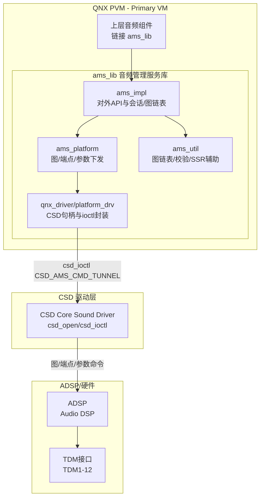
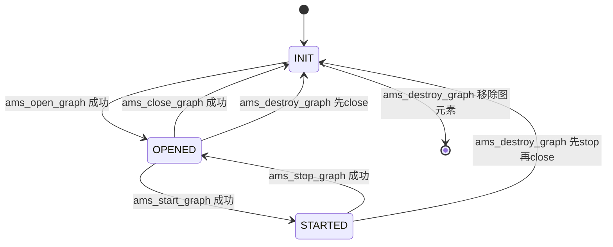
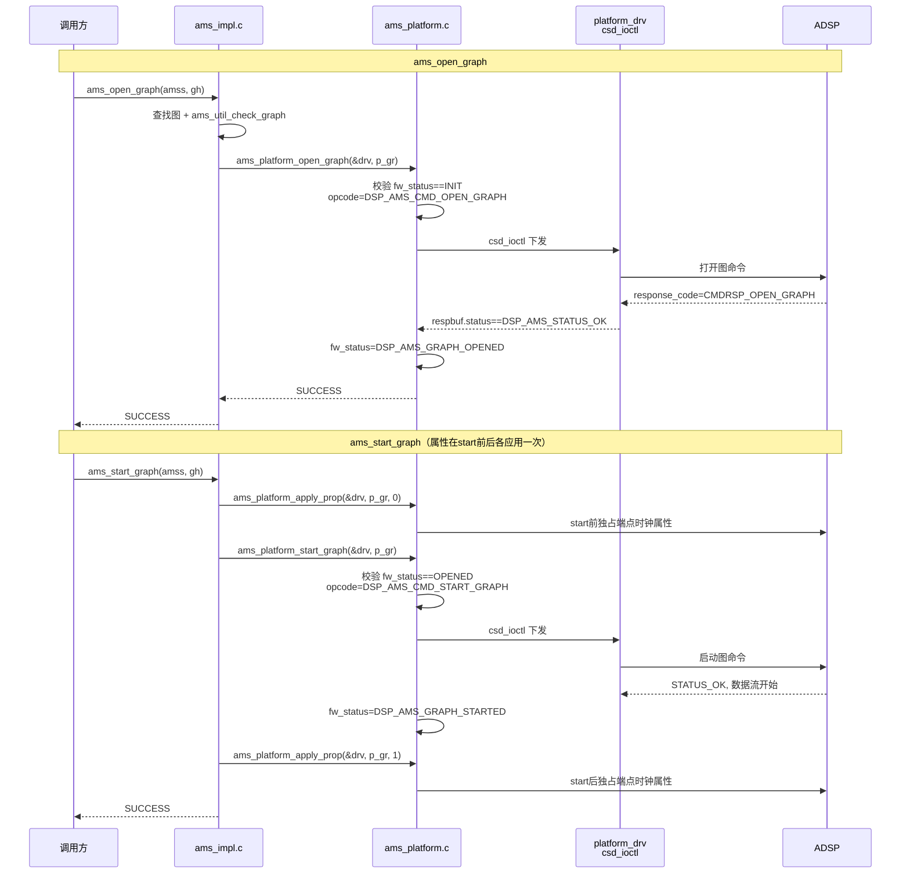
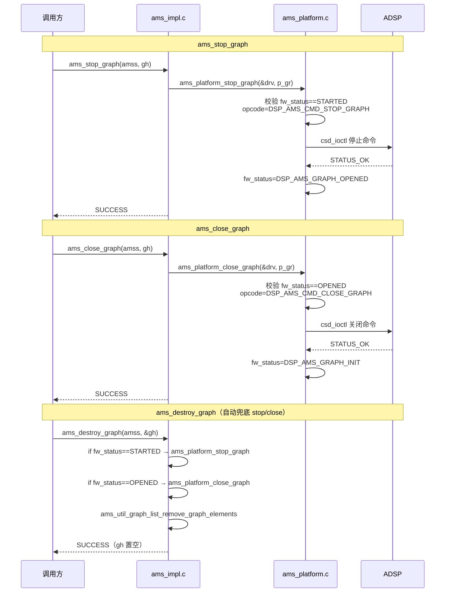
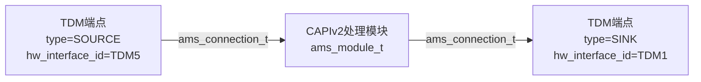
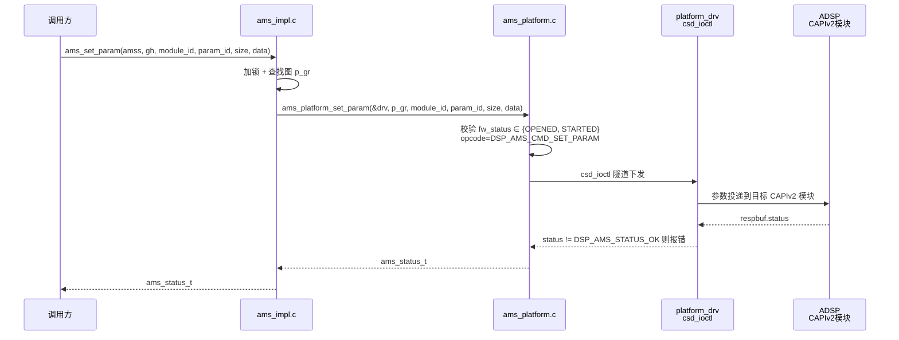
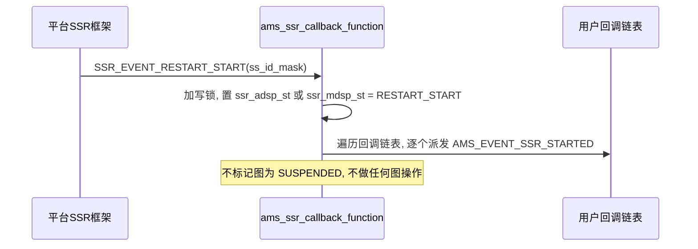
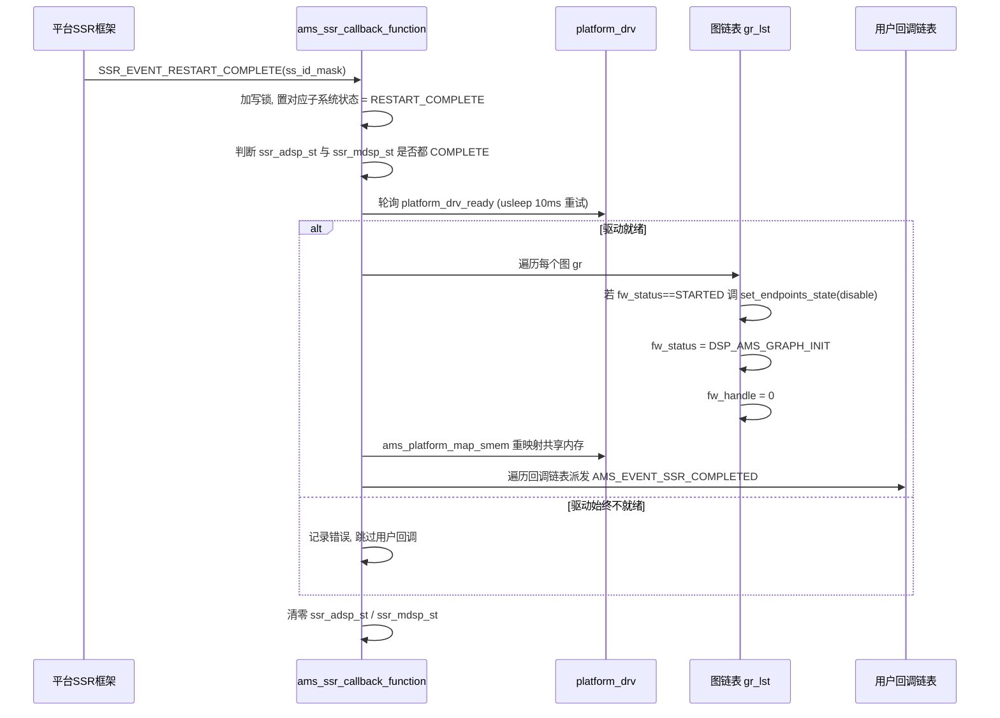
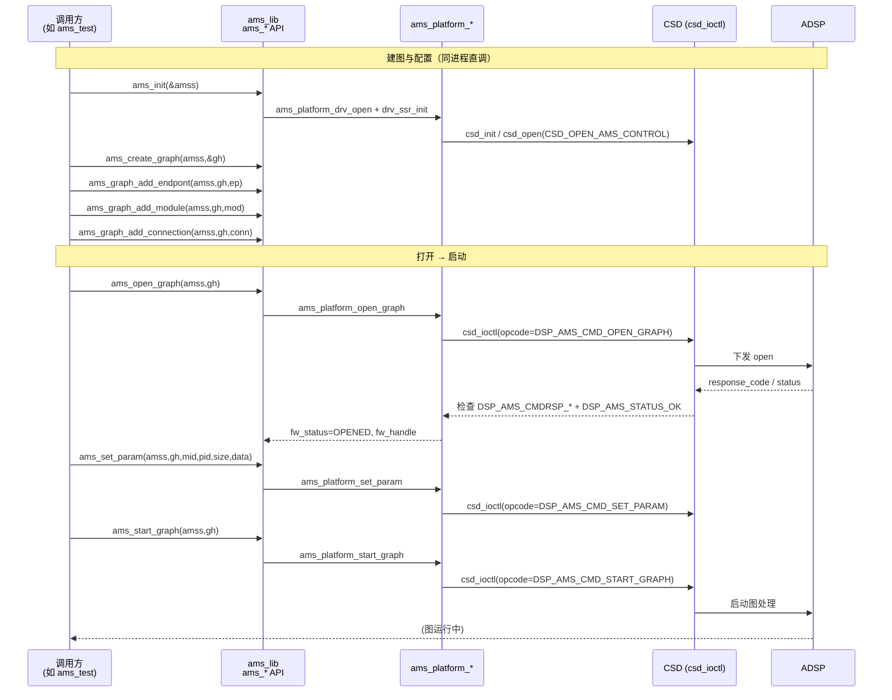
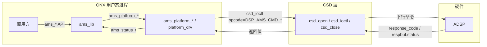

[← 上一个](16_16.17_QNX_audio_service_vm_VM音频服务.md) | [← 返回16章](README.md) | [返回导航](../README.md)

---

## 16.18 ams_lib — QNX音频管理服务库

> **架构归属说明**：`ams_lib` 属于 SA8295 QNX 侧 `audio_elite/`（Elite 架构）组件。SA8295 另有 `audio_ar/`（AudioReach 架构，对应 `amfs2_lib`/`audio_reach`/`avmm_lib`/`gsl_be`），由板级配置 `adp_8295` vs `adp_8295_ar` 选择。详见 [16.16 架构归属说明](16_16.16_QNX_audio_driver_vm_VM音频驱动层.md)。


### 16.18.1 概述

`ams_lib`（Audio Management Service Library）是SA8295 QNX域中的**音频管理核心共享库**，提供DSP图（Graph）的构建与生命周期管理，以及硬件接口（TDM）端点配置的编程接口。它以「端点(endpoint) + 模块(module) + 连接(connection)」的图模型描述音频拓扑，并通过 CSD ioctl 隧道将图操作下发到 ADSP 执行。

> **源码说明**：基于本地源码 `Qnx/apps/qnx_ap/AMSS/multimedia/audio/audio_elite/audio_driver/ams_lib/`（inc/ams.h、src/ams_impl.c/ams_platform.c/ams_util.c）：
> - **下发机制**：真实路径是 `csd_open(CSD_OPEN_AMS_CONTROL)` 获取句柄 + `csd_ioctl(h, CSD_AMS_CMD_TUNNEL/ENABLE_ENDPOINT/DISABLE_ENDPOINT/SET_CLK_ATTR, ...)`（见 `src/qnx_driver/platform_drv.c`）。aprv2_msg_if.h 仅提供消息格式定义，ams_lib 不直接调用独立的 apr_lib。
> - **无安全音频图/倒车雷达/ADAS/eCall 实现**：全文件 grep `safety/secure/ADAS` 无任何逻辑实现（仅版权声明与结构体注释中的 reserved 字段）。
> - **无 MM-HAB / VAPM 相关代码**：ams_lib 不感知 Android GVM 域，也无 VAPM 仲裁逻辑。

**架构定位**：

| 维度 | 说明 |
|------|------|
| 层级 | QNX音频栈中间层（共享库） |
| 运行域 | QNX PVM（Primary VM） |
| 库类型 | 共享库，被上层音频组件链接使用 |
| 核心职责 | DSP图构建与生命周期管理、TDM端点配置、图参数下发、ADSP SSR回调处理 |
| 下发机制 | 通过 CSD（Core Sound Driver）ioctl 隧道下发到 ADSP，非 APR 直连 |
| SSR处理 | 注册 `ssr_register_callback_events`（LPASS+MODEM），处理 ADSP/MDSP 子系统重启 |
| 主要头文件 | `inc/ams.h`（对外 API 与数据结构全集） |

**与其他QNX组件的关系**：

| 组件 | 交互方式 | 说明 |
|------|----------|------|
| 上层音频服务 | 链接调用 | 上层通过 ams_lib 对外 API 构建并操作 DSP 图 |
| CSD（Core Sound Driver） | ioctl隧道 | ams_lib 经 `csd_open`/`csd_ioctl` 下发图/端点/时钟命令到 ADSP |
| SSR框架 | 回调注册 | 经 `ssr_register_callback_events` 监听 LPASS/MODEM 重启事件 |
| ADSP | 间接执行 | 图/端点/参数命令最终由 ADSP 固件执行 |

### 16.18.2 架构总览



#### 16.18.2.1 内部模块职责

| 源文件 | 核心职责 | 关键符号 |
|------|----------|---------|
| `src/ams_impl.c` | 对外 API 实现、会话与图链表管理、SSR 回调 | `ams_init`/`ams_deinit`/`ams_create_graph`/`ams_open_graph`/`ams_ssr_callback_function` |
| `src/ams_platform.c` | 将图/端点/参数封装为 CSD 隧道命令并下发 | `ams_platform_open_graph`/`ams_platform_start_graph`/`ams_platform_set_param` |
| `src/ams_util.c` | 图链表增删查、参数校验、SSR 辅助 | `ams_util_graph_list_find_graph`/`ams_util_check_graph`/`ams_util_check_endpoint_param` |
| `src/qnx_driver/platform_drv.c` | CSD 句柄打开、ioctl 封装、共享内存、SSR 注册 | `ams_platform_drv_open`(csd_open)/`ams_platform_drv_ioctl`(csd_ioctl)/`ams_platform_drv_ssr_init` |

### 16.18.3 关键数据结构

> 本节所有结构体/枚举均出自真实源码 `ams_lib/inc/ams.h`（593 行），已逐字段核实。

#### 16.18.3.1 ams_graph_basic_params_t — 图基本参数

```c
typedef struct ams_graph_basic_params
{
    uint32_t processor_id;
    /**< processor ID:0 for modem DSP. */
    uint32_t sample_rate;
    /**< sample rate in Hz. */
    uint32_t block_size;
    /**< number of samples per processing block.*/
    uint32_t flags;
    /**< reserved */
} ams_graph_basic_params_t;
```

| 字段 | 源码注释 | 说明 |
|------|----------|------|
| processor_id | processor ID:0 for modem DSP | 目标 DSP 处理器标识 |
| sample_rate | sample rate in Hz | 采样率（Hz） |
| block_size | number of samples per processing block | 每处理块采样数 |
| flags | reserved | 保留字段 |

由 `ams_create_graph(amss, ams_graph_basic_params_t *p, ams_graph_handle_t *gh)` 传入。

#### 16.18.3.2 ams_graph_handle_t / ams_session_t — 不透明句柄

```c
typedef void *ams_graph_handle_t;
typedef struct ams_session *ams_session_t;
```

图句柄与会话句柄均为不透明指针，由 ams_lib 内部管理。

> **源码说明**：`ams_graph_handle_t` 真实为 `void*`，无安全图/Android 图句柄区间划分，无 `AMS_GRAPH_HANDLE_INVALID` 宏。

#### 16.18.3.3 ams_hw_interface_id_t — 硬件接口枚举

```c
typedef enum
{
    AMS_HW_INTERFACE_TDM1 = 1,
    AMS_HW_INTERFACE_TDM2,
    AMS_HW_INTERFACE_TDM3,
    AMS_HW_INTERFACE_TDM4,
    AMS_HW_INTERFACE_TDM5,
    AMS_HW_INTERFACE_TDM6,   /* senary */
    AMS_HW_INTERFACE_TDM7,   /* SEPTENARY */
    AMS_HW_INTERFACE_TDM8,   /* High Speed Interface 0 */
    AMS_HW_INTERFACE_TDM9,   /* High Speed Interface 1 */
    AMS_HW_INTERFACE_TDM10,  /* High Speed Interface 2 */
    AMS_HW_INTERFACE_TDM11,  /* High Speed Interface 3 */
    AMS_HW_INTERFACE_TDM12,  /* High Speed Interface 4 */
    AMS_HW_INTERFACE_MAX,
} ams_hw_interface_id_t;
```

> **源码说明**：真实枚举**从 `TDM1 = 1` 起**，且**只有 TDM1~TDM12**，源码中**不存在** `MI2S_RX/MI2S_TX/PDM_TX`。TDM8~TDM12 在源码注释中标记为 High Speed Interface 0~4。

#### 16.18.3.4 ams_endpoint_t — 端点（含 tdm_params）

```c
typedef enum { AMS_ENDPOINT_TYPE_SOURCE = 0, AMS_ENDPOINT_TYPE_SINK } ams_endpoint_type_t;

#define AMS_ENDPOINT_EXCLUSIVE (0)
#define AMS_ENDPOINT_SHARED_WITH_ADSP_OUTPUT (1)
#define AMS_ENDPOINT_SHARED_WITH_ADSP_INPUT (2)

typedef struct ams_endpoint
{
    uint32_t id;                 /**< User-assigned unique identifier. */
    ams_endpoint_type_t type;    /**< SOURCE / SINK */
    uint32_t channel_mask;       /**< Channel enablement mask. */
    uint16_t channel_type[32];   /**< Channel type as defined by 80-NF775-1. */
    uint32_t q_factor;           /**< Number of fractional bits in sample. */
    uint32_t flags;              /**< EXCLUSIVE / SHARED_WITH_ADSP_* */
    struct
    {
        ams_hw_interface_id_t hw_interface_id;
        uint8_t  num_channels;   /**< enabled slots for the TDM frame. */
        uint8_t  bit_width;
        uint16_t data_format;    /**< AMS_TDM_LINEAR_PCM_DATA */
        uint16_t sync_mode;      /**< SHORT_SYNC_BIT / LONG_SYNC / SHORT_SYNC_SLOT */
        uint16_t sync_src;       /**< SYNC_SRC_EXTERNAL / INTERNAL */
        uint16_t nslots_per_frame;
        uint16_t ctrl_data_out_enable;
        uint16_t ctrl_invert_sync_pulse;
        uint16_t ctrl_sync_data_delay;
        uint16_t slot_width;     /**< 16, 24, 32 */
        uint32_t slot_mask;      /**< Position of active slots. */
    } tdm_params;
} ams_endpoint_t;
```

端点 `flags` 的三种取值（EXCLUSIVE / SHARED_WITH_ADSP_OUTPUT / SHARED_WITH_ADSP_INPUT）决定 TDM 接口是独占还是与 ADSP 共享。

#### 16.18.3.5 ams_module_t — 处理模块

```c
#define AMS_INLINE_PROCESSING_MODE   (0)   /* DMA IST 上下文处理 */
#define AMS_DEFERRED_PROCESSING_MODE (1)   /* 工作线程上下文处理 */

typedef struct ams_module
{
    uint32_t id;      /**< User-assigned unique identifier. */
    uint32_t flags;   /**< INLINE / DEFERRED processing mode */
    struct
    {
        uint32_t id;                     /**< CAPIv2 module ID. */
        char shared_obj_filename[32];    /**< 动态加载 so 名，静态链接置 "" */
        char tag[32];                    /**< 动态加载 tag，静态链接置 "" */
    } capiv2_info;
} ams_module_t;
```

模块以 CAPIv2 形式存在，可静态链接或通过 `shared_obj_filename` 动态加载。

#### 16.18.3.6 ams_connection_t — 连接

```c
typedef enum {
    AMS_CONNECTION_ELEMENT_TYPE_MODULE = 0,
    AMS_CONNECTION_ELEMENT_TYPE_ENDPOINT
} ams_connection_element_type_t;

typedef struct ams_connection
{
    uint8_t num_channels;
    uint8_t bit_width;
    struct {                                 /* Source */
        ams_connection_element_type_t type;  /* MODULE / ENDPOINT */
        union {
            struct { uint32_t id; uint16_t port_index; } module;
            struct { uint32_t id; } endpoint;
        };
    } source;
    struct {                                 /* Destination */
        ams_connection_element_type_t type;
        union {
            struct { uint32_t id; uint16_t port_index; } module;
            struct { uint32_t id; } endpoint;
        };
    } destination;
} ams_connection_t;
```

连接描述一对 source→destination，元素可为模块（带 port_index）或端点。

#### 16.18.3.7 ams_status_t / ams_event_id_t — 状态码与事件

```c
typedef enum {
    AMS_STATUS_SUCCESS = 0,
    AMS_STATUS_GENERAL_ERROR = 1,
    AMS_STATUS_INPUT_ERROR,
    AMS_STATUS_STATE_ERROR,
    AMS_STATUS_GRAPH_TOPO_ERROR
} ams_status_t;

typedef enum {
    AMS_EVENT_SSR_STARTED = 1,
    AMS_EVENT_SSR_COMPLETED = 2,
} ams_event_id_t;

typedef void (*ams_event_handler_t)(ams_event_id_t e, void *data);
```

> **源码说明**：真实事件枚举只有 `AMS_EVENT_SSR_STARTED/COMPLETED` 两个，回调原型为 `void (*)(ams_event_id_t, void*)`。`ams_init` 真实签名为 `ams_status_t ams_init(ams_session_t *amss)`，无任何入参结构体。

#### 16.18.3.8 ams_graph_property_t — 图属性

```c
enum AMS_GRAPH_PROPERTY_ID
{
    AMS_GRAPH_PROPERTY_ID_FIRST = 1,
    AMS_GRAPH_PROPERTY_ID_EXCLV_EP_CLK_ATTR = AMS_GRAPH_PROPERTY_ID_FIRST,
    AMS_GRAPH_PROPERTY_ID_LAST = AMS_GRAPH_PROPERTY_ID_EXCLV_EP_CLK_ATTR,
};

typedef struct ams_graph_property
{
    enum AMS_GRAPH_PROPERTY_ID prop_id;
    uint32_t appy_after_start;   /* 0=start前应用, 1=start后应用（源码拼写 appy） */
    union {
        struct {
            int16_t exclv_ep_id;   /* 独占端点 ID */
            int16_t clk_invert;    /* 独占端点时钟反转属性 */
        } exclv_ep_clk_attr;
    } u;
} ams_graph_property_t;
```

目前仅一个属性 `EXCLV_EP_CLK_ATTR`（独占端点时钟属性），通过 `ams_graph_set_property()` 下发。

### 16.18.4 核心 API 详解

> 以下为 `ams_lib/inc/ams.h` 中真实对外 API（共 16 个），签名逐字核实。全部返回 `ams_status_t`，首参统一为 `ams_session_t amss`。

#### 16.18.4.1 完整 API 清单

| API | 真实签名 | 说明 |
|-----|----------|------|
| ams_init | `ams_status_t ams_init(ams_session_t *amss)` | 初始化会话（无入参结构体） |
| ams_deinit | `ams_status_t ams_deinit(ams_session_t *amss)` | 反初始化会话 |
| ams_create_graph | `ams_status_t ams_create_graph(ams_session_t amss, ams_graph_basic_params_t *p, ams_graph_handle_t *gh)` | 创建图 |
| ams_graph_add_endpont | `ams_status_t ams_graph_add_endpont(ams_session_t amss, ams_graph_handle_t gh, ams_endpoint_t *e)` | 添加端点（源码拼写 endpont） |
| ams_graph_add_module | `ams_status_t ams_graph_add_module(ams_session_t amss, ams_graph_handle_t gh, ams_module_t *m)` | 添加模块 |
| ams_graph_add_connection | `ams_status_t ams_graph_add_connection(ams_session_t amss, ams_graph_handle_t gh, ams_connection_t *c)` | 添加连接 |
| ams_destroy_graph | `ams_status_t ams_destroy_graph(ams_session_t amss, ams_graph_handle_t *gh)` | 销毁图（gh 置 NULL） |
| ams_open_graph | `ams_status_t ams_open_graph(ams_session_t amss, ams_graph_handle_t gh)` | 打开图 |
| ams_start_graph | `ams_status_t ams_start_graph(ams_session_t amss, ams_graph_handle_t gh)` | 启动图 |
| ams_stop_graph | `ams_status_t ams_stop_graph(ams_session_t amss, ams_graph_handle_t gh)` | 停止图 |
| ams_close_graph | `ams_status_t ams_close_graph(ams_session_t amss, ams_graph_handle_t gh)` | 关闭图 |
| ams_set_param | `ams_status_t ams_set_param(ams_session_t amss, ams_graph_handle_t gh, uint32_t module_id, uint32_t param_id, uint32_t param_size, void *data)` | 设置模块参数 |
| ams_get_param | `ams_status_t ams_get_param(ams_session_t amss, ams_graph_handle_t gh, uint32_t module_id, uint32_t param_id, uint32_t *param_size, void *data)` | 获取模块参数 |
| ams_register_callback | `ams_status_t ams_register_callback(ams_session_t amss, ams_event_handler_t func, void *data)` | 注册事件回调 |
| ams_deregister_callback | `ams_status_t ams_deregister_callback(ams_session_t amss, ams_event_handler_t h)` | 注销事件回调 |
| ams_graph_set_property | `ams_status_t ams_graph_set_property(ams_session_t amss, ams_graph_handle_t gh, ams_graph_property_t *prop)` | 设置图属性 |

> **源码说明**：ams_lib 不经 APR/AFE Port，而是经 CSD ioctl 隧道下发（见 16.18.12）。

#### 16.18.4.2 图构建流程（真实调用序列）

```c
ams_session_t amss;
ams_graph_handle_t gh;
ams_graph_basic_params_t bp = { .processor_id = 0, .sample_rate = 48000, ... };

ams_init(&amss);
ams_create_graph(amss, &bp, &gh);       /* 建图 */
ams_graph_add_endpont(amss, gh, &ep);   /* 加端点 */
ams_graph_add_module(amss, gh, &mod);   /* 加模块 */
ams_graph_add_connection(amss, gh, &c); /* 加连接 */
ams_open_graph(amss, gh);               /* 打开（下发拓扑到 ADSP） */
ams_start_graph(amss, gh);              /* 启动 */
/* ... 运行中可 ams_set_param / ams_graph_set_property ... */
ams_stop_graph(amss, gh);
ams_close_graph(amss, gh);
ams_destroy_graph(amss, &gh);
ams_deinit(&amss);
```

#### 16.18.4.3 ams_set_param 说明

`ams_set_param` 以 `(module_id, param_id, param_size, data)` 四元组定位并下发模块参数，最终封装为 CSD ioctl 隧道命令送达 ADSP 上对应 CAPIv2 模块。参数 ID 由具体 CAPIv2 模块定义，无固定参数枚举。


### 16.18.5 图管理完整生命周期

> **源码依据**：`ams_lib/src/ams_impl.c`（对外 API `ams_open_graph`/`ams_start_graph`/`ams_stop_graph`/`ams_close_graph`/`ams_destroy_graph`）与 `ams_lib/src/ams_platform.c`（底层 `ams_platform_open_graph`/`start`/`stop`/`close`/`apply_prop`）。

#### 16.18.5.1 真实图状态机（fw_status）

图元素结构体 `struct ams_graph` 内部维护 `fw_status` 字段，源码中真实定义的状态**仅 3 个**：`DSP_AMS_GRAPH_INIT`、`DSP_AMS_GRAPH_OPENED`、`DSP_AMS_GRAPH_STARTED`。状态迁移由 `ams_platform.c` 各操作在收到 `DSP_AMS_STATUS_OK` 后完成。



**真实状态与前置校验**（源码 `ams_platform.c`）：

| fw_status | 含义 | 允许的下一步（源码前置校验） |
|-----------|------|------------------------------|
| `DSP_AMS_GRAPH_INIT` | 图元素已在本地创建（create_graph + add_endpont/module/connection），未下发 ADSP | `ams_open_graph`（校验 fw_status==INIT） |
| `DSP_AMS_GRAPH_OPENED` | 图已在 ADSP 打开 | `ams_start_graph`（校验==OPENED）、`ams_close_graph`（校验==OPENED）、`ams_set_param`/`ams_get_param`（校验 OPENED 或 STARTED） |
| `DSP_AMS_GRAPH_STARTED` | 图在 ADSP 运行中，数据流流动 | `ams_stop_graph`（校验==STARTED）、`ams_set_param`/`ams_get_param` |

> 注：SSR（子系统重启）不引入新的图状态，而是由 `ams_ssr_callback_function` 将图 `fw_status` 直接重置回 `DSP_AMS_GRAPH_INIT` 并清 `fw_handle`，详见 16.18.10。

#### 16.18.5.2 图打开到启动真实时序

`ams_impl.c` 中对外 API 加读写锁（`reslock_gr_lst` / `reslock_gr_el`）后调用 `ams_platform_*`；`ams_platform.c` 填充 `params.opcode`（`DSP_AMS_CMD_*`）经 CSD ioctl 隧道下发 ADSP，并检查 `params.response_code`（`DSP_AMS_CMDRSP_*`）与 `respbuf.status == DSP_AMS_STATUS_OK`。



#### 16.18.5.3 图停止、关闭与销毁真实时序



**销毁兜底逻辑**（源码 `ams_destroy_graph`）：销毁时若图仍处于 `DSP_AMS_GRAPH_STARTED` 会先调用 `ams_platform_stop_graph`，若处于 `DSP_AMS_GRAPH_OPENED` 会先调用 `ams_platform_close_graph`，最后 `ams_util_graph_list_remove_graph_elements` 移除本地图元素——调用方无需手动逐级 stop/close。

### 16.18.6 TDM接口映射详解

> **源码说明**：TDM 接口真实枚举名为 `AMS_HW_INTERFACE_TDM*`，无 AFE Port ID、无用途/方向/安全音频绑定表、无安全图句柄区间划分。真实 TDM 定义见 `ams_lib/inc/ams.h` 的 `ams_hw_interface_id_t` 枚举与 `ams_endpoint_t.tdm_params` 结构。

#### 16.18.6.1 真实 ams_hw_interface_id_t 枚举

源码枚举 **从 `AMS_HW_INTERFACE_TDM1 = 1` 起**（非 0），共 TDM1~TDM12，末尾 `AMS_HW_INTERFACE_MAX`。源码**没有 MI2S/PDM/AFE Port** 概念，也未给出用途/采样率绑定——具体用途由上层图配置决定。

| 枚举 | 值 | 源码注释 |
|------|----|----------|
| `AMS_HW_INTERFACE_TDM1` | 1 | TDM 1 HW interface ID |
| `AMS_HW_INTERFACE_TDM2` | 2 | TDM 2 HW interface ID |
| `AMS_HW_INTERFACE_TDM3` | 3 | TDM 3 HW interface ID |
| `AMS_HW_INTERFACE_TDM4` | 4 | TDM 4 HW interface ID |
| `AMS_HW_INTERFACE_TDM5` | 5 | TDM 5 HW interface ID |
| `AMS_HW_INTERFACE_TDM6` | 6 | TDM 6 HW interface ID. senary |
| `AMS_HW_INTERFACE_TDM7` | 7 | TDM 7 HW interface ID. SEPTENARY |
| `AMS_HW_INTERFACE_TDM8` | 8 | TDM 8 HW interface ID. High Speed Interface 0 |
| `AMS_HW_INTERFACE_TDM9` | 9 | High Speed Interface 1（源码注释误写 TDM 8） |
| `AMS_HW_INTERFACE_TDM10` | 10 | High Speed Interface 2（源码注释误写 TDM 8） |
| `AMS_HW_INTERFACE_TDM11` | 11 | High Speed Interface 3（源码注释误写 TDM 8） |
| `AMS_HW_INTERFACE_TDM12` | 12 | High Speed Interface 4（源码注释误写 TDM 8） |
| `AMS_HW_INTERFACE_MAX` | 13 | 枚举上界 |

> 说明：源码注释中 TDM9~TDM12 的头部注释均误写为 “TDM 8 HW interface ID”，但明确标注了 High Speed Interface 1~4，此处按 High Speed Interface 编号更正。

#### 16.18.6.2 真实 tdm_params 端点硬件配置

TDM 接口的完整硬件参数由 `ams_endpoint_t.tdm_params` 结构（`ams.h`）描述，通过 `ams_graph_add_endpont` 随端点下发。真实字段如下：

| 字段 | 类型 | 源码含义 / 取值 |
|------|------|-----------------|
| `hw_interface_id` | `ams_hw_interface_id_t` | TDM 接口 ID（TDM1~TDM5，见注释列举） |
| `num_channels` | `uint8_t` | TDM 帧内启用的 slot 数 |
| `bit_width` | `uint8_t` | 采样位宽 |
| `data_format` | `uint16_t` | 数据格式：`AMS_TDM_LINEAR_PCM_DATA` |
| `sync_mode` | `uint16_t` | 同步模式：`AMS_TDM_SHORT_SYNC_BIT_MODE` / `LONG_SYNC_MODE` / `SHORT_SYNC_SLOT_MODE` |
| `sync_src` | `uint16_t` | 同步源：`AMS_TDM_SYNC_SRC_EXTERNAL` / `INTERNAL` |
| `nslots_per_frame` | `uint16_t` | 每帧 slot 数 |
| `ctrl_data_out_enable` | `uint16_t` | 是否共享 data-out 信号：`AMS_TDM_CTRL_DATA_OE_DISABLE` / `ENABLE` |
| `ctrl_invert_sync_pulse` | `uint16_t` | 是否反转同步：`AMS_TDM_SYNC_NORMAL` / `INVERT` |
| `ctrl_sync_data_delay` | `uint16_t` | 数据延迟 bit-clock 周期数：`AMS_TDM_DATA_DELAY_0/1/2_BCLK_CYCLE` |
| `slot_width` | `uint16_t` | slot 位宽：16 / 24 / 32 |
| `slot_mask` | `uint32_t` | 活动 slot 位掩码（bit0~31 对应 slot0~31，置位表示激活；活动 slot 数由置位个数推断） |

#### 16.18.6.3 TDM 端点在图中的角色

TDM 接口在图中以 `ams_endpoint_t` 表示（`type` 取 `AMS_ENDPOINT_TYPE_SOURCE`/`SINK`），并通过 `ams_connection_t` 与图内 CAPIv2 模块或另一端点相连。端点的 `flags` 决定与 ADSP 的共享关系：`AMS_ENDPOINT_EXCLUSIVE`（独占）/ `SHARED_WITH_ADSP_OUTPUT` / `SHARED_WITH_ADSP_INPUT`。



**真实要点**：

| 要点 | 说明（源码依据） |
|------|------------------|
| 端点类型 | `ams_endpoint_t.type` = `SOURCE`(0) / `SINK`，非“方向 TX/RX” |
| 共享属性 | `flags` = `EXCLUSIVE`(0) / `SHARED_WITH_ADSP_OUTPUT`(1) / `SHARED_WITH_ADSP_INPUT`(2) |
| 连接关系 | 由 `ams_connection_t`（source/destination + type MODULE/ENDPOINT）描述，非“图直连 TDM” |
| 无端口 ID | 端点用 `hw_interface_id` 标识 TDM，源码无 AFE Port ID |

### 16.18.7 图参数配置深度解析

> **源码说明**：真实参数通道见 `ams_lib/src/ams_impl.c` 的 `ams_set_param`/`ams_get_param`，无固定参数枚举、无独立参数结构体，也不经 APR 链路。

#### 16.18.7.1 真实参数下发模型：ams_set_param 四元组

ams_lib **没有任何固定参数枚举**。参数下发统一通过 `ams_set_param`，以 `(module_id, param_id, param_size, data)` 四元组定位并携带任意二进制载荷——`param_id` 及 `data` 结构由目标 CAPIv2 模块自行定义，ams_lib 只做透传。

```c
// 真实签名（ams.h / ams_impl.c）
ams_status_t ams_set_param(ams_session_t amss,
                           ams_graph_handle_t gh,
                           uint32_t module_id,   // 目标 CAPIv2 模块 ID
                           uint32_t param_id,    // 该模块定义的参数 ID
                           uint32_t param_size,  // data 字节数
                           void    *data);       // 参数载荷（模块自定义结构）

ams_status_t ams_get_param(ams_session_t amss,
                           ams_graph_handle_t gh,
                           uint32_t module_id,
                           uint32_t param_id,
                           uint32_t *param_size, // 入/出：缓冲区大小
                           void    *data);
```

**真实调用要点**（源码依据）：

| 要点 | 说明 |
|------|------|
| 前置状态 | 图须处于 `DSP_AMS_GRAPH_OPENED` 或 `DSP_AMS_GRAPH_STARTED`（`ams_platform.c` 校验） |
| 无参数枚举 | 音量/路由/校准等语义**不由 ams_lib 定义**，全部依赖 CAPIv2 模块 `param_id` |
| 透传语义 | ams_lib 不解析 `data` 内容，按 `param_size` 原样封装下发 |
| 运行时可调 | STARTED 状态下也可 `ams_set_param`，实现运行时参数更新 |

#### 16.18.7.2 真实下发链路



`ams_get_param` 路径对称：`ams_impl.c` → `ams_platform_get_param`（opcode `DSP_AMS_CMD_GET_PARAM`，检查 `DSP_AMS_CMDRSP_GET_PARAM` 与 `dsp_ams_cmdrsp_get_param_t.status`），读回的参数写入调用方 `data` 缓冲区并更新 `*param_size`。

#### 16.18.7.3 校准与 ACDB 的真实关系

ACDB 校准并非由 ams_lib 内建的 `AMS_PARAM_CALIBRATION` 枚举驱动。在 SA8295 车机架构中，ACDB 校准数据的真实装载由 **QNX 侧主导**（详见知识库 ACDB 章节），上层若需将校准参数注入某个 CAPIv2 模块，仍走通用的 `ams_set_param(module_id, param_id, size, data)` 四元组——`param_id` 为该模块约定的校准参数 ID，ams_lib 不感知“校准”语义。

### 16.18.8 会话与多图管理

#### 16.18.8.1 真实定位：ams_lib 不是 AGM 的底层库

> **源码说明**：`ams_lib` 全部源码（`inc/`、`src/`）**不存在任何 `agm`/`apr` 字样**（`grep -rni "agm\|apr" = 0`）。ams_lib 既不是 AGM 的底层库，也不产生 APR/AFE 命令。它是一套**独立的图管理库**，通过 **CSD ioctl 隧道**（opcode `DSP_AMS_CMD_*`）直接与 ADSP 通信。

ams_lib 对上层暴露的是 16.18.4 中列出的 16 个 `ams_*` API（`ams_create_graph`/`ams_open_graph`/`ams_start_graph`/`ams_set_param` 等）。上层调用方（如 auto-audiod 等 QNX 音频服务）直接调用这些 API，ams_lib 内部经 `ams_platform_*` → `csd_ioctl` 下发到 ADSP。中间**没有 AGM 抽象层，也没有 APR 协议层**。

#### 16.18.8.2 真实的会话与多图组织：ams_session / ams_graph_list

一个 `ams_session`（由 `ams_init` 创建，`ams_session_t` 句柄）内部维护三条链表 + 一个平台驱动上下文，这才是 ams_lib 真实的"多图并发管理"载体：

```c
// src/ams_impl.h —— 真实会话结构
struct ams_session
{
    struct ams_graph_list gr_lst;   // 图链表：本会话内所有已创建的图
    struct ams_cb_list    cb_lst;   // 回调链表：注册的事件回调
    struct platform_drv   drv;      // 平台驱动上下文（CSD 句柄/版本/共享内存/SSR 状态）
};

struct ams_graph_list
{
    uint32_t el_num;                // 当前图数量
    struct ams_graph *first;        // 头
    struct ams_graph *last;         // 尾
    pthread_rwlock_t rwlock;        // 链表读写锁
};
```

> **源码说明**：真实源码中——
> - 图上下文类型是 `struct ams_graph`，**无 `ref_count` 引用计数、无 `connected_hw_intfs` 硬件接口位图**；
> - 图链表**归属于每个 `ams_session`**（`session->gr_lst`），**不是全局单例**；一个进程可持有多个 session，各自独立管图；
> - 并发保护用 `pthread_rwlock_t`（读写锁），链表级一把、每个图节点各一把（`struct ams_graph` 内含 `nxt_el`/`prev_el`/`rwlock`）。

**真实的图链表操作 API**（`src/ams_util.h`，供 ams_lib 内部使用）：

| 函数 | 作用 |
|------|------|
| `ams_util_graph_list_add_new_graph(amss, &gr)` | 在会话图链表尾部新建一个图节点 |
| `ams_util_graph_list_find_graph(amss, hgr)` | 按图句柄查找图节点 |
| `ams_util_graph_list_remove_graph(p_lst, gr)` | 从链表移除图节点 |
| `ams_util_graph_list_remove_graph_elements(p_lst, gr)` | 移除图并释放其内部元素（端点/模块/连接），`ams_destroy_graph` 兜底调用 |
| `ams_util_graph_list_get_graph_num(amss)` | 返回会话当前图数量 |

多个图可在同一 session 内并存，每个图各自经历 `INIT→OPENED→STARTED` 生命周期（见 16.18.5）。ams_lib **不做跨图的资源仲裁**——是在 ADSP 内混音、如何共享 TDM，由 ADSP 侧 AudioReach 图拓扑与端点 `flags`（`EXCLUSIVE`/`SHARED_WITH_ADSP_OUTPUT`/`SHARED_WITH_ADSP_INPUT`）决定，不是 ams_lib 用位图管理的。

### 16.18.9 端点共享语义（原"安全音频图管理"）

> **源码说明**：ams_lib 全部源码**不存在 `safe`/`secure`/`0x8000`/`vapm` 任何字样**（`grep -rni = 0`）。ams_lib **没有"安全音频图"这一概念**，图句柄 `ams_graph_handle_t` 是 `void*`（无高 bit 语义），也没有 VAPM 仲裁器、没有 `AFE_PORT_OPEN`。
>
> ams_lib 中真正与"独立/隔离通路"相关的、**源码可证的机制**是**端点共享标志 `flags`**，本节据此说明。

#### 16.18.9.1 端点 flags：EXCLUSIVE 与 SHARED（源码事实）

`ams_endpoint_t.flags`（`inc/ams.h`）决定该硬件端点是由 AMS 独占，还是与 ADSP 侧 AVS framework 共享：

| 宏 | 值 | 源码注释 | 含义 |
|----|----|---------|------|
| `AMS_ENDPOINT_EXCLUSIVE` | 0 | Endpoint managed only by AMS | 端点**仅由 AMS 管理**，硬件接口配置由 ams_lib 独占下发 |
| `AMS_ENDPOINT_SHARED_WITH_ADSP_OUTPUT` | 1 | Shared, AVS framework **outputs** to this endpoint | 与 AVS framework 共享，**AVS 向该端点输出**，HW 接口配置由 AVS framework 完成 |
| `AMS_ENDPOINT_SHARED_WITH_ADSP_INPUT` | 2 | Shared, AVS framework **gets input** from this endpoint | 与 AVS framework 共享，**AVS 从该端点取输入**，HW 接口配置由 AVS framework 完成 |

要点：
- "隔离/独占"的真实实现是 `EXCLUSIVE`——由 ams_lib 全权配置该 TDM 端点。
- `SHARED_*` 表示该 TDM 端点被 ams_lib 的图与 ADSP 内 AVS framework（AudioReach 传统通路）**共用**，此时 HW 接口的时钟/时序配置**不由 ams_lib 负责**，避免两方重复配置冲突。
- 端点的独占时钟属性还配合 `ams_graph_set_property(EXCLV_EP_CLK_ATTR)` 使用，并在 `ams_start_graph` 的 `apply_prop` 前后各应用一次（见 16.18.5.2）。

#### 16.18.9.2 端点角色与连接（无"安全图"概念）

真实的图内隔离仅靠：端点 `type`（`SOURCE`/`SINK`）、端点 `flags`（上表）、以及 `ams_connection_t` 描述的模块↔端点连线。一路音频通路是否与其它通路隔离，取决于：
1. 它使用的 TDM 端点是否声明为 `EXCLUSIVE`；
2. 图拓扑（`ams_graph_add_connection`）是否与其它图共享模块/端点。

ams_lib 本身**不区分"安全"与"普通"图**，也不提供 Android 崩溃免疫、优先级仲裁等能力——这些若存在，属于 ADSP 侧或更上层的 QNX 音频策略范畴，不在 ams_lib 源码内。

### 16.18.10 SSR 处理（ADSP/MDSP 子系统重启）

> **源码说明**：据 `ams_impl.c` 的 `ams_ssr_callback_function`（41-166 行）——真实 SSR 机制没有 apr_lib、没有 SSR_DOWN/UP 事件、没有 SUSPENDED 状态、没有 P0-P4 优先级、没有安全图优先、没有 ams_lib 自动重建图、没有 ACDB 重推。本节据真实源码说明。

#### 16.18.10.1 真实 SSR 事件与子系统

SSR 回调由 `ams_platform_drv_ssr_init` 注册（`ams_init` 中），回调函数 `ams_ssr_callback_function` 只处理两个底层事件：

| 底层事件 | 含义 |
|----------|------|
| `SSR_EVENT_RESTART_START` | 子系统开始重启 |
| `SSR_EVENT_RESTART_COMPLETE` | 子系统重启完成 |

事件带 `ss_id_mask` 标识哪个子系统，ams_lib 分别跟踪两个状态：

| 掩码 | 子系统 | 记录字段 |
|------|--------|----------|
| `SS_ID_LPASS` | ADSP（LPASS 音频 DSP） | `drv.ssr.ssr_adsp_st` |
| `SS_ID_MODEM` | MDSP（Modem DSP） | `drv.ssr.ssr_mdsp_st` |

对上层，ams_lib 只派发两个事件（见 16.18.3 的 `ams_event_id_t`）：`AMS_EVENT_SSR_STARTED`（=1）与 `AMS_EVENT_SSR_COMPLETED`（=2）。**无 SSR_DOWN/UP/RECOVERY 等其它事件。**

#### 16.18.10.2 真实 RESTART_START 处理



RESTART_START 阶段 ams_lib **仅**：置对应子系统状态 + 通知所有已注册回调 `AMS_EVENT_SSR_STARTED`。此后 `ams_platform.c` 的各 API 会检查 `ssr_*_st == RESTART_START` 并直接返回 `SSR is active!`（拦截业务 API），防止在重启期间下发命令。

#### 16.18.10.3 真实 RESTART_COMPLETE 处理与图状态重置



关键真相：
1. **双子系统汇合**：只有 `ssr_adsp_st == RESTART_COMPLETE` **且** `ssr_mdsp_st == RESTART_COMPLETE` 才进入恢复处理。
2. **等待驱动就绪**：循环调用 `platform_drv_ready(&drv)`，每次 `usleep(AMS_SSR_CALLBACK_SLEEP_MS=10 ms)` 重试；不就绪则跳过用户回调。
3. **图状态重置（非重建）**：遍历会话图链表 `gr_lst`，对每个图——若 `fw_status==DSP_AMS_GRAPH_STARTED` 先 `ams_platform_set_endpoints_state(drv, gr, 0)` 禁用端点；随后**统一 `fw_status = DSP_AMS_GRAPH_INIT`、`fw_handle = 0`**。即所有图被**打回 INIT 态、清空 ADSP 侧句柄**。
4. **重映射共享内存**：`ams_platform_map_smem(&drv)` 重建 smem 映射。
5. **通知上层**：遍历回调链表派发 `AMS_EVENT_SSR_COMPLETED`。
6. **清状态**：`ssr_adsp_st`/`ssr_mdsp_st` 清 0。

> **重建责任在调用方，不在 ams_lib**：SSR 完成后 ams_lib 只把图重置到 `INIT` 并发 `AMS_EVENT_SSR_COMPLETED`，**不会自动 open/start 任何图**。上层收到该事件后，需自行按需重新 `ams_open_graph` → `ams_start_graph` 恢复。

### 16.18.11 上层调用方与完整处理链路

> **源码说明**：ams_lib 是一个**普通用户态库**，由**同进程的调用方直接链接并调用其 `ams_*` API**，内部经 **CSD ioctl** 直达 ADSP，不涉及 PAL/GSL/AGM/APR/MM-HAB 任何一层（`grep -rni "gsl|pal|mm-hab|hab|agm|apr"` 全为 0）。

#### 16.18.11.1 真实调用方

ams_lib 编译产物是共享库（`aarch64/so-le/`），真实调用方在同一 QNX 进程内直接链接调用。源码树内确认的调用方是官方测试程序：

| 调用方 | 路径 | 说明 |
|--------|------|------|
| ams_test | `audio_elite/audio_driver/ams_test/ams_test.c` | AMS 基础用例：建图/加端点/加模块/连接/open/start/stop/close |
| ams_test__share_mic_spkr | `audio_elite/audio_driver/ams_test/ams_test__share_mic_spkr.c` | 端点共享（mic/spkr 与 AVS framework 共享）用例 |

> 说明：`grep -rni "ams_create_graph|ams_open_graph"` 在 audio 目录下命中的调用方仅 `ams_test/`。ams_lib 面向的是**同进程直接 API 调用**模型。

#### 16.18.11.2 真实处理链路（同进程直调 → CSD → ADSP）

调用方在本进程内按图生命周期顺序直接调用 `ams_*` API；每个 API 内部转到 `ams_platform_*`，再经 `csd_ioctl` 下发到 ADSP。全程无跨 VM 消息、无 APR 帧。



### 16.18.12 与驱动的交互（CSD 而非设备节点/APR）

> **源码说明**：ams_lib 与底层的交互通过 **CSD（`csd.h`）** 完成，见 `ams_lib/src/qnx_driver/platform_drv.c`；`ams_lib` 无 apr、无设备节点 open、无 write/read。

真实驱动交互接口（`platform_drv.c`）：

| 真实接口 | 出处 | 说明 |
|----------|------|------|
| `csd_init()` | platform_drv.c:44 | 初始化 CSD |
| `csd_open(CSD_OPEN_AMS_CONTROL, NULL, 0)` | platform_drv.c:26/52 | 打开 AMS 控制通道，返回平台句柄 `pdrv->h` |
| `csd_ioctl(pdrv->h, cmd, params, size)` | platform_drv.c:147 | 下发命令/参数（承载 `DSP_AMS_CMD_*` opcode）并取回响应 |
| `csd_close(pdrv->h)` | platform_drv.c:91 | 关闭通道 |



**下发与判定要点**：填充 `params.opcode`（`DSP_AMS_CMD_OPEN/START/STOP/CLOSE/SET/GET_GRAPH/PARAM/MEM_MAP/MEM_UNMAP/GET_VERSION`），调用后检查 `params.response_code`（`DSP_AMS_CMDRSP_*`）与 `respbuf.status == DSP_AMS_STATUS_OK`。无 APR 服务 ID、无回调注册 ioctl、无 poll。

### 16.18.13 调试接口与日志

> **源码说明**：日志宏在 `src/ams_log.h`，实际为 **`AMS_LIB_LOGE/AMS_LIB_LOGI/AMS_LIB_LOGD` 三级**，底层调用 `logger_log(QCLOG_AMSS_MM_APPS_CAD, ...)`；无 slog2 直接调用。

#### 16.18.13.1 真实日志宏（三级）

| 级别 | 宏 | 生效条件 |
|------|----|----------|
| ERROR | `AMS_LIB_LOGE` | 始终输出错误 |
| INFO | `AMS_LIB_LOGI` | `g_ams_test_log_enable && g_ams_test_log_dbg_lvl >= 1` |
| DEBUG | `AMS_LIB_LOGD` | `g_ams_test_log_enable && g_ams_test_log_dbg_lvl > 1` |

**实现要点**（`ams_log.h`）：

- 底层统一走 `logger_log(QCLOG_AMSS_MM_APPS_CAD, 0, _SLOG_ERROR, "%s:...: " fmt, __func__, ...)`，日志前缀含函数名（`__func__`）与级别标识（`I:`/`D:`）。
- 由全局开关 `g_ams_test_log_enable`、级别 `g_ams_test_log_dbg_lvl`、以及 `g_ams_test_log_show_tid` 控制是否输出及是否附带线程 ID（`tid=%u`）。
- 另有测试断言宏 `AMS_LIB_TEST_ASSERT(cond)`，直接 `printf` 输出 `TEST OK/TEST FAILED`。

#### 16.18.13.2 常见问题诊断

| 现象 | 可能原因 | 诊断方法 |
|------|----------|----------|
| `ams_open_graph` 失败 | ADSP 未就绪或 CSD 打开失败 | 查 `AMS_LIB_LOGE`：`csd open ret NULL platform handle` / `csd initialization failed` |
| API 返回失败且日志含 `SSR is active!` | 正处于 SSR（`ssr_*_st==RESTART_START`） | 等待 `AMS_EVENT_SSR_COMPLETED` 后由调用方重建图 |
| `csd_ioctl` 返回非 0 | 命令下发失败 | 查 `csd ioctl ret %d`，核对 `params.opcode` 与 `response_code` |
| 音频无声 | 端点未连接/图未 start | 核对 add_endpont/add_connection 与图状态是否到 STARTED |

### 16.18.14 源码路径参考

> **源码说明**：真实顶层为 `inc/`、`src/`、`aarch64/`、`common.mk`、`Makefile`。

**真实磁盘路径**：`Qnx/apps/qnx_ap/AMSS/multimedia/audio/audio_elite/audio_driver/ams_lib/`

```
ams_lib/
├── inc/
│   └── ams.h                 # 对外 API 声明、端点/图/模块/连接数据结构、状态与错误码
├── src/
│   ├── ams_impl.c            # 对外 API 实现、SSR 回调(ams_ssr_callback_function)、事件派发
│   ├── ams_impl.h            # 内部结构：ams_session / ams_graph_list / platform_drv / ssr_drv
│   ├── ams_platform.c        # 平台层：open/start/stop/close/set/get_param、端点状态、smem 映射
│   ├── ams_platform.h        # 平台层声明、DSP_AMS_CMD_* opcode、DSP_AMS_* 状态/响应码
│   ├── ams_util.c            # 图链表工具：add_new_graph/find_graph/remove_graph/get_graph_num
│   ├── ams_util.h            # 工具函数声明
│   ├── ams_log.h             # 三级日志宏 AMS_LIB_LOGE/LOGI/LOGD + TEST_ASSERT
│   └── qnx_driver/
│       └── platform_drv.c    # CSD 交互：csd_init/csd_open/csd_ioctl/csd_close
├── aarch64/                  # 编译产物目录（so-le/）
├── common.mk                 # 公共构建配置
└── Makefile                  # QNX 构建入口
```

**关键源文件职责**：

| 源文件 | 核心职责 |
|--------|----------|
| ams.h | 16 个对外 API 声明；endpoint/graph/module/connection 结构；端点 flags(EXCLUSIVE/SHARED_*)；状态与错误码 |
| ams_impl.c | 16 个对外 API 实现；SSR 回调(RESTART_START/COMPLETE 双子系统)；回调派发 |
| ams_impl.h | ams_session={gr_lst,cb_lst,drv}；ams_graph_list；platform_drv；ssr_drv 定义 |
| ams_platform.c | 平台层各命令封装，经 csd_ioctl 下发 DSP_AMS_CMD_*；端点使能/禁用；smem 映射 |
| ams_util.c | 图双向链表增删查、图计数 |
| platform_drv.c | CSD 通道打开/ioctl/关闭；SSR 注册 |

---

[← 上一个](16_16.17_QNX_audio_service_vm_VM音频服务.md) | [← 返回16章](README.md) | [返回导航](../README.md)