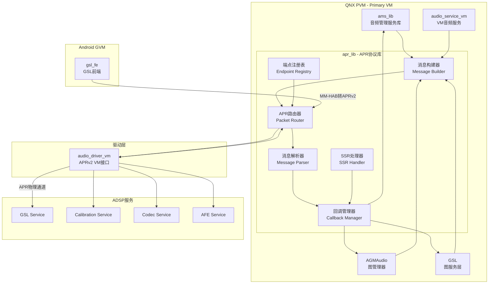
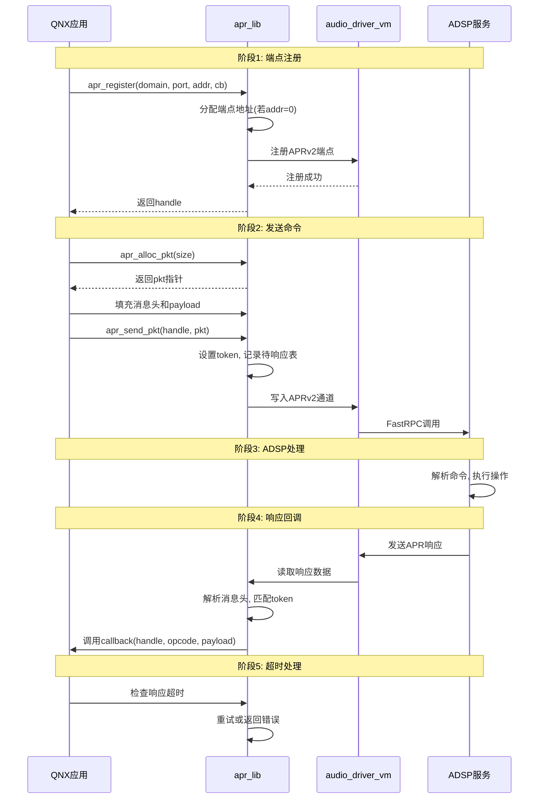
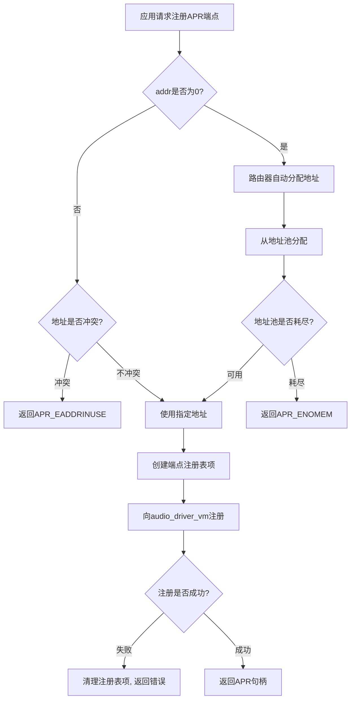
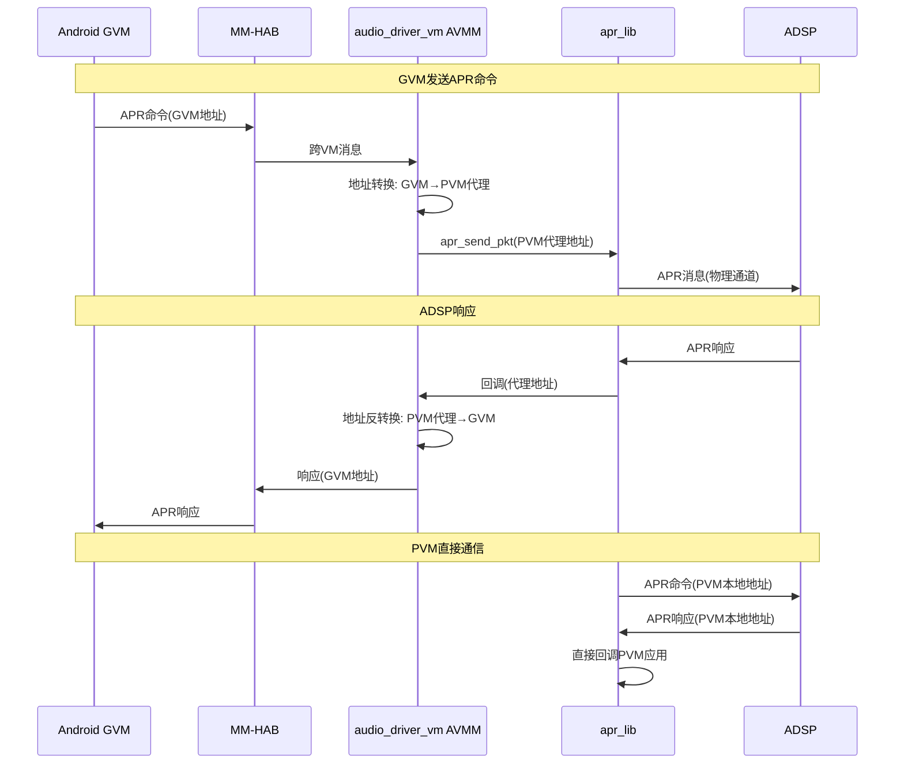
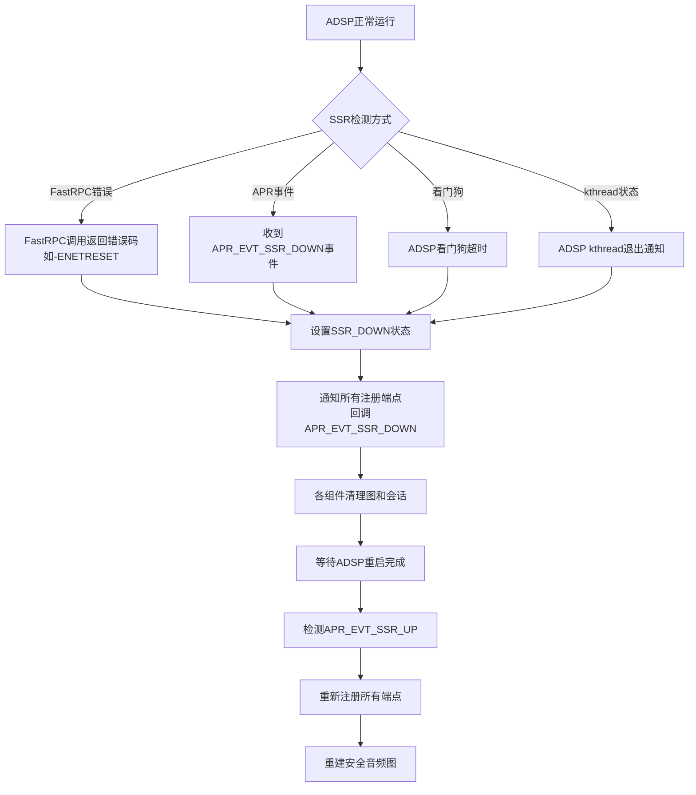

[← 上一个](16_16.18_QNX_ams_lib_音频管理服务库.md) | [← 返回16章](README.md) | [返回导航](../README.md) | [下一个 →](16_16.20_QNX_audio_a2b_A2B总线音频.md)

## 16.19 apr_lib — QNX APR协议库

> **架构归属说明**：`apr_lib`（APR 协议库）属于 SA8295 QNX 侧 `audio_elite/`（Elite 架构）组件。SA8295 另有 `audio_ar/`（AudioReach 架构，对应 `amfs2_lib`/`audio_reach`/`avmm_lib`/`gsl_be`），由板级配置 `adp_8295` vs `adp_8295_ar` 选择。详见 [16.16 架构归属说明](16_16.16_QNX_audio_driver_vm_VM音频驱动层.md)。


### 16.19.1 概述

`apr_lib`（Audio Packet Router Library）是QNX域中APR协议的实现库，提供QNX与ADSP之间的**消息路由基础设施**。APR是Qualcomm音频子系统的核心通信协议，所有QNX音频组件与ADSP的交互都通过apr_lib进行消息封装、路由和分发。

### 16.19.2 架构定位

| 维度 | 说明 |
|------|------|
| 层级 | QNX音频栈协议层（共享库） |
| 运行域 | QNX PVM（Primary VM） |
| 库类型 | 共享库（.so），被所有需要与ADSP通信的QNX组件链接 |
| 核心职责 | APR消息封装/解封装、端点地址路由、消息收发、回调分发 |
| 与Android关系 | Android通过gsl_fe→MM-HAB→gsl_vm_be→audio_driver_vm→apr_lib间接使用APR |
| 安全属性 | QNX PVM的APR端点独立于Android GVM，安全音频消息不经过Android |
| 依赖关系 | 依赖audio_driver_vm提供底层APRv2传输通道 |

### 16.19.3 APR协议概述

APR（Audio Packet Router）是Qualcomm定义的音频消息路由协议，用于Host处理器与音频DSP之间的通信：

- **消息模型**：请求-响应模式，每条消息有唯一的消息ID和token用于匹配
- **地址模型**：每个APR端点有`domain:port:address`三级地址，全局唯一
- **路由模型**：APR路由器根据目标地址将消息投递到对应的DSP服务
- **虚拟化扩展**：APRv2增加了VM感知，支持多VM共享ADSP
- **可靠性**：支持消息重试、SSR恢复、超时检测机制

### 16.19.4 与其他QNX组件的关系

| 组件 | 交互方式 | 说明 |
|------|----------|------|
| audio_driver_vm | 依赖 | 提供APRv2 VM的底层传输通道和AVMM仲裁 |
| ams_lib | 被调用 | 使用apr_lib发送图管理命令到ADSP |
| audio_service_vm | 被调用 | 通过apr_lib与ADSP服务交互 |
| AGM/GSL | 被调用 | 通过apr_lib控制ADSP上的GSL模块 |
| gsl_vm_be | 协作 | 将Android GVM的APR请求转发到apr_lib |

### 16.19.5 架构图



### 16.19.6 APR消息格式

### 16.19.7 APR消息头详细解析

APR消息头是所有APR消息的固定前缀，承载路由和控制信息：

```c
typedef struct {
    uint16_t hdr_field;      // 头部字段: version[15:13] | reserved[12:0]
    uint16_t src_domain;     // 源域ID
    uint16_t src_port;       // 源端口
    uint16_t src_addr;       // 源地址
    uint16_t dst_domain;     // 目标域ID
    uint16_t dst_port;       // 目标端口
    uint16_t dst_addr;       // 目标地址
    uint32_t msg_id;         // 消息ID (命令|响应|事件)
    uint32_t token;          // 令牌(匹配请求-响应对)
    uint32_t payload_size;   // 载荷大小(字节)
    // payload follows...
} apr_msg_hdr_t;
```

**各字段详细说明：**

| 字段 | 位宽 | 说明 | 典型值 |
|------|------|------|--------|
| hdr_field | 16bit | 版本号占高3位，低13位保留 | 0x0000 (v0) |
| src_domain | 16bit | 源域ID，标识发送方所在处理器域 | 1 (APPS) |
| src_port | 16bit | 源端口，标识发送方服务类型 | 服务自定义 |
| src_addr | 16bit | 源地址，标识发送方实例 | 动态分配 |
| dst_domain | 16bit | 目标域ID，标识接收方处理器域 | 2 (ADSP) |
| dst_port | 16bit | 目标端口，标识接收方服务类型 | 服务自定义 |
| dst_addr | 16bit | 目标地址，标识接收方实例 | 动态分配 |
| msg_id | 32bit | 消息ID，高16位为服务ID，低16位为操作ID | 见下表 |
| token | 32bit | 令牌，请求方设置，响应方原样返回 | 递增序列 |
| payload_size | 32bit | 载荷字节数，最大8KB | 0~8192 |

### 16.19.8 Domain/Port/Address三级寻址规则

APR采用三级寻址模型，确保消息精确投递到目标服务实例：

```
APR端点地址 = Domain : Port : Address

Domain (处理器域):
  APR_DOMAIN_APPS  = 1  (应用处理器 - QNX PVM)
  APR_DOMAIN_ADSP  = 2  (音频DSP - Hexagon)
  APR_DOMAIN_MODEM = 3  (调制解调器处理器)
  APR_DOMAIN_SDSP  = 5  (传感器DSP)

Port (服务端口):
  由各服务在注册时指定，常见端口:
  APR_PORT_GSL     = 0x1001  (GSL图管理服务)
  APR_PORT_CAL     = 0x1002  (校准服务)
  APR_PORT_CODEC   = 0x1003  (编解码器服务)
  APR_PORT_AFE     = 0x1004  (音频前端服务)
  APR_PORT_VOICE   = 0x1005  (语音服务)

Address (实例地址):
  由APR路由器在端点注册时动态分配
  同一Port下可有多个Address，代表同一服务的不同实例
  如: GSL Service可有多个图实例，每个图实例有独立Address
```

**寻址路由逻辑：**

1. **Domain路由**：APR路由器根据`dst_domain`确定目标处理器，将消息发送到对应物理通道
2. **Port路由**：目标处理器内的APR路由器根据`dst_port`找到目标服务
3. **Address路由**：服务内根据`dst_addr`找到具体实例处理消息

### 16.19.9 消息类型分类

APR消息ID的高2位标识消息类型：

| 类型 | 高2位 | 说明 | 示例 |
|------|-------|------|------|
| 命令(CMD) | 0b00 | Host→DSP的请求命令 | APR_CMD_GRAPH_OPEN |
| 响应(RSP) | 0b01 | DSP→Host的命令响应 | APR_RSP_GRAPH_OPEN |
| 事件(EVT) | 0b10 | DSP→Host的异步通知 | APR_EVT_NOTIFY |
| 保留 | 0b11 | 保留未使用 | - |

**消息ID编码规则：**

```
msg_id = (service_id << 16) | (msg_type << 14) | opcode

service_id: 服务标识，如GSL=0x0001, CAL=0x0002
msg_type:   0=CMD, 1=RSP, 2=EVT
opcode:     具体操作码，如GRAPH_OPEN=0x0001
```

### 16.19.10 典型APR命令/响应/事件

| 方向 | 消息ID | 说明 | Payload |
|------|--------|------|---------|
| QNX→ADSP | APR_CMD_GRAPH_OPEN | 请求创建DSP图 | 图配置描述符 |
| ADSP→QNX | APR_RSP_GRAPH_OPEN | 图创建响应 | 图句柄/错误码 |
| QNX→ADSP | APR_CMD_GRAPH_START | 请求启动图处理 | 图句柄 |
| ADSP→QNX | APR_RSP_GRAPH_START | 图启动响应 | 状态码 |
| QNX→ADSP | APR_CMD_GRAPH_STOP | 请求停止图处理 | 图句柄 |
| ADSP→QNX | APR_RSP_GRAPH_STOP | 图停止响应 | 状态码 |
| QNX→ADSP | APR_CMD_GRAPH_CLOSE | 请求销毁图 | 图句柄 |
| ADSP→QNX | APR_RSP_GRAPH_CLOSE | 图销毁响应 | 状态码 |
| QNX→ADSP | APR_CMD_SET_PARAM | 设置参数 | 参数ID+参数数据 |
| ADSP→QNX | APR_RSP_SET_PARAM | 参数设置响应 | 状态码 |
| QNX→ADSP | APR_CMD_GET_PARAM | 获取参数 | 参数ID+缓冲区 |
| ADSP→QNX | APR_RSP_GET_PARAM | 参数获取响应 | 参数数据 |
| ADSP→QNX | APR_EVT_NOTIFY | ADSP异步事件通知 | 事件类型+事件数据 |
| ADSP→QNX | APR_EVT_SSR_DOWN | ADSP子系统关闭通知 | SSR状态信息 |
| ADSP→QNX | APR_EVT_SSR_UP | ADSP子系统恢复通知 | SSR状态信息 |

### 16.19.11 APR消息编码与校验

**消息完整性校验：**

APR协议本身不包含CRC校验字段，完整性保障依赖以下机制：

| 机制 | 层级 | 说明 |
|------|------|------|
| payload_size校验 | APR层 | 接收方校验实际载荷长度与payload_size是否匹配 |
| FastRPC通道校验 | 传输层 | audio_driver_vm的FastRPC通道自带CRC和序列号校验 |
| SMP保护 | 内核层 | QNX内核的共享内存保护机制防止内存损坏 |
| token匹配 | 应用层 | 请求-响应通过token匹配，防止消息错位 |

**Payload结构规范：**

```
APR消息 = apr_msg_hdr_t (20字节) + payload

Payload格式 (以SET_PARAM为例):
  +-------------------+
  | param_id (4字节)  |  参数ID
  | param_size (4字节)|  参数数据长度
  | param_data [...]  |  参数数据
  +-------------------+
```

**大消息分片机制：**

当payload超过单次传输最大限制（通常8KB）时，采用分片传输：

1. 发送方将大payload拆分为多个片段，每个片段≤8KB
2. 每个片段使用相同的msg_id但不同的token
3. 片段头中包含分片序号和总片数
4. 接收方按序号重组完整payload
5. 所有片段收齐后，触发上层回调

### 16.19.12 核心API接口

### 16.19.13 端点注册/注销API

| API | 签名 | 说明 |
|-----|------|------|
| apr_register | `int32_t apr_register(uint16_t domain, uint16_t port, uint16_t addr, apr_cb_fn cb, void *priv, apr_handle_t *handle)` | 注册APR端点，指定域/端口/地址和回调函数 |
| apr_deregister | `int32_t apr_deregister(apr_handle_t handle)` | 注销APR端点，释放相关资源 |

**apr_register详细参数：**

| 参数 | 类型 | 说明 |
|------|------|------|
| domain | uint16_t | 注册端点的域ID，QNX PVM使用APR_DOMAIN_APPS(1) |
| port | uint16_t | 注册端点的端口，标识服务类型 |
| addr | uint16_t | 注册端点的地址，0表示由路由器自动分配 |
| cb | apr_cb_fn | 消息回调函数，接收APR响应和事件 |
| priv | void* | 回调私有数据指针，透传给回调函数 |
| handle | apr_handle_t* | 输出参数，返回注册句柄 |

**回调函数签名：**

```c
typedef int32_t (*apr_cb_fn)(apr_handle_t handle, uint32_t opcode,
                             void *payload, uint32_t payload_size,
                             void *priv);
```

### 16.19.14 消息收发API

| API | 签名 | 说明 |
|-----|------|------|
| apr_send_pkt | `int32_t apr_send_pkt(apr_handle_t handle, void *msg)` | 发送APR消息包，阻塞等待发送完成 |
| apr_send_pkt_async | `int32_t apr_send_pkt_async(apr_handle_t handle, void *msg)` | 异步发送APR消息包，立即返回 |
| apr_recv_pkt | `int32_t apr_recv_pkt(apr_handle_t handle, void *buf, uint32_t size)` | 主动接收APR消息（轮询模式） |

### 16.19.15 参数操作API

| API | 签名 | 说明 |
|-----|------|------|
| apr_set_param | `int32_t apr_set_param(apr_handle_t handle, uint32_t param_id, void *payload, uint32_t size)` | 发送参数设置命令到ADSP |
| apr_get_param | `int32_t apr_get_param(apr_handle_t handle, uint32_t param_id, void *payload, uint32_t size)` | 发送参数获取命令到ADSP |

### 16.19.16 内存管理API

| API | 签名 | 说明 |
|-----|------|------|
| apr_alloc_pkt | `void* apr_alloc_pkt(uint32_t size)` | 分配APR消息包内存（含消息头） |
| apr_free_pkt | `void apr_free_pkt(void *pkt)` | 释放APR消息包内存 |

### 16.19.17 辅助API

| API | 签名 | 说明 |
|-----|------|------|
| apr_set_token | `void apr_set_token(void *msg, uint32_t token)` | 设置消息token |
| apr_get_token | `uint32_t apr_get_token(void *msg)` | 获取消息token |
| apr_get_payload | `void* apr_get_payload(void *msg)` | 获取消息payload指针 |
| apr_get_payload_size | `uint32_t apr_get_payload_size(void *msg)` | 获取消息payload大小 |

### 16.19.18 APR通信流程

### 16.19.19 完整消息收发时序



### 16.19.20 消息发送详细流程

```
1. 应用调用apr_alloc_pkt()分配消息缓冲区
2. 填充apr_msg_hdr_t:
   - src_domain/port/addr: 使用注册时的端点地址
   - dst_domain/port/addr: 目标ADSP服务地址
   - msg_id: 命令消息ID
   - token: 递增分配，用于匹配响应
   - payload_size: 载荷字节数
3. 填充payload数据
4. 调用apr_send_pkt()发送:
   a. apr_lib将消息写入待响应队列(pending_list)
   b. 设置超时定时器(默认5秒)
   c. 调用audio_driver_vm的APRv2发送接口
   d. audio_driver_vm通过FastRPC将消息发送到ADSP
5. 等待响应:
   a. ADSP处理命令后发送响应
   b. audio_driver_vm接收响应，回调apr_lib
   c. apr_lib解析响应，匹配token
   d. 从pending_list移除，调用应用回调
   e. 若超时未收到响应，触发重试或错误回调
```

### 16.19.21 消息重试机制

| 参数 | 默认值 | 说明 |
|------|--------|------|
| APR_RETRY_COUNT | 3 | 最大重试次数 |
| APR_RETRY_INTERVAL_MS | 100 | 重试间隔(毫秒) |
| APR_RSP_TIMEOUT_MS | 5000 | 响应超时时间(毫秒) |

**重试策略：**

1. 发送命令后启动超时定时器
2. 超时未收到响应，检查重试次数
3. 若未超过最大重试次数，重新发送命令
4. 若超过最大重试次数，返回`APR_ETIMEDOUT`错误
5. 收到响应后，取消超时定时器，从pending_list移除

### 16.19.22 APR端点注册与发现

### 16.19.23 端点注册流程



### 16.19.24 端点地址分配规则

| 场景 | 分配策略 | 说明 |
|------|----------|------|
| 首次注册(addr=0) | 从地址池顺序分配 | 地址池范围: 0x0001~0xFFFE |
| 指定地址注册 | 检查冲突后直接使用 | 用于已知服务地址的注册 |
| SSR后重注册 | 使用原有地址 | 保持地址稳定性，便于恢复 |
| 多实例注册 | 同一Port不同Address | 每个实例获得唯一Address |

### 16.19.25 端点注册表数据结构

```c
// APR端点注册表项
typedef struct apr_endpoint {
    uint16_t domain;           // 域ID
    uint16_t port;             // 端口
    uint16_t addr;             // 地址
    apr_cb_fn callback;        // 消息回调函数
    void *priv;                // 回调私有数据
    apr_handle_t handle;       // 注册句柄
    uint32_t ref_count;        // 引用计数
    struct apr_endpoint *next; // 链表下一项
} apr_endpoint_t;

// APR路由器全局状态
typedef struct apr_router {
    apr_endpoint_t *endpoints;     // 端点注册表(链表)
    apr_pending_t *pending_list;   // 待响应消息队列
    pthread_mutex_t lock;          // 全局锁
    uint16_t next_addr;            // 下一个可分配地址
    int ssr_state;                 // SSR状态
} apr_router_t;
```

### 16.19.26 APRv2虚拟化扩展

### 16.19.27 APRv2概述

APRv2是APR协议的虚拟化扩展版本，在Hypervisor虚拟化环境下支持多VM共享同一ADSP。在SA8295平台上：

- **QNX PVM**：作为ADSP的Primary VM，直接拥有APR通道
- **Android GVM**：作为Guest VM，通过MM-HAB跨VM通信间接使用APR
- **audio_driver_vm**：实现AVMM（Audio Virtual Machine Manager）仲裁层

### 16.19.28 VM地址转换规则

在虚拟化环境下，APR消息的源地址需要经过VM地址转换：

```
GVM端APR地址转换流程:
  1. Android GVM应用发送APR命令
     src_domain=1, src_port=GVM_PORT, src_addr=GVM_ADDR
  2. gsl_fe通过MM-HAB发送到QNX PVM
  3. gsl_vm_be接收MM-HAB消息
  4. audio_driver_vm的AVMM层进行地址转换:
     GVM_ADDR → PVM_PROXY_ADDR (代理地址)
  5. apr_lib使用转换后的PVM地址发送到ADSP:
     src_domain=1, src_port=PVM_PROXY_PORT, src_addr=PVM_PROXY_ADDR
  6. ADSP响应到PVM_PROXY_ADDR
  7. audio_driver_vm反向转换: PVM_PROXY_ADDR → GVM_ADDR
  8. gsl_vm_be通过MM-HAB返回Android GVM
```

**地址转换映射表：**

| VM | 原始地址空间 | 转换后地址空间 | 转换执行方 |
|----|-------------|---------------|-----------|
| QNX PVM | domain=1, port=PVM_PORT, addr=PVM_ADDR | 不转换(直接使用) | - |
| Android GVM | domain=1, port=GVM_PORT, addr=GVM_ADDR | domain=1, port=PVM_PROXY_PORT, addr=PVM_PROXY_ADDR | audio_driver_vm AVMM |

### 16.19.29 多VM路由表

audio_driver_vm维护VM路由表，决定APR消息的路由方向：

```c
// VM路由表项
typedef struct avmm_route_entry {
    uint16_t vm_id;              // VM标识 (0=PVM, 1=GVM)
    uint16_t gvm_port;           // GVM侧APR端口
    uint16_t pvm_proxy_port;     // PVM侧代理端口
    uint16_t gvm_addr;           // GVM侧APR地址
    uint16_t pvm_proxy_addr;     // PVM侧代理地址
    int mm_hab_channel;          // MM-HAB通道句柄
    int is_active;               // VM是否活跃
} avmm_route_entry_t;
```

**路由决策逻辑：**

1. ADSP响应到达PVM，AVMM检查dst_addr
2. 若dst_addr属于PVM本地地址范围 → 直接投递到PVM端点
3. 若dst_addr属于PVM代理地址范围 → 查路由表找到对应GVM
4. 通过MM-HAB将响应转发到GVM

### 16.19.30 APRv2与audio_driver_vm交互



### 16.19.31 双域APR隔离

### 16.19.32 PVM/GVM地址空间隔离

SA8295平台上，QNX PVM和Android GVM的APR端点使用完全独立的地址空间：

```
地址空间划分:
  PVM本地地址:  port ∈ [0x1000, 0x1FFF], addr ∈ [0x0001, 0x00FF]
  PVM代理地址:  port ∈ [0x2000, 0x2FFF], addr ∈ [0x0100, 0x01FF]
  GVM直接地址:  port ∈ [0x3000, 0x3FFF], addr ∈ [0x0200, 0x02FF]  (GVM视角)
```

**隔离保证：**

| 隔离维度 | 实现机制 | 安全等级 |
|----------|----------|----------|
| 地址隔离 | PVM和GVM使用不重叠的地址范围 | 强隔离 |
| 消息隔离 | VM间APR消息不互通，由AVMM层仲裁 | 强隔离 |
| 回调隔离 | 各VM的APR回调独立注册和分发 | 强隔离 |
| 故障隔离 | GVM崩溃不影响PVM的APR连接 | 强隔离 |
| 资源隔离 | 各VM的pending_list和端点注册表独立 | 中隔离 |

### 16.19.33 消息不互通保证

**PVM→ADSP消息不泄露到GVM：**

1. PVM应用发送APR命令，src_addr属于PVM本地地址范围
2. ADSP响应的dst_addr属于PVM本地地址范围
3. AVMM检查dst_addr，判定属于PVM本地 → 直接投递PVM
4. GVM无法收到该响应

**GVM→ADSP消息不泄露到PVM：**

1. GVM发送APR命令，经AVMM转换为PVM代理地址
2. ADSP响应的dst_addr属于PVM代理地址范围
3. AVMM检查dst_addr，判定属于代理范围 → 查路由表转发GVM
4. PVM应用无法收到该响应

**安全音频额外保护：**

- 安全音频会话的APR端点仅在PVM注册
- 安全音频消息的src_addr属于PVM本地地址
- AVMM层对安全音频消息不做代理转发
- 即使GVM被攻破，也无法获取安全音频的APR消息内容

### 16.19.34 APR与ADSP各服务交互

### 16.19.35 GSL Service交互

GSL（Graph Service Layer）是ADSP上的图管理服务，QNX通过apr_lib发送图操作命令：

| APR命令 | msg_id | Payload | 说明 |
|---------|--------|---------|------|
| APR_CMD_GRAPH_OPEN | 0x00010001 | gsl_graph_open_cmd_t | 创建DSP处理图 |
| APR_CMD_GRAPH_CLOSE | 0x00010002 | graph_handle_t | 销毁DSP处理图 |
| APR_CMD_GRAPH_START | 0x00010003 | graph_handle_t | 启动图处理 |
| APR_CMD_GRAPH_STOP | 0x00010004 | graph_handle_t | 停止图处理 |
| APR_CMD_GRAPH_FLUSH | 0x00010005 | graph_handle_t | 刷新图缓冲区 |
| APR_CMD_SET_PARAM | 0x00010010 | param_id + payload | 设置图参数 |
| APR_CMD_GET_PARAM | 0x00010011 | param_id + buf | 获取图参数 |

**GSL图操作典型时序：**

```
1. ams_lib调用agma_graph_open()
2. AGMAudio调用apr_send_pkt(APR_CMD_GRAPH_OPEN)
3. ADSP GSL Service创建图实例，分配资源
4. ADSP返回APR_RSP_GRAPH_OPEN，包含graph_handle
5. QNX保存graph_handle，用于后续操作
6. 设置参数: apr_set_param(graph_handle, CALIBRATION, ...)
7. 启动图: apr_send_pkt(APR_CMD_GRAPH_START)
8. ADSP开始音频数据处理
```

### 16.19.36 Calibration Service交互

校准服务管理ADSP上的算法参数和校准数据：

| APR命令 | msg_id | 说明 |
|---------|--------|------|
| APR_CMD_CAL_SET_CAL | 0x00020001 | 写入校准数据到ADSP |
| APR_CMD_CAL_GET_CAL | 0x00020002 | 从ADSP读取校准数据 |
| APR_CMD_CAL_SET_PERSIST | 0x00020003 | 设置持久化校准数据 |
| APR_CMD_CAL_NOTIFY | 0x00020004 | 订阅校准数据变更通知 |

**校准数据流向：**

```
ACDB文件(校准数据库) → ams_lib → apr_lib → ADSP Calibration Service
                                              ↓
                                        算法模块加载校准参数
```

### 16.19.37 Codec Service交互

编解码器服务管理ADSP上的音频编解码：

| APR命令 | msg_id | 说明 |
|---------|--------|------|
| APR_CMD_CODEC_OPEN | 0x00030001 | 打开编解码器实例 |
| APR_CMD_CODEC_CLOSE | 0x00030002 | 关闭编解码器实例 |
| APR_CMD_CODEC_ENCODE | 0x00030003 | 编码请求 |
| APR_CMD_CODEC_DECODE | 0x00030004 | 解码请求 |
| APR_CMD_CODEC_FLUSH | 0x00030005 | 刷新编解码器缓冲区 |

### 16.19.38 AFE Service交互

AFE（Audio Front End）服务管理ADSP的音频前端接口：

| APR命令 | msg_id | 说明 |
|---------|--------|------|
| APR_CMD_AFE_PORT_START | 0x00040001 | 启动AFE端口 |
| APR_CMD_AFE_PORT_STOP | 0x00040002 | 停止AFE端口 |
| APR_CMD_AFE_SET_PARAM | 0x00040003 | 设置AFE参数 |
| APR_CMD_AFE_GET_PARAM | 0x00040004 | 获取AFE参数 |
| APR_CMD_AFE_LOOPBACK | 0x00040005 | 设置回环模式 |

### 16.19.39 APR与SSR恢复

### 16.19.40 SSR事件检测

ADSP SSR（Subsystem Restart Recovery）是ADSP子系统崩溃后的恢复机制。apr_lib通过以下方式检测SSR：



### 16.19.41 SSR恢复完整流程

| 阶段 | 步骤 | 执行方 | 说明 |
|------|------|--------|------|
| 1.检测 | 检测APR链路断开 | apr_lib | FastRPC错误或SSR_DOWN事件 |
| 2.通知 | 通知所有注册回调 | apr_lib | 遍历端点注册表，调用callback |
| 3.清理 | 清理现有图和会话 | ams_lib/AGMAudio | 销毁所有ADSP图，释放资源 |
| 4.等待 | 等待ADSP重启 | audio_driver_vm | 轮询ADSP状态 |
| 5.重连 | 重新建立APR连接 | apr_lib | 重新打开FastRPC通道 |
| 6.重注册 | 重新注册所有端点 | apr_lib | 使用原有地址重新注册 |
| 7.通知 | 通知SSR_UP | apr_lib | 回调APR_EVT_SSR_UP |
| 8.恢复 | 重建安全音频图 | ams_lib | 优先恢复安全音频会话 |
| 9.恢复 | 重建普通音频图 | ams_lib | 恢复非安全音频会话 |

### 16.19.42 消息缓存与重发

SSR期间，apr_lib需要处理未完成的消息：

**SSR_DOWN时的处理：**

1. 清空pending_list中所有待响应消息
2. 对每条待响应消息，返回`APR_ESSR`错误码给调用方
3. 调用方根据错误码决定是否在SSR_UP后重发

**SSR_UP后的重发策略：**

| 策略 | 适用场景 | 说明 |
|------|----------|------|
| 立即重发 | 关键命令(如GRAPH_OPEN) | SSR_UP后立即重新发送 |
| 延迟重发 | 非关键命令(如SET_PARAM) | 等图重建完成后再发送 |
| 丢弃 | 过时命令(如已关闭图的STOP) | 不再重发，直接丢弃 |
| 用户决策 | 交互式操作 | 通知应用层，由应用决定 |

### 16.19.43 调试方法

### 16.19.44 APR日志标签

| 日志标签 | 级别 | 说明 |
|----------|------|------|
| APR_DBG | DEBUG | APR消息收发详细日志 |
| APR_INFO | INFO | 端点注册/注销/SSR事件 |
| APR_WARN | WARNING | 消息超时/重试/地址冲突 |
| APR_ERR | ERROR | 发送失败/注册失败/SSR错误 |
| APR_ROUTER | DEBUG | 路由决策日志 |
| APR_CALLBACK | DEBUG | 回调分发日志 |

**QNX侧启用APR调试日志：**

```bash
# 设置apr_lib日志级别
export APR_LOG_LEVEL=4  # 0=NONE, 1=ERROR, 2=WARN, 3=INFO, 4=DEBUG

# 使用slog2info过滤APR日志
slog2info -f apr

# 查看APR消息跟踪
slog2info -f apr_router
```

### 16.19.45 消息跟踪与诊断

**跟踪APR消息流：**

```bash
# 1. 查看APR端点注册状态
cat /dev/apr/endpoints

# 2. 跟踪特定端点的消息
echo "trace 0x1001" > /dev/apr/trace  # 跟踪GSL端口

# 3. 查看pending消息队列
cat /dev/apr/pending

# 4. 查看SSR状态
cat /dev/apr/ssr_state
```

### 16.19.46 错误码诊断

| 错误码 | 值 | 说明 | 排查方向 |
|--------|-----|------|----------|
| APR_EOK | 0 | 成功 | - |
| APR_EFAILED | -1 | 通用失败 | 检查ADSP状态和日志 |
| APR_EHANDLE | -2 | 无效句柄 | 检查端点是否已注册 |
| APR_EPARAM | -3 | 无效参数 | 检查消息格式和payload |
| APR_EADDRINUSE | -4 | 地址已被占用 | 检查是否有重复注册 |
| APR_ETIMEOUT | -5 | 响应超时 | 检查ADSP是否响应、网络是否正常 |
| APR_ESSR | -6 | SSR期间操作失败 | 等待SSR_UP后重试 |
| APR_ENOMEM | -7 | 内存不足 | 检查系统内存和消息缓冲区 |
| APR_EUNAVAIL | -8 | 服务不可用 | 检查ADSP服务是否已启动 |

### 16.19.47 常见问题排查

| 问题 | 现象 | 排查步骤 |
|------|------|----------|
| 端点注册失败 | apr_register返回负值 | 1.检查domain/port/addr是否合法 2.检查地址是否冲突 3.检查ADSP是否在线 |
| 消息发送失败 | apr_send_pkt返回负值 | 1.检查handle是否有效 2.检查ADSP是否SSR 3.检查FastRPC通道状态 |
| 响应超时 | 5秒未收到响应 | 1.检查ADSP日志是否有处理 2.检查msg_id和token是否匹配 3.增大超时时间 |
| SSR频繁触发 | ADSP反复重启 | 1.检查ADSP固件版本 2.检查内存是否不足 3.检查是否有非法参数 |
| GVM消息丢失 | Android侧无响应 | 1.检查MM-HAB通道状态 2.检查AVMM路由表 3.检查GVM VM是否活跃 |

### 16.19.48 源码路径参考

```
vendor/qcom/proprietary/apr_lib/
├── b-family/
│   └── apr/                  # APR协议实现
│       ├── apr.c             # APR核心实现(注册/注销/发送/接收)
│       ├── apr_msg.c         # 消息处理(构建/解析/校验)
│       ├── apr_router.c      # 路由逻辑(地址查找/消息分发)
│       ├── apr_callback.c    # 回调管理(注册/分发/SSR通知)
│       ├── apr_ssr.c         # SSR处理(检测/恢复/重注册)
│       └── apr_v2.c          # APRv2虚拟化扩展
├── inc/
│   ├── apr.h                 # APR公共头文件
│   ├── apr_msg.h             # 消息格式定义
│   └── apr_err.h             # 错误码定义
└── Makefile                   # 构建配置
```

### 16.19.49 总结

apr_lib作为QNX域与ADSP通信的基础协议库，在SA8295双域架构中承担关键角色：

| 关键能力 | 说明 |
|----------|------|
| APR消息路由 | 基于Domain:Port:Address三级寻址，精确投递消息到ADSP服务 |
| 端点管理 | 支持动态地址分配、冲突检测、SSR后重注册 |
| APRv2虚拟化 | 支持多VM共享ADSP，VM地址转换和路由仲裁 |
| 双域隔离 | PVM/GVM地址空间隔离，消息不互通，安全音频保护 |
| SSR恢复 | 检测ADSP崩溃，通知组件清理，重注册端点，优先恢复安全音频 |
| 可靠通信 | 消息重试、超时检测、token匹配、大消息分片 |

---

[← 上一个](16_16.18_QNX_ams_lib_音频管理服务库.md) | [← 返回16章](README.md) | [返回导航](../README.md) | [下一个 →](16_16.20_QNX_audio_a2b_A2B总线音频.md)