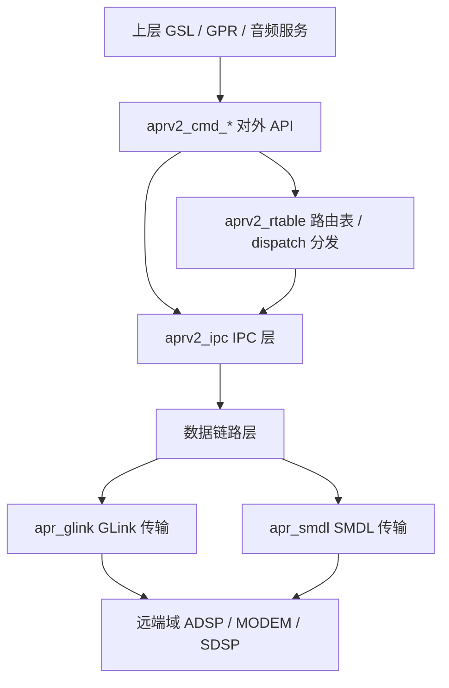

# 16.19 QNX apr_lib — APRv2 协议库

> ⚠️ **源码核实（勘误）**：本章旧版内容几乎全篇为推演/虚构，已按本地真实源码整体重写。
> 真实源码路径：`Qnx/apps/qnx_ap/AMSS/multimedia/audio/audio_elite/audio_driver/apr_lib/`
> 公共头：`audio_driver/inc/B2.9/aprv2_api.h`、`aprv2_ids_domains.h`
>
> 旧版主要错误 → 真实事实对照：
> - 消息头 `apr_msg_hdr_t`（20字节，含 src_domain/dst_domain 等） → 真实为 `aprv2p1_packet_t`（addr+port 二元地址，domain 编码在 addr 高8位）
> - 三级寻址 Domain:Port:Address + 域ID `APPS=1/ADSP=2/MODEM=3/SDSP=5` → 真实域ID `MODEM=3/ADSP=4/APPS=5/SDSP=8/CDSP=9`
> - 对外 API `apr_register/apr_send_pkt/apr_recv_pkt/apr_set_param/apr_alloc_pkt` → 真实为 `aprv2_cmd_register/async_send/alloc/free` 等
> - 传输层 FastRPC → 真实为 GLink（`apr_glink`），另有 SMDL 备用
> - 源码树 `apr.c/apr_msg.c/apr_router.c/apr_callback.c/apr_ssr.c/apr_v2.c` → 真实为 `apr_main.c/aprv2_drv.c/aprv2_rtable.c/aprv2_ipc.c` 等
> - APRv2 虚拟化/VM 地址转换/AVMM 路由表(`avmm_route_entry_t`)/PVM 代理/双域安全音频隔离/GSL·Cal·Codec·AFE msg_id 表/`/dev/apr` 设备节点/`APR_DBG` 日志标签 → 均为虚构，已删除。经 `grep -rni "mm-hab|gsl_vm_be|gsl_fe|agm|pal" apr_lib/` = 0 确认 apr_lib 无这些交互。

---

## 16.19.1 概述

apr_lib（Asynchronous Packet Router，异步包路由）是 AudioReach/Elite 音频驱动栈中的**底层通信协议库**，实现 APRv2（APR version 2）协议。它负责在不同处理域（domain，如 APPS、ADSP、MODEM、SDSP）之间收发命令/响应包，是 GSL/GPR 等上层与 ADSP 音频服务通信的传输基础设施之一。

apr_lib 提供：
- **域间寻址与路由**：基于 (addr, port) 二元地址的包路由。
- **异步命令收发**：`aprv2_cmd_async_send` 等 API。
- **服务注册/回调分发**：通过路由表（rtable）将收到的包分发到注册的 dispatch 回调。
- **数据链路抽象**：底层通过 GLink（`apr_glink`）或 SMDL（`apr_smdl`）传输。
- **OSAL 抽象**：线程/锁/事件/定时器/原子操作的平台无关封装（dal / mmosal 两套变体）。

## 16.19.2 架构定位



apr_lib 位于音频驱动的最底层通信位置：上层通过 `aprv2_cmd_*` API 发送命令，本地域收到的包经 IPC 层进入路由表，按目标 service 分发到对应 dispatch 回调；跨域的包经数据链路（GLink 为主）发送到远端处理器。

## 16.19.3 APRv2 协议概述

APRv2 是高通处理器间的异步包协议。核心概念：

- **域（Domain）**：一个处理器/执行环境，如 APPS（应用处理器）、ADSP（音频 DSP）、MODEM、SDSP、CDSP。
- **服务（Service）**：域内的一个功能实体，由 service ID 标识。
- **地址（Address）**：16 位，高 8 位编码 domain_id，低 8 位编码 service ID（见 `APRV2P1_PKT_DOMAIN_ID_MASK=0xFF00`、`SHFT=8`）。
- **端口（Port）**：16 位，标识服务内的一个会话/客户端句柄。
- **令牌（Token）**：32 位，发送方提供的事务 ID，用于匹配命令与响应。
- **操作码（Opcode）**：32 位 GUID，标识具体命令/事件。

## 16.19.4 真实源码树

真实 apr_lib 源码目录结构（`.c` 实现文件）：

```
apr_lib/
├── Makefile
└── b-family/
    ├── common.mk / Makefile
    └── apr/
        ├── core/
        │   ├── inc/  apr_api_i.h, aprv2_api_i.h, aprv2_ipc_i.h,
        │   │         aprv2_rtable_api_i.h, aprv2p1_packet.h
        │   └── src/  apr_main.c, aprv2_drv.c, aprv2_rtable.c
        ├── custom/
        │   ├── inc/  aprv2_ipc.h, aprv2_pl_config.h
        │   └── src/  aprv2_ipc.c
        ├── datalink/
        │   ├── apr_glink/  inc/apr_glink.h  src/apr_glink.c
        │   └── apr_smdl/   inc/apr_smdl.h   src/apr_smdl.c
        ├── domain/variant/app/src/  apr_log.c
        ├── osal/variant/
        │   ├── dal/src/     apr_atomic/event/lock/misc/thread/timer.c
        │   └── mmosal/src/  apr_atomic/event/lock/misc/thread/timer.c
        └── utils/src/  apr_list.c, apr_memheap.c, apr_memmgr.c,
                        apr_memq.c, apr_objmgr.c
```

各目录职责：
- **core**：协议核心。`apr_main.c`（初始化入口）、`aprv2_drv.c`（命令实现）、`aprv2_rtable.c`（路由表）。
- **custom**：平台定制 IPC 层与配置（`aprv2_pl_config.h` 定义默认域等）。
- **datalink**：物理传输——GLink（主）与 SMDL（备用）。
- **osal**：操作系统抽象，dal 与 mmosal 两套变体。
- **utils**：对象管理器、链表、内存管理器/队列/堆。
- **domain**：域相关，含日志 `apr_log.c`。

## 16.19.5 真实包结构 aprv2p1_packet_t

真实包结构定义在 `core/inc/aprv2p1_packet.h`，名为 `aprv2p1_packet_t`（**不是**旧版虚构的 `apr_msg_hdr_t`）：

```c
struct aprv2p1_packet_t
{
    uint16_t src_addr;   /* 源地址：高8位=domain_id，低8位=service */
    uint16_t src_port;   /* 源端口：服务内的会话/句柄 */
    uint16_t dst_addr;   /* 目标地址：高8位=domain_id，低8位=service */
    uint16_t dst_port;   /* 目标端口 */
    uint32_t token;      /* 客户端事务令牌，命令/响应配对，缺省 APR_NULL_V(0) */
    uint32_t opcode;     /* 操作码（GUID），标识命令/事件 */
    /* ... 之后为可变长度 payload ... */
};
```

关键点：
- 地址是 **(addr, port) 二元**结构，**不是**旧版虚构的 `domain:port:address` 三级独立字段。
- **domain_id 编码在 addr 的高 8 位**，通过 `APRV2P1_PKT_DOMAIN_ID_MASK (0xFF00)` 和 `APRV2P1_PKT_DOMAIN_ID_SHFT (8)` 提取；低 8 位是 service ID。
- 调试追踪场景另有 `APRV2P1_PKT_DEBUG_TRACE_ORG_DOMAIN_ID_MASK (0xFF000000)` / `SHFT (24)`。

## 16.19.6 真实域 ID 定义

真实域 ID 定义在 `inc/B2.9/aprv2_ids_domains.h`（旧版域 ID 全部错误）：

| 宏 | 值 | 说明 |
|---|---|---|
| `APRV2_IDS_DOMAIN_ID_RESERVED_V` | 0 | 保留 |
| `APRV2_IDS_DOMAIN_ID_SIM_V` | 1 | 仿真域 |
| `APRV2_IDS_DOMAIN_ID_PC_V` | 2 | PC 域 |
| `APRV2_IDS_DOMAIN_ID_MODEM_V` | 3 | Modem |
| `APRV2_IDS_DOMAIN_ID_ADSP_V` | **4** | 音频 DSP |
| `APRV2_IDS_DOMAIN_ID_APPS_V` | **5** | 应用处理器 |
| `APRV2_IDS_DOMAIN_ID_MODEM2_V` | 6 | 第二 Modem |
| `APRV2_IDS_DOMAIN_ID_APPS2_V` | 7 | 第二应用域 |
| `APRV2_IDS_DOMAIN_ID_SDSP_V` | **8** | Sensor DSP |
| `APRV2_IDS_DOMAIN_ID_CDSP_V` | 9 | Compute DSP |

平台配置（`custom/inc/aprv2_pl_config.h`）中，本地默认域为 `APPS_V (5)`，最大域为 `APPS2_V (7)`。

## 16.19.7 真实对外 API

真实对外 API 声明在 `core/inc/aprv2_api_i.h`，全部以 `APR_INTERNAL int32_t` 修饰，参数均为对应的 `aprv2_cmd_XXX_t*` 结构体（**不是**旧版虚构的 `apr_register/apr_send_pkt` 等）：

| 真实函数 | 作用 |
|---|---|
| `aprv2_drv_init(void)` | 驱动初始化 |
| `aprv2_drv_deinit(void)` | 驱动去初始化 |
| `aprv2_cmd_register(...)` | 注册一个服务地址及其 dispatch 回调 |
| `aprv2_cmd_register2(...)` | 注册（扩展版） |
| `aprv2_cmd_deregister(...)` | 注销服务 |
| `aprv2_cmd_async_send(...)` | 异步发送一个包 |
| `aprv2_cmd_alloc(...)` | 分配一个发送包 |
| `aprv2_cmd_free(...)` | 释放包 |
| `aprv2_cmd_query_address(...)` | 查询地址 |
| `aprv2_cmd_local_dns_lookup(...)` | 本地 DNS 查找（服务名→地址） |
| `aprv2_cmd_forward(...)` | 转发包 |
| `aprv2_cmd_alloc_ext(...)` | 分配包（扩展） |
| `aprv2_cmd_alloc_send(...)` | 分配并发送 |
| `aprv2_cmd_accept_command(...)` | 接受命令 |
| `aprv2_cmd_end_command(...)` | 结束命令 |

## 16.19.8 命令结构体与回调机制

`aprv2_cmd_*_t` 结构体定义在公共头 `inc/B2.9/aprv2_api.h`：

```c
/* dispatch 回调签名 */
typedef int32_t (*aprv2_dispatch_fn_t)(
        aprv2_packet_t* packet,
        void*           dispatch_data );

/* 注册命令 */
typedef struct {
    uint32_t*           ret_handle;    /* 返回句柄 */
    uint16_t            addr;          /* 要注册的地址 */
    aprv2_dispatch_fn_t dispatch_fn;   /* 收包分发回调 */
    void*               dispatch_data; /* 回调透传数据 */
} aprv2_cmd_register_t;

/* 异步发送命令 */
typedef struct {
    uint32_t        handle;   /* 由 register 返回 */
    aprv2_packet_t* packet;   /* 待发送包 */
} aprv2_cmd_async_send_t;

/* 分配包 */
int32_t __aprv2_cmd_alloc(
        uint32_t         handle,
        uint32_t         alloc_type,
        uint32_t         alloc_size,
        aprv2_packet_t** ret_packet );
```

回调机制：调用方在 `aprv2_cmd_register` 时注册 `dispatch_fn`；当有目标地址匹配的包到达本地域，apr_lib 从路由表查到对应 service entry，调用其 `dispatch_fn(packet, dispatch_data)` 完成分发。

## 16.19.9 路由表 rtable

真实路由表接口在 `core/inc/aprv2_rtable_api_i.h`：

```c
struct aprv2_rtable_service_entry_t {
    aprv2_dispatch_fn_t dispatch_fn;   /* 该服务的分发回调 */
    /* ... */
};

APR_INTERNAL int32_t aprv2_rtable_init(
        aprv2_dispatch_fn_t default_dispatch_fn, ... );
APR_INTERNAL int32_t aprv2_rtable_deinit(void);
APR_INTERNAL int32_t aprv2_rtable_get_default_domain(...);
APR_INTERNAL int32_t aprv2_rtable_get_num_total_domains(...);
APR_INTERNAL int32_t aprv2_rtable_get_num_static_services(...);
APR_INTERNAL int32_t aprv2_rtable_get_num_total_services(...);
APR_INTERNAL int32_t aprv2_rtable_local_dns_lookup(...);
APR_INTERNAL int32_t aprv2_rtable_get_service(
        ..., aprv2_rtable_service_entry_t** ret_entry );
```

路由表维护本地静态/动态服务，`aprv2_rtable_get_service` 根据地址查出 service entry（含 dispatch_fn），`local_dns_lookup` 支持按服务名解析到地址。

## 16.19.10 IPC 层

IPC 层接口在 `custom/inc/aprv2_ipc.h`，负责判断目标域是本地还是远端，并把远端包交给数据链路：

```c
int32_t aprv2_ipc_init(void);
int32_t aprv2_ipc_deinit(void);
bool_t  aprv2_ipc_is_domain_local(uint16_t domain_id);  /* 目标域是否本地 */
int32_t aprv2_ipc_send(aprv2_packet_t* packet);         /* 发送到远端域 */
int32_t aprv2_ipc_send_dummy(...);
```

`aprv2_ipc_is_domain_local` 用于路由决策：本地域的包直接走路由表分发，远端域的包经 `aprv2_ipc_send` 下发到 GLink/SMDL 传输。

## 16.19.11 数据链路层 — GLink（主）

真实传输层是 **GLink**（**不是**旧版虚构的 FastRPC）。`custom/src/aprv2_ipc.c` 中 `#include "apr_glink.h"`，按目标域建立不同的 GLink 链路：

| 目标域 | LINK_ID | PORT_INDEX |
|---|---|---|
| ADSP | `APR_GLINK_APPS_ADSP_LINK_ID` | `APR_GLINK_AUDIO_PORT_INDEX` |
| MODEM | `APR_GLINK_APPS_MODEM_LINK_ID` | `APR_GLINK_AMS_PORT_INDEX` |
| SDSP | `APR_GLINK_APPS_SDSP_LINK_ID` | `APR_GLINK_AMS_PORT_INDEX` |

初始化/收发流程（`aprv2_ipc.c`）：

```c
apr_glink_init();                                    /* 初始化 GLink */
apr_glink_setup_link(APR_GLINK_APPS_ADSP_LINK_ID);   /* 建立到 ADSP 的链路 */
apr_glink_open(APR_GLINK_AUDIO_PORT_INDEX);          /* 打开音频端口 */
/* ... 通信 ... */
apr_glink_close(APR_GLINK_AUDIO_PORT_INDEX);
apr_glink_teardown_link(APR_GLINK_APPS_ADSP_LINK_ID);
```

具体 GLink 收发实现在 `datalink/apr_glink/src/apr_glink.c`。

## 16.19.12 数据链路层 — SMDL（备用）

`datalink/apr_smdl/src/apr_smdl.c` 提供 SMDL（Shared Memory Data Link）作为备用传输通道，接口在 `apr_smdl/inc/apr_smdl.h`。GLink 是当前 SA8295 平台的主用传输。

## 16.19.13 OSAL 抽象层

apr_lib 通过 OSAL 屏蔽底层 OS 差异，提供 `dal` 与 `mmosal` 两套变体（`osal/variant/{dal,mmosal}/src/`），各自实现同名的一组文件：

- `apr_thread.c`：线程创建/销毁。
- `apr_lock.c`：互斥锁。
- `apr_event.c`：事件/信号量同步。
- `apr_timer.c`：定时器。
- `apr_atomic.c`：原子操作。
- `apr_misc.c`：其他工具函数。

编译时按平台选择变体。SA8295 QNX 侧使用相应变体实现。

## 16.19.14 工具库 utils

`utils/src/` 提供协议实现所需的基础数据结构与内存管理：

- `apr_objmgr.c`：对象管理器，句柄↔对象映射（如 register 返回的 handle）。
- `apr_list.c`：通用双向链表。
- `apr_memmgr.c`：内存管理器。
- `apr_memq.c`：内存队列。
- `apr_memheap.c`：内存堆分配。

## 16.19.15 日志

apr_lib 使用统一日志宏 `APR_MSG(<优先级>, <格式串>, ...)`，优先级如 `APR_PRIO_ERROR`、`APR_PRIO_HIGH`（见 `apr_glink.c`、`apr_event.c` 等）。日志实现在 `domain/variant/app/src/apr_log.c`。旧版提到的 `APR_DBG/INFO/WARN` 标签与 `/dev/apr` 设备节点、`slog2info -f apr` 均为虚构。

## 16.19.16 与 ams_lib 的关系（澄清）

经核实，`ams_lib`（16.18 章）**不直接链接调用** apr_lib 的 `aprv2_cmd_*` API。`grep -rni "apr" ams_lib/` 命中的 17 处全部为：
- `aprv2_ibasic_rsp_result_t`（APRv2 基础响应结构体）
- `APRV2_IBASIC_RSP_RESULT`（常量）
- `#include "aprv2_msg_if.h"`
- `AMS_LIB_APR_PKT_SIZE` 宏（4096）

即 ams_lib 走 CSD 通路，仅**复用 APRv2 的响应结构定义**，并不依赖 apr_lib 传输实现。

## 16.19.17 总结

- apr_lib 是实现 **APRv2 协议**的底层通信库，真实源码在 `audio_driver/apr_lib/`。
- 真实对外 API 是 `aprv2_cmd_*` 系列（register/async_send/alloc/free/local_dns_lookup 等），参数为 `aprv2_cmd_*_t` 结构体。
- 真实包结构是 `aprv2p1_packet_t`：(addr, port) 二元地址，domain_id 编码在 addr 高 8 位。
- 真实域 ID：MODEM=3、**ADSP=4**、**APPS=5**、SDSP=8、CDSP=9。
- 收包通过路由表（`aprv2_rtable`）按地址分发到注册的 `aprv2_dispatch_fn_t` 回调。
- 真实传输层是 **GLink**（`apr_glink`），备用 SMDL；**非 FastRPC**。
- 旧版关于 APRv2 虚拟化、AVMM 路由表、PVM 代理、双域安全音频隔离、GSL/Cal/Codec/AFE msg_id 表等内容均为虚构，已删除。