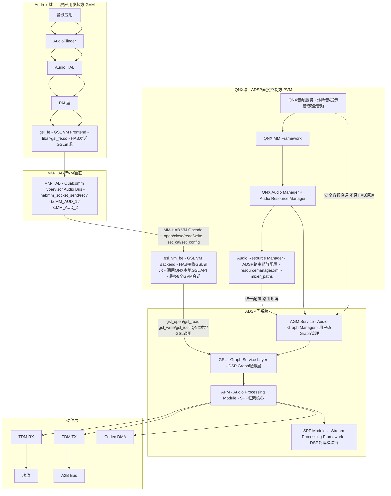
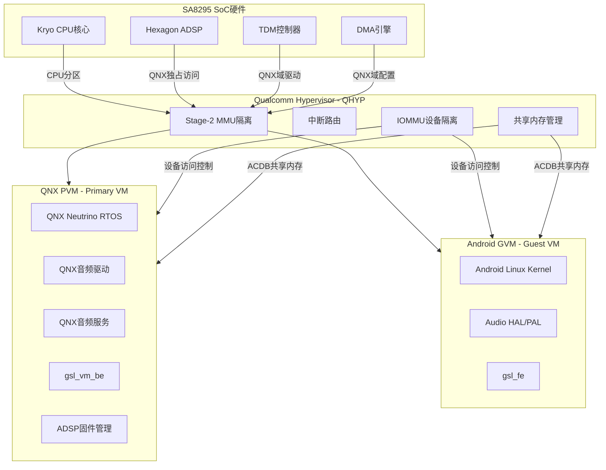
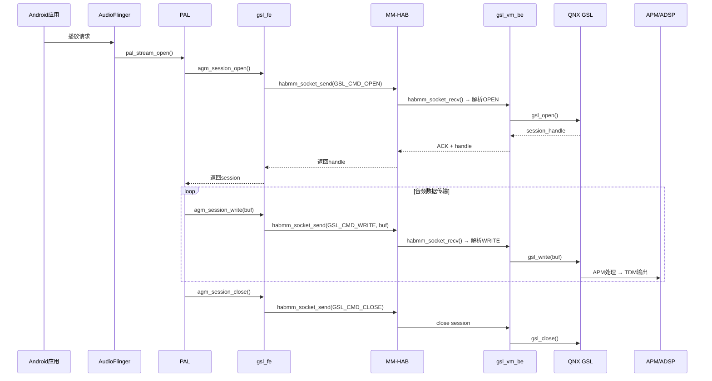
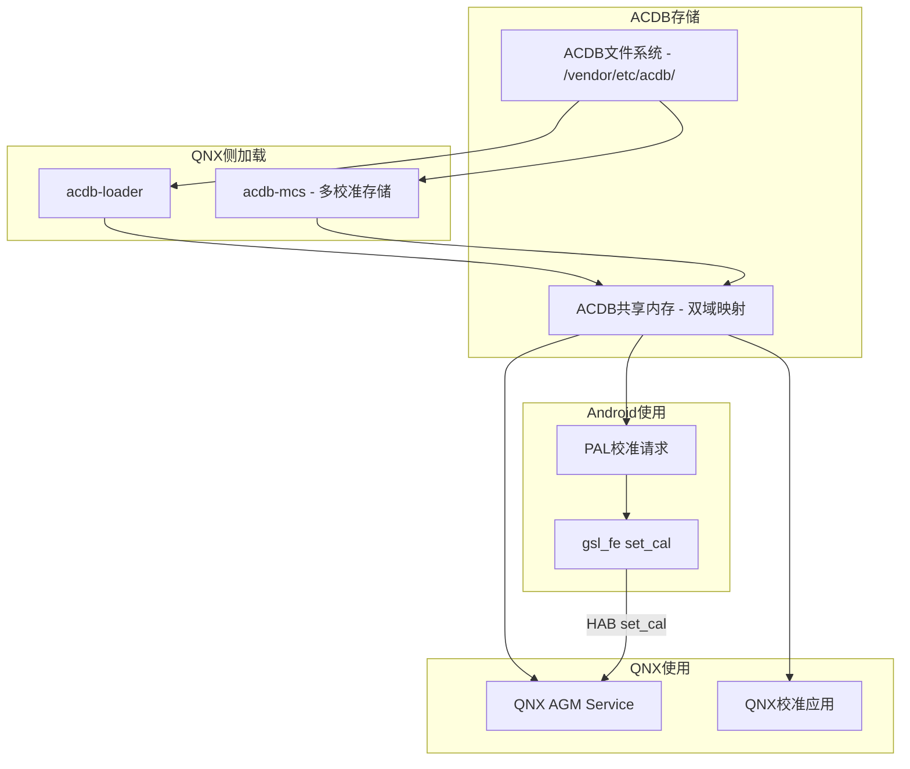
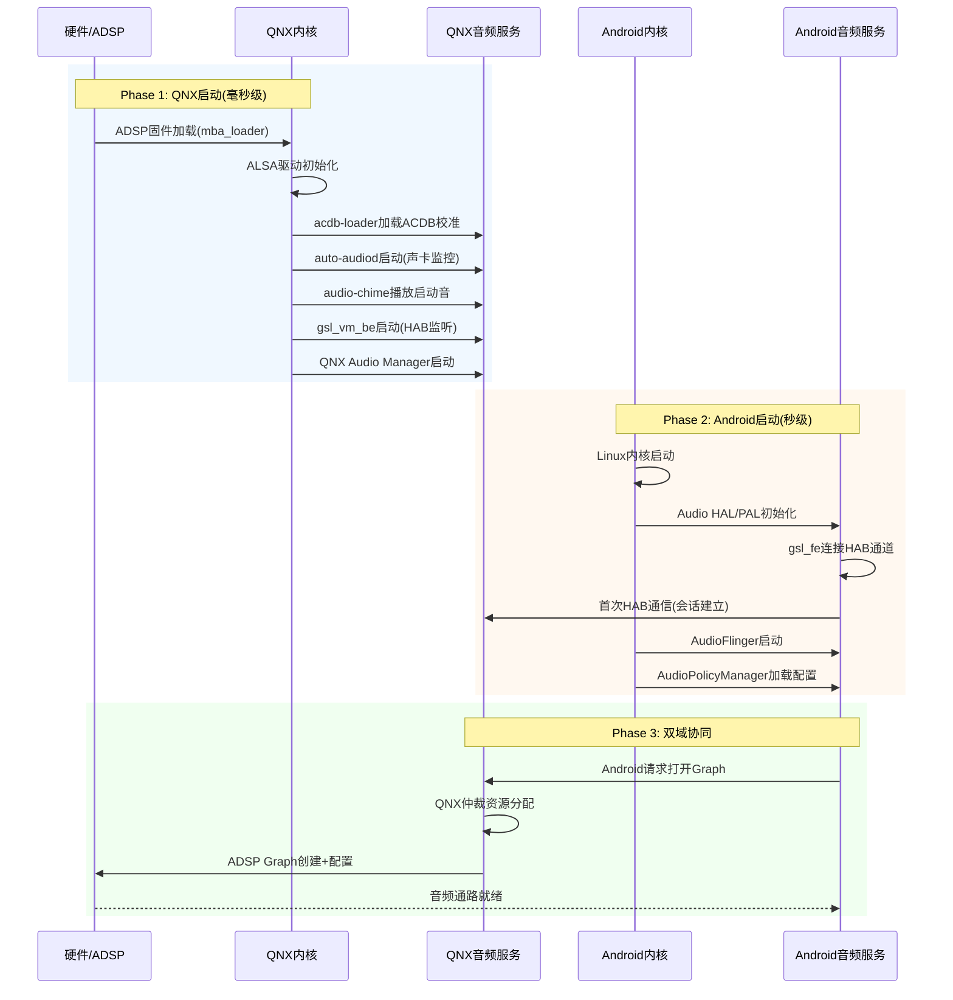

[← 返回16章](README.md) | [返回导航](../README.md) | [16.2 auto-audiod守护进程 →](16_16.2_auto-audiod守护进程.md)

---

## 16.1 概述

## 16.1.1 SA8295平台音频架构总览

高通SA8295是面向汽车信息娱乐系统(IVI)的高性能SoC，其音频架构采用**QNX主控+Android协作**的双域设计。核心架构特征：

- **QNX是ADSP唯一控制方** — QNX内置Audio Resource Manager，是唯一有权直接下发指令给ADSP固件的系统，所有物理音频通道/硬件混音/麦克风/功放开关统一由QNX配置ADSP路由矩阵(resourcemanager.xml/mixer_paths)
- **Android是上层应用发起方** — Android域无底层硬件控制权，音频请求通过GSL VM前端(gsl_fe)经MM-HAB跨虚拟化通道提交给QNX域的GSL VM后端(gsl_vm_be)，由QNX仲裁后统一通过GSL→APM下发ADSP
- **安全音频QNX直通** — 倒车雷达/仪表告警/碰撞预警/胎压提示等安全类音频完全由QNX独立生成+直通ADSP，不受Android崩溃影响
- **Hypervisor硬件隔离** — Android死机/崩溃时，Hypervisor保证QNX/ADSP/仪表告警音频完全不受影响



## 16.1.2 SA8295 SoC硬件架构深度解析

### 16.1.2.1 CPU/DSP核心布局

SA8295采用多核异构设计，为虚拟化双域架构提供硬件基础：

| 计算单元 | 核心配置 | 运行域 | 音频职责 |
|---------|---------|--------|---------|
| Kryo CPU | 8x Cortex-A76/A55 | Android(GVM) + QNX(PVM) | Android运行应用/Framework/PAL；QNX运行音频守护进程/驱动 |
| Hexagon DSP (ADSP) | 多核HVX+Hexagon向量 | QNX域独占控制 | 实时音频处理、Graph执行、硬件混音、编解码 |
| Compute DSP (CDSP) | Hexagon标量+向量 | Android域 | 语音识别、降噪算法、音效后处理 |
| Sensor DSP (SDSP) | 低功耗Hexagon | QNX域 | 传感器融合、低功耗音频唤醒 |
| Hexagon DSP (ADSP) | 独立固件 | QNX通过GSL→APM控制 | APM模块调度、SPF Pipeline执行、TDM/MI2S数据搬运 |

> **关键约束**：ADSP固件由QNX域独占加载和管理，Android域无法直接访问ADSP寄存器或固件接口。这是Hypervisor MMU隔离的硬件保障。

### 16.1.2.2 音频硬件接口

SA8295提供多种音频硬件接口，用于连接外部Codec、功放、A2B总线等：

| 接口类型 | 方向 | 典型用途 | 最大通道数 |
|---------|------|---------|-----------|
| TDM (Time Division Multiplex) | TX/RX | 连接外部DSP/Codec/A2B Master | 32ch/TDM端口 |
| MI2S (Multi-channel I2S) | TX/RX | 连接本地DAC/ADC | 8ch/端口 |
| PCM | TX/RX | 蓝牙HFP/SCO语音 | 2ch/端口 |
| Codec DMA | TX/RX | 内部Codec直连 | 16ch |
| SoundWire | TX/RX | 连接SoundWire设备 | 8ch/端口 |
| PDM | RX | 数字麦克风阵列 | 8ch |

典型车载音频TDM通道分配示例：

```
TDM Port 0 (Pri_TDM_RX_0): 前排扬声器(4ch) → 左前/右前/左后/右后
TDM Port 1 (Pri_TDM_RX_1): 中排扬声器(4ch) → 左中/右中/顶左/顶右
TDM Port 2 (Sec_TDM_RX_0): 重低音(2ch) → Sub_L/Sub_R
TDM Port 3 (Sec_TDM_RX_1): 独立音频区(2ch) → HUD/后排娱乐
TDM Port 4 (Pri_TDM_TX_0): 麦克风阵列(4ch) → 前排4麦
TDM Port 5 (Sec_TDM_TX_0): A2B总线回采(4ch) → 后排4麦
```

### 16.1.2.3 硬件加速器

ADSP内部包含多个硬件加速器模块，由SPF框架调度：

| 加速器 | 功能 | 使用场景 |
|--------|------|---------|
| HW Encoder | AAC/LC3/MP3/SBC硬件编码 | 蓝牙输出、录制压缩 |
| HW Decoder | AAC/LC3/MP3/SBC硬件解码 | 低功耗音乐播放 |
| EC/NS | 回声消除/噪声抑制 | 语音通话、语音助手 |
| AGC | 自动增益控制 | 麦克风增益自适应 |
| KWS | 关键词检测 | 语音唤醒(OK Google) |
| AFE | Audio Front End | 多通道输入处理、AEC参考信号注入 |

## 16.1.3 QNX+Android双域虚拟化架构深度解析

### 16.1.3.1 Hypervisor与VM隔离

SA8295使用Qualcomm Hypervisor(QHYP)将SoC资源划分为多个虚拟机(VM)：



Hypervisor提供的核心隔离机制：

| 隔离维度 | 机制 | 说明 |
|---------|------|------|
| CPU隔离 | Stage-2 MMU | QNX和Android分别运行在独立的CPU核心子集上 |
| 内存隔离 | Stage-2 页表 | VM间内存不可直接访问，防止越权读写 |
| 设备隔离 | IOMMU/SMMU | 外设DMA只能访问分配给该VM的内存区域 |
| 中断隔离 | VGIC/虚拟中断 | 中断由Hypervisor路由到对应VM，不跨域泄漏 |
| 音频隔离 | MM-HAB | 音频跨VM通信仅通过HAB通道，无其他共享路径 |

### 16.1.3.2 MM-HAB跨VM通信机制

MM-HAB(Multi-Media Hypervisor Audio Bus)是Qualcomm Hypervisor提供的音频跨VM通信机制：

**通信架构**：
- **Android侧**：`libar-gsl_fe.so` → `habmm_socket_send()` → HAB通道 `MM_AUD_1`(TX)
- **QNX侧**：`gsl_vm_be` ← `habmm_socket_recv()` ← HAB通道 `MM_AUD_2`(RX)

**VM Opcode协议**：

| Opcode | 方向 | 功能 | 参数 |
|--------|------|------|------|
| GSL_CMD_OPEN | GVM→PVM | 打开GSL会话 | graph_key, acdb_id |
| GSL_CMD_CLOSE | GVM→PVM | 关闭GSL会话 | session_handle |
| GSL_CMD_READ | GVM→PVM | 读取音频数据 | buf_size, buf_ptr |
| GSL_CMD_WRITE | GVM→PVM | 写入音频数据 | buf_size, buf_ptr |
| GSL_CMD_IOCTL | GVM→PVM | 控制命令 | cmd_id, payload |
| GSL_CMD_SET_CAL | GVM→PVM | 设置校准数据 | acdb_id, cal_type, payload |
| GSL_CMD_SET_CONFIG | GVM→PVM | 设置Graph配置 | graph_key, config |
| GSL_CMD_GET_CONFIG | GVM→PVM | 获取Graph配置 | graph_key, param_id |

**会话管理**：
- `gsl_vm_be`最多支持`GSL_BE_MAX_SESSIONS=8`个并发GVM会话
- 每个会话独立管理Graph生命周期(open→config→read/write→close)
- 会话通过`session_handle`标识，QNX侧做资源仲裁

**数据流方向**：



### 16.1.3.3 VM标识与权限模型

| 属性 | QNX(PVM) | Android(GVM) |
|------|----------|-------------|
| VM ID | 0 (Primary) | 1+ (Guest) |
| ADSP访问 | 直接(GSL→APM) | 间接(gsl_fe→HAB→gsl_vm_be→GSL) |
| TDM配置 | 直接(resourcemanager.xml) | 无权限 |
| ACDB校准 | 持有+加载 | 共享读取 |
| 功放控制 | 直接(GPIO/I2C) | 无权限 |
| 安全音频 | 独立直通ADSP | 无权限 |
| 固件管理 | ADSP固件加载/SSR | 仅接收SSR通知 |

## 16.1.4 音频数据流完整路径

### 16.1.4.1 Android媒体播放完整路径

从Android应用到扬声器的完整音频数据流：

```
Android应用(AudioTrack)
  → AudioFlinger(MixerThread)
    → Audio HAL(primary HAL / AudioReach版)
      → PAL(pal_stream_write)
        → AGM Service(agm_session_write)
          → gsl_fe(libar-gsl_fe.so)
            → habmm_socket_send(GSL_CMD_WRITE)
              → [MM-HAB跨VM通道]
                → gsl_vm_be(habmm_socket_recv)
                  → QNX本地GSL(gsl_write)
                    → GSL(Graph Service Layer)
                      → APM(Audio Processing Module)
                        → SPF模块链(Decoder→Volume→Resampler→Mixer)
                          → ADSP硬件输出
                            → TDM TX控制器
                              → 外部Codec(DAC)
                                → 功放(AMP)
                                  → 扬声器(Speaker)
```

**各段延迟特征**：

| 路径段 | 典型延迟 | 缓冲策略 |
|--------|---------|---------|
| App→AudioFlinger | 5-20ms | AudioTrack buffer(通常2-4帧) |
| AudioFlinger→PAL | 2-5ms | MixerThread buffer |
| PAL→gsl_fe | 1-3ms | PAL内部ring buffer |
| gsl_fe→MM-HAB | 0.5-1ms | HAB共享内存零拷贝 |
| MM-HAB→gsl_vm_be | 0.3-0.5ms | Hypervisor调度开销 |
| gsl_vm_be→GSL→APM | 0.5-1ms | QNX本地GSL调用 |
| APM→ADSP→TDM | 1-5ms | ADSP内部pipeline |
| TDM→Codec→AMP | 0.1-0.5ms | 硬件传播 |
| **端到端总延迟** | **10-35ms** | 取决于缓冲配置 |

### 16.1.4.2 QNX安全音频直通路径

安全音频走完全独立的路径，不经过MM-HAB：

```
QNX安全音频源(倒车雷达ECU/仪表告警/碰撞预警)
  → QNX Audio Service(ams_lib)
    → QNX Audio Manager
      → AGM Service(agm_session_write, 安全音频专用Graph)
        → GSL(本地直连)
          → APM(安全音频专用SPF Pipeline)
            → ADSP安全输出路径
              → TDM TX(安全音频专用通道)
                → 安全音频Codec/DSP
                  → 功放
                    → 安全扬声器
```

**安全音频路径的关键保障**：

| 保障维度 | 机制 | 说明 |
|---------|------|------|
| 独立Graph | 安全音频专用Graph实例 | 不与媒体Graph共享，避免资源竞争 |
| 独立TDM通道 | 预留TDM slot | mixer_paths中固定分配，不动态重路由 |
| 优先级最高 | ADSP内最高调度优先级 | 安全音频Graph优先执行，不被媒体抢占 |
| 独立校准 | 安全音频专用ACDB表 | 不受Android侧校准更新影响 |
| 无VM依赖 | 不经MM-HAB通道 | Android域崩溃完全不影响安全音频通路 |

### 16.1.4.3 麦克风录音路径

```
麦克风阵列
  → A2B Bus / PDM / MI2S
    → TDM RX控制器
      → ADSP AFE(Audio Front End)
        → APM SPF Pipeline(EC/NS/AGC)
          → GSL(本地或HAB)
            → QNX AGM / Android gsl_fe
              → PAL / QNX Audio Service
                → AudioFlinger / QNX应用
```

## 16.1.5 双域音频资源隔离机制

### 16.1.5.1 TDM通道隔离

TDM通道在`resourcemanager.xml`中预分配，QNX和Android各使用不同的TDM slot：

```xml
<!-- resourcemanager.xml TDM通道分配示例 -->
<!-- 安全音频专用TDM通道 - QNX独占 -->
<device name="SEC_TDM_RX_0" ch="1,2" usage="safety"/>

<!-- 媒体音频TDM通道 - Android通过GSL使用 -->
<device name="PRI_TDM_RX_0" ch="1,2,3,4" usage="media"/>
<device name="PRI_TDM_RX_1" ch="1,2,3,4" usage="media"/>

<!-- 麦克风TDM通道 - 双域可共享，由QNX仲裁 -->
<device name="PRI_TDM_TX_0" ch="1,2,3,4" usage="record"/>
```

### 16.1.5.2 Graph实例隔离

| 隔离维度 | QNX(PVM) | Android(GVM) |
|---------|----------|-------------|
| Graph创建 | 直接调用AGM API | 通过gsl_fe→HAB→gsl_vm_be代理 |
| Graph类型 | 安全音频+诊断音+提示音 | 媒体播放+导航+语音助手 |
| 实例数量 | 无限制(受ADSP资源约束) | 最多8个并发会话 |
| 优先级 | 安全>诊断>提示 | 媒体/导航/语音同级 |
| 生命周期 | QNX Audio Manager管理 | gsl_vm_be管理 |

### 16.1.5.3 ACDB校准数据共享

ACDB(Audio Calibration Database)是双域共享的关键数据：



- QNX持有ACDB文件，由`acdb-loader`在启动时加载到共享内存
- Android通过PAL读取ACDB校准数据，通过HAB通道发送到QNX侧AGM
- `acdb-mcs`支持多校准存储(Multi-Calibration Store)，按场景切换
- `acdb-rtac`支持运行时校准更新(Runtime ACDB)

### 16.1.5.4 PCM设备隔离

Linux ALSA PCM设备由QNX域的ALSA驱动管理，Android通过GSL间接使用：

| PCM设备 | 管理域 | 使用方 | 说明 |
|---------|--------|--------|------|
| pcm0p/0c | QNX | 安全音频 | 安全播放/录制专用 |
| pcm1p | QNX(AGM) | Android(通过HAB) | 媒体播放Graph |
| pcm2c | QNX(AGM) | Android(通过HAB) | 麦克风录制Graph |
| pcm3p | QNX | 诊断音 | 提示音播放 |

## 16.1.6 启动时序与依赖关系

### 16.1.6.1 启动时序图

SA8295音频子系统启动遵循严格的依赖顺序：



### 16.1.6.2 启动依赖链

```
ADSP固件加载(mba_loader)
  ├── ALSA驱动(probe → 声卡注册)
  │     ├── acdb-loader(ACDB校准加载到共享内存)
  │     │     ├── AGM Service(Graph管理能力)
  │     │     │     ├── gsl_vm_be(HAB后端就绪)
  │     │     │     │     └── Android gsl_fe可连接 ←── Android启动
  │     │     │     └── QNX Audio Manager(安全音频就绪)
  │     │     └── auto-audiod(声卡状态监控就绪)
  │     └── audio-chime(启动提示音播放)
  └── QNX Audio Resource Manager(路由矩阵配置完成)
```

**关键启动约束**：
1. ADSP固件必须先于所有音频服务加载完成
2. ACDB校准必须先于AGM Service初始化
3. gsl_vm_be必须先于Android gsl_fe连接
4. 安全音频通路在QNX启动后立即可用，不依赖Android

### 16.1.6.3 SSR(Subsystem Restart)恢复时序

当ADSP发生SSR时，恢复顺序：

```
ADSP SSR事件触发
  → QNX: auto-audiod检测到SSR通知
    → QNX: acdb-loader重新加载ACDB校准
    → QNX: AGM Service重建Graph
    → QNX: gsl_vm_be通知Android(gsl_fe收到SSR回调)
      → Android: PAL处理SSR回调
        → Android: 关闭旧Stream/Session
        → Android: 重新打开Stream/Session
          → 重新建立完整音频通路
```

## 16.1.7 各组件职责速查表

| 组件 | 所属域 | 层级 | 核心职责 | 章节链接 |
|------|--------|------|---------|---------|
| auto-audiod | QNX | 守护进程 | 声卡状态监控、SSR恢复触发、静音启动控制 | [16.2](16_16.2_auto-audiod守护进程.md) |
| AutoPower | QNX | 守护进程 | 电源状态管理、VHAL集成、休眠唤醒音频恢复 | [16.3](16_16.3_AutoPower与VHAL集成.md) |
| Silent Boot | QNX | 监控机制 | 启动期间静音控制、防止爆音 | [16.4](16_16.4_Silent_Boot监控.md) |
| audio-chime | QNX | 守护进程 | 早期启动提示音播放、不依赖Android | [16.5](16_16.5_audio-chime早期提示音.md) |
| acdb-loader | QNX | 工具 | ACDB校准数据加载到共享内存 | [16.6](16_16.6_ACDB校准体系.md) |
| acdb-mcs | QNX | 工具 | 多校准存储(Multi-Calibration Store) | [16.6](16_16.6_ACDB校准体系.md) |
| acdb-fts | QNX | 工具 | ACDB文件传输服务 | [16.6](16_16.6_ACDB校准体系.md) |
| acdb-rtac | QNX | 工具 | 运行时ACDB校准更新 | [16.6](16_16.6_ACDB校准体系.md) |
| ALSA UCM | QNX | 配置层 | ALSA用例管理、路由配置 | [16.8](16_16.8_ALSA_UCM配置.md) |
| auto-casa-xml | QNX | 配置层 | 音频流/设备资源配置 | [16.9](16_16.9_auto-casa-xml配置.md) |
| AGM Service | QNX | 服务 | Audio Graph Manager，Graph生命周期管理 | [16.10](16_16.10_AGMAudio_Graph_Manager深度解.md) |
| GSL (Graph Service Layer) | QNX/ADSP | 库 | 音频图创建/配置/启停的底层接口，被 AGM 封装调用 | [16.11](16_16.11_SessionGsl与GSL接口.md) |
| gsl_fe | Android | 库 | GSL VM前端，HAB发送端 | [16.13](16_16.13_Primary_HALAudioReach版深度解.md) |
| gsl_vm_be | QNX | 服务 | GSL VM后端，HAB接收端 | [16.14](16_16.14_GSLGraph_Service_Layer内部架.md) |
| QNX audio_driver_vm | QNX | 驱动 | VM音频驱动层 | [16.16](16_16.16_QNX_audio_driver_vm_VM音频驱动层.md) |
| QNX audio_service_vm | QNX | 服务 | VM音频服务 | [16.17](16_16.17_QNX_audio_service_vm_VM音频服务.md) |
| QNX ams_lib | QNX | 库 | 音频管理服务库 | [16.18](16_16.18_QNX_ams_lib_音频管理服务库.md) |
| QNX apr_lib | QNX | 库 | APR协议库(ADSP通信) | [16.19](16_16.19_QNX_apr_lib_APR协议库.md) |
| QNX audio_a2b | QNX | 驱动 | A2B总线音频驱动 | [16.20](16_16.20_QNX_audio_a2b_A2B总线音频.md) |
| QNX audio_dac | QNX | 驱动 | DAC音频驱动 | [16.21](16_16.21_QNX_audio_dac_DAC音频驱动.md) |
| QNX audio_expander | QNX | 驱动 | 音频扩展器驱动 | [16.22](16_16.22_QNX_audio_expander_音频扩展器.md) |

## 16.1.8 关键配置文件清单

### 16.1.8.1 QNX域配置文件

| 配置文件 | 路径 | 用途 |
|---------|------|------|
| resourcemanager.xml | /etc/audio/ | ADSP路由矩阵配置，TDM通道分配 |
| mixer_paths.xml | /etc/audio/ | ALSA Mixer路由路径定义 |
| auto-casa-xml | /etc/audio/ | 音频流/设备资源配置 |
| ACDB文件 | /vendor/etc/acdb/ | 校准数据(ADC, CRC等) |
| UCM配置 | /usr/share/alsa/ucm/ | ALSA Use Case Manager配置 |
| gsl_vm_be.cfg | /etc/audio/ | GSL VM后端配置(会话数等) |
| auto-audiod.cfg | /etc/audio/ | auto-audiod守护进程配置 |

### 16.1.8.2 Android域配置文件

| 配置文件 | 路径 | 用途 |
|---------|------|------|
| audio_policy_configuration.xml | /vendor/etc/ | AudioPolicy设备/路由配置 |
| audio_policy_volumes.xml | /vendor/etc/ | 音量曲线配置 |
| default_volume_tables.xml | /vendor/etc/ | 默认音量表 |
| car_audio_configuration.xml | /vendor/etc/ | AAOS车辆音频区配置 |
| audio_effects.conf | /vendor/etc/ | 音效配置 |
| HAL配置 | /vendor/etc/ | Audio HAL模块配置 |

### 16.1.8.3 双域共享配置

| 配置 | 共享方式 | 说明 |
|------|---------|------|
| ACDB校准数据 | 共享内存映射 | QNX加载，Android读取 |
| ADSP Graph拓扑 | GSL API交互 | Android通过HAB提交，QNX仲裁 |
| TDM通道分配 | resourcemanager.xml | QNX独占管理，Android间接使用 |

## 16.1.9 调试接口概述

### 16.1.9.1 QNX域调试接口

| 调试手段 | 命令/工具 | 用途 |
|---------|----------|------|
| ALSA调试 | amixer contents / aplay -l | 查看ALSA mixer状态和PCM设备 |
| AGM调试 | agmplay / agmcap / agmcompress | AGM测试工具，直接测试Graph |
| GSL调试 | gsl_debug日志 | GSL操作日志追踪 |
| HAB调试 | hab_stat / hab_dump | MM-HAB通道状态和统计 |
| ACDB调试 | acdb-test | ACDB校准数据验证 |
| ADSP调试 | fastrpc_dump / adsp_stderr | ADSP状态dump和错误日志 |
| auto-audiod日志 | slog2info -l auto-audiod | 声卡监控日志 |
| QNX系统日志 | slog2info / dmesg | QNX内核和系统日志 |

### 16.1.9.2 Android域调试接口

| 调试手段 | 命令/工具 | 用途 |
|---------|----------|------|
| PAL日志 | adb logcat -s PAL | PAL层操作日志 |
| AudioFlinger日志 | adb logcat -s AudioFlinger | AudioFlinger状态 |
| HAL日志 | adb logcat -s AudioHAL | Audio HAL日志 |
| GSL FE日志 | adb logcat -s gsl_fe | gsl_fe前端日志 |
| HAB日志 | adb logcat -s mm-hab | HAB通道日志 |
| tinymix | adb shell tinymix | ALSA mixer控制(有限) |
| tinyplay | adb shell tinyplay | PCM播放测试 |
| audio_policy | adb logcat -s AudioPolicy | 音频策略日志 |

### 16.1.9.3 跨域调试要点

1. **HAB通道状态**：当音频无声时，首先检查HAB通道是否连通(`hab_stat`)
2. **ACDB校准**：校准数据不一致时，检查双域是否共享同一套ACDB
3. **Graph状态**：ADSP Graph创建失败时，分别查看gsl_fe和gsl_vm_be日志
4. **SSR恢复**：ADSP重启后，确认acdb-loader重新加载和AGM Graph重建
5. **TDM路由**：路由错误时，检查resourcemanager.xml和mixer_paths配置

---

[← 返回16章](README.md) | [返回导航](../README.md) | [16.2 auto-audiod守护进程 →](16_16.2_auto-audiod守护进程.md)