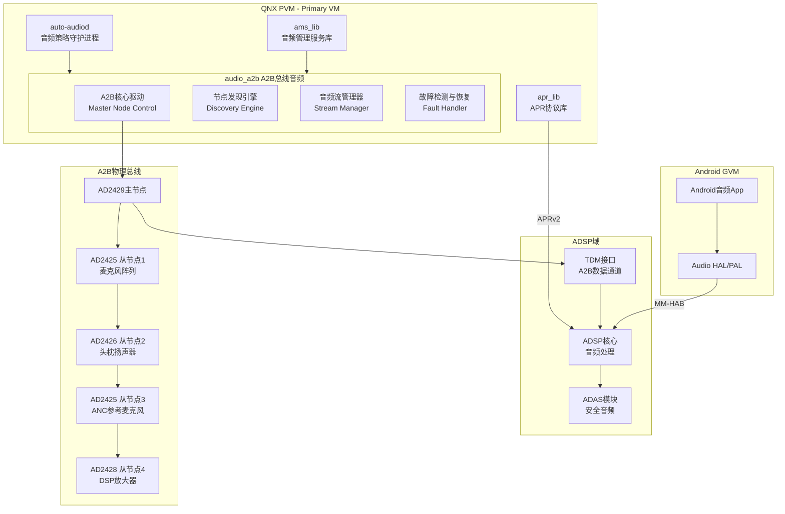
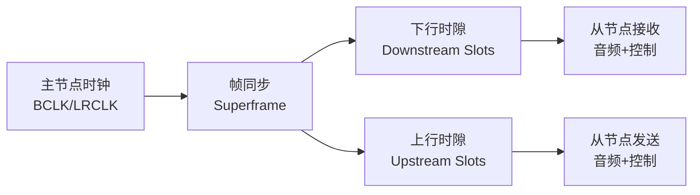
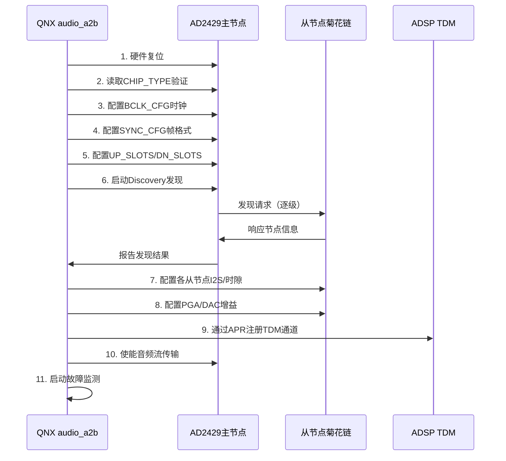
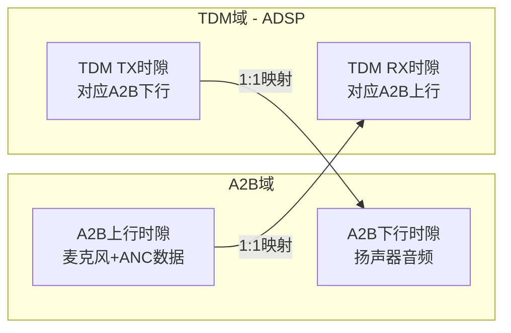
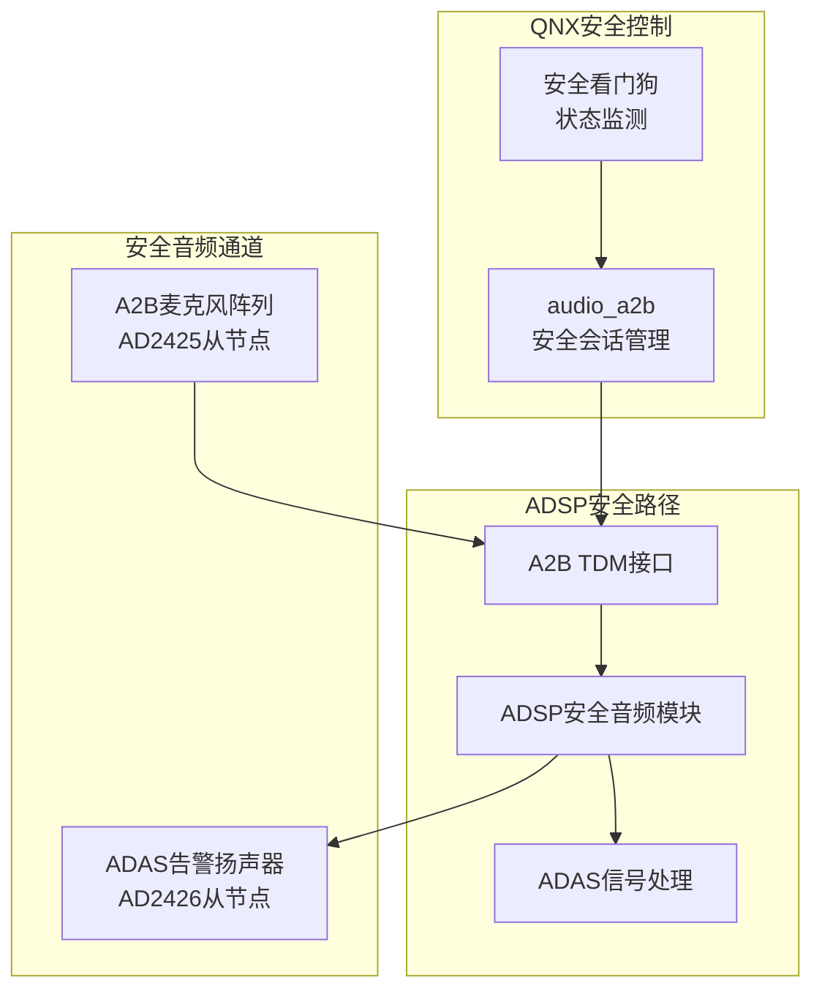
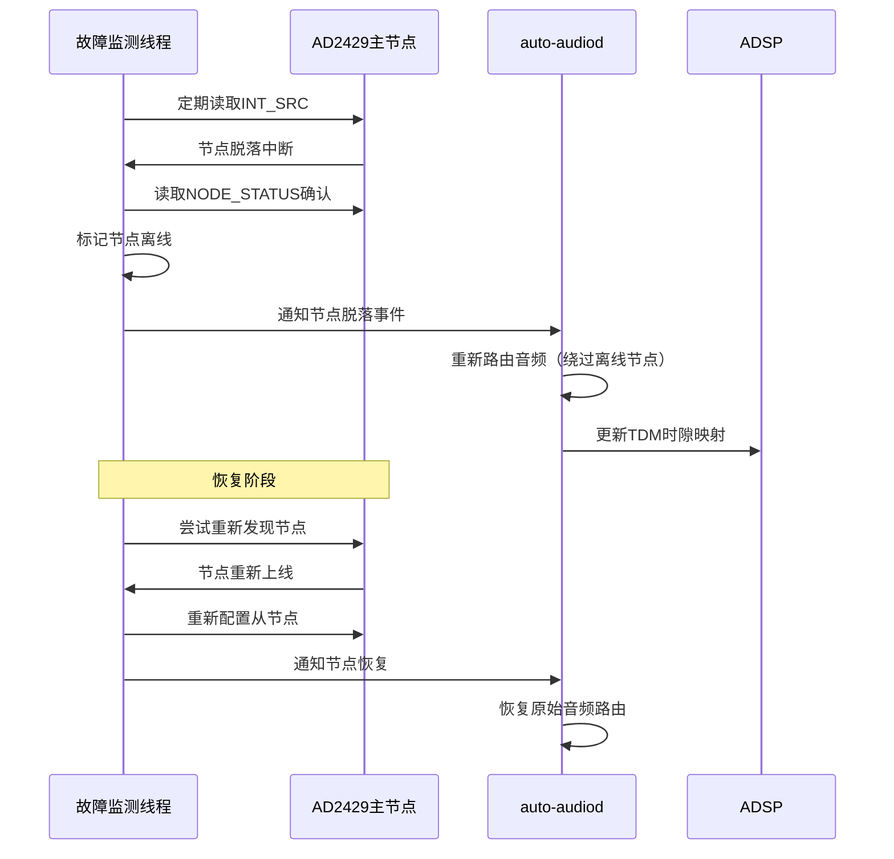
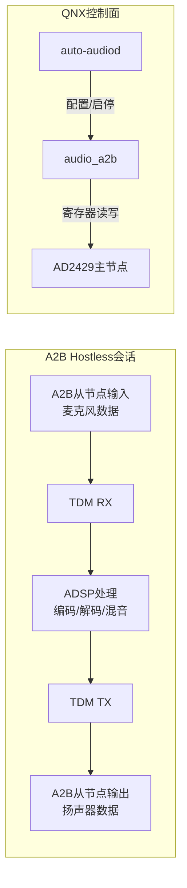
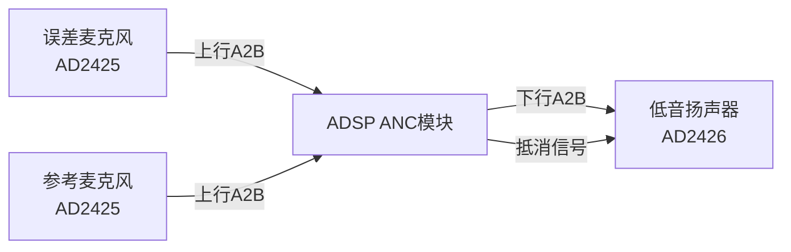
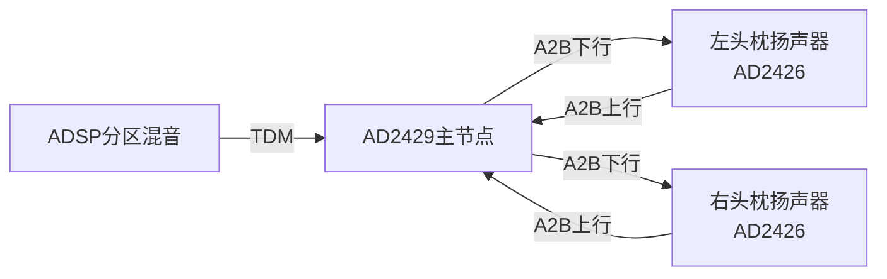
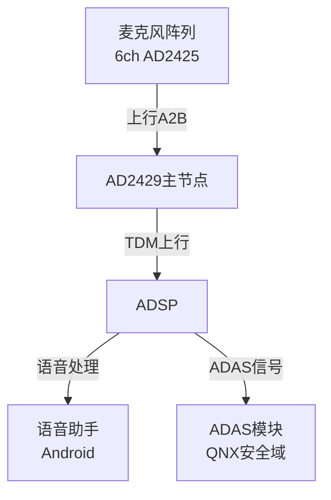

[← 16.19 QNX apr_lib APR协议库](16_16.19_QNX_apr_lib_APR协议库.md) | [← 返回16章](README.md) | [返回导航](../README.md) | [16.21 QNX audio_dac DAC音频驱动 →](16_16.21_QNX_audio_dac_DAC音频驱动.md)

---

## 16.20 audio_a2b — QNX A2B总线音频驱动

### 16.20.1 概述

`audio_a2b` 是QNX域中A2B（Automotive Audio Bus）总线的音频驱动模块。A2B是Analog Devices公司开发的汽车音频总线协议，用于在车载音频系统中实现**低延迟、低成本、数字音频分布式传输**。在SA8295平台上，audio_a2b负责QNX域对A2B总线主节点的控制，将A2B远端节点的音频数据接入ADSP处理管线。

> **架构归属说明**
> `audio_a2b` 属于 **Elite 架构**下的音频驱动组件，真实源码路径为：
> `Qnx/apps/qnx_ap/AMSS/multimedia/audio/audio_elite/audio_driver/audio_a2b/`
> 它位于 `audio_elite/audio_driver/` 目录，与 audio_driver_vm（16.16）同属 Elite 架构的驱动层。（注：本节示例中的 `vendor/qcom/proprietary/audio_a2b/` 为逻辑归类路径，磁盘实际路径以上述 QNX 源码树为准。）

#### 架构定位

| 维度 | 说明 |
|------|------|
| 层级 | QNX音频栈外设驱动层 |
| 运行域 | QNX PVM（Primary VM） |
| 驱动类型 | QNX资源管理器（Resource Manager），预编译二进制 |
| 核心职责 | A2B总线主节点控制、远端节点发现/配置、数字音频数据收发 |
| 与Android关系 | Android不直接控制A2B；A2B音频经QNX→ADSP→TDM路径输出 |
| 安全属性 | A2B可用于安全音频通道（如A2B麦克风阵列输入ADAS告警音频） |

#### A2B总线核心特性

A2B（Automotive Audio Bus）是面向汽车音频的数字化总线协议，其核心特性包括：

| 特性 | 说明 |
|------|------|
| 物理层 | 单对双绞线（UTP），同时传输时钟、数据、供电 |
| 拓扑结构 | 主从菊花链：1主节点 + 最多10从节点 |
| 节点延迟 | 节点间约50μs，整条链路<1ms |
| 带宽能力 | 最多32通道×32bit@48kHz（上行+下行合计） |
| 供电方式 | 幻象供电（Phantom Power），总线可为从节点供电，简化线束 |
| 采样率 | 支持44.1kHz/48kHz，车载典型48kHz |
| 采样位宽 | 16/24/32bit可配置 |
| 线缆长度 | 节点间距最长15m，整条链路最长40m |

#### 与其他QNX组件的关系

| 组件 | 交互方式 | 说明 |
|------|----------|------|
| audio_driver_vm | APRv2消息 | A2B驱动通过APRv2与ADSP交互控制命令 |
| ams_lib | TDM注册绑定 | A2B的TDM接口通过ams_lib注册为音频数据通道 |
| audio_dac | 协同工作 | A2B远端可能连接DAC芯片完成模拟输出 |
| audio_expander | 扩展管理 | A2B节点的I2S扩展通过expander管理 |
| auto-audiod | 会话控制 | A2B会话由auto-audiod策略守护进程管理 |

### 16.20.2 系统架构

#### 整体架构图



#### A2B节点菊花链拓扑

```
SA8295 ADSP
    │
    ├── TDM (I2S/TDM8)
    │
A2B主节点 AD2429 ─── A2B双绞线总线 ─── 从节点1 AD2425 (麦克风阵列, 距离≤15m)
    │                                            │
    │                                      从节点2 AD2426 (头枕扬声器L/R)
    │                                            │
    │                                      从节点3 AD2425 (ANC参考麦克风)
    │                                            │
    │                                      从节点4 AD2428 (DSP放大器)
    │
    └── QNX audio_a2b 驱动控制
```

### 16.20.3 A2B总线协议深度解析

#### 帧格式与同步

A2B总线采用同步时分复用（TDM）帧格式，每个超级帧（Superframe）包含：

| 帧结构 | 说明 |
|--------|------|
| 同步头 | 主节点发送的帧同步标记，用于从节点锁定 |
| 下行数据域 | 主节点→从节点方向音频数据+控制数据 |
| 上行数据域 | 从节点→主节点方向音频数据+控制数据 |
| CRC校验 | 每帧尾部CRC校验保护数据完整性 |

#### 时钟与同步机制



A2B总线的时钟体系：

| 时钟信号 | 方向 | 说明 |
|----------|------|------|
| BCLK | 主节点→从节点 | 位时钟，由主节点生成，典型12.288MHz |
| LRCLK | 主节点→从节点 | 左右声道时钟，与采样率同步，48kHz |
| SYNC | 主节点→从节点 | 超级帧同步信号，标记帧起始 |
| DATA_DN | 主节点→从节点 | 下行串行数据（音频+控制） |
| DATA_UP | 从节点→主节点 | 上行串行数据（音频+控制） |

#### A2B发现协议

A2B发现协议（Discovery Protocol）是主节点自动扫描菊花链从节点的过程：

1. **主节点发送发现命令**：通过下行控制时隙发送节点0发现请求
2. **从节点响应**：第一个从节点响应，报告自身类型和配置
3. **节点地址分配**：主节点分配节点ID（0, 1, 2...）
4. **逐级发现**：每个已发现节点转发发现命令到下一级
5. **发现完成**：主节点收到所有从节点响应或超时

### 16.20.4 AD242x芯片系列详解

#### 芯片系列对比

| 芯片型号 | 角色 | I2S/TDM通道 | GPIO | 幻象供电 | 典型应用 |
|----------|------|-------------|------|----------|----------|
| AD2429 | 主节点 | 4×TDM | 4 | 输出 | 主控节点，连接ADSP |
| AD2428 | 主/从节点 | 4×TDM | 4 | 输出/接收 | 高端放大器节点 |
| AD2427 | 从节点 | 2×I2S | 2 | 接收 | 基础从节点 |
| AD2426 | 从节点 | 2×I2S | 2 | 接收 | 扬声器/麦克风节点 |
| AD2425 | 从节点 | 2×I2S | 2 | 接收 | 麦克风阵列节点 |

#### AD2429主节点关键寄存器

| 寄存器地址 | 名称 | 功能说明 |
|-----------|------|----------|
| 0x0000 | CHIP_TYPE | 芯片类型标识，读取0x29表示AD2429 |
| 0x0001 | VERSION | 芯片版本号 |
| 0x0002 | VENDOR_ID | 厂商ID（Analog Devices） |
| 0x0100 | CONTROL | 主控制寄存器：复位、使能、发现启动 |
| 0x0101 | INT_MASK | 中断屏蔽寄存器 |
| 0x0102 | INT_SRC | 中断源状态 |
| 0x0200 | BCLK_CFG | BCLK配置：频率、极性 |
| 0x0201 | SYNC_CFG | 同步配置：帧格式、采样率 |
| 0x0202 | UP_SLOTS | 上行时隙数配置 |
| 0x0203 | DN_SLOTS | 下行时隙数配置 |
| 0x0300 | NODE_EN | 节点使能掩码 |
| 0x0301 | DISCOVERY | 发现控制寄存器 |

#### AD2425/AD2426从节点关键寄存器

| 寄存器地址 | 名称 | 功能说明 |
|-----------|------|----------|
| 0x0000 | CHIP_TYPE | 芯片类型：0x25=AD2425, 0x26=AD2426 |
| 0x0100 | CONTROL | 从节点控制：复位、使能 |
| 0x0200 | I2S_CFG | I2S配置：格式、位宽、通道 |
| 0x0201 | RX_SLOT | 接收时隙映射 |
| 0x0202 | TX_SLOT | 发送时隙映射 |
| 0x0300 | PGA_CFG | PGA增益配置（麦克风输入） |
| 0x0301 | DAC_CFG | DAC配置（扬声器输出） |

### 16.20.5 A2B主节点初始化完整时序

A2B主节点初始化是整个A2B系统启动的核心流程，由audio_a2b驱动在QNX启动阶段执行：



#### 初始化阶段详解

| 阶段 | 步骤 | 关键操作 | 耗时 |
|------|------|----------|------|
| 硬件复位 | 1 | 拉低RESET引脚≥10ms，释放等待5ms | ~15ms |
| 芯片验证 | 2 | 读取CHIP_TYPE=0x29，VERSION | ~1ms |
| 时钟配置 | 3 | 配置BCLK=12.288MHz，极性，驱动强度 | ~1ms |
| 帧格式配置 | 4 | 配置Superframe格式，采样率48kHz，位宽32bit | ~1ms |
| 时隙配置 | 5 | 配置上/下行时隙数和大小 | ~1ms |
| 节点发现 | 6 | 启动Discovery，扫描菊花链 | 50~500ms（取决于节点数） |
| 节点配置 | 7-8 | 逐节点配置I2S格式、时隙映射、增益 | 10~50ms/节点 |
| TDM绑定 | 9 | 通过APR向ADSP注册TDM通道 | ~10ms |
| 使能传输 | 10 | 使能音频数据收发 | ~1ms |
| 故障监测 | 11 | 启动CRC校验和节点在线检测 | 持续 |

### 16.20.6 A2B数据流深度解析

#### 上行/下行时隙分配

A2B总线的带宽被划分为上行和下行两个方向的时隙（Slot），每个时隙可承载一个音频通道：

```
A2B Superframe (48kHz周期 ≈ 20.83μs)
┌──────────────────────────────────────────────────────┐
│ 同步头 │ 下行时隙0 │ 下行时隙1 │ ... │ 下行时隙N │
│        │ (控制)    │ (音频CH0) │     │ (音频CHn) │
├────────┼──────────┼──────────┼─────┼──────────┤
│ CRC    │ 上行时隙0 │ 上行时隙1 │ ... │ 上行时隙M │
│        │ (控制)    │ (音频CH0) │     │ (音频CHm) │
└──────────────────────────────────────────────────────┘
```

#### 典型4节点系统时隙分配示例

| 时隙编号 | 方向 | 数据内容 | 目标节点 |
|----------|------|----------|----------|
| DN Slot 0 | 下行 | 控制命令 | 广播/指定节点 |
| DN Slot 1-2 | 下行 | 音频CH0-1（头枕L/R） | 从节点2 (AD2426) |
| DN Slot 3-4 | 下行 | 音频CH2-3（区域音频） | 从节点4 (AD2428) |
| UP Slot 0 | 上行 | 控制响应 | 主节点收集 |
| UP Slot 1-4 | 上行 | 音频CH0-3（麦克风阵列） | 从节点1 (AD2425) |
| UP Slot 5-6 | 上行 | 音频CH4-5（ANC参考） | 从节点3 (AD2425) |

#### TDM与A2B帧映射

A2B主节点通过TDM接口与ADSP交换数据，A2B帧与TDM帧之间存在明确的映射关系：



TDM与A2B帧映射规则：
- A2B上行时隙 → TDM RX时隙（ADSP接收麦克风数据）
- TDM TX时隙 → A2B下行时隙（ADSP发送扬声器数据）
- 时隙编号一一对应，无交叉映射
- 数据格式必须匹配：位宽、采样率、通道顺序

### 16.20.7 A2B与ADSP TDM接口绑定

#### TDM配置参数

A2B主节点通过TDM接口连接ADSP，以下为关键TDM配置参数：

| 参数 | 说明 | 典型值 |
|------|------|--------|
| tdm_mode | TDM模式 | TDM8（8通道） |
| sample_rate | 采样率 | 48000 Hz |
| bit_width | 位宽 | 32 bit |
| num_channels | 通道数 | 取决于A2B节点配置 |
| bclk_freq | BCLK频率 | 12.288 MHz |
| sync_src | 同步源 | 内部/外部 |
| data_format | 数据格式 | I2S/LJ/RJ |
| slot_mapping | 时隙映射 | 与A2B时隙一一对应 |

#### TDM绑定流程

A2B驱动通过ams_lib完成与ADSP的TDM绑定：

```c
// 伪代码：A2B TDM绑定流程
int a2b_tdm_bind(a2b_dev_t *dev)
{
    // 1. 通过ams_lib注册TDM端口
    ams_port_t tdm_port;
    tdm_port.direction = AMS_PORT_BIDIR;  // 双向
    tdm_port.tdm_mode = AMS_TDM_8;
    tdm_port.sample_rate = 48000;
    tdm_port.bit_width = 32;
    tdm_port.num_channels = dev->total_channels;
    ams_port_register(&tdm_port);

    // 2. 配置时隙映射
    for (int i = 0; i < dev->num_up_slots; i++) {
        ams_slot_map(AMS_DIR_RX, i, dev->up_slot_map[i]);
    }
    for (int i = 0; i < dev->num_dn_slots; i++) {
        ams_slot_map(AMS_DIR_TX, i, dev->dn_slot_map[i]);
    }

    // 3. 通过APR向ADSP声明TDM接口
    apr_cmd_t cmd;
    cmd.cmd_id = APR_CMD_TDM_REGISTER;
    cmd.param.tdm.port_id = tdm_port.id;
    cmd.param.tdm.config = &tdm_config;
    apr_send_cmd(dev->apr_handle, &cmd);

    return 0;
}
```

#### 数据格式匹配要点

| 要素 | A2B侧 | TDM侧 | 匹配要求 |
|------|--------|--------|----------|
| 采样率 | 48kHz | 48kHz | 必须一致 |
| 位宽 | 32bit | 32bit | 必须一致 |
| 通道数 | 上行+下行时隙 | TDM8=8通道 | 总通道数需对齐 |
| 字节序 | MSB First | MSB First | 必须一致 |
| 字节序 | MSB First | MSB First | 必须一致 |
| 时钟极性 | 上升沿采样 | 上升沿采样 | 必须一致 |

### 16.20.8 A2B安全音频通道

在SA8295双域架构中，A2B承担关键的安全音频传输角色，安全音频路径完全由QNX独立管理：

#### 安全音频架构



#### 安全音频路径详解

| 安全路径 | 数据流 | QNX控制 | Android可见性 |
|----------|--------|----------|---------------|
| 麦克风→ADAS | A2B从节点→TDM→ADSP ADAS模块 | QNX独立配置路由 | 不可见，不可控 |
| ADAS告警→扬声器 | ADSP ADAS模块→TDM→A2B从节点 | QNX独占告警通道 | 不可干预 |
| ANC参考→ADSP | A2B ANC麦克风→TDM→ADSP ANC模块 | QNX配置ANC路径 | 间接使用 |

#### 安全音频的关键保障

1. **独立路由**：安全A2B通道在ADSP内有独立路由路径，不经过Android可访问的音频管线
2. **优先级保障**：安全音频在ADSP内享有最高处理优先级
3. **QNX独占控制**：A2B安全通道的启停和路由完全由QNX决定
4. **故障隔离**：A2B安全通道故障不会影响Android音频域的正常运行

### 16.20.9 A2B故障处理深度

#### 故障类型与检测机制

| 故障类型 | 检测方式 | 检测延迟 | 严重级别 |
|----------|----------|----------|----------|
| 从节点脱落 | INT_SRC寄存器中断+CRC连续错误 | <1帧(≈21μs) | 高 |
| 总线CRC错误 | 每帧CRC校验失败计数 | 1帧 | 中 |
| 总线短路/开路 | 硬件检测+电流监测 | <100μs | 严重 |
| 时钟丢失 | BCLK/LRCLK超时检测 | <10μs | 严重 |
| 幻象供电异常 | 电流/电压监测 | <1ms | 高 |
| 从节点配置丢失 | 寄存器读回校验 | 定期轮询 | 中 |

#### 节点脱落检测与恢复流程



#### CRC校验与错误恢复

A2B总线每帧都携带CRC校验，CRC错误处理策略：

| CRC错误计数 | 处理策略 |
|-------------|----------|
| 1~3次/连续 | 标记警告，继续运行 |
| 4~10次/连续 | 触发节点重配置 |
| >10次/连续 | 判定节点脱落，触发恢复流程 |
| 偶发单次 | 忽略（A2B物理层可容忍偶发错误） |

#### 总线错误重置策略

```
总线错误检测
    │
    ├── CRC错误累计 < 阈值
    │       └── 继续运行 + 日志记录
    │
    ├── CRC错误累计 ≥ 阈值
    │       └── 尝试软重置从节点 → 重配置 → 验证
    │
    ├── 节点脱落
    │       └── 重新Discovery → 重配置 → 恢复
    │
    └── 总线级故障（短路/时钟丢失）
            └── 硬件复位整个A2B总线 → 完整初始化流程
```

### 16.20.10 A2B与auto-audiod协同

#### Hostless A2B会话管理

A2B音频会话在QNX域以hostless方式运行，即音频数据不经过QNX用户态处理，直接在ADSP与A2B硬件之间通过TDM传输：

| 会话属性 | 说明 |
|----------|------|
| 会话类型 | Hostless（无宿主应用） |
| 数据路径 | A2B从节点 ↔ ADSP（TDM直通） |
| QNX角色 | 仅负责配置、启停和故障管理 |
| 延迟 | 极低，QNX用户态不介入数据传输 |



#### SSR（Subsystem Restart Recovery）

当ADSP发生SSR（子系统重启）时，A2B会话需要恢复：

| SSR阶段 | A2B操作 |
|---------|---------|
| ADSP关闭通知 | QNX收到APR SSR通知，暂停A2B TDM数据传输 |
| ADSP重启等待 | QNX保持A2B总线运行，等待ADSP恢复 |
| ADSP恢复就绪 | QNX收到APR UP通知，重新绑定TDM通道 |
| A2B会话恢复 | 重新配置TDM时隙映射，恢复音频流 |
| 验证完成 | 检查A2B各节点状态，确认音频正常 |

### 16.20.11 A2B配置文件详解

#### a2b_config.xml结构

A2B驱动的配置通过XML文件描述，定义总线拓扑和节点参数：

```xml
<!-- a2b_config.xml 典型结构 -->
<a2b_config>
    <!-- 总线全局配置 -->
    <bus_config>
        <sample_rate>48000</sample_rate>
        <bit_width>32</bit_width>
        <bclk_freq>12288000</bclk_freq>
        <tdm_mode>8</tdm_mode>
        <sync_source>internal</sync_source>
    </bus_config>

    <!-- 主节点配置 -->
    <master_node>
        <chip_type>AD2429</chip_type>
        <i2c_bus>/dev/i2c0</i2c_bus>
        <i2c_addr>0x68</i2c_addr>
        <reset_gpio>GPIO_42</reset_gpio>
        <int_gpio>GPIO_43</int_gpio>
        <tdm_port>0</tdm_port>
    </master_node>

    <!-- 从节点描述符列表（按菊花链顺序） -->
    <slave_nodes>
        <slave_node id="0">
            <chip_type>AD2425</chip_type>
            <description>Microphone Array - Front</description>
            <i2s_config>
                <format>I2S</format>
                <bit_width>24</bit_width>
                <num_channels>4</num_channels>
            </i2s_config>
            <slot_mapping>
                <tx_slots>0,1,2,3</tx_slots>   <!-- 上行：麦克风4通道 -->
                <rx_slots></rx_slots>            <!-- 下行：无 -->
            </slot_mapping>
            <gain_config>
                <pga_gain_db>20</pga_gain_db>
            </gain_config>
        </slave_node>

        <slave_node id="1">
            <chip_type>AD2426</chip_type>
            <description>Headrest Speaker L/R</description>
            <i2s_config>
                <format>I2S</format>
                <bit_width>24</bit_width>
                <num_channels>2</num_channels>
            </i2s_config>
            <slot_mapping>
                <tx_slots></tx_slots>            <!-- 上行：无 -->
                <rx_slots>4,5</rx_slots>         <!-- 下行：扬声器2通道 -->
            </slot_mapping>
            <gain_config>
                <dac_gain_db>0</dac_gain_db>
            </gain_config>
        </slave_node>

        <slave_node id="2">
            <chip_type>AD2425</chip_type>
            <description>ANC Reference Microphone</description>
            <i2s_config>
                <format>I2S</format>
                <bit_width>24</bit_width>
                <num_channels>2</num_channels>
            </i2s_config>
            <slot_mapping>
                <tx_slots>6,7</tx_slots>         <!-- 上行：ANC麦克风2通道 -->
                <rx_slots></rx_slots>             <!-- 下行：无 -->
            </slot_mapping>
            <gain_config>
                <pga_gain_db>15</pga_gain_db>
            </gain_config>
        </slave_node>
    </slave_nodes>
</a2b_config>
```

#### 节点描述符关键字段

| 字段 | 说明 | 示例值 |
|------|------|--------|
| id | 菊花链中的序号（从0开始） | 0, 1, 2 |
| chip_type | AD242x芯片型号 | AD2425, AD2426 |
| i2s_config/format | I2S数据格式 | I2S, LJ, RJ |
| i2s_config/bit_width | I2S位宽 | 16, 24, 32 |
| i2s_config/num_channels | I2S通道数 | 2, 4 |
| tx_slots | 上行时隙分配（麦克风→主节点） | 0,1,2,3 |
| rx_slots | 下行时隙分配（主节点→扬声器） | 4,5 |
| pga_gain_db | 麦克风PGA增益 | 0~42 dB |
| dac_gain_db | DAC输出增益 | -60~+24 dB |

### 16.20.12 调试方法

#### A2B状态查询

通过QNX命令行工具查询A2B驱动状态：

```bash
# 查询A2B驱动整体状态
# audio-a2b为QNX资源管理器，通过/dev/audio/a2b访问
cat /dev/audio/a2b/status

# 查询指定从节点状态
cat /dev/audio/a2b/node/0/status
cat /dev/audio/a2b/node/1/status

# 查询A2B总线统计信息（CRC错误计数、帧计数等）
cat /dev/audio/a2b/stats
```

#### 节点在线检测

```bash
# 检测所有从节点在线状态
# 输出格式：node_id: chip_type: online/offline
for i in 0 1 2 3; do
    echo "Node $i: $(cat /dev/audio/a2b/node/$i/online)"
done

# 示例输出：
# Node 0: AD2425: online
# Node 1: AD2426: online
# Node 2: AD2425: offline
# Node 3: AD2428: online
```

#### 音频流验证

```bash
# 检查A2B音频流状态
cat /dev/audio/a2b/stream/upstream/status   # 上行流状态
cat /dev/audio/a2b/stream/downstream/status # 下行流状态

# 读取A2B寄存器（调试用）
# 通过I2C直接读取AD2429寄存器
i2c-tools -d /dev/i2c0 -a 0x68 -r 0x0000  # 读取CHIP_TYPE
i2c-tools -d /dev/i2c0 -a 0x68 -r 0x0102  # 读取INT_SRC
i2c-tools -d /dev/i2c0 -a 0x68 -r 0x0300  # 读取NODE_EN

# 触发节点重新发现
echo "rediscover" > /dev/audio/a2b/control
```

#### 常见调试场景

| 场景 | 调试步骤 |
|------|----------|
| 节点未发现 | 1. 检查硬件连接和供电<br/>2. 读取INT_SRC看是否有总线错误<br/>3. 手动触发rediscover |
| 音频无声 | 1. 确认节点在线<br/>2. 检查时隙映射配置<br/>3. 验证TDM通道绑定<br/>4. 检查PGA/DAC增益设置 |
| 间歇性中断 | 1. 查看CRC错误统计<br/>2. 检查线缆质量/长度<br/>3. 监测供电电压稳定性 |
| 启动时发现失败 | 1. 增加Discovery超时时间<br/>2. 检查从节点上电时序<br/>3. 确认复位时序正确 |

#### QNX slog2日志

```bash
# 过滤A2B相关日志
slog2info -w | grep -i a2b

# 过滤A2B错误日志
slog2info -w | grep -i "a2b.*error\|a2b.*fault\|a2b.*timeout"

# 过滤A2B发现相关日志
slog2info -w | grep -i "a2b.*discover\|a2b.*node"
```

### 16.20.13 典型车载A2B应用场景

#### 场景1：ANC主动降噪



| 参数 | 配置 |
|------|------|
| 上行通道 | 误差麦克风4ch + 参考麦克风2ch |
| 下行通道 | 低音扬声器2ch（含ANC抵消信号） |
| 延迟要求 | <2ms（端到端） |
| 安全等级 | QNX独立控制，Android可触发但不可干预 |

#### 场景2：头枕扬声器（分区音频）



| 参数 | 配置 |
|------|------|
| 下行通道 | 左头枕2ch + 右头枕2ch |
| 上行通道 | 头枕集成麦克风各2ch |
| 分区控制 | 各头枕独立音量和音源 |
| 数据流 | Android媒体→ADSP→TDM→A2B→头枕 |

#### 场景3：麦克风阵列（语音助手+ADAS）



| 参数 | 配置 |
|------|------|
| 上行通道 | 6ch麦克风阵列 |
| 语音路径 | ADSP→MM-HAB→Android语音助手 |
| 安全路径 | ADSP→ADAS安全模块（QNX独立） |
| 数据共享 | 同一A2B输入，双路径输出 |

#### 场景4：远程DSP放大器


| 参数 | 配置 |
|------|------|
| 下行通道 | 多声道音频（4~8ch） |
| 从节点功能 | AD2428内置DSP可做均衡/分频 |
| 优势 | 数字传输到放大器，减少模拟线束 |
| 延迟 | 放大器处理+传输约1~3ms |

### 16.20.14 关键API参考

#### 总线控制API

| API | 说明 | 参数 |
|-----|------|------|
| `a2b_bus_init(config)` | 初始化A2B总线 | 总线配置结构体 |
| `a2b_bus_deinit()` | 反初始化A2B总线 | 无 |
| `a2b_bus_reset()` | 硬件复位A2B总线 | 无 |
| `a2b_bus_get_status()` | 获取总线状态 | 返回状态结构体 |

#### 节点管理API

| API | 说明 | 参数 |
|-----|------|------|
| `a2b_node_discover()` | 扫描并发现所有从节点 | 超时时间(ms) |
| `a2b_node_configure(node_id, config)` | 配置指定从节点 | 节点ID+配置结构体 |
| `a2b_node_get_status(node_id)` | 获取从节点状态 | 节点ID |
| `a2b_node_set_gain(node_id, gain_db)` | 设置节点增益 | 节点ID+增益值 |
| `a2b_node_read_reg(node_id, addr)` | 读取从节点寄存器 | 节点ID+寄存器地址 |
| `a2b_node_write_reg(node_id, addr, val)` | 写入从节点寄存器 | 节点ID+地址+值 |

#### 音频流API

| API | 说明 | 参数 |
|-----|------|------|
| `a2b_stream_open(direction, config)` | 打开音频流 | 方向(UP/DN)+流配置 |
| `a2b_stream_close(handle)` | 关闭音频流 | 流句柄 |
| `a2b_stream_start(handle)` | 启动音频流传输 | 流句柄 |
| `a2b_stream_stop(handle)` | 停止音频流传输 | 流句柄 |
| `a2b_stream_get_stats(handle)` | 获取流统计信息 | 流句柄 |

### 16.20.15 源码路径与构建

#### 源码目录结构

```
vendor/qcom/proprietary/audio_a2b/
├── prebuilt/
│   ├── bin/
│   │   └── audio-a2b              # A2B资源管理器二进制
│   └── lib/
│       ├── liba2b.so              # A2B核心库
│       ├── liba2b_ad242x.so       # AD242x系列芯片支持库
│       └── liba2b_disc.so         # A2B发现协议库
├── etc/
│   ├── a2b_config.xml             # A2B总线配置文件
│   └── a2b_persist.xml            # A2B持久化配置（运行时修改保存）
├── include/
│   └── a2b/
│       ├── a2b_types.h            # A2B数据类型定义
│       ├── a2b_api.h              # A2B API接口声明
│       └── a2b_ad242x.h           # AD242x寄存器定义
└── Makefile                       # 构建配置
```

> **注意**：audio_a2b为预编译模块（prebuilt），核心驱动源码不开放，仅提供二进制、头文件和配置接口。

#### 构建集成

A2B模块在QNX BSP构建中的集成方式：

| 构建目标 | 说明 |
|----------|------|
| audio-a2b | A2B资源管理器可执行文件 |
| liba2b | A2B核心共享库 |
| liba2b_ad242x | AD242x芯片支持库 |
| a2b_config | 配置文件安装到/etc/a2b/ |

### 16.20.16 总结

audio_a2b作为SA8295 QNX域的A2B总线驱动，在车载音频系统中承担关键角色：

| 方面 | 核心要点 |
|------|----------|
| 架构定位 | QNX独占A2B控制权，Android通过ADSP间接使用A2B音频 |
| 核心芯片 | AD2429主节点 + AD2425/AD2426/AD2428从节点菊花链 |
| 数据路径 | Hostless直通：A2B从节点↔TDM↔ADSP，QNX仅控制面 |
| 安全能力 | A2B麦克风→ADAS安全通道，QNX独立管理 |
| 故障恢复 | CRC校验+节点脱落检测+总线重置，多层恢复机制 |
| 配置方式 | XML配置文件定义总线拓扑和节点参数 |
| 延迟优势 | 节点间50μs，整链<1ms，满足ANC和ADAS实时需求 |

---

[← 上一个](16_16.19_QNX_apr_lib_APR协议库.md) | [← 返回16章](README.md) | [返回导航](../README.md) | [下一个 →](16_16.21_QNX_audio_dac_DAC音频驱动.md)