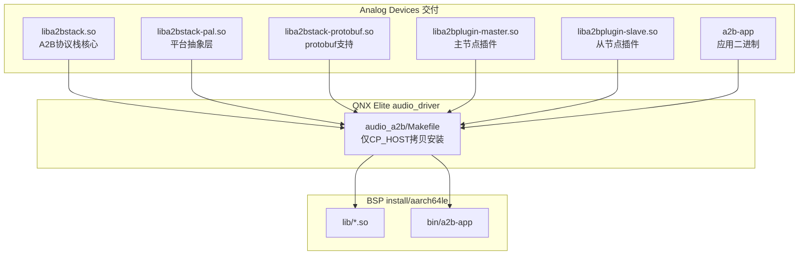

[← 16.19 QNX apr_lib APR协议库](16_16.19_QNX_apr_lib_APR协议库.md) | [← 返回16章](README.md) | [返回导航](../README.md) | [16.21 QNX audio_dac DAC音频驱动 →](16_16.21_QNX_audio_dac_DAC音频驱动.md)

---

## 16.20 audio_a2b — QNX A2B 总线音频（预编译库集成）

> ### 源码说明
>
> `audio_a2b` 是纯预编译库集成组件。其目录（`audio_elite/audio_driver/audio_a2b/`）**没有任何 `.c/.h` 源码、没有头文件、没有 XML 配置文件**，只有 `Makefile` 与 ADI 提供的预编译产物：
>
> - 库：`liba2bstack.so` / `liba2bstack-pal.so` / `liba2bstack-protobuf.so` / `liba2bplugin-master.so` / `liba2bplugin-slave.so`
> - 二进制：`a2b-app`
>
> A2B 协议栈源码由 ADI 不开放，因此无本地头文件或 API 可供验证。本节内容边界：①真实预编译库/二进制清单与真实 Makefile 构建信息（来自磁盘）；②A2B 总线的**通用协议背景知识**（来自 Analog Devices 公开资料，明确标注"非本地源码"）。芯片型号、节点数量、时延数字等均为通用协议知识，并非从本地源码或本地配置读出。

### 16.20.1 概述

`audio_a2b` 是 SA8295 QNX 域中与 A2B（Automotive Audio Bus）总线相关的音频组件。A2B 是 Analog Devices（ADI）公司的汽车音频总线技术，其协议栈与插件由 ADI 以**预编译库**形式提供。

在本平台上，`audio_a2b` 目录**不包含任何驱动源码**，仅负责把 ADI 提供的 A2B 协议栈预编译库（`liba2bstack*.so`）、插件库（`liba2bplugin-*.so`）与应用二进制（`a2b-app`）**拷贝到 QNX 构建 staging 目录**，供系统在运行期加载使用。

| 维度 | 真实情况（源码核实） |
|------|------|
| 真实路径 | `Qnx/apps/qnx_ap/AMSS/multimedia/audio/audio_elite/audio_driver/audio_a2b/` |
| 目录内容 | **仅** `Makefile` + `prebuilt/{bin/a2b-app, lib/*.so}` + 各级 Makefile |
| 是否有源码 | **否**——无 `.c`、无 `.h`、无 `.xml` |
| 组件性质 | ADI 第三方 A2B 协议栈的**预编译库集成**（build 阶段仅做拷贝安装） |
| 运行域 | QNX（Elite 架构 `audio_driver` 下） |

### 16.20.2 真实目录内容（磁盘核实）

`find audio_a2b -type f` 的真实输出：

```
audio_a2b/
├── Makefile                              # 顶层递归构建
└── prebuilt/
    ├── Makefile
    ├── bin/
    │   ├── Makefile
    │   └── a2b-app                        # A2B 应用二进制（预编译）
    └── lib/
        ├── Makefile
        ├── liba2bstack.so                 # A2B 协议栈核心（ADI 预编译）
        ├── liba2bstack-pal.so             # 协议栈平台抽象层（PAL）
        ├── liba2bstack-protobuf.so        # 协议栈 protobuf 支持
        ├── liba2bplugin-master.so         # 主节点插件
        └── liba2bplugin-slave.so          # 从节点插件
```

> 目录中**没有** `include/`、没有 `src/`、没有 `etc/*.xml`。所有 `.so` 与 `a2b-app` 均为预编译二进制，源码不在本仓库。

### 16.20.3 真实构建方式（Makefile 核实）

顶层 `Makefile`（真实内容）：

```makefile
LIST=audio_driver
EARLY_DIRS=a2bstack a2bstack-pal
LATE_DIRS=a2b-lib a2b-app
```

`prebuilt/lib/Makefile` 与 `prebuilt/bin/Makefile` 的动作**只是拷贝**（`$(CP_HOST)`），不做编译：

| 安装目标 | 真实动作 |
|----------|----------|
| `liba2bstack.so`、`liba2bstack-pal.so`、`liba2bstack-protobuf.so`、`liba2bplugin-master.so`、`liba2bplugin-slave.so` | `CP_HOST` 拷贝到 `$(BSP_ROOT)/install/aarch64le/lib` |
| `a2b-app` | `CP_HOST` 拷贝到 `$(BSP_ROOT)/install/aarch64le/bin/a2b-app` |

> 构建过程**无源码编译**，仅将预编译产物安装到 aarch64le staging 目录。库/二进制的真实构建发生在 ADI 交付前。

### 16.20.4 真实预编译产物清单

以下为磁盘上真实存在的产物（`prebuilt/`）：

| 产物 | 类型 | 命名溯源 | 说明 |
|------|------|----------|------|
| `liba2bstack.so` | 共享库 | ADI "A2B Stack" | A2B 协议栈核心 |
| `liba2bstack-pal.so` | 共享库 | Stack + PAL | 协议栈平台抽象层（Platform Abstraction Layer） |
| `liba2bstack-protobuf.so` | 共享库 | Stack + protobuf | 协议栈的 protobuf 序列化支持 |
| `liba2bplugin-master.so` | 共享库 | Plugin / master | A2B 主节点插件 |
| `liba2bplugin-slave.so` | 共享库 | Plugin / slave | A2B 从节点插件 |
| `a2b-app` | 可执行文件 | A2B application | A2B 应用/工具二进制 |

> 库名前缀 `liba2bstack*` / `liba2bplugin-*` 是 **ADI A2B 软件栈**的标准命名（"A2B Stack" + Master/Slave Plugin + PAL），可据此确认这些库来自 ADI，而非高通或本仓库自研。**这些 `.so` 的内部 API、结构体、寄存器操作在本仓库中不可见**（无头文件、无源码），因此本节不提供任何函数级/寄存器级描述。

### 16.20.5 A2B 总线通用协议知识（非本地源码）

> **重要标注**：以下内容为 A2B（Automotive Audio Bus）的**通用协议背景知识**，来自 Analog Devices 公开技术资料，**并非从本仓库源码/配置读取**。具体到本平台的节点数量、拓扑、采样参数，需以实际硬件板级设计与 ADI 配置工具（如 SigmaStudio）导出的配置为准，本仓库中无相关配置文件可供核实。

A2B 是面向车载音频的数字总线技术，其公开特性通常包括：

| 特性 | 通用描述（ADI 公开资料，非本地源码） |
|------|------|
| 物理层 | 单对非屏蔽双绞线（UTP），同线传输时钟/数据/供电 |
| 拓扑 | 主从菊花链：1 个主节点 + 多个从节点 |
| 供电 | 支持通过总线为从节点供电（简化线束） |
| 传输 | 全双工，上行/下行 TDM 时隙 |
| 典型应用 | 车载功放、麦克风阵列、扬声器节点的数字互联 |

> 具体的从节点芯片型号（如 AD24xx 系列）、每链节点数、时延指标属**硬件与型号相关参数**，随板卡设计不同而变化；本仓库中**没有**任何文件可确认本平台采用的具体型号与参数，故本节不列出确定型号。

### 16.20.6 架构定位（可确认部分）

基于真实目录与命名可确认的定位关系（不含未验证的内部交互细节）：



> 图中仅表达**已核实**的关系：ADI 预编译产物经本目录 Makefile 拷贝到 BSP staging。A2B 与 ADSP/TDM/auto-audiod 等运行期交互**无本地源码可验证**，故不在此绘制。

### 16.20.7 与其他组件关系（谨慎表述）

| 组件 | 本仓库可确认的关系 | 说明 |
|------|------|------|
| 其他 QNX 音频组件 | 无源码级调用可核实 | audio_a2b 无源码，无法确认其与 audio_driver_vm / ams_lib 等的具体调用关系 |
| ADSP / TDM 数据路径 | 属硬件/运行期集成 | 需以实际板级 TDM 布线与 ADSP 配置为准，本仓库无对应文件 |

### 16.20.8 总结

| 方面 | 真实结论（源码核实） |
|------|----------|
| 组件性质 | ADI 第三方 A2B 协议栈的**预编译库集成**，本目录无任何源码 |
| 真实产物 | `liba2bstack.so`/`liba2bstack-pal.so`/`liba2bstack-protobuf.so`/`liba2bplugin-master.so`/`liba2bplugin-slave.so` + `a2b-app` |
| 构建动作 | Makefile 仅 `CP_HOST` 拷贝到 `install/aarch64le/{lib,bin}`，无编译 |
| 不可验证内容 | 内部 API、寄存器时序、节点发现/流管理/故障恢复逻辑、具体芯片型号——均无本地源码 |
| 通用背景 | A2B 总线特性为 ADI 公开知识，非本地源码；具体参数以硬件设计与 ADI 配置为准 |

---
