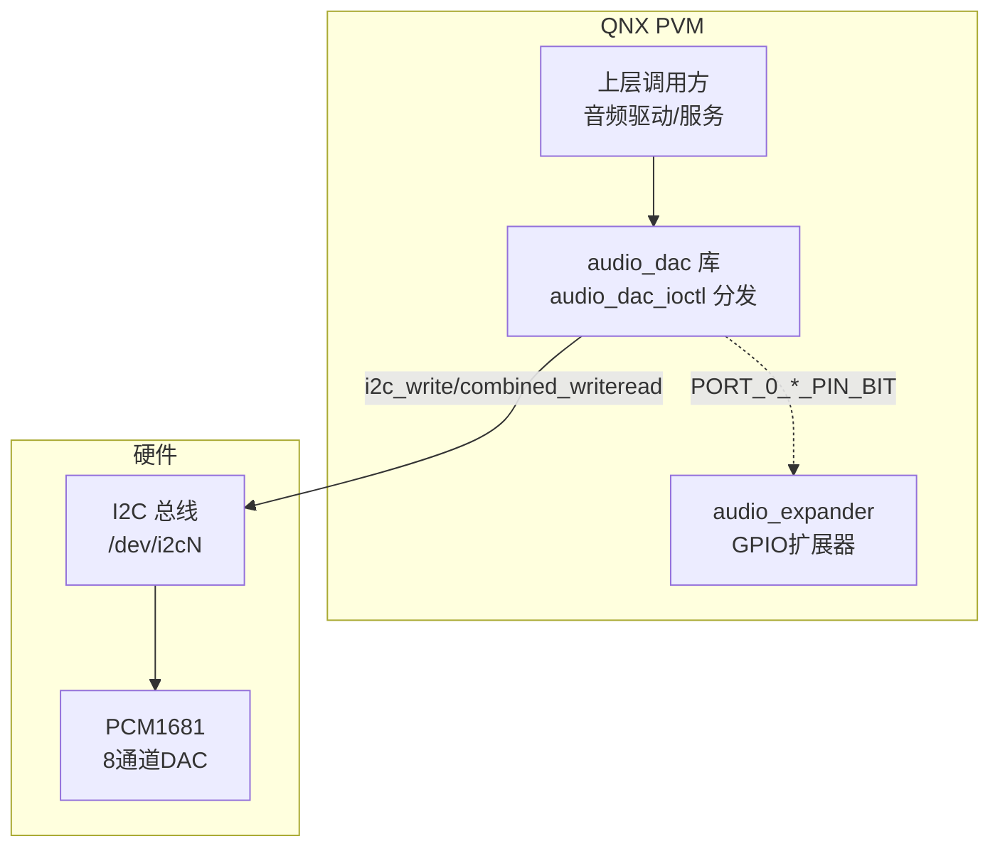
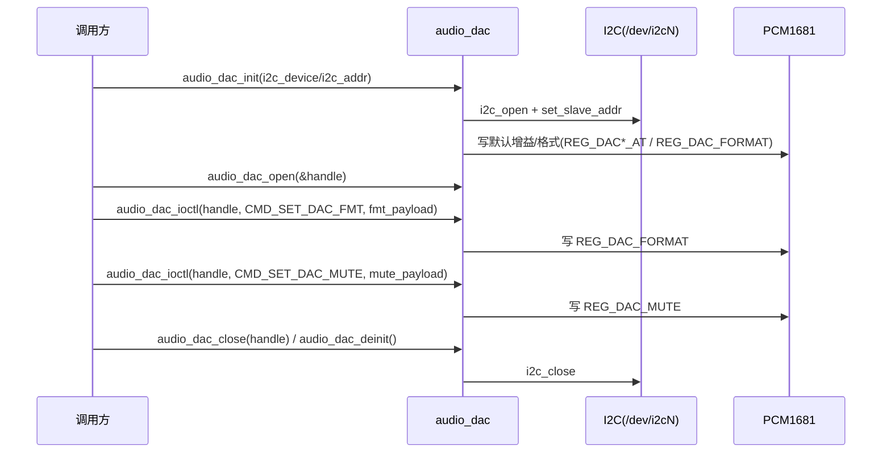

[← 16.20 QNX audio_a2b A2B总线音频](16_16.20_QNX_audio_a2b_A2B总线音频.md) | [← 返回16章](README.md) | [返回导航](../README.md) | [16.22 QNX audio_expander 音频扩展器 →](16_16.22_QNX_audio_expander_音频扩展器.md)

---

## 16.21 audio_dac — QNX DAC 音频驱动（PCM1681 / I2C）

> ### ⚠️ 源码核实（勘误）
>
> 本节旧版含多处与真实源码不符的内容，经本地源码核实已更正：
>
> | 旧版（虚构/推演） | 真实源码 |
> |---|---|
> | 芯片 **PCM1684** 深度解析/寄存器映射 | 真实芯片是 **PCM1681**（`enum pcm1681_reg_map`，代码注释 "pcm1681 control"） |
> | cmd `CMD_SET_DAC_VOLUME (0x1003)` | **不存在**——ioctl 仅 `case CMD_SET_DAC_MUTE / CMD_SET_DAC_FMT` |
> | cmd `CMD_RESET_DAC (0x1004)` | **不存在**——同上，仅 0x1001/0x1002 两个命令 |
> | 结构 `dac_handle_t` / `dac_config_t` | 真实为 `audio_dac_main_t` / `audio_dac_context_t` / `audio_dac_init_config_t` / `mute_payload_t` / `fmt_payload_t` |
> | `dac_config.xml` 配置文件 | 目录中**不存在**任何 XML，初始化参数由 `audio_dac_init_config_t`（i2c_device/i2c_addr）传入 |
> | 独立"DAC 音量控制"命令 | 真实仅有内部 `audio_dac_set_default_gain`（写默认增益 224），无对外音量 cmd |
> | 多 DAC 实例/SSR 恢复/安全音频保障等 | 无源码依据，已删除（真实是单例 `static audio_dac_main`，无 SSR 逻辑） |
> | 资源管理器(resmgr)注册 | 真实是普通库 + `audio_dac_ioctl` 分发，**无 resmgr/dispatch** |
>
> 真实源码路径：`Qnx/apps/qnx_ap/AMSS/multimedia/audio/audio_common/audio_dac/`（注意在 **audio_common** 下，非 audio_elite）。版权 Qualcomm 2020-2021，用途 **BRAC**。

### 16.21.1 概述

`audio_dac` 是 SA8295 QNX 域中控制外部 **PCM1681**（TI 8 通道音频 DAC）的驱动库，通过 **I2C** 总线对 DAC 芯片做初始化、格式配置、静音控制与默认增益写入。它是有真实源码的高通自研模块（非预编译库）。

| 维度 | 真实情况（源码核实） |
|------|------|
| 真实路径 | `audio/audio_common/audio_dac/` |
| 目标芯片 | **PCM1681**（8 通道 DAC，TI） |
| 控制总线 | **I2C**（`i2c_client.h`，设备 `/dev/i2c%u`） |
| 组件性质 | 高通自研库（有 `.c/.h` 源码），非资源管理器 |
| 对外接口 | `audio_dac_init/open/ioctl/close/deinit` 五个 API |
| 用途标注 | 代码注释与结构均标注用于 **BRAC** |

### 16.21.2 真实源码树（磁盘核实）

```
audio_dac/
├── Makefile
├── common.mk
├── aarch64/{Makefile, so-le/Makefile}
├── inc/
│   ├── audio_dac.h        # 对外 API、cmd、payload 结构
│   ├── dac_handle.h       # 句柄管理声明
│   ├── dac_list.h         # 链表工具声明
│   ├── dac_osal.h         # OSAL 抽象
│   ├── dac_status.h       # dac_status 错误码(DAC_EOK..DAC_EBUS)
│   └── dac_dbg.h          # DAC_MSG 日志宏
└── src/
    ├── audio_dac.c        # 主实现(389行)：init/open/ioctl/close/deinit + set_mute/set_format/set_default_gain
    ├── dac_handle.c       # 句柄分配/查找
    └── dac_list.c         # 链表实现
```

> 目录中**无 XML 配置**、**无预编译 .so**（编译产物在 aarch64 目录构建），是真实源码模块。

### 16.21.3 架构定位



> 图中 `audio_dac` 通过 I2C 读写 PCM1681；代码中出现的 `PORT_0_DAC_SELECT_PIN_BIT` / `PORT_0_DAC_ENABLE_PIN_BIT` / `PORT_0_TDM_MUX_PIN_BIT` 指向 GPIO 扩展器端口位，与 16.22 audio_expander 相关（DAC 选择/使能/TDM 复用引脚）。

### 16.21.4 对外 API（audio_dac.h，真实签名）

| API | 说明 |
|-----|------|
| `dac_status audio_dac_init(audio_dac_init_config_t *config)` | 初始化：打开 I2C 设备、写默认增益/格式，建立单例 `audio_dac_main` |
| `dac_status audio_dac_open(uint32_t *handle)` | 分配句柄（返回可用 handle） |
| `dac_status audio_dac_ioctl(uint32_t handle, uint32_t cmd, void *param, size_t length)` | 命令分发：仅处理 `CMD_SET_DAC_FMT` / `CMD_SET_DAC_MUTE` |
| `dac_status audio_dac_close(uint32_t handle)` | 释放句柄 |
| `dac_status audio_dac_deinit(void)` | 反初始化：关闭 I2C、释放全局 |

> 内部实现（`audio_dac.c`）：`audio_dac_set_mute(ctx, param, length)`、`audio_dac_set_format(ctx, ...)`、`static audio_dac_set_default_gain(main, ...)`。

### 16.21.5 命令定义（真实只有 2 个）

```c
/* audio_dac.h */
#define CMD_SET_DAC_FMT    0x1001   /* 参数 fmt_payload_t，设置数据格式 */
#define CMD_SET_DAC_MUTE   0x1002   /* 参数 mute_payload_t，设置静音 */
```

> `audio_dac_ioctl` 中 `switch(cmd)` 只有这两个 `case`。旧版的 `CMD_SET_DAC_VOLUME(0x1003)` / `CMD_RESET_DAC(0x1004)` 在源码中不存在。

### 16.21.6 关键数据结构（真实）

```c
/* 初始化配置 */
typedef struct {
    uint16_t i2c_device;   /* I2C 控制器号 -> /dev/i2c%u */
    uint16_t i2c_addr;     /* PCM1681 从机地址 */
} audio_dac_init_config_t;

/* 全局单例 */
typedef struct {
    uint32_t ref_cnt;
    uint32_t reserved;
    int32_t  i2c_fd;       /* I2C 文件描述符 */
    uint16_t slave_addr;   /* DAC 从机地址 */
} audio_dac_main_t;

/* 每句柄上下文 */
typedef struct {
    uint32_t          handle;
    audio_dac_main_t *glb;
    uint32_t          reserved;
} audio_dac_context_t;

/* ioctl payload */
typedef struct { bool_t        mute;   } mute_payload_t;   /* CMD_SET_DAC_MUTE */
typedef struct { data_format_t format; } fmt_payload_t;    /* CMD_SET_DAC_FMT  */

/* 数据格式枚举（24-bit TDM） */
typedef enum {
    I2S_TDM,
    LEFT_JUSTIFIED_TDM,
} data_format_t;
```

### 16.21.7 PCM1681 寄存器映射（真实 enum）

```c
enum pcm1681_reg_map {
    RESERVED_REG_0     = 0x0,
    REG_DAC1_AT        = 0x01,   /* 各通道衰减 DAC1..DAC6 */
    REG_DAC2_AT        = 0x02,
    REG_DAC3_AT        = 0x03,
    REG_DAC4_AT        = 0x04,
    REG_DAC5_AT        = 0x05,
    REG_DAC6_AT        = 0x06,
    REG_DAC_MUTE       = 0x07,   /* 静音控制 */
    REG_DAC_OPERATION  = 0x08,   /* 运行控制 */
    REG_DAC_FORMAT     = 0x09,   /* 格式 FMT[3:0] */
    REG_DAC_SW_RESET   = 0x0A,   /* 软复位 BIT7 */
    REG_DAC_AT_MODE    = 0x0D,   /* 衰减模式 */
};
```

> 写寄存器通过 `i2c_write`（1 字节寄存器地址 + 1 字节数据，`DAC_DAC_REG_BYTE=1`/`DAC_DAC_DATA_BYTE=1`）；读通过 `i2c_combined_writeread`。默认增益 `static uint8_t dac_default_gain = 224`（映射范围：129=-63dB ~ 255=0dB，0-128=静音）。

### 16.21.8 GPIO 扩展器协同（与 audio_expander）

```c
#define PORT_0_DAC_SELECT_PIN_BIT   (1 << 3)   /* Mercury / SoC 源选择 */
#define PORT_0_DAC_ENABLE_PIN_BIT   (1 << 6)   /* DAC 使能 */
#define PORT_0_TDM_MUX_PIN_BIT      (1 << 7)   /* TDM 复用选择 */
#define PORT_0_DAC_SELECT_PIN       (0x3)
```

> 这些端口位写到 GPIO 扩展器（见 16.22 audio_expander），完成 DAC 数据源/使能/TDM 复用引脚控制。

### 16.21.9 状态码（dac_status.h，真实 22 项）

`dac_status` 为 `uint32_t`：`DAC_EOK=0x00`、`DAC_EFAILED=0x01`、`DAC_EBADPARAM=0x02` … 直到 `DAC_EBUS=0x16`。日志统一用 `DAC_MSG(DAC_PRIO_ERROR, ...)` 输出。

### 16.21.10 典型调用流程



### 16.21.11 总结

- `audio_dac` 是**高通自研、有真实源码**的 QNX 库，控制 **PCM1681** 8 通道 DAC，走 **I2C**（`/dev/i2c%u`），用于 **BRAC**。
- 对外仅 5 个 API（init/open/ioctl/close/deinit），ioctl **仅 2 个命令**（`CMD_SET_DAC_FMT 0x1001` / `CMD_SET_DAC_MUTE 0x1002`）。
- 无 XML 配置、无 resmgr、无 SSR、无独立音量命令；增益由内部默认值 224 写入。
- 与 `audio_expander`（16.22）通过 `PORT_0_*_PIN_BIT` 协同做 DAC 选择/使能/TDM 复用。

---

[← 16.20 QNX audio_a2b A2B总线音频](16_16.20_QNX_audio_a2b_A2B总线音频.md) | [← 返回16章](README.md) | [返回导航](../README.md) | [16.22 QNX audio_expander 音频扩展器 →](16_16.22_QNX_audio_expander_音频扩展器.md)