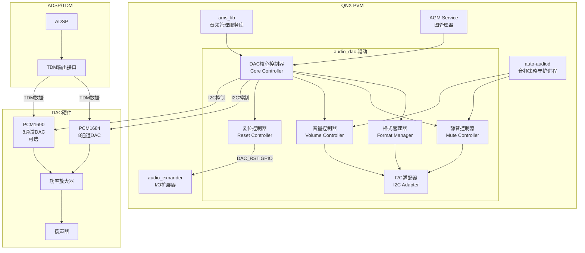
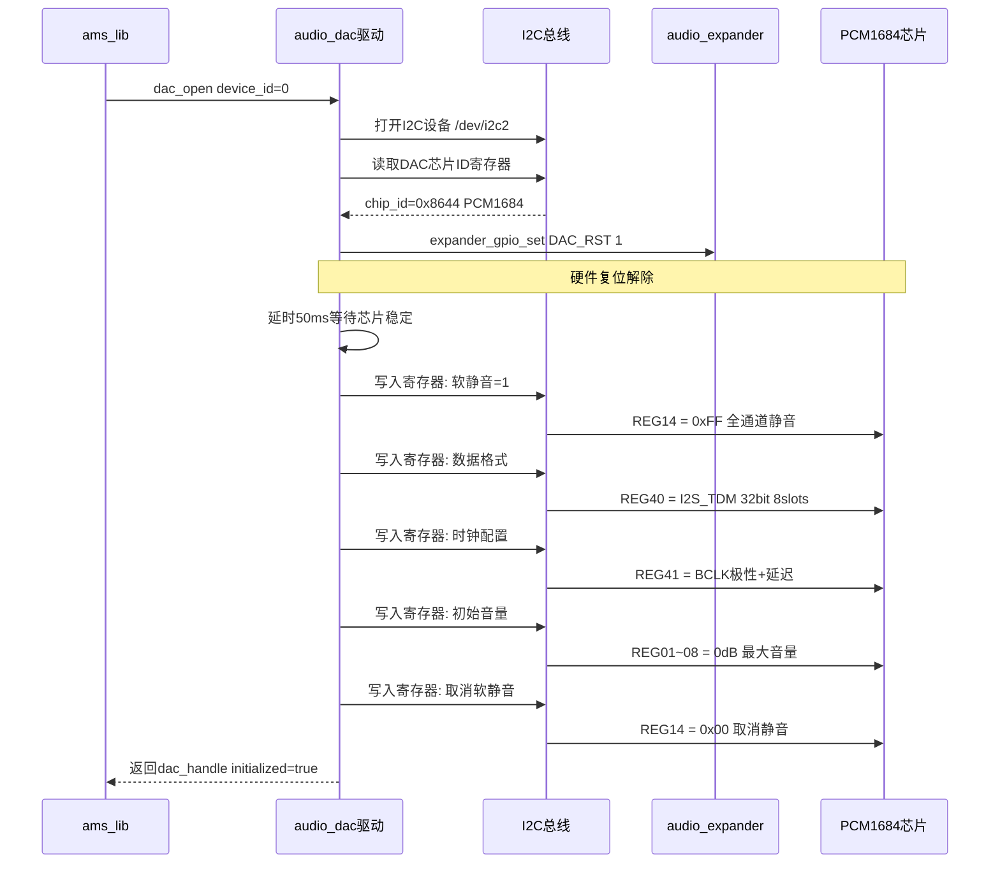
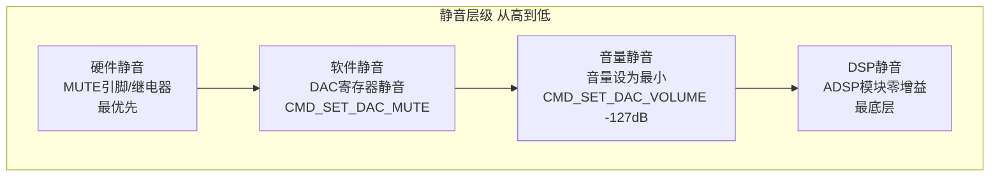
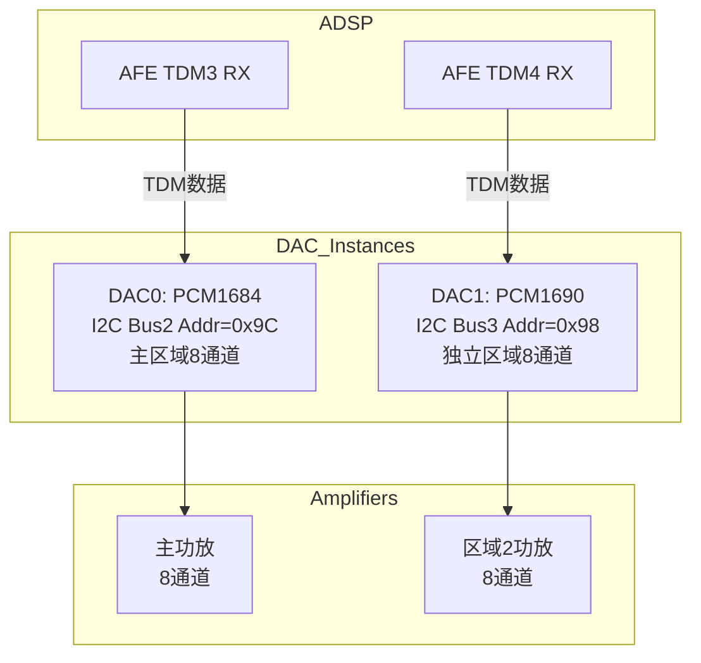
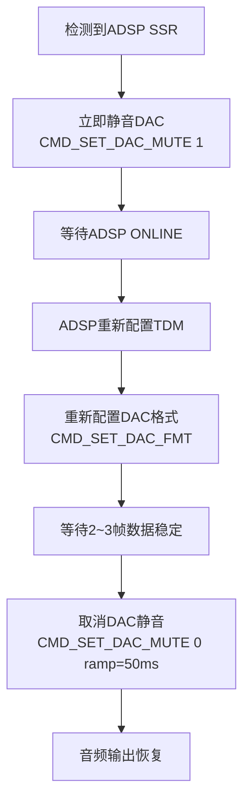

[← 16.20 QNX audio_a2b A2B总线音频](16_16.20_QNX_audio_a2b_A2B总线音频.md) | [← 返回16章](README.md) | [返回导航](../README.md) | [16.22 QNX audio_expander 音频扩展器 →](16_16.22_QNX_audio_expander_音频扩展器.md)

---

## 16.21 audio_dac — QNX DAC音频驱动

### 16.21.1 概述

`audio_dac` 是QNX域中DAC（Digital-to-Analog Converter）芯片的音频驱动模块，运行在QNX Primary VM中。它负责控制外部DAC芯片的**数据格式配置、静音控制、音量调节和芯片复位**，将ADSP输出的数字音频信号（经TDM/I2S接口）转化为模拟信号输出到功率放大器或扬声器。在SA8295 BRAC（Baseboard Radio and Audio Card）平台上，audio_dac主要控制PCM1684等8通道DAC芯片。

> **架构归属说明**
> `audio_dac` 属于 **audio_common 共享组件**（并非 Elite 或 AudioReach 专有），真实源码路径为：
> `Qnx/apps/qnx_ap/AMSS/multimedia/audio/audio_common/audio_dac/`
> 位于 `audio_common/` 目录意味着它被 Elite（adp_8295）与 AudioReach（adp_8295_ar）两套板级配置共用，是与架构无关的底层外设驱动。（注：本节示例中的 `vendor/qcom/proprietary/audio_dac/` 为逻辑归类路径，磁盘实际路径以上述 QNX 源码树为准。）

#### 架构定位

| 维度 | 说明 |
|------|------|
| 层级 | QNX音频栈外设驱动层 |
| 运行域 | QNX PVM（Primary VM） |
| 驱动类型 | QNX资源管理器（Resource Manager），预编译二进制 |
| 核心职责 | DAC数据格式配置、静音/取消静音、音量调节、芯片复位控制 |
| 与Android关系 | Android不直接控制DAC；DAC由QNX独占管理，音频数据经ADSP→TDM→DAC路径输出 |
| 安全属性 | DAC静音控制可用于安全音频的紧急输出/静音切换；崩溃恢复时需确保DAC状态正确 |

#### 关键特性

- **多DAC并行管理**：支持系统中同时存在多个DAC芯片实例（如主区域DAC、独立区域DAC）
- **I2C控制通道**：通过I2C总线对DAC芯片寄存器进行读写操作
- **TDM数据格式匹配**：DAC接收格式必须与ADSP TDM输出格式精确匹配
- **硬件静音优先**：提供硬件级静音控制，优先于软件静音
- **Pop/Click抑制**：启动/停止时序化控制，避免可闻噪声

#### 与其他QNX组件的关系

| 组件 | 交互方式 | 说明 |
|------|----------|------|
| audio_driver_vm | 通过内核接口控制 | DAC驱动的I2C/SPI操作经内核驱动完成 |
| ams_lib | TDM接口注册 | DAC对应的TDM接口由ams_lib管理和绑定 |
| audio_a2b | 协同工作 | A2B远端节点可能包含DAC，两者在某些场景协同 |
| audio_expander | GPIO控制 | DAC芯片的复位/使能可能通过扩展器GPIO控制 |
| auto-audiod | 策略决策 | 策略守护进程决定DAC静音/取消静音时机 |
| AGM Service | 间接控制 | AGM打开图时需要TDM接口已就绪（DAC已配置） |

### 16.21.2 系统架构



### 16.21.3 源码路径与头文件

#### 目录结构

```
vendor/qcom/proprietary/audio_dac/
├── inc/
│   ├── audio_dac.h          # DAC驱动主头文件
│   ├── dac_handle.h         # DAC设备句柄定义
│   ├── dac_dbg.h            # DAC调试接口
│   ├── dac_cmd.h            # DAC命令定义
│   ├── dac_volume.h         # 音量控制接口
│   └── dac_reg.h            # DAC寄存器映射
├── src/
│   ├── audio_dac.c          # DAC驱动核心实现
│   ├── dac_format.c         # 数据格式管理
│   ├── dac_mute.c           # 静音控制实现
│   ├── dac_volume.c         # 音量控制实现
│   └── dac_i2c.c            # I2C通信适配器
├── config/
│   └── dac_config.xml       # DAC配置文件
└── Makefile
```

#### 核心头文件说明

| 头文件 | 定义内容 | 关键数据结构 |
|--------|----------|-------------|
| audio_dac.h | DAC驱动的公共API接口 | dac_device_t, dac_config_t |
| dac_handle.h | DAC设备句柄和实例管理 | dac_handle_t |
| dac_dbg.h | 调试和诊断接口 | dac_dbg_info_t |
| dac_cmd.h | 控制命令ID定义 | CMD_SET_DAC_FMT, CMD_SET_DAC_MUTE |
| dac_volume.h | 音量控制接口 | dac_vol_range_t |
| dac_reg.h | DAC芯片寄存器映射 | PCM1684_REG_xxx |

### 16.21.4 关键数据结构

#### 16.21.4.1 dac_handle_t — DAC设备句柄

```c
typedef struct dac_handle {
    uint32_t device_id;       // DAC设备ID (0=DAC0, 1=DAC1)
    uint32_t i2c_bus;         // I2C总线号 (如I2C_BUS_2)
    uint32_t i2c_addr;        // DAC I2C地址 (PCM1684=0x9C)
    uint32_t tdm_interface;   // 关联的TDM接口 (AMS_HW_IF_TDM3)
    uint32_t num_channels;    // DAC通道数 (PCM1684=8)
    bool     hw_muted;        // 硬件静音状态
    bool     initialized;     // 初始化完成标志
    uint8_t  fmt_configured;  // 当前配置的数据格式
    int8_t   volume_db;       // 当前音量(dB), -127~0
    void    *i2c_handle;      // I2C设备操作句柄
} dac_handle_t;
```

| 字段 | 说明 | 典型值 |
|------|------|--------|
| device_id | 系统中DAC芯片的编号 | 0(主DAC), 1(辅助DAC) |
| i2c_bus | DAC所在I2C总线编号 | 2, 3, 4 |
| i2c_addr | DAC的7位I2C地址 | 0x9C(PCM1684), 0x98(PCM1690) |
| tdm_interface | DAC绑定的TDM端口 | TDM3, TDM4 |
| num_channels | DAC支持的输出通道数 | 8(PCM1684/PCM1690) |
| hw_muted | 硬件静音当前状态 | true=静音, false=输出 |
| volume_db | DAC硬件音量 | 0dB=最大, -127dB=最小 |

#### 16.21.4.2 dac_config_t — DAC配置参数

```c
typedef struct dac_config {
    dac_data_format_t format;     // 数据格式
    uint32_t bit_depth;           // 位深
    uint32_t num_slots;           // TDM插槽数
    uint32_t sample_rate;         // 采样率
    dac_clk_polarity_t clk_pol;   // 时钟极性
    dac_data_delay_t data_delay;  // 数据延迟(1~3 BCLK)
    bool soft_mute_on_reset;      // 复位后是否软静音
    uint8_t initial_volume;       // 初始音量(0~255)
} dac_config_t;
```

#### 16.21.4.3 DAC数据格式枚举

```c
typedef enum {
    DAC_FMT_I2S_TDM,              // I2S TDM格式 — 标准飞利浦I2S时序
    DAC_FMT_LEFT_JUSTIFIED_TDM,   // 左对齐TDM格式 — 数据与BCLK对齐
    DAC_FMT_RIGHT_JUSTIFIED_TDM,  // 右对齐TDM格式 — LSB在BCLK边沿
    DAC_FMT_DSP_MODE_A,           // DSP/A模式 — FS脉冲后1 BCLK延迟
    DAC_FMT_DSP_MODE_B,           // DSP/B模式 — FS脉冲与数据对齐
} dac_data_format_t;
```

| 格式 | WS边沿行为 | 适用场景 | PCM1684支持 |
|------|-----------|----------|------------|
| I2S_TDM | WS变化后1 BCLK延迟数据 | 最常用，兼容性好 | 是 |
| LEFT_JUSTIFIED_TDM | WS边沿立即输出数据 | 某些TI DAC芯片 | 是 |
| DSP_MODE_A | FS脉冲后1 BCLK延迟 | 多通道TDM | 是 |
| DSP_MODE_B | FS脉冲无延迟 | 多通道TDM | 是 |

### 16.21.5 DAC命令定义

#### 16.21.5.1 CMD_SET_DAC_FMT (0x1001) — 配置DAC数据格式

```c
// DAC数据格式命令载荷
typedef struct {
    dac_data_format_t format;     // 数据格式
    uint32_t          bit_depth;  // 位深(16/24/32)
    uint32_t          num_slots;  // TDM插槽数(4/8/16/32)
    uint32_t          sample_rate;// 采样率(48000/96000)
    dac_clk_polarity_t clk_pol;  // BCLK极性(0=正常,1=反转)
    dac_data_delay_t   delay;    // 数据延迟(0~3 BCLK周期)
} dac_fmt_payload_t;
```

| 字段 | 说明 | 可选值 |
|------|------|--------|
| format | 数据传输格式 | I2S_TDM, LEFT_JUSTIFIED_TDM, DSP_MODE_A/B |
| bit_depth | 采样位深 | 16, 24, 32 |
| num_slots | TDM插槽数 | 4, 8, 16, 32 |
| sample_rate | 采样率 | 48000, 96000 |
| clk_pol | BCLK极性 | 0=正常采样, 1=反转采样 |
| delay | 数据延迟周期 | 0=无延迟, 1~3=BCLK延迟周期数 |

#### 16.21.5.2 CMD_SET_DAC_MUTE (0x1002) — DAC静音/取消静音

```c
// DAC静音控制载荷
typedef struct {
    uint32_t mute;          // 0=取消静音, 1=静音
    uint32_t ramp_time_ms;  // 渐变时间(毫秒), 0=立即
    uint32_t channels;      // 静音通道掩码, 0xFF=全部通道
} dac_mute_payload_t;
```

| mute值 | ramp_time_ms | 说明 |
|--------|-------------|------|
| 0 | 0 | 立即取消静音 |
| 0 | 50 | 50ms渐变取消静音(减少pop噪声) |
| 1 | 0 | 立即静音 |
| 1 | 100 | 100ms渐变静音(淡出效果) |

#### 16.21.5.3 CMD_SET_DAC_VOLUME (0x1003) — DAC音量控制

```c
// DAC音量控制载荷
typedef struct {
    int8_t   volume_db;     // 音量(dB), -127~0
    uint32_t channels;      // 通道掩码
    uint32_t ramp_time_ms;  // 渐变时间
} dac_vol_payload_t;
```

#### 16.21.5.4 CMD_RESET_DAC (0x1004) — DAC芯片复位

```c
// DAC复位控制载荷
typedef struct {
    uint32_t reset_type;    // 0=软复位(寄存器), 1=硬复位(GPIO)
    uint32_t delay_ms;      // 复位后等待时间(毫秒)
} dac_reset_payload_t;
```

| 复位类型 | 说明 | 典型延迟 |
|----------|------|----------|
| 软复位 | 向DAC写入复位寄存器值 | 10ms |
| 硬复位 | 通过扩展器GPIO拉低RST引脚 | 50ms |

### 16.21.6 DAC初始化完整时序



#### 初始化步骤详解

| 步骤 | 操作 | 关键寄存器 | 说明 |
|------|------|-----------|------|
| 1 | 打开I2C设备 | - | 建立与DAC芯片的通信通道 |
| 2 | 读取芯片ID | REG0x00 | 验证DAC芯片是否正确响应 |
| 3 | 硬件复位解除 | EXP GPIO | 通过扩展器解除DAC复位状态 |
| 4 | 软静音 | REG0x14 | 复位后先静音，防止噪声 |
| 5 | 数据格式配置 | REG0x28~0x2B | I2S/TDM格式、位深、插槽数 |
| 6 | 时钟配置 | REG0x2C | BCLK极性、数据延迟 |
| 7 | 音量设置 | REG0x01~0x08 | 每通道独立音量 |
| 8 | 取消静音 | REG0x14 | 格式配置完成后取消静音 |

### 16.21.7 PCM1684芯片深度解析

#### 16.21.7.1 芯片特性

| 参数 | PCM1684 | PCM1690 |
|------|---------|---------|
| 通道数 | 8 | 8 |
| 动态范围 | 110dB | 112dB |
| THD+N | -93dB | -95dB |
| 采样率 | 8~192kHz | 8~192kHz |
| 位深 | 16/24/32bit | 16/24/32bit |
| TDM插槽数 | 最多16 | 最多16 |
| I2C地址 | 0x9C | 0x98 |
| 控制接口 | I2C/SPI | I2C/SPI |
| 供电电压 | 3.3V模拟 1.8V数字 | 3.3V模拟 1.8V数字 |
| 硬件静音 | 是 | 是 |
| 独立通道音量 | 是 | 是 |

#### 16.21.7.2 PCM1684寄存器映射

| 寄存器地址 | 名称 | 功能 | 复位值 |
|-----------|------|------|--------|
| 0x00 | CHIP_ID | 芯片标识 | 0x8644 |
| 0x01~0x08 | VOL_CH1~8 | 通道1~8音量 | 0x00 (0dB) |
| 0x14 | MUTE_CTRL | 软静音控制 | 0xFF (全静音) |
| 0x15 | MUTE_RAMP | 静音渐变控制 | 0x00 |
| 0x16~0x17 | FMT_CTRL | 数据格式控制 | 0x00 |
| 0x18 | SCK_CTRL | 系统时钟控制 | 0x00 |
| 0x19 | TDM_CTRL | TDM模式控制 | 0x00 |
| 0x1A~0x1B | BCLK_CTRL | BCLK极性/延迟 | 0x00 |
| 0x1E | SOFT_RESET | 软复位 | 0x00 |
| 0x7F | PAGE_SELECT | 寄存器页选择 | 0x00 |

#### 16.21.7.3 TDM时序与通道映射

```
TDM8 @ 48kHz, 32bit/slot:
┌────────────────────────────────────────────────────────────────┐
│ FS  ─┐   ┌───┐   ┌───┐   ┌───┐   ┌───┐   ┌───┐   ┌───┐   ┌─│
│     └───┘   └───┘   └───┘   └───┘   └───┘   └───┘   └───┘   │
│ Slot  CH1    CH2    CH3    CH4    CH5    CH6    CH7    CH8    │
│      FL     FR     RL     RR     C      Sub   Surr1  Surr2  │
└────────────────────────────────────────────────────────────────┘

BCLK = 48kHz × 32bit × 8slots = 12.288 MHz
```

| 通道号 | TDM Slot | 典型用途 | 音量寄存器 |
|--------|----------|----------|-----------|
| CH1 | Slot 0 | Front Left FL | REG0x01 |
| CH2 | Slot 1 | Front Right FR | REG0x02 |
| CH3 | Slot 2 | Rear Left RL | REG0x03 |
| CH4 | Slot 3 | Rear Right RR | REG0x04 |
| CH5 | Slot 4 | Center C | REG0x05 |
| CH6 | Slot 5 | Subwoofer Sub | REG0x06 |
| CH7 | Slot 6 | Surround 1 | REG0x07 |
| CH8 | Slot 7 | Surround 2 | REG0x08 |

### 16.21.8 DAC静音控制深度解析

#### 16.21.8.1 静音层级



#### 16.21.8.2 静音时序与Pop/Click抑制

音频输出开启时序(Pop/Click安全)：

```
1. DAC软静音 mute=1         ← 初始状态
2. 配置TDM数据格式
3. ADSP开始发送数据
4. 等待2~3帧数据稳定
5. DAC取消静音 mute=0 ramp=50ms  ← 渐变取消避免click
6. 音频正常输出
```

音频输出关闭时序(Pop/Click安全)：

```
1. DAC渐变静音 mute=1 ramp=100ms  ← 渐变静音避免click
2. 等待静音完成
3. ADSP停止发送数据
4. 保持DAC静音状态
```

#### 16.21.8.3 安全音频与DAC静音

| 场景 | DAC操作 | 说明 |
|------|---------|------|
| 紧急告警输出 | CMD_SET_DAC_MUTE 0 | 确保DAC非静音 安全音频可输出 |
| 安全音频激活 | VAPM通知取消DAC静音 | 安全音频路径需DAC非静音状态 |
| Android崩溃恢复 | CMD_SET_DAC_MUTE 0 | 恢复DAC输出 避免硬件卡在静音状态 |
| 系统关机 | CMD_SET_DAC_MUTE 1 | 关机前静音DAC 避免pop噪声 |
| 音频路由切换 | mute→切换→unmute | 切换时先静音再取消 避免click噪声 |
| Deep Sleep进入 | CMD_SET_DAC_MUTE 1 | 降低功耗 防止噪声 |
| Deep Sleep退出 | CMD_SET_DAC_MUTE 0 ramp=50ms | 渐变恢复输出 |

### 16.21.9 DAC音量控制

#### 16.21.9.1 音量范围与步进

| 参数 | 值 | 说明 |
|------|-----|------|
| 最大音量 | 0 dB | 无衰减 |
| 最小音量 | -127 dB | 接近静音 |
| 步进 | 0.5 dB | 每步半分贝 |
| 通道独立性 | 是 | 每通道独立控制 |
| 渐变支持 | 是 | 可指定渐变时间 |

#### 16.21.9.2 音量控制场景

| 场景 | 音量操作 | 说明 |
|------|----------|------|
| 用户调音 | CMD_SET_DAC_VOLUME vol ramp=200ms | 缓慢渐变 用户体验好 |
| 安全音频DUCK | CMD_SET_DAC_VOLUME -20dB ramp=50ms | 快速压低媒体音量 |
| 安全音频恢复 | CMD_SET_DAC_VOLUME 0dB ramp=200ms | 安全音频结束后恢复 |
| 系统启动 | CMD_SET_DAC_VOLUME -40dB→渐变至0dB | 防止启动音量过大 |

### 16.21.10 DAC与ADSP TDM配置匹配

DAC数据格式必须与ADSP的TDM输出配置精确匹配，否则导致音频数据解析错误(噪声或无声)。

#### 匹配参数对照表

| 参数 | ADSP侧配置 | DAC侧配置 | 必须匹配 |
|------|-----------|-----------|---------|
| 数据格式 | AFE_PORT_CONFIG_I2S_TDM | DAC_FMT_I2S_TDM | 是 |
| 位深 | 32 bit | 32 bit | 是 |
| TDM插槽数 | 8 slots | 8 slots | 是 |
| 采样率 | 48000 Hz | 48000 Hz | 是 |
| BCLK极性 | Normal | Normal | 是 |
| 数据延迟 | 1 BCLK | 1 BCLK | 是 |
| 通道映射 | Slot0=FL Slot1=FR... | CH1=Slot0 CH2=Slot1... | 是 |

#### 典型配置代码

```c
// ADSP侧 TDM配置 在resourcemanager.xml或mixer_paths中
// TDM3 RX: I2S_TDM 32bit 8slots 48kHz

// DAC侧配置 必须与ADSP匹配
dac_config_t dac0_config = {
    .format       = DAC_FMT_I2S_TDM,
    .bit_depth    = 32,
    .num_slots    = 8,
    .sample_rate  = 48000,
    .clk_pol      = DAC_CLK_POL_NORMAL,
    .data_delay   = DAC_DATA_DELAY_1_BCLK,
    .soft_mute_on_reset = true,
    .initial_volume    = 0,   // 0dB
};

int ret = dac_open(0, &dac0_config);
```

#### 格式不匹配症状

| 不匹配项 | 症状 | 原因 |
|----------|------|------|
| 数据格式 | 全噪声 | 数据采样点位置错误 |
| 位深 | 音频失真 | 数据截断或填充错误 |
| 插槽数 | 通道错位 | Slot映射偏移 |
| 采样率 | 变调/加速 | 时钟频率不匹配 |
| BCLK极性 | 左右声道交换 | 采样边沿错误 |
| 数据延迟 | 周期性噪声 | 数据对齐偏移 |

### 16.21.11 双域架构下DAC位置

#### 16.21.11.1 音频数据流路径

```
Android媒体音频路径:
  Android App → AudioFlinger → PAL → gsl_fe 
    → MM-HAB → gsl_vm_be → ADSP → TDM3 → DAC0 PCM1684 → 功放 → 扬声器

QNX安全音频路径:
  QNX安全源 → auto-audiod → ams_lib → ADSP → TDM3 → DAC0 PCM1684 → 功放 → 扬声器
  安全音频与媒体音频共享DAC硬件 但使用不同的Graph实例和TDM时隙
```

#### 16.21.11.2 多DAC实例场景



#### 16.21.11.3 DAC与安全音频保障

| 保障维度 | 实现机制 |
|----------|----------|
| Android崩溃不影响DAC | DAC由QNX独占控制 Android崩溃后DAC保持当前状态 |
| 安全音频DAC优先 | VAPM可强制取消DAC静音 确保安全音频输出 |
| DAC状态恢复 | SSR后auto-audiod重新初始化DAC配置 |
| 硬件静音复位 | 系统异常时可通过扩展器GPIO强制复位DAC |

### 16.21.12 DAC故障处理

#### 16.21.12.1 I2C通信故障

| 故障现象 | 可能原因 | 处理策略 |
|----------|----------|----------|
| I2C读写超时 | 总线被占用/上拉电阻失效 | 重试3次 间隔10ms |
| I2C NAK | DAC芯片未上电/地址错误 | 检查供电和地址配置 |
| 读取值全0xFF | I2C短路/芯片损坏 | 硬件级故障 上报auto-audiod |
| 间歇性通信失败 | 信号完整性问题 | 降速I2C时钟 增加重试 |

#### 16.21.12.2 音频输出故障

| 故障现象 | 可能原因 | 处理策略 |
|----------|----------|----------|
| 无声输出 | DAC被静音/格式不匹配 | 检查静音状态和格式配置 |
| 输出噪声 | 格式不匹配/时钟不稳定 | 验证ADSP TDM与DAC格式匹配 |
| 声音断续 | I2C误写静音寄存器 | 检查I2C总线干扰 |
| 通道错位 | Slot映射不匹配 | 核对TDM通道分配表 |
| Pop/Click噪声 | 未按静音时序操作 | 严格遵守mute→切换→unmute流程 |

#### 16.21.12.3 SSR恢复时DAC处理



### 16.21.13 DAC配置文件

#### dac_config.xml示例

```xml
<?xml version="1.0" encoding="UTF-8"?>
<dac_config>
    <dac_device id="0">
        <chip_type>PCM1684</chip_type>
        <i2c_bus>2</i2c_bus>
        <i2c_addr>0x9C</i2c_addr>
        <tdm_interface>TDM3</tdm_interface>
        <num_channels>8</num_channels>
        <format>I2S_TDM</format>
        <bit_depth>32</bit_depth>
        <num_slots>8</num_slots>
        <sample_rate>48000</sample_rate>
        <clock_polarity>NORMAL</clock_polarity>
        <data_delay>1</data_delay>
        <reset_gpio>
            <expander_id>0</expander_id>
            <pin_number>2</pin_number>
            <active_high>true</active_high>
        </reset_gpio>
        <mute_ramp_ms>50</mute_ramp_ms>
        <volume_ramp_ms>200</volume_ramp_ms>
        <initial_volume_db>0</initial_volume_db>
    </dac_device>
    
    <dac_device id="1">
        <chip_type>PCM1690</chip_type>
        <i2c_bus>3</i2c_bus>
        <i2c_addr>0x98</i2c_addr>
        <tdm_interface>TDM4</tdm_interface>
        <num_channels>8</num_channels>
        <format>I2S_TDM</format>
        <bit_depth>32</bit_depth>
        <num_slots>8</num_slots>
        <sample_rate>48000</sample_rate>
        <clock_polarity>NORMAL</clock_polarity>
        <data_delay>1</data_delay>
        <reset_gpio>
            <expander_id>0</expander_id>
            <pin_number>5</pin_number>
            <active_high>true</active_high>
        </reset_gpio>
    </dac_device>
</dac_config>
```

### 16.21.14 调试接口与日志

#### 16.21.14.1 调试命令

```bash
# 查看DAC设备状态
cat /dev/audio_dac0/status

# 读取DAC寄存器
i2c-tools -r /dev/i2c2 -a 0x9C -o 0x00    # 读取芯片ID
i2c-tools -r /dev/i2c2 -a 0x9C -o 0x14    # 读取静音寄存器
i2c-tools -r /dev/i2c2 -a 0x9C -o 0x01    # 读取CH1音量

# DAC诊断信息
slog2info | grep audio_dac
```

#### 16.21.14.2 关键日志标签

| 标签 | 级别 | 说明 |
|------|------|------|
| AudioDac | INFO | DAC驱动核心日志 |
| AudioDacFmt | DEBUG | 数据格式配置日志 |
| AudioDacMute | DEBUG | 静音控制日志 |
| AudioDacVol | DEBUG | 音量控制日志 |
| AudioDacI2C | ERROR | I2C通信错误日志 |

#### 16.21.14.3 常见问题排查

| 问题 | 排查步骤 |
|------|----------|
| DAC初始化失败 | 1.检查I2C总线是否可达 2.验证DAC芯片ID 3.检查扩展器GPIO复位控制 |
| 无声输出 | 1.检查DAC静音状态REG0x14 2.验证TDM数据格式匹配 3.检查ADSP TDM是否输出 |
| 输出噪声 | 1.对比ADSP和DAC格式配置 2.检查BCLK极性 3.验证数据延迟设置 |
| 通道错位 | 1.检查TDM Slot映射 2.验证通道分配表 3.确认num_slots一致 |
| I2C通信失败 | 1.检查I2C总线状态 2.验证DAC地址 3.检查上拉电阻 |

### 16.21.15 完整API接口参考

| API | 参数 | 返回值 | 说明 |
|-----|------|--------|------|
| dac_open | device_id, config | dac_handle_t* | 打开DAC设备并初始化 |
| dac_close | handle | int | 关闭DAC设备 |
| dac_set_fmt | handle, fmt_payload | int | 配置数据格式 |
| dac_set_mute | handle, mute_payload | int | 静音/取消静音 |
| dac_set_volume | handle, vol_payload | int | 设置音量 |
| dac_get_volume | handle, vol_payload* | int | 获取当前音量 |
| dac_reset | handle, reset_payload | int | 复位DAC芯片 |
| dac_get_status | handle, status* | int | 获取DAC状态 |
| dac_read_reg | handle, reg_addr | uint8_t | 读取DAC寄存器 |
| dac_write_reg | handle, reg_addr, value | int | 写入DAC寄存器 |

---

[← 16.20 QNX audio_a2b A2B总线音频](16_16.20_QNX_audio_a2b_A2B总线音频.md) | [← 返回16章](README.md) | [返回导航](../README.md) | [16.22 QNX audio_expander 音频扩展器 →](16_16.22_QNX_audio_expander_音频扩展器.md)