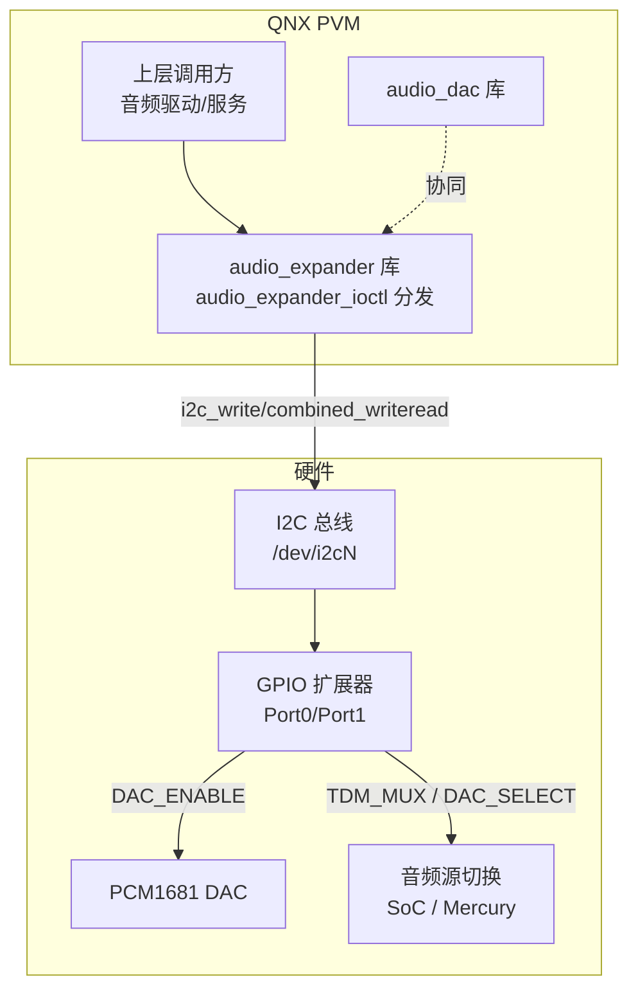
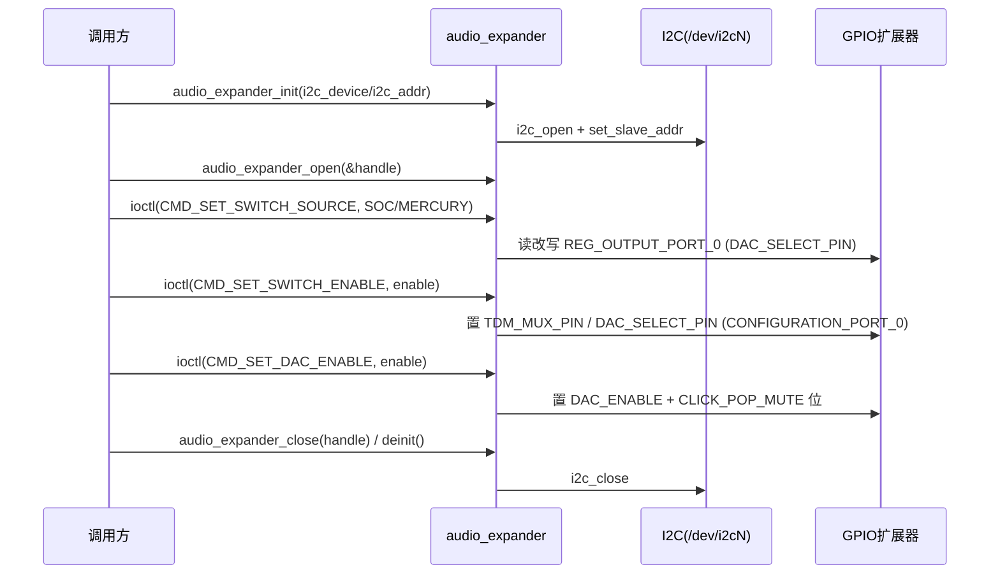

[← 16.21 QNX audio_dac DAC音频驱动](16_16.21_QNX_audio_dac_DAC音频驱动.md) | [← 返回16章](README.md) | [返回导航](../README.md)

---

## 16.22 audio_expander — QNX 音频 GPIO 扩展器（I2C）

> ### 源码说明
>
> `audio_expander` 是通用 I2C GPIO 扩展器（Port0/Port1 寄存器），源码不指定具体芯片型号，单例 `audio_expander_main`；对外 API 为 `audio_expander_init/open/ioctl/close/deinit` 五个；核心结构为 `audio_expander_main_t` / `audio_expander_context_t` / `audio_expander_init_config_t` + payload 结构；参数由 `audio_expander_init_config_t`（i2c_device/i2c_addr）传入，无 XML 配置；真实是固定 3 个命令控制 DAC 使能/源切换。
>
> 真实源码路径：`Qnx/apps/qnx_ap/AMSS/multimedia/audio/audio_common/audio_expander/`（在 **audio_common** 下）。版权 Qualcomm 2020-2021，2020/12/14 初始实现，用途 **BRAC**。

### 16.22.1 概述

`audio_expander` 是 SA8295 QNX 域控制外部 **I2C GPIO 扩展器** 的驱动库，专门为 **BRAC** 音频通路服务：向 DAC（PCM1681）提供 **DAC_ENABLE** 上电信号、通过 **TDM_MUX** 选择音频源（SoC MI2S0 或 Mercury TDM）、并使能音源切换。它与 16.21 `audio_dac` 协同工作。

| 维度 | 真实情况（源码核实） |
|------|------|
| 真实路径 | `audio/audio_common/audio_expander/` |
| 控制对象 | 通用 I2C GPIO 扩展器（Port0/Port1 输出/配置寄存器） |
| 控制总线 | **I2C**（`i2c_client.h`，`/dev/i2c%u`） |
| 组件性质 | 高通自研库（有 `.c/.h` 源码），非资源管理器 |
| 对外接口 | `audio_expander_init/open/ioctl/close/deinit` 五个 API |
| 命令数 | 3 个（DAC 使能 / 源切换 / 切换使能） |
| 用途标注 | 代码注释与结构均标注用于 **BRAC** |

### 16.22.2 真实源码树（磁盘核实）

```
audio_expander/
├── Makefile
├── common.mk
├── aarch64/{Makefile, so-le/Makefile}
├── inc/
│   ├── audio_expander.h   # 对外 API、CMD、payload 结构
│   ├── aud_handle.h       # 句柄管理声明
│   ├── aud_list.h         # 链表工具声明
│   ├── aud_osal.h         # OSAL 抽象
│   ├── aud_status.h       # 错误码
│   └── aud_dbg.h          # 日志宏
└── src/
    ├── audio_expander.c   # 主实现(460行)：init/open/ioctl/close/deinit + set_dac_enable/set_switch_source/set_switch_enable
    ├── aud_handle.c       # 句柄分配/查找
    └── aud_list.c         # 链表实现
```

> 目录中**无 XML 配置**、**无 aud_expander_db/cfg 头文件**、**无预编译 .so**，是真实源码模块。

### 16.22.3 架构定位



> `audio_expander` 通过 I2C 读写 GPIO 扩展器的 Port0 输出/配置寄存器，控制 DAC 使能引脚、DAC 源选择引脚、TDM 复用引脚，从而配合 16.21 `audio_dac` 完成音频通路。

### 16.22.4 对外 API（audio_expander.h，真实签名）

| API | 说明 |
|-----|------|
| `int32_t audio_expander_init(audio_expander_init_config_t *init_cfg)` | 初始化：打开 I2C 设备，建立单例 |
| `int32_t audio_expander_open(uint32_t *handle)` | 分配句柄（BRAC 控制入口） |
| `int32_t audio_expander_ioctl(uint32_t handle, uint32_t cmd, void *param, size_t length)` | 命令分发：`CMD_SET_DAC_ENABLE` / `CMD_SET_SWITCH_SOURCE` / `CMD_SET_SWITCH_ENABLE` |
| `int32_t audio_expander_close(uint32_t io_handle)` | 释放句柄 |
| `int32_t audio_expander_deinit(void)` | 反初始化：关闭 I2C、释放全局 |

> 内部实现（`audio_expander.c`）：`audio_expander_set_dac_enable(ctx, ...)`、`audio_expander_set_switch_source(ctx, ...)`、`audio_expander_set_switch_enable(ctx, ...)`。

### 16.22.5 命令定义（真实只有 3 个）

```c
/* audio_expander.h */
#define CMD_SET_DAC_ENABLE     0x2001   /* DAC ENABLE 信号 -> PCM1681 上电，参数 dac_enable_t */
#define CMD_SET_SWITCH_SOURCE  0x2002   /* 选择 DAC 音频源，参数 switch_source_payload_t */
#define CMD_SET_SWITCH_ENABLE  0x2003   /* 使能音源切换(TDM_MUX_EN)，参数 switch_enable_t */
```

### 16.22.6 关键数据结构（真实）

```c
/* 初始化配置 */
typedef struct audio_expander_init_config {
    uint16_t i2c_device;   /* /dev/i2c%u */
    uint16_t i2c_addr;     /* I2C 从机地址 */
} audio_expander_init_config_t;

/* ioctl payload */
typedef struct dac_enable_payload    { bool_t enable; } dac_enable_t;     /* 0=禁用 1=使能 */
typedef struct switch_enable_payload { bool_t enable; } switch_enable_t;  /* TDM_MUX_EN */

/* 音频源枚举 */
typedef enum switch_audio_source {
    SOC_AUDIO = 0x1000,   /* SoC MI2S0 输出 */
    MERCURY_AUDIO,        /* Mercury TDM 输出 */
} audio_source_t;

typedef struct switch_source_payload {
    audio_source_t src;   /* 见 audio_source_t */
} switch_source_payload_t;
```

> 内部还有全局单例 `audio_expander_main_t{ ... int32_t i2c_fd; uint16_t slave_addr; ... }` 与每句柄 `audio_expander_context_t`（含 `i2c_fd`/`slave_addr`）。

### 16.22.7 GPIO 扩展器寄存器与引脚位（真实）

```c
/* 扩展器寄存器（audio_expander.c） */
#define REG_INPUT_PORT_0             0x00
#define REG_INPUT_PORT_1             0x01
#define REG_OUTPUT_PORT_0            0x02
#define REG_OUTPUT_PORT_1            0x03
#define REG_POLARITY_INVERSION_PORT_0 0x04
#define REG_POLARITY_INVERSION_PORT_1 0x05
#define REG_CONFIGURATION_PORT_0     0x06   /* 方向配置，默认 0xFF */
#define REG_CONFIGURATION_PORT_1     0x07

/* Port0 引脚位 */
#define PORT_0_DAC_SELECT_PIN_BIT         (1 << 3)   /* DAC 源选择 (SoC/Mercury) */
#define PORT_0_DAC_CLICK_POP_MUTE_PIN_BIT (1 << 5)   /* DAC click-pop 静音 */
#define PORT_0_DAC_ENABLE_PIN_BIT         (1 << 6)   /* DAC 使能 */
#define PORT_0_TDM_MUX_PIN_BIT            (1 << 7)   /* TDM 复用使能 */

/* 常量 */
#define AUD_MAX_HANDLE          0x10
#define AUD_INIT_OVERFLOW       0xFFFFFFFF
#define IO_EXPANDER_REG_BYTE 0x1
#define IO_EXPANDER_DATA_BYTE   0x1
```

> 操作模式：先 `i2c_set_slave_addr` → 读 `REG_CONFIGURATION_PORT_0` / `REG_OUTPUT_PORT_0`（`i2c_combined_writeread`）→ 按引脚位置位/清零 → `i2c_write` 回写配置与输出寄存器。使能 DAC 时同时操作 `DAC_ENABLE` 与 `DAC_CLICK_POP_MUTE` 位以抑制 pop 音。

### 16.22.8 典型调用流程



### 16.22.9 与 audio_dac 的协同

- `audio_expander` 负责 DAC **上电（DAC_ENABLE）**、**音频源选择（DAC_SELECT/TDM_MUX）** 与 **pop 抑制**；`audio_dac`（16.21）负责 PCM1681 的**格式/静音/增益**寄存器配置。
- 两者共享同一组 Port0 引脚位命名（`PORT_0_DAC_SELECT/ENABLE/TDM_MUX_PIN_BIT`），构成 BRAC 音频通路的硬件控制面。

### 16.22.10 总结

- `audio_expander` 是**高通自研、有真实源码**的 QNX 库，通过 **I2C** 控制通用 GPIO 扩展器（Port0/Port1），用于 **BRAC**。
- 对外仅 5 个 API（init/open/ioctl/close/deinit），ioctl **仅 3 个命令**（`CMD_SET_DAC_ENABLE 0x2001` / `CMD_SET_SWITCH_SOURCE 0x2002` / `CMD_SET_SWITCH_ENABLE 0x2003`）。
- 无 XML 配置、无引脚数据库、无 resmgr；不指定具体扩展器芯片型号，仅按 Port0/Port1 输出/配置寄存器操作。
- 与 `audio_dac`（16.21）协同：本模块管使能/源选择，DAC 模块管格式/静音/增益。

---

[← 16.21 QNX audio_dac DAC音频驱动](16_16.21_QNX_audio_dac_DAC音频驱动.md) | [← 返回16章](README.md) | [返回导航](../README.md)