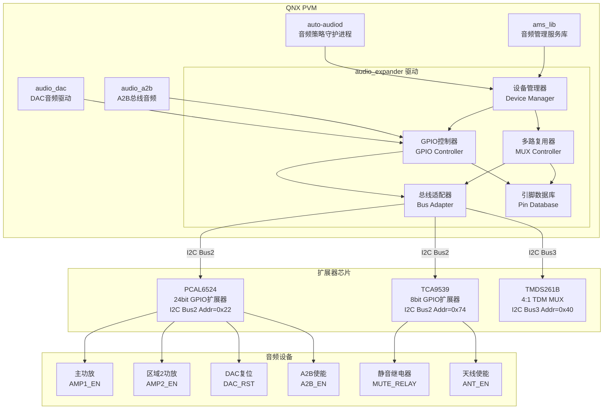
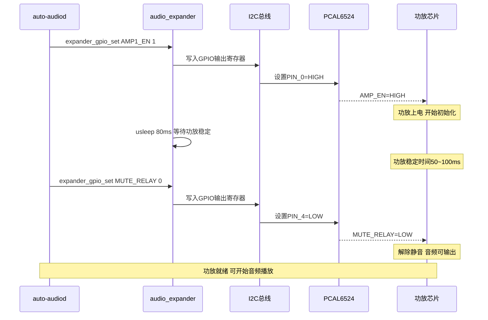
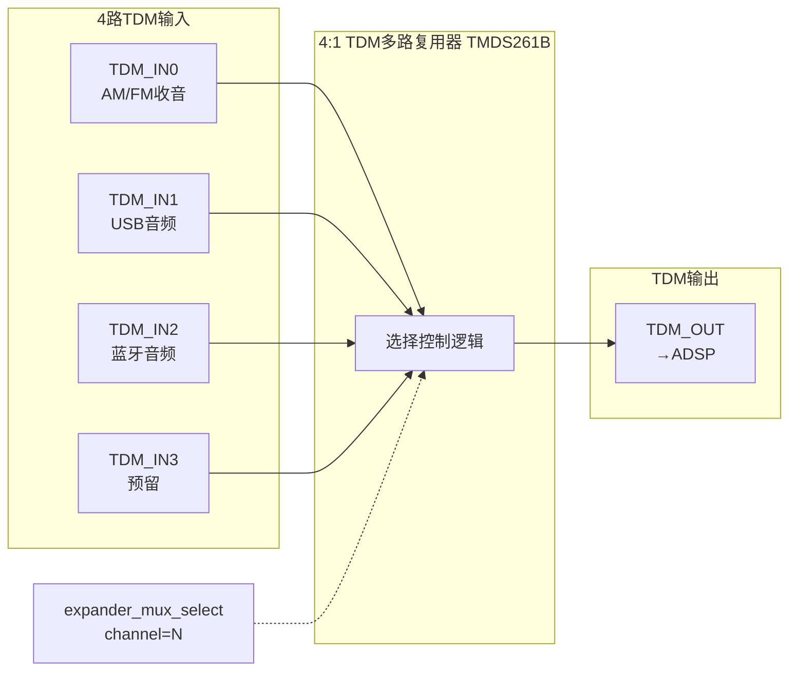
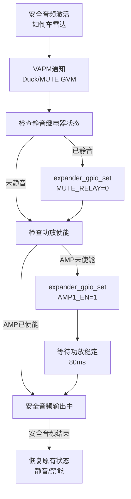
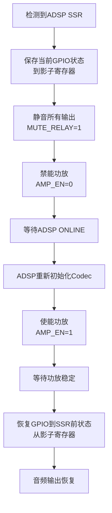

[← 16.21 QNX audio_dac DAC音频驱动](16_16.21_QNX_audio_dac_DAC音频驱动.md) | [← 返回16章](README.md) | [返回导航](../README.md)

---

## 16.22 audio_expander — QNX音频扩展器

### 16.22.1 概述

`audio_expander` 是QNX域中的音频I/O扩展管理模块，运行在QNX Primary VM中。它负责管理音频系统中的**I/O扩展器芯片**（如I2C GPIO扩展器、I2S/TDM多路复用器、电平转换器、模拟开关等），为音频硬件提供额外的控制通道和信号路由能力。在SA8295车载音频系统中，扩展器用于解决主SoC GPIO/I2S接口不足的问题，实现更多音频设备的灵活接入和精确控制。

> **架构归属说明**
> `audio_expander` 属于 **audio_common 共享组件**（并非 Elite 或 AudioReach 专有），真实源码路径为：
> `Qnx/apps/qnx_ap/AMSS/multimedia/audio/audio_common/audio_expander/`
> 与 audio_dac（16.21）同属 `audio_common/` 目录，被 Elite（adp_8295）与 AudioReach（adp_8295_ar）两套板级配置共用，是与架构无关的底层 I/O 扩展驱动。（注：本节示例中的 `vendor/qcom/proprietary/audio_expander/` 为逻辑归类路径，磁盘实际路径以上述 QNX 源码树为准。）

### 架构定位

| 维度 | 说明 |
|------|------|
| 层级 | QNX音频栈外设驱动层 |
| 运行域 | QNX PVM（Primary VM） |
| 驱动类型 | QNX资源管理器（Resource Manager） |
| 核心职责 | 音频I/O扩展器管理、GPIO控制、信号多路复用、设备使能/禁能 |
| 与Android关系 | Android不直接控制扩展器；扩展器由QNX独占管理 |
| 安全属性 | 扩展器可用于安全音频设备的使能控制（如安全扬声器切换） |

### 扩展器在车载音频中的典型应用

| 扩展器类型 | 典型芯片 | 应用场景 | 控制接口 |
|-----------|---------|----------|---------|
| I2C GPIO扩展器 | PCAL6524, TCA9539 | 控制功放使能、DAC复位、静音继电器 | I2C |
| I2S/TDM多路复用器 | TMDS261B, ADG1606 | 多路音频信号切换(AM/FM/USB/BT) | I2C/SPI |
| 电平转换器 | TXB0108 | 3.3V/1.8V电平转换 连接不同电压域 | 无(直连) |
| 模拟开关 | ADG732 | 模拟音频信号路由切换 | I2C/GPIO |

### 与其他QNX组件的关系

| 组件 | 交互方式 | 说明 |
|------|----------|------|
| audio_driver_vm | 通过内核I2C/SPI接口 | 扩展器驱动的I2C/SPI操作经内核驱动完成 |
| audio_dac | GPIO控制 | DAC芯片的复位/使能通过扩展器GPIO控制 |
| audio_a2b | GPIO控制 | A2B节点的使能/复位通过扩展器GPIO控制 |
| ams_lib | 路由变更通知 | 音频路由变更时可能需要通过扩展器切换信号路径 |
| auto-audiod | 策略决策 | 策略守护进程通过扩展器控制音频设备上下电 |
| AGM Service | 间接依赖 | AGM打开图时需要扩展器已正确配置设备使能 |

### 16.22.2 系统架构



### 16.22.3 源码路径与头文件

### 目录结构

```
vendor/qcom/proprietary/audio_expander/
├── inc/
│   ├── audio_expander.h     # 扩展器主头文件
│   ├── aud_handle.h         # 音频句柄定义
│   ├── aud_gpio.h           # GPIO控制接口
│   ├── aud_mux.h            # 多路复用器接口
│   ├── aud_expander_db.h    # 引脚数据库接口
│   └── aud_expander_cfg.h   # 配置文件解析
├── src/
│   ├── audio_expander.c     # 扩展器驱动核心实现
│   ├── aud_gpio.c           # GPIO控制实现
│   ├── aud_mux.c            # 多路复用器实现
│   ├── aud_i2c_adapter.c    # I2C总线适配器
│   ├── aud_spi_adapter.c    # SPI总线适配器
│   └── aud_expander_db.c    # 引脚数据库管理
├── config/
│   └── expander_config.xml  # 扩展器配置文件
└── Makefile
```

### 核心头文件说明

| 头文件 | 定义内容 | 关键数据结构 |
|--------|----------|-------------|
| audio_expander.h | 扩展器驱动的公共API接口 | expander_device_t |
| aud_handle.h | 扩展器设备句柄和实例管理 | aud_handle_t |
| aud_gpio.h | GPIO控制接口定义 | gpio_config_t, gpio_event_t |
| aud_mux.h | 多路复用器接口定义 | mux_config_t |
| aud_expander_db.h | 引脚数据库 | pin_entry_t, pin_map_t |
| aud_expander_cfg.h | XML配置文件解析 | cfg_node_t |

### 16.22.4 关键数据结构

#### 16.22.4.1 aud_handle_t — 扩展器设备句柄

```c
typedef struct aud_handle {
    uint32_t expander_id;     // 扩展器ID (0=EXP0, 1=EXP1)
    uint32_t bus_type;        // 总线类型 (I2C=0, SPI=1)
    uint32_t bus_id;          // 总线ID (I2C Bus2=2, I2C Bus3=3)
    uint32_t dev_addr;        // 设备地址 (I2C 7位地址)
    uint32_t num_pins;        // GPIO引脚数 (PCAL6524=24, TCA9539=8)
    uint32_t chip_type;       // 芯片类型 (PCAL6524=0x01, TCA9539=0x02)
    bool     initialized;     // 初始化状态
    void    *bus_handle;      // 总线操作句柄
    uint8_t  pin_shadow[32];  // GPIO输出影子寄存器(软件缓存)
    uint8_t  pin_dir[32];     // GPIO方向缓存(0=in, 1=out)
} aud_handle_t;
```

| 字段 | 说明 | 典型值 |
|------|------|--------|
| expander_id | 系统中扩展器芯片的编号 | 0, 1, 2 |
| bus_type | 扩展器连接的总线类型 | I2C(0), SPI(1) |
| bus_id | 总线实例编号 | 2, 3, 4 |
| dev_addr | I2C从设备7位地址 | 0x22, 0x74, 0x40 |
| num_pins | 扩展器提供的GPIO引脚总数 | 8, 16, 24 |
| pin_shadow | 输出值缓存 避免每次都读硬件 | 0x00~0xFF |
| pin_dir | 方向缓存 记录哪些引脚是输出 | 0x00~0xFF |

#### 16.22.4.2 expander_pin_config_t — 引脚配置

```c
typedef struct {
    uint32_t pin_number;      // 引脚号 (0~num_pins-1)
    uint8_t  direction;       // 0=输入, 1=输出
    uint8_t  default_value;   // 默认值(输出引脚, 0或1)
    uint8_t  polarity;        // 0=正常, 1=反转(低有效)
    uint8_t  pull_up;         // 0=无上拉, 1=使能上拉
    uint8_t  pull_down;       // 0=无下拉, 1=使能下拉
    uint8_t  interrupt_cap;   // 0=无中断, 1=上升沿, 2=下降沿, 3=双边沿
    char     function[32];    // 引脚功能描述 (如AMP1_EN)
} expander_pin_config_t;
```

#### 16.22.4.3 mux_config_t — 多路复用器配置

```c
typedef struct {
    uint32_t mux_id;          // MUX设备ID
    uint32_t num_channels;    // 输入通道数 (如4:1=4)
    uint32_t current_channel; // 当前选中的通道
    uint32_t signal_type;     // 0=数字TDM, 1=模拟音频
    uint32_t bandwidth;       // 带宽要求 (48kHz/96kHz/192kHz)
} mux_config_t;
```

### 16.22.5 核心API接口详解

#### 16.22.5.1 设备管理接口

| API | 参数 | 返回值 | 说明 |
|-----|------|--------|------|
| expander_open | expander_id, config | aud_handle_t* | 打开扩展器设备 初始化I2C/SPI连接 |
| expander_close | handle | int | 关闭扩展器设备 释放资源 |
| expander_get_status | handle, status* | int | 获取扩展器运行状态 |
| expander_reset | handle | int | 复位扩展器芯片 恢复默认值 |

#### 16.22.5.2 GPIO控制接口

| API | 参数 | 返回值 | 说明 |
|-----|------|--------|------|
| expander_gpio_set | handle, pin, value | int | 设置GPIO引脚值(0/1) |
| expander_gpio_get | handle, pin | int | 获取GPIO引脚当前值 |
| expander_gpio_config | handle, pin_config | int | 配置GPIO引脚方向/极性/上下拉 |
| expander_gpio_toggle | handle, pin | int | 翻转GPIO引脚值 |
| expander_gpio_set_mask | handle, mask, value | int | 批量设置多个GPIO引脚 |
| expander_gpio_get_mask | handle, mask | uint32_t | 批量读取多个GPIO引脚 |

#### 16.22.5.3 多路复用器接口

| API | 参数 | 返回值 | 说明 |
|-----|------|--------|------|
| expander_mux_open | mux_id, config | aud_handle_t* | 打开多路复用器 |
| expander_mux_close | handle | int | 关闭多路复用器 |
| expander_mux_select | handle, channel | int | 选择多路复用器通道 |
| expander_mux_get_channel | handle | int | 获取当前选中的通道 |
| expander_mux_get_config | handle, config* | int | 获取MUX配置信息 |

#### 16.22.5.4 典型GPIO操作代码

```c
// 功放使能控制示例
int enable_main_amplifier(void) {
    aud_handle_t *h = get_expander_handle(EXP0);
    
    // Step 1: 功放使能
    int ret = expander_gpio_set(h, PIN_AMP1_EN, 1);
    if (ret != 0) {
        ALOGE("Failed to enable AMP1: %d", ret);
        return ret;
    }
    
    // Step 2: 等待功放稳定 (典型50~100ms)
    usleep(80000);  // 80ms
    
    // Step 3: 解除静音继电器
    ret = expander_gpio_set(h, PIN_MUTE_RELAY, 0);  // 低有效
    if (ret != 0) {
        ALOGE("Failed to unmute relay: %d", ret);
        // 回滚: 禁能功放
        expander_gpio_set(h, PIN_AMP1_EN, 0);
        return ret;
    }
    
    ALOGI("Main amplifier enabled successfully");
    return 0;
}

// 功放禁能控制示例
int disable_main_amplifier(void) {
    aud_handle_t *h = get_expander_handle(EXP0);
    
    // Step 1: 激活静音继电器(先静音)
    expander_gpio_set(h, PIN_MUTE_RELAY, 1);
    
    // Step 2: 短暂延时确保静音生效
    usleep(5000);  // 5ms
    
    // Step 3: 功放禁能
    expander_gpio_set(h, PIN_AMP1_EN, 0);
    
    return 0;
}
```

### 16.22.6 扩展器控制场景深度解析

#### 16.22.6.1 功放使能控制完整时序



#### 16.22.6.2 音频信号多路复用

当系统需要在多个音频源之间切换时(如AM/FM收音机↔USB音频↔蓝牙)，通过TDM MUX实现硬件级信号路由：



#### 16.22.6.3 典型GPIO分配表

| GPIO引脚 | 功能 | 默认值 | 极性 | 扩展器 | 说明 |
|----------|------|--------|------|--------|------|
| PIN_0 | 主功放使能 AMP1_EN | 0(disabled) | 高有效 | EXP0 | 控制主扬声器功放 |
| PIN_1 | 区域2功放使能 AMP2_EN | 0(disabled) | 高有效 | EXP0 | 控制头枕扬声器功放 |
| PIN_2 | DAC复位 DAC_RST | 0(reset) | 低=复位 | EXP0 | 低保持复位 高正常工作 |
| PIN_3 | A2B使能 A2B_EN | 0(disabled) | 高有效 | EXP0 | 控制A2B主节点 |
| PIN_4 | 静音继电器 MUTE_RELAY | 1(muted) | 高=静音 | EXP0 | 硬件静音 低=正常输出 |
| PIN_5 | AM/FM天线使能 ANT_EN | 0(disabled) | 高有效 | EXP0 | 控制收音天线放大器 |
| PIN_6 | 通话麦克风选择 MIC_SEL | 0(mic1) | 低=mic1 | EXP1 | 0=主麦克风 1=副麦克风 |
| PIN_7 | ANC使能 ANC_EN | 0(disabled) | 高有效 | EXP1 | 主动噪声消除使能 |
| PIN_8 | 低音炮使能 SUB_EN | 0(disabled) | 高有效 | EXP0 | 独立低音炮功放 |
| PIN_9 | DSP模式选择 DSP_MODE | 0(normal) | 低=正常 | EXP1 | 高=旁路模式 |

### 16.22.7 PCAL6524 GPIO扩展器深度解析

#### 16.22.7.1 芯片特性

| 参数 | PCAL6524 | TCA9539 |
|------|---------|---------|
| 通道数 | 24 GPIO | 8 GPIO |
| I2C接口 | 400kHz Fast-mode | 400kHz Fast-mode |
| 中断输出 | 是(INT引脚) | 是(INT引脚) |
| 上拉/下拉 | 可编程 | 可编程 |
| 输出驱动能力 | 10mA/pin | 10mA/pin |
| 工作电压 | 1.65~5.5V | 1.65~5.5V |
| 封装 | TSSOP-24 | TSSOP-16 |

#### 16.22.7.2 PCAL6524寄存器映射

| 寄存器地址 | 名称 | 功能 | 复位值 |
|-----------|------|------|--------|
| 0x00~0x02 | Input Port | 读取GPIO输入值 | 0xFF |
| 0x04~0x06 | Output Port | 设置GPIO输出值 | 0xFF |
| 0x08~0x0A | Polarity Inv | 极性反转配置 | 0x00 |
| 0x0C~0x0E | Configuration | 方向配置(0=out, 1=in) | 0xFF |
| 0x10~0x12 | Output Drive S | 输出驱动强度 | 0x00 |
| 0x13~0x15 | Input Latch | 输入锁存配置 | 0x00 |
| 0x16~0x18 | Pull-Up Enable | 上拉使能 | 0x00 |
| 0x19~0x1B | Pull-Down Enable | 下拉使能 | 0x00 |
| 0x1C~0x1E | Interrupt Mask | 中断屏蔽 | 0x00 |
| 0x48 | Software Reset | 软复位 | - |

#### 16.22.7.3 I2C操作时序

```c
// 读取GPIO输入值
int pcal6524_read_inputs(aud_handle_t *h, uint8_t *buf) {
    uint8_t reg = 0x00;  // Input Port 0
    return i2c_write_read(h->bus_handle, h->dev_addr,
                          &reg, 1, buf, 3);  // 读取3字节(Port0/1/2)
}

// 设置GPIO输出值
int pcal6524_write_outputs(aud_handle_t *h, uint8_t port, uint8_t val) {
    uint8_t buf[2] = {0x04 + port, val};  // Output Port + port offset
    return i2c_write(h->bus_handle, h->dev_addr, buf, 2);
}

// 配置GPIO方向
int pcal6524_set_direction(aud_handle_t *h, uint8_t port, uint8_t dir) {
    uint8_t buf[2] = {0x0C + port, dir};  // Configuration + port offset
    return i2c_write(h->bus_handle, h->dev_addr, buf, 2);
}
```

### 16.22.8 扩展器与安全音频

#### 16.22.8.1 安全音频设备控制流程



#### 16.22.8.2 安全场景GPIO操作

| 安全场景 | 扩展器操作 | 时序要求 | 说明 |
|----------|-----------|----------|------|
| 倒车雷达激活 | AMP1_EN=1, MUTE_RELAY=0 | <50ms | 确保主功放使能 安全音频可输出 |
| ADAS碰撞预警 | AMP1_EN=1, MUTE_RELAY=0 | <30ms | 最高优先级 快速响应 |
| 仪表告警 | 检查AMP/MUTE状态 必要时使能 | <100ms | 低优先级告警 |
| 安全音频结束 | 恢复原状态 | 渐变 | 不立即禁能 避免pop |
| Android崩溃 | QNX独立控制扩展器 | 立即 | 安全设备不受Android影响 |
| 系统关机 | 全部GPIO设为安全默认值 | 同步 | 功放禁能 DAC复位 静音激活 |

#### 16.22.8.3 安全默认值设计

系统上电后GPIO的安全默认值设计原则：

| GPIO | 安全默认值 | 原因 |
|------|-----------|------|
| AMP1_EN=0 | 功放禁能 | 防止上电pop噪声 |
| AMP2_EN=0 | 功放禁能 | 防止上电pop噪声 |
| DAC_RST=0 | DAC复位 | 保持DAC在复位状态直到配置完成 |
| A2B_EN=0 | A2B禁能 | 避免总线未初始化时干扰 |
| MUTE_RELAY=1 | 静音激活 | 硬件静音确保无噪声输出 |
| ANT_EN=0 | 天线禁能 | 降低功耗 |

### 16.22.9 扩展器与双域架构

#### 16.22.9.1 扩展器在双域架构中的位置

扩展器由QNX独占控制，Android无法直接操作：

```
Android音频设备使能请求:
  Android App → AudioFlinger → AudioControl HAL
    → MM-HAB → QNX auto-audiod
    → audio_expander → GPIO/I2C → 硬件使能

QNX安全音频设备使能:
  QNX安全音频源 → VAPM策略
    → audio_expander → GPIO/I2C → 硬件使能
```

#### 16.22.9.2 双域GPIO操作冲突避免

| 冲突场景 | 避免策略 |
|----------|----------|
| Android和QNX同时请求功放使能 | QNX优先: auto-audiod在QNX域内串行化所有GPIO操作 |
| Android请求使能而QNX需要禁能 | 安全优先: VAPM策略保证安全音频的GPIO操作优先 |
| 两个QNX组件同时操作同一引脚 | 引脚互斥锁: expander内部mutex保护每个引脚 |
| SSR恢复期间GPIO状态不确定 | 引脚影子寄存器: 使用缓存值恢复GPIO状态 |

#### 16.22.9.3 扩展器容错机制

| 故障场景 | 检测方法 | 处理策略 |
|----------|----------|----------|
| I2C通信失败 | I2C读写返回NACK/超时 | 重试3次 间隔10ms |
| 扩展器芯片无响应 | 连续3次I2C失败 | 通知auto-audiod 使用缓存值 |
| GPIO状态异常 | 周期性回读校验(1Hz) | 异常时重新配置 失败则上报 |
| 中断风暴 | 中断频率>10Hz | 屏蔽中断 改为轮询模式 |
| 上电默认值异常 | 启动时全量校验 | 重新写入安全默认值 |

### 16.22.10 扩展器配置文件

### expander_config.xml示例

```xml
<?xml version="1.0" encoding="UTF-8"?>
<expander_config>
    <expander id="0">
        <chip_type>PCAL6524</chip_type>
        <i2c_bus>2</i2c_bus>
        <i2c_addr>0x22</i2c_addr>
        <num_pins>24</num_pins>
        
        <pin index="0" name="AMP1_EN" direction="out" 
             default="0" polarity="active_high" pull="down"/>
        <pin index="1" name="AMP2_EN" direction="out" 
             default="0" polarity="active_high" pull="down"/>
        <pin index="2" name="DAC_RST" direction="out" 
             default="0" polarity="active_low" pull="up"/>
        <pin index="3" name="A2B_EN" direction="out" 
             default="0" polarity="active_high" pull="down"/>
        <pin index="4" name="MUTE_RELAY" direction="out" 
             default="1" polarity="active_high" pull="up"/>
        <pin index="5" name="ANT_EN" direction="out" 
             default="0" polarity="active_high" pull="down"/>
        <pin index="8" name="SUB_EN" direction="out" 
             default="0" polarity="active_high" pull="down"/>
        <pin index="10" name="AMP1_FAULT" direction="in" 
             interrupt="falling_edge"/>
        <pin index="11" name="AMP2_FAULT" direction="in" 
             interrupt="falling_edge"/>
    </expander>
    
    <expander id="1">
        <chip_type>TCA9539</chip_type>
        <i2c_bus>2</i2c_bus>
        <i2c_addr>0x74</i2c_addr>
        <num_pins>8</num_pins>
        
        <pin index="0" name="MIC_SEL" direction="out" 
             default="0" polarity="active_high"/>
        <pin index="1" name="ANC_EN" direction="out" 
             default="0" polarity="active_high"/>
        <pin index="2" name="DSP_MODE" direction="out" 
             default="0" polarity="active_low"/>
    </expander>
    
    <mux id="0">
        <chip_type>TMDS261B</chip_type>
        <i2c_bus>3</i2c_bus>
        <i2c_addr>0x40</i2c_addr>
        <num_channels>4</num_channels>
        <signal_type>digital_tdm</signal_type>
        <bandwidth>48000</bandwidth>
        <default_channel>0</default_channel>
    </mux>
</expander_config>
```

### 16.22.11 调试接口与日志

#### 16.22.11.1 调试命令

```bash
# 查看扩展器状态
cat /dev/audio_expander0/status
cat /dev/audio_expander1/status

# 读取扩展器GPIO值
i2c-tools -r /dev/i2c2 -a 0x22 -o 0x00   # PCAL6524输入
i2c-tools -r /dev/i2c2 -a 0x22 -o 0x04   # PCAL6524输出
i2c-tools -r /dev/i2c2 -a 0x22 -o 0x0C   # PCAL6524方向

# 读取TCA9539
i2c-tools -r /dev/i2c2 -a 0x74 -o 0x00   # 输入寄存器

# 扩展器日志
slog2info | grep audio_expander
slog2info | grep AudioExpGPIO
```

#### 16.22.11.2 关键日志标签

| 标签 | 级别 | 说明 |
|------|------|------|
| AudioExpander | INFO | 扩展器驱动核心日志 |
| AudioExpGPIO | DEBUG | GPIO操作日志(每次set/get) |
| AudioExpMUX | DEBUG | 多路复用器操作日志 |
| AudioExpI2C | ERROR | I2C通信错误日志 |
| AudioExpDB | DEBUG | 引脚数据库操作日志 |

#### 16.22.11.3 常见问题排查

| 问题 | 排查步骤 |
|------|----------|
| GPIO设置无效果 | 1.读取输出寄存器确认写入 2.检查方向配置是否为输出 3.检查极性配置 |
| I2C通信超时 | 1.检查I2C总线状态 2.验证设备地址 3.检查上拉电阻 4.降低I2C时钟频率 |
| 扩展器初始化失败 | 1.检查I2C总线是否可达 2.验证chip_type与实际芯片匹配 3.检查I2C地址配置 |
| GPIO状态意外变化 | 1.检查是否有多个组件操作同一引脚 2.查看引脚互斥锁状态 3.检查中断是否导致状态重置 |
| 功放无法使能 | 1.检查AMP_EN引脚GPIO值 2.检查MUTE_RELAY状态 3.验证功放供电是否正常 |
| MUX切换后无声 | 1.检查MUX通道选择 2.验证TDM信号格式 3.检查切换时序 |

### 16.22.12 SSR恢复与扩展器

#### 16.22.12.1 SSR恢复时扩展器处理



#### 16.22.12.2 引脚影子寄存器机制

```c
// 影子寄存器: 软件维护的GPIO状态缓存
// 避免SSR后硬件状态与软件预期不一致

typedef struct {
    uint8_t output_shadow[4];  // 输出值缓存(每扩展器)
    uint8_t direction_shadow[4]; // 方向缓存
    uint8_t polarity_shadow[4];  // 极性缓存
    bool    valid;               // 缓存是否有效
} pin_shadow_db_t;

// SSR恢复时从影子寄存器恢复
void restore_from_shadow(aud_handle_t *h) {
    if (!h->pin_shadow_db.valid) {
        // 影子寄存器无效 使用安全默认值
        load_safe_defaults(h);
        return;
    }
    
    // 逐端口恢复输出值
    for (int port = 0; port < 3; port++) {
        pcal6524_write_outputs(h, port,
            h->pin_shadow_db.output_shadow[port]);
    }
}
```

### 16.22.13 完整API接口参考

| API | 参数 | 返回值 | 说明 |
|-----|------|--------|------|
| expander_open | id, config | aud_handle_t* | 打开扩展器设备 |
| expander_close | handle | int | 关闭扩展器设备 |
| expander_reset | handle | int | 复位扩展器芯片 |
| expander_get_status | handle, status* | int | 获取扩展器状态 |
| expander_gpio_set | handle, pin, value | int | 设置GPIO值 |
| expander_gpio_get | handle, pin | int | 获取GPIO值 |
| expander_gpio_config | handle, pin_config | int | 配置GPIO方向/极性 |
| expander_gpio_toggle | handle, pin | int | 翻转GPIO值 |
| expander_gpio_set_mask | handle, mask, value | int | 批量设置GPIO |
| expander_gpio_get_mask | handle, mask | uint32_t | 批量读取GPIO |
| expander_mux_open | mux_id, config | aud_handle_t* | 打开MUX设备 |
| expander_mux_close | handle | int | 关闭MUX设备 |
| expander_mux_select | handle, channel | int | 选择MUX通道 |
| expander_mux_get_channel | handle | int | 获取当前MUX通道 |
| expander_save_state | handle | int | 保存当前状态到影子寄存器 |
| expander_restore_state | handle | int | 从影子寄存器恢复状态 |

---

[← 16.21 QNX audio_dac DAC音频驱动](16_16.21_QNX_audio_dac_DAC音频驱动.md) | [← 返回16章](README.md) | [返回导航](../README.md)