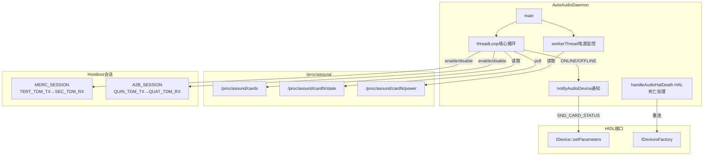
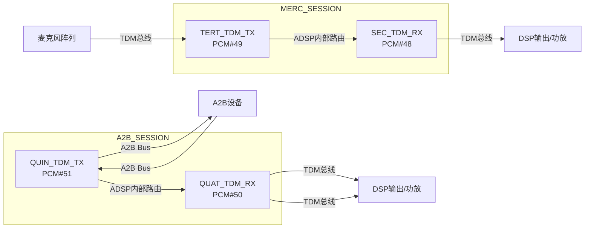

[← 16.1 概述](16_16.1_概述.md) | [← 返回SA8295 Vendor+QNX双域音频架构深度解析](README.md) | [返回导航](../README.md) | [16.3 AutoPower与VHAL集成 →](16_16.3_AutoPower与VHAL集成.md)

---

## 16.2 auto-audiod守护进程

> **为什么你可能没听说过auto-audiod？** auto-audiod是SA8295平台**Android域特有的vendor proprietary组件**，源码不在AOSP开源仓库中（位于`vendor/qcom/proprietary/`私有目录）。它在非虚拟化的手机平台上不存在——手机平台通常没有Android+QNX双域架构，因此不需要跨域的声卡监控守护进程。在SA8295的QNX主控架构下，auto-audiod只是Android域的辅助角色，真正控制ADSP的是QNX域的Audio Resource Manager。

### 16.2.1 架构概述

`auto-audiod`是SA8295 Android域的音频守护进程(vendor proprietary)，负责在Android域侧辅助管理音频硬件状态：

1. **声卡状态监控** — 轮询`/proc/asound/cardN/state`检测ADSP在线/离线（Android域视角）
2. **Hostless会话管理** — 在声卡上线时启用、下线时禁用TDM直连通路（这些通路最终由QNX域的Audio Resource Manager配置）
3. **SSR(Subsystem Restart)恢复** — ADSP重启后在Android域侧重新建立音频通路请求（实际ADSP控制由QNX域仲裁）
4. **Audio HAL通知** — 通过HIDL接口通知Audio HAL声卡状态变化，使Android域音频栈能做出相应调整

> **注意**：auto-audiod监控的ADSP声卡状态(`/proc/asound/cardN/state`)是QNX域控制下的ASOUND ALSA内核驱动暴露的接口。auto-audiod只是Android域的观察者和请求发起方，ADSP的真正控制权在QNX域的Audio Resource Manager手中。



### 16.2.2 AutoAudioDaemon类定义

`AutoAudioDaemon`继承`IBinder::DeathRecipient`，用于监听Audio HAL进程死亡事件：

```cpp
class AutoAudioDaemon : public IBinder::DeathRecipient {
public:
    AutoAudioDaemon();
    virtual ~AutoAudioDaemon();

    // IBinder::DeathRecipient
    void binderDied(const wp<IBinder>& who) override;

    // 核心方法
    int threadLoop();        // 主循环：监控声卡状态
    int workerThread();      // 工作线程：监控电源状态

private:
    // 声卡相关
    int getSndCardFDs();     // 获取声卡文件描述符
    void notifyAudioDevice(int card, const char *status);
    void handleAudioHalDeath();

    // Hostless管理
    void enable_hostless(int session_type);
    void disable_hostless(int session_type);

    // Audio HAL HIDL接口
    sp<IDevicesFactory> mDevicesFactory;
    sp<IDevice> mPrimaryDevice;

    // 声卡文件描述符
    struct snd_card_info {
        int card_num;
        int state_fd;       // /proc/asound/cardN/state
        int power_fd;       // /proc/asound/cardN/power
    };
    std::vector<snd_card_info> mSndCards;
};
```

### 16.2.3 threadLoop()核心循环

`threadLoop()`是auto-audiod的核心执行循环，通过`poll()`系统调用阻塞等待声卡状态变化：

```cpp
int AutoAudioDaemon::threadLoop() {
    while (!mExitRequested) {
        // Step 1: 获取声卡文件描述符
        getSndCardFDs();

        // Step 2: poll等待声卡状态变化
        int ret = poll(mPollFds, mPollFdCount, -1);

        if (ret > 0) {
            for (auto& card : mSndCards) {
                char state[32] = {0};
                lseek(card.state_fd, 0, SEEK_SET);
                read(card.state_fd, state, sizeof(state) - 1);

                if (strncmp(state, "ONLINE", 6) == 0) {
                    // ADSP上线：启用hostless会话并通知Audio HAL
                    enable_hostless(MERC_SESSION);
                    enable_hostless(A2B_SESSION);
                    notifyAudioDevice(card.card_num, "ONLINE");
                } else if (strncmp(state, "OFFLINE", 7) == 0) {
                    // ADSP离线：禁用hostless会话并通知Audio HAL
                    disable_hostless(MERC_SESSION);
                    disable_hostless(A2B_SESSION);
                    notifyAudioDevice(card.card_num, "OFFLINE");
                }
            }
        }
    }
    return 0;
}
```

### 16.2.4 getSndCardFDs()声卡发现

`getSndCardFDs()`通过读取`/proc/asound/cards`发现ADSP声卡，并打开其state和power文件描述符：

```cpp
int AutoAudioDaemon::getSndCardFDs() {
    FILE *fp = fopen("/proc/asound/cards", "r");
    if (!fp) return -errno;

    char line[256];
    while (fgets(line, sizeof(line), fp)) {
        int card_num;
        char card_name[64];
        // 解析声卡信息： " 0 [sa8295adpst]: sa8295-adp-star-snd-card"
        if (sscanf(line, " %d [%[^]]", &card_num, card_name) != 2)
            continue;

        // 过滤ADSP声卡：以msm/apq/sa开头
        if (strncmp(card_name, "msm", 3) != 0 &&
            strncmp(card_name, "apq", 3) != 0 &&
            strncmp(card_name, "sa", 2) != 0)
            continue;

        // 打开state和power文件描述符
        snd_card_info info;
        info.card_num = card_num;

        char path[128];
        snprintf(path, sizeof(path), "/proc/asound/card%d/state", card_num);
        info.state_fd = open(path, O_RDONLY);

        snprintf(path, sizeof(path), "/proc/asound/card%d/power", card_num);
        info.power_fd = open(path, O_RDONLY);

        mSndCards.push_back(info);
    }
    fclose(fp);
    return 0;
}
```

### 16.2.5 notifyAudioDevice()通知机制

当检测到声卡状态变化时，通过HIDL `IDevice::setParameters()`接口通知Audio HAL：

```cpp
void AutoAudioDaemon::notifyAudioDevice(int card, const char *status) {
    if (mPrimaryDevice == nullptr) {
        // 尝试重新连接Audio HAL
        handleAudioHalDeath();
        return;
    }

    char param[128];
    snprintf(param, sizeof(param), "SND_CARD_STATUS=%d,%s", card, status);

    // 通过HIDL接口通知Audio HAL
    Return<void> ret = mPrimaryDevice->setParameters(
        0 /*halVersion*/, param, [&](int ret) {
            if (ret != 0) {
                ALOGE("setParameters failed: %d", ret);
            }
        });
}
```

### 16.2.6 handleAudioHalDeath()死亡通知处理

当Audio HAL进程异常死亡时，`AutoAudioDaemon`需要重新建立HIDL连接：

```cpp
void AutoAudioDaemon::handleAudioHalDeath() {
    ALOGW("Audio HAL died, reconnecting...");

    // 重新获取IDevicesFactory服务
    mDevicesFactory = IDevicesFactory::getService();
    if (mDevicesFactory == nullptr) {
        ALOGE("Failed to get IDevicesFactory service");
        return;
    }

    // 注册死亡通知
    Return<bool> linked = mDevicesFactory->linkToDeath(
        this /*DeathRecipient*/, 0 /*cookie*/);
    if (!linked.isOk() || !linked) {
        ALOGE("Failed to linkToDeath on IDevicesFactory");
    }

    // 打开Primary Device
    Return<void> ret = mDevicesFactory->openPrimaryDevice(
        [&](Result result, const sp<IDevice>& device) {
            if (result == Result::OK && device != nullptr) {
                mPrimaryDevice = device;
            }
        });
}
```

### 16.2.7 workerThread()电源状态监控

`workerThread()`运行在独立线程中，监控ADSP电源状态变化(D3hot/D0)，用于低功耗状态下的hostless管理：

```cpp
int AutoAudioDaemon::workerThread() {
    while (!mExitRequested) {
        for (auto& card : mSndCards) {
            char power[32] = {0};
            lseek(card.power_fd, 0, SEEK_SET);
            read(card.power_fd, power, sizeof(power) - 1);

            if (strstr(power, "D3hot")) {
                // ADSP进入低功耗：禁用hostless
                ALOGI("Card %d entering D3hot, disabling hostless",
                      card.card_num);
                disable_hostless(MERC_SESSION);
                disable_hostless(A2B_SESSION);
            } else if (strstr(power, "D0")) {
                // ADSP恢复正常：启用hostless
                ALOGI("Card %d entering D0, enabling hostless",
                      card.card_num);
                enable_hostless(MERC_SESSION);
                enable_hostless(A2B_SESSION);
            }
        }
        usleep(100000); // 100ms轮询间隔
    }
    return 0;
}
```

### 16.2.8 Hostless会话详解

Hostless会话是SA8295平台的关键设计，它建立TDM TX→TDM RX的直连通路，音频数据不经Android域处理，直接在ADSP内部从输入路由到输出。

#### 会话类型

```cpp
// Hostless会话类型定义
typedef enum {
    MERC_SESSION = 0,  // Mercury会话：TERT_TDM_TX → SEC_TDM_RX
    A2B_SESSION  = 1,  // A2B会话：QUIN_TDM_TX → QUAT_TDM_RX
} hostless_session_t;

// PCM设备ID映射
#define SEC_TDM_RX_HOSTLESS   48  // Secondary TDM RX Hostless PCM
#define TERT_TDM_TX_HOSTLESS  49  // Tertiary TDM TX Hostless PCM
#define QUAT_TDM_RX_HOSTLESS  50  // Quaternary TDM RX Hostless PCM
#define QUAT_TDM_TX_HOSTLESS  51  // Quaternary TDM TX Hostless PCM
```

#### Hostless数据流



#### enable_hostless()实现

```cpp
int AutoAudioDaemon::enable_hostless(int session_type) {
    struct pcm *tx_pcm = nullptr, *rx_pcm = nullptr;
    struct mixer *mixer = mixer_open(SND_CARD);

    switch (session_type) {
    case MERC_SESSION: {
        // Step 1: 设置TDM Port Mixer（建立TX→RX路由）
        mixer_ctl_set_value(
            mixer_get_by_name(mixer,
                "TERT_TDM_TX_0 Port Mixer SEC_TDM_RX_0"),
            0, 1);

        // Step 2: 打开TX和RX PCM设备
        tx_pcm = pcm_open(SND_CARD, TERT_TDM_TX_HOSTLESS,
                          PCM_IN, &pcm_config_hostless);
        rx_pcm = pcm_open(SND_CARD, SEC_TDM_RX_HOSTLESS,
                          PCM_OUT, &pcm_config_hostless);

        // Step 3: 启动PCM
        pcm_start(tx_pcm);
        pcm_start(rx_pcm);

        // Step 4: 获取wakelock防止系统休眠
        acquire_wake_lock("hostless_merc");
        break;
    }
    case A2B_SESSION: {
        mixer_ctl_set_value(
            mixer_get_by_name(mixer,
                "QUIN_TDM_TX_0 Port Mixer QUAT_TDM_RX_0"),
            0, 1);

        tx_pcm = pcm_open(SND_CARD, QUAT_TDM_TX_HOSTLESS,
                          PCM_IN, &pcm_config_hostless);
        rx_pcm = pcm_open(SND_CARD, QUAT_TDM_RX_HOSTLESS,
                          PCM_OUT, &pcm_config_hostless);

        pcm_start(tx_pcm);
        pcm_start(rx_pcm);

        acquire_wake_lock("hostless_a2b");
        break;
    }
    }
    return 0;
}
```

#### disable_hostless()实现

```cpp
int AutoAudioDaemon::disable_hostless(int session_type) {
    switch (session_type) {
    case MERC_SESSION: {
        // Step 1: 关闭PCM设备
        pcm_close(mMercTxPcm);
        pcm_close(mMercRxPcm);
        mMercTxPcm = nullptr;
        mMercRxPcm = nullptr;

        // Step 2: 重置Port Mixer路由
        mixer_ctl_set_value(
            mixer_get_by_name(mixer,
                "TERT_TDM_TX_0 Port Mixer SEC_TDM_RX_0"),
            0, 0);

        // Step 3: 释放wakelock
        release_wake_lock("hostless_merc");
        break;
    }
    case A2B_SESSION: {
        pcm_close(mA2BTxPcm);
        pcm_close(mA2BRxPcm);
        mA2BTxPcm = nullptr;
        mA2BRxPcm = nullptr;

        mixer_ctl_set_value(
            mixer_get_by_name(mixer,
                "QUIN_TDM_TX_0 Port Mixer QUAT_TDM_RX_0"),
            0, 0);

        release_wake_lock("hostless_a2b");
        break;
    }
    }
    return 0;
}
```

### 16.2.9 Wakelock引用计数管理

Hostless会话使用wakelock防止系统进入休眠状态，采用引用计数机制：

```cpp
// Wakelock文件路径
static const char *wake_lock_path   = "/sys/power/wake_lock";
static const char *wake_unlock_path = "/sys/power/wake_unlock";

static int wakelock_ref_count = 0;

void acquire_wake_lock(const char *name) {
    wakelock_ref_count++;
    if (wakelock_ref_count == 1) {
        int fd = open(wake_lock_path, O_WRONLY);
        write(fd, name, strlen(name));
        close(fd);
    }
}

void release_wake_lock(const char *name) {
    if (wakelock_ref_count > 0) {
        wakelock_ref_count--;
    }
    if (wakelock_ref_count == 0) {
        int fd = open(wake_unlock_path, O_WRONLY);
        write(fd, name, strlen(name));
        close(fd);
    }
}
```

---

---

[← 16.1 概述](16_16.1_概述.md) | [← 返回SA8295 Vendor+QNX双域音频架构深度解析](README.md) | [返回导航](../README.md) | [16.3 AutoPower与VHAL集成 →](16_16.3_AutoPower与VHAL集成.md)
