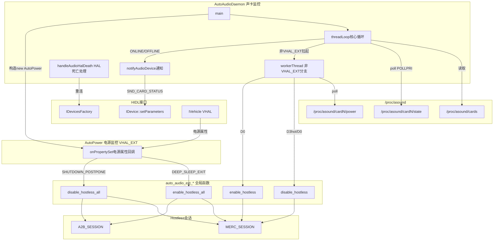
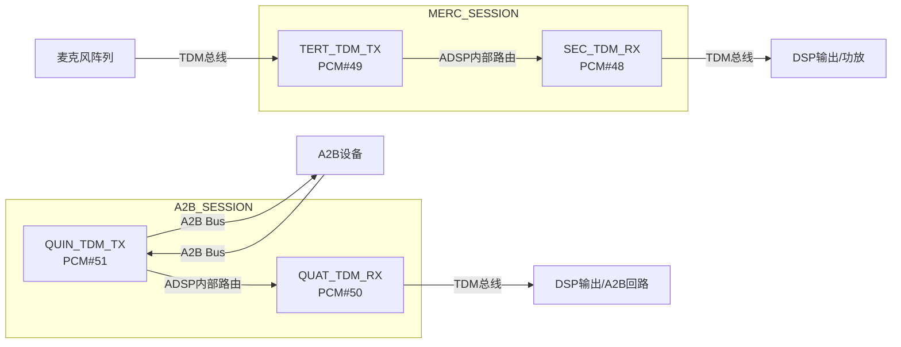

[← 16.1 概述](16_16.1_概述.md) | [← 返回SA8295 Vendor+QNX双域音频架构深度解析](README.md) | [返回导航](../README.md) | [16.3 AutoPower与VHAL集成 →](16_16.3_AutoPower与VHAL集成.md)

---

## 16.2 auto-audiod守护进程

> **为什么你可能没听说过auto-audiod？** auto-audiod是SA8295平台**Android域特有的vendor proprietary组件**，源码不在AOSP开源仓库中（位于`vendor/qcom/proprietary/`私有目录）。它在非虚拟化的手机平台上不存在——手机平台通常没有Android+QNX双域架构，因此不需要跨域的声卡监控守护进程。在SA8295的QNX主控架构下，auto-audiod只是Android域的辅助角色，真正控制ADSP的是QNX域的Audio Resource Manager。

### 16.2.1 架构概述

`auto-audiod`是SA8295 Android域的音频守护进程(vendor proprietary)，负责在Android域侧辅助管理音频硬件状态：

1. **声卡状态监控** — 通过`getSndCardFDs()`读取`/proc/asound/cardN/state`检测ADSP在线/离线（Android域视角），状态变化通过`threadLoop()`处理
2. **Audio HAL通知与死亡重连** — 声卡状态变化时通过HIDL通知Audio HAL（`AHAL_EXT`），并监听Audio HAL进程死亡后重连（`handleAudioHalDeath`）
3. **��源监控（委托）** — 电源相关处理委托给`AutoPower`（`mAutoPower`，`VHAL_EXT`下）订阅VHAL电源属性
4. **Hostless会话（由AutoPower触发，非本类）** — TDM直连通路的启停是`auto_audio_ext_*`全局函数，真实调用者是`AutoPower`在车辆电源事件回调里触发（详见 [16.2.8](#1628-hostless会话详解) / [16.3](16_16.3_AutoPower与VHAL集成.md)），这些通路最终由QNX域的Audio Resource Manager配置

> **注意**：auto-audiod监控的ADSP声卡状态(`/proc/asound/cardN/state`)是QNX域控制下的ASOUND ALSA内核驱动暴露的接口。auto-audiod只是Android域的观察者和请求发起方，ADSP的真正控制权在QNX域的Audio Resource Manager手中。Hostless会话的启停**不在`AutoAudioDaemon`类中**，而是`AutoPower`响应车辆电源状态时调用的全局函数。



### 16.2.2 AutoAudioDaemon类定义

> **重要澄清（基于真实源码 `vendor/qcom/proprietary/mm-audio-auto/auto-audiod/AutoAudioDaemon.h/.cpp`）**：`AutoAudioDaemon`类本身**不包含**任何`enable_hostless/disable_hostless`成员方法。Hostless会话的启停是一组**C全局函数**（`auto_audio_ext_*`，声明在`auto_audio_ext.h`）。**其触发者按编译分支不同**：
> - **`VHAL_EXT`编译（SA8295 采用）**：由`AutoPower`在车辆电源事件回调`onPropertySet()`里调用`auto_audio_ext_enable/disable_hostless_all()`；
> - **非`VHAL_EXT`编译**：由文件级static函数`workerThread()`（`threadLoop()`为每张声卡拉起的线程）poll `/proc/asound/cardN/power`(D0/D3hot)后调用`auto_audio_ext_enable/disable_hostless()`。
>
> 因此`AutoAudioDaemon`在SA8295(VHAL_EXT)下确实只做**声卡state监控与Audio HAL通知/重连**，hostless交给`AutoPower`。详见 [16.2.8](#1628-hostless会话详解) 与 [16.3](16_16.3_AutoPower与VHAL集成.md)。

`AutoAudioDaemon`继承`IBinder::DeathRecipient`，用于监听Audio HAL进程死亡事件：

```cpp
// 文件级结构与枚举（非类成员）
enum notify_status {
    SND_CARD_ONLINE, SND_CARD_OFFLINE,
    POWER_D0, POWER_D1, POWER_D2, POWER_D3hot, POWER_D3cold,
};
enum notify_status_type { SND_CARD_STATE, POWER_STATE };
struct snd_card_fd { int snd_card; int state; int power; };

class AutoAudioDaemon : public IBinder::DeathRecipient {
    // IBinder::DeathRecipient 覆写（private）
    virtual void binderDied(const wp<IBinder>& the_late_who);

    bool getSndCardFDs(std::vector<snd_card_fd>& sndcardFds);
    void putSndCardFDs(std::vector<snd_card_fd>& sndcardFds);

#ifdef AHAL_EXT   // Audio HAL 通知与死亡重连（编译开关）
    void notifyAudioDevice(int snd_card, notify_status status,
                           notify_status_type type);
    void handleAudioHalDeath();

    class AudioHalDeathRecipient : public hidl_death_recipient {
        // ... 监听 IDevicesFactory 死亡
    };
#endif

#ifdef AHAL_EXT
    // HIDL 参数组装 / 获取 Device 实例（均为 private）
    status_t parametersFromStr(const String8& key, const String8& value,
                               hidl_vec<ParameterValue>* hidlParams);
    status_t getDeviceInstance();     // 经 IDevicesFactory 拿 IDevice
#endif

public:
    AutoAudioDaemon();
    virtual ~AutoAudioDaemon();
    bool threadLoop();               // 唯一公开核心方法

private:
    std::vector<snd_card_fd> mSndCardFd;
    std::vector<pthread_t>   mThread;  // 非VHAL_EXT下每张声卡的 workerThread 句柄

#ifdef AHAL_EXT
    sp<IDevicesFactory> mDevicesFactory;
    sp<IDevice>         mDevice;
    sp<AudioHalDeathRecipient> mAudioHalDeathRecipient;
#endif

#ifdef VHAL_EXT
    sp<AutoPower> mAutoPower;         // 电源监控委托给 AutoPower
#endif
};
```

**构造/析构（真实源码 `AutoAudioDaemon.cpp`）**：构造函数在`AHAL_EXT`下用初始化列表`new AudioHalDeathRecipient(this)`，函数体调用`auto_audio_ext_init()`；`VHAL_EXT`下`mAutoPower = new AutoPower()`（拉起电源监控）。析构函数调用`auto_audio_ext_deinit()`。

```cpp
AutoAudioDaemon::AutoAudioDaemon()
#ifdef AHAL_EXT
    : mAudioHalDeathRecipient(new AudioHalDeathRecipient(this))
#endif
{
    auto_audio_ext_init();
#ifdef VHAL_EXT
    mAutoPower = new AutoPower();     // 电源域交给 AutoPower（VHAL_EXT）
#endif
}

AutoAudioDaemon::~AutoAudioDaemon() {
    auto_audio_ext_deinit();
}
```

**与旧版文档的关键差异（真实源码为准）**：

| 旧文档（错误） | 真实源码 |
|---|---|
| `AutoAudioDaemon`有 `enable_hostless/disable_hostless` 成员 | **无该成员**——hostless是`auto_audio_ext_*`全局函数（`auto_audio_ext.cpp`）。**触发者按编译分支不同**：`VHAL_EXT`下由`AutoPower`调用；非`VHAL_EXT`下由`workerThread`调用（见下行） |
| `workerThread()` 是 `AutoAudioDaemon` 成员方法 | 是**文件级 static 函数**`workerThread(void*)`，仅在**非`VHAL_EXT`**编译分支下由`threadLoop()`为每张声卡`pthread_create`拉起，poll `/proc/asound/cardN/power`(D0/D3hot)调用`auto_audio_ext_enable/disable_hostless`。SA8295是`VHAL_EXT`编译，此分支不参与，电源改由`AutoPower`处理 |
| `getSndCardFDs()` 返回int、内嵌`snd_card_info`、用`sscanf`解析 | `bool getSndCardFDs(std::vector<snd_card_fd>&)`，结构为文件级`snd_card_fd`，用`strtok_r`+`line%2`解析并**仅保留msm/apq/sa开头的ADSP声卡** |
| `mPrimaryDevice` | `mDevice`（且在`#ifdef AHAL_EXT`下） |
| `notifyAudioDevice(int, const char*)` | `notifyAudioDevice(int, notify_status, notify_status_type)` |
|未提构造/析构 | 构造调`auto_audio_ext_init()`+`new AutoPower()`(VHAL)，析构调`auto_audio_ext_deinit()` |
| 未提 `getDeviceInstance/parametersFromStr` | 二者为`AHAL_EXT`下private辅助方法，`notifyAudioDevice`/`handleAudioHalDeath`均依赖`getDeviceInstance()` |

### 16.2.3 threadLoop()核心循环

`threadLoop()`是auto-audiod的核心执行循环，通过`poll()`（监听`POLLPRI`）阻塞等待声卡`state`文件变化。真实实现的要点：**初始化时先读一次首状态**并置`bootup_complete`、只有`bootup_complete && prev_state != cur_state`才通知；用`strstr(rd_buf, "ONLINE"/"OFFLINE")`判定状态；每次读后`lseek(fd,0,SEEK_SET)`复位。检测到`ONLINE/OFFLINE`时**仅做Audio HAL通知**（`AHAL_EXT`下），**不在此处启停hostless**：

```cpp
// 真实实现见 AutoAudioDaemon.cpp（256 行起）；下为结构化摘要
bool AutoAudioDaemon::threadLoop() {
    // 0) 等待 audio 初始化完成（audioInitDone，最多 MAX_SLEEP_RETRY 次）
    if (mSndCardFd.empty() && !getSndCardFDs(mSndCardFd)) goto thread_exit;

#ifndef VHAL_EXT   // 非VHAL_EXT：为每张声卡拉起 workerThread 监控 /power
    for (i = 0; i < mSndCardFd.size(); i++) {
        pthread_t thread;
        pthread_create(&thread, NULL, workerThread, (void*)&mSndCardFd[i]);
        mThread.push_back(thread);
    }
#endif

    // 1) 组装 pollfd（events = POLLPRI），并先读一次首状态置 bootup_complete
    pfd = new pollfd[mSndCardFd.size()];
    for (i = 0; ...) { pfd[i].fd = mSndCardFd[i].state; pfd[i].events = POLLPRI; }
    // ... 读首状态、bootup_complete = 1、首次 ONLINE 也会 notifyAudioDevice ...

    // 2) 主循环：poll → 读 state → strstr 判定 → 状态变化才通知
    while (1) {
        if (poll(pfd, mSndCardFd.size(), -1) < 0) { /* err */ }
        for (i = 0; i < mSndCardFd.size(); i++) {
            if (pfd[i].revents & POLLPRI) {
                bytes = read(pfd[i].fd, rd_buf, 8);
                lseek(pfd[i].fd, 0, SEEK_SET);
                if      (strstr(rd_buf, "OFFLINE")) cur_state = SND_CARD_OFFLINE;
                else if (strstr(rd_buf, "ONLINE"))  cur_state = SND_CARD_ONLINE;
                if (bootup_complete && (prev_state != cur_state)) {
#ifdef AHAL_EXT
                    notifyAudioDevice(mSndCardFd[i].snd_card, cur_state, SND_CARD_STATE);
#endif
                    prev_state = cur_state;
                }
            }
        }
    }

thread_exit:
#ifndef VHAL_EXT
    for (auto& t : mThread) pthread_join(t, NULL);   // 回收 workerThread
    mThread.clear();
#endif
    putSndCardFDs(mSndCardFd);
 return true;
}
```

> **与旧版差异**：旧文档在此循环里调用了`enable_hostless(MERC_SESSION)`等——真实源码**没有**这些调用。`state`监控只触发`notifyAudioDevice`；hostless在非VHAL_EXT下由`workerThread`（监控`/power`）触发、在VHAL_EXT下由`AutoPower`触发。此外真实用`bootup_complete`+`prev_state`去抖，只有状态真正变化才通知。

### 16.2.4 getSndCardFDs()声卡发现

`getSndCardFDs()`（真实签名 `bool getSndCardFDs(std::vector<snd_card_fd>&)`）通过读取`/proc/asound/cards`发现声卡并打开其`state`文件描述符。真实实现要点：用`strtok_r`按`" ["`/`"]"`拆出卡号与card_id；`/proc/asound/cards`每张卡占两行，故用`line++ % 2`跳过奇数行；**仅保留card_id以`msm`/`apq`/`sa`开头（关联ADSP）的声卡**；打开`state`后调用`auto_audio_ext_set_snd_card()`登记；非`VHAL_EXT`下还额外打开`/power`节点供`workerThread`使用：

```cpp
// 真实实现见 AutoAudioDaemon.cpp（68 行起）；下为结构化摘要
bool AutoAudioDaemon::getSndCardFDs(std::vector<snd_card_fd>& sndcardFds) {
    FILE* fp = fopen("/proc/asound/cards", "r");
    if (!fp) return false;
    sndcardFds.clear();

    char buffer[128]; int line = 0;
    struct snd_card_fd localFDs = {0, 0, 0};
    while (fgets(buffer, sizeof(buffer), fp)) {
        if (line++ % 2) continue;                        // 每卡两行，跳过奇数行
        char *saveptr = NULL;
        char *ptr     = strtok_r(buffer, " [", &saveptr);   // 卡号
        if (!ptr) continue;
        char *card_id = strtok_r(saveptr + 1, "]", &saveptr); // card_id
        if (!card_id) continue;

        // 只考虑与 ADSP 关联的声卡（msm/apq/sa 前缀）
        if (strncasecmp(card_id, "msm", 3) && strncasecmp(card_id, "apq", 3)
            && strncasecmp(card_id, "sa", 2)) continue;

        localFDs.snd_card = atoi(ptr);
        // 打开 /proc/asound/cardN/state
        localFDs.state = open(("/proc/asound/card" + ... + "/state"), O_RDONLY);
        if (localFDs.state == -1) continue;
#if !defined(LINUX_ENABLED) && !defined(VHAL_EXT)
        // 非VHAL_EXT：额外打开 /power 供 workerThread 监控
        localFDs.power = open(("/proc/asound/card" + ... + "/power"), O_RDONLY);
#endif
        sndcardFds.push_back(localFDs);
        auto_audio_ext_set_snd_card(localFDs.snd_card);  // 向 ext 层登记声卡
    }
    fclose(fp);
    return sndcardFds.size() > 0;
}
```

> **与旧版差异**：旧文档用`sscanf(" %d [%[^]]", ...)`解析、且未过滤ADSP声卡、也没调用`auto_audio_ext_set_snd_card()`。真实源码用`strtok_r`+`line%2`、**仅保留msm/apq/sa前缀声卡**，并在非VHAL_EXT下额外打开`/power`节点。

### 16.2.5 notifyAudioDevice()通知机制

当检测到声卡状态变化时，通过HIDL `IDevice::setParameters()`接口通知Audio HAL（仅`AHAL_EXT`编译开关下存在）。真实实现先经`getDeviceInstance()`确保拿到`mDevice`（失败按`MAX_SLEEP_RETRY`次重试、每次`usleep`），再拼装`SND_CARD_STATUS`键值（形如`"0,ONLINE"`/`"0,OFFLINE"`），经`parametersFromStr`转为HIDL参数，最后`mDevice->setParameters(NULL, hidlParams)`：

```cpp
// 真实实现见 AutoAudioDaemon.cpp（492 行起）
void AutoAudioDaemon::notifyAudioDevice(int snd_card,
                                        notify_status status,
                                        notify_status_type type) {
    String8 key, value; char buf[4] = {0}; int retryCount = 0;

    // 1) 确保 Device 就绪（内部含 linkToDeath / openPrimaryDevice），失败重试
    do {
        if (getDeviceInstance() == OK) break;
        if (++retryCount > MAX_SLEEP_RETRY) return;
        usleep(AUDIO_INIT_SLEEP_WAIT * 1000);
    } while (1);

    // 2) 仅处理 SND_CARD_STATE：组装 "<snd_card>,ONLINE|OFFLINE"
    if (type != SND_CARD_STATE) return;
    key = "SND_CARD_STATUS";
    snprintf(buf, sizeof(buf), "%d", snd_card);
    value = buf;
    value += (status == SND_CARD_ONLINE) ? ",ONLINE" : ",OFFLINE";

    // 3) 转 HIDL 参数并下发
    hidl_vec<ParameterValue> hidlParams;
    if (parametersFromStr(key, value, &hidlParams) != OK) return;
    mDevice->setParameters(NULL, hidlParams);
}
```

> **与旧版差异**：旧文档判空后直接调`handleAudioHalDeath()`并示意`openDevice` lambda；真实源码是先`getDeviceInstance()`（内部`IDevicesFactory::getService()`+`linkToDeath(mAudioHalDeathRecipient)`+`openPrimaryDevice`）带重试，key固定为`"SND_CARD_STATUS"`，value为`"<卡号>,ONLINE/OFFLINE"`。

### 16.2.6 handleAudioHalDeath()死亡通知处理

Audio HAL进程死亡由内嵌的`AudioHalDeathRecipient::serviceDied()`回调转调`handleAudioHalDeath()`。真实实现：先`unlinkToDeath`并把`mDevicesFactory/mDevice`置NULL，再循环`getDeviceInstance()`重连（同样按`MAX_SLEEP_RETRY`重试）：

```cpp
// 真实实现见 AutoAudioDaemon.cpp（538 行起）
void AutoAudioDaemon::handleAudioHalDeath() {
    int retryCount = 0;

    mDevicesFactory->unlinkToDeath(mAudioHalDeathRecipient);
    mDevicesFactory = NULL;
    mDevice = NULL;                       // 清空旧句柄

    do {                                  // 重连：getDeviceInstance 内部会重新 linkToDeath
        if (getDeviceInstance() == OK) break;
        if (++retryCount > MAX_SLEEP_RETRY) return;
        usleep(AUDIO_INIT_SLEEP_WAIT * 1000);
    } while (1);
    ALOGI("Audio HAL Reconnected");
}

// getDeviceInstance()：懒获取 IDevicesFactory 并 linkToDeath，再 openPrimaryDevice 拿 mDevice
status_t AutoAudioDaemon::getDeviceInstance() {
    if (mDevicesFactory == 0) {
        mDevicesFactory = IDevicesFactory::getService();
        if (mDevicesFactory == 0) return FAILED_TRANSACTION;
        mDevicesFactory->linkToDeath(mAudioHalDeathRecipient, 0 /*cookie*/);
    }
    if (mDevice == 0) {
        mDevicesFactory->openPrimaryDevice([&](Result r, const sp<IDevice>& d) {
            if (r == Result::OK) mDevice = d;
        });
    }
    return (mDevice != 0) ? OK : NO_INIT;
}
```

> **与旧��差异**：旧文档把重连逻辑写在`handleAudioHalDeath`里并用`openDevice`；真实源码重连的实际动作集中在`getDeviceInstance()`，`handleAudioHalDeath`只负责`unlinkToDeath`+清空+重试调用它，且打开的是**主设备**`openPrimaryDevice`（非`openDevice`）。死亡回调经独立的`AudioHalDeathRecipient::serviceDied`触发。

### 16.2.7 电源状态处理（两条编译分支）

> **订正（真实源码 `AutoAudioDaemon.cpp`）**：`workerThread()`**确实存在**，但它是**文件级 static 函数**（非`AutoAudioDaemon`成员方法），且**仅在非`VHAL_EXT`编译分支下生效**。SA8295采用`VHAL_EXT`编译，电源改由`AutoPower`处理。两条路径互斥：

**分支一：非`VHAL_EXT`（`workerThread`直接监控声卡power节点）**
`threadLoop()`为每张声卡`pthread_create`拉起`workerThread`，在其中`read()`阻塞监听`/proc/asound/cardN/power`，用`strstr(rd_buf, "D3hot"/"D0")`判定电源态，状态变化时（且`isSndCardOnline`为真）调用`auto_audio_ext_disable_hostless()`(进入D3hot)或`auto_audio_ext_enable_hostless()`(回到D0)，并配合`wakelock_acquire/release`：

```cpp
// 真实实现见 AutoAudioDaemon.cpp（192 行起），非 VHAL_EXT 分支
static void* workerThread(void* args) {
    struct snd_card_fd* localFDs = (struct snd_card_fd*)args;
    notify_status cur = POWER_D0, prev = POWER_D0;
    char rd_buf[9] = {0};

    while (1) {
        ssize_t bytes = read(localFDs->power, rd_buf, 8);   // 阻塞读 /power
        if (bytes == -1) {
            if (errno == EINTR) {                            // 被冻结前的中断
                if (isSndCardOnline(localFDs))
                    auto_audio_ext_disable_hostless(localFDs->snd_card);
                prev = POWER_D3hot;
            }
        } else if (bytes > 0) {
            wakelock_acquire();
            lseek(localFDs->power, 0, SEEK_SET);
            if      (strstr(rd_buf, "D3hot")) cur = POWER_D3hot;
            else if (strstr(rd_buf, "D0"))    cur = POWER_D0;
            if (prev != cur) {
                if (cur == POWER_D3hot && isSndCardOnline(localFDs))
                    auto_audio_ext_disable_hostless(localFDs->snd_card);
                else if (cur == POWER_D0 && isSndCardOnline(localFDs))
                    auto_audio_ext_enable_hostless(localFDs->snd_card);
            }
            prev = cur;
            wakelock_release();
        }
    }
    return NULL;
}
```

**分支二：`VHAL_EXT`（SA8295 采用，委托给 `AutoPower`）**
`getSndCardFDs`不再打开`/power`、`threadLoop`不再拉`workerThread`；电源相关处理委托给`AutoPower`（成员`mAutoPower`，构造函数中`new AutoPower()`）。`AutoPower`作为`IVehicleCallback`订阅VHAL的`AP_POWER_STATE_REPORT`属性，在`onPropertySet()`回调里根据电源状态调用`auto_audio_ext_enable_hostless_all()`/`auto_audio_ext_disable_hostless_all()`。详见 [16.3](16_16.3_AutoPower与VHAL集成.md)。

> **与旧版差异**：旧文档一处说"真实源码没有`workerThread()`方法"——**不准确**。真实源码有`workerThread`（文件级static函数），只是SA8295的`VHAL_EXT`编译分支不启用它、改走`AutoPower`。两分支的共同点是最终都调用同一批`auto_audio_ext_*`全局函数。

### 16.2.8 Hostless会话详解

Hostless会话是SA8295平台的关键设计，它建立TDM TX→TDM RX的直连通路，�频数据不经Android域处理，直接在ADSP内部从输入路由到输出。

> **归属澄清（真实源码）**：hostless的启停是`auto_audio_ext.h`声明的一组**C全局函数**（`__BEGIN_DECLS`包裹），实现在`auto_audio_ext.cpp`，**既不属于`AutoAudioDaemon`也不属于`AutoPower`类**。它们由`AutoPower`在电源事件回调中调用。

#### 会话类型与PCM设备ID（真实定义，来自 `auto_audio_ext.h`）

```cpp
// hostless 会话枚举
enum { MERC_SESSION = 0, A2B_SESSION, MAX_SESSION };

// TDM Hostless PCM 设备号
#define SEC_TDM_RX_HOSTLESS   48
#define TERT_TDM_TX_HOSTLESS  49
#define QUAT_TDM_RX_HOSTLESS  50
#define QUAT_TDM_TX_HOSTLESS  51
#define QUIN_TDM_RX_HOSTLESS  52
#define QUIN_TDM_TX_HOSTLESS  53
```

> **说明**：真实实现按声卡(`snd_card`)遍历`MAX_SESSION`个会话，使用表驱动的`g_audio_route[][]`（mixer控件名/值）与`g_audio_pcm[][]`（PCM设备号）配置，而非旧文档里硬编码的`switch(session_type)`。

#### Hostless数据流



> **注**：以上PCM设备号与路由为`PLATFORM_MSMNILE`分支下的示例映射，实际由`g_audio_route[][]`/`g_audio_pcm[][]`按编译平台选择。

#### 路由/PCM 配置表（真实源码 `auto_audio_ext.cpp`）

真实实现并非硬编码`switch(session_type)`，而是用两张按`MAX_SESSION`索引、按编译平台分支的表驱动：

```cpp
// mixer 控件名 + 取值
const char *g_audio_route[MAX_SESSION][ROUTE_MAX] = {
#ifdef PLATFORM_MSMNILE
    {"SEC_TDM_RX_7 Port Mixer TERT_TDM_TX_7",  "1"},
    {"QUAT_TDM_RX_7 Port Mixer QUIN_TDM_TX_7", "1"}
#elif PLATFORM_MSMSTEPPE
    {"QUIN_TDM_RX_7 Port Mixer TERT_TDM_TX_7", "1"},
    {"QUAT_TDM_RX_7 Port Mixer QUAT_TDM_TX_7", "1"}
#else
    {"", ""}, {"", ""}
#endif
};

// {PCM_INPUT(TX), PCM_OUTPUT(RX)}
const int g_audio_pcm[MAX_SESSION][PCM_MAX] = {
#ifdef PLATFORM_MSMNILE
    {TERT_TDM_TX_HOSTLESS, SEC_TDM_RX_HOSTLESS},
    {QUIN_TDM_TX_HOSTLESS, QUAT_TDM_RX_HOSTLESS}
#elif PLATFORM_MSMSTEPPE
    {TERT_TDM_TX_HOSTLESS, QUIN_TDM_RX_HOSTLESS},
    {QUAT_TDM_TX_HOSTLESS, QUAT_TDM_RX_HOSTLESS}
#else
    {0, 0}, {0, 0}
#endif
};
```

#### `auto_audio_ext_enable_hostless(int snd_card)` 真实实现

```cpp
// 全局函数，非类成员。逐声卡、遍历 MAX_SESSION 建立 hostless 直连
int32_t auto_audio_ext_enable_hostless(int snd_card)
{
    struct snd_card_info *info = &g_auto_audio->snd_card[snd_card];
    struct pcm_config pcm_config = {
        .channels = 1, .rate = 48000,
        .period_size = 240, .period_count = 2,
        .format = PCM_FORMAT_S16_LE,
        .start_threshold = 0, .stop_threshold = INT_MAX, .avail_min = 0,
    };

    pthread_mutex_lock(&info->lock);
    if (!info->mixer) { /* err */ goto exit; }

    for (int i = 0; i < MAX_SESSION; i++) {
        if (info->hostless[i].enable) continue;   // 已启用则跳过

        // Step 1: 表驱动设置 Port Mixer 路由
        auto_audio_ext_set_mixer_ctl(info->mixer,
            g_audio_route[i][ROUTE_MIXER],
            atoi(g_audio_route[i][ROUTE_VALUE]));

 // Step 2: 打开 TX PCM（带 pcm_is_ready 重试，最多 MAX_SLEEP_RETRY 次）
        info->hostless[i].pcm_tx = pcm_open(info->snd_card,
            g_audio_pcm[i][PCM_INPUT], PCM_IN, &pcm_config);
        // Step 3: 打开 RX PCM（同样带重试）
        info->hostless[i].pcm_rx = pcm_open(info->snd_card,
            g_audio_pcm[i][PCM_OUTPUT], PCM_OUT, &pcm_config);

        // Step 4: 启动 TX/RX
        pcm_start(info->hostless[i].pcm_tx);
        pcm_start(info->hostless[i].pcm_rx);
        info->hostless[i].enable = true;
    }
exit:
    pthread_mutex_unlock(&info->lock);
    return ret;   // error 分支：回滚已打开的 pcm 并复位 mixer
}
```

> **与旧文档差异**：旧文档写成`AutoAudioDaemon::enable_hostless(int session_type)`用`switch`分会话、还引入了不存在的`acquire_wake_lock("hostless_merc")`。真实源码是**全局函数**，表驱动遍历`MAX_SESSION`，PCM打开带`pcm_is_ready`重试，无按会话名的wakelock。

#### `auto_audio_ext_disable_hostless(int snd_card)` 真实实现

```cpp
void auto_audio_ext_disable_hostless(int snd_card)
{
    struct snd_card_info *info = &g_auto_audio->snd_card[snd_card];
    pthread_mutex_lock(&info->lock);
    if (!info->mixer) goto exit;

    for (int i = 0; i < MAX_SESSION; i++) {
        if (!info->hostless[i].enable) continue;   // 已关闭则跳过

        if (info->hostless[i].pcm_tx) { pcm_close(info->hostless[i].pcm_tx); info->hostless[i].pcm_tx = NULL; }
        if (info->hostless[i].pcm_rx) { pcm_close(info->hostless[i].pcm_rx); info->hostless[i].pcm_rx = NULL; }

        auto_audio_ext_set_mixer_ctl(info->mixer, g_audio_route[i][ROUTE_MIXER], 0);  // 复位路由
        info->hostless[i].enable = false;
    }
exit:
    pthread_mutex_unlock(&info->lock);
}
```

#### `_all` 包装（真实源码）

```cpp
// AutoPower::onPropertySet 在电源事件里调用这两个函数
int32_t auto_audio_ext_enable_hostless_all(void) {
    for (int i = 0; i < MAX_SND_CARD; i++)
        if (g_auto_audio->snd_card[i].mixer)
            auto_audio_ext_enable_hostless(i);   // 失败则逐卡回滚 disable
}
void auto_audio_ext_disable_hostless_all(void) {
    for (int i = 0; i < MAX_SND_CARD; i++)
        if (g_auto_audio->snd_card[i].mixer)
            auto_audio_ext_disable_hostless(i);
}
```

### 16.2.9 Wakelock引用计数管理

Hostless会话使用wakelock防止系统进入休眠状态。真实源码采用**单一命名wakelock + 计数 + 常驻fd + mutex**，而非按会话名每次open/close：

```cpp
// 单一 wakelock 名字（不是按会话名区分）
static const char* wakelock_name = "audio_daemon";
static int wake_lock_fd = -1;      // /sys/power/wake_lock，常驻打开(O_WRONLY|O_APPEND)
static int wake_unlock_fd = -1;    // /sys/power/wake_unlock
static int wakelock_level = 0;     // 引用计数
static pthread_mutex_t wakelock_mutex;

// 初始化时一次性打开两个 fd 并常驻，deinit 时关闭
void wakelock_init();
void wakelock_deinit();

void wakelock_acquire() {
    pthread_mutex_lock(&wakelock_mutex);
    if (wake_lock_fd >= 0) {
        wakelock_level++;
        if (wakelock_level == 1)   // 首次才真正写入
            write(wake_lock_fd, wakelock_name, strlen(wakelock_name));
    }
    pthread_mutex_unlock(&wakelock_mutex);
}

void wakelock_release() {
    pthread_mutex_lock(&wakelock_mutex);
    if (wake_unlock_fd >= 0) {
        --wakelock_level;
        if (wakelock_level == 0)   // 归零才真正解锁
            write(wake_unlock_fd, wakelock_name, strlen(wakelock_name));
    }
    pthread_mutex_unlock(&wakelock_mutex);
}
```

> **与旧文档差异**：旧文档写成`acquire_wake_lock(const char *name)`按会话名(`hostless_merc`/`hostless_a2b`)传参、每次`open()`+`write()`+`close()`。真实源码只有一个固定名`audio_daemon`，fd在`wakelock_init()`时以`O_APPEND`常驻打开，靠`wakelock_level`计数并用`wakelock_mutex`保护，函数名是`wakelock_acquire()/wakelock_release()`（无参）。

---

---

[← 16.1 概述](16_16.1_概述.md) | [← 返回SA8295 Vendor+QNX双域音频架构深度解析](README.md) | [返回导航](../README.md) | [16.3 AutoPower与VHAL集成 →](16_16.3_AutoPower与VHAL集成.md)
