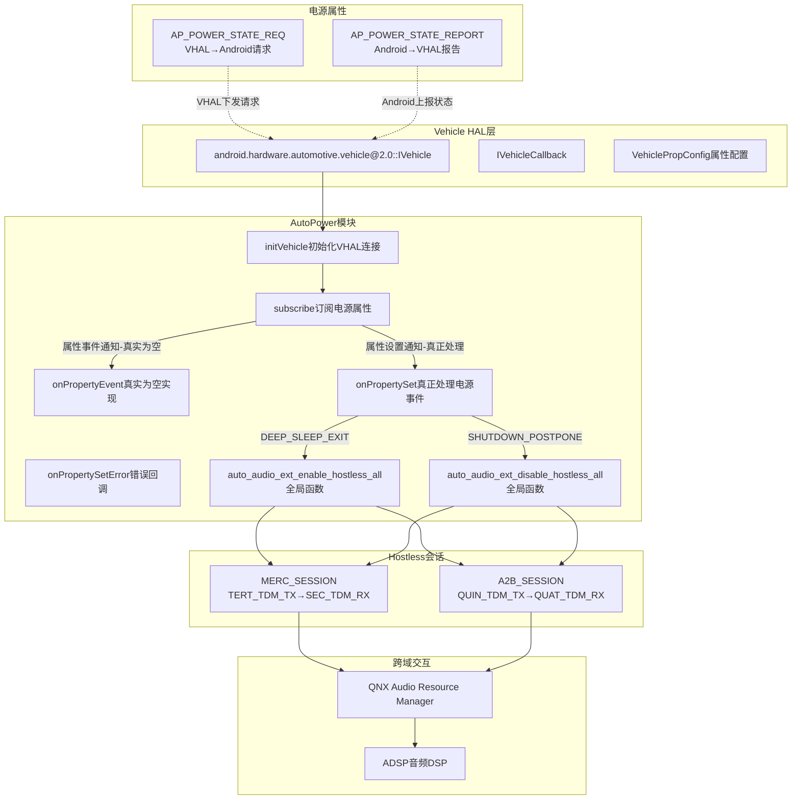
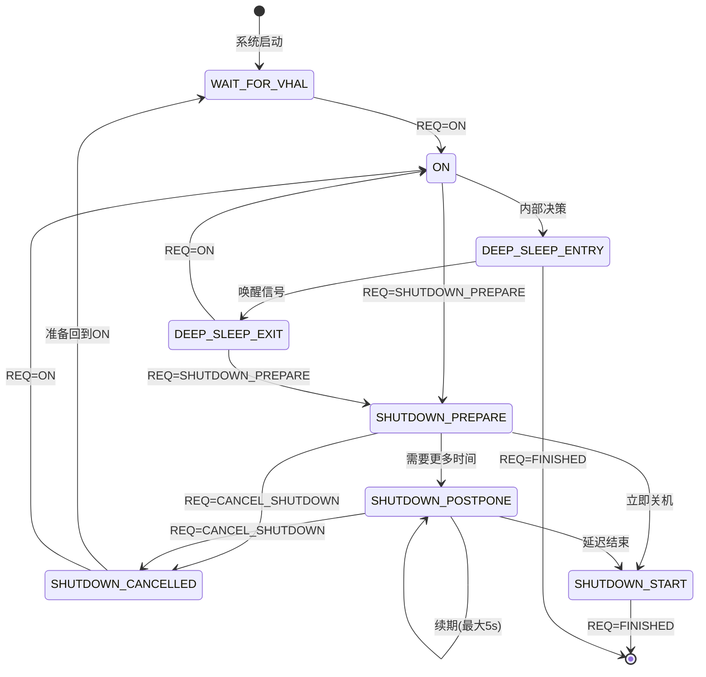
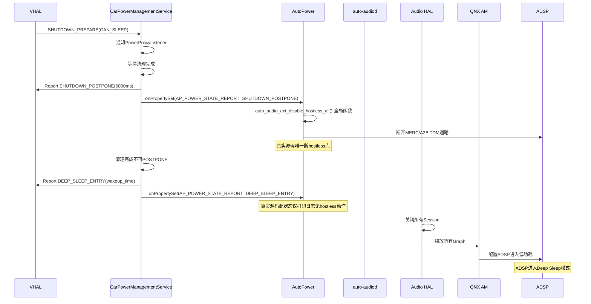
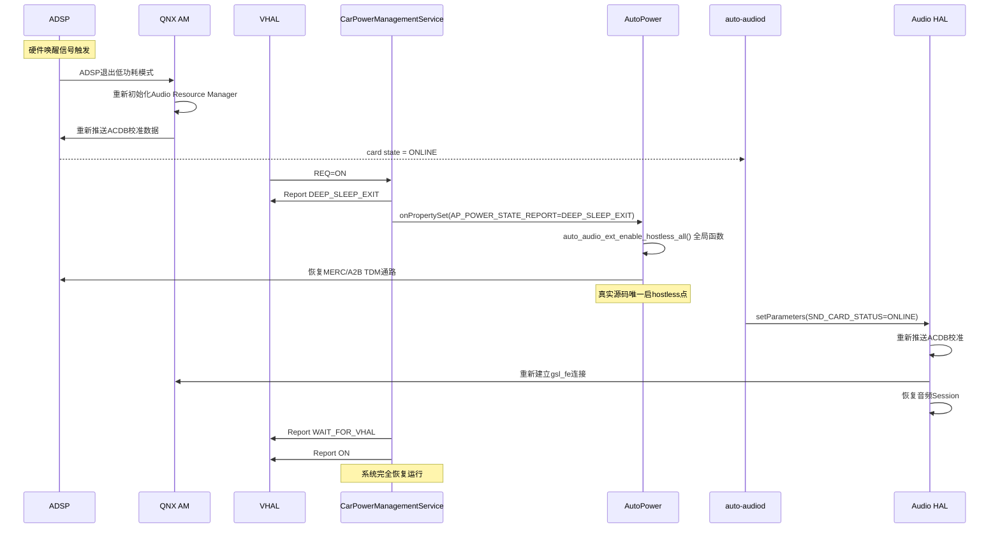
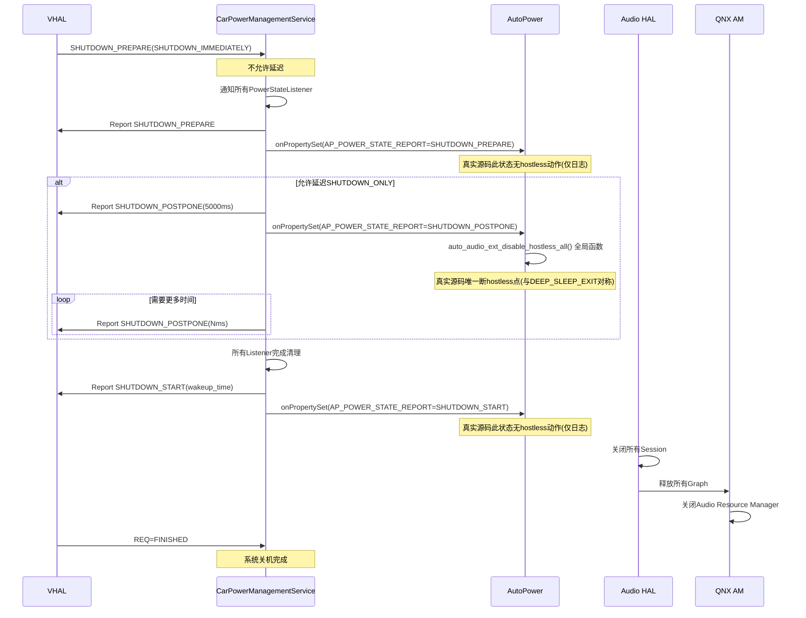
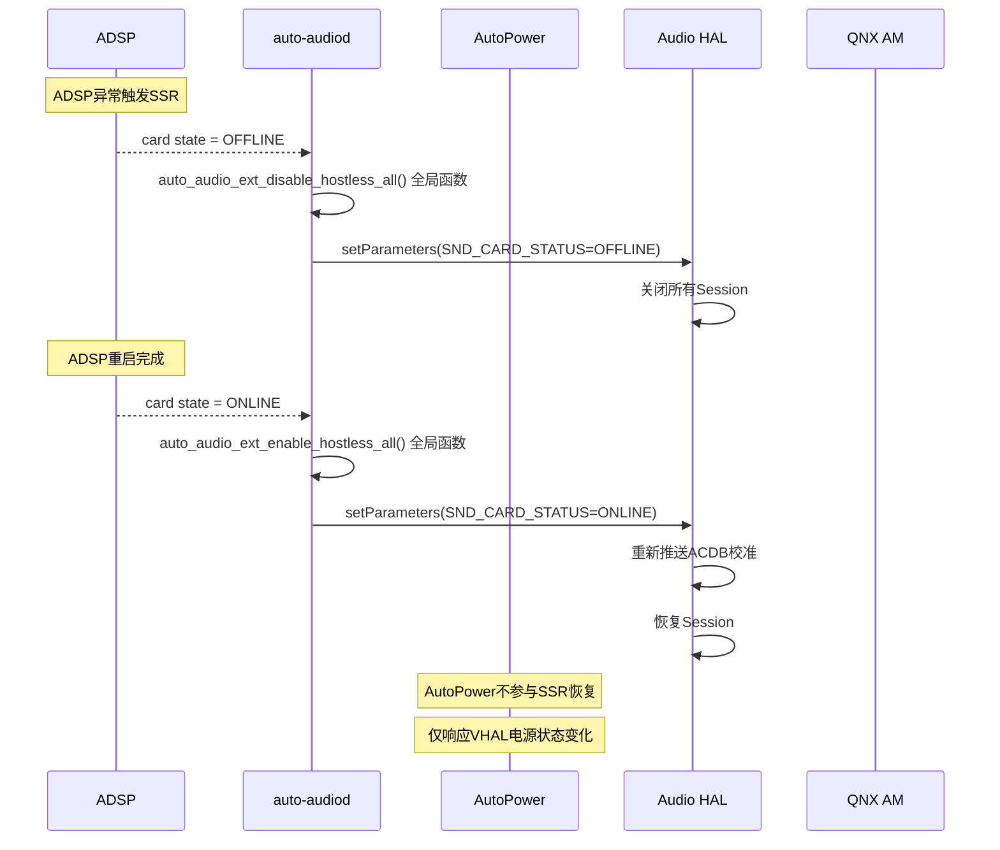
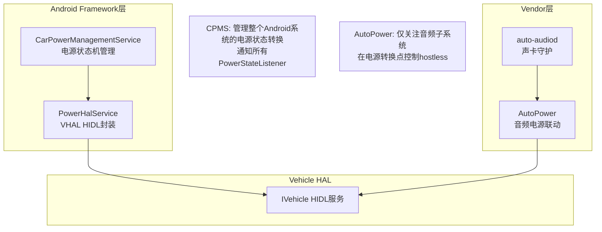

[← 上一个](16_16.2_auto-audiod守护进程.md) | [← 返回16章](README.md) | [返回导航](../README.md) | [下一个 →](16_16.4_Silent_Boot监控.md)

---

## 16.3 AutoPower与VHAL集成

> **核心定位**：`AutoPower`是SA8295 QNX域auto-audiod体系中的电源联动模块，通过HIDL VHAL(Vehicle HAL)接口订阅车辆电源状态变化，在deep sleep退出和shutdown等关键电源转换点控制hostless会话的启停，确保音频子系统与车辆电源状态的一致性。在QNX是ADSP唯一控制方(PVM)的架构下，AutoPower的hostless操作最终通过QNX域的Audio Resource Manager作用于ADSP。

### 16.3.1 架构概述

AutoPower模块在SA8295双域架构中的位置与职责：



**关键架构特征**：
- AutoPower运行在Android域，但hostless操作最终通过QNX域的Audio Resource Manager作用于ADSP
- VHAL是车辆电源状态的唯一权威来源，AutoPower作为订阅者被动响应
- 电源状态转换涉及两个方向：REQ(VHAL→Android)和REPORT(Android→VHAL)

### 16.3.2 VHAL HIDL接口深度解析

#### IVehicle接口

[`IVehicle`](hardware/interfaces/automotive/vehicle/2.0/IVehicle.hal)是VHAL的核心服务接口，提供属性获取/设置/订阅能力：

```hal
// android.hardware.automotive.vehicle@2.0::IVehicle
interface IVehicle {
    // 获取所有支持的属性配置
    getAllPropConfigs() generates (vec<VehiclePropConfig> propConfigs);

    // 获取指定属性的配置
    getPropConfigs(vec<int32_t> props)
            generates (StatusCode status, vec<VehiclePropConfig> propConfigs);

    // 获取属性值(ON_CHANGE类型返回最新值)
    get(VehiclePropValue requestedPropValue)
            generates (StatusCode status, VehiclePropValue propValue);

    // 设置属性值(异步操作，结果通过onPropertySet回调通知)
    set(VehiclePropValue propValue) generates (StatusCode status);

    // 订阅属性变化事件(核心：AutoPower通过此接口订阅电源属性)
    subscribe(IVehicleCallback callback, vec<SubscribeOptions> options)
            generates (StatusCode status);

    // 取消订阅
    unsubscribe(IVehicleCallback callback, int32_t propId)
            generates (StatusCode status);

    // 调试转储
    debugDump() generates (string s);
};
```

#### IVehicleCallback接口

[`IVehicleCallback`](hardware/interfaces/automotive/vehicle/2.0/IVehicleCallback.hal)是属性变化通知的回调接口，AutoPower必须实现此接口：

```hal
interface IVehicleCallback {
    // 属性事件回调：订阅的属性值发生变化时触发
    // 批量传递多个属性值(chunked)
    oneway onPropertyEvent(vec<VehiclePropValue> propValues);

    // 属性设置回调：当SubscribeFlags包含EVENTS_FROM_ANDROID时，
    // IVehicle.set()调用会触发此回调(立即传递，不批量)
    oneway onPropertySet(VehiclePropValue propValue);

    // 属性设置错误回调：set()操作异步失败时通知
    oneway onPropertySetError(StatusCode errorCode,
                              int32_t propId,
                              int32_t areaId);
};
```

**HIDL通信原理**：
- `oneway`关键字表示异步单向调用，调用方不等待返回
- `onPropertyEvent`采用批量传递(chunked)，减少HIDL跨进程通信次数
- `onPropertySet`要求立即传递不批量，确保设置操作的实时性
- AutoPower通过`subscribe()`注册回调，VHAL在属性变化时通过binder回调通知

### 16.3.3 VehicleProperty电源属性详解

#### AP_POWER_STATE_REQ（属性ID: 0x0A00 / 289475072）

VHAL向Android发送的电源状态**请求**，指示Android应该进入何种电源状态：

| 枚举值 | 名称 | 含义 | 可接收的Report状态 |
|--------|------|------|-------------------|
| 0 | ON | 请求进入正常工作状态 | WAIT_FOR_VHAL, DEEP_SLEEP_EXIT, SHUTDOWN_CANCELLED |
| 1 | SHUTDOWN_PREPARE | 请求准备关机 | ON, SHUTDOWN_POSTPONE, SHUTDOWN_PREPARE等 |
| 2 | CANCEL_SHUTDOWN | 取消关机 | SHUTDOWN_POSTPONE, SHUTDOWN_PREPARE |
| 3 | FINISHED | 完成关机流程 | DEEP_SLEEP_ENTRY, SHUTDOWN_START |

**SHUTDOWN_PREPARE附加参数**（`int32Values[1]`，[`VehicleApPowerStateShutdownParam`](device/google/trout/hal/vehicle/2.0/agl_build/prebuilt/include/android/hardware/automotive/vehicle/2.0/types.h:3055)）：

| 参数值 | 名称 | 含义 |
|--------|------|------|
| 1 | SHUTDOWN_IMMEDIATELY | 立即关机，不允许延迟 |
| 2 | CAN_SLEEP | 可以进入深度睡眠代替完全关机 |
| 3 | SHUTDOWN_ONLY | 只能关机，但允许延迟 |
| 4 | SLEEP_IMMEDIATELY | 必须睡眠或立即关机，不允许延迟 |

#### AP_POWER_STATE_REPORT（属性ID: 0x0A01 / 289475073）

Android向VHAL报告的电源状态，AutoPower订阅的就是此属性：

| 枚举值 | 名称 | 含义 | 音频联动行为 |
|--------|------|------|-------------|
| 1 | WAIT_FOR_VHAL | 系统启动完成，等待VHAL就绪 | 无特殊操作 |
| 2 | DEEP_SLEEP_ENTRY | 准备进入深度睡眠 | disable_hostless_all() |
| 3 | DEEP_SLEEP_EXIT | 从深度睡眠退出 | **enable_hostless_all()** |
| 4 | SHUTDOWN_POSTPONE | 关机延迟中(可重复发送，最大5000ms) | **disable_hostless_all()** |
| 5 | SHUTDOWN_START | 准备关机 | disable_hostless_all() |
| 6 | ON | 进入正常工作状态 | 无特殊操作 |
| 7 | SHUTDOWN_PREPARE | 准备关机(Garage Mode激活) | 无特殊操作 |
| 8 | SHUTDOWN_CANCELLED | 关机已取消 | 无特殊操作 |

#### 电源状态转换矩阵



### 16.3.4 AutoPower类完整实现

#### 类定义与成员

> **重要澄清（真实源码 `AutoPower.h`）**：`AutoPower`**只继承`IVehicleCallback`**（不继承`hidl_death_recipient`——死亡回调由内嵌的`VehicleHalDeathRecipient`承担）。类里**没有任何`enable_hostless`/`disable_hostless`成员方法**——hostless是`auto_audio_ext.cpp`的全局函数，`AutoPower`只是在`onPropertySet`里**调用**它们。也没有`deinitVehicle`/`mSubscribed`/`mLock`/`mCurrentPowerState`/`subscribePowerProperties`等成员。

```cpp
class AutoPower : public IVehicleCallback   // 仅继承 IVehicleCallback
{
    /* Overrides —— 默认 private 访问 */
    Return<void> onPropertyEvent(
        const hidl_vec<VehiclePropValue>& propValues) override;   // 真实为空实现
    Return<void> onPropertySet(
        const VehiclePropValue& propValue) override;              // 真正处理电源事件
    Return<void> onPropertySetError(
        StatusCode errorCode, int32_t propId, int32_t areaId) override;

    void handleVehicleHalDeath();

    // 内嵌死亡接收器（VHAL 服务死亡时重连）
    class VehicleHalDeathRecipient : public hidl_death_recipient {
    public:
        VehicleHalDeathRecipient(const sp<AutoPower> autopower)
            : mAutoPower(autopower) {}
        virtual void serviceDied(uint64_t cookie,
            const wp<hidl::base::V1_0::IBase>& who);
    private:
        sp<AutoPower> mAutoPower;
    };

public:
    AutoPower();
    virtual ~AutoPower();

private:
    static void *audiod_service_task_fn(void* param);  // 后台任务线程入口
    status_t initVehicle();                            // 连接 VHAL、订阅属性、注册死亡通知

    sp<IVehicle> mVehicle;                             // VHAL 服务代理
    sp<VehicleHalDeathRecipient> mVehicleHalDeathRecipient;
};
```

> **hostless 调用关系（非成员）**：`AutoPower`在`onPropertySet`响应`AP_POWER_STATE_REPORT`时，调用全局函数`auto_audio_ext_enable_hostless_all()` / `auto_audio_ext_disable_hostless_all()`（声明于`auto_audio_ext.h`的`__BEGIN_DECLS`块）。详见 16.2.8。

#### 构造与析构（真实源码）

> **真实行为**：构造函数**直接在内部用`pthread`拉起一个后台线程**`AUDIOD_SERVICE_TASK_FN`（入口`audiod_service_task_fn`）去反复调用`initVehicle()`直到成功——**并非由外部显式调用`initVehicle()`**。析构函数**为空**（无`deinitVehicle`）。

```cpp
// 后台任务线程：重试 initVehicle 直到成功或超过 MAX_RETRY_TIME
void* AutoPower::audiod_service_task_fn(void* param) {
    int retryCount = 0;
    AutoPower *ptr = static_cast<AutoPower *>(param);
    do {
        if (ptr->initVehicle() == OK) break;
        if (++retryCount > MAX_RETRY_TIME) break;
        usleep(VEHICLE_INIT_SLEEP_WAIT * 1000);   // 100ms
    } while (1);
    return 0;
}

AutoPower::AutoPower()
    : mVehicleHalDeathRecipient(new VehicleHalDeathRecipient(this)) {
    pthread_t tid;
    pthread_attr_t attr;
    pthread_attr_init(&attr);
    char thread_name[AUDIOD_MAX_TASK_NAME_LEN] = "AUDIOD_SERVICE_TASK_FN";
    pthread_create(&tid, &attr, AutoPower::audiod_service_task_fn, this);
    pthread_setname_np(tid, thread_name);
}

AutoPower::~AutoPower() { }   // 真实为空

// 死亡回调在内嵌类里，转调 handleVehicleHalDeath()
void AutoPower::VehicleHalDeathRecipient::serviceDied(
        uint64_t cookie __unused,
        const wp<hidl::base::V1_0::IBase>& who __unused) {
    ALOGI("IVehicle Died");
    mAutoPower->handleVehicleHalDeath();
}
```

#### 16.3.5 initVehicle() / handleVehicleHalDeath() 真实实现

```cpp
status_t AutoPower::initVehicle() {
    StatusCode status;
    hidl_vec<SubscribeOptions> options;

    if (mVehicle == 0) {
        mVehicle = IVehicle::getService();
        if (mVehicle != 0) {
            mVehicle->linkToDeath(mVehicleHalDeathRecipient, 0 /*cookie*/);
        } else {
            ALOGE("Failed to obtain IVehicle service");
            return FAILED_TRANSACTION;
        }
        // 订阅数组 reqVehicleProperties（含 AP_POWER_STATE_REPORT）
        options.setToExternal(reqVehicleProperties, arraysize(reqVehicleProperties));
        status = mVehicle->subscribe(this, options);
        if (status != StatusCode::OK) return FAILED_TRANSACTION;
    }
    return OK;
}

// VHAL 死亡后重连
void AutoPower::handleVehicleHalDeath() {
    mVehicle->unlinkToDeath(mVehicleHalDeathRecipient);
    mVehicle = NULL;
    int retryCount = 0;
    do {
        if (initVehicle() == OK) break;
        if (++retryCount > MAX_RETRY_TIME) break;
        usleep(VEHICLE_INIT_SLEEP_WAIT * 1000);
    } while (1);
}
```

### 16.3.6 onPropertySet()电源状态处理（真实生效路径）

> **关键澄清**：真实源码里`onPropertyEvent`**是空实现**（仅打印属性数量），电源事件处理**全部在`onPropertySet`**里完成，且只处理`AP_POWER_STATE_REPORT`下的两个状态。

```cpp
// 真实：onPropertyEvent 为空
Return<void> AutoPower::onPropertyEvent(
        const hidl_vec<VehiclePropValue>& propValues) {
    ALOGD("%s: Vehicle Property Size %d", __func__, (int)propValues.size());
    return Return<void>();
}

// 真实：电源处理全部在 onPropertySet
Return<void> AutoPower::onPropertySet(const VehiclePropValue& propValue) {
    int32_t property = propValue.prop;
    int32_t state    = propValue.value.int32Values[0];
    int32_t param    = propValue.value.int32Values[1];

    if (property == AP_POWER_STATE_REPORT) {
        switch (state) {
        case REPORT_DEEP_SLEEP_ENTRY:
            ALOGD("%s: DEEP_SLEEP_ENTRY", __func__);
            break;                                   // 仅打印，无动作
        case REPORT_DEEP_SLEEP_EXIT:
            ALOGD("%s: DEEP_SLEEP_EXIT", __func__);
            auto_audio_ext_enable_hostless_all();    // 唤醒 → 建立 hostless
            break;
        case REPORT_SHUTDOWN_POSTPONE:
            ALOGD("%s: SHUTDOWN_POSTPONE", __func__);
            auto_audio_ext_disable_hostless_all();   // 关机延后 → 拆除 hostless
            break;
        default:
            ALOGW("%s: Un-handled state %d", __func__, state);
            break;
        }
    } else {
        ALOGW("%s: Unknown prop %d", __func__, property);
    }
    return Void();
}
```

**真实状态→动作映射（仅此两条生效）**：

| 上报状态 | 动作 |
|---------|------|
| `REPORT_DEEP_SLEEP_EXIT` | 调用全局函数 `auto_audio_ext_enable_hostless_all()` |
| `REPORT_SHUTDOWN_POSTPONE` | 调用全局函数 `auto_audio_ext_disable_hostless_all()` |
| `REPORT_DEEP_SLEEP_ENTRY` | 仅打印日志，**无 hostless 动作** |
| 其它状态 | 未处理（`default` 打印告警） |

### 16.3.7 Deep Sleep完整流程

Deep Sleep（深度睡眠）是车载系统最常用的低功耗模式，保持ADSP和关键硬件的最小供电，实现快速唤醒。

#### Deep Sleep进入时序



#### Deep Sleep退出时序



**Deep Sleep退出时音频子系统状态恢复顺序**：

| 步骤 | 操作 | 执行者 | 耗时估计 |
|------|------|--------|---------|
| 1 | ADSP退出低功耗 | QNX AM | 约100ms |
| 2 | ACDB校准重推送 | QNX AM | 约200ms |
| 3 | auto_audio_ext_enable_hostless_all（全局函数，遍历MAX_SESSION/MAX_SND_CARD） | AutoPower::onPropertySet | 约50ms |
| 4 | 通知Audio HAL ONLINE | auto-audiod（独立于AutoPower） | 约10ms |
| 5 | ACDB校准重推送Android侧 | Audio HAL | 约200ms |
| 6 | 恢复活跃Session | Audio HAL | 约100ms |

### 16.3.8 Shutdown完整流程

#### SHUTDOWN_PREPARE到POSTPONE到START链路



**Shutdown延迟机制要点**：
- `SHUTDOWN_POSTPONE`可重复发送，每次最大5000ms
- 延迟期间Garage Mode可执行维护任务如OTA更新和日志上传
- 音频系统在`SHUTDOWN_POSTPONE`阶段即断开hostless通路不再处理音频
- `SHUTDOWN_IMMEDIATELY`参数下不允许延迟直接进入SHUTDOWN_START

### 16.3.9 Hostless会话深度解析

#### 会话类型与TDM通路

Hostless会话是指不需要Android CPU参与、由ADSP直接在TDM通道间搬移音频数据的通路：

| 会话类型 | TDM通路 | 用途 | ADSP路由 |
|---------|---------|------|---------|
| MERC_SESSION | TERT_TDM_TX到SEC_TDM_RX | MERC回声消除 | ADSP内部回声处理Graph |
| A2B_SESSION | QUIN_TDM_TX到QUAT_TDM_RX | A2B总线音频透传 | ADSP直通Graph |

#### enable/disable_hostless内部实现

> **重要澄清**：`enable_hostless_all` / `disable_hostless_all` / `enable_hostless` / `disable_hostless` **不是 `AutoPower` 的成员方法**，而是 `auto_audio_ext.cpp` 中定义的**C全局函数**（`auto_audio_ext.h` 用 `__BEGIN_DECLS` 声明）。`AutoPower::onPropertySet` 只是**调用者**。真实实现是**表驱动**，详见 [16.2.8]，此处仅列签名与调用关系。

真实全局函数签名（来自 `auto_audio_ext.h`）：

```cpp
// 全局C函数，非AutoPower成员
int32_t auto_audio_ext_enable_hostless(int snd_card);      // 单卡：遍历MAX_SESSION，表驱动set_mixer_ctl→pcm_open(带pcm_is_ready重试)→pcm_start
int32_t auto_audio_ext_disable_hostless(int snd_card);     // 单卡：pcm_stop→pcm_close
int32_t auto_audio_ext_enable_hostless_all(void);          // 遍历MAX_SND_CARD调单卡enable
void    auto_audio_ext_disable_hostless_all(void);         // 遍历MAX_SND_CARD调单卡disable
```

`AutoPower::onPropertySet` 中的真实调用（无参、全局函数）：

```cpp
// AutoPower.cpp - onPropertySet 内
case REPORT_DEEP_SLEEP_EXIT:
    auto_audio_ext_enable_hostless_all();   // 唤醒后恢复hostless
    break;
case REPORT_SHUTDOWN_POSTPONE:
    auto_audio_ext_disable_hostless_all();  // 关机延迟阶段断hostless
    break;
```

真实的表驱动核心（摘自 `auto_audio_ext.cpp`，完整解析见 16.2.8）：

```cpp
// 路由表：按平台(PLATFORM_MSMNILE/MSMSTEPPE)编译分支，按MERC/A2B会话索引
const char *g_audio_route[MAX_SESSION][ROUTE_MAX] = {
#ifdef PLATFORM_MSMNILE
    {"SEC_TDM_RX_7 Port Mixer TERT_TDM_TX_7", "1"},
    {"QUAT_TDM_RX_7 Port Mixer QUIN_TDM_TX_7", "1"},
#endif
};
const int g_audio_pcm[MAX_SESSION][PCM_MAX] = {
#ifdef PLATFORM_MSMNILE
    {TERT_TDM_TX_HOSTLESS, SEC_TDM_RX_HOSTLESS},
    {QUIN_TDM_TX_HOSTLESS, QUAT_TDM_RX_HOSTLESS},
#endif
};
```

### 16.3.10 AutoPower与auto-audiod协同

AutoPower和auto-audiod是SA8295 Android域音频守护进程的两个核心组件，在电源事件中分工明确：

#### 职责分工

| 职责 | AutoPower | auto-audiod |
|------|-----------|-------------|
| VHAL电源状态订阅 | 主责(唯一订阅者) | 不参与 |
| hostless启停(电源触发) | 主责(onPropertySet调用全局函数) | 不参与 |
| 声卡状态监控 | 不参与 | 主责(poll /proc/asound/cardN/state) |
| hostless启停(SSR触发) | 不参与 | 主责(ADSP上下线时调用全局函数) |
| Audio HAL通知 | 不参与 | 主责(setParameters) |
| VHAL服务死亡处理 | 主责(serviceDied→handleVehicleHalDeath重连) | 不参与 |
| Audio HAL死亡处理 | 不参与 | 主责(binderDied回调) |

> **说明**：`auto_audio_ext_enable_hostless_all` / `_disable_hostless_all` 是**共享的全局函数**，AutoPower（电源触发）和 auto-audiod（SSR触发）都调用同一批函数，只是**触发时机与来源不同**，不存在两套实现。

#### SSR恢复与电源协同



#### 协同场景总览

| 场景 | 触发源 | auto-audiod行为 | AutoPower行为 |
|------|--------|----------------|---------------|
| ADSP SSR | /proc/asound/cardN/state变化 | 调用全局函数enable/disable_hostless_all+通知Audio HAL | 无直接操作 |
| Deep Sleep退出 | VHAL AP_POWER_STATE_REPORT=DEEP_SLEEP_EXIT | 无直接操作 | onPropertySet→auto_audio_ext_enable_hostless_all() |
| 关机延迟 | VHAL AP_POWER_STATE_REPORT=SHUTDOWN_POSTPONE | 无直接操作 | onPropertySet→auto_audio_ext_disable_hostless_all() |
| Deep Sleep进入 | VHAL AP_POWER_STATE_REPORT=DEEP_SLEEP_ENTRY | 无直接操作 | 无hostless动作(真实源码仅日志) |
| 关机准备/开始 | VHAL SHUTDOWN_PREPARE/SHUTDOWN_START | 无直接操作 | 无hostless动作(真实源码仅日志) |
| Audio HAL死亡 | binderDied回调 | 重连HIDL接口+恢复hostless | 无直接操作 |
| VHAL服务死亡 | serviceDied回调 | 无直接操作 | handleVehicleHalDeath：unlinkToDeath+清mVehicle+重连 |

**协同设计原则**：
- **单一职责**：AutoPower只管VHAL电源联动，auto-audiod只管声卡/SSR/HAL联动
- **不重复操作**：同一hostless操作不会由两个组件同时触发
- **SSR优先**：ADSP的SSR恢复由auto-audiod全权负责，AutoPower不干预
- **电源优先**：VHAL电源状态变化由AutoPower全权负责，auto-audiod不干预

### 16.3.11 电源状态与安全音频

在电源状态转换过程中，安全音频（如eCall、ADAS警告）需要优先保障：

| 电源转换 | 安全音频处理策略 | 原因 |
|---------|----------------|------|
| ON→DEEP_SLEEP_ENTRY | 安全音频必须先完成播放再进入睡眠 | 法规要求eCall不能中断 |
| DEEP_SLEEP_EXIT→ON | 安全音频通路优先于媒体通路恢复 | 唤醒后紧急音频优先 |
| ON→SHUTDOWN_POSTPONE | 安全音频可继续播放直到SHUTDOWN_START | 延迟期间仍需响应紧急音频 |
| SHUTDOWN_POSTPONE→SHUTDOWN_START | 安全音频立即停止 | 关机不可逆 |

**安全音频在hostless中的特殊处理**：
- MERC_SESSION涉及回声消除，可能用于eCall等安全场景

> **说明**：真实 `AutoPower::onPropertySet` 在 `REPORT_SHUTDOWN_POSTPONE` 分支**直接、无条件**调用全局函数 `auto_audio_ext_disable_hostless_all()`，没有安全音频检查、没有延迟禁用，AutoPower 也没有 `disable_hostless_all` 成员方法。本节的"安全音频优先"策略表属于**框架层设计意图/上层策略**（可能由 CarAudioService / CPMS 侧的关机延迟机制承载），并非 auto-audiod 的 AutoPower 实现。

真实的关机延迟保护来自 VHAL 的 `SHUTDOWN_POSTPONE` 机制本身（CPMS 可反复发送延长关机窗口），而非 AutoPower 在 hostless 层做条件判断。

### 16.3.12 调试与日志

#### 关键日志标签

| 日志标签 | 模块 | 典型日志内容 |
|---------|------|-------------|
| AutoPower | AutoPower | 电源状态变化、hostless启停 |
| AutoAudioDaemon | auto-audiod | 声卡状态、SSR恢复 |
| PowerHalService | PowerHalService | VHAL属性读写 |
| CarPowerManagement | CPMS | 电源状态机转换 |
| AudioHAL | Audio HAL | Session开关、ACDB推送 |

#### 关键日志模式

```bash
# 监控AutoPower电源状态变化
logcat -s AutoPower | grep -E "DEEP_SLEEP|SHUTDOWN|hostless"

# 监控VHAL属性事件
logcat -s PowerHalService | grep -E "AP_POWER_STATE"

# 监控完整电源链路
logcat -s AutoPower,PowerHalService,CarPowerManagement

# 监控auto-audiod声卡状态
logcat -s AutoAudioDaemon | grep -E "SND_CARD_STATUS|hostless"
```

#### VHAL属性查询命令

```bash
# 查询当前电源状态(Android 14 CarService)
dumpsys car_service --services CarPowerManagementService

# 通过debugDump获取VHAL内部状态
# (需要VHAL实现支持)

# 查询VehicleProperty值(通过adb shell)
# Android 14使用CarPropertyManager API:
# adb shell dumpsys car_service --properties AP_POWER_STATE_REQ
# adb shell dumpsys car_service --properties AP_POWER_STATE_REPORT
```

#### 常见问题排查

| 问题现象 | 可能原因 | 排查方法 |
|---------|---------|---------|
| Deep Sleep退出后无音频 | enable_hostless_all未执行 | 检查AutoPower日志是否有DEEP_SLEEP_EXIT处理 |
| Deep Sleep退出后音频延迟大 | ACDB重推送耗时过长 | 检查Audio HAL日志ACDB推送时间 |
| Shutdown后仍有音频输出 | disable_hostless_all未执行 | 检查AutoPower日志是否有SHUTDOWN_POSTPONE处理 |
| VHAL服务断开后无恢复 | serviceDied后未重连 | 检查auto-audiod主循环重试逻辑 |
| hostless通路未恢复 | QNX AM未收到请求 | 检查MM-HAB跨VM通信是否正常 |
| SSR后AutoPower状态不一致 | SSR与电源事件竞争 | 真实源码AutoPower不参与SSR，两条链路独立；检查是否误改代码引入交叉 |

#### 电源状态模拟测试

```bash
# 通过CarPowerManager模拟电源状态(需要系统权限)
# 进入Deep Sleep
adb shell dumpsys car_service power deep-sleep

# 模拟关机
adb shell dumpsys car_service power shutdown

# 取消关机
adb shell dumpsys car_service power cancel-shutdown

# 查询当前电源状态
adb shell dumpsys car_service power state
```

### 16.3.13 与Android CarPowerManagementService的关系

AutoPower与[`CarPowerManagementService`](packages/services/Car/service/src/com/android/car/power/CarPowerManagementService.java:126)是不同层次的组件：



| 维度 | CarPowerManagementService | AutoPower |
|------|--------------------------|-----------|
| 层次 | Android Framework(Car Service) | Vendor Proprietary |
| 职责 | 全系统电源状态机 | 音频子系统电源联动 |
| VHAL交互 | 通过PowerHalService间接 | 直接订阅IVehicle |
| 通知范围 | 所有注册的PowerStateListener | 仅hostless会话 |
| 状态管理 | 完整状态机(WAIT_FOR_VHAL→ON→...) | 被动响应，无状态机 |
| 延迟控制 | 可请求SHUTDOWN_POSTPONE | 不参与延迟决策 |

---

[← 上一个](16_16.2_auto-audiod守护进程.md) | [← 返回16章](README.md) | [返回导航](../README.md) | [下一个 →](16_16.4_Silent_Boot监控.md)