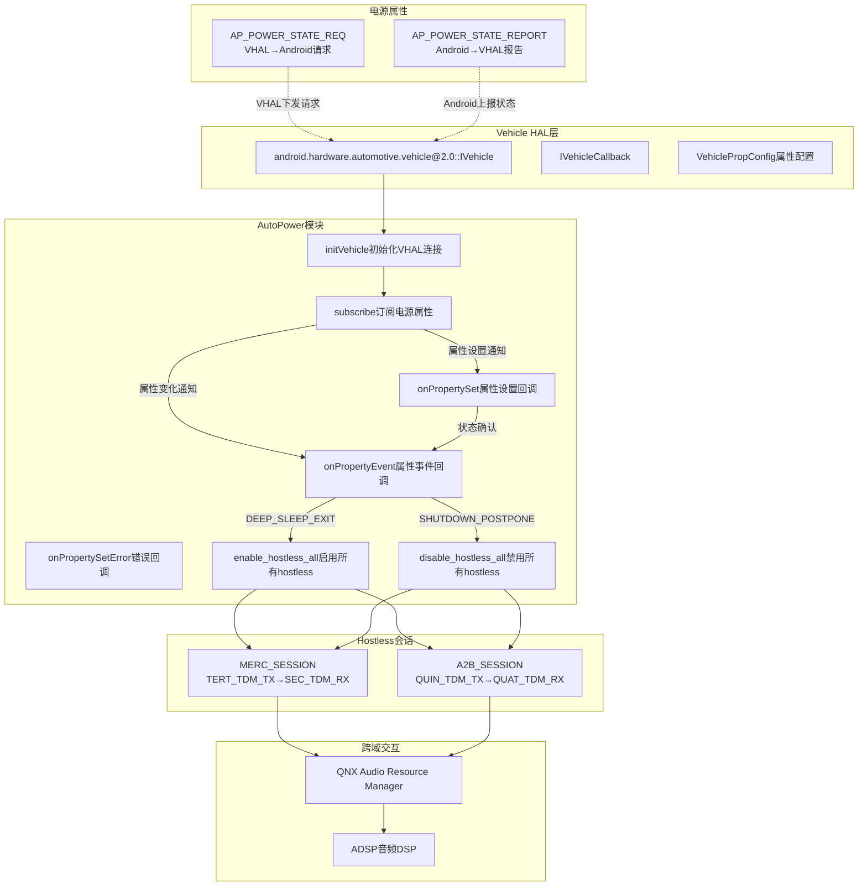
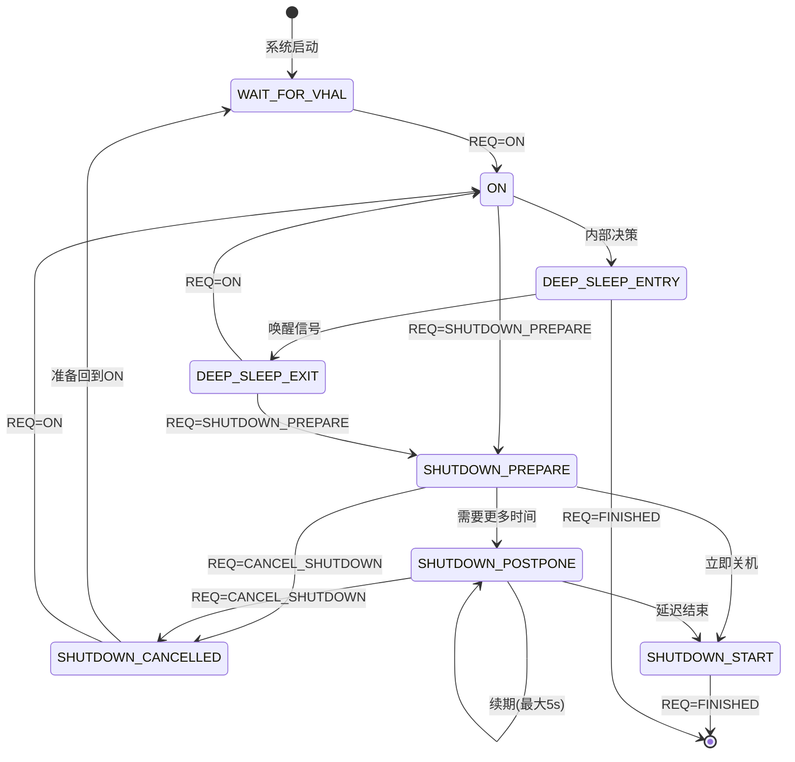
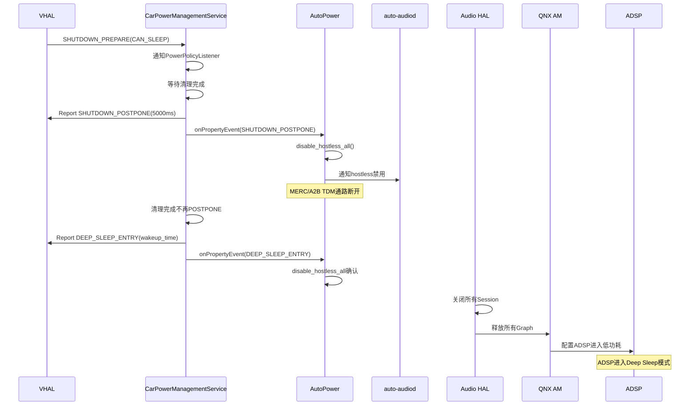
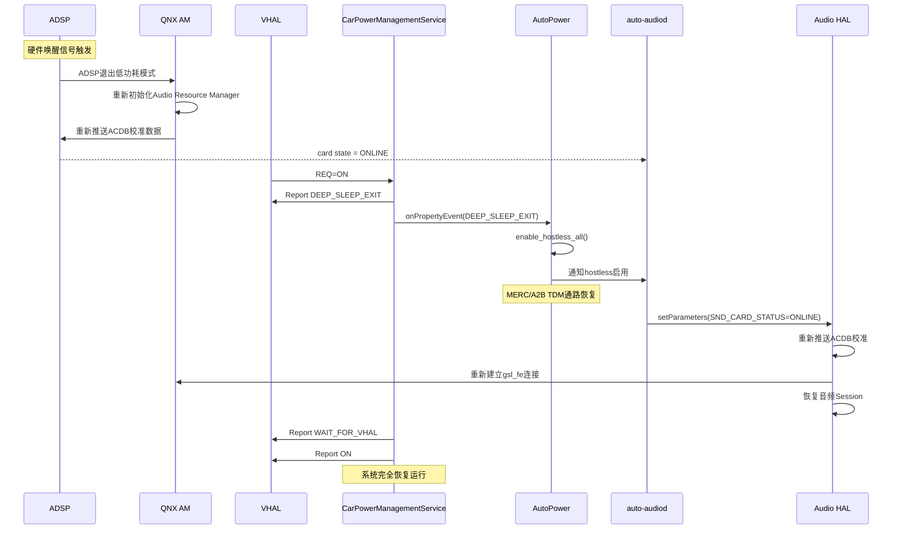
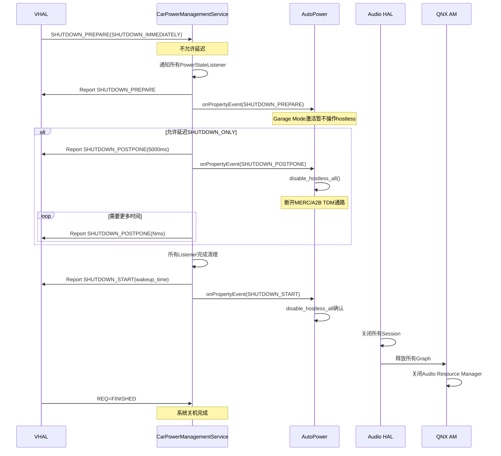
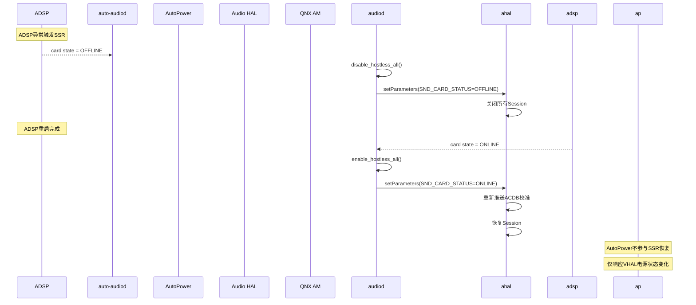
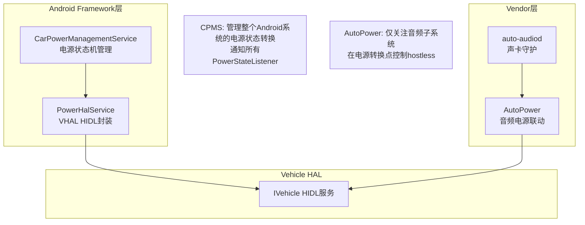

[← 上一个](16_16.2_auto-audiod守护进程.md) | [← 返回16章](README.md) | [返回导航](../README.md) | [下一个 →](16_16.4_Silent_Boot监控.md)

---

## 16.3 AutoPower与VHAL集成

> **核心定位**：`AutoPower`是SA8295 QNX域auto-audiod体系中的电源联动模块，通过HIDL VHAL(Vehicle HAL)接口订阅车辆电源状态变化，在deep sleep退出和shutdown等关键电源转换点控制hostless会话的启停，确保音频子系统与车辆电源状态的一致性。在QNX是ADSP唯一控制方(PVM)的架构下，AutoPower的hostless操作最终通过QNX域的Audio Resource Manager作用于ADSP。

### 16.3.1 架构概述

AutoPower模块在SA8295双域架构中的位置与职责：



**关键架构特征**：
- AutoPower运行在Android域，但hostless操作最终通过QNX域的Audio Resource Manager作用于ADSP
- VHAL是车辆电源状态的唯一权威来源，AutoPower作为订阅者被动响应
- 电源状态转换涉及两个方向：REQ(VHAL→Android)和REPORT(Android→VHAL)

### 16.3.2 VHAL HIDL接口深度解析

#### IVehicle接口

[`IVehicle`](hardware/interfaces/automotive/vehicle/2.0/IVehicle.hal)是VHAL的核心服务接口，提供属性获取/设置/订阅能力：

```hal
// android.hardware.automotive.vehicle@2.0::IVehicle
interface IVehicle {
    // 获取所有支持的属性配置
    getAllPropConfigs() generates (vec<VehiclePropConfig> propConfigs);

    // 获取指定属性的配置
    getPropConfigs(vec<int32_t> props)
            generates (StatusCode status, vec<VehiclePropConfig> propConfigs);

    // 获取属性值(ON_CHANGE类型返回最新值)
    get(VehiclePropValue requestedPropValue)
            generates (StatusCode status, VehiclePropValue propValue);

    // 设置属性值(异步操作，结果通过onPropertySet回调通知)
    set(VehiclePropValue propValue) generates (StatusCode status);

    // 订阅属性变化事件(核心：AutoPower通过此接口订阅电源属性)
    subscribe(IVehicleCallback callback, vec<SubscribeOptions> options)
            generates (StatusCode status);

    // 取消订阅
    unsubscribe(IVehicleCallback callback, int32_t propId)
            generates (StatusCode status);

    // 调试转储
    debugDump() generates (string s);
};
```

#### IVehicleCallback接口

[`IVehicleCallback`](hardware/interfaces/automotive/vehicle/2.0/IVehicleCallback.hal)是属性变化通知的回调接口，AutoPower必须实现此接口：

```hal
interface IVehicleCallback {
    // 属性事件回调：订阅的属性值发生变化时触发
    // 批量传递多个属性值(chunked)
    oneway onPropertyEvent(vec<VehiclePropValue> propValues);

    // 属性设置回调：当SubscribeFlags包含EVENTS_FROM_ANDROID时，
    // IVehicle.set()调用会触发此回调(立即传递，不批量)
    oneway onPropertySet(VehiclePropValue propValue);

    // 属性设置错误回调：set()操作异步失败时通知
    oneway onPropertySetError(StatusCode errorCode,
                              int32_t propId,
                              int32_t areaId);
};
```

**HIDL通信原理**：
- `oneway`关键字表示异步单向调用，调用方不等待返回
- `onPropertyEvent`采用批量传递(chunked)，减少HIDL跨进程通信次数
- `onPropertySet`要求立即传递不批量，确保设置操作的实时性
- AutoPower通过`subscribe()`注册回调，VHAL在属性变化时通过binder回调通知

### 16.3.3 VehicleProperty电源属性详解

#### AP_POWER_STATE_REQ（属性ID: 0x0A00 / 289475072）

VHAL向Android发送的电源状态**请求**，指示Android应该进入何种电源状态：

| 枚举值 | 名称 | 含义 | 可接收的Report状态 |
|--------|------|------|-------------------|
| 0 | ON | 请求进入正常工作状态 | WAIT_FOR_VHAL, DEEP_SLEEP_EXIT, SHUTDOWN_CANCELLED |
| 1 | SHUTDOWN_PREPARE | 请求准备关机 | ON, SHUTDOWN_POSTPONE, SHUTDOWN_PREPARE等 |
| 2 | CANCEL_SHUTDOWN | 取消关机 | SHUTDOWN_POSTPONE, SHUTDOWN_PREPARE |
| 3 | FINISHED | 完成关机流程 | DEEP_SLEEP_ENTRY, SHUTDOWN_START |

**SHUTDOWN_PREPARE附加参数**（`int32Values[1]`，[`VehicleApPowerStateShutdownParam`](device/google/trout/hal/vehicle/2.0/agl_build/prebuilt/include/android/hardware/automotive/vehicle/2.0/types.h:3055)）：

| 参数值 | 名称 | 含义 |
|--------|------|------|
| 1 | SHUTDOWN_IMMEDIATELY | 立即关机，不允许延迟 |
| 2 | CAN_SLEEP | 可以进入深度睡眠代替完全关机 |
| 3 | SHUTDOWN_ONLY | 只能关机，但允许延迟 |
| 4 | SLEEP_IMMEDIATELY | 必须睡眠或立即关机，不允许延迟 |

#### AP_POWER_STATE_REPORT（属性ID: 0x0A01 / 289475073）

Android向VHAL报告的电源状态，AutoPower订阅的就是此属性：

| 枚举值 | 名称 | 含义 | 音频联动行为 |
|--------|------|------|-------------|
| 1 | WAIT_FOR_VHAL | 系统启动完成，等待VHAL就绪 | 无特殊操作 |
| 2 | DEEP_SLEEP_ENTRY | 准备进入深度睡眠 | disable_hostless_all() |
| 3 | DEEP_SLEEP_EXIT | 从深度睡眠退出 | **enable_hostless_all()** |
| 4 | SHUTDOWN_POSTPONE | 关机延迟中(可重复发送，最大5000ms) | **disable_hostless_all()** |
| 5 | SHUTDOWN_START | 准备关机 | disable_hostless_all() |
| 6 | ON | 进入正常工作状态 | 无特殊操作 |
| 7 | SHUTDOWN_PREPARE | 准备关机(Garage Mode激活) | 无特殊操作 |
| 8 | SHUTDOWN_CANCELLED | 关机已取消 | 无特殊操作 |

#### 电源状态转换矩阵



### 16.3.4 AutoPower类完整实现

#### 类定义与成员

```cpp
class AutoPower : public IVehicleCallback,
                  public hidl_death_recipient {
public:
    AutoPower();
    virtual ~AutoPower();

    // 初始化VHAL连接并订阅电源属性
    int initVehicle();

    // 反初始化：取消订阅、解除死亡通知
    void deinitVehicle();

    // --- IVehicleCallback接口实现 ---
    // 属性事件回调(订阅属性值变化)
    Return<void> onPropertyEvent(
        const hidl_vec<VehiclePropValue>& propValues) override;

    // 属性设置回调(其他客户端set()时触发)
    Return<void> onPropertySet(
        const VehiclePropValue& value) override;

    // 属性设置错误回调
    Return<void> onPropertySetError(
        StatusCode errorCode, int32_t propId,
        int32_t areaId) override;

    // --- hidl_death_recipient接口 ---
    // VHAL服务死亡通知
    void serviceDied(uint64_t cookie,
                     const wp<hidl_death_recipient>& who) override;

private:
    sp<IVehicle> mVehicle;          // VHAL服务代理
    bool mSubscribed;               // 是否已成功订阅
    std::mutex mLock;               // 状态锁
    int32_t mCurrentPowerState;     // 当前电源状态缓存

    // Hostless会话控制
    void enable_hostless_all();
    void disable_hostless_all();
    void enable_hostless(int session_type);
    void disable_hostless(int session_type);

    // 内部辅助
    int subscribePowerProperties();
    void handlePowerStateChange(int32_t state, int32_t param);
    void reportPowerState(int32_t state, int32_t param);
};
```

#### 构造与析构

```cpp
AutoPower::AutoPower()
    : mVehicle(nullptr),
      mSubscribed(false),
      mCurrentPowerState(0) {
    ALOGI("AutoPower: constructed");
}

AutoPower::~AutoPower() {
    deinitVehicle();
    ALOGI("AutoPower: destroyed");
}

void AutoPower::serviceDied(uint64_t cookie,
                             const wp<hidl_death_recipient>& who) {
    ALOGE("AutoPower: IVehicle service died (cookie=%llu)",
          (unsigned long long)cookie);
    std::lock_guard<std::mutex> guard(mLock);
    mVehicle = nullptr;
    mSubscribed = false;
    // 注意：不在此处自动重连，由auto-audiod主循环负责重试
}
```

### 16.3.5 initVehicle()初始化流程深度解析

```cpp
int AutoPower::initVehicle() {
    std::lock_guard<std::mutex> guard(mLock);

    // ===== Step 1: 获取IVehicle服务 =====
    // 通过HIDL服务管理器获取VHAL服务代理
    mVehicle = IVehicle::getService();
    if (mVehicle == nullptr) {
        ALOGE("AutoPower: Failed to get IVehicle service");
        return -ENOENT;
    }
    ALOGI("AutoPower: IVehicle service obtained: %s",
          mVehicle->descriptor().c_str());

    // ===== Step 2: 注册死亡通知 =====
    // 监控VHAL服务进程死亡，以便及时清理资源
    Return<bool> linked = mVehicle->linkToDeath(
        this /*DeathRecipient*/, 0 /*cookie*/);
    if (!linked.isOk() || !linked) {
        ALOGW("AutoPower: Failed to linkToDeath on IVehicle");
        // 非致命错误，继续执行
    }

    // ===== Step 3: 订阅电源属性 =====
    int ret = subscribePowerProperties();
    if (ret != 0) {
        ALOGE("AutoPower: Failed to subscribe power properties");
        return ret;
    }

    // ===== Step 4: 读取当前电源状态 =====
    // 获取初始电源状态，避免遗漏订阅前的状态变化
    VehiclePropValue req;
    req.prop = (int32_t)VehicleProperty::AP_POWER_STATE_REPORT;
    auto result = mVehicle->get(req);
    if (result.isOk() && result.status() == StatusCode::OK) {
        mCurrentPowerState = result.value().value.int32Values[0];
        ALOGI("AutoPower: Initial power state = %d", mCurrentPowerState);
    }

    mSubscribed = true;
    ALOGI("AutoPower: initialized, monitoring power state");
    return 0;
}
```

#### 属性订阅实现

```cpp
int AutoPower::subscribePowerProperties() {
    // 构建订阅选项：订阅AP_POWER_STATE_REPORT
    SubscribeOptions opts;
    opts.propId = (int32_t)VehicleProperty::AP_POWER_STATE_REPORT;
    opts.flags = SubscribeFlags::DEFAULT;  // 订阅所有变化事件

    // 也可订阅AP_POWER_STATE_REQ以感知VHAL下发的请求
    SubscribeOptions optsReq;
    optsReq.propId = (int32_t)VehicleProperty::AP_POWER_STATE_REQ;
    optsReq.flags = SubscribeFlags::EVENTS_FROM_ANDROID;

    Return<StatusCode> ret = mVehicle->subscribe(
        this /*IVehicleCallback*/, {opts, optsReq});

    if (!ret.isOk()) {
        ALOGE("AutoPower: subscribe transport error: %s",
              ret.description().c_str());
        return -EIO;
    }
    if (ret != StatusCode::OK) {
        ALOGE("AutoPower: subscribe failed: %d", (int32_t)ret);
        return -EIO;
    }
    return 0;
}
```

**订阅标志说明**：
- `SubscribeFlags::DEFAULT`：订阅属性变化事件，VHAL属性值变化时触发`onPropertyEvent`
- `SubscribeFlags::EVENTS_FROM_ANDROID`：额外订阅来自Android侧的`set()`调用事件，触发`onPropertySet`

### 16.3.6 onPropertyEvent()电源状态处理

```cpp
Return<void> AutoPower::onPropertyEvent(
        const hidl_vec<VehiclePropValue>& propValues) {
    for (const auto& value : propValues) {
        if (value.prop == (int32_t)VehicleProperty::AP_POWER_STATE_REPORT) {
            int32_t state = value.value.int32Values[0];
            int32_t param = (value.value.int32Values.size() > 1)
                          ? value.value.int32Values[1] : 0;
            ALOGI("AutoPower: AP_POWER_STATE_REPORT event: state=%d param=%d",
                  state, param);
            handlePowerStateChange(state, param);
        }
        else if (value.prop == (int32_t)VehicleProperty::AP_POWER_STATE_REQ) {
            int32_t reqState = value.value.int32Values[0];
            ALOGI("AutoPower: AP_POWER_STATE_REQ event: req=%d", reqState);
            // REQ事件通常由CarPowerManagementService处理
            // AutoPower仅做日志记录
        }
    }
    return Void();
}

void AutoPower::handlePowerStateChange(int32_t state, int32_t param) {
    std::lock_guard<std::mutex> guard(mLock);
    int32_t oldState = mCurrentPowerState;
    mCurrentPowerState = state;

    switch (state) {
    case (int32_t)VehicleApPowerStateReport::DEEP_SLEEP_EXIT:
        ALOGI("AutoPower: DEEP_SLEEP_EXIT (was %d), enabling hostless", oldState);
        enable_hostless_all();
        break;

    case (int32_t)VehicleApPowerStateReport::DEEP_SLEEP_ENTRY:
        ALOGI("AutoPower: DEEP_SLEEP_ENTRY, disabling hostless");
        disable_hostless_all();
        break;

    case (int32_t)VehicleApPowerStateReport::SHUTDOWN_POSTPONE:
        ALOGI("AutoPower: SHUTDOWN_POSTPONE (param=%dms), disabling hostless", param);
        disable_hostless_all();
        break;

    case (int32_t)VehicleApPowerStateReport::SHUTDOWN_START:
        ALOGI("AutoPower: SHUTDOWN_START, disabling hostless");
        disable_hostless_all();
        break;

    case (int32_t)VehicleApPowerStateReport::WAIT_FOR_VHAL:
        ALOGI("AutoPower: WAIT_FOR_VHAL, awaiting VHAL ready");
        break;

    case (int32_t)VehicleApPowerStateReport::ON:
        ALOGI("AutoPower: ON state, system fully operational");
        break;

    case (int32_t)VehicleApPowerStateReport::SHUTDOWN_PREPARE:
        ALOGI("AutoPower: SHUTDOWN_PREPARE, garage mode active");
        break;

    case (int32_t)VehicleApPowerStateReport::SHUTDOWN_CANCELLED:
        ALOGI("AutoPower: SHUTDOWN_CANCELLED, re-enabling hostless");
        enable_hostless_all();
        break;

    default:
        ALOGW("AutoPower: Unhandled power state: %d", state);
        break;
    }
}
```

### 16.3.7 Deep Sleep完整流程

Deep Sleep（深度睡眠）是车载系统最常用的低功耗模式，保持ADSP和关键硬件的最小供电，实现快速唤醒。

#### Deep Sleep进入时序



#### Deep Sleep退出时序



**Deep Sleep退出时音频子系统状态恢复顺序**：

| 步骤 | 操作 | 执行者 | 耗时估计 |
|------|------|--------|---------|
| 1 | ADSP退出低功耗 | QNX AM | 约100ms |
| 2 | ACDB校准重推送 | QNX AM | 约200ms |
| 3 | enable_hostless_all | AutoPower | 约50ms |
| 4 | 通知Audio HAL ONLINE | auto-audiod | 约10ms |
| 5 | ACDB校准重推送Android侧 | Audio HAL | 约200ms |
| 6 | 恢复活跃Session | Audio HAL | 约100ms |

### 16.3.8 Shutdown完整流程

#### SHUTDOWN_PREPARE到POSTPONE到START链路



**Shutdown延迟机制要点**：
- `SHUTDOWN_POSTPONE`可重复发送，每次最大5000ms
- 延迟期间Garage Mode可执行维护任务如OTA更新和日志上传
- 音频系统在`SHUTDOWN_POSTPONE`阶段即断开hostless通路不再处理音频
- `SHUTDOWN_IMMEDIATELY`参数下不允许延迟直接进入SHUTDOWN_START

### 16.3.9 Hostless会话深度解析

#### 会话类型与TDM通路

Hostless会话是指不需要Android CPU参与、由ADSP直接在TDM通道间搬移音频数据的通路：

| 会话类型 | TDM通路 | 用途 | ADSP路由 |
|---------|---------|------|---------|
| MERC_SESSION | TERT_TDM_TX到SEC_TDM_RX | MERC回声消除 | ADSP内部回声处理Graph |
| A2B_SESSION | QUIN_TDM_TX到QUAT_TDM_RX | A2B总线音频透传 | ADSP直通Graph |

#### enable/disable_hostless内部实现

```cpp
void AutoPower::enable_hostless_all() {
    ALOGI("AutoPower: Enabling all hostless sessions");
    enable_hostless(MERC_SESSION);
    enable_hostless(A2B_SESSION);
}

void AutoPower::disable_hostless_all() {
    ALOGI("AutoPower: Disabling all hostless sessions");
    disable_hostless(MERC_SESSION);
    disable_hostless(A2B_SESSION);
}

void AutoPower::enable_hostless(int session_type) {
    // 通过ALSA mixer控制启用hostless通路
    // 实际操作由QNX域的Audio Resource Manager执行
    const char* mixer_name = nullptr;
    switch (session_type) {
    case MERC_SESSION:
        mixer_name = "MERC Hostless Enable";
        break;
    case A2B_SESSION:
        mixer_name = "A2B Hostless Enable";
        break;
    default:
        ALOGE("AutoPower: Unknown session type: %d", session_type);
        return;
    }
    ALOGI("AutoPower: enable_hostless(%s) -> QNX AM", mixer_name);
    // QNX AM收到请求后在ADSP上创建hostless Graph并配置TDM路由
}

void AutoPower::disable_hostless(int session_type) {
    const char* mixer_name = nullptr;
    switch (session_type) {
    case MERC_SESSION:
        mixer_name = "MERC Hostless Disable";
        break;
    case A2B_SESSION:
        mixer_name = "A2B Hostless Disable";
        break;
    default:
        ALOGE("AutoPower: Unknown session type: %d", session_type);
        return;
    }
    ALOGI("AutoPower: disable_hostless(%s) -> QNX AM", mixer_name);
    // QNX AM收到请求后停止ADSP hostless Graph并释放资源
}
```

**Hostless与ADSP交互的跨域路径**：

```
AutoPower(Android域)
  → enable/disable_hostless()
    → ALSA mixer ioctl
      → /dev/snd/pcmN (ASOUND ALSA驱动)
        → MM-HAB跨VM通信
          → QNX Audio Resource Manager(PVM)
            → AGM(Graph Manager) API
              → ADSP GSL Graph创建/销毁
```

### 16.3.10 AutoPower与auto-audiod协同

AutoPower和auto-audiod是SA8295 Android域音频守护进程的两个核心组件，在电源事件中分工明确：

#### 职责分工

| 职责 | AutoPower | auto-audiod |
|------|-----------|-------------|
| VHAL电源状态订阅 | 主责(唯一订阅者) | 不参与 |
| hostless启停(电源触发) | 主责 | 不参与 |
| 声卡状态监控 | 不参与 | 主责(poll /proc/asound/cardN/state) |
| hostless启停(SSR触发) | 不参与 | 主责(ADSP上下线触发) |
| Audio HAL通知 | 不参与 | 主责(setParameters) |
| VHAL服务死亡处理 | 主责(serviceDied回调) | 不参与 |
| Audio HAL死亡处理 | 不参与 | 主责(binderDied回调) |

#### SSR恢复与电源协同



#### 协同场景总览

| 场景 | 触发源 | auto-audiod行为 | AutoPower行为 |
|------|--------|----------------|---------------|
| ADSP SSR | /proc/asound/cardN/state变化 | 重新enable/disable_hostless+通知Audio HAL | 无直接操作 |
| Deep Sleep退出 | VHAL AP_POWER_STATE_REPORT | 无直接操作 | enable_hostless_all |
| Deep Sleep进入 | VHAL AP_POWER_STATE_REPORT | 无直接操作 | disable_hostless_all |
| 系统关机 | VHAL SHUTDOWN_PREPARE | 无直接操作 | disable_hostless_all |
| 关机取消 | VHAL SHUTDOWN_CANCELLED | 无直接操作 | enable_hostless_all |
| Audio HAL死亡 | binderDied回调 | 重连HIDL接口+恢复hostless | 无直接操作 |
| VHAL服务死亡 | serviceDied回调 | 无直接操作 | 清理mVehicle引用，等待重连 |

**协同设计原则**：
- **单一职责**：AutoPower只管VHAL电源联动，auto-audiod只管声卡/SSR/HAL联动
- **不重复操作**：同一hostless操作不会由两个组件同时触发
- **SSR优先**：ADSP的SSR恢复由auto-audiod全权负责，AutoPower不干预
- **电源优先**：VHAL电源状态变化由AutoPower全权负责，auto-audiod不干预

### 16.3.11 电源状态与安全音频

在电源状态转换过程中，安全音频（如eCall、ADAS警告）需要优先保障：

| 电源转换 | 安全音频处理策略 | 原因 |
|---------|----------------|------|
| ON→DEEP_SLEEP_ENTRY | 安全音频必须先完成播放再进入睡眠 | 法规要求eCall不能中断 |
| DEEP_SLEEP_EXIT→ON | 安全音频通路优先于媒体通路恢复 | 唤醒后紧急音频优先 |
| ON→SHUTDOWN_POSTPONE | 安全音频可继续播放直到SHUTDOWN_START | 延迟期间仍需响应紧急音频 |
| SHUTDOWN_POSTPONE→SHUTDOWN_START | 安全音频立即停止 | 关机不可逆 |

**安全音频在hostless中的特殊处理**：
- MERC_SESSION涉及回声消除，可能用于eCall等安全场景
- 在`disable_hostless_all()`前，需检查是否有活跃的安全音频Session
- 安全音频Session持有`AUDIO_FLAG_AWARE`或`AUDIO_FLAG_SAFETY`属性时，延迟hostless禁用

```cpp
void AutoPower::disable_hostless_all() {
    // 安全检查：是否有安全音频依赖hostless通路
    if (hasActiveSafetyAudio()) {
        ALOGW("AutoPower: Safety audio active, deferring hostless disable");
        // 延迟禁用，等待安全音频完成或超时
        scheduleDeferredDisable(5000 /*ms*/);
        return;
    }
    disable_hostless(MERC_SESSION);
    disable_hostless(A2B_SESSION);
}
```

### 16.3.12 调试与日志

#### 关键日志标签

| 日志标签 | 模块 | 典型日志内容 |
|---------|------|-------------|
| AutoPower | AutoPower | 电源状态变化、hostless启停 |
| AutoAudioDaemon | auto-audiod | 声卡状态、SSR恢复 |
| PowerHalService | PowerHalService | VHAL属性读写 |
| CarPowerManagement | CPMS | 电源状态机转换 |
| AudioHAL | Audio HAL | Session开关、ACDB推送 |

#### 关键日志模式

```bash
# 监控AutoPower电源状态变化
logcat -s AutoPower | grep -E "DEEP_SLEEP|SHUTDOWN|hostless"

# 监控VHAL属性事件
logcat -s PowerHalService | grep -E "AP_POWER_STATE"

# 监控完整电源链路
logcat -s AutoPower,PowerHalService,CarPowerManagement

# 监控auto-audiod声卡状态
logcat -s AutoAudioDaemon | grep -E "SND_CARD_STATUS|hostless"
```

#### VHAL属性查询命令

```bash
# 查询当前电源状态(Android 14 CarService)
dumpsys car_service --services CarPowerManagementService

# 通过debugDump获取VHAL内部状态
# (需要VHAL实现支持)

# 查询VehicleProperty值(通过adb shell)
# Android 14使用CarPropertyManager API:
# adb shell dumpsys car_service --properties AP_POWER_STATE_REQ
# adb shell dumpsys car_service --properties AP_POWER_STATE_REPORT
```

#### 常见问题排查

| 问题现象 | 可能原因 | 排查方法 |
|---------|---------|---------|
| Deep Sleep退出后无音频 | enable_hostless_all未执行 | 检查AutoPower日志是否有DEEP_SLEEP_EXIT处理 |
| Deep Sleep退出后音频延迟大 | ACDB重推送耗时过长 | 检查Audio HAL日志ACDB推送时间 |
| Shutdown后仍有音频输出 | disable_hostless_all未执行 | 检查AutoPower日志是否有SHUTDOWN_POSTPONE处理 |
| VHAL服务断开后无恢复 | serviceDied后未重连 | 检查auto-audiod主循环重试逻辑 |
| hostless通路未恢复 | QNX AM未收到请求 | 检查MM-HAB跨VM通信是否正常 |
| SSR后AutoPower状态不一致 | SSR与电源事件竞争 | 检查mLock保护是否完善 |

#### 电源状态模拟测试

```bash
# 通过CarPowerManager模拟电源状态(需要系统权限)
# 进入Deep Sleep
adb shell dumpsys car_service power deep-sleep

# 模拟关机
adb shell dumpsys car_service power shutdown

# 取消关机
adb shell dumpsys car_service power cancel-shutdown

# 查询当前电源状态
adb shell dumpsys car_service power state
```

### 16.3.13 与Android CarPowerManagementService的关系

AutoPower与[`CarPowerManagementService`](packages/services/Car/service/src/com/android/car/power/CarPowerManagementService.java:126)是不同层次的组件：



| 维度 | CarPowerManagementService | AutoPower |
|------|--------------------------|-----------|
| 层次 | Android Framework(Car Service) | Vendor Proprietary |
| 职责 | 全系统电源状态机 | 音频子系统电源联动 |
| VHAL交互 | 通过PowerHalService间接 | 直接订阅IVehicle |
| 通知范围 | 所有注册的PowerStateListener | 仅hostless会话 |
| 状态管理 | 完整状态机(WAIT_FOR_VHAL→ON→...) | 被动响应，无状态机 |
| 延迟控制 | 可请求SHUTDOWN_POSTPONE | 不参与延迟决策 |

---

[← 上一个](16_16.2_auto-audiod守护进程.md) | [← 返回16章](README.md) | [返回导航](../README.md) | [下一个 →](16_16.4_Silent_Boot监控.md)