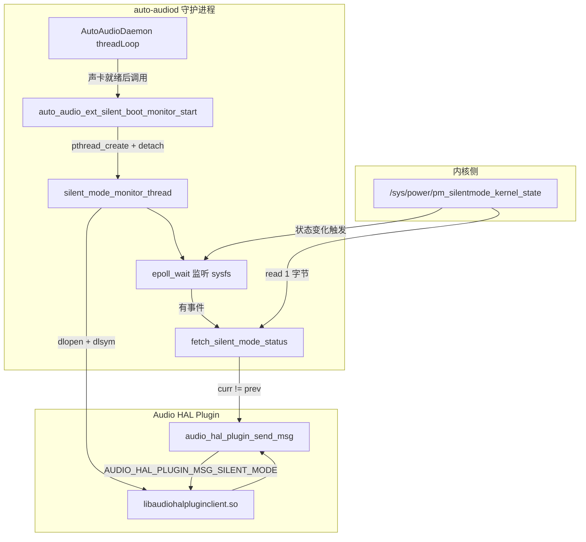

[← 上一个](16_16.3_AutoPower与VHAL集成.md) | [← 返回16章](README.md) | [返回导航](../README.md) | [下一个 →](16_16.5_audio-chime早期提示音.md)

---

## 16.4 Silent Boot监控

> **核心定位**：Silent Boot（静默模式）监控是 `auto-audiod` 守护进程内的一个**可选编译特性**，由编译期宏 `SILENT_BOOT_ENABLED` 控制。其真实实现是在 `auto_audio_ext.cpp` 中启动一个后台监控线程，通过 `epoll` 监听内核 sysfs 节点 `/sys/power/pm_silentmode_kernel_state` 的状态变化，并在状态发生变化时，通过 `dlopen`/`dlsym` 调用 Audio HAL plugin 的 `audio_hal_plugin_send_msg()` 接口，向 Audio HAL 发送 `AUDIO_HAL_PLUGIN_MSG_SILENT_MODE` 消息。它是一个"内核状态 → HAL 通知"的**单向桥接器**，本身不做任何音频抑制决策。

> ⚠️ **重大澄清（本章已按本机真实源码整章重写）**
>
> 本章旧版本的绝大部分内容（`isSilentBootMode()`、`checkSilentBoot()`、`handleSilentBoot()`、`exitSilentBoot()`、`notifySilentBootStatus()`、`persist.audio.silent_boot` 多级属性判定链、`sys.boot.reason`/`ro.bootmode`/`ro.factorytest` 判定、双域一致性同步、ACDB 延迟推送表、audio-chime 补播策略、`SILENT_BOOT_STATUS` setParameters 协议等）**在本机真实源码中均不存在**，属于早期推演/虚构，现已全部删除。
>
> 请以本章下述内容为准，权威来源为：
> - `vendor/qcom/proprietary/mm-audio-auto/auto-audiod/auto_audio_ext.cpp`（第 11-22 行宏定义/全局变量；第 935-1075 行实现）
> - `vendor/qcom/proprietary/mm-audio-auto/auto-audiod/auto_audio_ext.h`（第 99-102 行宏声明）
> - `vendor/qcom/proprietary/mm-audio-auto/auto-audiod/AutoAudioDaemon.cpp`（第 284 行调用点）
> - `vendor/qcom/proprietary/mm-audio-auto/auto-audiod/Android.mk`（第 58 行 `-DSILENT_BOOT_ENABLED`）

### 16.4.1 特性概述与编译开关

Silent Boot 监控是 `auto-audiod` 的**编译期可选特性**，通过 `SILENT_BOOT_ENABLED` 宏控制：

- **未定义 `SILENT_BOOT_ENABLED`**（默认）：`auto_audio_ext.h` 将入口函数定义为空宏，整个特性被编译掉，运行时零开销。

```cpp
// auto_audio_ext.h（第 99-102 行）
#ifndef SILENT_BOOT_ENABLED
#define auto_audio_ext_silent_boot_monitor_start() (0)
#else
void auto_audio_ext_silent_boot_monitor_start(void);
#endif
```

- **定义了 `SILENT_BOOT_ENABLED`**（由 `Android.mk` 第 58 行 `LOCAL_CFLAGS += -DSILENT_BOOT_ENABLED` 开启）：`auto_audio_ext.cpp` 第 935-1075 行的完整实现被编译进来，包括 `fetch_silent_mode_status()`、`silent_mode_monitor_thread()` 和 `auto_audio_ext_silent_boot_monitor_start()`。

```cpp
// auto_audio_ext.cpp（第 11-22 行，均在 #ifdef SILENT_BOOT_ENABLED 内）
#ifdef SILENT_BOOT_ENABLED
#include <sys/epoll.h>
#include <dlfcn.h>
#define AUDIO_HAL_PLUGIN_LIB  "libaudiohalpluginclient.so"
#define SILENT_MODE_FILE      "/sys/power/pm_silentmode_kernel_state"
typedef int32_t (*audio_hal_plugin_send_msg_t)(audio_hal_plugin_msg_type_t, void *, uint32_t);
static bool is_monitor_running = false;
pthread_mutex_t silent_boot_lock = PTHREAD_MUTEX_INITIALIZER;
#endif
```

**关键事实汇总（真实源码）**：

| 事项 | 真实值 | 来源 |
|------|--------|------|
| 控制方式 | 编译期宏 `SILENT_BOOT_ENABLED`（非运行时属性） | auto_audio_ext.cpp:11 / Android.mk:58 |
| 监控对象 | 内核 sysfs 节点 `/sys/power/pm_silentmode_kernel_state` | auto_audio_ext.cpp:18 |
| 监听方式 | `epoll`（`EPOLLIN \| EPOLLET` 边沿触发） | auto_audio_ext.cpp:992-1011 |
| HAL 通知库 | `libaudiohalpluginclient.so`（`dlopen` 动态加载） | auto_audio_ext.cpp:17,979 |
| HAL 通知接口 | `audio_hal_plugin_send_msg()`（`dlsym` 解析） | auto_audio_ext.cpp:985 |
| 通知消息类型 | `AUDIO_HAL_PLUGIN_MSG_SILENT_MODE` | auto_audio_ext.cpp:1022 |
| 启动位置 | `AutoAudioDaemon` 声卡就绪后 | AutoAudioDaemon.cpp:284 |
| 线程模型 | `pthread_create` + `pthread_detach`（分离线程） | auto_audio_ext.cpp:1063-1069 |
| 去重保护 | `silent_boot_lock` 互斥锁 + `is_monitor_running` 标志 | auto_audio_ext.cpp:1059-1062 |

### 16.4.2 整体数据流

真实机制是一条极简的"内核 → HAL"单向链路，不涉及属性系统、VHAL 判定或跨域一致性协商：



### 16.4.3 启动入口 auto_audio_ext_silent_boot_monitor_start()

该函数是特性的唯一对外入口，由 `AutoAudioDaemon` 在声卡就绪后调用（见 16.4.6）。它用互斥锁与 `is_monitor_running` 标志保证监控线程只启动一次，并将线程创建为分离（detached）线程：

```cpp
// auto_audio_ext.cpp（第 1054-1074 行）
void auto_audio_ext_silent_boot_monitor_start(void)
{
    int ret = 0;
    pthread_t silent_boot_tid;

    pthread_mutex_lock(&silent_boot_lock);
    if (!is_monitor_running) {
        ALOGD("%s: starting silent boot monitor", __func__);
        is_monitor_running = true;
        ret = pthread_create(&silent_boot_tid, NULL,
                             &silent_mode_monitor_thread, NULL);
        if (ret) {
            ALOGE("%s: Failed to create silent boot monitor thread", __func__);
            return;   // 注意：此处提前 return，未解锁（见下方说明）
        }
        pthread_detach(silent_boot_tid);
        ALOGD("%s: Silent boot monitor started", __func__);
    }
    pthread_mutex_unlock(&silent_boot_lock);
}
```

**要点**：
- `silent_boot_lock` + `is_monitor_running` 组合确保重复调用时不会重复起线程（幂等）。
- 使用 `pthread_detach`，线程结束后自动回收资源，无需 join。
- 源码中 `pthread_create` 失败分支直接 `return`，未先 `pthread_mutex_unlock`——这是真实源码中的一处细节（异常路径下锁未释放），如实记录，不做美化。

### 16.4.4 监控线程 silent_mode_monitor_thread()

监控线程是特性的核心，执行"初始化 → epoll 循环 → 清理"三段式流程。

**第一段：初始化（打开 sysfs、加载 HAL plugin、建立 epoll）**

```cpp
// auto_audio_ext.cpp（第 960-1008 行，节选）
static void* silent_mode_monitor_thread(void* arg __unused)
{
    int silent_mode_fd = -1;
    int silent_mode_epoll_fd = -1;
    epoll_event ev, events;
    uint8_t prev_silent_mode = -1;
    uint8_t curr_silent_mode = 0;
    void *plugin_handle = NULL;
    audio_hal_plugin_send_msg_t hal_plugin_send_msg;

    // 1) 打开内核 silent mode 节点
    silent_mode_fd = open(SILENT_MODE_FILE, O_RDONLY);
    if (silent_mode_fd == -1) { ...goto exit; }

    // 2) dlopen Audio HAL plugin 客户端库
    plugin_handle = dlopen(AUDIO_HAL_PLUGIN_LIB, RTLD_NOW);
    if (plugin_handle == NULL) { ...goto exit; }

    // 3) dlsym 解析发送消息接口
    hal_plugin_send_msg = (audio_hal_plugin_send_msg_t)dlsym(plugin_handle,
                                               "audio_hal_plugin_send_msg");
    if (hal_plugin_send_msg == NULL) { ...goto exit; }

    // 4) 创建 epoll 实例并注册 sysfs 节点（边沿触发）
    silent_mode_epoll_fd = epoll_create1(0);
    ev.events = EPOLLIN | EPOLLET;
    ev.data.fd = silent_mode_fd;
    epoll_ctl(silent_mode_epoll_fd, EPOLL_CTL_ADD, silent_mode_fd, &ev);
```

**第二段：epoll 事件循环（检测状态变化 → 通知 HAL）**

```cpp
// auto_audio_ext.cpp（第 1009-1037 行，节选）
    while (1) {
        ret = epoll_wait(silent_mode_epoll_fd, &events, 1, -1);  // 无限阻塞
        if (ret > 0) {
            ret = fetch_silent_mode_status(silent_mode_fd, &curr_silent_mode);
            if (ret < 0) break;
            if (curr_silent_mode != prev_silent_mode) {
                // 仅在状态真正变化时通知 HAL
                if (hal_plugin_send_msg)
                    hal_plugin_send_msg(AUDIO_HAL_PLUGIN_MSG_SILENT_MODE,
                                  &curr_silent_mode, sizeof(curr_silent_mode));
                prev_silent_mode = curr_silent_mode;
            }
        } else if (ret == -1) {
            if (errno == -EINTR) continue;  // 信号中断则继续
            break;
        }
    }
```

**第三段：退出清理**

```cpp
// auto_audio_ext.cpp（第 1038-1052 行，节选）
exit:
    if (silent_mode_epoll_fd != -1) {
        epoll_ctl(silent_mode_epoll_fd, EPOLL_CTL_DEL, silent_mode_fd, &ev);
        close(silent_mode_epoll_fd);
    }
    if (silent_mode_fd != -1) close(silent_mode_fd);
    if (plugin_handle) dlclose(plugin_handle);
    is_monitor_running = false;   // 允许后续重新启动
    pthread_exit(NULL);
    return NULL;
```

**要点**：
- 使用 `EPOLLET`（边沿触发）监听 sysfs 节点，内核在 silent mode 状态翻转时唤醒 `epoll_wait`。
- 用 `prev_silent_mode`/`curr_silent_mode` 做去抖：**只有状态真正变化时才通知 HAL**，避免重复消息。
- 任一初始化步骤失败即 `goto exit` 做完整清理，并复位 `is_monitor_running`，使下次调用入口函数可重新启动。
- `errno == -EINTR` 分支保留原样（真实源码此处判断为 `-EINTR` 而非常见的 `EINTR`，如实记录）。

### 16.4.5 状态读取 fetch_silent_mode_status()

该辅助函数从 sysfs 节点读取当前 silent mode 状态。节点内容是一个 ASCII 字符（如 `'0'`/`'1'`），通过减去 `'0'` 转换为数值：

```cpp
// auto_audio_ext.cpp（第 936-958 行）
static int fetch_silent_mode_status(int silent_mode_fd, uint8_t *curr_silent_mode)
{
    int bytes_read = 0;
    unsigned char buf = '0';

    if (silent_mode_fd == -1) {
        ALOGE("%s: Silent mode file not opened", __func__);
        return -EINVAL;
    }
    lseek(silent_mode_fd, 0, SEEK_SET);   // 每次读前回到文件头
    bytes_read = read(silent_mode_fd, (void*)&buf, sizeof(unsigned char));
    if (bytes_read < 0)
        ALOGE("%s: Error reading silent mode file: %s", __func__, strerror(errno));
    else
        *curr_silent_mode = buf - '0';    // ASCII 字符转数值

    return bytes_read;
}
```

**要点**：
- 每次读取前 `lseek(fd, 0, SEEK_SET)` 回到文件头——sysfs 节点需要重定位后才能重新读取当前值。
- 只读 1 字节，`buf - '0'` 将 ASCII 字符转为整数（`'0'→0`，`'1'→1`）。

### 16.4.6 调用点：AutoAudioDaemon 中的启动时机

监控线程由 [`AutoAudioDaemon`](../../../auto-audiod/AutoAudioDaemon.cpp:284) 在其主循环中启动，时机是**声卡枚举就绪之后、workerThread 电源监控之前**：

```cpp
// AutoAudioDaemon.cpp（第 268-285 行，节选）
while (audioInitDone == false && sleepRetry < MAX_SLEEP_RETRY) {
    if (mSndCardFd.empty() && !getSndCardFDs(mSndCardFd)) {
        usleep(AUDIO_INIT_SLEEP_WAIT*1000);
        sleepRetry++;
    } else {
        audioInitDone = true;
    }
}

if (audioInitDone == false) {
    ALOGE("Sound Card is empty!!!");
    goto thread_exit;
} else {
    ALOGV("Start threadLoop()");
    ALOGD("Start the Silent Mode monitor");
    auto_audio_ext_silent_boot_monitor_start();   // ← 此处启动（未定义宏时为空操作）
}
```

**要点**：
- 声卡未就绪（`audioInitDone == false`）时不会启动监控，直接退出线程。
- 未定义 `SILENT_BOOT_ENABLED` 时，`auto_audio_ext_silent_boot_monitor_start()` 被替换为宏 `(0)`，此调用是空操作，不产生任何运行时行为。
- 该调用之后才是 `#ifndef VHAL_EXT` 分支下的 workerThread 声卡电源监控（见 [16.2 auto-audiod守护进程](16_16.2_auto-audiod守护进程.md)）。

### 16.4.7 与 Audio HAL plugin 的边界

`auto-audiod` 侧的职责到"发送 `AUDIO_HAL_PLUGIN_MSG_SILENT_MODE` 消息"为止。消息发送后如何处理（Audio HAL 内部如何响应 silent mode）**不属于 `auto-audiod` 源码范围**，由 `libaudiohalpluginclient.so` 及其背后的 Audio HAL plugin 实现决定。

因此本章**不描述** Audio HAL 侧的 mute/ACDB/graph 等具体动作——旧版本对这些环节的描述均为推演，已删除。如需了解 Audio HAL plugin 的消息处理，应查阅对应的 audio HAL plugin 源码，而非在本章臆测。

### 16.4.8 调试与验证方法

基于真实实现，验证 Silent Boot 监控可从以下三处入手：

**1. 确认特性是否编译进来**

```bash
# 查看 Android.mk 是否定义了 SILENT_BOOT_ENABLED
grep -n "SILENT_BOOT_ENABLED" \
  vendor/qcom/proprietary/mm-audio-auto/auto-audiod/Android.mk
```

若未定义，则监控特性完全不存在于运行时二进制中。

**2. 观察 auto-audiod 日志**

真实源码中的日志标签来自各函数的 `__func__`，可据此过滤：

```bash
# 监控线程启停日志
adb logcat | grep -E "silent boot monitor|Silent Mode monitor"

# 监控线程内部（epoll 进出、状态变化）
adb logcat | grep -E "silent_mode_monitor_thread|Going into epoll_wait|silent mode state change"

# 状态读取日志
adb logcat | grep "fetch_silent_mode_status"
```

**3. 直接查看内核 sysfs 节点**

```bash
# 读取当前 silent mode 状态（监控线程正是监听此节点）
adb shell cat /sys/power/pm_silentmode_kernel_state
```

**验证清单（对齐真实实现）**：

| 序号 | 检查项 | 预期结果 | 验证方法 |
|------|--------|---------|---------|
| 1 | 特性已编译 | Android.mk 含 `-DSILENT_BOOT_ENABLED` | grep Android.mk |
| 2 | 监控线程启动 | 声卡就绪后打印 "starting silent boot monitor" | logcat |
| 3 | epoll 阻塞就绪 | 打印 "Going into epoll_wait" | logcat |
| 4 | 状态变化通知 | sysfs 值翻转时打印 "silent mode state change" | 改变 sysfs 后观察 logcat |
| 5 | 去抖生效 | 状态不变时不重复发送 HAL 消息 | logcat（无重复 send msg） |

### 16.4.9 小结

真实的 Silent Boot 监控是一个**编译期可选、职责单一**的桥接线程：

1. **编译期宏 `SILENT_BOOT_ENABLED` 控制**：未定义时零开销（空宏）。
2. **监听内核 sysfs 节点** `/sys/power/pm_silentmode_kernel_state`（非 Android 属性）。
3. **epoll 边沿触发** 监测状态翻转，去抖后仅在变化时通知。
4. **dlopen/dlsym 动态桥接** 到 `libaudiohalpluginclient.so::audio_hal_plugin_send_msg`，发送 `AUDIO_HAL_PLUGIN_MSG_SILENT_MODE`。
5. **不做任何音频抑制决策**——决策与执行在 Audio HAL plugin 侧，超出 `auto-audiod` 范围。

旧版本描述的属性判定链、双域一致性、ACDB 延迟、audio-chime 补播、AutoPower 静默集成等均为虚构，已整章删除。

---