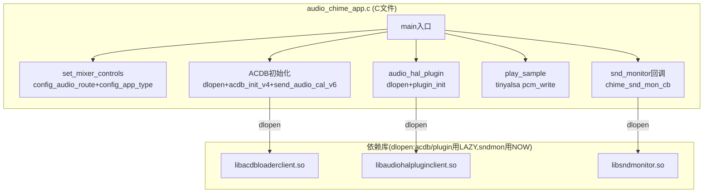
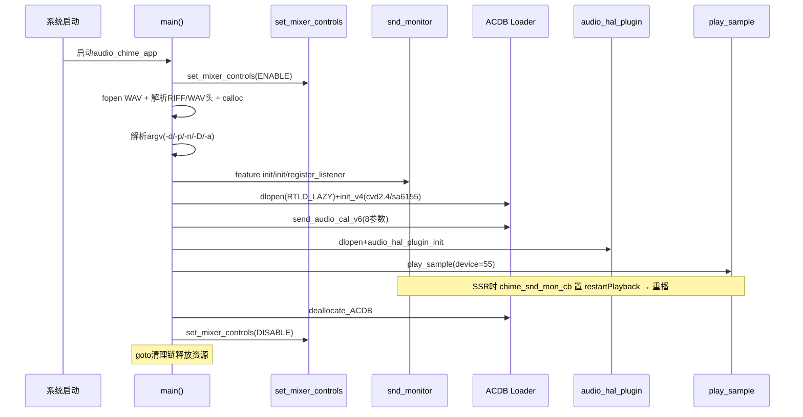

[← 16.4 Silent Boot监控](16_16.4_Silent_Boot监控.md) | [← 返回SA8295 Vendor+QNX双域音频架构深度解析](README.md) | [返回导航](../README.md) | [16.6 ACDB校准体系 →](16_16.6_ACDB校准体系.md)

---

## 16.5 audio-chime早期提示音

> ⚠️ **重大澄清（2026-07 与真实源码交叉核实后重写）**
>
> 本章旧版存在大量虚构，以下内容已按本机真实源码 `mm-audio-auto/audio-chime/audio_chime_app.c`（单个 **C 文件**，约 948 行）逐函数、逐参数核实并重写。旧版主要错误如下：
>
> | 旧版虚构 | 真实源码 |
> | --- | --- |
> | C++ 类 `AudioChime::initAcdb/playChime/...` | 纯 **C 全局函数**，无任何类 |
> | dlopen 统一用 `RTLD_NOW` | 实为**混用**：`libacdbloaderclient.so` / `libaudiohalpluginclient.so` 用 **`RTLD_LAZY`**；`libsndmonitor.so` 用 **`RTLD_NOW`** |
> | `acdb_loader_send_audio_cal_v6(app_type, acdb_id, sr, fedai)` 4 参数 | 实为 **8 参数** |
> | device = 22（误当 MULTIMEDIA_FEDAI_ID） | 播放 **device = 55**；22 是 mixer 路由里的 MultiMedia23 编号 |
> | 未提及 `audio_hal_plugin` | 实际会 dlopen `libaudiohalpluginclient.so` 并调 `audio_hal_plugin_init` |
> | SSR 用 `/proc/asound/card0/state` 轮询 + `sleep(1)` | 实为 **snd_monitor 回调机制**（`libsndmonitor.so` + `chime_snd_mon_cb`） |
> | `configureMixerRoute` 单一控件 + Volume 控件 | 实为 `config_audio_route` + `config_app_type` 两组固定数组写入 |

### 16.5.1 架构概述

`audio-chime` 是 SA8295 平台的早期启动音播放应用，在 Android 启动早期（AudioFlinger 尚未完全就绪）直接通过 tinyalsa PCM API 播放提示音。真实实现是 `audio_chime_app.c` 中的一组 C 全局函数，`main()` 串起完整流程。



### 16.5.2 默认配置常量（真实源码头部宏）

真实源码用一组 `#define` 常量，而非旧版虚构的 `struct chime_config`：

```c
// audio_chime_app.c 真实常量定义
#define DEFAULT_APP_TYPE_RX_PATH       69943  // RX path app type
#define DEFAULT_ACDB_ID                60     // ACDB设备校准ID
#define DEFAULT_OUTPUT_SAMPLING_RATE   48000  // 48kHz
#define DEFAULT_BIT_WIDTH              16
#define DEFAULT_BACKEND_ID             87     // 旧版遗漏
#define MULTIMEDIA_FEDAI_ID            22     // FEDAI = MultiMedia23

// 播放设备号（main局部变量默认值）
unsigned int device = 55;                     // 非22！

// Mixer控件名
#define MIXER_AUDIO_ROUTE                   "TERT_TDM_RX_0 Audio Mixer MultiMedia23"
#define MIXER_AUDIO_STREAM_APP_TYPE_CONFIG  "Audio Stream 55 App Type Cfg"
#define MIXER_TYPE_CONFIG                   "App Type Config"
```

> 关键辨析：`device = 55` 是 PCM 播放设备号；`MULTIMEDIA_FEDAI_ID = 22`（MultiMedia23）用于 mixer 路由控件名与 ACDB 调用参数。旧版把两者混为一谈。

### 16.5.3 Mixer 路由配置（真实实现）

真实入口 `set_mixer_controls(int enable)`：循环 `mixer_open(card=0)`（失败重试 `MAX_SLEEP_RETRY` 次），成功后调 `config_audio_route`，enable 时再调 `config_app_type`。

```c
static int config_audio_route(struct mixer* mixer, int enable) {
  struct mixer_ctl *ctl;
    char *mixer_str = MIXER_AUDIO_ROUTE;   // "TERT_TDM_RX_0 Audio Mixer MultiMedia23"
    ctl = mixer_get_ctl_by_name(mixer, mixer_str);
    if (!ctl) return -EINVAL;
    mixer_ctl_set_value(ctl, 0, enable);   // enable=1开路由, 0关
    return 0;
}

static int config_app_type(struct mixer* mixer) {
    long app_type_cfg[4], app_type_config[4];

    // (1) "Audio Stream 55 App Type Cfg" —— FEDAI MULTIMEDIA23的默认值
    ctl = mixer_get_ctl_by_name(mixer, MIXER_AUDIO_STREAM_APP_TYPE_CONFIG);
    app_type_cfg[0] = DEFAULT_APP_TYPE_RX_PATH;      // 69943
    app_type_cfg[1] = DEFAULT_ACDB_ID;               // 60
    app_type_cfg[2] = DEFAULT_OUTPUT_SAMPLING_RATE;  // 48000
    app_type_cfg[3] = DEFAULT_BACKEND_ID;            // 87
    mixer_ctl_set_array(ctl, app_type_cfg, 4);

    // (2) "App Type Config"
    ctl = mixer_get_ctl_by_name(mixer, MIXER_TYPE_CONFIG);
    app_type_config[0] = 1;
    app_type_config[1] = DEFAULT_APP_TYPE_RX_PATH;      // 69943
    app_type_config[2] = DEFAULT_OUTPUT_SAMPLING_RATE;  // 48000
    app_type_config[3] = DEFAULT_BIT_WIDTH;             // 16
    mixer_ctl_set_array(ctl, app_type_config, 4);
    return 0;
}
```

真实实现是两组**固定数组**写入，无旧版虚构的 "MultiMedia23 Volume" 音量控件。

### 16.5.4 ACDB 初始化流程（真实实现）

真实源码用 `struct platform_data`（含 `acdb_handle` + 5 个函数指针 + `acdb_init_data`），dlopen `libacdbloaderclient.so`（**RTLD_LAZY**），dlsym **5 个符号**：

```c
// dlopen + dlsym 5符号（均RTLD_LAZY）
my_data->acdb_handle = dlopen(LIB_ACDB_LOADER_CLIENT, RTLD_LAZY);
acdb_loader_init_v4          = dlsym(handle, "acdb_loader_init_v4");
acdb_loader_send_audio_cal_v4= dlsym(handle, "acdb_loader_send_audio_cal_v4");
acdb_loader_send_audio_cal_v6= dlsym(handle, "acdb_loader_send_audio_cal_v6");
acdb_loader_send_common_custom_topology = dlsym(handle, "...send_common_custom_topology");
acdb_loader_deallocate_ACDB  = dlsym(handle, "acdb_loader_deallocate_ACDB");

// init_v4 —— 注意 snd_card_name 硬编码为 sa6155 命名（如实记录，未美化）
my_data->acdb_init_data.cvd_version   = "2.4";
my_data->acdb_init_data.snd_card_name = "sa6155-adp-star-snd-card";
acdb_loader_init_v4(&my_data->acdb_init_data, ACDB_LOADER_INIT_V4);

// send_audio_cal_v6 —— 真实为 8 参数（旧版写4参数错误）
acdb_loader_send_audio_cal_v6(
    acdb_id,                      // 设备ACDB ID
    ACDB_DEV_TYPE_OUT,            // =1, 输出设备
    DEFAULT_APP_TYPE_RX_PATH,     // 69943
    DEFAULT_OUTPUT_SAMPLING_RATE, // 48000
    MULTIMEDIA_FEDAI_ID,          // 22 (MultiMedia23)
    DEFAULT_OUTPUT_SAMPLING_RATE, // 48000 (第二个采样率参数)
CAL_MODE_SEND,                // 0x1
    CAL_OFFSET_ASM_TOP);          // 0x1
```

> 瑕疵如实记录：`snd_card_name` 硬编码为 `"sa6155-adp-star-snd-card"`，看似与 SA8295 平台命名不符，但源码确实如此，此处不做美化。

### 16.5.5 audio_hal_plugin 初始化（旧版完全遗漏）

真实 `main()` 在 ACDB 之后还会加载 HAL plugin 客户端库：

```c
// struct hal_plugin_data
hal_data->plugin_handle = dlopen(LIB_PLUGIN_CLIENT, RTLD_LAZY);  // libaudiohalpluginclient.so
audio_hal_plugin_init = dlsym(plugin_handle, "audio_hal_plugin_init");
audio_hal_plugin_init();   // 初始化HAL plugin客户端
```

旧版文档完全未提及此环节。

### 16.5.6 PCM 播放实现（真实 play_sample）

真实播放函数 `play_sample`，PCM 设备号为 **55**（非旧版的 22）：

```c
static int play_sample(...) {
    // pcm_open(card=0, device=55, PCM_OUT, &config)
    // WAV 头已在 main 中通过 riff_wave_header / chunk_header / chunk_fmt 解析
    // sample_data 由 calloc 分配, fread 从 WAV 文件读入
    // 循环 pcm_write 写入直到 is_playback_complete
    // 支持 restartPlayback 触发的 SSR 后重播
}
```

`main()` 中先 `fopen` WAV 文件、校验 `ID_RIFF`/`ID_WAVE`/`ID_FMT`/`ID_DATA`，再 `calloc` 采样缓冲，最后 `play_sample`。

### 16.5.7 SSR 恢复机制（真实 snd_monitor 回调）

旧版虚构的 `/proc/asound/card0/state` 轮询 + `sleep(1)` 完全错误。真实机制基于 **snd_monitor 回调**：

```c
// 1) property门控 + dlopen libsndmonitor.so (/vendor/lib64/ 或 /vendor/lib/)
property_get_bool("vendor.audio.feature.snd_mon.enable", ...);
snd_mon_handle = dlopen(SND_MONITOR_PATH, RTLD_NOW);   // 注意：snd_monitor 用 RTLD_NOW
// dlsym 4符号: audio_snd_mon_init / deinit / register_listener / unregister_listener

// 2) 注册回调
audio_chime_snd_mon_register_listener(chime_snd_mon_cb);

// 3) 回调解析声卡状态
static void chime_snd_mon_cb(void *cookie, ...) {
    parse_card_status(parms, &card, &status);   // SND_CARD_STATUS → card, ONLINE/OFFLINE
    if (status == ONLINE) {
        // card_status去抖后：重配mixer + 重送ACDB cal + 置 restartPlayback
        restartPlayback = true;
    }
}
```

`play_sample` 侧配合 `restartPlayback` 标志与 `MAX_SLEEP_RETRY`(=1000) 轮询完成 SSR 后的重播。

### 16.5.8 真实 main 流程时序



真实 `main()` 结尾用 **goto 清理链**依次释放：deallocate ACDB → dlclose 各库 → unregister snd_mon listener → free sample_data → `set_mixer_controls(DISABLE)`。

---

---

[← 16.4 Silent Boot监控](16_16.4_Silent_Boot监控.md) | [← 返回SA8295 Vendor+QNX双域音频架构深度解析](README.md) | [返回导航](../README.md) | [16.6 ACDB校准体系 →](16_16.6_ACDB校准体系.md)