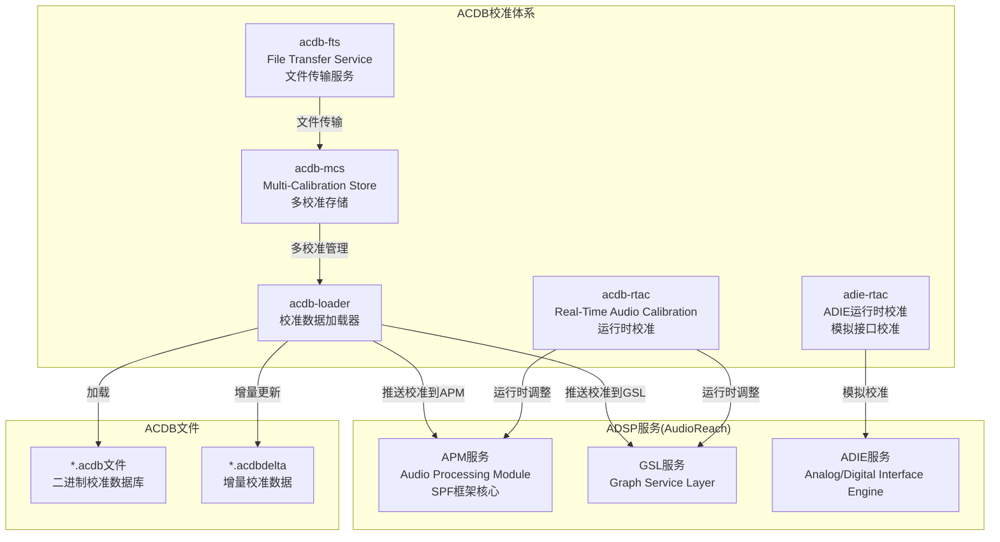
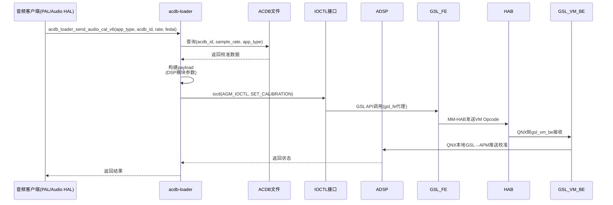
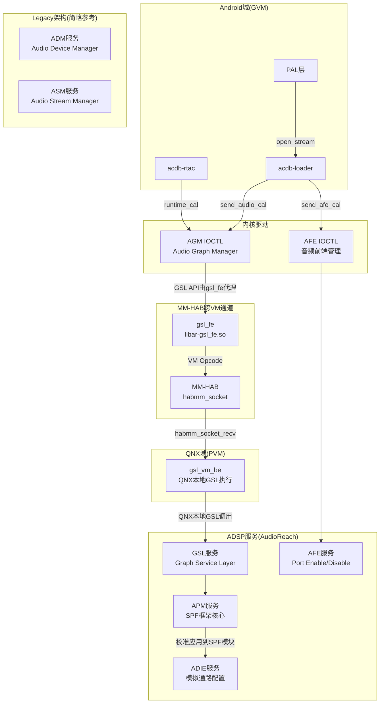

[← 16.5 audio-chime早期提示音](16_16.5_audio-chime早期提示音.md) | [← 返回SA8295 Vendor+QNX双域音频架构深度解析](README.md) | [返回导航](../README.md) | [16.7 ACDB校准数据（Android →](16_16.7_ACDB校准数据Android与QNX双域共享.md)

---

## 16.6 ACDB校准体系

### 16.6.1 ACDB概述

ACDB(Audio Calibration Database)是高通平台的核心校准体系，存储了音频设备的校准参数（如增益、滤波器系数、延迟补偿等），在音频流打开时推送到ADSP，确保DSP处理链使用正确的校准数据。

> **重要更正 · ACDB API 的两套体系（对照源码）**：SA8295 存在两套 ACDB 实现，二者 API 完全不同，切勿混用：
> - **Elite/CSD 体系（Legacy）**：`acdb-loader` / `acdb_loader_send_audio_cal_v6` / `acdb-mcs` / `acdb-fts` / `acdb-rtac` 等 API，实现位于 QNX `audio_elite/audio_driver/acdb_lib/`（`acdb.c`/`acdb_command.c`）与 `csd_lib/.../csd_*_acdb.c`。本节 16.6.2–16.6.5 描述的即这套 Legacy API。
> - **AudioReach 体系（SA8295 主链路）**：ACDB 数据由 **GSL 通过 key vector（GKV/CKV/TKV）在图打开时检索**并下发给 SPF，PAL 侧**不调用** `acdb_loader_send_audio_cal_v6`（已核实 `qc/Android/.../pal/` 中该符号匹配数为 0）。AudioReach 侧 ACDB C API 为 `acdb_init`/`acdb_ioctl`，由 `audio_ar/audio_driver/audio_reach/gsl/` 内部调用。key vector 检索机制详见 [16.11 SessionGsl与GSL接口](16_16.11_SessionGsl与GSL接口.md)、[16.10 AGM](16_16.10_AGMAudio_Graph_Manager深度解.md) 与 [16.14 GSL内部架构](16_16.14_GSLGraph_Service_Layer内部架.md)。
>
> 因此下图中 `acdb-loader → APM/GSL` 的直接推送关系仅适用于 Elite/CSD Legacy 路径；AudioReach 主链路是 `PAL → AGM → GSL --(key vector 查 ACDB)--> SPF`。



### 16.6.2 acdb-loader校准加载器

> ⚠️ **重大澄清（2026-07 与真实源码交叉核实后重写）**
> 本节 16.6.2–16.6.5 旧版将 acdb-loader/mcs/fts/rtac 描述成 C++ 类与虚构函数签名，均与真实源码不符。真实源码位于 `mm-audio-cal/audio-acdb-util/{acdb-loader,acdb-mcs,acdb-fts,acdb-rtac}/`，是**纯 C 实现**。关键更正：
> - `acdb-loader` **无** `send_custom_cal` / `send_afe_cal`；真实为 `acdb_loader_send_audio_cal_v6`（**8 参数**）等。
> - `acdb-mcs` 全称是 **Media Control Service（ACPH_MEDIA_CONTROL）**，**不是** "Multi-Calibration Store 多校准存储"。
> - mcs/fts/rtac 对外**只暴露一个 `*_init()`**，实际能力通过 **ACPH 命令回调**（`acph_register_command`）提供，而非虚构的直接函数 API。

`acdb-loader`（`acdb-loader/src/acdb-loader.c`）是 ACDB 体系核心，从 ACDB 二进制库读取校准并推送。真实导出的是一组 **C 全局函数**（非类），主要包括：

```c
// acdb-loader.c 真实导出符号（节选，均为C全局函数）
int  acdb_loader_init_v2 / _v3 / _v4(...);          // 多版本初始化
void acdb_loader_send_audio_cal_v6(int acdb_id, int capability, int app_id,
        int sample_rate, int use_case, int afe_sample_rate,
        int cal_mode, int offset_index);            // 8参数（详见16.5.4）
void acdb_loader_send_audio_cal_v4(int acdb_id, int capability, int app_id,
        int sample_rate, int use_case, int afe_sample_rate);  // 6参数
int  acdb_loader_send_common_custom_topology(...);
int  acdb_loader_send_gain_dep_cal(...);
void acdb_loader_deallocate_cal(...);
// AudioReach/GSL subgraph 系列（供 GSL 查 key vector 用）
int32_t acdb_loader_get_subgraph_list / _conn / _mod_cal / _mod_conn / _mod_info_list(...);
int  acdb_loader_get_default_app_type(...);
int  acdb_loader_get_remote_acdb_id(...);
```

真实源码**不存在** `acdb_loader_send_custom_cal`、`acdb_loader_send_afe_cal`（旧版虚构）。注意大量 `acdb_loader_get_subgraph_*` API 属于 AudioReach 主链路——GSL 用 key vector 查 ACDB 时调用（见 16.6.1 更正块）。

#### 校准推送流程



### 16.6.3 acdb-mcs（Media Control Service）

`acdb-mcs`（`acdb-mcs/src/acdb-mcs.c`）真实全称为 **Media Control Service**，对外仅暴露：

```c
int acdb_mcs_init(char *snd_card_name);   // acdb-mcs/inc/acdb-mcs.h 唯一公开API
```

其 `init` 内部通过 **ACPH（ACDB Packet Handler）注册命令回调**对外提供服务：

```c
// acdb-mcs.c:616
ret = acph_register_command(ACPH_MEDIA_CONTROL_REG_SERVICEID, acdb_mcs_callback);
```

即：真实的媒体控制能力是通过 ACPH 命令包（由 QACT/调试工具经 acdb-fts 通道下发）触发 `acdb_mcs_callback` 处理，**没有** 旧版虚构的 `acdb_mcs_alloc_cal_id`/`dealloc_cal_id`/`apply_cal`/`get_cal_info` 这套直接函数 API。旧版的"多校准存储/多校准场景表"属于臆测，已删除。

### 16.6.4 acdb-fts（File Transfer Service）

`acdb-fts`（`acdb-fts/src/acdb-fts.c`）对外仅暴露：

```c
int acdb_fts_init(void);   // acdb-fts/inc/acdb-fts.h 唯一公开API
```

其 `init` 同样通过 ACPH 注册命令回调对外提供文件传输服务：

```c
ret = acph_register_command(ACPH_FILE_TRANSFER_REG_SERVICEID, acdb_fts_callback);
```

即：ACDB 文件/增量数据的传输由 QACT 等调试工具经 ACPH 命令包驱动，触发 `acdb_fts_callback` 处理。**没有** 旧版虚构的 `acdb_fts_send_file`/`get_version`/`sync_delta` 直接函数 API。

### 16.6.5 acdb-rtac（Real-Time Calibration）

`acdb-rtac`（`acdb-rtac/src/acdb-rtac.c`）对外暴露初始化/退出对：

```c
void acdb_rtac_init(bool inst_id_supported);   // acdb-rtac/inc/acdb-rtac.h:13（返回void，带inst_id_supported参数）
void acdb_rtac_exit(void);                      // acdb-rtac/inc/acdb-rtac.h:14
```

其 `init` 通过 ACPH 注册 DSP 实时校准命令回调，`exit` 时注销：

```c
ret = acph_register_command(ACPH_DSP_RTC_REG_SERVICEID, acdb_rtac_callback);
// ...
acph_deregister_command(ACPH_DSP_RTC_REG_SERVICEID);   // acdb-rtac.c:1714 附近
```

即：运行时校准（Real-Time Calibration）由 QACT 调音工具经 ACPH 命令包实时下发/读取，触发 `acdb_rtac_callback` 处理。**没有** 旧版虚构的 `acdb_rtac_set_cal`/`get_cal`/`adie_rtac_set_cal` 直接函数 API。

> **小结（ACPH 命令服务）**：`acdb-mcs`/`acdb-fts`/`acdb-rtac` 三者对外都只暴露 `*_init`（rtac 另有 `_exit`），真实能力全部通过 `acph_register_command(SERVICEID, callback)` 挂到 **ACPH（ACDB Packet Handler）** 命令通道上，面向 QACT 等离线/在线调音工具，**不是** 音频播放热路径直接调用的函数库。播放热路径的校准下发走的是 `acdb-loader` 的 `acdb_loader_send_audio_cal_v6`/`v4` 与 `get_subgraph_*` 系列。

### 16.6.6 ACDB ID映射表

ACDB ID是连接Android侧设备枚举和DSP校准数据的桥梁，每个音频设备都有唯一的ACDB ID：

#### 播放(RX)设备ACDB ID

| ACDB ID | 设备名称 | 说明 |
|---------|---------|------|
| ACDB ID | 头文件宏（acdb-id-mapper.h） | 说明 |
|---------|------------------------------|------|
| 7 | `DEVICE_HANDSET_RX_ACDB_ID` | 手机听筒播放（HANDSET_SPKR） |
| 10 | `DEVICE_HEADSET_RX_ACDB_ID` | 有线耳机播放（HEADSET_SPKR_STEREO） |
| 14 | `DEVICE_SPEAKER_MONO_RX_ACDB_ID` | 扬声器单声道播放 |
| 15 | `DEVICE_SPEAKER_RX_ACDB_ID` | 扬声器立体声播放 |
| 18 | `DEVICE_HDMI_STEREO_RX_ACDB_ID` | HDMI 输出 |
| 22 | `DEVICE_BT_SCO_RX_ACDB_ID` | 蓝牙 SCO 播放 |
| 26 | `DEVICE_ANC_HEADSET_STEREO_RX_ACDB_ID` | ANC 耳机播放（同普通耳机校准） |
| 39 | `DEVICE_BT_SCO_RX_WB_ACDB_ID` | 蓝牙 SCO 宽带播放 |
| 45 | `DEVICE_USB_RX_ACDB_ID` | USB 音频输出 |

> **重大澄清（RX 映射）**：上表 ID/宏名以本机 `acdb-loader/inc/acdb-id-mapper.h` 为准。旧版表格存在错误：把 HANDSET_RX 写成 1（真实为 7），把 14 标为"扬声器替代 ID"（真实为 `SPEAKER_MONO_RX`），并臆造了 `MEDIA_RX=60`/`VOICE_RX=66`/`BT_A2DP_RX=26`（真实 26 是 ANC 耳机）等条目，已更正/删除。`INVALID_ACDB_ID` 表示该路径当前不支持（如 FM）。

#### 录音(TX)设备ACDB ID

| ACDB ID | 设备名称 | 说明 |
|---------|---------|------|
| ACDB ID | 头文件宏（acdb-id-mapper.h） | 说明 |
|---------|------------------------------|------|
| 4 | `DEVICE_HANDSET_TX_ACDB_ID` | 手机麦克风录音（HANDSET_MIC） |
| 8 | `DEVICE_HEADSET_TX_ACDB_ID` | 有线耳机麦克风录音（HEADSET_MIC） |
| 11 | `DEVICE_SPEAKER_TX_ACDB_ID` | 扬声器麦克风（SPKR_PHONE_MIC） |
| 21 | `DEVICE_BT_SCO_TX_ACDB_ID` | 蓝牙 SCO 录音 |
| 38 | `DEVICE_BT_SCO_TX_WB_ACDB_ID` | 蓝牙 SCO 宽带录音 |
| 44 | `DEVICE_USB_TX_ACDB_ID` | USB 音频输入 |

> **重大澄清（TX 映射 + 车载特有表）**：真实 `HEADSET_TX=8`（旧版误写 11）、`SPEAKER_TX=11`（旧版误写 16）、`BT_SCO_TX=21`（旧版误写 23）。旧版"车载特有 ACDB ID"整表（`CHIME_RX=60`/`EC_REF_RX=89`/`NAVI_RX=130`/`ANNOUNCEMENT_RX=131`）在本机头文件中**均无对应宏**——例如 130 真实是 `DEVICE_HANDSET_MONO_LISTEN_HIGH_POWER_DUTYCYCLE_ACDB_ID`（语音唤醒占空比路径），与"导航提示音"无关。该表属臆造，已整表删除。完整 ID 列表以 `acdb-id-mapper.h` 为准。

### 16.6.7 ACDB校准数据结构

```cpp
在 `acdb-loader.c` 中，校准类型不是文档旧版臆造的 `enum acdb_cal_type { CAL_TYPE_AUDIO_RX=0, ... }`，而是直接使用 **ACDB/kernel 平台头定义的 `*_CAL_TYPE` 常量**作为下标，索引一张 `{min_id, max_id}` 二元组表来定位每类校准的 buffer 范围。真实出现的类型（节选自 `acdb-loader.c:324` 起的映射表注释）包括：

```c
/* acdb-loader.c 内部按平台 CAL_TYPE 常量索引的映射表（节选） */
ADM_AUDPROC_CAL_TYPE          // ADM 音频处理校准（Legacy 播放/录音链路）
ADM_AUDVOL_CAL_TYPE           // ADM 音量校准
AFE_COMMON_RX_CAL_TYPE        // AFE 通用 RX 校准
AFE_COMMON_TX_CAL_TYPE        // AFE 通用 TX 校准
AFE_ANC_CAL_TYPE              // AFE ANC 校准
AFE_AANC_CAL_TYPE             // AFE 自适应 ANC 校准
AFE_FB_SPKR_PROT_CAL_TYPE     // 扬声器反馈保护（Feedback Speaker Protection）
AFE_HW_DELAY_CAL_TYPE         // AFE 硬件延时校准
AFE_SIDETONE_CAL_TYPE         // 侧音校准
AFE_TOPOLOGY_CAL_TYPE         // AFE 拓扑
AFE_CUST_TOPOLOGY_CAL_TYPE    // AFE 自定义拓扑
ULP_AFE_CAL_TYPE              // 超低功耗 AFE
ADM_RTAC_AUDVOL_CAL_TYPE      // RTAC 实时音量
AFE_FB_SPKR_PROT_TH_VI_CAL_TYPE // 扬声器保护 Th/Vi
// ...（完整列表见 acdb-loader.c 的 CAL_TYPE 索引表）
```

> **重大澄清（校准数据结构）**：旧版给出的 `struct acdb_cal_data`/`struct acdb_kv_pair`/`enum acdb_cal_type`（`CAL_TYPE_AUDIO_RX=0` 等连续枚举）在本机 `mm-audio-cal/audio-acdb-util/` 下**均无对应定义**，属臆造。真实 `acdb-loader.c` 使用平台 `*_CAL_TYPE` 常量索引 `{min,max}` 二元组表；校准数据本身通过 ACDB SW 库（`libacdbloader` 依赖的 acdb 引擎）以键值向量（key vector）方式检索，并非文档描述的简单 `key/value` 对结构。

### 16.6.8 ACDB与DSP服务交互



---

---

[← 16.5 audio-chime早期提示音](16_16.5_audio-chime早期提示音.md) | [← 返回SA8295 Vendor+QNX双域音频架构深度解析](README.md) | [返回导航](../README.md) | [16.7 ACDB校准数据（Android →](16_16.7_ACDB校准数据Android与QNX双域共享.md)
