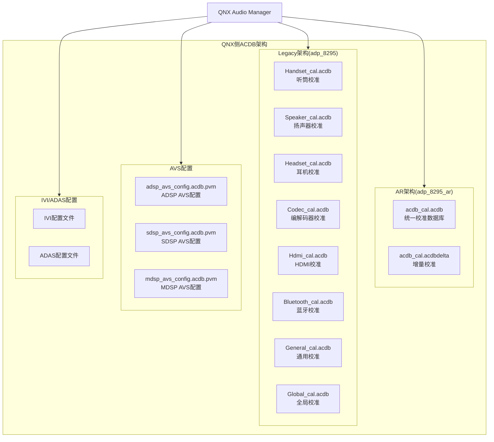
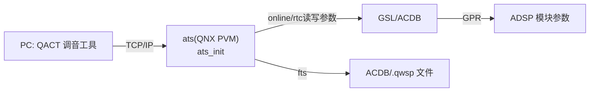

[← 16.6 ACDB校准体系](16_16.6_ACDB校准体系.md) | [← 返回SA8295 Vendor+QNX双域音频架构深度解析](README.md) | [返回导航](../README.md) | [16.8 ALSA UCM配置 →](16_16.8_ALSA_UCM配置.md)

---

## 16.7 ACDB校准数据（Android与QNX双域共享）

### 16.7.1 ACDB架构概述

**ACDB校准由QNX域主导装载，Android域侧被架空/退化。** ACDB(Audio Calibration Database)校准文件由QNX域(PVM)持有和管理，QNX Audio Manager 在启动时从 QNX 侧 ACDB 数据目录（源码依据 `boards/audio_driver/adp_8295{,_ar}/acdb_oem_datafiles/audcal/acdbdata/`，运行时挂载到 QNX 侧目标路径）全量加载校准并**直连推送到 ADSP**(`QNX AM→AGM→GSL→ADSP`)。SA8295平台支持两种ACDB架构版本：**legacy架构**(`adp_8295`)和**AR架构**(`adp_8295_ar`)。

> **⚠️ SA8295 双域关键澄清（区别于高通手机原生架构）**：在纯 Android 的高通手机上，acdb-loader(`libacdbloader.so`) 直接 open ACDB 文件并直连 ADSP，是真正干活的一方。但 **SA8295 车机是 QNX(PVM)+Android(GVM) 双域架构，ADSP 归 QNX 独占控制**：
> - **真正把校准写进 ADSP 的执行引擎是 GSL**，而 GSL 本体运行在 QNX(PVM)侧(`gsl_vm_be`/`gsl/src`)；**Android(GVM)侧只有预编译代理 `libar-gsl_fe.so`**，本身不干活，只做序列化并经 MM-HAB 转发给 QNX 执行（见 [16.14 GSL 内部架构](16_16.14_GSLGraph_Service_Layer内部架.md)）。
> - 因此 Android 侧 `/vendor/etc/acdbdata/` 那套"高通原生"ACDB 即使有文件，也**因缺少 GSL 本体与 ADSP 控制权，走不通原生直连路径**，在 SA8295 车机上退化为**兼容性/占位存在**。
> - **实际决定音频校准效果的是 QNX 侧 ACDB 数据**（源码位于 `boards/audio_driver/adp_8295{,_ar}/acdb_oem_datafiles/audcal/acdbdata/`），由 QNX AM 装载、经 QNX 本地 GSL 直连推入 ADSP。



### 16.7.2 AR架构(adp_8295_ar)

AR(Audio Reach)架构是高通新一代音频架构，采用统一的ACDB数据库文件：

#### 目录结构

```
adp_8295_ar/
├── acdb_cal.acdb           # 统一校准数据库(所有设备校准合并)
├── acdb_cal.acdbdelta      # 增量校准数据(OEM定制覆盖)
└── avs_config/
    ├── adsp_avs_config.acdb.pvm   # ADSP AVS配置
    ├── sdsp_avs_config.acdb.pvm   # SDSP AVS配置
    └── mdsp_avs_config.acdb.pvm   # MDSP AVS配置
```

#### AR架构特点

| 特性 | 说明 |
|------|------|
| 统一数据库 | 所有设备校准合并在单个acdb_cal.acdb文件中 |
| 增量覆盖 | acdbdelta文件允许OEM在不修改主数据库的情况下覆盖特定参数 |
| Graph-based | 基于Graph(图)的音频处理架构，校准与Graph绑定 |
| 动态加载 | 支持运行时加载/替换校准数据 |

### 16.7.3 Legacy架构(adp_8295)

Legacy架构按设备类型分离校准文件：

#### 目录结构

真实目录路径：`Qnx/apps/qnx_ap/boards/audio_driver/adp_8295/acdb_oem_datafiles/audcal/acdbdata/`

```
acdbdata/                        # 均为扁平目录，无 avs_config/ivi_config/adas_config 子目录
├── Handset_cal.acdb        # 1.3 KB  听筒校准（二进制）
├── Speaker_cal.acdb        # 1.3 MB  扬声器校准（二进制，含保护/EQ/限幅参数）
├── Headset_cal.acdb        # 53.9 KB 有线耳机校准（二进制）
├── Codec_cal.acdb          # 4.5 KB  编解码器校准（二进制）
├── Hdmi_cal.acdb           # 1.8 KB  HDMI 输出校准（二进制）
├── Bluetooth_cal.acdb      # 71.4 KB 蓝牙 SCO/A2DP 校准（二进制）
├── General_cal.acdb        # 22.7 KB 通用校准（二进制）
├── Global_cal.acdb         # 43.1 KB 全局校准（二进制）
├── adsp_avs_config.acdb    # 1.5 KB  ADSP AVS 配置（二进制，与 cal 同级）
├── adsp_avs_config.acdb.pvm# 1.2 KB  ADSP AVS 配置（PVM 变体，二进制）
├── mdsp_avs_config.acdb.pvm# 636 B   MDSP AVS 配置（二进制）
├── sdsp_avs_config.acdb.pvm# 636 B   SDSP AVS 配置（二进制）
├── acdb_ivi_cfg            # 405 B   ASCII 文本——IVI 场景下要加载的 .acdb 文件路径清单（前缀 //ifs//）
├── acdb_adas_cfg           # 405 B   ASCII 文本——ADAS 场景下要加载的 .acdb 文件路径清单（前缀 //mnt//）
└── workspaceFile.qwsp      # 357 KB  QACT 工程文件（二进制，调音工具用）
```

> **重大澄清（本机源码核实）**：
> 1. Legacy 目录是**扁平结构**，不存在文档旧版所写的 `avs_config/`、`ivi_config/`、`adas_config/` 子目录，`*_avs_config.acdb.pvm` 与各 `*_cal.acdb` 同级。
> 2. 所有 `.acdb` / `.acdb.pvm` 文件均为**二进制校准数据库**（`file` 判定为 `data`），其内部参数由 **QACT 调音工具**编辑并编译生成，**无法以文本形式直接查看或编辑**。
> 3. 车载相关文件是 `acdb_ivi_cfg` / `acdb_adas_cfg`（**ASCII 文本**），但内容并非路由/提示音配置，而是一份 **.acdb 文件路径清单**——两者内容一致，仅挂载前缀不同（IVI 用 `//ifs//`，ADAS 用 `//mnt//`），供加载器按场景装载对应 acdb 数据库。

#### 按设备分类校准内容

每个 `*_cal.acdb` 覆盖一类设备的校准数据（听筒/扬声器/耳机/编解码器/HDMI/蓝牙），例如 `Speaker_cal.acdb` 内含增益、EQ、扬声器保护、限幅参数；`Bluetooth_cal.acdb` 内含 SCO（NB/WB）与 A2DP 编解码相关校准。

> **重大澄清（本机源码核实）**：以上参数**均封装在二进制 `.acdb` 数据库内部**。旧版给出的 `[Speaker_RX] rx_gain / eq_band_* / limiter_*`、`[BT_A2DP_RX] supported_codecs` 等 **INI 文本示例均为臆造**——真实 `.acdb` 无法以文本查看，只能经 **QACT 工具**打开 `workspaceFile.qwsp` 工程编辑。设备与 ACDB ID 对应以 §16.6.6 `acdb-id-mapper.h` 真实映射为准（如 `SPEAKER_RX=15`、`BT_SCO_RX=22`）。


### 16.7.4 AVS配置文件

AVS（Audio-Video Subsystem，DSP 子系统）配置文件用于控制各 DSP 域的行为，真实文件与各 `*_cal.acdb` 同级位于 `acdbdata/`（扁平目录）：

| 文件 | 大小 | 说明 |
|------|------|------|
| `adsp_avs_config.acdb` | 1.5 KB | ADSP（音频域）AVS 配置 |
| `adsp_avs_config.acdb.pvm` | 1.2 KB | ADSP AVS 配置（PVM 变体） |
| `mdsp_avs_config.acdb.pvm` | 636 B | MDSP（调制解调域）AVS 配置 |
| `sdsp_avs_config.acdb.pvm` | 636 B | SDSP（传感器域）AVS 配置 |

> **重大澄清（本机源码核实）**：以上 `*_avs_config.acdb` / `*.acdb.pvm` 均为**二进制文件**（`file` 判定为 `data`）。旧版给出的 `[ADSP_AVS] pvm_mode=PERFORMANCE / mips_budget=500 / clock_freq_khz=768000 / adm Copp.peak_detect=1`、`[SDSP_AVS]`、`[MDSP_AVS]` 等整段 **INI 键值示例均为臆造**（旧版残留已删除），真实文件不含这些可读文本字段，其配置由校准工具生成、以二进制形式存储。

### 16.7.5 IVI/ADAS 场景加载清单

车载 IVI/ADAS 相关的真实文件是 `acdb_ivi_cfg` 与 `acdb_adas_cfg`（各 405 B，**ASCII 文本**），二者内容是一份 **`.acdb` 文件路径清单**（供加载器按场景装载对应校准数据库），并非路由或提示音配置。真实内容如下（两者仅挂载前缀不同）：

```text
# acdb_ivi_cfg （IVI 场景，前缀 //ifs//）
//ifs//etc//acdb//adp_8295//adsp_avs_config.acdb
//ifs//etc//acdb//adp_8295//Bluetooth_cal.acdb
//ifs//etc//acdb//adp_8295//Codec_cal.acdb
//ifs//etc//acdb//adp_8295//General_cal.acdb
//ifs//etc//acdb//adp_8295//Global_cal.acdb
//ifs//etc//acdb//adp_8295//Handset_cal.acdb
//ifs//etc//acdb//adp_8295//Hdmi_cal.acdb
//ifs//etc//acdb//adp_8295//Headset_cal.acdb
//ifs//etc//acdb//adp_8295//Speaker_cal.acdb

# acdb_adas_cfg （ADAS 场景，文件清单同上，前缀改为 //mnt//）
//mnt//etc//acdb//adp_8295//adsp_avs_config.acdb
//mnt//etc//acdb//adp_8295//...（其余同 IVI）
```

> **重大澄清（本机源码核实）**：旧版给出的 `ivi_audio_route.conf`（`zone0_output=TERT_TDM_RX`、`navigation_priority=HIGH`）与 `adas_chime_config.conf`（`forward_collision_warning=chime_fcw.wav`、`fcw_priority=10`）等文件与键值**均为臆造**，本机不存在这些文件。真实车载配置仅为上述两份 **.acdb 路径清单**，用于指示加载器在 IVI/ADAS 场景下装载哪些二进制校准数据库、从哪个挂载点（`//ifs//` vs `//mnt//`）读取。

### 16.7.6 Android与QNX侧ACDB共享对比

> **核心要点**：ACDB 校准由 **QNX 侧主导装载并直连推入 ADSP**；Android 侧的高通原生 acdb-loader 直连路径在 SA8295 双域下**被架空**（缺 GSL 本体与 ADSP 控制权），退化为兼容/占位。真正决定校准效果的是 QNX 侧 `/sys/platform/acdb/`。

| 特性 | Android侧(GVM) | QNX侧(PVM) |
|------|----------|-------|
| 角色 | **架空/占位**（原生直连路径不成立） | **主导装载方**（真正生效） |
| 校准路径 | /vendor/etc/acdbdata/（文件存在但未真正生效） | /sys/platform/acdb/（实际生效源） |
| 加载方式 | 无本地 GSL，无法直连 ADSP | QNX AM 启动时加载并直连推 ADSP |
| ADSP 控制权 | 无（GVM 无直接控制权） | **独占**（PVM 唯一控制方） |
| GSL 本体 | 仅代理 `libar-gsl_fe.so`（序列化转发） | `gsl_vm_be`/`gsl/src`（真正执行引擎） |
| 文件格式 | 单个.acdb文件(AR架构) | 按设备分离或统一(取决于架构) |
| 更新机制 | acdb-rtac 运行时调优（经 ATS/HAB，仍落到 QNX 侧 GSL 执行） | 需要重启QNX AM |
| DSP通信 | 任何调用最终经 gsl_fe→MM-HAB→gsl_vm_be→GSL→ADSP | QNX AM→AGM→GSL→ADSP(直连) |

### 16.7.7 ATS：ACDB 实时调试/调优通道

> **源码验证**：`audio_reach/acdb/ats/`，入口 `ats/src/ats.c`（`ats_init()`/`ats_deinit()`）+ `ats_command.c`，服务模块 `online / rtc / fts / mcs / adie / diag`，传输 `tcpip`。

ATS（Audio Tuning Service）是 AudioReach 栈内置的**实时调优服务**，让 PC 上的调音工具（QACT）能在设备运行时在线读写校准、录制探针数据，而不必重烧 ACDB 文件。它是 16.6/16.7 静态 ACDB 之外的"动态旁路"。

**ATS 服务模块（各自处理一类调优命令）**：

| 模块 | 职责 |
|------|------|
| `online` | 在线校准：运行时读/写 ADSP 上模块的当前参数（QACT "Online"模式核心） |
| `rtc` | Real-Time Calibration：实时校准，对应 GSL 的 `gsl_rtc.c`，做实时参数微调 |
| `fts` | File Transfer Service：设备与 PC 间传输 ACDB/`.qwsp` 文件 |
| `mcs` | Media Control Service：播放/录制媒体控制，配合调音时产生测试音频流 |
| `adie` | Codec(ADIE) 寄存器在线读写 |
| `diag` | 诊断/日志通道 |

**传输方式**：ATS 通过 `tcpip` 模块暴露一个 **TCP/IP 端口**，QACT 经网络连接设备即可调优（区别于 Legacy 常用的 USB/diag 通道）。



> **对调试的意义**：怀疑某条链路校准不对时，可用 QACT 经 ATS 在线抓取 ADSP 上模块的**实际生效参数**，与 ACDB 文件比对，快速定位是"文件错"还是"没加载到"。ATS 在量产固件中通常可通过配置关闭。

---

---

[← 16.6 ACDB校准体系](16_16.6_ACDB校准体系.md) | [← 返回SA8295 Vendor+QNX双域音频架构深度解析](README.md) | [返回导航](../README.md) | [16.8 ALSA UCM配置 →](16_16.8_ALSA_UCM配置.md)
