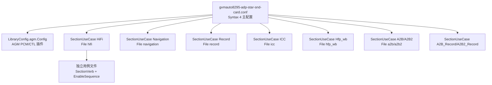

[← 16.7 ACDB校准数据（Android](16_16.7_ACDB校准数据Android与QNX双域共享.md) | [← 返回SA8295 Vendor+QNX双域音频架构深度解析](README.md) | [返回导航](../README.md) | [16.9 auto-casa-xml配置 →](16_16.9_auto-casa-xml配置.md)

---

## 16.8 ALSA UCM配置

### 16.8.1 UCM概述

ALSA UCM(Use Case Manager)定义了SA8295声卡的音频用例配置。真实源码位于：

```
vendor/qcom/proprietary/mm-audio-auto/alsa-ucm/
├── sa8295-adp-star-snd-card/          # 原生 SA8295
├── auto8295-adp-star-snd-card/ucm-conf/
├── gvmauto8295-adp-star-snd-card/ucm-conf/   # GVM(Android on Hypervisor)变体
└── lxc-sa8295-adp-star-snd-card/      # LXC 容器变体
```

> **重大澄清（本机源码核实）**：
> 1. UCM 语法版本为 **`Syntax 4`**（本知识库旧版误写 `Syntax 2`）。
> 2. 真实 UCM 采用**主配置文件 + 独立用例文件**的分层结构：主 `*.conf` 只用 `SectionUseCase."X" { File "x" }` 做索引，具体 EnableSequence 分散在同目录的独立文件（`hifi`/`navigation`/`record`/`icc`/`hfp_wb`/`a2b` 等）中。旧版把所有 `cset` 内联在主 conf 里的写法**不符合真实结构**。
> 3. Syntax 4 头部含 **`LibraryConfig.agm.Config`** 块（AGM PCM/CTL 插件声明），播放/录音 PCM 通过 **`agm:CARD,DEV`** 引用（如 `agm:1,0`），并非 `hw:0`。



### 16.8.2 主配置文件结构

真实主配置（`gvmauto8295-adp-star-snd-card.conf`）：

```
Syntax 4

LibraryConfig.agm.Config {
    pcm.agm {
        @args [ CARD DEV ]
        @args.CARD { type integer default 1 }
        @args.DEV  { type integer default 0 }
        type agm
        card $CARD
        device $DEV
    }
    ctl.agm {
        type agm
        card 1
    }
}

SectionUseCase."HiFi"        { File "hifi" }
SectionUseCase."Navigation"  { File "navigation" }
SectionUseCase."Record"      { File "record" }
SectionUseCase."ICC"         { File "icc" }
SectionUseCase."Hfp_wb"      { File "hfp_wb" }
SectionUseCase."A2B"         { File "a2b" }
SectionUseCase."A2B2"        { File "a2b2" }
SectionUseCase."A2B_Record"  { File "a2b_record" }
SectionUseCase."A2B2_Record" { File "a2b2_record" }
```

> **说明**：GVM 变体用例集为 HiFi / Navigation / Record / ICC / Hfp_wb / A2B / A2B2 / A2B_Record / A2B2_Record。旧版列出的 `Hfp`(独立窄带)、`Icc_call` 名称**不存在**；A2B 系列（车载 A2B 总线音频）为真实核心用例，旧版**完全遗漏**。

### 16.8.3 独立用例文件结构

以 `hifi` 文件为例，真实结构是 `SectionVerb` + `SectionDevice` + `SectionModifier`，用 `EnableSequence[...]` / `DisableSequence[...]`（非旧版的 `Enable{}` / `Disable{}`）：

```
SectionVerb {
    EnableSequence [
        cdev "agm"
        cset "name='TDM-LPAIF-RX-PRIMARY rate ch fmt' 48000,8,2,1"
        cset "name='PCM0p control' ZERO"
        cset-tlv "name='PCM0p metadata' /etc/acdb-blob/hifi_Meta_stream.bin"
        cset-tlv "name='TDM-LPAIF-RX-PRIMARY metadata' /etc/acdb-blob/hifi_Meta_device.bin"
        cset "name='PCM0p control' TDM-LPAIF-RX-PRIMARY"
        cset-tlv "name='PCM0p metadata' /etc/acdb-blob/hifi_Meta_streamdevice.bin"
        cset "name='PCM0p connect' TDM-LPAIF-RX-PRIMARY"
    ]
    DisableSequence [ ]
    value {
        playbackPCM "agm:1,0"
    }
}

SectionDevice."Speaker" {
    EnableSequence  [ ]
    DisableSequence [ ]
    value { PlaybackChannels "6" }
}

SectionModifier."Record" {
    EnableSequence [
        cdev "agm"
        cset "name='TDM-LPAIF-TX-TERTIARY rate ch fmt' 48000,8,2,1"
        cset "name='PCM0c control' ZERO"
        cset-tlv "name='PCM0c metadata' /etc/acdb-blob/record_Meta_stream.bin"
        cset "name='PCM0c connect' TDM-LPAIF-TX-TERTIARY"
    ]
    value {
        CapturePCM "agm:1,100"
        CaptureRate "48000"
    }
}
```

> **重大澄清（本机源码核实）**：真实控件名是 **`TDM-LPAIF-RX-PRIMARY rate ch fmt`**（一次性设置 rate,ch,fmt,...）、**`PCM0p control` / `PCM0p connect` / `PCM0p metadata`**、`cdev "agm"`，并通过 `cset-tlv` 从 **`/etc/acdb-blob/*.bin`** 装载 AGM 图元数据 blob。旧版给出的 `TERT_TDM_RX_0 Audio Mixer MultiMedia1`、`MULTIMEDIA1 Format/Rate/Channels`、`hw:0` 等控件与设备名**均为臆造**，真实 AGM 架构下不存在这些 mixer 控件。

### 16.8.4 AGM PCM 引用与元数据 blob

- **PCM 引用**：播放/录音 PCM 均以 `agm:CARD,DEV` 形式引用（如 `agm:1,0` 播放、`agm:1,100` 录音），由 `LibraryConfig.agm.Config` 声明的 AGM ALSA 插件解析，而非直接 `hw:CARD,DEV`。
- **元数据 blob**：`cset-tlv "name='...metadata' /etc/acdb-blob/<usecase>_Meta_*.bin"` 用于把预生成的 AGM 图（stream/device/streamdevice）元数据推入内核 AGM 驱动，`*.bin` 由校准/构建流程生成，是二进制。

> **重大澄清**：旧版 16.8.6 描述的 `Instance ID Support = 1`、`hw:CARD,DEVICE,INSTANCE`、`multiple_mix_dsp` 等内容在 GVM SA8295 UCM 中**未发现对应配置**，属臆造，已删除。真实多流并发由 AGM 图与各 PCM 设备（PCM0p/PCM1p...）承载。

### 16.8.5 车载 A2B 用例

A2B(Automotive Audio Bus)是 SA8295 车机的核心音频总线，真实 UCM 提供成对用例：

| 用例文件 | 方向 | 说明 |
|----------|------|------|
| `a2b` / `a2b2` | 播放 | A2B 总线音频输出（两组独立链路） |
| `a2b_record` / `a2b2_record` | 录音 | A2B 总线音频输入 |

> A2B 用例结构同样为 `SectionVerb + EnableSequence`，通过对应 TDM/A2B 相关控件与 `agm:` PCM 引用连接。旧版章节完全未覆盖 A2B，与真实车载配置严重不符。

---

---

[← 16.7 ACDB校准数据（Android](16_16.7_ACDB校准数据Android与QNX双域共享.md) | [← 返回SA8295 Vendor+QNX双域音频架构深度解析](README.md) | [返回导航](../README.md) | [16.9 auto-casa-xml配置 →](16_16.9_auto-casa-xml配置.md)