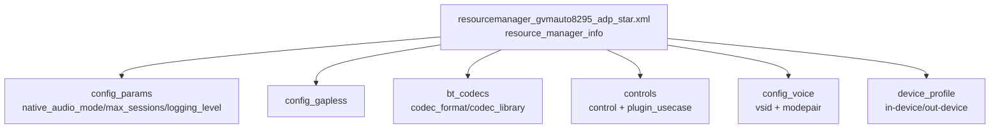

[← 16.8 ALSA UCM配置](16_16.8_ALSA_UCM配置.md) | [← 返回SA8295 Vendor+QNX双域音频架构深度解析](README.md) | [返回导航](../README.md) | [16.10 AGM(Audio Graph →](16_16.10_AGMAudio_Graph_Manager深度解.md)

---

## 16.9 auto-casa-xml配置

### 16.9.1 概述

`auto-casa-xml`是PAL(Platform Abstraction Layer)层的资源配置目录，真实源码位于：

```
vendor/qcom/proprietary/mm-audio-auto/auto-casa-xml/
├── resourcemanager_gvmauto8295_adp_star.xml   # GVM SA8295 主资源配置(788行)
├── resourcemanager_sa8155_adp_star.xml / _8155 / _6155 ...
├── hw_ep_info.xml         # 硬件端点信息
├── kvh2xml.xml            # KV(Key-Value)常量定义
├── usecaseKvManager.xml   # 用例→图KV映射
└── usecaseKvManager-dpk.xml
```

> **重大澄清（本机源码核实）**：
> 1. GVM SA8295 的资源配置是**单一文件** `resourcemanager_gvmauto8295_adp_star.xml`。根元素为 **`<resource_manager_info>`**（旧版误写 `<audio_platform_info>`），且 `bt_codecs`/`controls`/`device_profile`/`config_voice` 都是这一个文件内部的子节点，并非独立文件。
> 2. 旧版列出的 `acdb_id`、`max_aptx_sessions`/`max_aaaptx_sessions`、`plugin_control_id_t` C 枚举、`setControl` 示例、流类型→app_type→PCM 映射表**在本文件中均不存在**，属臆造，已删除。用例→图 KV 映射真实位于 `usecaseKvManager.xml`。



### 16.9.2 config_params 与 config_gapless

真实配置使用 `key=/value=` 属性：

```xml
<resource_manager_info>
    <config_params>
        <param key="native_audio_mode" value="multiple_mix_dsp"/>
        <param key="max_sessions" value="128"/>
        <param key="logging_level" value="3"/>
    </config_params>
    <config_gapless key="gapless_supported" value="1"/>
```

| 参数 | 真实值 | 说明 |
|------|--------|------|
| `native_audio_mode` | `multiple_mix_dsp` | DSP 端混音，支持多流并发 |
| `max_sessions` | `128` | 最大并发会话数 |
| `logging_level` | `3` | 日志级别 |
| `config_gapless` | `1` | 无缝播放支持 |

### 16.9.3 bt_codecs 蓝牙编解码器

真实用 `codec_format` + `codec_type` + `codec_library`（不是 `name`/`AUDIO_FORMAT_*`）：

```xml
<bt_codecs>
    <codec codec_format="CODEC_TYPE_AAC"           codec_type="enc|dec" codec_library="lib_bt_bundle.so"/>
    <codec codec_format="CODEC_TYPE_SBC"           codec_type="enc|dec" codec_library="lib_bt_bundle.so"/>
    <codec codec_format="CODEC_TYPE_LDAC"          codec_type="enc"     codec_library="lib_bt_bundle.so"/>
    <codec codec_format="CODEC_TYPE_APTX"          codec_type="enc"     codec_library="lib_bt_aptx.so"/>
    <codec codec_format="CODEC_TYPE_APTX_HD"       codec_type="enc"     codec_library="lib_bt_aptx.so"/>
    <codec codec_format="CODEC_TYPE_APTX_AD"       codec_type="enc"     codec_library="lib_bt_aptx.so"/>
    <codec codec_format="CODEC_TYPE_APTX_DUAL_MONO" codec_type="enc"    codec_library="lib_bt_aptx.so"/>
    <codec codec_format="CODEC_TYPE_APTX_AD_SPEECH" codec_type="enc|dec" codec_library="lib_bt_aptx.so"/>
</bt_codecs>
```

- `codec_type`：`enc`(仅编码，如 A2DP 发送)/`enc|dec`(编解码，如 SBC/AAC/AptX-AD-Speech 双向)。
- `codec_library`：动态加载的编解码库（`lib_bt_bundle.so` 或 `lib_bt_aptx.so`）。

### 16.9.4 controls 插件控制

真实结构是 `<control name= default= loadOnInit=>` + 内嵌 `<plugin>` + 若干 `<plugin_usecase type="PAL_STREAM_*"/>`，声明每个控制对哪些 PAL 流类型生效：

```xml
<controls>
    <control name="PLUGIN_CONTROL_VOLUME" default="lib_default_plugin_controls.so" loadOnInit="true">
        <plugin name="lib_default_plugin_controls.so" loadOnInit="true">
            <plugin_usecase type="PAL_STREAM_LOW_LATENCY"/>
            <plugin_usecase type="PAL_STREAM_DEEP_BUFFER"/>
            <plugin_usecase type="PAL_STREAM_COMPRESSED"/>
            <plugin_usecase type="PAL_STREAM_PLAYBACK_BUS"/>
        </plugin>
    </control>
    <control name="PLUGIN_CONTROL_VOLUME_BOOST" default="lib_default_plugin_controls.so" loadOnInit="true"/>
    <control name="PLUGIN_CONTROL_HD_VOICE"     default="lib_default_plugin_controls.so" loadOnInit="true"/>
    <control name="PLUGIN_CONTROL_AUDIO_BUFFER" default="lib_default_plugin_controls.so" loadOnInit="true"> ... </control>
    <control name="PLUGIN_CONTROL_AUDIO_LATENCY" default="lib_default_plugin_controls.so" loadOnInit="true"> ... </control>
</controls>
```

> **重大澄清**：真实控制名为 `PLUGIN_CONTROL_VOLUME` / `PLUGIN_CONTROL_VOLUME_BOOST` / `PLUGIN_CONTROL_HD_VOICE` / `PLUGIN_CONTROL_AUDIO_BUFFER` / `PLUGIN_CONTROL_AUDIO_LATENCY`，通过 `default` 指向 `.so` 插件并用 `plugin_usecase` 限定作用范围。旧版给出的 `id=0..4` 数字、`plugin_control_id_t` C 枚举、`setControl` C++ 示例**均为臆造**，源码中不存在。

### 16.9.5 config_voice 语音通话配置

真实 `vsid` 为元素文本，模式映射用 `<modepair key= value=>`：

```xml
<config_voice>
    <vsid>0xB3000000</vsid>
    <mode_map>
        <modepair key="0x11C05000" value="0xB3000001"/>
        <modepair key="0x11DC5000" value="0xB3000001"/>
        <modepair key="0x12006000" value="0xB3000001"/>
        <modepair key="0x121C6000" value="0xB3000001"/>
    </mode_map>
</config_voice>
```

> **重大澄清**：`modepair` 的 `key` 是调制模式标识，`value` 是对应 VSID(Voice Session ID)。旧版写的 `<mode name="NORMAL"/IN_CALL/RING>`、`<voice_device_map>` 均**不符合真实结构**，已删除。

### 16.9.6 device_profile 设备配置

真实结构用 `<in-device>` / `<out-device>`，每个设备含 `<id>` / `<back_end_name>` / `<channels>` / `<samplerate>` / `<bit_width>` / `<snd_device_name>`，并按 PAL 流类型给出 `<usecase>` 下的 `<devicePP-metadata><kvpair>`（设备后处理 KV，如 Fluence）：

```xml
<device_profile>
    <in-device>
        <id>PAL_DEVICE_IN_HANDSET_MIC</id>
        <back_end_name>TDM-LPAIF-TX-TERTIARY</back_end_name>
        <max_channels>8</max_channels>
        <channels>8</channels>
        <samplerate>48000</samplerate>
        <bit_width>16</bit_width>
        <snd_device_name>handset-mic</snd_device_name>
        <usecase>
            <name>PAL_STREAM_DEEP_BUFFER</name>
            <devicePP-metadata>
                <kvpair key="0xAD000000" value="0xAD000002"/>  <!-- AUDIO_FLUENCE_SMECNS -->
            </devicePP-metadata>
        </usecase>
        ...
    </in-device>

    <out-device>
        <id>PAL_DEVICE_OUT_SPEAKER</id>
        <back_end_name>TDM-LPAIF-RX-PRIMARY</back_end_name>
        <max_channels>8</max_channels>
        <channels>8</channels>
        <snd_device_name>speaker</snd_device_name>
        <speaker_protection_enabled>0</speaker_protection_enabled>
        <ras_enabled>0</ras_enabled>
        <speaker_mono_right>0</speaker_mono_right>
        <quick_cal_time>0</quick_cal_time>
    </out-device>
</device_profile>
```

> **重大澄清**：
> - **无 `acdb_id` 字段**——旧版给的 acdb_id=15/23/26/18/45 属臆造。设备到 ACDB 的关联由图元数据（KV）与 ACDB 数据本身承载。
> - 扬声器 `back_end_name` 真实为 **`TDM-LPAIF-RX-PRIMARY`**（旧版误写 `TDM-LPAIF-RX-TERTIARY`）。
> - `devicePP-metadata` 的 `kvpair` key/value 来自 `kvh2xml.h`，必须与之同步。

#### PAL设备与后端映射（真实节选）

| PAL设备ID | back_end_name | 通道 | snd_device_name |
|-----------|---------------|------|-----------------|
| PAL_DEVICE_IN_HANDSET_MIC | TDM-LPAIF-TX-TERTIARY | 8 | handset-mic |
| PAL_DEVICE_IN_USB_HEADSET | USB_AUDIO-TX | — | usb-headset-mic |
| PAL_DEVICE_IN_BLUETOOTH_A2DP | SLIM-DEV1-TX-7 | — | bt-a2dp |
| PAL_DEVICE_OUT_SPEAKER | TDM-LPAIF-RX-PRIMARY | 8 | speaker |
| PAL_DEVICE_OUT_A2B_SPKR | TDM-LPAIF_RXTX-RX-PRIMARY | 32 | a2bspeaker |
| PAL_DEVICE_OUT_A2B2_SPKR | TDM-LPAIF_VA-RX-PRIMARY | 32 | a2b2speaker |
| PAL_DEVICE_OUT_BLUETOOTH_SCO | TDM-LPAIF_WSA-RX-PRIMARY | — | bt-a2dp |
| PAL_DEVICE_OUT_HDMI / AUX_DIGITAL | (空) | — | display-port |

### 16.9.7 车载 A2B 设备

A2B(Automotive Audio Bus)是 SA8295 车机核心音频总线，真实提供两组 32 通道输出设备：

- `PAL_DEVICE_OUT_A2B_SPKR` → `TDM-LPAIF_RXTX-RX-PRIMARY`（32 通道）
- `PAL_DEVICE_OUT_A2B2_SPKR` → `TDM-LPAIF_VA-RX-PRIMARY`（32 通道）

> A2B 是车机多喇叭分区的关键，旧版章节**完全未覆盖**。相关播放用例在 UCM(见 16.8) 中以 `A2B`/`A2B2` 用例呈现，与此处设备对应。

---

---

[← 16.8 ALSA UCM配置](16_16.8_ALSA_UCM配置.md) | [← 返回SA8295 Vendor+QNX双域音频架构深度解析](README.md) | [返回导航](../README.md) | [16.10 AGM(Audio Graph →](16_16.10_AGMAudio_Graph_Manager深度解.md)