[← 上一个](16_16.1_QNX_audio_driver_vm_VM音频驱动层.md) | [← 返回16章](README.md) | [返回导航](../README.md) | [下一个 →](16_18.1_QNX_ams_lib_音频管理服务库.md)

---

## 16.17 audio_service_vm — QNX VM音频服务

### 16.17.1 概述

`audio_service_vm` 是SA8295 QNX域中的音频服务进程实例，运行在QNX Primary VM（PVM）用户态，作为QNX音频栈的**服务中枢**。它以独立守护进程形式由sysinit启动，负责初始化并协调QNX侧所有音频子系统的运行，包括驱动接口建立、ACDB校准数据加载、AMS音频管理服务初始化、GSL图管理器启动、CSD OEM库动态加载、VAPM策略回调注册等六大核心步骤。

在SA8295 Hypervisor虚拟化架构下，`audio_service_vm`承担着极其关键的角色：它既是QNX侧所有音频子系统有序启动的编排者，也是运行时各组件协同工作的协调中心。由于QNX是ADSP的唯一控制方（PVM），Android（GVM）的所有音频请求最终都需经MM-HAB跨VM通道到达QNX域，由本服务协调的底层子系统进行处理。当Android GVM崩溃时，本服务仍然独立运行，保障安全音频通路（倒车雷达、ADAS告警等）不受影响。

**架构定位**：

| 维度 | 说明 |
|------|------|
| 层级 | QNX音频栈服务层（用户态守护进程） |
| 运行域 | QNX PVM（Primary VM），Hypervisor隔离域0 |
| 进程类型 | QNX原生守护进程，由sysinit脚本启动 |
| 核心职责 | 音频子系统6步初始化编排、CSD OEM库动态加载、事件循环驱动、ADSP SSR恢复 |
| 与Android关系 | Android GVM无直接调用；音频请求经gsl_fe→MM-HAB→gsl_vm_be→audio_driver_vm→APRv2间接到达ADSP |
| 安全属性 | Android崩溃时本服务继续运行，安全音频通路完全独立 |
| 启动依赖 | 依赖audio_driver_vm驱动已加载、ADSP已就绪 |

**关键源文件**：

| 源文件 | 核心职责 |
|--------|----------|
| `main.c` | 服务入口，参数解析，事件循环，信号处理 |
| `coreinit.c` | 6步核心初始化编排，子系统依赖管理 |
| `csd_oem_lib_wrapper.c` | CSD OEM库动态加载/卸载封装 |
| `event_handler.c` | 事件分发与处理逻辑 |
| `ssr_handler.c` | ADSP Subsystem Restart恢复处理 |

**与其他QNX组件的关系**：

| 组件 | 交互方式 | 说明 |
|------|----------|------|
| audio_driver_vm | 设备节点open/ioctl | 初始化时打开驱动设备节点，创建APR端点 |
| ams_lib | 链接调用 | 初始化音频管理服务，注册硬件接口映射 |
| apr_lib | 链接调用 | 建立与ADSP的APR通信通道 |
| AGMAudio/SessionGsl | 链接调用 | 初始化图管理器，建立默认音频路由拓扑 |
| ACDB/acdb-loader | 链接调用 | 加载ACDB校准数据并推送到ADSP |
| auto-audiod | DBus/共享库 | QNX音频策略守护进程，协同SSR恢复 |
| VAPM | 内核接口 | 注册虚拟音频策略回调，参与跨VM策略仲裁 |

### 16.17.2 架构总览

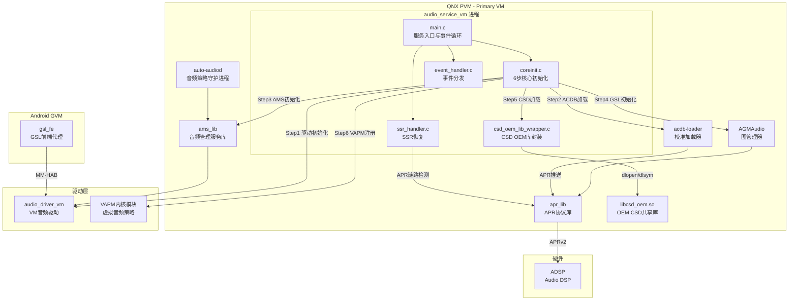

### 16.17.3 服务启动完整时序

#### 16.17.3.1 sysinit启动阶段

`audio_service_vm`由QNX的sysinit启动系统在适当的运行级别拉起。sysinit脚本的典型配置如下：

```
# /etc/system/sysinit.d/audio_services
# audio_service_vm 必须在 audio_driver_vm 加载之后启动
waitfor /dev/snd/audio_driver_vm 30
audio_service_vm -d -c /etc/audio/service_config.xml &
```

**启动依赖链**：

```mermaid
graph LR
    ADSP_Ready[ADSP固件加载完成] --> Driver_Load[audio_driver_vm<br/>驱动模块加载]
    Driver_Load --> Driver_Node[/dev/snd/audio_driver_vm<br/>设备节点就绪]
    Driver_Node --> Service_Start[audio_service_vm<br/>服务进程启动]
    Service_Start --> Core_Init[coreinit 6步初始化]
    Core_Init --> Auto_Audiod[auto-audiod<br/>策略守护进程就绪]
```

sysinit通过`waitfor`命令阻塞等待驱动设备节点出现，确保`audio_driver_vm`已完成初始化后再启动本服务。等待超时默认30秒，超时后服务仍会尝试启动但可能进入降级模式。

#### 16.17.3.2 main.c服务入口深度分析

`main.c`是`audio_service_vm`的入口点，其核心流程如下：

```c
// main.c 典型实现结构
int main(int argc, char *argv[])
{
    int ret = 0;
    int opt;
    bool daemon_mode = false;
    char *config_path = NULL;

    // 1. 解析命令行参数
    while ((opt = getopt(argc, argv, "dc:h")) != -1) {
        switch (opt) {
        case 'd':
            daemon_mode = true;       // 守护进程模式
            break;
        case 'c':
            config_path = optarg;     // 配置文件路径
            break;
        case 'h':
        default:
            print_usage(argv[0]);
            return (opt == 'h') ? 0 : -1;
        }
    }

    // 2. 守护进程化（如果指定-d选项）
    if (daemon_mode) {
        if (daemon(0, 0) < 0) {
            ALOGE("Failed to daemonize: %s", strerror(errno));
            return -errno;
        }
    }

    // 3. 打开日志系统
    openlog("audio_service_vm", LOG_PID | LOG_NDELAY, LOG_DAEMON);
    ALOGI("audio_service_vm starting, config=%s",
          config_path ? config_path : "default");

    // 4. 注册信号处理器
    signal(SIGTERM, sigterm_handler);
    signal(SIGINT,  sigint_handler);
    signal(SIGHUP,  sighup_handler);   // 配置重载

    // 5. 核心初始化（6步编排）
    ret = coreinit_init(config_path);
    if (ret < 0) {
        ALOGE("coreinit_init failed: %d, entering degraded mode", ret);
        // 不直接退出，进入降级模式
        // 降级模式下仅保持基本服务能力
    }

    // 6. 进入主事件循环
    ALOGI("Entering main event loop");
    ret = event_loop_run(&g_service_ctx);

    // 7. 优雅退出清理
    ALOGI("Event loop exited, cleaning up");
    coreinit_deinit();

    closelog();
    return ret;
}
```

**命令行参数详解**：

| 参数 | 说明 | 默认值 |
|------|------|--------|
| `-d` | 以守护进程模式运行（脱离终端） | 前台模式 |
| `-c <path>` | 指定配置文件路径 | `/etc/audio/service_config.xml` |
| `-h` | 显示帮助信息并退出 | - |

**信号处理**：

| 信号 | 处理方式 | 说明 |
|------|----------|------|
| SIGTERM | 设置退出标志，事件循环优雅退出 | sysinit停止服务时发送 |
| SIGINT | 设置退出标志，事件循环优雅退出 | 调试时Ctrl+C触发 |
| SIGHUP | 触发配置重载 | 修改配置后发送此信号可热加载 |

#### 16.17.3.3 启动时序图

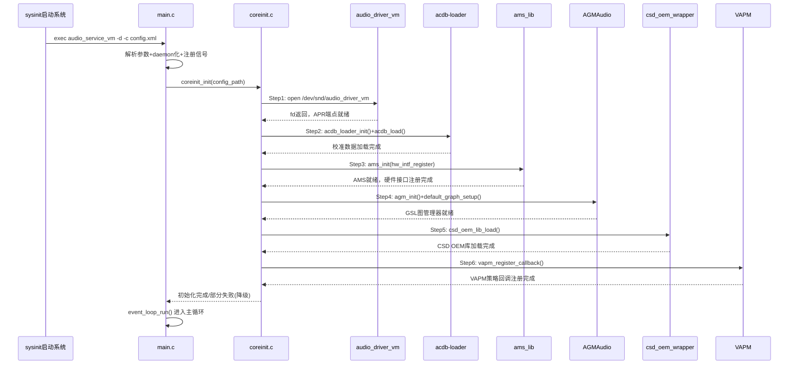

### 16.17.4 coreinit.c — 6步核心初始化深度解析

`coreinit.c`是`audio_service_vm`的核心初始化编排器，按照严格的依赖顺序完成6个初始化步骤。每一步都有明确的成功/失败处理策略，确保部分初始化失败不会导致整个服务崩溃。

#### 16.17.4.1 Step1: 驱动初始化

驱动初始化是整个音频服务的基础，负责打开`audio_driver_vm`设备节点并建立与ADSP的通信通道。

```c
// coreinit.c - Step1 驱动初始化
static int coreinit_driver_init(core_ctx_t *ctx)
{
    int fd;
    int ret;

    // 1.1 打开audio_driver_vm设备节点
    fd = open(AUDIO_DRIVER_VM_DEVICE, O_RDWR);
    if (fd < 0) {
        ALOGE("Failed to open %s: %s", AUDIO_DRIVER_VM_DEVICE,
              strerror(errno));
        // 重试机制：最多重试3次，每次间隔1秒
        for (int i = 0; i < DRIVER_OPEN_RETRY; i++) {
            sleep(1);
            fd = open(AUDIO_DRIVER_VM_DEVICE, O_RDWR);
            if (fd >= 0) break;
        }
        if (fd < 0) return -ENODEV;
    }
    ctx->driver_fd = fd;

    // 1.2 通过ioctl获取驱动版本，验证兼容性
    struct audio_driver_version ver;
    ret = ioctl(fd, AUDIO_DRV_GET_VERSION, &ver);
    if (ret < 0) {
        ALOGE("Failed to get driver version: %s", strerror(errno));
        close(fd);
        return -EIO;
    }

    // 1.3 检查版本兼容性
    if (ver.major != AUDIO_DRV_MAJOR_VERSION) {
        ALOGE("Driver version mismatch: expected %d, got %d",
              AUDIO_DRV_MAJOR_VERSION, ver.major);
        close(fd);
        return -EINVAL;
    }

    // 1.4 创建APR服务端点
    ret = apr_lib_init(&ctx->apr_handle);
    if (ret < 0) {
        ALOGE("APR init failed: %d", ret);
        close(fd);
        return ret;
    }

    // 1.5 注册APR回调（用于接收ADSP事件通知）
    ret = apr_register_callback(ctx->apr_handle,
                                 APR_SERVICE_AUDIO,
                                 apr_event_callback,
                                 ctx);
    if (ret < 0) {
        ALOGE("APR callback register failed: %d", ret);
        apr_lib_deinit(ctx->apr_handle);
        close(fd);
        return ret;
    }

    ALOGI("Driver init success, fd=%d, drv_ver=%d.%d.%d",
          fd, ver.major, ver.minor, ver.patch);
    return 0;
}
```

**驱动初始化关键点**：

| 要点 | 说明 |
|------|------|
| 设备节点路径 | `/dev/snd/audio_driver_vm` |
| 打开重试 | 最多3次，间隔1秒，应对驱动加载延迟 |
| 版本校验 | 主版本号必须匹配，防止驱动/服务不兼容 |
| APR端点 | 通过apr_lib建立与ADSP的可靠消息通道 |
| 回调注册 | 注册APR事件回调，用于接收SSR等ADSP通知 |

#### 16.17.4.2 Step2: ACDB校准数据加载

ACDB校准数据是ADSP正确处理音频信号的前提，包含各音频设备的增益、滤波器系数、延迟补偿等参数。

```c
// coreinit.c - Step2 ACDB校准加载
static int coreinit_acdb_load(core_ctx_t *ctx)
{
    int ret;

    // 2.1 初始化ACDB加载器
    ret = acdb_loader_init();
    if (ret < 0) {
        ALOGE("acdb_loader_init failed: %d", ret);
        return ret;
    }

    // 2.2 加载ACDB文件（从配置文件获取路径）
    const char *acdb_path = ctx->config->acdb_file_path;
    if (acdb_path == NULL) {
        acdb_path = DEFAULT_ACDB_PATH;  // /etc/audio/acdb/QRDB.acdb
    }

    ret = acdb_loader_load_file(acdb_path);
    if (ret < 0) {
        ALOGE("Failed to load ACDB from %s: %d", acdb_path, ret);
        // 降级策略：尝试加载默认校准数据
        ret = acdb_loader_load_file(DEFAULT_ACDB_PATH);
        if (ret < 0) {
            ALOGW("Default ACDB also failed, using fallback calibration");
            ctx->acdb_loaded = false;
            return 0;  // 不返回错误，允许降级运行
        }
    }

    // 2.3 将校准数据推送到ADSP各服务
    ret = acdb_loader_push_to_adsp(ACDB_TARGET_APM);  // 推送到APM
    if (ret < 0) {
        ALOGW("Failed to push ACDB to APM: %d", ret);
    }

    ret = acdb_loader_push_to_adsp(ACDB_TARGET_GSL);  // 推送到GSL
    if (ret < 0) {
        ALOGW("Failed to push ACDB to GSL: %d", ret);
    }

    ret = acdb_loader_push_to_adsp(ACDB_TARGET_ADIE); // 推送到ADIE
    if (ret < 0) {
        ALOGW("Failed to push ACDB to ADIE: %d", ret);
    }

    ctx->acdb_loaded = true;
    ALOGI("ACDB loaded successfully from %s", acdb_path);
    return 0;
}
```

**ACDB加载降级策略**：

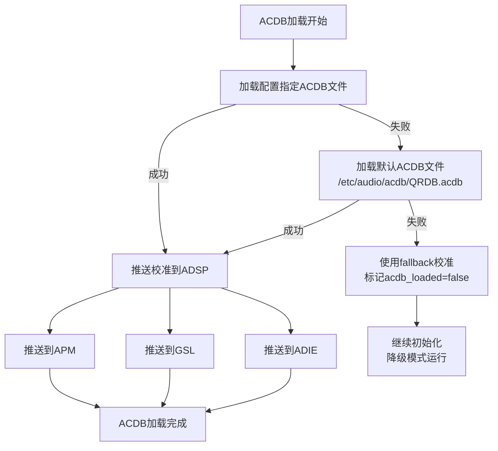

#### 16.17.4.3 Step3: AMS初始化

AMS（Audio Management Service）初始化负责建立音频管理服务框架，注册硬件接口映射表。

```c
// coreinit.c - Step3 AMS初始化
static int coreinit_ams_init(core_ctx_t *ctx)
{
    int ret;
    struct ams_init_params params;

    // 3.1 构建AMS初始化参数
    memset(&params, 0, sizeof(params));
    params.driver_fd = ctx->driver_fd;
    params.apr_handle = ctx->apr_handle;
    params.hw_intf_count = ctx->config->hw_intf_count;
    params.hw_intf_table = ctx->config->hw_intf_table;

    // 3.2 初始化AMS核心
    ret = ams_init(&params);
    if (ret < 0) {
        ALOGE("ams_init failed: %d", ret);
        return ret;
    }

    // 3.3 注册硬件接口（TDM/MI2S/PDM等）
    for (int i = 0; i < params.hw_intf_count; i++) {
        ret = ams_register_hw_intf(&params.hw_intf_table[i]);
        if (ret < 0) {
            ALOGW("Failed to register hw intf %s: %d",
                  params.hw_intf_table[i].name, ret);
            continue;  // 单个接口失败不影响其他接口
        }
        ALOGI("Registered hw intf: %s (type=%d, id=%d)",
              params.hw_intf_table[i].name,
              params.hw_intf_table[i].type,
              params.hw_intf_table[i].id);
    }

    // 3.4 注册AMS事件回调
    ret = ams_register_event_cb(ams_event_callback, ctx);
    if (ret < 0) {
        ALOGW("AMS event callback registration failed: %d", ret);
    }

    ALOGI("AMS init success, %d hw interfaces registered",
          params.hw_intf_count);
    return 0;
}
```

**硬件接口注册表**：

| 接口类型 | 典型名称 | 说明 |
|----------|----------|------|
| TDM | TDM_RX_0, TDM_TX_0 | 时分复用数字音频接口 |
| MI2S | MI2S_RX, MI2S_TX | I2S数字音频接口 |
| PDM | PDM_TX | 脉冲密度调制接口（麦克风） |
| SLIMBUS | SLIM_RX, SLIM_TX | SLIMBus音频总线 |
| AFE_LOOPBACK | AFE_LOOPBACK_TX | AFE回环测试接口 |

#### 16.17.4.4 Step4: GSL图管理器初始化

GSL图管理器初始化建立AudioReach图管理框架，配置默认音频路由拓扑。

```c
// coreinit.c - Step4 GSL图管理器初始化
static int coreinit_gsl_init(core_ctx_t *ctx)
{
    int ret;
    struct agm_init_params agm_params;

    // 4.1 初始化AGMAudio图管理器
    memset(&agm_params, 0, sizeof(agm_params));
    agm_params.driver_fd = ctx->driver_fd;
    agm_params.acdb_loaded = ctx->acdb_loaded;
    agm_params.default_graph_xml = ctx->config->default_graph_xml;

    ret = agm_init(&agm_params);
    if (ret < 0) {
        ALOGE("AGMAudio init failed: %d", ret);
        return ret;
    }

    // 4.2 加载默认音频路由拓扑
    if (agm_params.default_graph_xml) {
        ret = agm_load_graph_topology(agm_params.default_graph_xml);
        if (ret < 0) {
            ALOGW("Default graph topology load failed: %d", ret);
            // 不返回错误，运行时按需创建图
        }
    }

    // 4.3 预加载常用音频模块（Codec/EC/NS等）
    ret = agm_preload_modules(PRELOAD_MODULE_SET_DEFAULT);
    if (ret < 0) {
        ALOGW("Module preload failed: %d, will load on-demand", ret);
    }

    ALOGI("GSL graph manager init success");
    return 0;
}
```

**GSL图管理器初始化要点**：

| 要点 | 说明 |
|------|------|
| AGM初始化 | 建立图管理器核心框架，关联驱动和ACDB状态 |
| 拓扑加载 | 从XML配置加载默认音频路由拓扑 |
| 模块预加载 | 预加载Codec/EC/NS等常用DSP模块，减少首次使用延迟 |
| 按需创建 | 拓扑加载失败时不阻塞，运行时按需动态创建图 |

#### 16.17.4.5 Step5: CSD OEM库加载

CSD（Core Service Device）OEM库是平台特定的音频处理逻辑封装，由OEM厂商提供，通过动态加载机制注入。

```c
// coreinit.c - Step5 CSD OEM库加载
static int coreinit_csd_init(core_ctx_t *ctx)
{
    int ret;

    // 5.1 通过wrapper加载CSD OEM库
    ret = csd_oem_lib_load(&ctx->csd_handle);
    if (ret < 0) {
        ALOGW("CSD OEM lib load failed: %d, using default impl", ret);
        ctx->csd_handle = NULL;
        // 不返回错误，使用默认CSD实现
        return 0;
    }

    // 5.2 初始化CSD设备
    ret = csd_oem_lib_open(ctx->csd_handle);
    if (ret < 0) {
        ALOGW("CSD open failed: %d", ret);
        csd_oem_lib_unload(ctx->csd_handle);
        ctx->csd_handle = NULL;
        return 0;
    }

    ALOGI("CSD OEM lib loaded and opened successfully");
    return 0;
}
```

CSD OEM库的详细加载机制将在16.17.6节深入分析。

#### 16.17.4.6 Step6: VAPM策略回调注册

VAPM（Virtual Audio Policy Manager）策略回调注册使`audio_service_vm`能够参与跨VM音频策略仲裁。

```c
// coreinit.c - Step6 VAPM策略回调注册
static int coreinit_vapm_register(core_ctx_t *ctx)
{
    int ret;
    struct vapm_callbacks cbs;

    // 6.1 构建VAPM回调函数表
    memset(&cbs, 0, sizeof(cbs));
    cbs.on_policy_change = vapm_policy_change_cb;
    cbs.on_stream_route  = vapm_stream_route_cb;
    cbs.on_focus_update  = vapm_focus_update_cb;
    cbs.on_device_switch = vapm_device_switch_cb;
    cbs.context = ctx;

    // 6.2 通过驱动接口注册到VAPM内核模块
    ret = ioctl(ctx->driver_fd, AUDIO_DRV_VAPM_REGISTER, &cbs);
    if (ret < 0) {
        ALOGW("VAPM callback register failed: %d", ret);
        // 降级：VAPM不注册时，QNX域仍可独立工作
        // 但无法参与跨VM策略仲裁
        ctx->vapm_registered = false;
        return 0;
    }

    ctx->vapm_registered = true;
    ALOGI("VAPM policy callbacks registered successfully");
    return 0;
}
```

**VAPM回调接口**：

| 回调函数 | 触发时机 | 说明 |
|----------|----------|------|
| `on_policy_change` | 跨VM音频策略变更 | 如Android请求变更音频策略 |
| `on_stream_route` | 音频流路由变更 | 如新流打开/关闭触发路由重算 |
| `on_focus_update` | 音频焦点变化 | 跨VM焦点仲裁结果通知 |
| `on_device_switch` | 输出设备切换 | 如USB耳机插入触发设备切换 |

#### 16.17.4.7 6步初始化完整编排

```c
// coreinit.c - 6步初始化编排主函数
int coreinit_init(const char *config_path)
{
    int ret;
    core_ctx_t *ctx = &g_core_ctx;

    // 0. 加载配置文件
    ret = config_load(config_path, &ctx->config);
    if (ret < 0) {
        ALOGE("Config load failed from %s", config_path);
        return ret;
    }

    // Step1: 驱动初始化（关键步骤，失败则直接返回）
    ret = coreinit_driver_init(ctx);
    if (ret < 0) {
        ALOGE("CRITICAL: Driver init failed, cannot continue");
        return ret;
    }

    // Step2: ACDB校准加载（可降级）
    ret = coreinit_acdb_load(ctx);
    // 注意：ACDB加载失败不阻塞，降级继续

    // Step3: AMS初始化（关键步骤）
    ret = coreinit_ams_init(ctx);
    if (ret < 0) {
        ALOGE("AMS init failed: %d", ret);
        goto err_driver_cleanup;
    }

    // Step4: GSL图管理器初始化（关键步骤）
    ret = coreinit_gsl_init(ctx);
    if (ret < 0) {
        ALOGE("GSL init failed: %d", ret);
        goto err_ams_cleanup;
    }

    // Step5: CSD OEM库加载（可降级）
    ret = coreinit_csd_init(ctx);
    // 注意：CSD加载失败使用默认实现

    // Step6: VAPM策略回调注册（可降级）
    ret = coreinit_vapm_register(ctx);
    // 注意：VAPM注册失败不影响QNX独立工作

    ALOGI("coreinit completed, degraded=%d",
          !ctx->acdb_loaded || !ctx->csd_handle || !ctx->vapm_registered);
    return 0;

err_ams_cleanup:
    ams_deinit();
err_driver_cleanup:
    apr_lib_deinit(ctx->apr_handle);
    close(ctx->driver_fd);
    return ret;
}
```

**初始化步骤依赖与降级策略总结**：

| 步骤 | 是否可降级 | 失败后果 | 降级行为 |
|------|------------|----------|----------|
| Step1 驱动初始化 | 不可降级 | 无法与ADSP通信 | 直接返回错误 |
| Step2 ACDB加载 | 可降级 | 音频处理使用默认参数 | 标记acdb_loaded=false |
| Step3 AMS初始化 | 不可降级 | 无法管理音频图和硬件 | 回滚清理并返回错误 |
| Step4 GSL初始化 | 不可降级 | 无法创建音频路由图 | 回滚清理并返回错误 |
| Step5 CSD加载 | 可降级 | 无OEM特定音频处理 | 使用默认CSD实现 |
| Step6 VAPM注册 | 可降级 | 无法参与跨VM策略仲裁 | QNX独立运行，无跨VM协调 |

### 16.17.5 CSD OEM库动态加载机制深度分析

#### 16.17.5.1 CSD OEM库架构角色

CSD（Core Service Device）OEM库是高通平台为OEM厂商预留的平台特定音频处理扩展点。OEM厂商可以在此库中实现自定义的音频设备控制逻辑，如自定义功放控制序列、特殊音频通路切换、平台特定的DSP参数配置等。`csd_oem_lib_wrapper.c`封装了该库的完整生命周期管理。

**CSD OEM库设计原则**：

| 原则 | 说明 |
|------|------|
| 松耦合 | 通过动态加载而非编译时链接，OEM库可选 |
| 接口统一 | 提供标准化的CSD接口函数表，OEM实现固定签名 |
| 降级容错 | OEM库缺失或加载失败时回退到默认实现 |
| 热更新 | 支持运行时通过SIGHUP重载配置和CSD库 |

#### 16.17.5.2 dlopen/dlsym/dlclose完整流程

```c
// csd_oem_lib_wrapper.c - 动态加载核心实现

#define CSD_OEM_LIB_PATH    "/usr/lib/libcsd_oem.so"
#define CSD_OEM_ALT_PATH    "/usr/lib/audio/libcsd_oem.so"

// CSD OEM库标准接口函数签名
typedef int (*csd_open_t)(void);
typedef int (*csd_close_t)(void);
typedef int (*csd_enable_device_t)(csd_device_t device, uint32_t acdb_id);
typedef int (*csd_disable_device_t)(csd_device_t device, uint32_t acdb_id);
typedef int (*csd_start_voice_t)(uint32_t vsid, uint32_t acdb_id);
typedef int (*csd_stop_voice_t)(uint32_t vsid);
typedef int (*csd_set_volume_t)(csd_device_t device, int volume);
typedef int (*csd_mic_mute_t)(bool mute);

// CSD OEM库句柄结构
struct csd_oem_handle {
    void *dl_handle;              // dlopen返回的句柄
    csd_open_t              csd_open;
    csd_close_t             csd_close;
    csd_enable_device_t     csd_enable_device;
    csd_disable_device_t    csd_disable_device;
    csd_start_voice_t       csd_start_voice;
    csd_stop_voice_t        csd_stop_voice;
    csd_set_volume_t        csd_set_volume;
    csd_mic_mute_t          csd_mic_mute;
};

int csd_oem_lib_load(struct csd_oem_handle **handle)
{
    struct csd_oem_handle *h;
    void *dl;

    // 1. 分配句柄结构
    h = calloc(1, sizeof(struct csd_oem_handle));
    if (!h) return -ENOMEM;

    // 2. 尝试dlopen - 优先路径
    dl = dlopen(CSD_OEM_LIB_PATH, RTLD_NOW);
    if (!dl) {
        ALOGW("dlopen %s failed: %s, trying alt path",
              CSD_OEM_LIB_PATH, dlerror());

        // 2.1 尝试备用路径
        dl = dlopen(CSD_OEM_ALT_PATH, RTLD_NOW);
        if (!dl) {
            ALOGW("dlopen %s also failed: %s, using default CSD",
                  CSD_OEM_ALT_PATH, dlerror());
            free(h);
            return -ENOENT;
        }
    }
    h->dl_handle = dl;

    // 3. 使用dlsym逐个解析符号
    h->csd_open = (csd_open_t)dlsym(dl, "csd_open");
    if (!h->csd_open) {
        ALOGE("Required symbol csd_open not found");
        goto err_dlclose;
    }

    h->csd_close = (csd_close_t)dlsym(dl, "csd_close");
    if (!h->csd_close) {
        ALOGE("Required symbol csd_close not found");
        goto err_dlclose;
    }

    // 可选符号 - 不存在时使用默认实现
    h->csd_enable_device = (csd_enable_device_t)dlsym(dl, "csd_enable_device");
    if (!h->csd_enable_device) {
        ALOGI("Optional csd_enable_device not found, using default");
        h->csd_enable_device = csd_default_enable_device;
    }

    h->csd_disable_device = (csd_disable_device_t)dlsym(dl, "csd_disable_device");
    if (!h->csd_disable_device) {
        h->csd_disable_device = csd_default_disable_device;
    }

    h->csd_start_voice = (csd_start_voice_t)dlsym(dl, "csd_start_voice");
    h->csd_stop_voice = (csd_stop_voice_t)dlsym(dl, "csd_stop_voice");
    h->csd_set_volume = (csd_set_volume_t)dlsym(dl, "csd_set_volume");
    h->csd_mic_mute = (csd_mic_mute_t)dlsym(dl, "csd_mic_mute");

    *handle = h;
    ALOGI("CSD OEM lib loaded from %s", dl ? CSD_OEM_LIB_PATH : CSD_OEM_ALT_PATH);
    return 0;

err_dlclose:
    dlclose(dl);
    free(h);
    return -ESRCH;
}

int csd_oem_lib_unload(struct csd_oem_handle *handle)
{
    if (!handle) return -EINVAL;

    // 1. 调用OEM的close接口
    if (handle->csd_close) {
        handle->csd_close();
    }

    // 2. dlclose卸载共享库
    if (handle->dl_handle) {
        dlclose(handle->dl_handle);
    }

    // 3. 释放句柄
    free(handle);
    ALOGI("CSD OEM lib unloaded");
    return 0;
}
```

**dlopen/dlsym/dlclose流程图**：

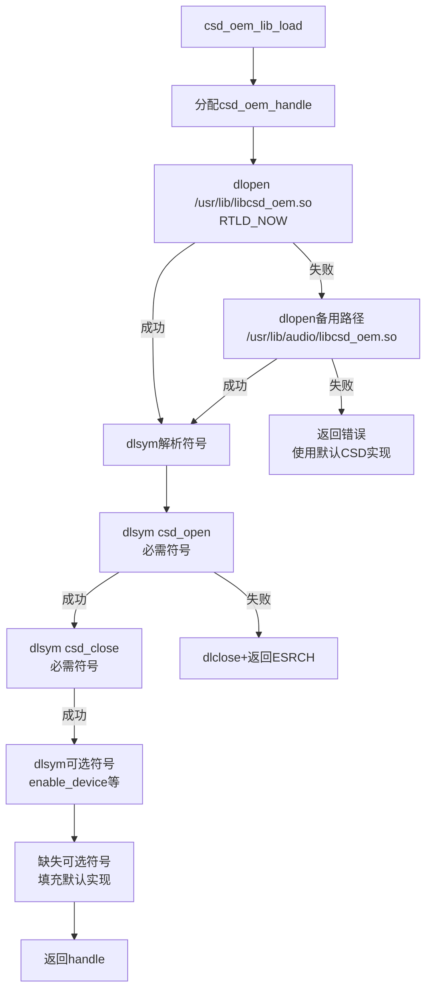

#### 16.17.5.3 CSD接口函数表

| 函数 | 必需/可选 | 说明 |
|------|-----------|------|
| `csd_open()` | 必需 | 初始化CSD设备，打开硬件控制接口 |
| `csd_close()` | 必需 | 关闭CSD设备，释放硬件资源 |
| `csd_enable_device(device, acdb_id)` | 可选 | 启用指定音频设备，加载对应ACDB校准 |
| `csd_disable_device(device, acdb_id)` | 可选 | 禁用指定音频设备 |
| `csd_start_voice(vsid, acdb_id)` | 可选 | 启动语音通话，配置VSID和校准 |
| `csd_stop_voice(vsid)` | 可选 | 停止语音通话 |
| `csd_set_volume(device, volume)` | 可选 | 设置设备音量 |
| `csd_mic_mute(mute)` | 可选 | 麦克风静音控制 |

### 16.17.6 事件循环机制

#### 16.17.6.1 事件循环架构

`audio_service_vm`的主事件循环是其运行时的核心驱动，采用poll多路复用模型监听多个事件源：

```c
// event_handler.c - 事件循环核心实现

#define MAX_POLL_FDS  16
#define EVENT_LOOP_TIMEOUT_MS  1000

struct event_loop_ctx {
    struct pollfd poll_fds[MAX_POLL_FDS];
    nfds_t poll_fd_count;
    bool running;
    core_ctx_t *core_ctx;
};

int event_loop_run(core_ctx_t *core_ctx)
{
    struct event_loop_ctx loop;
    int ret;

    memset(&loop, 0, sizeof(loop));
    loop.core_ctx = core_ctx;
    loop.running = true;

    // 1. 注册各事件源的fd
    event_loop_register_sources(&loop, core_ctx);

    ALOGI("Event loop started, monitoring %d fds", loop.poll_fd_count);

    // 2. 主循环
    while (loop.running) {
        ret = poll(loop.poll_fds, loop.poll_fd_count,
                   EVENT_LOOP_TIMEOUT_MS);
        if (ret < 0) {
            if (errno == EINTR) continue;  // 被信号中断
            ALOGE("poll error: %s", strerror(errno));
            break;
        }

        // 3. 超时处理（定时任务）
        if (ret == 0) {
            event_loop_timeout_handler(&loop);
            continue;
        }

        // 4. 遍历就绪的fd并分发事件
        for (nfds_t i = 0; i < loop.poll_fd_count; i++) {
            if (loop.poll_fds[i].revents & (POLLIN | POLLHUP)) {
                event_loop_dispatch(&loop, i);
            }
        }
    }

    ALOGI("Event loop exited");
    return 0;
}
```

#### 16.17.6.2 事件源与分发

| 事件源 | fd来源 | 事件类型 | 处理函数 |
|--------|--------|----------|----------|
| APR消息 | apr_lib通道 | ADSP事件通知 | `apr_event_callback()` |
| Driver事件 | driver_fd | 驱动层状态变更 | `driver_event_handler()` |
| VAPM策略 | vapm通知fd | 跨VM策略变更 | `vapm_policy_handler()` |
| DBus消息 | DBus连接 | auto-audiod通信 | `dbus_message_handler()` |
| 定时器 | timerfd | 周期性健康检查 | `health_check_handler()` |
| 信号管道 | self-pipe | 信号触发的异步处理 | `signal_pipe_handler()` |

**事件分发流程**：

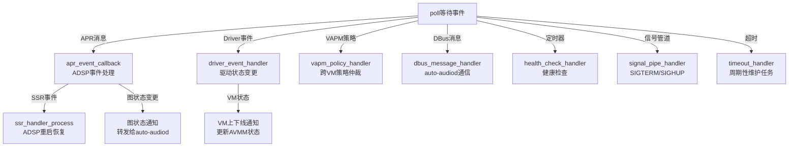

#### 16.17.6.3 信号处理的异步安全实现

信号处理函数中不能直接调用非异步安全函数（如ALOGI/pthread_mutex等），因此采用self-pipe技巧：

```c
// main.c - 信号处理与self-pipe
static int signal_pipe[2];  // [0]=读端, [1]=写端
static volatile sig_atomic_t g_exit_requested = 0;

void sigterm_handler(int sig)
{
    g_exit_requested = 1;
    // 向pipe写入信号编号，唤醒poll
    char sig_byte = (char)sig;
    write(signal_pipe[1], &sig_byte, 1);
}

void sighup_handler(int sig)
{
    // SIGHUP用于配置重载
    char sig_byte = (char)sig;
    write(signal_pipe[1], &sig_byte, 1);
}

// 事件循环中处理信号管道
void signal_pipe_handler(struct event_loop_ctx *loop, int fd)
{
    char sig_byte;
    read(fd, &sig_byte, 1);

    switch (sig_byte) {
    case SIGTERM:
    case SIGINT:
        ALOGI("Exit signal received, stopping event loop");
        loop->running = false;
        break;
    case SIGHUP:
        ALOGI("SIGHUP received, reloading config");
        config_reload(loop->core_ctx);
        break;
    }
}
```

### 16.17.7 与audio_driver_vm的交互接口详解

#### 16.17.7.1 交互接口总览

`audio_service_vm`与`audio_driver_vm`的交互通过设备文件描述符和ioctl命令完成，这是QNX用户态与内核驱动的标准通信方式。

| 交互类型 | 接口 | 说明 |
|----------|------|------|
| 设备打开 | `open("/dev/snd/audio_driver_vm", O_RDWR)` | 获取驱动fd |
| 版本查询 | `ioctl(fd, AUDIO_DRV_GET_VERSION, &ver)` | 获取驱动版本 |
| APR端点创建 | `ioctl(fd, AUDIO_DRV_APR_OPEN, &params)` | 创建APR通信端点 |
| APR消息发送 | `ioctl(fd, AUDIO_DRV_APR_SEND, &msg)` | 发送APR消息到ADSP |
| APR消息接收 | 通过poll+read | 接收ADSP返回消息 |
| VAPM注册 | `ioctl(fd, AUDIO_DRV_VAPM_REGISTER, &cbs)` | 注册策略回调 |
| AVMM状态查询 | `ioctl(fd, AUDIO_DRV_AVMM_GET_STATUS, &st)` | 查询VM音频状态 |
| SSR事件订阅 | `ioctl(fd, AUDIO_DRV_SSR_SUBSCRIBE, &sub)` | 订阅ADSP SSR事件 |

#### 16.17.7.2 APR消息收发流程

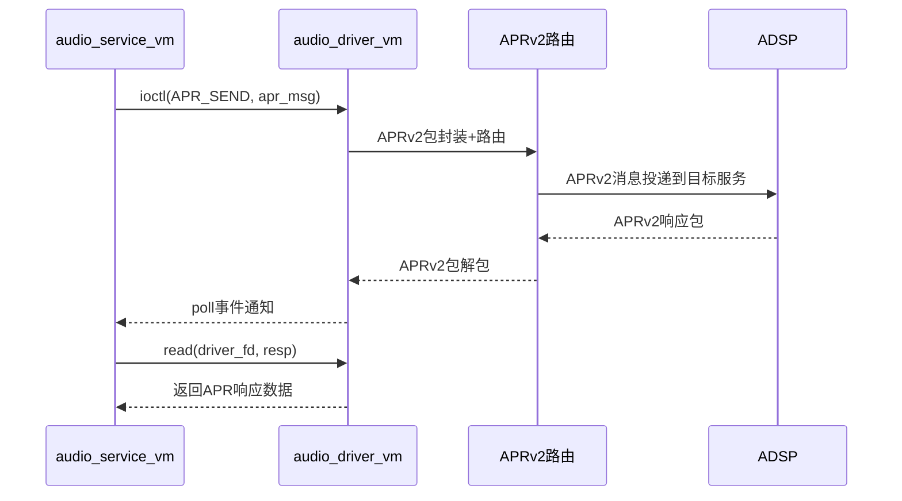

#### 16.17.7.3 交互场景分析

| 场景 | 触发方 | 接口调用 | 说明 |
|------|--------|----------|------|
| 服务初始化 | audio_service_vm | open+ioctl(APR_OPEN) | 建立APR通信通道 |
| 图操作 | ams_lib(通过服务) | ioctl(APR_SEND) | 发送图创建/连接/断开命令 |
| ACDB推送 | acdb-loader(通过服务) | ioctl(APR_SEND) | 发送校准数据到ADSP |
| SSR检测 | 驱动主动通知 | poll唤醒+read | ADSP重启事件通知 |
| VAPM仲裁 | VAPM内核模块 | ioctl回调触发 | 跨VM策略变更通知 |
| 设备切换 | auto-audiod(通过服务) | ioctl(APR_SEND) | 发送设备路由切换命令 |

### 16.17.8 ADSP SSR恢复流程

#### 16.17.8.1 SSR检测机制

ADSP Subsystem Restart（SSR）是SA8295平台的关键恢复机制。当ADSP发生异常重启时，`audio_service_vm`需要检测并协调所有音频子系统的恢复。

**SSR检测链路**：

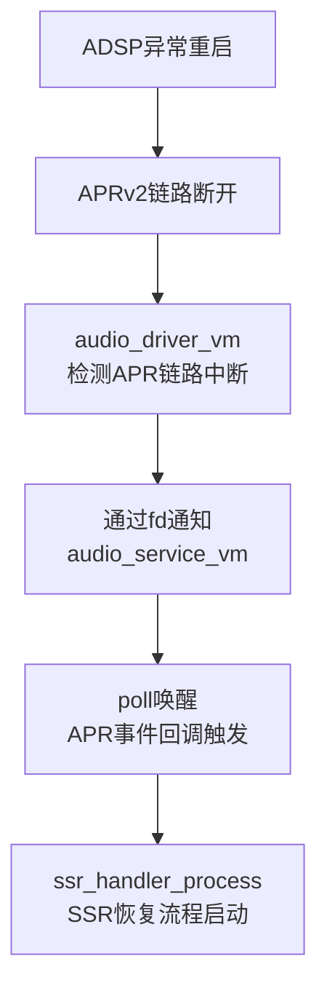

#### 16.17.8.2 SSR恢复时序

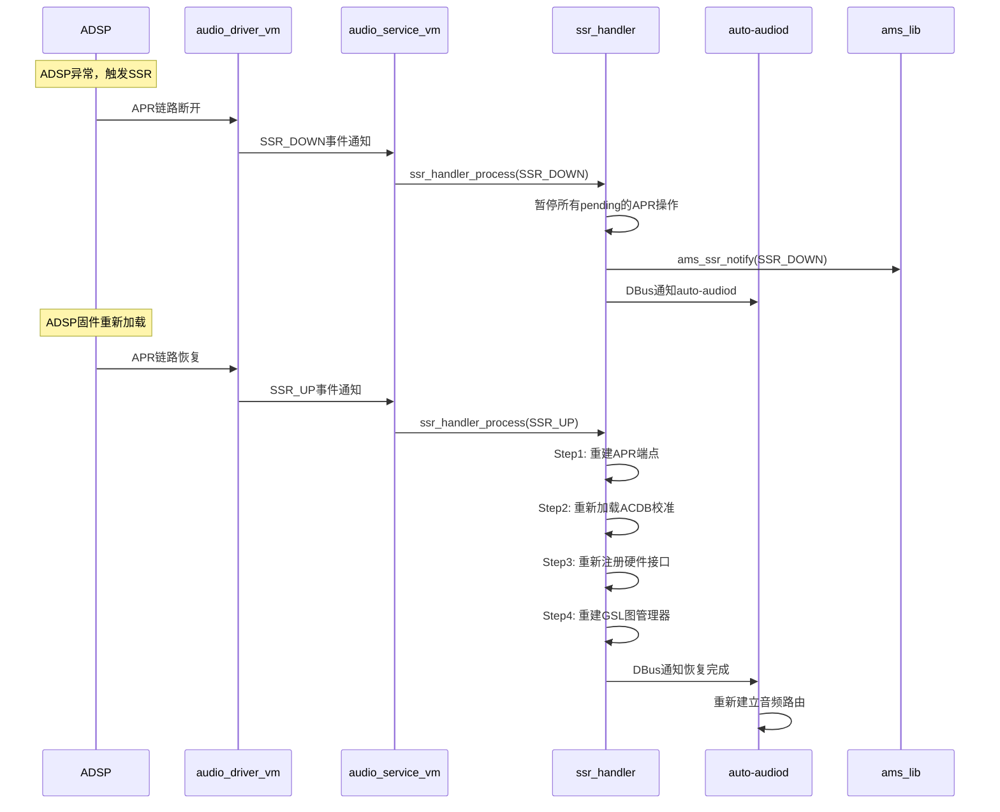

#### 16.17.8.3 SSR恢复代码框架

```c
// ssr_handler.c - SSR恢复核心逻辑

void ssr_handler_process(core_ctx_t *ctx, ssr_event_t event)
{
    switch (event) {
    case SSR_EVENT_DOWN:
        ALOGW("ADSP SSR DOWN detected");
        ctx->adsp_state = ADSP_STATE_DOWN;

        // 1. 暂停所有pending操作
        apr_lib_pause(ctx->apr_handle);

        // 2. 通知AMS
        ams_ssr_notify(AMS_SSR_DOWN);

        // 3. 通知auto-audiod（通过DBus）
        dbus_notify_ssr(DBUS_SSR_DOWN);

        // 4. 标记所有活跃图需要重建
        agm_mark_graphs_dirty();
        break;

    case SSR_EVENT_UP:
        ALOGI("ADSP SSR UP, starting recovery");
        ctx->adsp_state = ADSP_STATE_RECOVERING;

        // Step1: 重建APR端点
        if (apr_lib_reinit(ctx->apr_handle) < 0) {
            ALOGE("APR reinit failed during SSR recovery");
            ctx->adsp_state = ADSP_STATE_ERROR;
            return;
        }

        // Step2: 重新加载ACDB校准
        if (ctx->acdb_loaded) {
            acdb_loader_push_to_adsp(ACDB_TARGET_ALL);
        }

        // Step3: 重新注册硬件接口
        ams_ssr_notify(AMS_SSR_UP);

        // Step4: 重建GSL图管理器
        agm_ssr_recovery();

        // Step5: 通知auto-audiod恢复完成
        dbus_notify_ssr(DBUS_SSR_UP);

        ctx->adsp_state = ADSP_STATE_READY;
        ALOGI("ADSP SSR recovery completed");
        break;

    default:
        ALOGW("Unknown SSR event: %d", event);
    }
}
```

**SSR恢复步骤与超时管理**：

| 步骤 | 操作 | 最大超时 | 失败处理 |
|------|------|----------|----------|
| Step1 APR重建 | apr_lib_reinit | 5秒 | 重试3次后标记ERROR |
| Step2 ACDB重推 | acdb_loader_push_to_adsp | 10秒 | 降级继续 |
| Step3 AMS恢复 | ams_ssr_notify(UP) | 5秒 | 重试3次 |
| Step4 GSL重建 | agm_ssr_recovery | 15秒 | 重试3次后标记ERROR |
| Step5 通知完成 | dbus_notify_ssr(UP) | 2秒 | 仅记录日志 |

### 16.17.9 安全音频独立处理路径

#### 16.17.9.1 安全音频架构

在SA8295车载系统中，安全音频（倒车雷达、ADAS告警、仪表告警等）必须保证在任何情况下都能输出，即使Android GVM崩溃也不能影响。`audio_service_vm`作为QNX域的服务中枢，为安全音频提供了完全独立于Android的处理路径。

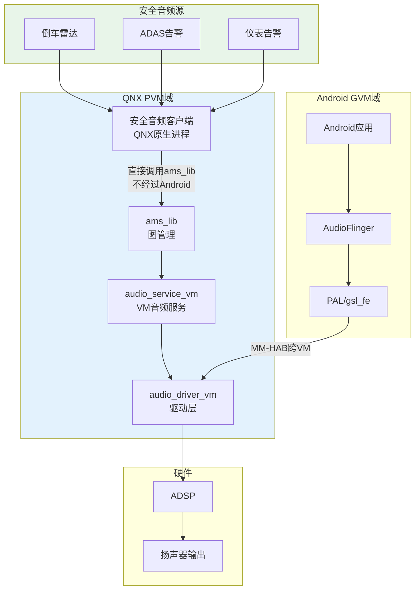

#### 16.17.9.2 安全音频与普通音频的隔离保障

| 隔离维度 | 实现机制 | 说明 |
|----------|----------|------|
| 进程隔离 | 安全音频客户端独立于Android进程 | QNX原生进程，不依赖Android运行时 |
| 图隔离 | 安全音频图独立于Android音频图 | 不同的GSL图实例，独立路由 |
| 通道隔离 | 使用专用APR端点 | 与Android的APR通道分离 |
| 优先级 | 安全音频图优先级高于普通音频 | ADSP中安全流抢占普通流 |
| VAPM保障 | 安全音频策略始终获得最高优先级 | 跨VM策略仲裁中安全音频优先 |

### 16.17.10 与Android域的完整交互链路

#### 16.17.10.1 Android音频请求处理全链路

```
Android App → AudioTrack → AudioFlinger → PAL
  → AGM Service → gsl_fe(libar-gsl_fe.so)
  → MM-HAB(habmm_socket) → gsl_vm_be(QNX)
  → AGMAudio → ams_lib → audio_driver_vm(AVMM)
  → APRv2 → ADSP → 物理输出
```

在此链路中，`audio_service_vm`的角色是：

1. **初始化保障**：确保gsl_vm_be所需的所有子系统（驱动、AMS、ACDB）已初始化
2. **SSR恢复**：ADSP重启时协调各子系统恢复，使gsl_vm_be能继续服务
3. **策略协调**：通过VAPM参与跨VM策略仲裁，处理Android域与QNX域的音频策略冲突
4. **健康监控**：定期检查各子系统状态，异常时主动恢复

#### 16.17.10.2 跨VM交互时序

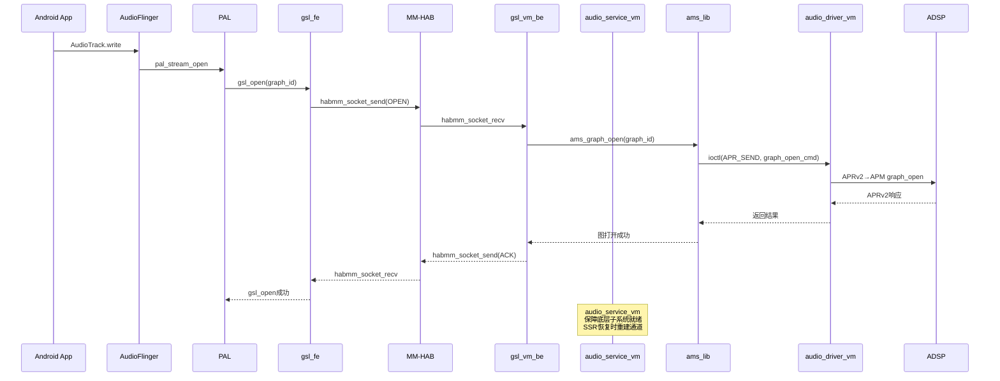

### 16.17.11 容错与降级机制

#### 16.17.11.1 降级层次模型

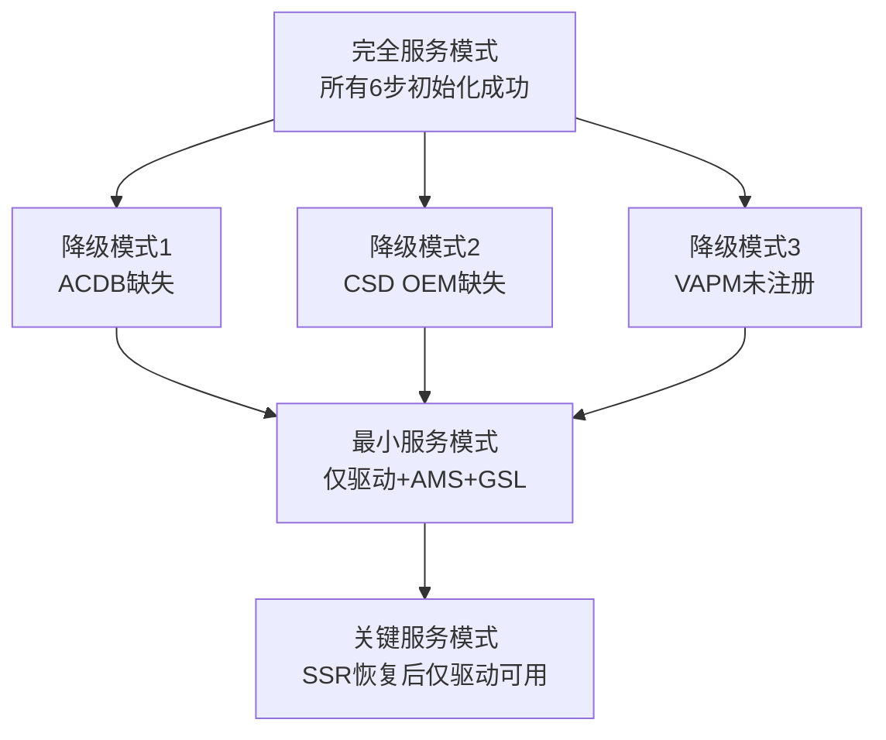

| 服务模式 | 可用功能 | 不可用功能 | 触发条件 |
|----------|----------|------------|----------|
| 完全服务 | 所有音频功能 | 无 | 6步初始化全部成功 |
| 降级模式1 | 基本音频 | 音质校准优化 | ACDB文件缺失/损坏 |
| 降级模式2 | 标准音频处理 | OEM自定义处理 | CSD OEM库缺失 |
| 降级模式3 | QNX独立音频 | 跨VM策略协调 | VAPM注册失败 |
| 最小服务 | 基本音频通路 | 校准+OEM+跨VM策略 | 多步降级叠加 |
| 关键服务 | 安全音频直通 | 其他所有 | SSR恢复部分失败 |

#### 16.17.11.2 关键场景容错表

| 故障场景 | 检测方式 | 恢复策略 | 最大恢复时间 |
|----------|----------|----------|-------------|
| ADSP重启 | APR链路断开事件 | SSR恢复5步流程 | 35秒 |
| Android GVM崩溃 | AVMM会话断开 | 清理GVM会话资源，QNX独立运行 | 即时 |
| ACDB文件损坏 | 加载返回错误 | 使用fallback校准数据 | 即时 |
| CSD OEM库缺失 | dlopen失败 | 使用默认CSD实现 | 即时 |
| 驱动设备节点丢失 | open返回ENOENT | 重试3次后退出 | 3秒 |
| APR消息超时 | poll超时+重试计数 | 重发或上报SSR | 10秒 |
| 配置文件语法错误 | XML解析失败 | 使用编译时默认值 | 即时 |
| VAPM内核模块异常 | ioctl返回错误 | 降级为QNX独立策略 | 即时 |

### 16.17.12 调试方法与日志

#### 16.17.12.1 日志级别与标签

| 标签 | 级别 | 说明 |
|------|------|------|
| `audio_service_vm` | INFO/ERROR | 服务主流程日志 |
| `audio_service_vm.coreinit` | INFO/DEBUG | 初始化步骤详细日志 |
| `audio_service_vm.csd` | INFO/WARN | CSD OEM库加载/调用日志 |
| `audio_service_vm.ssr` | WARN/ERROR | SSR恢复流程日志 |
| `audio_service_vm.event` | DEBUG | 事件循环调试日志 |

#### 16.17.12.2 关键调试点

```bash
# 1. 检查服务进程状态
pidin -p audio_service_vm

# 2. 查看驱动设备节点
ls -la /dev/snd/audio_driver_vm

# 3. 查看服务日志（QNX slog2）
slog2info -b | grep audio_service_vm

# 4. 查看APR连接状态
cat /proc/asound/apr_status

# 5. 查看ACDB加载状态
slog2info -b | grep "ACDB loaded"

# 6. 查看SSR历史记录
slog2info -b | grep "SSR"

# 7. 手动触发配置重载
kill -HUP $(pidin -p audio_service_vm | awk '{print $1}')

# 8. 检查CSD OEM库加载状态
slog2info -b | grep "CSD OEM"

# 9. 查看AVMM会话状态
cat /proc/asound/avmm_sessions
```

#### 16.17.12.3 常见问题诊断

| 症状 | 可能原因 | 诊断方法 |
|------|----------|----------|
| 服务启动失败 | 驱动未加载 | 检查`/dev/snd/audio_driver_vm`是否存在 |
| 无音频输出 | ACDB未加载 | 查看日志中`acdb_loaded`状态 |
| OEM功能异常 | CSD库缺失 | 检查`/usr/lib/libcsd_oem.so` |
| Android音频中断 | ADSP重启 | 查看SSR日志，确认恢复完成 |
| 跨VM策略不生效 | VAPM未注册 | 检查`vapm_registered`状态 |
| 服务卡死 | 事件循环阻塞 | 使用`pidin`查看线程状态 |

### 16.17.13 配置参数与启动选项

#### 16.17.13.1 配置文件结构

```xml
<!-- /etc/audio/service_config.xml -->
<audio_service_vm>
    <!-- 驱动配置 -->
    <driver>
        <device_path>/dev/snd/audio_driver_vm</device_path>
        <open_retry_count>3</open_retry_count>
        <open_retry_interval_ms>1000</open_retry_interval_ms>
    </driver>

    <!-- ACDB配置 -->
    <acdb>
        <acdb_file_path>/etc/audio/acdb/QRDB.acdb</acdb_file_path>
        <fallback_acdb_path>/etc/audio/acdb/fallback.acdb</fallback_acdb_path>
        <push_targets>APM,GSL,ADIE</push_targets>
    </acdb>

    <!-- AMS配置 -->
    <ams>
        <hw_intf_count>8</hw_intf_count>
        <hw_intf_table>/etc/audio/hw_intf_table.xml</hw_intf_table>
    </ams>

    <!-- GSL图管理器配置 -->
    <gsl>
        <default_graph_xml>/etc/audio/graph_topology.xml</default_graph_xml>
        <preload_modules>CODEC,EC,NS,AGC</preload_modules>
    </gsl>

    <!-- CSD OEM库配置 -->
    <csd>
        <oem_lib_path>/usr/lib/libcsd_oem.so</oem_lib_path>
        <alt_lib_path>/usr/lib/audio/libcsd_oem.so</alt_lib_path>
        <use_default_on_fail>true</use_default_on_fail>
    </csd>

    <!-- SSR恢复配置 -->
    <ssr>
        <apr_reinit_timeout_ms>5000</apr_reinit_timeout_ms>
        <acdb_push_timeout_ms>10000</acdb_push_timeout_ms>
        <graph_recovery_timeout_ms>15000</graph_recovery_timeout_ms>
        <max_recovery_retries>3</max_recovery_retries>
    </ssr>

    <!-- 事件循环配置 -->
    <event_loop>
        <poll_timeout_ms>1000</poll_timeout_ms>
        <health_check_interval_ms>5000</health_check_interval_ms>
    </event_loop>
</audio_service_vm>
```

#### 16.17.13.2 关键配置参数说明

| 参数 | 默认值 | 说明 |
|------|--------|------|
| `driver.open_retry_count` | 3 | 驱动设备节点打开重试次数 |
| `driver.open_retry_interval_ms` | 1000 | 重试间隔（毫秒） |
| `acdb.acdb_file_path` | /etc/audio/acdb/QRDB.acdb | 主ACDB文件路径 |
| `acdb.fallback_acdb_path` | /etc/audio/acdb/fallback.acdb | 备用ACDB文件路径 |
| `gsl.default_graph_xml` | /etc/audio/graph_topology.xml | 默认图拓扑配置 |
| `gsl.preload_modules` | CODEC,EC,NS,AGC | 预加载DSP模块集合 |
| `csd.oem_lib_path` | /usr/lib/libcsd_oem.so | CSD OEM库主路径 |
| `ssr.apr_reinit_timeout_ms` | 5000 | APR重建超时 |
| `ssr.max_recovery_retries` | 3 | SSR恢复最大重试次数 |
| `event_loop.poll_timeout_ms` | 1000 | 事件循环poll超时 |
| `event_loop.health_check_interval_ms` | 5000 | 健康检查间隔 |

### 16.17.14 源码路径参考

```
vendor/qcom/proprietary/audio_service_vm/
├── src/
│   ├── main.c                    # 服务主入口，参数解析，事件循环
│   ├── coreinit.c                # 6步核心初始化编排
│   ├── csd_oem_lib_wrapper.c     # CSD OEM库dlopen/dlsym封装
│   ├── event_handler.c           # 事件分发与处理
│   ├── ssr_handler.c             # ADSP SSR恢复处理
│   ├── config_parser.c           # XML配置文件解析
│   └── signal_handler.c          # 信号处理与self-pipe
├── inc/
│   ├── coreinit.h                # 核心初始化接口定义
│   ├── csd_oem_lib.h             # CSD OEM库接口定义
│   ├── event_handler.h           # 事件处理接口定义
│   ├── ssr_handler.h             # SSR恢复接口定义
│   └── service_config.h          # 配置结构定义
├── config/
│   └── service_config.xml        # 默认配置文件
├── Makefile                      # QNX构建配置
└── common.mk                     # 公共构建规则
```

### 16.17.15 总结

`audio_service_vm`是SA8295 QNX音频栈的服务中枢，其核心价值体现在以下方面：

1. **初始化编排**：通过coreinit.c的6步严格依赖初始化，确保QNX侧所有音频子系统有序启动，任何可降级步骤的失败都不会导致服务崩溃
2. **运行时协调**：通过poll多路复用事件循环，协调APR消息、驱动事件、VAPM策略、DBus通信等多源事件的处理
3. **CSD扩展**：通过dlopen/dlsym动态加载OEM特定CSD库，实现平台可扩展性，同时保证缺失时的降级容错
4. **SSR恢复**：完整的ADSP重启恢复流程，5步恢复确保音频子系统在ADSP异常后快速恢复
5. **安全隔离**：安全音频通路完全独立于Android，即使GVM崩溃也不影响倒车雷达等关键音频输出
6. **跨VM协同**：通过VAPM策略回调和MM-HAB通道，参与Android与QNX的跨VM音频策略仲裁

---

[← 上一个](16_16.1_QNX_audio_driver_vm_VM音频驱动层.md) | [← 返回16章](README.md) | [返回导航](../README.md) | [下一个 →](16_18.1_QNX_ams_lib_音频管理服务库.md)]