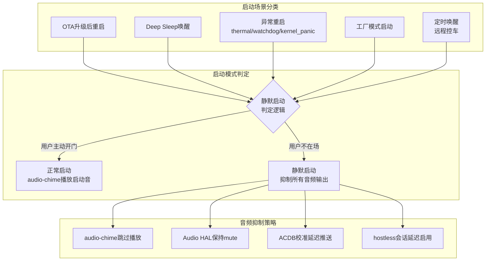
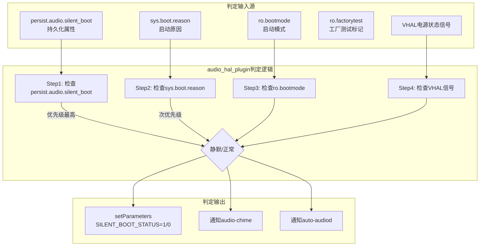
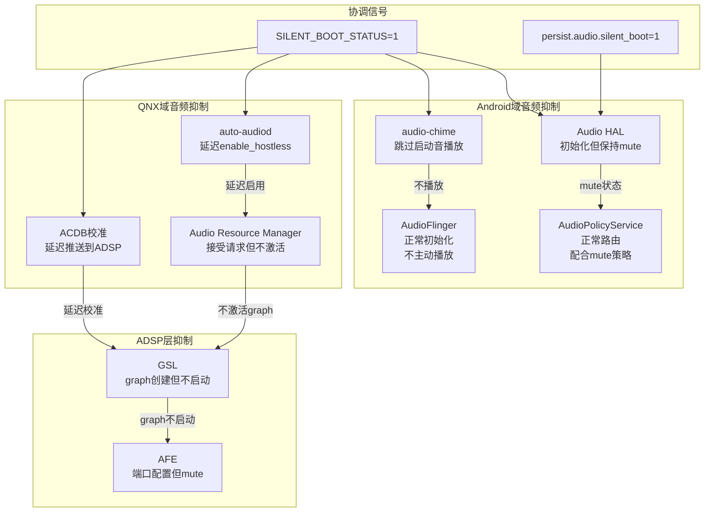
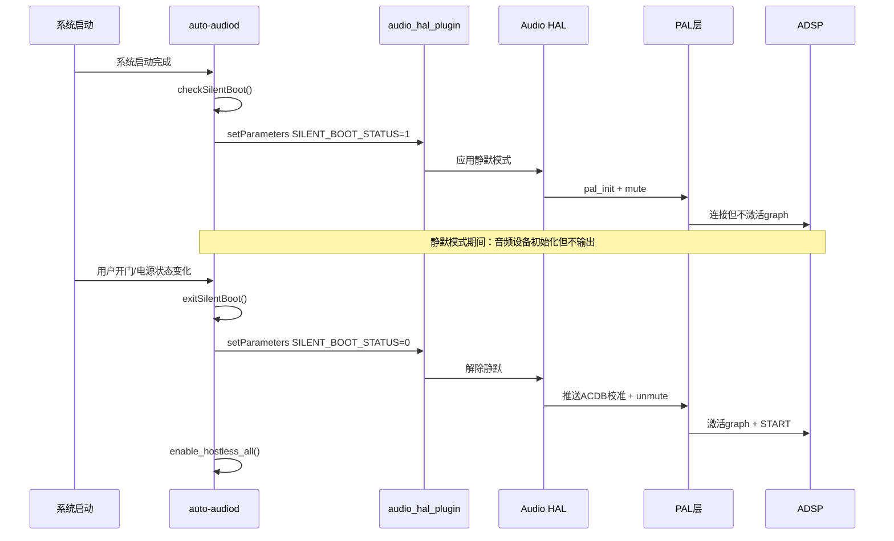
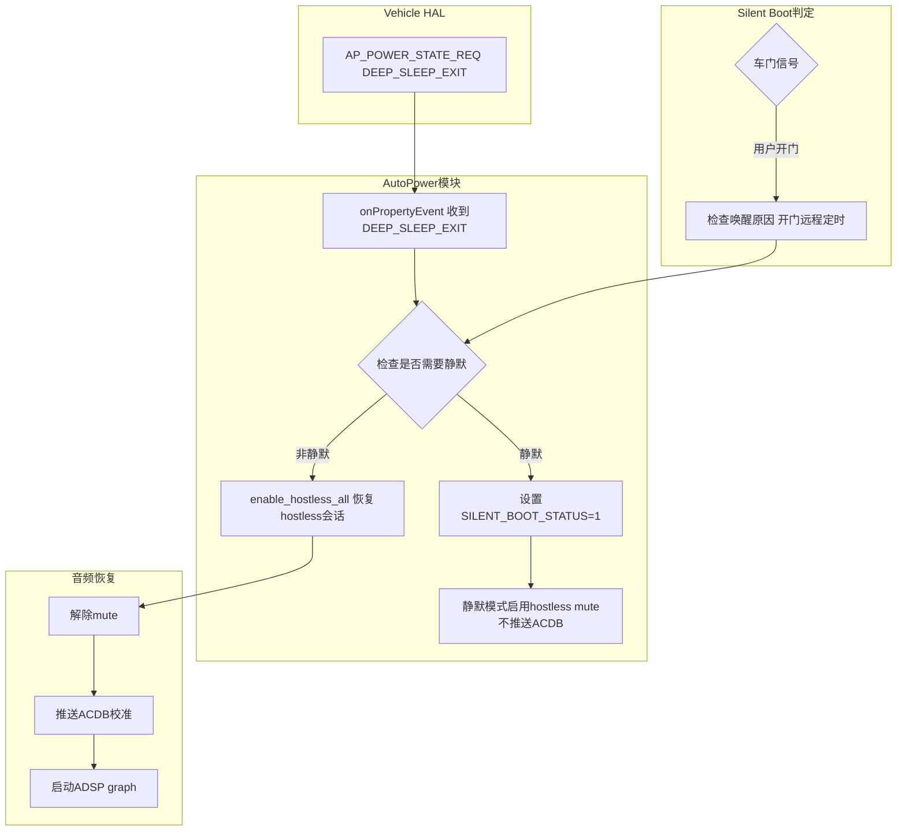
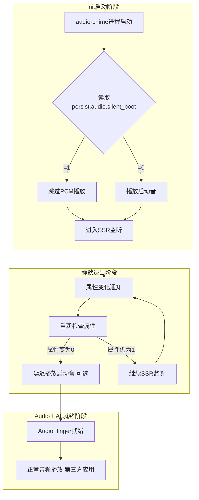
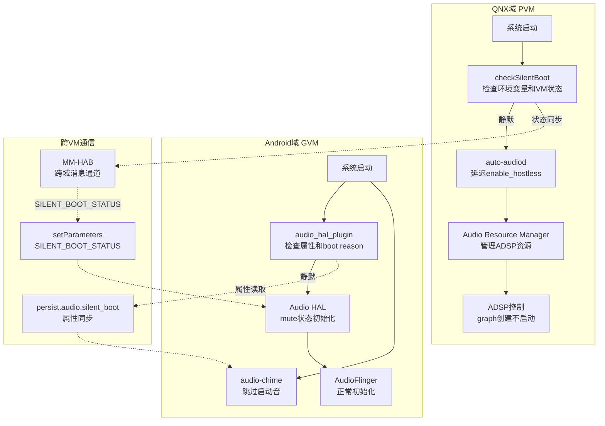

[← 上一个](16_3.1_AutoPower与VHAL集成.md) | [← 返回16章](README.md) | [返回导航](../README.md) | [下一个 →](16_5.1_audio-chime早期提示音.md)

---

## 16.4 Silent Boot监控

> **核心定位**：Silent Boot（静默启动）是SA8295车载系统的特殊启动模式，在OTA升级后重启、Deep Sleep低功耗唤醒、异常重启等场景下，系统必须在不产生任何音频输出的情况下完成启动，避免突然播放声音惊扰用户。`audio_hal_plugin`与`auto-audiod`通过系统属性、VHAL信号和`setParameters`接口协同实现静默启动的判定、传播和音频抑制，涉及Android域和QNX域的双重管控。

### 16.4.1 静默启动模式概述

车载系统与手机/平板的核心区别之一：车辆在用户不在座位时可能频繁重启（OTA升级、定时唤醒、异常恢复），此时如果突然播放启动音或导航提示音，会造成严重的用户体验问题甚至安全隐患。Silent Boot机制正是为此设计。



**Silent Boot的核心目标**：

| 目标 | 说明 |
|------|------|
| 避免惊扰用户 | 系统后台重启时用户可能不在车内，突然播放声音会造成困扰 |
| 安全合规 | 意外音频输出可能干扰驾驶员注意力，违反功能安全要求 |
| 体验一致性 | 与整车电源状态联动，音频行为匹配用户预期 |
| 系统稳定性 | 异常重启后抑制音频，避免在未稳定状态下产生不可控输出 |

### 16.4.2 Silent Boot触发场景深度分析

#### 16.4.2.1 OTA升级后重启

OTA（Over-The-Air）升级是车载系统最常见的静默启动触发场景。升级通常在车辆停放时进行，完成后自动重启：

```
OTA升级流程：
1. TCU接收OTA升级包
2. 验证签名与完整性
3. 写入A/B分区（双分区设计）
4. 设置boot reason = "ota"
5. 重启进入新分区
6. 新系统启动 → 检测到boot reason → 进入Silent Boot
7. 静默完成系统初始化
8. 等待用户下一次开门 → 退出静默模式
```

**关键属性**：
- `sys.boot.reason` = `"ota"` 或 `"reboot,ota"`
- `persist.audio.silent_boot` 可能被OTA脚本预设为1

#### 16.4.2.2 Deep Sleep低功耗唤醒

SA8295支持Deep Sleep模式，车辆熄火后系统进入极低功耗状态，仅保留内存供电。当用户远程控车或定时任务触发唤醒时：

```
Deep Sleep唤醒流程：
1. VHAL下发AP_POWER_STATE_REQ = ON (DEEP_SLEEP_EXIT)
2. AutoPower收到DEEP_SLEEP_EXIT事件
3. 系统从Deep Sleep恢复（非完整重启）
4. 音频子系统需要恢复hostless会话
5. 判定是否需要静默：取决于唤醒原因
   - 远程控车（预热座椅等）→ 静默
   - 用户开门 → 非静默
6. 如果静默，hostless启用但不产生可听输出
```

**与AutoPower的协同**：Deep Sleep退出后，AutoPower调用`enable_hostless_all()`恢复MERC和A2B会话，但如果是静默唤醒，需要先设置`SILENT_BOOT_STATUS=1`再启用hostless。

#### 16.4.2.3 异常重启

系统因异常原因重启时必须进入静默模式，避免在不稳定状态下产生音频输出：

| 异常类型 | boot reason字符串 | 风险等级 |
|---------|------------------|---------|
| 温度过高 | `thermal` / `reboot,thermal` | 高 - 硬件可能不稳定 |
| 看门狗超时 | `watchdog` / `reboot,watchdog` | 高 - 系统曾无响应 |
| 内核崩溃 | `kernel_panic` / `reboot,kernel_panic` | 高 - 内核状态异常 |
| 强制重启 | `reboot` / `reboot,forced` | 中 - 可能用户触发 |
| 未知原因 | `unknown` / 空 | 中 - 无法确定安全性 |

#### 16.4.2.4 工厂模式与定时唤醒

**工厂模式**：产线测试时可能需要静默启动以避免在产线环境中产生噪声。通过`ro.factorytest`属性或特定编译配置控制。

**定时唤醒**：车辆定时唤醒执行后台任务（如日志上传、状态检查），此时用户不在车内，必须静默启动。

### 16.4.3 静默启动判定逻辑的完整实现

#### 16.4.3.1 判定逻辑架构

静默启动的判定是多层级的，从系统属性、启动原因到VHAL信号，构成完整的判定链：



#### 16.4.3.2 audio_hal_plugin判定实现

```cpp
// audio_hal_plugin中的静默启动检查（完整实现）
bool AudioHalPlugin::isSilentBootMode() {
    // ===== Step 1: 检查持久化属性（最高优先级）=====
    // persist.audio.silent_boot 可由OTA脚本或系统服务预设
    char value[PROPERTY_VALUE_MAX] = {0};
    property_get("persist.audio.silent_boot", value, "0");
    if (strcmp(value, "1") == 0) {
        ALOGI("[SilentBoot] Detected by persist.audio.silent_boot=1");
        return true;
    }
    if (strcmp(value, "0") == 0) {
        ALOGI("[SilentBoot] Explicitly disabled by persist.audio.silent_boot=0");
        return false;
    }

    // ===== Step 2: 检查启动原因（次优先级）=====
    char bootreason[PROPERTY_VALUE_MAX] = {0};
    property_get("sys.boot.reason", bootreason, "");
    if (strlen(bootreason) > 0) {
        // 异常重启场景 → 强制静默
        static const char* silent_reasons[] = {
            "thermal",         // 温度保护重启
            "watchdog",        // 看门狗超时
            "kernel_panic",    // 内核崩溃
            "ota",             // OTA升级重启
            "recovery",        // 恢复模式重启
            NULL
        };
        for (int i = 0; silent_reasons[i] != NULL; i++) {
            if (strstr(bootreason, silent_reasons[i])) {
                ALOGI("[SilentBoot] Detected by boot reason: %s (matched: %s)",
                      bootreason, silent_reasons[i]);
                return true;
            }
        }
    }

    // ===== Step 3: 检查启动模式 =====
    char bootmode[PROPERTY_VALUE_MAX] = {0};
    property_get("ro.bootmode", bootmode, "");
    if (strstr(bootmode, "silent") || strstr(bootmode, "factory")) {
        ALOGI("[SilentBoot] Detected by boot mode: %s", bootmode);
        return true;
    }

    // ===== Step 4: 检查工厂测试标记 =====
    char factorytest[PROPERTY_VALUE_MAX] = {0};
    property_get("ro.factorytest", factorytest, "0");
    if (strcmp(factorytest, "1") == 0) {
        ALOGI("[SilentBoot] Detected by factory test mode");
        return true;
    }

    ALOGI("[SilentBoot] Normal boot detected, reason=%s, mode=%s",
          bootreason, bootmode);
    return false;
}
```

**判定优先级规则**：

| 优先级 | 输入源 | 属性名 | 说明 |
|--------|--------|--------|------|
| 1（最高） | 持久化属性 | `persist.audio.silent_boot` | 显式设置，可覆盖其他判定 |
| 2 | 启动原因 | `sys.boot.reason` | 内核级信息，可信度高 |
| 3 | 启动模式 | `ro.bootmode` | 编译时或bootloader设置 |
| 4 | 工厂标记 | `ro.factorytest` | 产线测试专用 |

#### 16.4.3.3 auto-audiod侧判定

QNX域的auto-audiod也参与静默启动判定，通过MM-HAB获取VM启动状态：

```cpp
// auto-audiod中的静默启动判定
bool AutoAudioDaemon::checkSilentBoot() {
    // 检查QNX侧环境变量
    const char* silent_env = getenv("SILENT_BOOT");
    if (silent_env && strcmp(silent_env, "1") == 0) {
        ALOGI("[SilentBoot] QNX env SILENT_BOOT=1");
        return true;
    }

    // 检查Android VM的启动状态（通过MM-HAB查询）
    // 当Android VM因OTA或异常重启时，QNX可以感知
    int vm_state = mHabConnection.getVmState(VM_ID_ANDROID);
    if (vm_state == VM_STATE_REBOOTING) {
        // Android正在重启，判断重启原因
        char reboot_reason[64] = {0};
        mHabConnection.getVmRebootReason(VM_ID_ANDROID, reboot_reason, sizeof(reboot_reason));
        if (isAbnormalRebootReason(reboot_reason)) {
            ALOGI("[SilentBoot] Android VM abnormal reboot: %s", reboot_reason);
            return true;
        }
    }

    return false;
}
```

**双域判定一致性**：Android域和QNX域需要独立判定但结果一致。通过以下机制保证：
1. `persist.audio.silent_boot`属性通过property service共享
2. auto-audiod通过`setParameters`将QNX侧判定结果传递给Android域
3. 最终以Android域audio_hal_plugin的判定为准（因为它同时考虑了VHAL信号）

### 16.4.4 音频抑制的完整机制

#### 16.4.4.1 抑制策略总览

静默启动模式下的音频抑制是系统性的，涉及从应用层到DSP的多个层级。每个组件有独立的抑制策略，但通过统一的`SILENT_BOOT_STATUS`参数协调：



#### 16.4.4.2 各组件抑制策略详解

**1. audio-chime抑制**

audio-chime是系统启动最早的音频输出者。在正常启动时，它在AudioFlinger就绪前直接通过tinyalsa PCM播放启动音；静默启动时必须跳过播放：

```cpp
// audio-chime的静默启动检查
int main(int argc, char *argv[]) {
    // 最早期的静默启动检查
    char silent_boot[PROPERTY_VALUE_MAX] = {0};
    property_get("persist.audio.silent_boot", silent_boot, "0");

    if (strcmp(silent_boot, "1") == 0) {
        ALOGI("[audio-chime] Silent boot detected, skipping chime playback");
        // 仍然初始化ACDB和mixer（为后续正常播放做准备）
        // 但跳过PCM写入
        goto skip_playback;
    }

    // 正常流程：播放启动音
    playChimeSound();

skip_playback:
    // 进入SSR监听循环（无论是否静默）
    // 静默启动后，当系统退出静默模式时，可以通过SSR回调恢复
    while (1) {
        sleep(1);
        monitorSoundCardStatus();
    }
    return 0;
}
```

**2. auto-audiod抑制**

auto-audiod控制着hostless会话（MERC、A2B）的启用/禁用。静默启动时需要延迟启用：

```cpp
// auto-audiod静默启动处理
void AutoAudioDaemon::handleSilentBoot() {
    mSilentBootMode = true;
    ALOGI("[auto-audiod] Entering silent boot mode");

    // 1. 不立即调用enable_hostless_all()
    //    而是标记状态，等待Audio HAL就绪信号
    mHostlessEnabled = false;

    // 2. 仍然初始化与QNX Audio Resource Manager的连接
    //    但不发送enable请求

    // 3. 注册Audio HAL状态监听
    //    当收到Audio HAL的"ready"信号且静默模式已解除时，
    //    再执行enable_hostless_all()
    registerAudioHalReadyCallback();
}

// 静默模式解除后恢复
void AutoAudioDaemon::exitSilentBoot() {
    if (!mSilentBootMode) return;

    ALOGI("[auto-audiod] Exiting silent boot mode");
    mSilentBootMode = false;

    // 现在可以安全地启用hostless会话
    enable_hostless_all();

    // 通知Audio HAL静默模式已解除
    notifySilentBootStatus(false);
}
```

**3. Audio HAL抑制**

Audio HAL在静默启动时的抑制策略最为关键——它需要完成设备初始化但保持mute状态：

```cpp
// Audio HAL静默启动处理
status_t AudioHal::handleSilentBoot() {
    // 1. 正常打开所有PCM设备（ALSA需要初始化）
    //    但设置初始音量为0或mute
    for (auto& device : mOutputDevices) {
        device->open();
        device->setMute(true);  // 保持mute直到退出静默
    }

    // 2. 正常初始化PAL（PAL需要与ADSP建立连接）
    //    但不推送ACDB校准数据
    pal_init();
    // acdb_send_cal() 延迟调用

    // 3. 设置路由但不激活graph
    //    AudioReach graph创建但不START

    ALOGI("[AudioHal] Silent boot: devices initialized but muted");
    return OK;
}
```

**4. ACDB校准延迟**

ACDB校准数据推送到ADSP是音频输出链路的关键环节。静默启动时延迟推送：

| 校准类型 | 正常启动 | 静默启动 | 恢复时机 |
|---------|---------|---------|---------|
| FE ACDB（前端设备校准） | HAL初始化时推送 | 延迟到退出静默 | 静默解除后立即推送 |
| BE ACDB（后端设备校准） | hostless启用时推送 | 延迟到hostless启用 | 与hostless启用同步 |
| Stream ACDB（流校准） | 流打开时推送 | 不影响（无流打开） | 正常流程 |
| Device ACDB（设备校准） | 路由设置时推送 | 延迟到路由激活 | 与路由激活同步 |

**5. GSL/ADSP层抑制**

在ADSP侧，静默启动的抑制通过AudioReach graph的生命周期控制实现：

- **正常启动**：graph CREATED → STARTED → 运行
- **静默启动**：graph CREATED（仅创建不启动）→ 等待信号 → STARTED

GSL收到graph START命令时，如果检测到`SILENT_BOOT_STATUS=1`，会将命令缓存在队列中，直到收到静默解除信号。

### 16.4.5 audio_hal_plugin通信机制深度解析

#### 16.4.5.1 setParameters接口

`setParameters`是Android Audio HAL的标准键值对参数接口，在此用于传递静默启动状态：

```cpp
// auto-audiod通知Audio HAL静默启动状态
void AutoAudioDaemon::notifySilentBootStatus(bool is_silent) {
    if (mPrimaryDevice == nullptr) {
        ALOGE("[SilentBoot] Primary device not available");
        return;
    }

    // 构造参数字符串
    // 格式：SILENT_BOOT_STATUS=1 或 SILENT_BOOT_STATUS=0
    char param[64];
    snprintf(param, sizeof(param), "SILENT_BOOT_STATUS=%s",
             is_silent ? "1" : "0");

    // 通过HIDL setParameters接口传递
    mPrimaryDevice->setParameters(0 /*halVersion*/, param,
        [&](int ret) {
            if (ret != 0) {
                ALOGE("[SilentBoot] Failed to set SILENT_BOOT_STATUS: %d", ret);
            } else {
                ALOGI("[SilentBoot] SILENT_BOOT_STATUS=%s set successfully",
                      is_silent ? "1" : "0");
            }
        });
}
```

#### 16.4.5.2 参数格式与扩展

`setParameters`支持同时传递多个参数，以分号分隔。Silent Boot相关的参数集：

```
SILENT_BOOT_STATUS=1;SILENT_BOOT_REASON=ota;SILENT_BOOT_TIMESTAMP=1672531200
```

| 参数名 | 值域 | 说明 |
|--------|------|------|
| `SILENT_BOOT_STATUS` | `0` / `1` | 静默启动状态标志 |
| `SILENT_BOOT_REASON` | 字符串 | 静默启动原因（用于日志和调试） |
| `SILENT_BOOT_TIMESTAMP` | Unix时间戳 | 静默启动设置时间（用于超时检测） |

#### 16.4.5.3 通信时序



#### 16.4.5.4 通信可靠性保障

跨域通信的可靠性是Silent Boot机制的关键。以下措施确保通信不丢失：

1. **重试机制**：`setParameters`调用失败时，auto-audiod会以100ms间隔重试，最多3次
2. **状态同步**：auto-audiod定期（每5秒）检查audio_hal_plugin的静默状态是否与自身一致
3. **属性持久化**：`persist.audio.silent_boot`作为跨进程/跨重启的状态备份
4. **心跳检测**：auto-audiod通过MM-HAB与QNX域保持心跳，确保跨域通信畅通

```cpp
// 重试逻辑
int AutoAudioDaemon::setSilentBootStatusWithRetry(bool is_silent) {
    char param[64];
    snprintf(param, sizeof(param), "SILENT_BOOT_STATUS=%s",
             is_silent ? "1" : "0");

    for (int retry = 0; retry < MAX_RETRY_COUNT; retry++) {
        int result = -1;
        mPrimaryDevice->setParameters(0, param,
            [&](int ret) { result = ret; });

        if (result == 0) return 0;  // 成功

        ALOGW("[SilentBoot] Retry %d/%d: setParameters failed (ret=%d)",
              retry + 1, MAX_RETRY_COUNT, result);
        usleep(RETRY_INTERVAL_MS * 1000);  // 100ms
    }

    ALOGE("[SilentBoot] All retries exhausted, falling back to property");
    // 降级方案：通过属性设置
    property_set("persist.audio.silent_boot", is_silent ? "1" : "0");
    return -1;
}
```

### 16.4.6 与AutoPower的协同

#### 16.4.6.1 Deep Sleep退出后的静默恢复

AutoPower模块负责监听VHAL电源状态变化。当Deep Sleep退出时，AutoPower与Silent Boot机制的协同至关重要：



#### 16.4.6.2 AutoPower与Silent Boot交互时序

Deep Sleep退出场景下的完整时序：

```
时间线：
T0: VHAL下发 AP_POWER_STATE_REQ = ON (DEEP_SLEEP_EXIT)
T1: AutoPower.onPropertyEvent() 收到事件
T2: AutoPower 查询唤醒原因（VHAL或车门信号）
T3: 判定结果 → 静默/非静默
    ├── 非静默（用户开门）：
    │   T4a: enable_hostless_all() → 正常恢复
    │   T5a: 上报 AP_POWER_STATE_REPORT = DEEP_SLEEP_EXIT
    │
    └── 静默（远程唤醒/定时唤醒）：
        T4b: 设置 SILENT_BOOT_STATUS=1
        T5b: enable_hostless_all() → hostless启用但mute
        T6b: 上报 AP_POWER_STATE_REPORT = DEEP_SLEEP_EXIT
        T7b: 等待用户开门信号
        T8b: 收到开门信号 → SILENT_BOOT_STATUS=0 → unmute
```

#### 16.4.6.3 关键代码：AutoPower集成

```cpp
// AutoPower中Deep Sleep退出的静默处理
void AutoPower::handleDeepSleepExit() {
    ALOGI("[AutoPower] Handling Deep Sleep Exit");

    // 1. 检查唤醒原因
    bool is_silent = shouldEnterSilentMode();

    if (is_silent) {
        ALOGI("[AutoPower] Silent wake-up detected");
        // 先通知Audio HAL进入静默模式
        mAudioDaemon->notifySilentBootStatus(true);

        // 等待100ms确保静默状态已传播
        usleep(100000);

        // 然后启用hostless（此时Audio HAL已知是静默模式）
        enable_hostless_all();
    } else {
        ALOGI("[AutoPower] Normal wake-up (user present)");
        // 正常恢复，无需静默
        enable_hostless_all();
    }

    // 上报Deep Sleep退出状态
    reportPowerState(VehicleApPowerStateReport::DEEP_SLEEP_EXIT);
}

bool AutoPower::shouldEnterSilentMode() {
    // 检查车门状态（通过VHAL查询）
    int door_status = getVehicleProperty(VEHICLE_PROPERTY_DOOR_STATUS);
    bool any_door_open = (door_status & 0x0F) != 0;

    if (any_door_open) {
        return false;  // 有门打开，用户在场
    }

    // 检查唤醒源
    char wake_reason[PROPERTY_VALUE_MAX] = {0};
    property_get("sys.wake_reason", wake_reason, "");
    if (strstr(wake_reason, "door") || strstr(wake_reason, "key_fob")) {
        return false;  // 用户主动唤醒
    }

    // 默认：远程或定时唤醒 → 静默
    return true;
}
```

### 16.4.7 与audio-chime的交互

#### 16.4.7.1 启动音抑制逻辑

audio-chime是SA8295平台最早的音频输出组件，在静默启动时必须被抑制。由于audio-chime运行在Android init早期阶段，其抑制逻辑需要特殊处理：



#### 16.4.7.2 延迟播放策略

静默启动后退出静默时，是否补播启动音取决于OEM配置：

| 策略 | 说明 | 适用场景 |
|------|------|---------|
| 不补播 | 静默退出后直接进入正常模式 | OTA升级、异常重启 |
| 补播启动音 | 静默退出后播放一次启动音 | Deep Sleep唤醒（用户开门时） |
| 延迟到AudioFlinger就绪 | 等AudioFlinger正常后由系统播放 | 安全性要求高的场景 |

```cpp
// audio-chime延迟播放逻辑
void AudioChime::handleSilentBootExit() {
    char chime_policy[PROPERTY_VALUE_MAX] = {0};
    property_get("persist.audio.chime.silent_policy", chime_policy, "skip");

    if (strcmp(chime_policy, "replay") == 0) {
        // 补播启动音
        ALOGI("[audio-chime] Replaying chime after silent boot exit");
        playChimeSound();
    } else if (strcmp(chime_policy, "defer") == 0) {
        // 延迟到AudioFlinger就绪后由系统播放
        ALOGI("[audio-chime] Deferring chime to AudioFlinger");
        property_set("persist.audio.chime.deferred", "1");
    } else {
        // 默认：不补播
        ALOGI("[audio-chime] Skipping chime replay after silent boot");
    }
}
```

#### 16.4.7.3 SSR与Silent Boot

audio-chime还监听声卡SSR（Subsystem Restart）事件。SSR触发时需要重新判断是否应进入静默模式：

```cpp
// audio-chime SSR回调中的静默判断
void AudioChime::onSsrEvent(int card_state) {
    if (card_state == CARD_STATUS_OFFLINE) {
        ALOGW("[audio-chime] Sound card went offline (SSR)");
        mSoundCardOnline = false;
    } else if (card_state == CARD_STATUS_ONLINE) {
        ALOGI("[audio-chime] Sound card back online");
        mSoundCardOnline = true;

        // SSR恢复后重新检查静默状态
        char silent_boot[PROPERTY_VALUE_MAX] = {0};
        property_get("persist.audio.silent_boot", silent_boot, "0");

        if (strcmp(silent_boot, "1") != 0) {
            // 非静默模式 → 重新初始化ACDB和mixer
            initAcdb();
            initMixer();
        } else {
            // 仍然在静默模式 → 仅重新初始化，不播放
            initAcdb();
            initMixer();
            ALOGI("[audio-chime] SSR recovery in silent mode, skip playback");
        }
    }
}
```

### 16.4.8 静默启动完整时序图

从系统启动到音频恢复的完整流程，覆盖Android域和QNX域的双重处理：

```mermaid
sequenceDiagram
    participant HW as 硬件/Bootloader
    participant QNX as QNX域 auto-audiod
    participant AND as Android域 init
    participant CHIME as audio-chime
    participant PLUGIN as audio_hal_plugin
    participant AHAL as Audio HAL
    participant AF as AudioFlinger
    participant VHAL as VHAL
    participant AP as AutoPower

    Note over HW,AP: 阶段1 系统启动与静默判定

    HW->>QNX: 上电启动
    QNX->>QNX: 检查启动环境变量
    QNX->>QNX: checkSilentBoot() true
    QNX->>QNX: 标记mSilentBootMode=true

    HW->>AND: Android启动
    AND->>AND: init读取boot reason
    AND->>AND: 设置persist.audio.silent_boot=1

    Note over HW,AP: 阶段2 早期组件抑制

    AND->>CHIME: 启动audio-chime
    CHIME->>CHIME: 读取persist.audio.silent_boot
    CHIME->>CHIME: 检测到静默模式
    CHIME-->>CHIME: 跳过PCM播放仅初始化ACDB和Mixer

    Note over HW,AP: 阶段3 Audio HAL初始化

    AND->>AHAL: 启动Audio HAL
    AHAL->>PLUGIN: 初始化audio_hal_plugin
    PLUGIN->>PLUGIN: isSilentBootMode() true
    QNX->>PLUGIN: setParameters SILENT_BOOT_STATUS=1
    PLUGIN->>AHAL: 静默模式确认
    AHAL->>AHAL: 打开设备但设置mute
    AHAL->>AHAL: pal_init但不推送ACDB

    Note over HW,AP: 阶段4 AudioFlinger与AutoPower

    AND->>AF: 启动AudioFlinger
    AF->>AHAL: 打开primary输出
    AHAL-->>AF: 设备就绪mute状态

    AND->>AP: 启动AutoPower
    AP->>VHAL: subscribe电源属性
    AP->>AP: 检查当前电源状态

    Note over HW,AP: 阶段5 静默退出用户开门

    VHAL->>AP: 车门打开事件
    AP->>AP: 判定用户在场
    AP->>QNX: 通知退出静默
    QNX->>PLUGIN: setParameters SILENT_BOOT_STATUS=0
    PLUGIN->>AHAL: 解除静默
    AHAL->>AHAL: unmute 推送ACDB
    QNX->>QNX: enable_hostless_all()
    QNX->>QNX: 通知ADSP激活graph

    AND->>AND: persist.audio.silent_boot=0
    CHIME->>CHIME: 检测属性变化
    CHIME->>CHIME: handleSilentBootExit()

    Note over HW,AF: 阶段6 正常音频恢复
```

### 16.4.9 双域架构下的静默启动

#### 16.4.9.1 QNX域与Android域的职责划分

在SA8295的QNX(PVM)+Android(GVM)双域架构中，Silent Boot需要两个域各自独立处理，同时通过MM-HAB跨域通信保持状态一致：



#### 16.4.9.2 QNX域独立判定

QNX域不依赖Android域的属性系统，而是使用自己的判定机制：

| 判定输入 | QNX域 | Android域 |
|---------|-------|----------|
| 环境变量 | `SILENT_BOOT` env | N/A |
| 启动原因 | MM-HAB查询VM状态 | `sys.boot.reason`属性 |
| 配置文件 | QNX配置文件 | `persist.audio.silent_boot` |
| VHAL信号 | 通过MM-HAB间接获取 | 直接订阅VHAL |

**QNX域先启动的关键影响**：QNX域总是先于Android域启动，因此auto-audiod的静默判定可能比Android域更早完成。这意味着：

1. auto-audiod可能在Android域的audio_hal_plugin还未初始化时就已确定静默状态
2. auto-audiod需要缓存静默判定结果，等待Android域Audio HAL就绪后再通过`setParameters`同步
3. 如果QNX域判定为静默但Android域未判定为静默（不一致），以Android域判定为准

#### 16.4.9.3 跨域状态同步机制

```cpp
// auto-audiod：缓存静默状态，等待Audio HAL就绪后同步
void AutoAudioDaemon::onAudioHalReady() {
    ALOGI("[auto-audiod] Audio HAL is now ready");

    // 如果之前已判定为静默但还未通知Audio HAL
    if (mSilentBootMode && !mSilentBootNotified) {
        ALOGI("[auto-audiod] Syncing cached silent boot status to Audio HAL");
        notifySilentBootStatus(true);
        mSilentBootNotified = true;
    }

    // 如果不是静默模式，正常启用hostless
    if (!mSilentBootMode) {
        enable_hostless_all();
    }
}

// Android域：接收QNX域的静默状态
void AudioHalPlugin::onSetParameters(const char* kvpairs) {
    // 解析SILENT_BOOT_STATUS参数
    char status[16] = {0};
    if (parseKVPair(kvpairs, "SILENT_BOOT_STATUS", status, sizeof(status))) {
        bool is_silent = (strcmp(status, "1") == 0);

        // 与自身判定结果比较
        bool my_judgment = isSilentBootMode();

        if (is_silent != my_judgment) {
            ALOGW("[SilentBoot] Judgment mismatch: QNX=%d, Android=%d",
                  is_silent, my_judgment);
            // 以Android域判定为准，但记录QNX域的判定用于调试
        }

        // 应用静默状态
        applySilentBootStatus(is_silent);
    }
}
```

### 16.4.10 调试与验证方法

#### 16.4.10.1 关键属性查询

通过adb查询Silent Boot相关的系统属性：

```bash
# 查询静默启动状态
adb shell getprop persist.audio.silent_boot

# 查询启动原因
adb shell getprop sys.boot.reason

# 查询启动模式
adb shell getprop ro.bootmode

# 查询工厂测试模式
adb shell getprop ro.factorytest

# 查询audio-chime延迟播放策略
adb shell getprop persist.audio.chime.silent_policy
```

#### 16.4.10.2 手动触发静默启动

用于测试和验证：

```bash
# 手动设置静默启动（下次重启生效）
adb shell setprop persist.audio.silent_boot 1

# 手动解除静默（运行时生效）
adb shell setprop persist.audio.silent_boot 0

# 模拟OTA重启场景
adb shell setprop persist.audio.silent_boot 1
adb reboot
# 重启后系统应静默，无启动音

# 通过setParameters直接通知Audio HAL
adb shell "audio-hal-test set-param SILENT_BOOT_STATUS=1"
```

#### 16.4.10.3 日志过滤

```bash
# 过滤Silent Boot相关日志
adb logcat -s SilentBoot AudioHalPlugin AutoPower audio-chime auto-audiod

# 过滤setParameters调用
adb logcat | grep "SILENT_BOOT_STATUS"

# 过滤静默启动判定过程
adb logcat | grep "\[SilentBoot\]"

# 过滤AutoPower电源事件
adb logcat | grep "AutoPower.*Deep.Sleep"
```

#### 16.4.10.4 时序验证清单

验证Silent Boot是否正确工作，需检查以下关键时序点：

| 序号 | 检查项 | 预期结果 | 验证方法 |
|------|--------|---------|---------|
| 1 | 静默判定 | `isSilentBootMode()` 返回true | 日志：`[SilentBoot] Detected by` |
| 2 | audio-chime跳过 | 不播放启动音 | 无PCM写入日志 |
| 3 | Audio HAL mute | 设备初始化但mute | 日志：`Silent boot: devices initialized but muted` |
| 4 | hostless延迟 | `enable_hostless_all()` 未调用 | 无hostless启用日志 |
| 5 | ACDB延迟 | 未推送校准数据 | 无`acdb_loader_send`日志 |
| 6 | 静默退出 | 收到开门信号后解除 | 日志：`Exiting silent boot mode` |
| 7 | 音频恢复 | unmute + ACDB推送 + graph启动 | 正常音频输出 |

#### 16.4.10.5 常见问题排查

**问题1：静默启动后始终无音频输出**

```
症状：系统进入静默模式后，即使用户开门也不恢复音频
排查步骤：
1. 检查persist.audio.silent_boot是否已清零
   adb shell getprop persist.audio.silent_boot
2. 检查AutoPower是否收到车门信号
   adb logcat | grep "AutoPower.*door"
3. 检查setParameters SILENT_BOOT_STATUS=0是否发送
   adb logcat | grep "SILENT_BOOT_STATUS=0"
4. 检查Audio HAL是否成功unmute
   adb logcat | grep "unmute"
根因：通常是车门信号未正确传递到AutoPower，
       或setParameters调用失败（auto-audiod未重试）
```

**问题2：OTA升级后仍播放启动音**

```
症状：OTA升级重启后audio-chime仍然播放启动音
排查步骤：
1. 检查boot reason是否正确设置
   adb shell getprop sys.boot.reason
2. 检查audio-chime启动时属性值
   adb logcat | grep "audio-chime.*silent_boot"
3. 检查OTA脚本是否设置persist.audio.silent_boot
4. 检查audio-chime是否在属性设置前就已启动（时序竞争）
根因：通常是audio-chime启动早于属性设置，
       需要OTA脚本在init早期设置属性
```

**问题3：异常重启后hostless未恢复**

```
症状：异常重启（如watchdog）后hostless会话未启用
排查步骤：
1. 检查auto-audiod是否判定为静默
   adb logcat | grep "auto-audiod.*silent"
2. 检查静默退出是否触发enable_hostless_all()
   adb logcat | grep "enable_hostless_all"
3. 检查QNX域Audio Resource Manager状态
   通过QNX调试接口查看ARM状态
4. 检查MM-HAB跨域通信是否正常
根因：异常重启后MM-HAB通道可能需要重连，
       auto-audiod在通信恢复前无法通知Audio HAL
```

**问题4：QNX域与Android域判定不一致**

```
症状：QNX域判定静默但Android域判定正常（或反之）
排查步骤：
1. 比较两侧的判定日志
   QNX: slog2info | grep "SilentBoot"
   Android: adb logcat | grep "SilentBoot"
2. 检查QNX环境变量和Android属性是否匹配
3. 检查MM-HAB跨域通信是否成功
4. 确认最终采用的判定结果（应以Android域为准）
根因：通常是一侧缺少判定输入（如QNX未获取到boot reason），
       需要确保两侧都能获取完整的判定信息
```

### 16.4.11 静默启动配置参数汇总

| 参数 | 类型 | 默认值 | 说明 |
|------|------|--------|------|
| `persist.audio.silent_boot` | 属性 | `0` | 静默启动主开关 |
| `persist.audio.chime.silent_policy` | 属性 | `skip` | audio-chime退出静默后策略：skip/replay/defer |
| `persist.audio.chime.deferred` | 属性 | `0` | audio-chime延迟播放标志 |
| `sys.boot.reason` | 属性 | N/A | 系统启动原因（只读） |
| `ro.bootmode` | 属性 | N/A | 启动模式（只读） |
| `ro.factorytest` | 属性 | `0` | 工厂测试模式 |
| `SILENT_BOOT_STATUS` | setParameters | N/A | 跨进程静默状态通知 |
| `SILENT_BOOT_REASON` | setParameters | N/A | 静默原因（调试用） |
| `SILENT_BOOT_TIMESTAMP` | setParameters | N/A | 静默设置时间戳 |

---

[← 上一个](16_3.1_AutoPower与VHAL集成.md) | [← 返回16章](README.md) | [返回导航](../README.md) | [下一个 →](16_5.1_audio-chime早期提示音.md)