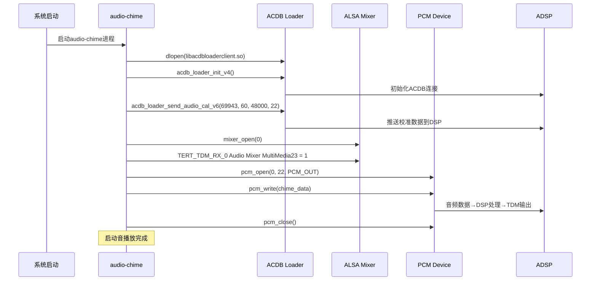

[← N.4 Silent Boot监控](16_4.1_Silent_Boot监控.md) | [← 返回SA8295 Vendor+QNX双域音频架构深度解析](README.md) | [返回导航](../README.md) | [N.6 ACDB校准体系 →](16_6.1_ACDB校准体系.md)

---

N.5 audio-chime早期提示音

N.5.1 架构概述

`audio-chime`是SA8295平台的早期启动音播放应用，它在Android启动早期（AudioFlinger尚未完全就绪时）直接通过tinyalsa PCM API播放提示音，确保用户在车辆启动后能快速听到反馈音。

```mermaid
graph TB
    subgraph AudioChime["audio-chime"]
        MAIN[main入口]
        INIT_ACDB["ACDB初始化<br/>dlopen+acdb_loader_init"]
        INIT_MIXER["Mixer初始化<br/>设置TDM路由"]
        PLAY["PCM播放<br/>tinyalsa接口"]
        SSR_MONITOR["SSR监听<br/>声卡状态恢复"]
    end

    subgraph Dependencies["依赖库"]
        LIBACDB["libacdbloaderclient.so<br/>ACDB客户端库"]
        TINYALSA["libtinyalsa.so<br/>ALSA用户态库"]
    end

    subgraph Kernel_Interface["内核接口"]
        PCM_DEV["/dev/snd/pcmC0D22p<br/>MULTIMEDIA23"]
        MIXER_DEV["/dev/snd/controlC0<br/>Mixer控制"]
    end

    MAIN --> INIT_ACDB
    MAIN --> INIT_MIXER
    MAIN --> PLAY
    MAIN --> SSR_MONITOR
    INIT_ACDB -->|dlopen| LIBACDB
    PLAY -->|pcm_open| PCM_DEV
    INIT_MIXER -->|mixer_ctl_set| MIXER_DEV
```



N.5.2 默认配置参数

```cpp
// audio-chime默认配置
static const struct chime_config {
    int app_type;       // 应用类型ID
    int acdb_id;        // ACDB设备校准ID
    int sample_rate;    // 采样率
    int fedai;          // Front-End DAI ID
    int channels;       // 通道数
    int format;         // PCM格式
} default_chime_config = {
    .app_type    = 69943,           // PAL_STREAM_TYPE_CHIME对应的应用类型
    .acdb_id     = 60,              // 媒体播放ACDB校准ID
    .sample_rate = 48000,           // 48kHz采样
    .fedai       = 22,              // MULTIMEDIA23 = 22 (0-indexed)
    .channels    = 2,               // 立体声
    .format      = PCM_FORMAT_S16_LE,  // 16-bit小端
};
```

N.5.3 ACDB初始化流程

audio-chime在播放启动音之前，必须先通过ACDB推送校准数据到ADSP，确保DSP graph正确配置：

```cpp
int AudioChime::initAcdb() {
    // Step 1: 动态加载ACDB客户端库
    void *acdb_handle = dlopen("libacdbloaderclient.so", RTLD_NOW);
    if (!acdb_handle) {
        ALOGE("Failed to dlopen libacdbloaderclient.so: %s", dlerror());
        return -ENOENT;
    }

    // Step 2: 获取ACDB loader函数指针
    acdb_loader_init_v4_t acdb_loader_init_v4 =
        (acdb_loader_init_v4_t)dlsym(acdb_handle, "acdb_loader_init_v4");
    acdb_loader_send_audio_cal_v6_t acdb_loader_send_audio_cal_v6 =
        (acdb_loader_send_audio_cal_v6_t)dlsym(acdb_handle,
            "acdb_loader_send_audio_cal_v6");

    if (!acdb_loader_init_v4 || !acdb_loader_send_audio_cal_v6) {
        ALOGE("Failed to resolve ACDB loader symbols");
        dlclose(acdb_handle);
        return -ENOENT;
    }

    // Step 3: 初始化ACDB loader
    int ret = acdb_loader_init_v4();
    if (ret != 0) {
        ALOGE("acdb_loader_init_v4 failed: %d", ret);
        return ret;
    }

    // Step 4: 发送音频校准数据
    // 参数：app_type, acdb_id, sample_rate, fedai
    ret = acdb_loader_send_audio_cal_v6(
        default_chime_config.app_type,    // 69943
        default_chime_config.acdb_id,     // 60
        default_chime_config.sample_rate, // 48000
        default_chime_config.fedai        // 22 (MULTIMEDIA23)
    );
    if (ret != 0) {
        ALOGE("acdb_loader_send_audio_cal_v6 failed: %d", ret);
        return ret;
    }

    ALOGI("ACDB calibration sent successfully for chime");
    return 0;
}
```

N.5.4 Mixer路由配置

audio-chime通过ALSA mixer控制配置TDM路由，将MULTIMEDIA23的输出路由到TERT_TDM_RX_0：

```cpp
int AudioChime::configureMixerRoute() {
    struct mixer *mixer = mixer_open(0 /*card*/);
    if (!mixer) {
        ALOGE("Failed to open mixer for card 0");
        return -ENODEV;
    }

    // 配置TERT_TDM_RX_0 Audio Mixer，将MultiMedia23路由到TDM输出
    struct mixer_ctl *ctl = mixer_get_by_name(mixer,
        "TERT_TDM_RX_0 Audio Mixer MultiMedia23");
    if (!ctl) {
        ALOGE("Failed to find TERT_TDM_RX_0 Audio Mixer MultiMedia23");
        mixer_close(mixer);
        return -ENOENT;
    }

    // 启用路由：设置值为1
    mixer_ctl_set_value(ctl, 0, 1);
    ALOGI("Configured TERT_TDM_RX_0 Audio Mixer MultiMedia23 = 1");

    // 可选：配置音量
    struct mixer_ctl *vol_ctl = mixer_get_by_name(mixer,
        "MultiMedia23 Volume");
    if (vol_ctl) {
        // 设置音量到合适级别
        mixer_ctl_set_value(vol_ctl, 0, CHIME_VOLUME_LEVEL);
    }

    mixer_close(mixer);
    return 0;
}
```

N.5.5 PCM播放实现

使用tinyalsa PCM API直接播放音频数据：

```cpp
int AudioChime::playChime(const char *wave_file) {
    struct pcm_config config;
    memset(&config, 0, sizeof(config));
    config.channels = default_chime_config.channels;     // 2
    config.rate = default_chime_config.sample_rate;      // 48000
    config.period_size = 1024;
    config.period_count = 4;
    config.format = default_chime_config.format;         // PCM_FORMAT_S16_LE

    // Step 1: 打开PCM设备 (MULTIMEDIA23 = PCM设备22)
    struct pcm *pcm = pcm_open(0 /*card*/, 22 /*device*/,
                               PCM_OUT, &config);
    if (!pcm_is_ready(pcm)) {
        ALOGE("Failed to open PCM device 22: %s", pcm_get_error(pcm));
        return -ENODEV;
    }

    // Step 2: 读取WAV文件数据
    FILE *fp = fopen(wave_file, "rb");
    if (!fp) {
        ALOGE("Failed to open wave file: %s", wave_file);
        pcm_close(pcm);
        return -ENOENT;
    }

    // Step 3: 写入PCM数据
    char buffer[4096];
    size_t bytes_read;
    while ((bytes_read = fread(buffer, 1, sizeof(buffer), fp)) > 0) {
        if (pcm_write(pcm, buffer, bytes_read) != 0) {
            ALOGE("PCM write error: %s", pcm_get_error(pcm));
            break;
        }
    }

    // Step 4: 清理
    fclose(fp);
    pcm_close(pcm);
    return 0;
}
```

N.5.6 SSR恢复机制

audio-chime注册了声卡状态监听，当ADSP发生SSR重启时，自动重新发送ACDB校准并重启播放：

```cpp
void AudioChime::ssrMonitor() {
    // 监听SND_CARD_STATUS变化
    // 当收到ONLINE通知时：
    //   1. 重新初始化ACDB校准
    //   2. 重新配置Mixer路由
    //   3. 重启PCM播放（如果需要）

    while (!mExitRequested) {
        // 等待声卡状态通知
        char state[32] = {0};
        int fd = open("/proc/asound/card0/state", O_RDONLY);
        read(fd, state, sizeof(state) - 1);
        close(fd);

        if (strncmp(state, "ONLINE", 6) == 0 && mNeedRecovery) {
            ALOGI("SSR recovery: re-initializing chime");
            initAcdb();
            configureMixerRoute();
            mNeedRecovery = false;
        } else if (strncmp(state, "OFFLINE", 7) == 0) {
            ALOGW("Sound card went OFFLINE, marking for recovery");
            mNeedRecovery = true;
        }

        sleep(1);  // 1秒轮询
    }
}
```

N.5.7 启动时序分析



---

---

[← N.4 Silent Boot监控](16_4.1_Silent_Boot监控.md) | [← 返回SA8295 Vendor+QNX双域音频架构深度解析](README.md) | [返回导航](../README.md) | [N.6 ACDB校准体系 →](16_6.1_ACDB校准体系.md)
